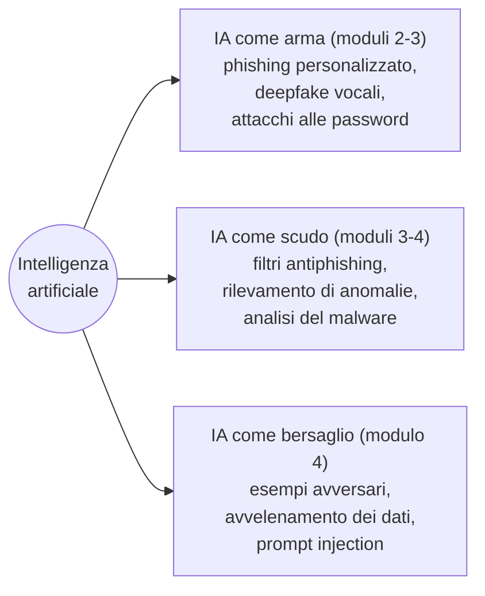
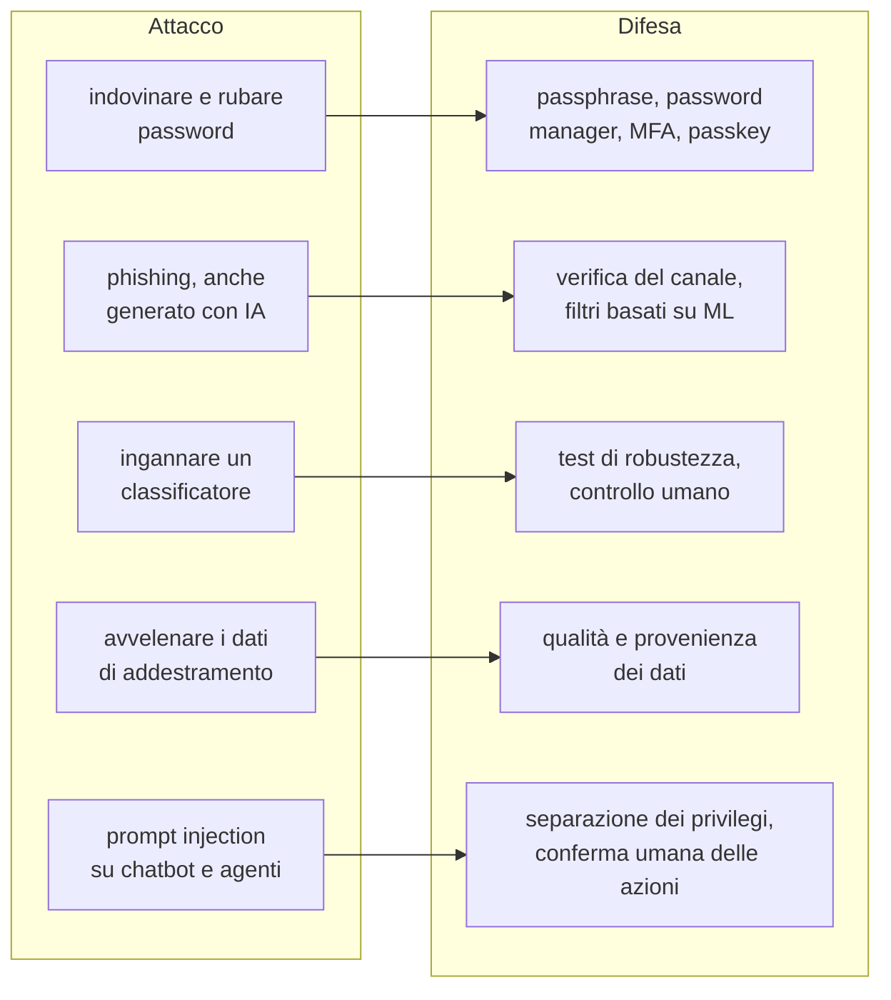
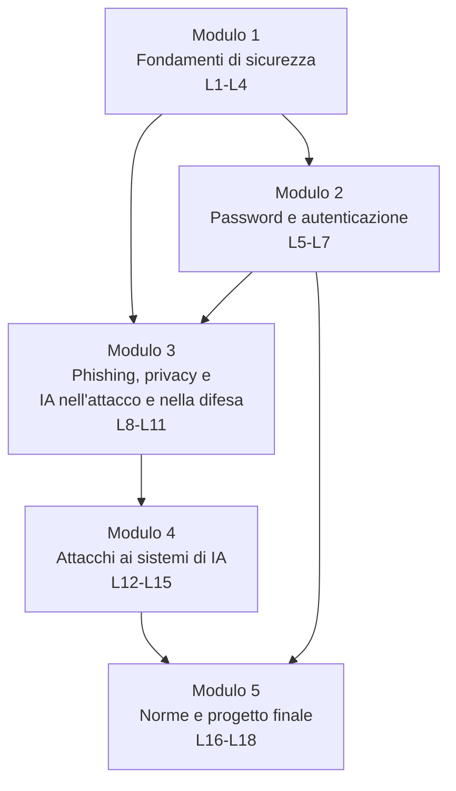
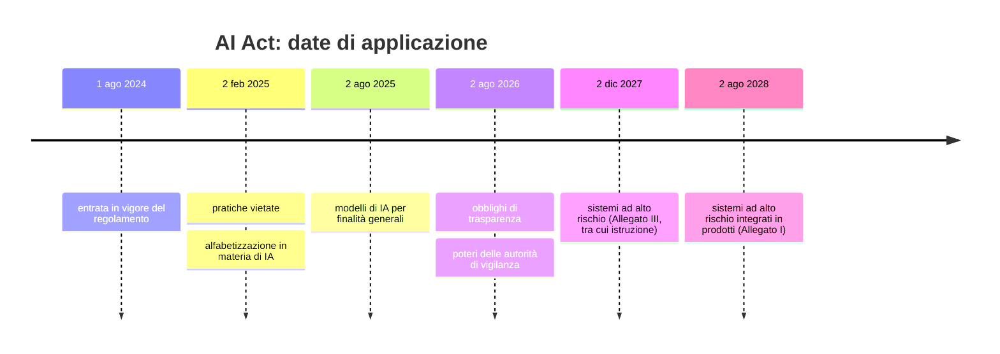

# B.4 - Cybersicurezza e IA

## Scheda del corso

- Titolo: Cybersicurezza e IA: Difendere e attaccare: la sicurezza ai tempi dell'IA
- Tipo: corso introduttivo di cybersicurezza con focus sull'intelligenza artificiale come strumento di attacco, strumento di difesa e bersaglio di attacchi
- Durata: 18 ore, articolate in 18 lezioni autonome di circa un'ora, raggruppabili in sessioni da 2, 3 o 4 ore
- Destinatari della traccia studenti: studenti di scuola secondaria di secondo grado, 16-18 anni
- Destinatari della traccia docenti: docenti che progettano e conducono il corso con la propria classe
- Prerequisiti di cybersicurezza: nessuno
- Prerequisiti informatici: uso ordinario di browser, posta elettronica e file; la programmazione non è richiesta: i notebook Python usati in alcuni laboratori sono forniti già scritti e commentati, e vengono eseguiti e modificati in piccole parti

## Obiettivi

Al termine del corso lo studente è in grado di:

- usare correttamente il lessico di base della sicurezza informatica: riservatezza, integrità, disponibilità, minaccia, vulnerabilità, rischio, attacco, difesa in profondità
- descrivere il funzionamento essenziale di URL, DNS, HTTPS e posta elettronica nella misura necessaria a riconoscere un inganno
- distinguere codifica, cifratura e funzione di hash e spiegare perché le password non si memorizzano in chiaro
- spiegare come vengono attaccate le password e scegliere e gestire credenziali robuste, con password manager e autenticazione multifattore
- riconoscere le forme di phishing (email, SMS, voce, QR code, spear phishing) e spiegare come l'IA generativa le rende più efficaci
- descrivere come l'IA viene usata nella difesa (filtri, rilevamento di anomalie) e quali sono i suoi limiti
- descrivere le principali tecniche di attacco ai sistemi di IA: esempi avversari, avvelenamento dei dati, prompt injection, estrazione di informazioni
- individuare rischi non ovvi per la riservatezza dei dati personali, inclusi quelli legati all'uso di chatbot e assistenti
- indicare i principi essenziali del quadro normativo europeo e italiano: GDPR, AI Act, legge italiana sull'IA, linee guida per la scuola, reati informatici
- adottare un comportamento etico: le tecniche di attacco si studiano per difendersi e si sperimentano solo in ambienti predisposti e autorizzati

## Filo conduttore: attacco e difesa

Ogni argomento è trattato in coppia: come funziona l'attacco, come si difende. L'intelligenza artificiale compare in tre ruoli distinti, che attraversano tutto il corso.

Diagramma: i tre ruoli dell'IA nella sicurezza

Diagramma: coppie attacco-difesa trattate nel corso

## Etica e regole del laboratorio

Le tecniche di attacco vengono mostrate a scopo difensivo. Nel corso:

- ogni attività di attacco si svolge su materiale predisposto dal docente (file, notebook, siti didattici creati per questo scopo) o su piattaforme di esercitazione che lo consentono esplicitamente
- non si attaccano sistemi reali, account altrui, la rete della scuola, compagni o persone reali; le schede OSINT e gli scenari di spear phishing riguardano persone fittizie
- l'accesso abusivo a un sistema informatico è reato anche quando non produce danni (art. 615-ter del codice penale); questo punto è trattato nella prima lezione e ripreso nel modulo 5

## Ambiente di lavoro e vincoli tecnici

Tutti i laboratori sono eseguibili su PC di fascia bassa con un browser aggiornato. Nessun laboratorio richiede privilegi di amministratore. Per ogni attività che usa un servizio online è prevista un'alternativa offline o una dimostrazione del docente.

| Strumento | Tipo | Installazione | Uso nel corso |
|---|---|---|---|
| Browser (Firefox o Chrome) | strumenti per sviluppatori, visualizzazione certificati | già presente | URL, certificati, anatomia delle pagine di phishing |
| CyberChef | applicazione web per codifica, cifratura, hash, analisi di dati | nessuna: versione online o archivio ZIP eseguibile offline dal browser, anche da chiavetta | codifiche, hash, cifrari, decodifica di URL e allegati, estrazione dei metadati EXIF |
| JupyterLite (Try Jupyter) | JupyterLab nel browser, Python eseguito localmente | nessuna, solo browser | notebook su password, TOTP, classificatore antiphishing, avvelenamento dei dati, dati personali |
| WinPython | distribuzione Python portable per Windows | nessuna: si scompatta, anche su chiavetta | alternativa offline completa per i notebook |
| KeePassXC | password manager open source | versione portable ZIP per Windows | creazione e uso di un archivio di password |
| Jigsaw Phishing Quiz | quiz interattivo sul riconoscimento del phishing | nessuna, online (in inglese) | modulo 3 |
| adversarial.js | dimostrazione di esempi avversari su reti neurali, eseguita nel browser | nessuna, online | modulo 4 |
| Lakera Gandalf / Agent Breaker | gioco di prompt injection su un modello linguistico | nessuna, online | modulo 4 |
| Have I Been Pwned | servizio di verifica di credenziali comparse in violazioni di dati | nessuna, online | modulo 2 |

Riferimenti:

- CyberChef: https://gchq.github.io/CyberChef/
- Try Jupyter (JupyterLite): https://jupyter.org/try-jupyter/lab/
- WinPython: https://winpython.github.io/
- KeePassXC, download: https://keepassxc.org/download/
- Jigsaw Phishing Quiz: https://phishingquiz.withgoogle.com/
- adversarial.js: https://kennysong.github.io/adversarial.js/
- Lakera Gandalf: https://gandalf.lakera.ai/
- Have I Been Pwned: https://haveibeenpwned.com/

Tutti i notebook del corso sono forniti come file `.ipynb` locali, apribili in JupyterLite o in WinPython, e usano solo librerie presenti in entrambi (libreria standard di Python, NumPy, pandas, matplotlib, scikit-learn). Tutti i campioni di email, SMS e pagine di phishing usati nei laboratori sono file statici forniti con il corso, resi inoffensivi (link disattivati, allegati rimossi).

## Struttura in moduli

Diagramma: moduli e dipendenze

| Modulo | Lezioni | Ore | Contenuto |
|---|---|---|---|
| 1. Fondamenti di sicurezza | L1-L4 | 4 | concetti di base, rete e posta elettronica, crittografia essenziale, malware e ingegneria sociale |
| 2. Password e autenticazione | L5-L7 | 3 | attacchi alle password, difese, autenticazione multifattore e passkey |
| 3. Phishing, privacy, IA nell'attacco e nella difesa | L8-L11 | 4 | phishing, phishing generato con IA, riservatezza dei dati, difese basate su ML |
| 4. Attacchi ai sistemi di IA | L12-L15 | 4 | esempi avversari, avvelenamento dei dati, prompt injection, uso sicuro di assistenti e agenti |
| 5. Norme e progetto finale | L16-L18 | 3 | quadro normativo, progetto a gruppi, presentazione e valutazione |

## Programma delle lezioni

Ogni lezione dura circa un'ora ed è composta da una parte di spiegazione con dimostrazione dal vivo e da una parte di laboratorio (indicata tra parentesi). Le indicazioni "Traccia docenti" identificano i contenuti di progettazione didattica collegati alla lezione, trattati nei file `_docente.md`.

### Modulo 1 - Fondamenti di sicurezza

#### L1 - Che cos'è la cybersicurezza

Contenuti:

- informazione come bene da proteggere; asset digitali di una persona e di una scuola
- triade RID: riservatezza, integrità, disponibilità (CIA: confidentiality, integrity, availability); autenticità e non ripudio
- minaccia, vulnerabilità, rischio, impatto; superficie di attacco
- chi attacca e perché: criminalità a scopo di lucro, attivisti, attori statali, insider, attacchi opportunistici e mirati
- fasi di un attacco (modello semplificato): ricognizione, accesso iniziale, azione sull'obiettivo
- difesa in profondità: più livelli indipendenti di protezione
- hacking etico, test autorizzati, responsabilità penale (accesso abusivo, art. 615-ter c.p.)
- dove si informano i professionisti: CERT-AGID e le sue sintesi settimanali sulle campagne malevole in Italia

Laboratorio (25 min): lettura guidata di due notizie del CERT-AGID; per ciascuna, individuazione di asset, minaccia, vulnerabilità sfruttata, proprietà RID violata; mappa dei propri asset digitali (account, dispositivi, dati).

Riferimento: CERT-AGID, https://cert-agid.gov.it/

Traccia docenti: regole etiche e patto d'aula; perché iniziare da casi reali italiani; come trattare in classe il tema degli attacchi senza fornire istruzioni operative dannose.

#### L2 - Internet quanto basta per non farsi ingannare

Contenuti:

- indirizzo IP, nome di dominio, DNS: dal nome all'indirizzo
- anatomia di un URL: schema, sottodominio, dominio registrato, dominio di primo livello, percorso, parametri; il dominio che conta è quello immediatamente a sinistra del dominio di primo livello
- HTTP e HTTPS; certificati e lucchetto: cosa garantisce (canale cifrato con quel dominio) e cosa non garantisce (che il sito sia onesto)
- posta elettronica: mittente visualizzato e mittente reale, intestazioni (header), `Reply-To`; SPF, DKIM e DMARC come verifiche del dominio mittente (concetto); PEC: certifica la consegna, non l'affidabilità del contenuto
- domini ingannevoli: typosquatting, sottodomini fuorvianti, caratteri omografi e Punycode

Laboratorio (30 min): scomposizione di un elenco di URL e individuazione del dominio reale; ispezione del certificato di un sito nel browser; lettura delle intestazioni di tre email fornite come file `.eml` (una legittima, due fraudolente).

#### L3 - Crittografia essenziale: codificare, cifrare, calcolare un hash

Contenuti:

- codifica (Base64, esadecimale, codifica degli URL): trasformazione reversibile senza segreto, non è protezione
- cifratura simmetrica: una chiave condivisa; cifrario di Cesare come esempio storico e attacco a forza bruta sul suo spazio di chiavi
- cifratura asimmetrica: chiave pubblica e chiave privata; idea della firma digitale; ruolo nei certificati HTTPS
- funzione di hash: impronta di lunghezza fissa, non invertibile; effetto valanga; usi (integrità dei file, memorizzazione delle password)
- perché i servizi memorizzano l'hash della password con sale e funzioni lente, e cosa succede quando un archivio di hash viene rubato

Laboratorio (30 min, CyberChef): Base64 avanti e indietro; cifrario di Cesare e sua forzatura provando tutte le chiavi; hash SHA-256 di due testi che differiscono di un carattere; confronto dell'hash di un file scaricato con quello pubblicato dall'autore.

#### L4 - Malware, ingegneria sociale, difese di base

Contenuti:

- malware: virus, worm, trojan, ransomware, infostealer, spyware, app malevole per smartphone
- vettori di infezione: allegati, link, software pirata, estensioni del browser, finti aggiornamenti, supporti USB
- ingegneria sociale: si attacca la persona invece del sistema; leve psicologiche (autorità, urgenza, paura, scarsità, reciprocità, fiducia)
- difese di base: aggiornamenti, backup con regola 3-2-1, account non amministrativi, antivirus e sistemi EDR (che oggi usano modelli di ML), blocco dello schermo, cifratura del dispositivo
- cosa fare in caso di incidente: disconnettere, cambiare le credenziali da un dispositivo sicuro, avvisare, segnalare (scuola, fornitore del servizio, Polizia Postale)

Laboratorio (25 min): analisi di tre campagne reali descritte dal CERT-AGID (per esempio PEC compromesse, falsi siti istituzionali, falsi rimborsi); per ciascuna, vettore, leva psicologica, dato o azione richiesta alla vittima, difesa efficace.

Traccia docenti: uso delle fonti istituzionali come materiale didattico aggiornato; gestione delle esperienze personali degli studenti (truffe subite in famiglia) senza esposizione.

### Modulo 2 - Password e autenticazione

#### L5 - Come si attaccano le password

Contenuti:

- autenticazione: qualcosa che si sa, che si ha, che si è
- attacchi in linea (tentativi sul servizio, limitati dal servizio stesso) e fuori linea (sull'archivio di hash rubato, limitati solo dalla potenza di calcolo)
- forza bruta, dizionario, regole di trasformazione (sostituzioni tipo `a` → `@`, numeri in coda), credential stuffing, password spraying
- violazioni di dati (data breach) e riuso delle password: perché una password compromessa altrove mette a rischio tutti gli account
- entropia come misura dello spazio di ricerca; perché la lunghezza conta più della complessità
- IA e password: modelli addestrati su milioni di password trapelate generano per prime le password che le persone scelgono davvero; stato reale dell'efficacia di questi strumenti
- informazioni pubbliche sulla vittima (nomi, date, squadre, animali) come dizionario personalizzato

Laboratorio (30 min, notebook): calcolo dell'entropia e del tempo stimato di ricerca per password di diverse lunghezze e alfabeti; generatore di varianti "prevedibili" a partire da una parola (maiuscola iniziale, sostituzioni, anno in coda) e verifica di quante password "complesse" ricadono tra le varianti.

#### L6 - Difendere le password: passphrase, password manager, verifica delle violazioni

Contenuti:

- raccomandazioni attuali NIST SP 800-63B-4: lunghezza minima di 15 caratteri per le password usate da sole, nessuna regola obbligatoria di composizione, nessun cambio periodico forzato, cambio obbligatorio in caso di compromissione, confronto con elenchi di password note o compromesse, uso dei password manager consentito e incoraggiato
- passphrase generate casualmente (metodo tipo diceware)
- password manager: archivio cifrato, password principale, generatore; locali e sincronizzati; rischi e mitigazioni
- verifica delle violazioni con Have I Been Pwned; come il servizio verifica una password senza riceverla (invio di una parte dell'hash, k-anonimato)
- domande di sicurezza: perché sono deboli e come gestirle

Laboratorio (30 min): creazione di un archivio KeePassXC portable con voci fittizie e generatore di passphrase; notebook con generatore di passphrase da elenco di parole italiane; verifica su Have I Been Pwned di password note e deboli (mai password reali degli studenti).

Riferimenti:

- NIST SP 800-63B-4, Authentication and Authenticator Management: https://pages.nist.gov/800-63-4/sp800-63b.html
- Have I Been Pwned: https://haveibeenpwned.com/

#### L7 - Autenticazione multifattore e passkey

Contenuti:

- fattori di autenticazione e loro combinazione
- codici via SMS, codici TOTP da app, notifiche push, chiavi hardware; punti deboli di ciascuno: SIM swap, attacchi di "stanchezza" da notifiche push ripetute, inoltro del codice a un sito falso in tempo reale
- resistenza al phishing: perché un codice digitato a mano può essere inoltrato da un sito falso e una passkey (FIDO2/WebAuthn) no, dato che è legata al dominio del sito
- biometria: comoda come sblocco locale, non è un segreto; clonazione della voce con IA e motivo per cui la voce non va usata come fattore di autenticazione
- autenticazione basata sul rischio: il servizio valuta posizione, dispositivo, orari, spesso con modelli di ML
- codici di recupero e gestione della perdita del dispositivo

Laboratorio (25 min, notebook): generazione di codici TOTP in Python con la sola libreria standard (`hmac`, `hashlib`, `base64`, `time`), confronto con un'app di autenticazione configurata sullo stesso segreto di prova; discussione su cosa accade se il segreto viene rubato.

Traccia docenti: esercizi ponte con il corso B.8; come trattare la sicurezza degli account personali degli studenti senza chiedere di mostrare dati reali; verifica preventiva delle politiche della scuola sugli account.

### Modulo 3 - Phishing, privacy, IA nell'attacco e nella difesa

#### L8 - Anatomia del phishing

Contenuti:

- phishing, spear phishing, whaling; smishing (SMS), vishing (voce), quishing (QR code); truffe sui social e nelle app di messaggistica
- compromissione della posta aziendale (BEC) e frodi del falso fornitore o del falso dirigente
- kit di phishing con inoltro in tempo reale (adversary in the middle) che superano l'autenticazione a codice
- segnali tecnici (dominio, certificato, intestazioni, allegati) e segnali di contesto (richiesta inattesa, urgenza, cambio di canale, cambio di IBAN)
- regola operativa: verificare sempre attraverso un canale indipendente e già noto

Laboratorio (30 min): Jigsaw Phishing Quiz a coppie; analisi di un corpus di messaggi forniti (email, SMS, schermate di pagine) con scheda di valutazione; decodifica con CyberChef di un URL offuscato e di un dominio in Punycode.

Riferimento: Jigsaw Phishing Quiz, https://phishingquiz.withgoogle.com/

#### L9 - Phishing potenziato dall'IA

Contenuti:

- testi generati con modelli linguistici: corretti, personalizzati, in qualunque lingua; perché gli errori grammaticali non sono più un indizio affidabile
- raccolta automatizzata di informazioni pubbliche (OSINT) per costruire messaggi mirati
- voce e video sintetici nelle frodi: telefonate con voce clonata di un familiare o di un dirigente, videoconferenze con partecipanti falsi (il riconoscimento tecnico dei deepfake è materia del corso B.7)
- chatbot fraudolenti e finti servizi di IA usati come esca (app e estensioni malevole)
- difese procedurali contro l'inganno perfetto: parola d'ordine familiare, richiamata su numero noto, doppia approvazione per pagamenti, riduzione delle informazioni pubbliche

Laboratorio (30 min, a gruppi): a partire da una scheda OSINT di una persona fittizia, un gruppo prepara (con un assistente di IA se consentito dalla scuola, altrimenti con esempi forniti) un messaggio di spear phishing; un secondo gruppo lo analizza con la scheda di L8 e propone le contromisure; confronto finale su quali informazioni pubbliche hanno reso credibile il messaggio.

Traccia docenti: condizioni per l'uso di strumenti di IA generativa da parte di studenti minorenni; alternativa senza IA; confini dell'esercizio di attacco simulato.

#### L10 - Dati personali e riservatezza: i rischi non ovvi

Contenuti:

- dato personale, dato particolare (sensibile), metadato
- metadati nelle foto: EXIF, posizione GPS, modello del dispositivo; screenshot e riflessi come fonti di informazione
- reidentificazione: pochi attributi apparentemente innocui (data di nascita, genere, CAP) identificano una persona; idea di k-anonimato
- inferenza: modelli di IA che deducono dal testo o dalle immagini età, luogo, stato d'animo, opinioni; stilometria
- tracciamento: cookie, impronta del browser (fingerprinting), intermediari di dati (data broker)
- chatbot e assistenti: ciò che si scrive può essere conservato, riletto da persone, usato per l'addestramento; conversazioni condivise con un link e rese pubbliche; dati di terzi (compagni, docenti, familiari) inseriti senza consenso
- modelli che memorizzano parti dei dati di addestramento e possono restituirle
- diritti essenziali del GDPR (accesso, rettifica, cancellazione, opposizione) e loro esercizio

Laboratorio (30 min): estrazione dei metadati EXIF da foto di prova con CyberChef; notebook di reidentificazione su un piccolo dataset sintetico "anonimizzato", incrociato con un secondo dataset pubblico sintetico; revisione delle impostazioni di privacy e di conservazione dei dati di un assistente di IA (su schermate fornite).

#### L11 - L'IA nella difesa

Contenuti:

- filtri antispam e antiphishing basati su apprendimento automatico: dalla regola scritta a mano al classificatore addestrato su esempi
- rilevamento di anomalie: accessi insoliti, traffico di rete anomalo, comportamento degli utenti
- centri operativi di sicurezza (SOC), sistemi SIEM ed EDR; IA come assistente dell'analista (sintesi degli allarmi, analisi del malware)
- limiti: falsi positivi e falsi negativi, dipendenza dai dati di addestramento, aggiramento da parte dell'attaccante, necessità di supervisione umana
- confronto tra le due parti: la stessa tecnologia serve all'attaccante e al difensore

Laboratorio (30 min, notebook): classificatore di messaggi phishing/legittimi (Naive Bayes su conteggio delle parole) addestrato su un piccolo dataset in italiano fornito; lettura delle parole più indicative per ciascuna classe; tentativo di aggirare il filtro riscrivendo un messaggio fraudolento; osservazione di falsi positivi e falsi negativi.

Traccia docenti: gestione del classificatore come "scatola grigia" (il funzionamento interno è materia del corso B.6); preparazione e cura del dataset didattico.

### Modulo 4 - Attacchi ai sistemi di IA

#### L12 - La superficie di attacco dei sistemi di IA ed esempi avversari

Contenuti:

- ciclo di vita di un sistema di IA: dati, addestramento, modello, applicazione, utenti; punti di attacco in ciascuna fase
- tassonomia essenziale: evasione (esempi avversari), avvelenamento, estrazione del modello, inferenza sui dati di addestramento, attacchi alla catena di fornitura (modelli e librerie scaricati da fonti non verificate)
- esempi avversari: piccole modifiche, spesso invisibili, che cambiano la decisione del modello; esempi nel mondo fisico (adesivi sui segnali stradali, occhiali contro il riconoscimento facciale)
- perché i modelli sono vulnerabili: decidono in base a regolarità statistiche, non a concetti
- difese e loro limiti: addestramento con esempi avversari, verifiche indipendenti, controllo umano nelle decisioni critiche

Laboratorio (25 min): adversarial.js nel browser: generazione di esempi avversari su cifre scritte a mano e segnali stradali con attacchi di diversa forza; visualizzazione del rumore aggiunto; ripresa del classificatore di L11 e ricerca delle parole che, aggiunte, ne cambiano la decisione.

Riferimento: adversarial.js, https://kennysong.github.io/adversarial.js/

#### L13 - Avvelenamento dei dati e backdoor

Contenuti:

- avvelenamento dei dati (data poisoning): inserimento di esempi manipolati nei dati di addestramento
- inversione delle etichette e degrado generale delle prestazioni
- backdoor: il modello si comporta normalmente tranne quando compare un segnale scelto dall'attaccante
- dove avviene nella realtà: dati raccolti dal web, recensioni false, segnalazioni degli utenti, modelli pre-addestrati condivisi
- difese: provenienza e controllo dei dati, confronto tra versioni del modello, test su casi scelti

Laboratorio (30 min, notebook): sul classificatore di L11, inversione di una percentuale crescente di etichette e grafico dell'accuratezza; inserimento di una parola "grilletto" in alcuni messaggi fraudolenti etichettati come legittimi e verifica che il filtro lasci passare ogni messaggio che la contiene.

#### L14 - Modelli linguistici: prompt injection, jailbreak, fuga di informazioni

Contenuti:

- come un'applicazione costruisce il testo inviato al modello: istruzioni di sistema, dati, richiesta dell'utente, tutto nello stesso canale
- prompt injection diretta: l'utente scrive istruzioni che sovrascrivono quelle dell'applicazione
- prompt injection indiretta: istruzioni nascoste in una pagina web, un documento, un'email che il modello legge per conto dell'utente
- jailbreak: aggiramento delle regole di comportamento del modello
- fuga del prompt di sistema e di informazioni riservate
- allucinazioni come rischio di sicurezza: citazioni inventate, nomi di pacchetti software inesistenti che un attaccante può registrare
- OWASP Top 10 per le applicazioni LLM 2025: prompt injection, divulgazione di informazioni sensibili, gestione impropria dell'output, eccesso di autonomia (excessive agency), fuga del prompt di sistema, disinformazione

Laboratorio (30 min): livelli iniziali di Lakera Gandalf a coppie, con registro delle strategie tentate e riuscite; in alternativa offline, notebook con un'applicazione simulata che costruisce il prompt concatenando istruzioni e testo non fidato, per osservare dove si inserisce l'istruzione malevola.

Riferimenti:

- OWASP Top 10 for LLM Applications 2025: https://genai.owasp.org/llm-top-10/
- Lakera Gandalf: https://gandalf.lakera.ai/

#### L15 - Assistenti e agenti di IA: usarli in sicurezza

Contenuti:

- agenti: modelli che leggono email, navigano, eseguono azioni con strumenti collegati; perché la prompt injection indiretta diventa più pericolosa quando il modello può agire
- principio del minimo privilegio e conferma umana delle azioni irreversibili
- codice generato dall'IA: può contenere vulnerabilità o dipendenze inesistenti; va letto e verificato
- estensioni e app di IA non ufficiali come vettore di malware
- regole pratiche per lo studente: cosa non inserire in un chatbot, verifica delle affermazioni e delle fonti, attenzione ai file e ai link suggeriti, uso degli account forniti dalla scuola quando previsti

Laboratorio (25 min): analisi di quattro scenari descritti (assistente di posta che legge un'email con istruzioni nascoste, agente che prenota su un sito manipolato, codice suggerito con dipendenza inesistente, estensione di IA che richiede permessi eccessivi): per ciascuno, attacco possibile, danno, contromisura; stesura collettiva di una carta d'uso sicuro degli assistenti di IA per la classe.

Traccia docenti: come mantenere aggiornato un modulo su una tecnologia che cambia ogni pochi mesi; uso di scenari descritti invece di strumenti reali quando gli strumenti non sono disponibili o non sono adatti a minori.

### Modulo 5 - Norme e progetto finale

#### L16 - Il quadro normativo: GDPR, AI Act, legge italiana, scuola

Contenuti:

- GDPR: principi (liceità, minimizzazione, limitazione della finalità, sicurezza), basi giuridiche, diritti dell'interessato, violazione dei dati e obbligo di notifica; consenso dei minori ai servizi online in Italia dai 14 anni
- AI Act (Regolamento UE 2024/1689): approccio basato sul rischio; pratiche vietate (tra cui manipolazione, sfruttamento delle vulnerabilità legate all'età, punteggio sociale, riconoscimento delle emozioni a scuola e sul lavoro); sistemi ad alto rischio, tra cui quelli usati nell'istruzione per l'accesso, la valutazione e la sorveglianza durante le prove; obblighi di trasparenza (dichiarare l'interazione con un sistema di IA, segnalare i contenuti sintetici); alfabetizzazione in materia di IA
- modifiche dell'Omnibus digitale sull'IA (Regolamento UE 2026/1744, in vigore dal 27 luglio 2026): rinvio degli obblighi per i sistemi ad alto rischio, riformulazione dell'obbligo di alfabetizzazione, divieto degli strumenti di IA per creare immagini di nudo non consensuali e materiale pedopornografico
- legge italiana sull'IA (legge 23 settembre 2025, n. 132): principi, consenso dei genitori per l'uso di sistemi di IA da parte dei minori di 14 anni, autorità nazionali (AgID e ACN, con ACN responsabile della vigilanza), reato di illecita diffusione di contenuti generati o alterati con IA
- Linee guida del Ministero dell'Istruzione e del Merito per l'introduzione dell'IA nelle istituzioni scolastiche (DM 166/2025)
- reati informatici: accesso abusivo, frode informatica, detenzione e diffusione di codici di accesso

Diagramma: calendario di applicazione dell'AI Act dopo l'Omnibus digitale

Laboratorio (25 min): classificazione di dieci sistemi di IA immaginari usati in una scuola (correttore automatico di compiti, sistema di sorveglianza delle prove online, chatbot di segreteria, rilevatore dell'attenzione tramite webcam, generatore di immagini) secondo le categorie dell'AI Act, con motivazione; individuazione degli obblighi di trasparenza.

Riferimenti:

- Regolamento (UE) 2024/1689 (AI Act), testo italiano: https://eur-lex.europa.eu/eli/reg/2024/1689/oj?locale=it
- Legge 23 settembre 2025, n. 132, Gazzetta Ufficiale: https://www.gazzettaufficiale.it/eli/id/2025/09/25/25G00143/sg

#### L17 - Progetto finale: preparazione

Parte studenti (50 min): progetto a gruppi su uno scenario a scelta, con prodotto finale da presentare:

- campagna di sensibilizzazione sul phishing generato con IA per le classi prime (materiali e mini quiz)
- analisi dei rischi di un chatbot immaginario di orientamento scolastico: dati trattati, possibili attacchi (prompt injection, fuga di dati, allucinazioni), contromisure, obblighi normativi
- proposta di regole sulle credenziali per la scuola coerenti con NIST SP 800-63B-4, con motivazione per il personale non tecnico
- esperimento documentato con il classificatore del corso: avvelenamento, aggiramento, contromisure, con grafici e conclusioni

Ogni progetto include una tabella attacco-difesa e una pagina di riferimenti con fonti verificate.

#### L18 - Presentazione, valutazione, progettazione didattica

Parte studenti (35 min): presentazione dei progetti (5 minuti per gruppo) e discussione.

Parte docenti (25 min): rubrica di valutazione; adattamento del corso ad altri monte ore; collegamenti con i corsi B.2, B.6, B.7, B.8; aggiornamento annuale dei contenuti.

## Materiali prodotti per ciascun argomento

Per ogni modulo vengono prodotti:

- `B4_Mn_<argomento>_lezione.md`: testo delle lezioni (formato A4)
- `B4_Mn_<argomento>_marp.md`: presentazione MARP
- `B4_Mn_<argomento>_prezpdoc.md`: presentazione Pandoc (compatibile, dove possibile, con reveal.js)
- `B4_Mn_<argomento>_docente.md`: traccia docenti del modulo
- notebook `.ipynb` locali; campioni didattici di email (`.eml`), SMS e pagine in formato statico e inoffensivo; dataset didattici in formato CSV

## Valutazione

- formativa, a ogni lezione: schede di laboratorio e brevi verifiche a risposta immediata (riconoscimento di URL, messaggi, scenari)
- di modulo: breve prova al termine dei moduli 1, 2, 3 e 4, con analisi di un caso non visto
- finale: progetto di L17-L18, valutato con rubrica (correttezza tecnica, analisi attacco-difesa, uso delle fonti e delle norme, comunicazione)

## Rapporti con gli altri corsi del programma

- B.8 "Python per l'IA": B.4 non richiede la programmazione; i notebook sono forniti. Esercizi ponte: entropia delle password e generatore di passphrase (L5-L6), TOTP (L7). Gli studenti che hanno frequentato B.8 possono svolgere le varianti di approfondimento dei notebook.
- B.6 "Data science e Machine Learning": B.6 spiega come si costruisce e si valuta un classificatore; B.4 usa un classificatore già costruito per mostrare come lo si attacca e come lo si difende (L11-L13). Se B.6 precede B.4, le lezioni L11-L13 possono ridurre la parte introduttiva.
- B.7 "Deepfake e IA generativa": B.7 tratta il riconoscimento tecnico dei deepfake e gli strumenti di verifica delle fonti; B.4 li tratta solo come strumento di frode e si concentra sulle difese procedurali (L9).
- B.2 "Umani e Algoritmi": B.2 affronta privacy e tracciamento dal punto di vista del pensiero critico e del dibattito; B.4 ne tratta gli aspetti tecnici e normativi (L10, L16).

## Risorse di riferimento

- CERT-AGID, notizie e sintesi settimanali sulle campagne malevole in Italia: https://cert-agid.gov.it/
- NIST SP 800-63B-4, Authentication and Authenticator Management: https://pages.nist.gov/800-63-4/sp800-63b.html
- OWASP Top 10 for LLM Applications 2025 (licenza CC BY-SA 4.0): https://genai.owasp.org/llm-top-10/
- CyberChef (licenza Apache 2.0): https://gchq.github.io/CyberChef/
- AI & Cybersecurity for Teens (ACT), sequenza di attività su IA e cybersicurezza per la scuola superiore: https://cyberai4k12.github.io/curriculum/
- Hacker Highschool, ISECOM, lezioni di cybersicurezza per adolescenti, disponibili anche in italiano: https://www.hackerhighschool.org/
- Regolamento (UE) 2024/1689 (AI Act): https://eur-lex.europa.eu/eli/reg/2024/1689/oj?locale=it
- Legge 23 settembre 2025, n. 132: https://www.gazzettaufficiale.it/eli/id/2025/09/25/25G00143/sg
