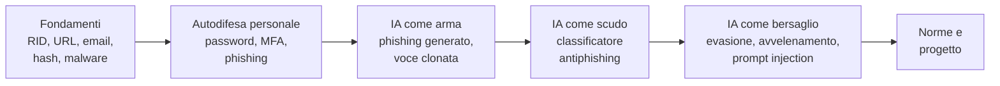

# Logica della progettazione didattica del corso B.4

## Finalità della traccia docenti

La traccia docenti accompagna il syllabus e ne spiega le scelte: perché gli argomenti sono stati selezionati e ordinati in questo modo, come il limite delle 18 ore ha determinato tagli e compressioni, come impostare e condurre i laboratori in sicurezza, come valutare.

Ripartizione indicativa:

- traccia studenti: circa 16 ore
- traccia docenti: circa 2 ore, distribuite in brevi segmenti di 10-15 minuti al termine delle lezioni L1, L4, L7, L9, L11, L15 e nella seconda parte di L18

## Il problema didattico del corso

Il titolo e la descrizione del corso contengono tre richieste di natura diversa:

- una cultura di base di cybersicurezza, per studenti che non ne hanno alcuna
- competenze pratiche di autodifesa: password, autenticazione, riconoscimento del phishing
- la comprensione del ruolo dell'IA nella sicurezza, sia come strumento di attacco e di difesa sia come bersaglio

Un corso classico di cybersicurezza dedica le prime decine di ore a reti, sistemi operativi e crittografia; con questo approccio l'IA arriverebbe a corso finito. Un corso centrato solo sull'IA, al contrario, parlerebbe di attacchi sofisticati a studenti che non sanno ancora leggere un URL o distinguere una codifica da una cifratura.

La soluzione adottata:

- un modulo di fondamenti breve (4 ore) che include solo i concetti tecnici che servono dopo: anatomia di URL e posta elettronica per il phishing, hash per le password, leve psicologiche per l'ingegneria sociale
- la coppia attacco-difesa come struttura di ogni argomento
- l'IA introdotta progressivamente nei tre ruoli: prima come arma (password, phishing), poi come scudo (filtri e rilevamento), infine come bersaglio (modulo 4)

Diagramma: progressione dei contenuti

Il classificatore antiphishing costruito in L11 è l'oggetto concreto che collega difesa e attacco all'IA: in L11 lo si usa per difendersi, in L12 lo si inganna, in L13 lo si avvelena. Gli studenti vedono lo stesso sistema da tre punti di vista, come accade in B.8 con il neurone riscritto più volte.

## Scelte sui contenuti

### Perché la parte "Internet" in L2

Il riconoscimento del phishing si basa in gran parte sulla lettura corretta di un URL e di un mittente. Senza la nozione di dominio registrato, un indirizzo come `poste.it.verifica-account.example` sembra legittimo. L2 è quindi una lezione di prerequisiti mirata, non una lezione di reti.

### Perché le password occupano un intero modulo

La descrizione del corso le cita esplicitamente, e sono il punto in cui gli studenti possono cambiare subito un comportamento. Il modulo segue le raccomandazioni NIST SP 800-63B-4 (agosto 2025), che contraddicono diverse regole ancora diffuse: obbligo di caratteri speciali, cambio periodico, domande di sicurezza. Questo contrasto è didatticamente utile: mostra che in sicurezza le regole cambiano con le prove, e che una regola che produce password prevedibili (`Estate2026!`) peggiora la sicurezza.

Sull'uso dell'IA per attaccare le password il corso mantiene una posizione misurata: i modelli generativi addestrati su password trapelate esistono e funzionano, ma le affermazioni giornalistiche sulla loro efficacia sono spesso esagerate; il vantaggio principale resta nelle password scelte da persone, prevedibili con o senza IA.

### Privacy: aspetti non ovvi

La richiesta del corso chiede di includere aspetti non ovvi della riservatezza dei dati. L10 privilegia quelli che gli studenti non conoscono e che hanno conseguenze dirette:

- metadati delle foto e posizione
- reidentificazione di dati "anonimi" per incrocio
- inferenza di informazioni da parte dei modelli
- dati inseriti nei chatbot: conservazione, lettura umana, addestramento, link condivisi resi pubblici
- dati di terzi inseriti senza consenso

Il tema generale di privacy e tracciamento, dal punto di vista del dibattito e del pensiero critico, è materia di B.2; B.4 ne tratta la parte tecnica e normativa.

### Attacchi all'IA: scelta del livello

Il modulo 4 non richiede conoscenze di machine learning. Ogni attacco viene presentato con tre elementi: che cosa fa l'attaccante, che cosa si osserva, perché funziona in termini intuitivi. La tassonomia segue le categorie correnti (evasione, avvelenamento, estrazione, inferenza, catena di fornitura) e, per i modelli linguistici, la OWASP Top 10 per le applicazioni LLM 2025, riferimento professionale diffuso e rilasciato con licenza CC BY-SA 4.0, quindi riutilizzabile con attribuzione.

### Normativa: perché una sola lezione

La richiesta del corso chiede i concetti essenziali della normativa europea e nazionale. Una sola lezione (L16), collocata alla fine, è sufficiente perché i riferimenti normativi vengono anticipati nelle lezioni in cui servono (reato di accesso abusivo in L1, NIST in L6, GDPR e consenso dei minori in L10, obblighi di trasparenza in L9 e L14). L16 li riorganizza in un quadro unico.

Il quadro normativo è cambiato nel corso del 2026: l'Omnibus digitale sull'IA (Regolamento UE 2026/1744, in vigore dal 27 luglio 2026) ha rinviato gli obblighi per i sistemi ad alto rischio al 2 dicembre 2027 (Allegato III) e al 2 agosto 2028 (Allegato I), ha riformulato l'obbligo di alfabetizzazione in materia di IA dell'art. 4 (resta l'obbligo di adottare misure, senza l'obbligo di garantire un livello specifico di competenza per ciascuna persona) e ha aggiunto il divieto degli strumenti di nudificazione e di creazione di materiale pedopornografico. Dal 2 agosto 2026 si applicano gli obblighi di trasparenza dell'art. 50 e le autorità di vigilanza sono operative. Il materiale di L16 va verificato all'inizio di ogni anno scolastico.

Punti di particolare interesse per la scuola, da evidenziare in L16:

- il riconoscimento delle emozioni negli istituti di istruzione è una pratica vietata dall'AI Act (salvo motivi medici o di sicurezza)
- i sistemi usati nell'istruzione per l'accesso, la valutazione degli apprendimenti e la sorveglianza durante le prove sono classificati ad alto rischio
- la legge 132/2025 richiede il consenso dei genitori per l'accesso dei minori di 14 anni ai sistemi di IA; dai 14 anni il minore può esprimere il consenso se le informazioni sono chiare e comprensibili
- le Linee guida MIM (DM 166/2025) regolano l'introduzione dell'IA nella scuola e sono il riferimento per le decisioni dell'istituto

## Effetti del limite di 18 ore

Un corso introduttivo di cybersicurezza per la scuola superiore occupa normalmente un anno scolastico (per esempio Hacker Highschool è organizzato in livelli annuali); un'introduzione alla sicurezza dei sistemi di IA richiede da sola decine di ore. Con 18 ore sono state fatte le scelte seguenti.

Contenuti esclusi o ridotti:

- reti: nessuna trattazione di modello ISO/OSI, TCP/IP, porte, firewall, Wi-Fi; solo DNS, URL, HTTPS e posta elettronica nella misura necessaria al phishing
- sistemi operativi: permessi, account amministrativi e aggiornamenti trattati solo come buone pratiche (L4)
- crittografia: nessun algoritmo moderno spiegato nel dettaglio; solo i concetti di codifica, cifratura simmetrica e asimmetrica, hash, firma
- sicurezza delle applicazioni web (SQL injection, XSS): esclusa; citata solo per analogia con la prompt injection in L14
- analisi del malware, penetration test, strumenti professionali (scanner di rete, framework di attacco): esclusi, anche per ragioni etiche e di sicurezza del laboratorio
- NIS2, Cyber Resilience Act, certificazioni: esclusi o solo citati; non riguardano direttamente gli studenti
- riconoscimento tecnico dei deepfake: affidato al corso B.7

Scelte strutturali dovute al monte ore:

- lezioni autonome di un'ora, ciascuna con un laboratorio che produce un risultato osservabile
- notebook forniti già scritti: gli studenti eseguono, modificano parametri e interpretano; la programmazione non è un obiettivo del corso
- materiali di laboratorio preparati in anticipo (email, SMS, pagine, dataset) invece di attività di ricerca libera, per ridurre i tempi morti e i rischi

## Scelte sugli strumenti

Criteri: PC di fascia bassa, nessun privilegio di amministratore, funzionamento anche senza rete, nessun rischio per la rete della scuola, nessun account obbligatorio per gli studenti.

| Esigenza | Strumento principale | Alternativa | Motivazione |
|---|---|---|---|
| codifiche, hash, cifrari, metadati | CyberChef | versione ZIP offline dello stesso strumento | eseguito interamente nel browser, i dati non vengono inviati a server; licenza Apache 2.0 |
| notebook | JupyterLite | WinPython da chiavetta | stesso materiale online e offline; librerie necessarie già incluse |
| password manager | KeePassXC portable | dimostrazione del docente | archivio locale, open source (GPLv3), nessun account |
| riconoscimento del phishing | corpus di messaggi fornito | Jigsaw Phishing Quiz (online, in inglese) | il corpus fornito è in italiano e tratto da campagne reali segnalate dal CERT-AGID |
| esempi avversari | adversarial.js | grafici statici e ripresa del classificatore di L11 | eseguito nel browser, nessuna installazione |
| prompt injection | Lakera Gandalf | notebook con applicazione simulata | esperienza diretta con un modello reale; alternativa offline per laboratori senza rete |

Considerazioni sull'inserimento degli strumenti nel corso:

- KeePassXC portable per Windows richiede il pacchetto Microsoft Visual C++ Redistributable; se non è presente sulle postazioni, va installato una volta dal tecnico di laboratorio, oppure l'attività diventa una dimostrazione del docente
- CyberChef: scaricare in anticipo l'archivio ZIP e distribuirlo su chiavetta o cartella condivisa; la versione scaricata non si aggiorna da sola
- JupyterLite: il primo caricamento scarica alcune decine di MB; aprirlo su tutte le postazioni prima della lezione. I file restano nella memoria del browser: gli studenti devono scaricare il `.ipynb` a fine lezione
- servizi online (Jigsaw, adversarial.js, Lakera, Have I Been Pwned): verificare prima di ogni edizione che siano raggiungibili dalla rete della scuola, che non richiedano registrazione e che le condizioni d'uso siano compatibili con utenti minorenni; la pagina di Lakera Gandalf reindirizza attualmente alla piattaforma di gioco di Lakera, i cui contenuti possono cambiare
- adversarial.js funziona meglio su Chrome con WebGL; verificare le postazioni in anticipo
- Have I Been Pwned: usare solo password e indirizzi di esempio; spiegare perché non si inseriscono password reali in siti di cui non si conosce il funzionamento, anche quando il sito è affidabile

## Uso dell'IA generativa da parte degli studenti

Alcune attività (L9, L14, L15) possono prevedere l'uso di un assistente di IA. Prima di proporle occorre verificare:

- le regole dell'istituto, in coerenza con le Linee guida MIM (DM 166/2025)
- l'età degli studenti: sotto i 14 anni serve il consenso dei genitori (legge 132/2025); nella fascia 16-18 il consenso può essere espresso dallo studente se le informazioni sono chiare
- le condizioni d'uso del servizio (età minima, account)
- che nessun dato personale reale venga inserito

Per ogni attività è prevista un'alternativa senza IA: esempi pre-generati dal docente, dimostrazione alla cattedra, notebook simulato.

## Sicurezza ed etica del laboratorio

Un corso che insegna tecniche di attacco richiede regole esplicite, stabilite nella prima lezione e richiamate a ogni laboratorio di attacco:

- patto d'aula firmato o condiviso: si attaccano solo i materiali predisposti
- nessun attacco a sistemi reali, alla rete della scuola, ad account di compagni o docenti; nessun test di phishing su persone reali, neppure "per scherzo"
- le schede OSINT riguardano persone fittizie create dal docente; non si svolgono ricerche su persone reali, compagni inclusi
- i campioni di phishing sono resi inoffensivi: link sostituiti con domini riservati alla documentazione (`example.com`, `example.org`), allegati rimossi
- ogni tecnica è presentata insieme alla sua difesa; il livello di dettaglio operativo si ferma a ciò che serve per capire il meccanismo e riconoscerlo

La responsabilità penale (art. 615-ter c.p. e reati connessi) va spiegata senza toni allarmistici: l'obiettivo è che gli studenti comprendano il confine tra sperimentazione autorizzata e reato.

## Struttura della lezione di laboratorio

Schema tipico di una lezione di un'ora:

1. richiamo (5 min): un caso breve da analizzare (URL, messaggio, notizia)
2. spiegazione con dimostrazione (20-25 min): il docente mostra attacco e difesa dal vivo sul materiale predisposto
3. laboratorio (25-30 min): attività a coppie o a gruppi con scheda di lavoro; esercizi graduati su tre livelli
4. chiusura (5 min): sintesi della coppia attacco-difesa della lezione e una domanda di verifica

Il lavoro a coppie è preferito al lavoro individuale nelle attività di analisi (L2, L4, L8, L9): la discussione tra pari fa emergere i segnali che un singolo studente trascura.

## Valutazione

- formativa: schede di laboratorio; brevi quiz di riconoscimento (URL legittimo o no, messaggio fraudolento o no, con motivazione)
- verifiche di modulo: analisi individuale di un caso non visto, al termine dei moduli 1, 2, 3 e 4
- progetto finale (L17-L18): valutato con rubrica su quattro dimensioni

| Dimensione | Descrittori |
|---|---|
| correttezza tecnica | concetti usati correttamente; nessuna affermazione tecnica errata |
| analisi attacco-difesa | per ogni minaccia individuata è indicata una contromisura realistica e il suo limite |
| fonti e norme | fonti autorevoli e verificate; riferimenti normativi pertinenti e aggiornati |
| comunicazione | prodotto adatto al destinatario dichiarato; chiarezza della presentazione |

## Coordinamento con gli altri corsi

- B.8: esercizi ponte su stringhe, cicli e dizionari (password), `hmac` e `hashlib` (TOTP); gli studenti di B.8 possono svolgere le varianti di approfondimento dei notebook
- B.6: temi assegnati a B.6 e solo usati in B.4: costruzione del dataset, addestramento e metriche del classificatore. Se B.6 precede B.4, L11 può partire direttamente dal classificatore; se lo segue, B.6 può riprendere il classificatore antiphishing come esempio
- B.7: riconoscimento dei deepfake e strumenti di verifica delle fonti; B.4 si limita alle frodi e alle difese procedurali
- B.2: dibattito su privacy, tracciamento e fattore umano; B.4 fornisce la base tecnica e normativa

## Adattamento ad altri monte ore

- 12 ore: unire L2 e L3 (solo URL e hash), unire L6 e L7, unire L12 e L13, ridurre il progetto finale a una lezione
- 24-30 ore: aggiungere una lezione sulle reti domestiche e Wi-Fi, una sulla sicurezza dello smartphone, una sull'estrazione di dati dai modelli e sulla catena di fornitura dei modelli, e raddoppiare il progetto finale con una fase di revisione tra gruppi

## Aggiornamento dei contenuti

Il corso riguarda un ambito che cambia rapidamente. Prima di ogni edizione:

- aggiornare i casi reali (sintesi settimanali e report annuali del CERT-AGID)
- verificare lo stato dell'AI Act e degli atti di attuazione, della legge 132/2025 (decreti attuativi) e delle Linee guida MIM
- verificare la raggiungibilità e le condizioni d'uso degli strumenti online
- controllare la versione corrente di OWASP Top 10 per le applicazioni LLM e di NIST SP 800-63B

## Materiale open source di riferimento

Verifica complessiva sul syllabus: non risulta un corso open source che copra l'intero programma con gli stessi vincoli (lingua italiana, 18 ore, nessun prerequisito, IA come arma, scudo e bersaglio, normativa europea e italiana aggiornata, PC di fascia bassa). Esistono materiali che coprono parti del programma. La verifica puntuale verrà ripetuta per ogni lezione al momento della stesura.

Criterio adottato: le lezioni sono scritte da zero. Dove è utile, riusano parti di materiali esistenti, tradotte in italiano, compatibili con la licenza e accompagnate da un'attribuzione esplicita nel punto in cui compaiono (autore, titolo, licenza, URL completo).

Materiali individuati:

- AI & Cybersecurity for Teens (ACT), CyberAI4K12: sequenza di attività per la scuola superiore che integra IA e cybersicurezza (cifrari, attacchi DoS, rilevamento di bot, esempi avversari, GAN). È il materiale più vicino al modulo 4, ma si basa sull'ambiente a blocchi NetsBlox con account online, è in inglese e non tratta password, phishing e normativa; la licenza va verificata prima di un eventuale riuso. https://cyberai4k12.github.io/curriculum/
- Hacker Highschool, ISECOM: curriculum di cybersicurezza per adolescenti, con lezioni disponibili anche in italiano; uso gratuito non commerciale nelle scuole superiori con attribuzione obbligatoria; non tratta l'IA in modo specifico. Utile come approfondimento per il modulo 1. https://www.hackerhighschool.org/ (condizioni d'uso: https://www.hackerhighschool.org/licensing.html)
- OWASP Top 10 for LLM Applications 2025 (CC BY-SA 4.0): base per L14 e L15. https://genai.owasp.org/llm-top-10/
- CyberChef (Apache 2.0): strumento per i laboratori dei moduli 1-3. https://gchq.github.io/CyberChef/
- adversarial.js: dimostrazione eseguita nel browser per L12, con pagina di approfondimento e riferimenti bibliografici. https://kennysong.github.io/adversarial.js/
- CERT-AGID: casi reali italiani aggiornati settimanalmente, da citare come fonte. https://cert-agid.gov.it/
