# Lezione L1 - Che cos'è la cybersicurezza

## Obiettivi della lezione

- definire cybersicurezza e asset digitale
- usare correttamente i termini riservatezza, integrità, disponibilità
- distinguere minaccia, vulnerabilità, rischio e impatto
- descrivere chi attacca, perché e con quali fasi
- spiegare il principio della difesa in profondità
- conoscere i limiti legali ed etici dello studio delle tecniche di attacco
- usare le pubblicazioni del CERT-AGID come fonte di casi reali

## Informazione e asset

- Cybersicurezza (sicurezza informatica)
  insieme delle misure tecniche, organizzative e di comportamento che proteggono sistemi informatici, reti e dati da accessi non autorizzati, modifiche, danneggiamenti e interruzioni.
- Asset (bene) digitale
  qualunque elemento che ha valore e va protetto: dati, account, dispositivi, servizi, reputazione.

Asset digitali di una persona:

- account (posta elettronica, social, registro elettronico, gioco online, identità digitale SPID o CIE)
- dispositivi (smartphone, PC, tablet, console)
- dati (foto, messaggi, documenti, contatti, dati di pagamento)
- identità online (profili, nome utente, reputazione)

Asset digitali di una scuola:

- registro elettronico e dati degli studenti
- rete e dispositivi dei laboratori
- sito web e posta istituzionale, compresa la PEC
- dati amministrativi del personale

Un account di posta elettronica è spesso l'asset più importante di una persona: le procedure di recupero della password di quasi tutti gli altri servizi passano dalla posta. Chi controlla la casella può reimpostare le password degli altri account.

## La triade RID

La sicurezza delle informazioni si descrive con tre proprietà, indicate in italiano con la sigla RID e in inglese con la sigla CIA (confidentiality, integrity, availability).

- Riservatezza (confidentiality)
  l'informazione è accessibile solo a chi è autorizzato. Violazione tipica: furto di password, lettura di messaggi privati, pubblicazione di dati.
- Integrità (integrity)
  l'informazione non è modificata senza autorizzazione, o la modifica viene rilevata. Violazione tipica: alterazione di un voto, di un IBAN in una fattura, di un file scaricato.
- Disponibilità (availability)
  l'informazione e i servizi sono accessibili quando servono a chi ne ha diritto. Violazione tipica: ransomware che cifra i file, attacco che rende irraggiungibile un sito.

Due proprietà collegate:

- Autenticità
  certezza sull'origine dell'informazione e sull'identità di chi la invia.
- Non ripudio
  impossibilità, per chi ha compiuto un'azione (inviare un messaggio, firmare un documento), di negare di averla compiuta.

Diagramma: la triade RID ed esempi di violazione

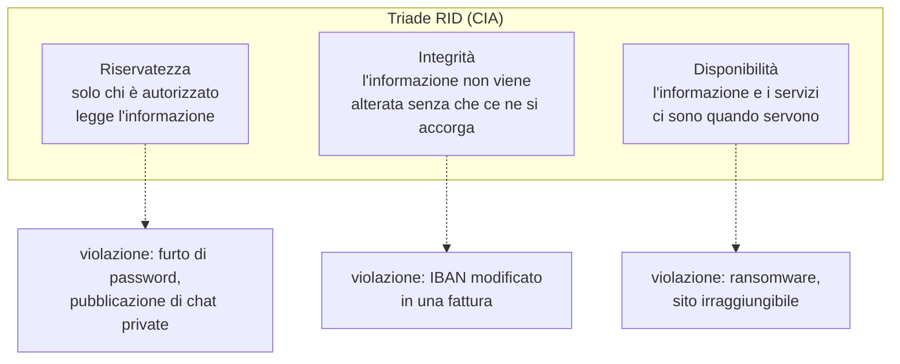

Uno stesso attacco può violare più proprietà. Un ransomware moderno cifra i file (disponibilità) e prima di cifrarli li copia per minacciarne la pubblicazione (riservatezza): questa tecnica si chiama doppia estorsione.

## Minaccia, vulnerabilità, rischio

- Minaccia
  evento o soggetto che può causare un danno a un asset. Esempi: un criminale che invia email fraudolente, un malware, un incendio, un errore umano.
- Vulnerabilità
  debolezza che una minaccia può sfruttare. Esempi: un software non aggiornato, una password riusata, un utente che non verifica il mittente, un backup assente.
- Attacco
  tentativo concreto di sfruttare una vulnerabilità.
- Impatto
  entità del danno se l'attacco riesce.
- Rischio
  combinazione della probabilità che una minaccia sfrutti una vulnerabilità e dell'impatto che ne deriva. In forma qualitativa: rischio = probabilità × impatto.
- Superficie di attacco
  insieme dei punti attraverso cui un attaccante può tentare di entrare: account, dispositivi, applicazioni, servizi esposti in rete, persone.

Diagramma: relazione tra i concetti

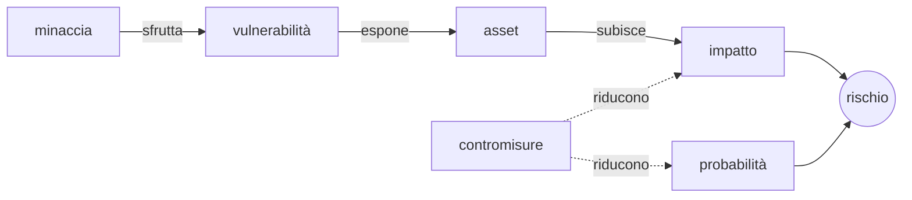

Senza vulnerabilità una minaccia non produce danni; senza minaccia una vulnerabilità resta potenziale. Le contromisure agiscono sulla probabilità (per esempio l'autenticazione a più fattori rende inutile una password rubata) o sull'impatto (per esempio un backup rende recuperabili i file cifrati da un ransomware).

## Chi attacca e perché

| Tipo di attaccante | Obiettivo tipico | Esempio |
|---|---|---|
| criminalità a scopo di lucro | denaro | ransomware, furto di credenziali bancarie, truffe |
| attivisti (hacktivisti) | visibilità di una causa | attacchi che rendono irraggiungibili siti istituzionali, pubblicazione di dati |
| attori statali | spionaggio, sabotaggio | intrusioni prolungate in enti e infrastrutture |
| insider | vendetta, guadagno, errore | dipendente che copia dati prima di lasciare l'azienda |
| attaccanti occasionali | curiosità, prestigio, scherzo | accesso all'account di un compagno con una password indovinata |

Distinzione importante:

- Attacchi opportunistici
  colpiscono chiunque sia vulnerabile, spesso in modo automatizzato e su grandi numeri: messaggi fraudolenti inviati a migliaia di destinatari, ricerca automatica di sistemi non aggiornati. La maggior parte delle persone incontra questo tipo di attacco.
- Attacchi mirati
  scelgono una vittima precisa e raccolgono informazioni su di essa prima di agire.

## Le fasi di un attacco

I professionisti descrivono gli attacchi con modelli a fasi; il più noto è la Cyber Kill Chain di Lockheed Martin, articolata in sette fasi. Nel corso si usa una versione semplificata in tre fasi.

Diagramma: fasi di un attacco (modello semplificato)

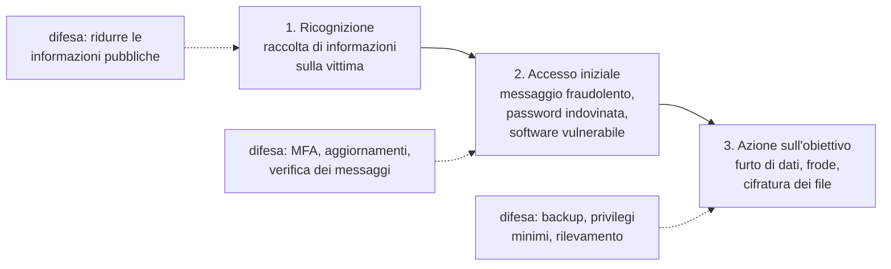

Interrompere l'attacco in una qualunque fase è sufficiente a fermarlo. Per questo le difese si collocano in punti diversi.

## Difesa in profondità

- Difesa in profondità
  strategia che dispone più livelli di protezione indipendenti, in modo che il fallimento di uno non comprometta l'intero sistema.

Esempio per un account di posta:

| Livello | Contromisura | Cosa succede se fallisce |
|---|---|---|
| persona | riconoscere un messaggio fraudolento | la password viene inserita in un sito falso |
| credenziale | password lunga e unica | la password rubata non vale per altri servizi |
| autenticazione | secondo fattore | la password rubata da sola non basta |
| servizio | avviso di accesso da un nuovo dispositivo | l'utente si accorge dell'intrusione |
| dati | backup | i dati cancellati o cifrati si recuperano |

Nessuna contromisura è perfetta; la sicurezza nasce dalla combinazione.

## Hacking etico e limiti legali

- Hacker
  nel significato originale, persona che studia a fondo il funzionamento dei sistemi. Nell'uso comune indica chi viola sistemi altrui; per quest'ultimo significato alcuni usano il termine cracker.
- Hacking etico (test di penetrazione)
  attacco simulato, svolto da professionisti con un'autorizzazione scritta del proprietario del sistema, per trovare le vulnerabilità prima dei criminali.

La differenza tra un test di sicurezza e un reato è l'autorizzazione. Il codice penale italiano prevede, tra gli altri:

- accesso abusivo a un sistema informatico o telematico (art. 615-ter): punisce chi entra senza autorizzazione in un sistema protetto da misure di sicurezza, o vi rimane contro la volontà di chi ha diritto di escluderlo; il reato sussiste anche se non si copia, modifica o danneggia nulla
- detenzione e diffusione abusiva di codici di accesso (art. 615-quater): per esempio, procurarsi o diffondere password altrui
- frode informatica (art. 640-ter): alterare il funzionamento di un sistema o intervenire sui dati per ottenere un profitto

Accedere all'account di un compagno con una password indovinata o vista di nascosto rientra nell'accesso abusivo. In Italia si è imputabili penalmente dai 14 anni.

Regole del corso:

- le tecniche di attacco si studiano per capire come difendersi
- si sperimentano solo su materiali e piattaforme predisposti per l'esercitazione
- non si attaccano sistemi reali, la rete della scuola, account di altre persone

## Fonti per restare aggiornati: il CERT-AGID

- CERT (Computer Emergency Response Team)
  gruppo che raccoglie segnalazioni di incidenti informatici, analizza le minacce e diffonde avvisi e indicazioni di difesa.
- CERT-AGID
  CERT dell'Agenzia per l'Italia Digitale, che si occupa delle pubbliche amministrazioni. Pubblica notizie sulle campagne malevole che colpiscono l'Italia, una sintesi settimanale, un report annuale e un glossario dei termini.

Sito: CERT-AGID, https://cert-agid.gov.it/

Le sintesi settimanali riportano ogni settimana da 130 a 200 campagne malevole rilevate nello scenario italiano: phishing a nome di enti pubblici, banche, corrieri; malware inviato tramite email e PEC. Sono una fonte di casi aggiornati e in italiano, adatta all'analisi in classe.

Termini frequenti nelle notizie del CERT-AGID:

- Campagna malevola
  insieme di messaggi o siti fraudolenti con lo stesso schema, diffusi nello stesso periodo.
- IoC (indicatore di compromissione)
  dato tecnico che permette di riconoscere un attacco: un indirizzo, un dominio, l'impronta di un file malevolo.

## Laboratorio L1

Durata indicativa: 25 minuti. Lavoro a coppie. Materiale: scheda `L1_scheda_analisi_casi.md`.

Esercizio 1 (base): leggere le due notizie del CERT-AGID indicate nella scheda. Per ciascuna compilare la tabella:

| Voce | Notizia 1 | Notizia 2 |
|---|---|---|
| asset preso di mira | | |
| minaccia (chi attacca, con quale mezzo) | | |
| vulnerabilità sfruttata | | |
| proprietà RID violata se l'attacco riesce | | |
| impatto per la vittima | | |
| una contromisura efficace | | |

Esercizio 2 (standard): compilare la mappa dei propri asset digitali, senza indicare dati reali (nomi utente, password, numeri):

| Asset | Valore per me (alto, medio, basso) | Protezione attuale | Cosa succederebbe se fosse compromesso |
|---|---|---|---|
| casella di posta principale | | | |
| smartphone | | | |
| profilo social | | | |
| ... | | | |

Esercizio 3 (approfondimento): nella mappa dell'esercizio 2 individuare l'asset da cui dipendono più altri asset (per esempio la posta da cui si recuperano le password) e proporre due livelli di difesa in profondità per proteggerlo.

# Lezione L2 - Internet quanto basta per non farsi ingannare

## Obiettivi della lezione

- descrivere il ruolo di indirizzo IP, nome di dominio e DNS
- scomporre un URL e individuare il dominio registrato
- spiegare che cosa garantisce e che cosa non garantisce HTTPS
- leggere le intestazioni principali di un'email e distinguere mittente visualizzato e mittente reale
- descrivere lo scopo di SPF, DKIM e DMARC
- riconoscere domini ingannevoli: typosquatting, sottodomini fuorvianti, omografi

## Indirizzi IP e nomi di dominio

- Indirizzo IP
  numero che identifica un dispositivo in una rete. Nella versione IPv4 è formato da quattro numeri da 0 a 255 separati da punti, per esempio `93.184.215.14`; nella versione IPv6 è un numero più lungo scritto in esadecimale.
- Nome di dominio
  nome leggibile associato a uno o più indirizzi IP, per esempio `istruzione.it`.
- DNS (Domain Name System)
  sistema distribuito che traduce i nomi di dominio in indirizzi IP, come una rubrica telefonica.

I nomi di dominio sono organizzati in una gerarchia e si leggono da destra verso sinistra:

- dominio di primo livello (TLD, top-level domain): `.it`, `.com`, `.org`, `.eu`
- dominio di secondo livello: il nome registrato presso il gestore del TLD, per esempio `istruzione` in `istruzione.it`
- sottodomini: nomi aggiunti a sinistra dal proprietario del dominio, per esempio `www` in `www.istruzione.it`

Solo il proprietario di un dominio registrato può creare i suoi sottodomini. Chi controlla `esempio-truffa.com` può creare `bancaaurora.esempio-truffa.com`, ma non `bancaaurora.it`.

Diagramma: risoluzione di un nome con il DNS

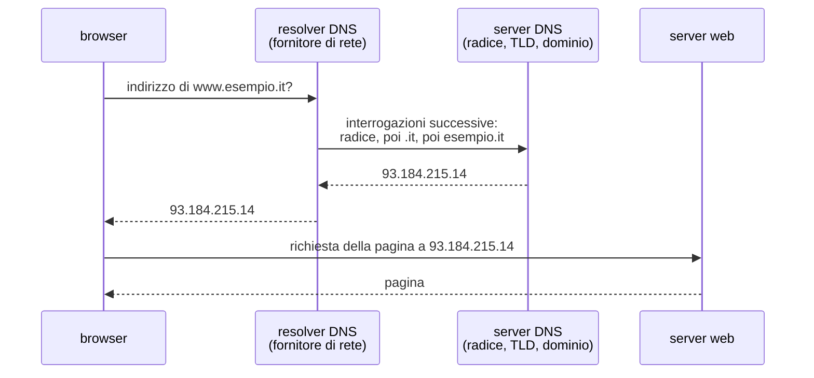

## Anatomia di un URL

- URL (Uniform Resource Locator)
  indirizzo che identifica una risorsa in rete e il modo per raggiungerla.

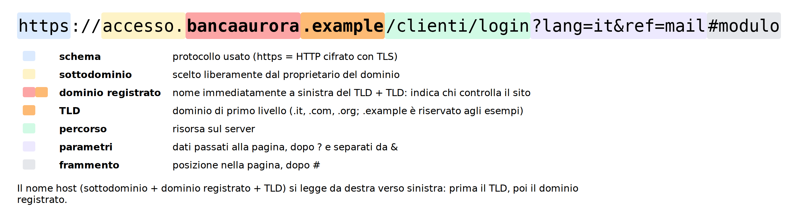{width=100%}

Parti di un URL:

- schema (`https`): il protocollo usato
- nome host (`accesso.bancaaurora.example`): il computer da contattare; comprende sottodomini, dominio registrato e TLD
- dominio registrato (`bancaaurora.example`): il nome immediatamente a sinistra del TLD, insieme al TLD; indica chi controlla il sito
- percorso (`/clienti/login`): la risorsa sul server
- parametri (`?lang=it&ref=mail`): dati passati alla pagina, dopo il `?`, separati da `&`
- frammento (`#modulo`): una posizione nella pagina, dopo il `#`

Nel corso si usano domini con TLD `.example`: è un dominio di primo livello riservato alla documentazione e non può essere registrato, quindi gli esempi non corrispondono a siti reali. Nella realtà gli stessi schemi si presentano con `.it`, `.com` e gli altri TLD.

Regola di lettura: per sapere chi controlla un sito si individua il TLD, all'estremità destra del nome host, e si legge il nome immediatamente a sinistra. Tutto ciò che sta più a sinistra è un sottodominio scelto dal proprietario.

| URL | Dominio registrato | Controllato da Banca Aurora? |
|---|---|---|
| `https://www.bancaaurora.example/login` | `bancaaurora.example` | sì |
| `https://bancaaurora.example.verifica-accessi.example/login` | `verifica-accessi.example` | no |
| `https://accesso-bancaaurora.example/login` | `accesso-bancaaurora.example` | no: è un dominio diverso |
| `https://www.bancaaurora.example@sicuro-login.example/` | `sicuro-login.example` | no: la parte prima di `@` è ignorata come nome utente |

L'ultima riga mostra una caratteristica poco nota: la parte che precede `@` nel nome host viene interpretata come nome utente e non determina il sito contattato.

## HTTP, HTTPS e certificati

- HTTP (HyperText Transfer Protocol)
  protocollo con cui browser e server web si scambiano pagine e dati. I dati viaggiano in chiaro: chi si trova sul percorso (per esempio sulla stessa rete Wi-Fi pubblica) può leggerli e modificarli.
- HTTPS
  HTTP protetto da TLS (Transport Layer Security): i dati sono cifrati e il server dimostra la propria identità con un certificato.
- Certificato digitale
  documento elettronico, firmato da un'autorità di certificazione (CA, Certification Authority) riconosciuta dal browser, che associa un nome di dominio a una chiave crittografica.

Che cosa garantisce il lucchetto nella barra degli indirizzi:

- la comunicazione è cifrata
- il sito possiede un certificato valido per il dominio mostrato

Che cosa non garantisce:

- che il sito sia onesto
- che il dominio sia quello dell'organizzazione che si pensava di visitare

Ottenere un certificato valido per un dominio registrato da sé è gratuito e automatico. Una parte consistente dei siti di phishing usa HTTPS. Il lucchetto significa "connessione cifrata con questo dominio", non "sito affidabile".

Ispezione del certificato nel browser: clic sull'icona a sinistra dell'indirizzo, poi sulla voce relativa alla connessione sicura e al certificato. Si leggono il dominio per cui è stato emesso, l'autorità che lo ha emesso e il periodo di validità.

## La posta elettronica

Un'email è composta da:

- Intestazioni (header)
  righe tecniche che descrivono il messaggio: mittente, destinatari, data, oggetto, percorso seguito, esiti dei controlli di autenticità. Molti programmi di posta mostrano solo alcune intestazioni; quelle complete si vedono con comandi come `Mostra originale` o `Visualizza sorgente`.
- Corpo
  il testo del messaggio, eventualmente in HTML, con gli allegati.

Intestazioni utili per riconoscere un inganno:

| Intestazione | Significato | Attenzione |
|---|---|---|
| `From:` | mittente dichiarato, con nome visualizzato e indirizzo | il nome visualizzato è testo libero: chiunque può scrivere `Banca Aurora` |
| `Reply-To:` | indirizzo a cui va la risposta | se diverso da `From:`, la risposta arriva a un'altra casella |
| `Return-Path:` | indirizzo usato dai server per gli errori di consegna | spesso rivela il vero dominio di invio |
| `Received:` | una riga per ogni server attraversato, dalla più recente alla più vecchia | la riga più in basso è la più vicina all'origine |
| `Authentication-Results:` | esito dei controlli SPF, DKIM, DMARC eseguiti dal server del destinatario | `fail` o `none` sono segnali d'allarme |

Esempio di intestazioni (estratto):

```text
From: "Banca Aurora - Servizio Clienti" <notifiche@bancaaurora-sicurezza.example>
Reply-To: assistenza.clienti.2026@mail-gratis.example
Return-Path: <bounce@invii-massivi.example>
Subject: Accesso sospeso: verifica entro 24 ore
Authentication-Results: mx.scuola.example;
       spf=fail smtp.mailfrom=invii-massivi.example;
       dkim=none;
       dmarc=fail header.from=bancaaurora-sicurezza.example
```

Lettura:

- il nome visualizzato è quello della banca, ma il dominio dell'indirizzo è `bancaaurora-sicurezza.example`, non `bancaaurora.example`
- le risposte andrebbero a una casella di un servizio di posta gratuito
- i controlli di autenticità falliscono

Lo stesso messaggio come appare nel programma di posta: le intestazioni tecniche non si vedono, il link mostra un testo generico e la destinazione reale compare solo passando il puntatore del mouse sul link (su smartphone: pressione prolungata sul link, che mostra l'indirizzo senza aprirlo).

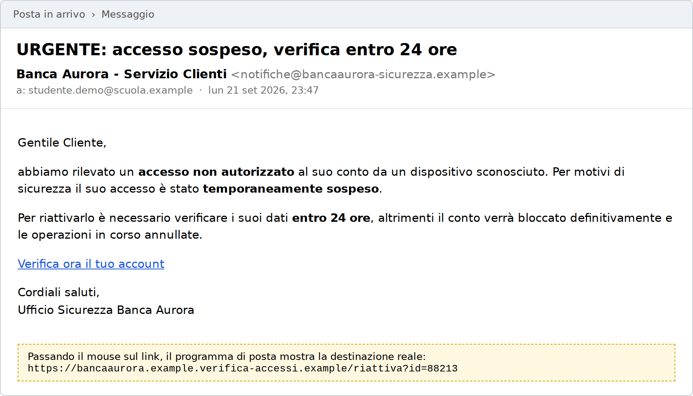{width=85%}

### SPF, DKIM, DMARC

Il protocollo di posta elettronica (SMTP) è nato senza verifica del mittente: chiunque può scrivere qualunque indirizzo nel campo `From:`. Tre meccanismi, pubblicati dal proprietario del dominio tramite il DNS, permettono al server che riceve un messaggio di verificarne l'origine.

- SPF (Sender Policy Framework)
  elenco dei server autorizzati a inviare posta per un dominio. Il server ricevente controlla se il messaggio arriva da uno di essi.
- DKIM (DomainKeys Identified Mail)
  firma crittografica aggiunta ai messaggi dal server di invio. Il ricevente la verifica con una chiave pubblica pubblicata nel DNS del dominio; se il messaggio è stato alterato, la firma non è valida.
- DMARC (Domain-based Message Authentication, Reporting and Conformance)
  regola pubblicata dal proprietario del dominio che dice che cosa fare dei messaggi che non superano SPF e DKIM (consegnarli, metterli nello spam, rifiutarli) e collega i controlli al dominio mostrato in `From:`.

Diagramma: percorso di un'email e controlli di autenticità

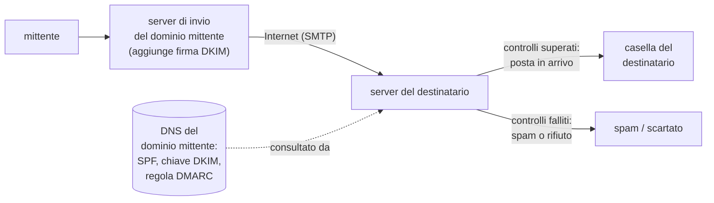

Limite fondamentale: SPF, DKIM e DMARC verificano che il messaggio provenga davvero dal dominio indicato, non che il dominio sia onesto. Un truffatore che registra `bancaaurora-sicurezza.example` può configurare correttamente SPF, DKIM e DMARC per quel dominio: i controlli risultano superati. Anche un messaggio inviato da una casella legittima compromessa supera i controlli.

### La PEC

- PEC (Posta Elettronica Certificata)
  servizio di posta con valore legale in Italia: il gestore rilascia ricevute di invio e di consegna che hanno valore di prova.

La PEC certifica la trasmissione e la consegna del messaggio. Non garantisce che la casella del mittente non sia stata compromessa, né che il contenuto o gli allegati siano sicuri. Il CERT-AGID segnala periodicamente campagne di malware inviate da caselle PEC compromesse.

## Domini ingannevoli

- Typosquatting
  registrazione di domini che differiscono da quello legittimo per un errore di battitura plausibile: lettere scambiate, mancanti, raddoppiate, trattini aggiunti, TLD diverso. Esempi: `bancaurora.example`, `banca-aurora.example`, `bancaaurora.example.com`.
- Sottodominio fuorviante
  il nome legittimo compare a sinistra, come sottodominio di un dominio controllato dall'attaccante: `bancaaurora.example.accesso-verificato.example`.
- Omografo
  dominio che usa caratteri di altri alfabeti visivamente identici a quelli latini. La lettera cirillica `а` e la lettera latina `a` appaiono uguali ma sono caratteri diversi.
- Punycode
  codifica che rappresenta con soli caratteri ASCII i nomi di dominio contenenti caratteri non latini; i nomi codificati iniziano con `xn--`.

Esempio: `bаncaaurora.example`, scritto con una `а` cirillica al posto della prima `a` latina, in Punycode diventa `xn--bncaaurora-zqi.example`. I browser mostrano la forma Punycode quando rilevano una combinazione sospetta di alfabeti, ma il comportamento varia tra browser e contesti (per esempio nei programmi di posta o nelle app di messaggistica).

## Laboratorio L2

Durata indicativa: 30 minuti. Lavoro a coppie. Materiali: `L2_url_da_analizzare.txt`, `L2_email_1.eml`, `L2_email_2.eml`, `L2_email_3.eml`.

I file `.eml` si aprono con un editor di testo (Blocco note, Notepad++, Thonny) per vedere intestazioni e corpo così come sono. Non vanno aperti con il programma di posta.

Esercizio 1 (base): per ciascuno dei dodici URL del file `L2_url_da_analizzare.txt` indicare schema, nome host, dominio registrato e se il sito appartiene a Banca Aurora (dominio legittimo `bancaaurora.example`).

Esercizio 2 (base): aprire nel browser un sito istituzionale indicato dal docente, visualizzare il certificato e annotare dominio, autorità di certificazione e date di validità.

Esercizio 3 (standard): per ciascuna delle tre email compilare la tabella:

| Voce | Email 1 | Email 2 | Email 3 |
|---|---|---|---|
| nome visualizzato in `From:` | | | |
| dominio dell'indirizzo in `From:` | | | |
| `Reply-To:` presente e diverso? | | | |
| esito SPF, DKIM, DMARC | | | |
| dominio dei link nel corpo | | | |
| giudizio: legittima o fraudolenta, con motivazione | | | |

Esercizio 4 (approfondimento): in una delle email fraudolente tutti i controlli SPF, DKIM e DMARC risultano superati. Individuarla e spiegare perché questo non la rende affidabile.

# Lezione L3 - Crittografia essenziale: codificare, cifrare, calcolare un hash

## Obiettivi della lezione

- distinguere codifica, cifratura e funzione di hash
- descrivere la cifratura simmetrica e il concetto di spazio delle chiavi
- descrivere la cifratura asimmetrica e l'idea di firma digitale
- elencare le proprietà di una funzione di hash e i suoi usi
- spiegare come un servizio dovrebbe memorizzare le password
- usare CyberChef per codifiche, cifrari e hash

## Tre trasformazioni diverse

- Codifica
  rappresentazione di un dato in un altro formato, secondo una regola pubblica e senza segreti. Chiunque conosca la regola la inverte. Scopo: trasportare o memorizzare i dati, non proteggerli.
- Cifratura
  trasformazione che rende un dato illeggibile a chi non possiede una chiave. Con la chiave giusta si torna al dato originale (decifratura). Scopo: riservatezza.
- Funzione di hash
  calcolo che produce da un dato di qualunque lunghezza un'impronta di lunghezza fissa. Non esiste un modo pratico per risalire al dato dall'impronta. Scopo: integrità, verifica, memorizzazione delle password.

Diagramma: codifica, cifratura, hash

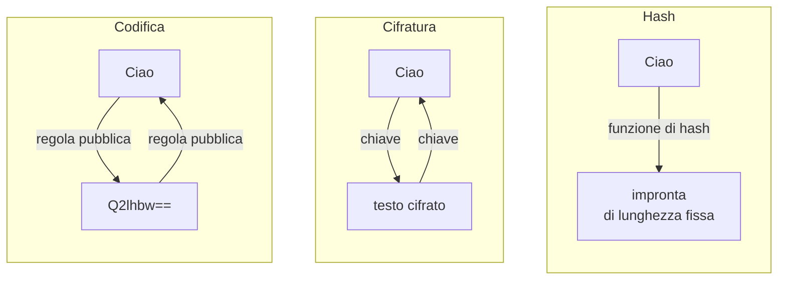

## Codifiche comuni

| Codifica | Esempio | Uso tipico |
|---|---|---|
| Base64 | `Ciao` diventa `Q2lhbw==` | allegati email, dati binari dentro testo |
| esadecimale | `Ciao` diventa `43 69 61 6f` | rappresentazione di byte |
| codifica degli URL (percent-encoding) | spazio diventa `%20`, `@` diventa `%40` | caratteri speciali negli URL |

Le codifiche compaiono spesso negli attacchi per nascondere un link o un comando a un controllo superficiale. Un testo in Base64 non è protetto: si decodifica in un istante.

- Byte
  unità di informazione formata da 8 bit; può assumere 256 valori, da 0 a 255. Un carattere del testo semplice occupa in genere un byte.

## Cifratura simmetrica

- Testo in chiaro (plaintext)
  il messaggio originale.
- Testo cifrato (ciphertext)
  il messaggio trasformato.
- Chiave
  informazione segreta che determina la trasformazione.
- Cifratura simmetrica
  la stessa chiave serve per cifrare e per decifrare; mittente e destinatario devono condividerla.

### Il cifrario di Cesare

Cifrario storico attribuito a Giulio Cesare: ogni lettera viene sostituita con quella che si trova un numero fisso di posizioni più avanti nell'alfabeto. Il numero di posizioni è la chiave.

Con chiave 3 e alfabeto inglese di 26 lettere: `A` diventa `D`, `B` diventa `E`, ..., `X` diventa `A`, `Y` diventa `B`, `Z` diventa `C`.

```text
testo in chiaro:  ATTACCA ALL ALBA
chiave:           3
testo cifrato:    DWWDFFD DOO DOED
```

Per decifrare si sposta ogni lettera all'indietro dello stesso numero di posizioni.

### Spazio delle chiavi e forza bruta

- Spazio delle chiavi
  insieme di tutte le chiavi possibili.
- Attacco a forza bruta
  tentativo sistematico di tutte le chiavi possibili, fino a trovare quella che produce un testo sensato.

Il cifrario di Cesare ha 25 chiavi utili: un attacco a forza bruta si completa a mano in pochi minuti e con un computer in un istante. La sicurezza di un cifrario moderno dipende dall'enorme dimensione dello spazio delle chiavi: AES (Advanced Encryption Standard), lo standard simmetrico più usato, impiega chiavi di 128 o 256 bit. Con 128 bit le chiavi possibili sono 2^128, circa 3,4 × 10^38: provarle tutte richiederebbe un tempo enormemente superiore all'età dell'universo anche con tutti i computer esistenti.

La sicurezza di un sistema non deve dipendere dalla segretezza dell'algoritmo, ma solo da quella della chiave (principio di Kerckhoffs, 1883). Gli algoritmi di cifratura moderni sono pubblici e studiati da tutti.

## Cifratura asimmetrica e firma digitale

Problema della cifratura simmetrica: come scambiarsi la chiave in modo sicuro con qualcuno mai incontrato, per esempio con un sito web?

- Cifratura asimmetrica (a chiave pubblica)
  ogni soggetto possiede una coppia di chiavi collegate matematicamente: una chiave pubblica, che può essere diffusa a chiunque, e una chiave privata, che resta segreta. Ciò che viene cifrato con la chiave pubblica si decifra solo con la chiave privata corrispondente.
- Firma digitale
  procedimento inverso: il firmatario usa la propria chiave privata per produrre una firma su un documento; chiunque può verificarla con la chiave pubblica. Una firma valida dimostra chi ha firmato (autenticità) e che il documento non è stato modificato dopo la firma (integrità).

Diagramma: cifratura asimmetrica

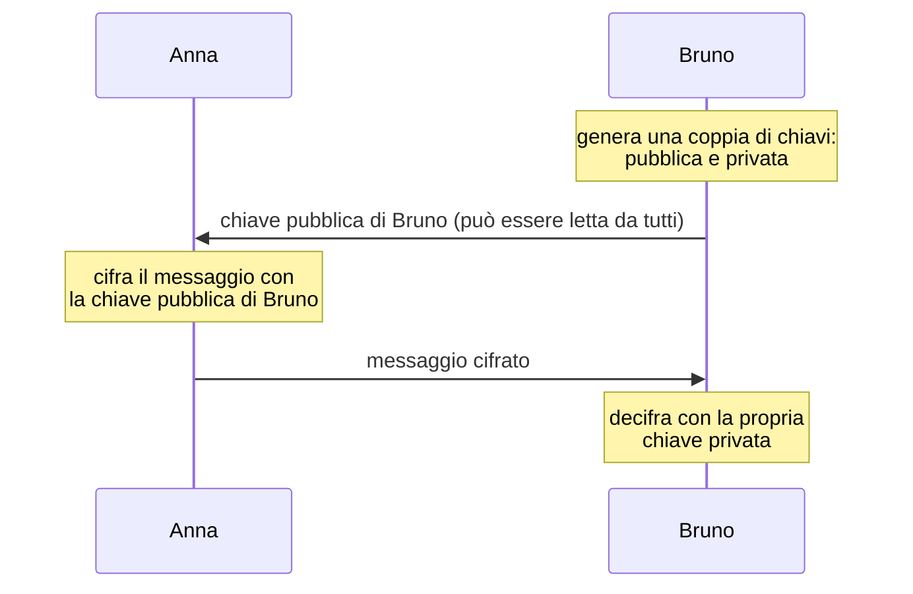

In HTTPS le due tecniche collaborano: la crittografia asimmetrica serve a verificare l'identità del server (tramite il certificato, che contiene la chiave pubblica del sito firmata da un'autorità di certificazione) e a concordare una chiave simmetrica; la comunicazione vera e propria è cifrata con la chiave simmetrica, perché la cifratura simmetrica è molto più veloce.

## Funzioni di hash

- Funzione di hash crittografica
  funzione che trasforma un dato di qualunque lunghezza in una stringa di lunghezza fissa, detta hash, impronta o digest.

Proprietà:

- deterministica: lo stesso dato produce sempre lo stesso hash
- lunghezza fissa: SHA-256 produce sempre 256 bit, cioè 64 cifre esadecimali, sia per una parola sia per un film
- non invertibile: dall'hash non si ricava il dato in modo pratico
- effetto valanga: una minima modifica del dato cambia completamente l'hash
- resistenza alle collisioni: è praticamente impossibile trovare due dati diversi con lo stesso hash

Esempio con SHA-256 (Secure Hash Algorithm, versione a 256 bit):

```text
"Verifica di integrita"   151b7fa51463ac2e2151d67f0605748ed6466d790202f573c4df583e21f7e9f3
"verifica di integrita"   e82c8490c10ad76af8360feeded799ca00f86c3cf488bee765929847ba652282
```

Le due frasi differiscono solo per la lettera iniziale; gli hash non hanno nulla in comune.

Algoritmi:

- MD5 e SHA-1: obsoleti, sono state trovate collisioni; ancora presenti in sistemi vecchi
- SHA-256 e SHA-3: in uso

Usi:

- Verifica dell'integrità dei file
  chi distribuisce un programma pubblica anche il suo hash; chi lo scarica calcola l'hash del file ricevuto e lo confronta. Se coincidono, il file non è stato alterato.
- Firma digitale
  si firma l'hash del documento, non il documento intero.
- Memorizzazione delle password
  descritta nella sezione seguente.
- Riconoscimento di file noti
  gli antivirus e il CERT-AGID usano gli hash dei file malevoli come indicatori di compromissione.

## Come si memorizzano le password

Un servizio non dovrebbe mai conoscere le password dei propri utenti in chiaro. Procedura corretta:

1. alla registrazione, il servizio genera un sale, cioè un valore casuale diverso per ogni utente
2. calcola l'hash della password unita al sale, con una funzione di hash lenta progettata per le password
3. memorizza il sale e l'hash, non la password
4. all'accesso, ripete il calcolo sulla password inserita e confronta il risultato con l'hash memorizzato

Diagramma: registrazione e accesso

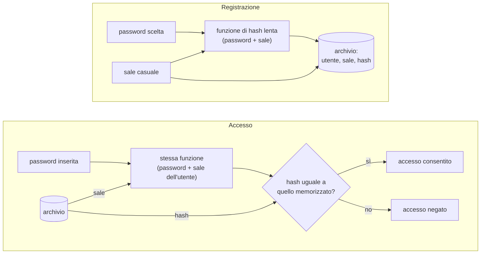

- Sale (salt)
  valore casuale memorizzato insieme all'hash. Due utenti con la stessa password hanno hash diversi, e un attaccante non può usare tabelle di hash precalcolate.
- Funzioni di hash per password
  bcrypt, scrypt, Argon2, PBKDF2: sono progettate per essere lente e costose in memoria, così ogni tentativo di un attaccante richiede tempo.

Quando un archivio di password viene rubato (violazione di dati, data breach), l'attaccante ha a disposizione gli hash e può provare password candidate senza limiti di tentativi, sul proprio computer. Quanto velocemente riesce a indovinarle dipende dalla funzione usata dal servizio e dalla qualità delle password. L'argomento prosegue nel modulo 2.

## CyberChef

CyberChef è un'applicazione web, sviluppata dall'agenzia governativa britannica GCHQ e distribuita come software libero (licenza Apache 2.0), che esegue centinaia di operazioni su dati: codifiche, cifrature, hash, compressione, analisi di file.

- Indirizzo: CyberChef, https://gchq.github.io/CyberChef/
- Funziona interamente nel browser: i dati inseriti non vengono inviati a un server
- È disponibile come archivio ZIP da usare senza rete: dalla pagina di CyberChef, pulsante `Download CyberChef`; si estrae l'archivio e si apre il file HTML contenuto

Parti dell'interfaccia:

- Operations (a sinistra): elenco delle operazioni, con casella di ricerca
- Recipe (al centro): la ricetta, cioè la sequenza di operazioni da applicare, costruita trascinando le operazioni
- Input (in alto a destra): il dato di partenza, scritto o caricato da file
- Output (in basso a destra): il risultato
- `Bake!`: esegue la ricetta; con `Auto Bake` attivo, la ricetta viene eseguita a ogni modifica

Operazioni usate nel laboratorio:

| Operazione | Effetto |
|---|---|
| `To Base64`, `From Base64` | codifica e decodifica Base64 |
| `To Hex`, `From Hex` | codifica e decodifica esadecimale |
| `URL Decode` | decodifica dei caratteri `%xx` |
| `ROT13 Brute Force` | prova tutti gli spostamenti di un cifrario a scorrimento come quello di Cesare |
| `ROT13` | applica uno spostamento scelto (campo `Amount`) |
| `SHA2` | calcola l'hash SHA-256 (campo `Size`: 256) |

## Laboratorio L3

Durata indicativa: 30 minuti. Ambiente: CyberChef, online o nella versione offline. Materiali: `L3_messaggio_cifrato.txt`, `L3_programma_didattico.txt`, `L3_hash_pubblicati.txt`.

Esercizio 1 (base): con `To Base64` codificare il proprio nome; con `From Base64` decodificare la stringa `UGFzc3dvcmQx`. Spiegare perché una password "nascosta" in Base64 non è protetta.

Esercizio 2 (base): con `ROT13` e `Amount` impostato a 3, cifrare una frase; scambiare il testo cifrato con il compagno e decifrarlo impostando `Amount` a 23 (cioè 26 - 3).

Esercizio 3 (standard): il file `L3_messaggio_cifrato.txt` contiene un messaggio cifrato con il cifrario di Cesare, con chiave sconosciuta. Con `ROT13 Brute Force` trovare la chiave e il messaggio. Contare quanti tentativi sono serviti al massimo.

Esercizio 4 (standard): calcolare con `SHA2` (dimensione 256) l'hash delle frasi `Verifica di integrita` e `verifica di integrita`, confrontarle con quelle della lezione e contare quante cifre esadecimali hanno in comune nella stessa posizione.

Esercizio 5 (standard): caricare in CyberChef il file `L3_programma_didattico.txt` (trascinandolo nell'area Input), calcolarne l'hash SHA-256 e confrontarlo con quello pubblicato in `L3_hash_pubblicati.txt`. Poi modificare una sola lettera del file, ricalcolare l'hash e confrontare.

Esercizio 6 (approfondimento): stimare quanto tempo servirebbe per provare tutte le chiavi di AES a 128 bit ipotizzando un miliardo di miliardi (10^18) di tentativi al secondo. Un anno dura circa 3,2 × 10^7 secondi.

# Lezione L4 - Malware, ingegneria sociale, difese di base

## Obiettivi della lezione

- distinguere i principali tipi di malware
- elencare i vettori di infezione più frequenti
- riconoscere le leve psicologiche usate nell'ingegneria sociale
- applicare le difese di base: aggiornamenti, backup, account non amministrativi, protezione del dispositivo
- sapere che cosa fare in caso di incidente

## Malware

- Malware (malicious software)
  software progettato per danneggiare, spiare o prendere il controllo di un dispositivo senza il consenso del proprietario.

Tipi principali:

- Virus
  codice che si inserisce in altri file o programmi e si attiva quando questi vengono aperti.
- Worm
  malware che si diffonde da solo attraverso la rete, sfruttando vulnerabilità, senza bisogno di un'azione dell'utente.
- Trojan (cavallo di Troia)
  programma che si presenta come utile o innocuo (un gioco, un'app, una fattura) e contiene funzioni nascoste malevole.
- RAT (Remote Access Trojan)
  trojan che dà all'attaccante il controllo remoto del dispositivo: schermo, file, tastiera, fotocamera.
- Ransomware
  malware che cifra i file della vittima e chiede un riscatto per la chiave di decifratura; spesso copia prima i dati e minaccia di pubblicarli (doppia estorsione).
- Infostealer
  malware che raccoglie password salvate nel browser, cookie di sessione, dati di carte di pagamento, portafogli di criptovalute, e li invia all'attaccante. I cookie di sessione rubati permettono di entrare negli account senza password e senza secondo fattore, finché la sessione resta valida.
- Spyware
  software che registra di nascosto le attività dell'utente.
- Loader (dropper)
  primo componente di un'infezione: un programma piccolo che scarica e avvia altri malware.

Molti attacchi reali combinano più componenti: un messaggio convince la vittima ad aprire un file, il file avvia un loader, il loader scarica un infostealer o un RAT.

Diagramma: catena di infezione tipica

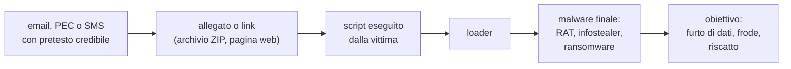

## Vettori di infezione

- allegati di posta: archivi compressi, documenti con macro, file HTML, collegamenti, script
- link a siti che scaricano file o chiedono di installare un'app
- software, giochi e film scaricati da fonti non ufficiali (pirateria)
- estensioni del browser e app di terze parti con permessi eccessivi
- finti aggiornamenti del browser o del sistema proposti da una pagina web
- app per smartphone installate al di fuori degli store ufficiali (sui telefoni Android, file `.apk`)
- chiavette USB di origine sconosciuta
- vulnerabilità di software non aggiornato esposto in rete

Segnale d'allarme sugli smartphone Android: un'app che chiede di attivare i servizi di accessibilità senza un motivo evidente. Questi servizi, pensati per le persone con disabilità, permettono di leggere lo schermo e simulare tocchi, e sono usati da molti malware per rubare credenziali e controllare il telefono.

## Ingegneria sociale

- Ingegneria sociale (social engineering)
  insieme di tecniche che inducono una persona a compiere un'azione dannosa per sé o per la propria organizzazione (rivelare una password, aprire un file, fare un pagamento) sfruttando meccanismi psicologici invece che debolezze tecniche.

Attaccare una persona è spesso più semplice che attaccare un sistema ben protetto. La maggior parte degli attacchi riusciti inizia con un messaggio che convince qualcuno a fare qualcosa.

Leve psicologiche sfruttate, in parte derivate dai principi della persuasione descritti dallo psicologo Robert Cialdini:

| Leva | Meccanismo | Esempio di frase |
|---|---|---|
| autorità | si obbedisce a chi sembra avere un ruolo ufficiale | "Agenzia delle Entrate: comunicazione di irregolarità" |
| urgenza | il poco tempo impedisce di riflettere | "entro 24 ore l'account verrà chiuso" |
| paura | la minaccia di un danno spinge ad agire | "rilevato accesso non autorizzato al tuo conto" |
| avidità, opportunità | la prospettiva di un guadagno abbassa la guardia | "rimborso di 95 euro in attesa di accredito" |
| scarsità | ciò che è raro sembra prezioso | "solo per i primi 100 utenti" |
| fiducia, familiarità | un mittente conosciuto non viene verificato | messaggio da una casella di un collega compromessa |
| reciprocità | chi riceve un favore si sente in debito | "ti ho aiutato, ora aiutami a verificare questo codice" |
| riprova sociale | se lo fanno tutti sembra corretto | "già 3.000 studenti hanno ricevuto il bonus" |
| curiosità | il desiderio di sapere spinge al clic | "guarda chi ha visitato il tuo profilo" |

Il pretesto, cioè la storia che giustifica la richiesta, segue l'attualità: scadenze fiscali, bonus, rimborsi, consegne di pacchi, eventi sportivi, iniziative della scuola.

## Casi reali italiani

Tre campagne descritte dal CERT-AGID nel settembre 2026.

Caso 1: malware via PEC compromesse.
Da caselle PEC compromesse partono messaggi che sollecitano il pagamento di una fattura non pagata. L'allegato è un archivio ZIP con un file HTML che scarica codice JavaScript; il codice avvia comandi PowerShell che installano MintsLoader, un loader che scarica altri malware (controllo remoto, furto di dati).
Fonte: CERT-AGID, MintsLoader via PEC: falsi solleciti di pagamento per diffondere malware, https://cert-agid.gov.it/news/mintsloader-via-pec-falsi-solleciti-di-pagamento-per-diffondere-malware/

Caso 2: falso sito del Servizio Sanitario Nazionale.
Un sito che imita il Servizio Sanitario Nazionale riconosce il tipo di dispositivo e propone un file diverso: un'app `.apk` sugli smartphone Android, che chiede l'attivazione dei servizi di accessibilità e installa un malware di controllo remoto con pagine false per rubare credenziali; un file `.bat` su Windows, che installa un RAT.
Fonte: CERT-AGID, Falso sito del Servizio Sanitario Nazionale distribuisce StreamRat su Android e XWorm su Windows, https://cert-agid.gov.it/news/falso-sito-del-servizio-sanitario-nazionale-distribuisce-streamrat-su-android-e-xworm-su-windows/

Caso 3: falso rimborso della TARI.
Siti che imitano la piattaforma dei pagamenti pubblici PagoPA annunciano un rimborso per un pagamento in eccesso della tassa sui rifiuti. Per "ricevere" il rimborso la vittima inserisce codice fiscale, dati anagrafici, recapiti e tutti i dati della carta di pagamento, compreso il codice di sicurezza.
Fonte: CERT-AGID, Falso rimborso TARI sfruttato nelle nuove campagne di phishing ai danni di PagoPA, https://cert-agid.gov.it/news/falso-rimborso-tari-sfruttato-nelle-nuove-campagne-di-phishing-ai-danni-di-pagopa/

## Difese di base

- Aggiornamenti
  gli aggiornamenti del sistema operativo, del browser e delle app correggono vulnerabilità note. Una vulnerabilità pubblicata viene sfruttata in tempi brevi sui sistemi non aggiornati. Conviene attivare gli aggiornamenti automatici.
- Account non amministrativi
  usare il computer con un account senza privilegi di amministratore limita ciò che un malware può fare. È un'applicazione del principio del minimo privilegio: ogni utente e ogni programma dovrebbe avere solo i permessi strettamente necessari.
- Antivirus ed EDR
  i software di protezione riconoscono i malware noti tramite hash e firme e quelli nuovi tramite l'analisi del comportamento, oggi spesso con modelli di apprendimento automatico. EDR (Endpoint Detection and Response) indica i sistemi aziendali che sorvegliano il comportamento dei dispositivi e permettono di intervenire a distanza. Windows include Microsoft Defender.
- App solo dagli store ufficiali
  e attenzione ai permessi richiesti.
- Blocco del dispositivo e cifratura
  PIN o codice di sblocco; cifratura del disco (attiva di default sugli smartphone recenti); in caso di furto i dati restano illeggibili.
- Backup
  copie dei dati da cui ripristinare in caso di guasto, furto o ransomware.

### La regola del backup 3-2-1

Diagramma: la regola 3-2-1

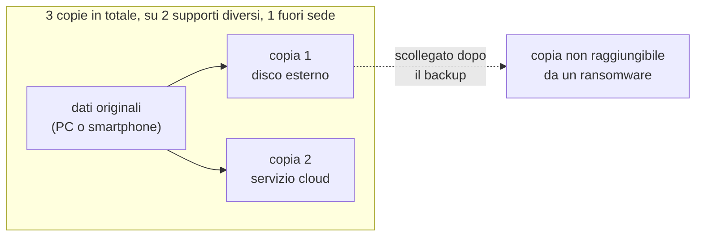

- 3 copie dei dati (l'originale e due copie)
- 2 tipi di supporto diversi (per esempio disco esterno e cloud)
- 1 copia fuori sede (per esempio nel cloud o in un altro luogo)

Contro il ransomware conta che almeno una copia non sia raggiungibile dal dispositivo infetto: un disco esterno scollegato dopo il backup, o un servizio cloud con versioni precedenti dei file. Un backup va provato: una copia che non si riesce a ripristinare non serve.

## Che cosa fare in caso di incidente

Diagramma: risposta a un incidente personale

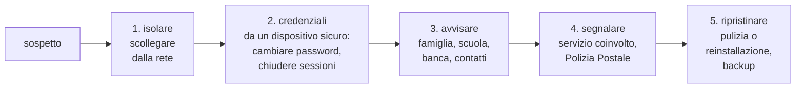

Indicazioni:

- non pagare riscatti: non garantiscono il recupero dei dati e finanziano altri attacchi
- non cancellare messaggi e file sospetti prima di aver chiesto indicazioni: servono per la segnalazione
- cambiare le password da un dispositivo non compromesso; su un dispositivo infetto un infostealer può rubare anche le nuove
- se sono stati inseriti dati di una carta di pagamento, contattare subito la banca per bloccarla
- chiedere aiuto: la vergogna di essere stati ingannati ritarda la reazione e aumenta il danno; gli attacchi ben costruiti ingannano anche persone esperte

La Polizia Postale e delle Comunicazioni è il reparto della Polizia di Stato competente per i reati informatici; il suo portale per le segnalazioni è https://www.commissariatodips.it/.

## Laboratorio L4

Durata indicativa: 25 minuti. Lavoro a gruppi di tre. Materiale: scheda `L4_scheda_campagne.md`.

Esercizio 1 (base): per ciascuno dei tre casi reali descritti nella lezione compilare la tabella.

| Voce | Caso 1 | Caso 2 | Caso 3 |
|---|---|---|---|
| vettore (email, PEC, SMS, sito) | | | |
| pretesto | | | |
| leve psicologiche | | | |
| azione richiesta alla vittima | | | |
| che cosa ottiene l'attaccante | | | |
| proprietà RID violata | | | |
| difesa più efficace | | | |

Esercizio 2 (standard): per ciascun caso indicare in quale fase del modello a tre fasi (ricognizione, accesso iniziale, azione sull'obiettivo) interviene la difesa scelta, e proporne una seconda che agisca in una fase diversa.

Esercizio 3 (approfondimento): aprire l'ultima sintesi settimanale del CERT-AGID e individuare i tre temi (pretesti) più frequenti della settimana e gli enti o le aziende di cui è stato usato il nome.
