<!-- _class: titolo -->
<!-- _paginate: false -->

## Modulo 1 - Fondamenti di sicurezza

B.4 - Cybersicurezza e IA

Lezioni L1, L2, L3, L4

---

## L1 - Che cos'è la cybersicurezza

- informazione e asset
- la triade RID
- minaccia, vulnerabilità, rischio
- chi attacca e perché; fasi di un attacco
- difesa in profondità
- hacking etico e limiti legali
- il CERT-AGID

---

## Cybersicurezza e asset

- **Cybersicurezza**: misure tecniche, organizzative e di comportamento che proteggono sistemi, reti e dati da accessi non autorizzati, modifiche, danni, interruzioni
- **Asset digitale**: ciò che ha valore e va protetto: dati, account, dispositivi, servizi, reputazione

Asset di una persona: posta, social, registro elettronico, SPID o CIE, smartphone, foto, messaggi

La casella di posta è l'asset chiave: da lì si recuperano le password degli altri account.

---

## La triade RID (CIA)

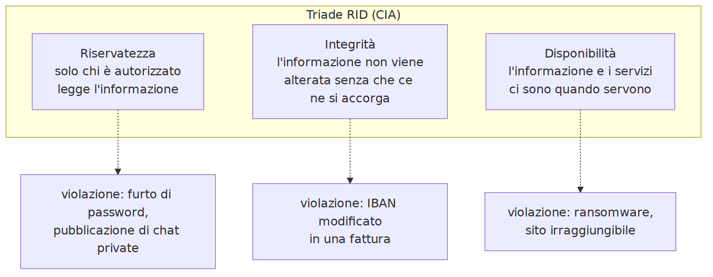

Collegate: **autenticità** (origine certa) e **non ripudio** (non si può negare un'azione compiuta)

---

## Un attacco, più proprietà violate

Ransomware moderno:

- cifra i file: **disponibilità**
- prima li copia e minaccia di pubblicarli: **riservatezza**

Tecnica della **doppia estorsione**

---

## Minaccia, vulnerabilità, rischio

- **Minaccia**: evento o soggetto che può causare un danno
- **Vulnerabilità**: debolezza sfruttabile
- **Attacco**: tentativo concreto di sfruttarla
- **Impatto**: entità del danno
- **Rischio** = probabilità × impatto
- **Superficie di attacco**: tutti i punti da cui si può tentare di entrare

---

## Relazione tra i concetti

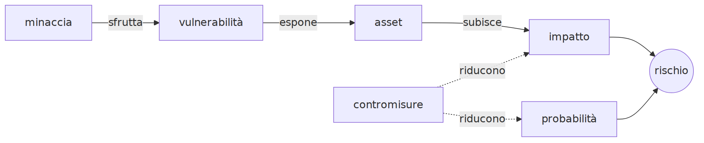

Le contromisure riducono la probabilità (MFA) o l'impatto (backup).

---

## Chi attacca e perché

| Attaccante | Obiettivo | Esempio |
|---|---|---|
| criminalità | denaro | ransomware, furto di credenziali, truffe |
| hacktivisti | visibilità di una causa | siti resi irraggiungibili |
| attori statali | spionaggio, sabotaggio | intrusioni prolungate |
| insider | vendetta, guadagno, errore | copia di dati aziendali |
| occasionali | curiosità, scherzo | account di un compagno |

**Opportunistici** (chiunque sia vulnerabile, su grandi numeri) e **mirati** (una vittima scelta)

---

## Le fasi di un attacco

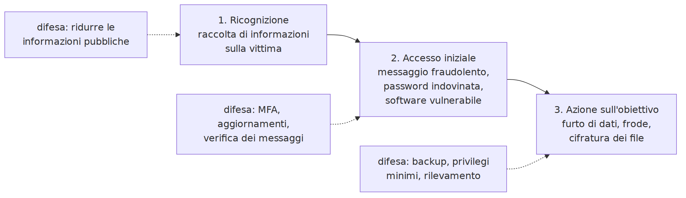

Modello semplificato; il riferimento professionale è la Cyber Kill Chain (7 fasi). Basta interrompere una fase.

---

## Difesa in profondità

| Livello | Contromisura | Se fallisce |
|---|---|---|
| persona | riconoscere il messaggio fraudolento | password inserita in un sito falso |
| credenziale | password lunga e unica | non vale per altri servizi |
| autenticazione | secondo fattore | la password da sola non basta |
| servizio | avviso di nuovo accesso | ci si accorge dell'intrusione |
| dati | backup | i dati si recuperano |

Nessuna contromisura è perfetta: conta la combinazione.

---

## Hacking etico e limiti legali

- **Hacking etico**: attacco simulato con autorizzazione scritta del proprietario
- La differenza tra test e reato è l'**autorizzazione**

Codice penale:

- art. 615-ter: **accesso abusivo** a sistema informatico, anche senza danni
- art. 615-quater: detenzione e diffusione di codici di accesso
- art. 640-ter: frode informatica

Entrare nell'account di un compagno è accesso abusivo. Imputabilità dai 14 anni.

---

## Regole del corso

- le tecniche di attacco si studiano per difendersi
- si sperimentano solo su materiali e piattaforme predisposti
- nessun attacco a sistemi reali, rete della scuola, account di altre persone

---

## Il CERT-AGID

- **CERT**: raccoglie segnalazioni, analizza minacce, diffonde avvisi
- **CERT-AGID**: CERT dell'Agenzia per l'Italia Digitale
- notizie sulle campagne malevole in Italia, sintesi settimanali (130-200 campagne a settimana), report annuali, glossario
- **campagna malevola**: messaggi o siti fraudolenti con lo stesso schema
- **IoC**: indicatore di compromissione (dominio, indirizzo, hash di un file)

https://cert-agid.gov.it/

---

## Laboratorio L1

Scheda `L1_scheda_analisi_casi.md`, a coppie

1. (base) due notizie del CERT-AGID: asset, minaccia, vulnerabilità, proprietà RID, impatto, contromisura
2. (standard) mappa dei propri asset digitali, senza dati reali
3. (approfondimento) l'asset da cui dipendono gli altri: due livelli di difesa

---

<!-- _class: titolo -->

## L2 - Internet quanto basta per non farsi ingannare

IP, DNS, URL, HTTPS, posta elettronica

---

## IP, dominio, DNS

- **Indirizzo IP**: numero che identifica un dispositivo (`93.184.215.14`)
- **Nome di dominio**: nome leggibile (`istruzione.it`)
- **DNS**: traduce nomi in indirizzi, come una rubrica

Gerarchia, da destra: TLD (`.it`), dominio registrato (`istruzione.it`), sottodomini (`www.`)

Solo il proprietario di un dominio crea i suoi sottodomini.

---

## Risoluzione DNS

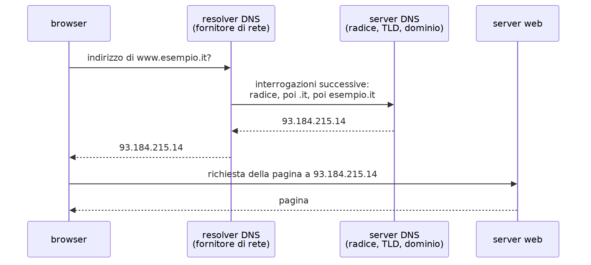

---

## Anatomia di un URL


---

## Chi controlla il sito?

| URL | Dominio registrato | Banca Aurora? |
|---|---|---|
| `https://www.bancaaurora.example/login` | `bancaaurora.example` | sì |
| `https://bancaaurora.example.verifica-accessi.example/` | `verifica-accessi.example` | no |
| `https://accesso-bancaaurora.example/` | `accesso-bancaaurora.example` | no |
| `https://www.bancaaurora.example@sicuro-login.example/` | `sicuro-login.example` | no |

Regola: trovare il TLD a destra, leggere il nome subito a sinistra. `.example` è riservato agli esempi.

---

## HTTPS e certificati

- **HTTP**: dati in chiaro
- **HTTPS**: HTTP cifrato con TLS; il server presenta un **certificato** firmato da un'autorità (CA)

Il lucchetto garantisce:

- connessione cifrata
- certificato valido **per quel dominio**

Non garantisce che il sito sia onesto: un certificato si ottiene gratis e in automatico. Molti siti di phishing usano HTTPS.

---

## La posta elettronica: intestazioni

| Intestazione | Attenzione |
|---|---|
| `From:` | il nome visualizzato è testo libero |
| `Reply-To:` | se diverso, la risposta va altrove |
| `Return-Path:` | spesso rivela il vero dominio di invio |
| `Received:` | server attraversati; la riga più in basso è l'origine |
| `Authentication-Results:` | esito di SPF, DKIM, DMARC |

Intestazioni complete: `Mostra originale`, `Visualizza sorgente`

---

## Un esempio

```text
From: "Banca Aurora - Servizio Clienti" <notifiche@bancaaurora-sicurezza.example>
Reply-To: assistenza.clienti.2026@mail-gratis.example
Return-Path: <bounce@invii-massivi.example>
Subject: Accesso sospeso: verifica entro 24 ore
Authentication-Results: mx.scuola.example;
       spf=fail smtp.mailfrom=invii-massivi.example;
       dkim=none;
       dmarc=fail header.from=bancaaurora-sicurezza.example
```

- dominio diverso da `bancaaurora.example`
- risposte a una casella gratuita
- controlli falliti

---

## Nel programma di posta


---

## SPF, DKIM, DMARC

- **SPF**: elenco dei server autorizzati a inviare per un dominio
- **DKIM**: firma crittografica del messaggio, verificata con una chiave nel DNS
- **DMARC**: regola del proprietario del dominio su che cosa fare dei messaggi che falliscono

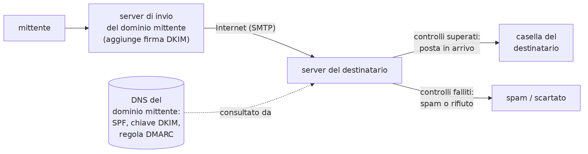

---

## Il limite di SPF, DKIM, DMARC

Verificano che il messaggio venga **dal dominio indicato**, non che il dominio sia **onesto**.

- un truffatore che registra `bancaaurora-sicurezza.example` può configurarli correttamente: controlli superati
- una casella legittima compromessa supera i controlli

**PEC**: certifica invio e consegna, non l'affidabilità del mittente o degli allegati.

---

## Domini ingannevoli

- **Typosquatting**: `bancaurora.example`, `banca-aurora.example`, `bancaaurora.example.com`
- **Sottodominio fuorviante**: `bancaaurora.example.accesso-verificato.example`
- **Omografo**: `а` cirillica al posto di `a` latina
- **Punycode**: codifica ASCII dei domini non latini, prefisso `xn--`

`bаncaaurora.example` (con `а` cirillica) = `xn--bncaaurora-zqi.example`

---

## Laboratorio L2

Materiali: `L2_url_da_analizzare.txt`, `L2_email_1.eml`, `L2_email_2.eml`, `L2_email_3.eml`

Aprire i `.eml` con un editor di testo, non con il programma di posta.

1. (base) dodici URL: schema, host, dominio registrato, appartenenza
2. (base) certificato di un sito istituzionale: dominio, CA, validità
3. (standard) tre email: mittente, `Reply-To`, SPF/DKIM/DMARC, link, giudizio
4. (approfondimento) l'email fraudolenta che supera tutti i controlli

---

<!-- _class: titolo -->

## L3 - Crittografia essenziale

Codificare, cifrare, calcolare un hash

---

## Tre trasformazioni diverse

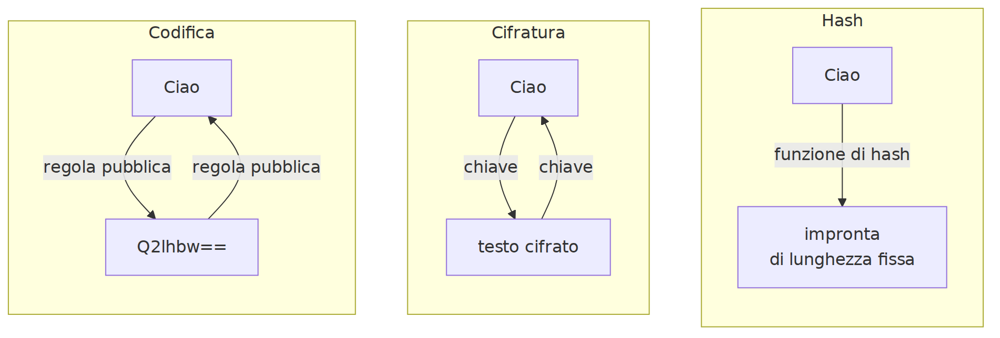

- **Codifica**: regola pubblica, nessun segreto; non protegge
- **Cifratura**: serve una chiave; riservatezza
- **Hash**: impronta di lunghezza fissa, non invertibile; integrità

---

## Codifiche comuni

| Codifica | Esempio | Uso |
|---|---|---|
| Base64 | `Ciao` → `Q2lhbw==` | allegati, dati binari nel testo |
| esadecimale | `Ciao` → `43 69 61 6f` | byte |
| codifica URL | spazio → `%20`, `@` → `%40` | caratteri speciali negli URL |

Negli attacchi servono a nascondere link o comandi a un controllo superficiale. Base64 si decodifica in un istante.

---

## Cifratura simmetrica

- **testo in chiaro**, **testo cifrato**, **chiave**
- stessa chiave per cifrare e decifrare

Cifrario di Cesare, chiave 3:

```text
ATTACCA ALL ALBA  →  DWWDFFD DOO DOED
```

---

## Spazio delle chiavi e forza bruta

- **Spazio delle chiavi**: tutte le chiavi possibili
- **Forza bruta**: provarle tutte

| Cifrario | Chiavi possibili | Forza bruta |
|---|---|---|
| Cesare | 25 | istantanea |
| AES-128 | 2^128 ≈ 3,4 × 10^38 | impraticabile |

**Principio di Kerckhoffs**: la sicurezza dipende solo dalla segretezza della chiave, non dell'algoritmo.

---

## Cifratura asimmetrica

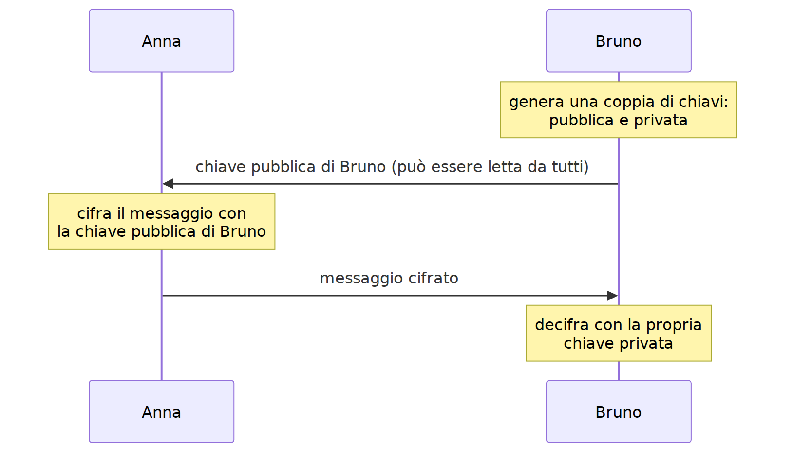

- chiave **pubblica** (a tutti) e **privata** (segreta)
- **firma digitale**: si firma con la privata, si verifica con la pubblica
- HTTPS: asimmetrica per identità e accordo sulla chiave, simmetrica per i dati

---

## Funzioni di hash

- deterministica, **lunghezza fissa** (SHA-256: 64 cifre esadecimali)
- **non invertibile**
- **effetto valanga**
- resistente alle collisioni

```text
"Verifica di integrita"  151b7fa51463ac2e2151d67f0605748ed6466d79...
"verifica di integrita"  e82c8490c10ad76af8360feeded799ca00f86c3c...
```

MD5, SHA-1: obsoleti. SHA-256, SHA-3: in uso.

---

## Usi dell'hash

- **integrità dei file**: confronto con l'hash pubblicato dall'autore
- **firma digitale**: si firma l'hash
- **memorizzazione delle password**
- **riconoscimento di file malevoli** (IoC, antivirus)

---

## Come si memorizzano le password

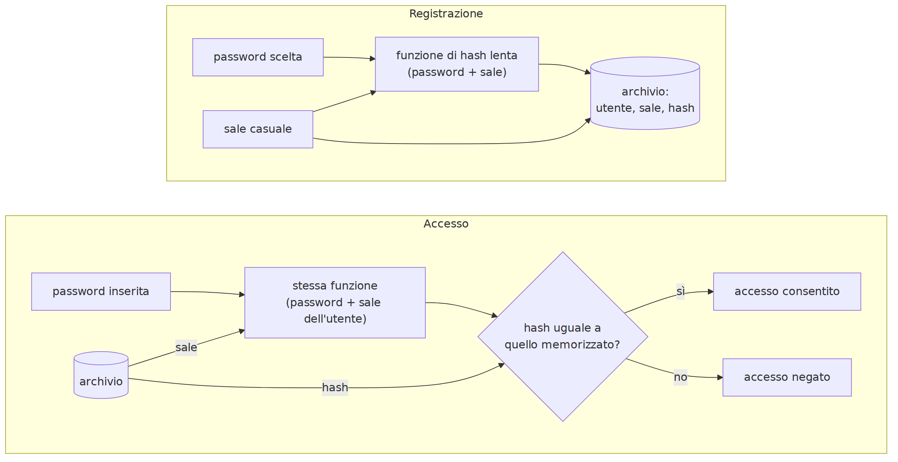

---

## Sale e funzioni lente

- **Sale**: valore casuale per ogni utente; stesse password, hash diversi; niente tabelle precalcolate
- **Funzioni per password**: bcrypt, scrypt, Argon2, PBKDF2; lente di proposito

Con un archivio rubato l'attaccante prova password candidate **senza limiti di tentativi**, sul proprio computer. Segue nel modulo 2.

---

## CyberChef

- applicazione web di GCHQ, licenza Apache 2.0
- tutto nel browser: i dati non vanno a un server
- versione offline: pulsante `Download CyberChef`, archivio ZIP

Operations, Recipe, Input, Output, `Bake!`

| Operazione | Effetto |
|---|---|
| `To Base64` / `From Base64` | Base64 |
| `URL Decode` | decodifica `%xx` |
| `ROT13` / `ROT13 Brute Force` | cifrario a scorrimento |
| `SHA2` (256) | hash SHA-256 |

https://gchq.github.io/CyberChef/

---

## Laboratorio L3

CyberChef. Materiali: `L3_messaggio_cifrato.txt`, `L3_programma_didattico.txt`, `L3_hash_pubblicati.txt`

1. (base) Base64: codificare il proprio nome, decodificare `UGFzc3dvcmQx`
2. (base) ROT13 con `Amount` 3; decifrare con 23
3. (standard) forza bruta sul messaggio cifrato
4. (standard) hash delle due frasi: quante cifre in comune?
5. (standard) verifica dell'hash di un file; poi modificare una lettera
6. (approfondimento) tempo per provare 2^128 chiavi a 10^18 tentativi al secondo

---

<!-- _class: titolo -->

## L4 - Malware, ingegneria sociale, difese di base

---

## Malware

- **Virus**: si inserisce in altri file
- **Worm**: si diffonde da solo in rete
- **Trojan**: sembra innocuo, contiene funzioni malevole
- **RAT**: controllo remoto del dispositivo
- **Ransomware**: cifra i file, chiede un riscatto
- **Infostealer**: ruba password salvate, cookie di sessione, carte
- **Spyware**: registra le attività
- **Loader**: scarica e avvia altri malware

---

## Catena di infezione tipica

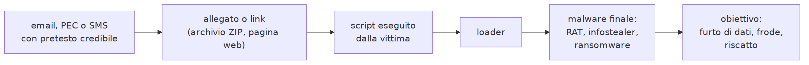

---

## Vettori di infezione

- allegati: archivi, documenti con macro, HTML, script
- link a siti che scaricano file o app
- software e giochi pirata
- estensioni e app con permessi eccessivi
- finti aggiornamenti proposti da pagine web
- app Android fuori dagli store (`.apk`)
- chiavette USB sconosciute
- software non aggiornato esposto in rete

Allarme: app che chiede i **servizi di accessibilità** di Android.

---

## Ingegneria sociale

Indurre una persona a compiere un'azione dannosa sfruttando meccanismi psicologici.

| Leva | Esempio |
|---|---|
| autorità | "Agenzia delle Entrate: irregolarità" |
| urgenza | "entro 24 ore l'account verrà chiuso" |
| paura | "accesso non autorizzato al tuo conto" |
| opportunità | "rimborso di 95 euro in attesa" |
| fiducia | messaggio da un collega compromesso |
| curiosità | "guarda chi ha visitato il tuo profilo" |

Il **pretesto** segue l'attualità: tasse, bonus, rimborsi, pacchi.

---

## Casi reali, settembre 2026 (CERT-AGID)

1. **PEC compromesse**: sollecito di fattura; ZIP con HTML, JavaScript, PowerShell; loader MintsLoader
2. **Falso sito SSN**: app `.apk` con richiesta dei servizi di accessibilità (Android), file `.bat` (Windows); malware di controllo remoto
3. **Falso rimborso TARI a nome di PagoPA**: richiesta di codice fiscale, dati anagrafici e dati completi della carta

https://cert-agid.gov.it/

---

## Difese di base

- **aggiornamenti** automatici
- **account non amministrativi**: principio del minimo privilegio
- **antivirus ed EDR**: firme e analisi del comportamento, spesso con ML
- app solo dagli **store ufficiali**; controllo dei permessi
- **blocco del dispositivo** e **cifratura**
- **backup**

---

## Backup 3-2-1

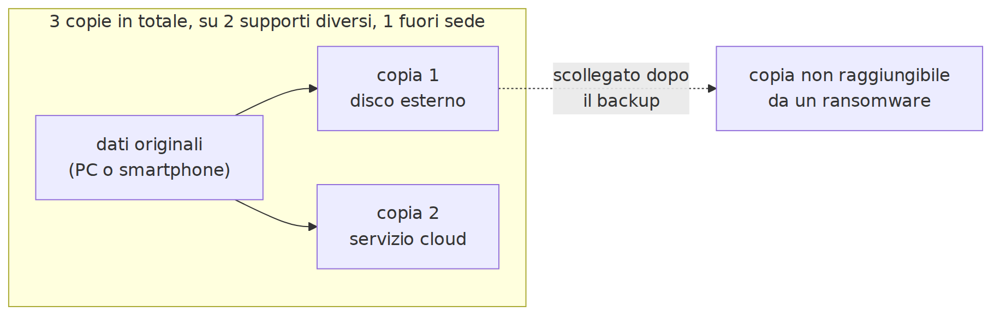

3 copie, 2 supporti, 1 fuori sede. Contro il ransomware: una copia **non raggiungibile**. Un backup va **provato**.

---

## In caso di incidente

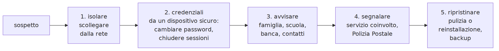

- non pagare riscatti; non cancellare le prove
- cambiare le password da un dispositivo **pulito**
- carta coinvolta: bloccarla subito
- chiedere aiuto: gli attacchi ben fatti ingannano anche gli esperti

Polizia Postale: https://www.commissariatodips.it/

---

## Laboratorio L4

Scheda `L4_scheda_campagne.md`, gruppi di tre

1. (base) tre casi: vettore, pretesto, leve, azione richiesta, obiettivo, RID, difesa
2. (standard) fase in cui agisce la difesa; una seconda difesa in un'altra fase
3. (approfondimento) ultima sintesi settimanale CERT-AGID: temi ed enti più usati
