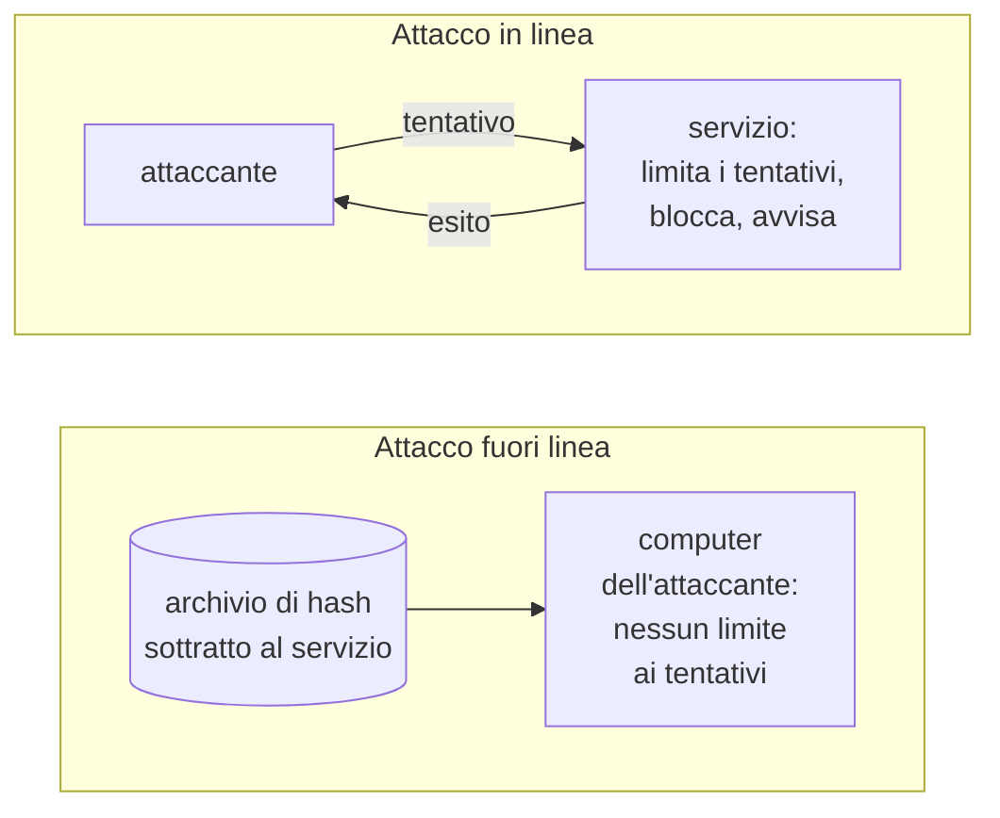
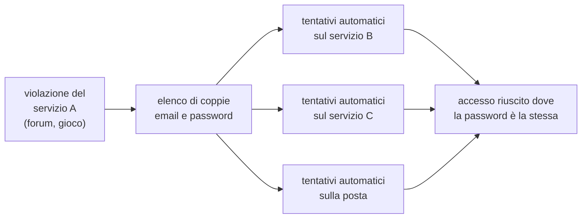
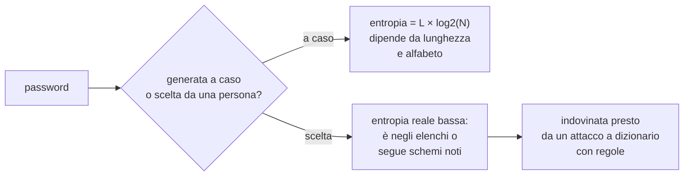
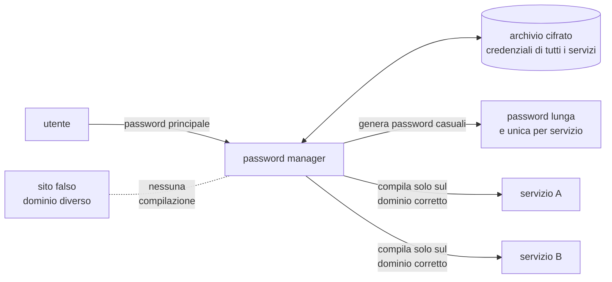
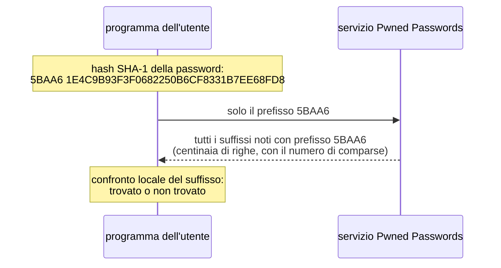
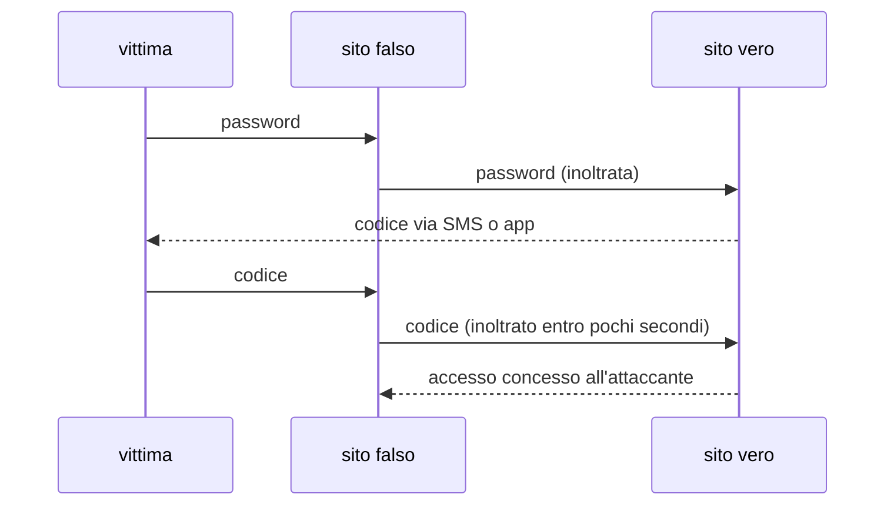
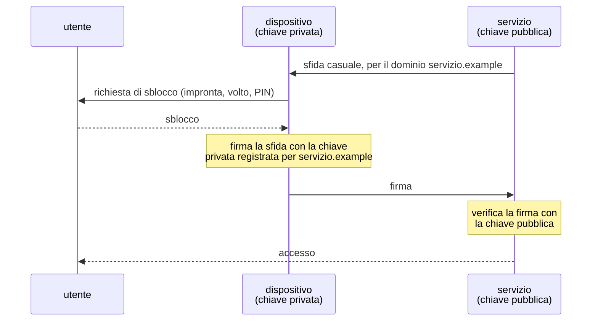
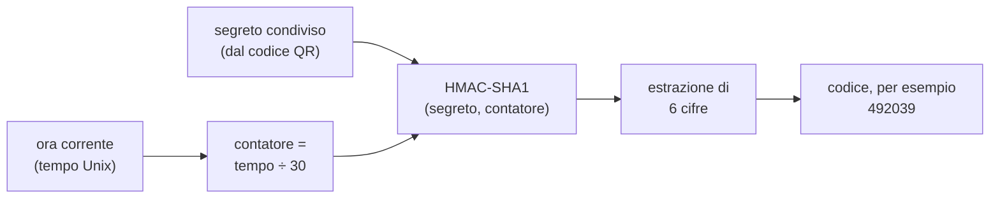

# Lezione L5 - Come si attaccano le password

## Obiettivi della lezione

- distinguere i tre fattori di autenticazione
- distinguere attacchi in linea e fuori linea e i loro limiti
- descrivere a livello di meccanismo le principali famiglie di attacco alle password
- spiegare perché il riuso delle password è il rischio più grave
- calcolare l'entropia di una password casuale e interpretarla
- spiegare come le informazioni pubbliche e l'IA rendono prevedibili le password scelte dalle persone
- usare un semplice controllo di robustezza dal punto di vista di chi gestisce un servizio

## Autenticazione e fattori

- Identificazione
  dichiarare chi si è, per esempio inserendo un nome utente o un indirizzo email.
- Autenticazione
  dimostrare di essere davvero chi si dichiara di essere.
- Autorizzazione
  stabilire che cosa può fare chi si è autenticato.

L'autenticazione si basa su uno o più fattori:

- Qualcosa che si sa
  password, PIN, risposta a una domanda.
- Qualcosa che si ha
  smartphone con un'app di autenticazione, chiave di sicurezza USB, carta con chip.
- Qualcosa che si è
  caratteristiche biometriche: impronta digitale, volto.

Un'autenticazione a più fattori (MFA, multi-factor authentication) combina fattori di tipo diverso. Due password non sono due fattori: sono lo stesso fattore ripetuto. L'argomento è trattato in L7.

## Attacchi in linea e fuori linea

La differenza fondamentale riguarda dove l'attaccante prova le password.

- Attacco in linea (online)
  l'attaccante prova le password sul servizio stesso, per esempio sulla pagina di accesso. Ogni tentativo passa dal servizio, che può rallentarlo, bloccarlo dopo un certo numero di errori, chiedere una verifica aggiuntiva, avvisare l'utente. Le raccomandazioni NIST impongono ai servizi di limitare i tentativi falliti consecutivi.
- Attacco fuori linea (offline)
  l'attaccante ha ottenuto l'archivio degli hash delle password, per esempio in seguito a una violazione di dati, e prova le password candidate sul proprio computer confrontando gli hash, come descritto in L3. Il servizio non vede nulla e non può limitare i tentativi; la velocità dipende solo dalla potenza di calcolo e dalla lentezza della funzione di hash usata dal servizio.

Diagramma: attacco in linea e fuori linea

Conseguenze:

- contro un attacco in linea anche una password di media robustezza resiste, perché i tentativi possibili sono pochi
- contro un attacco fuori linea resistono solo le password lunghe e imprevedibili, soprattutto se il servizio usa una funzione di hash veloce e inadatta alle password
- l'utente non sa quale funzione usa ciascun servizio, né se il servizio subirà una violazione: conviene scegliere password che resistano al caso peggiore

## Famiglie di attacco

- Forza bruta
  tentativo di tutte le combinazioni possibili di caratteri fino a una certa lunghezza. Efficace solo contro password corte.
- Attacco a dizionario
  tentativo di un elenco di parole e di password probabili: password comuni, parole della lingua, nomi, password già trapelate in passato.
- Attacco a dizionario con regole
  le parole dell'elenco vengono trasformate secondo le abitudini delle persone: maiuscola iniziale, numeri o anno in fondo, simbolo finale, sostituzione di lettere con cifre o simboli simili. Per questo `Estate2026!` è debole, anche se rispetta le regole di composizione di molti siti.
- Credential stuffing
  riutilizzo automatico, su molti servizi diversi, di coppie email e password trapelate da una violazione. Funziona perché molte persone usano la stessa password ovunque.
- Password spraying
  tentativo di poche password molto comuni su moltissimi account dello stesso servizio, per restare sotto la soglia di blocco di ciascun account.
- Furto diretto
  la password non viene indovinata ma sottratta: phishing (L8), malware infostealer (L4), osservazione alle spalle (shoulder surfing), password scritte su un foglio accanto al computer.

Diagramma: credential stuffing

## Violazioni di dati e riuso delle password

- Violazione di dati (data breach)
  incidente in cui dati personali vengono sottratti o resi accessibili a persone non autorizzate. Spesso comprende indirizzi email e password o hash di password.

Le violazioni di dati riguardano ogni anno milioni di account; i dati sottratti vengono raccolti, scambiati e venduti. Il servizio Have I Been Pwned, citato in L6, contiene oltre 17 miliardi di account compromessi provenienti da più di mille violazioni.

La conseguenza pratica: la sicurezza di una password riusata è pari a quella del servizio meno protetto in cui è stata usata. Una password unica per ogni servizio limita il danno di una violazione a quel solo servizio.

## Entropia: quanto è difficile indovinare

- Entropia di una password
  misura, in bit, del numero di tentativi necessari a indovinarla nel caso peggiore. Una password con entropia di n bit richiede al massimo 2^n tentativi.

Per una password generata casualmente, con ogni carattere scelto a caso da un alfabeto di N simboli e lunghezza L:

entropia = L × log2(N) bit

| Alfabeto | N | Lunghezza | Entropia |
|---|---|---|---|
| solo minuscole | 26 | 8 | 37,6 bit |
| minuscole, maiuscole, cifre | 62 | 8 | 47,6 bit |
| tutti i caratteri stampabili | 94 | 8 | 52,4 bit |
| tutti i caratteri stampabili | 94 | 12 | 78,7 bit |
| solo minuscole | 26 | 15 | 70,5 bit |
| solo minuscole | 26 | 20 | 94,0 bit |

Osservazioni:

- ogni bit in più raddoppia i tentativi necessari
- aggiungere caratteri aumenta l'entropia più che ampliare l'alfabeto: 15 minuscole casuali valgono più di 8 caratteri di ogni tipo
- la formula vale solo per password generate a caso. Una password scelta da una persona ha un'entropia reale molto più bassa di quella calcolata sul numero di caratteri, perché le persone scelgono parole, nomi, date e schemi prevedibili

Diagramma: entropia e tipo di attacco

## Password prevedibili, informazioni pubbliche, IA

Le password scelte dalle persone si concentrano su pochi schemi: una parola significativa, un nome, una squadra, un animale, una data; maiuscola iniziale; numeri o anno alla fine; un simbolo in fondo se richiesto. Chi attacca sfrutta questa prevedibilità in due modi.

- Informazioni pubbliche sulla vittima
  nome del cane, squadra del cuore, data di nascita, nome del partner o dei figli, città: spesso sono pubblicati sui social. Per un attacco mirato, queste informazioni formano un dizionario personalizzato. Le domande di sicurezza ("nome del primo animale") hanno lo stesso difetto.
- Modelli statistici e IA
  modelli addestrati su milioni di password trapelate apprendono le regolarità delle scelte umane e producono le password candidate nell'ordine in cui è più probabile che le persone le scelgano. Il principio è lo stesso dei modelli linguistici che prevedono la parola successiva in un testo.

Stato delle conoscenze: gli studi mostrano che questi modelli funzionano e che, combinati con i metodi tradizionali, trovano password che altri metodi non trovano. Le affermazioni giornalistiche che attribuiscono all'IA la capacità di indovinare "la maggior parte delle password in pochi secondi" sono in genere esagerate o si riferiscono a password già deboli. Il punto rilevante è un altro: ogni password scelta seguendo uno schema umano è prevedibile, con o senza IA. Contro password lunghe e generate a caso, né i metodi tradizionali né l'IA hanno vantaggi, perché non ci sono regolarità da sfruttare.

## Il punto di vista del difensore

Un servizio ben progettato protegge le password degli utenti con più misure:

- memorizza le password con sale e funzioni di hash lente (L3)
- limita i tentativi di accesso falliti
- confronta le nuove password con un elenco di password comuni, compromesse o prevedibili e rifiuta quelle presenti (lista di blocco, blocklist), spiegando il motivo
- offre e incoraggia l'autenticazione a più fattori
- avvisa l'utente di accessi da nuovi dispositivi

Il laboratorio di questa lezione adotta il punto di vista del difensore: si costruisce un controllo che valuta le password proposte da un utente, come quello che un servizio esegue al momento della registrazione.

## Laboratorio L5

Durata indicativa: 30 minuti. Ambiente: JupyterLite, in alternativa WinPython. Materiale: notebook `L5_robustezza_password.ipynb`.

Il notebook non richiede di scrivere programmi: si eseguono le celle in ordine, si modificano i valori indicati e si risponde alle domande nelle celle di testo. Le password usate sono esempi; non vanno inserite password reali.

Esercizio 1 (base): eseguire la cella che calcola l'entropia di password casuali per diverse lunghezze e alfabeti e osservare il grafico. Rispondere: conviene aggiungere quattro caratteri o passare da sole minuscole a tutti i caratteri stampabili?

Esercizio 2 (base): eseguire la cella che stima il tempo necessario a provare tutte le combinazioni, per una password casuale, con tre velocità di attacco ipotetiche (in linea con limitazione dei tentativi, fuori linea con funzione lenta, fuori linea con funzione veloce). Commentare la differenza tra i tre casi.

Esercizio 3 (standard): il notebook contiene la funzione `valuta_password`, che controlla una password come farebbe un servizio al momento della registrazione: lunghezza minima, presenza nella lista di blocco, schemi prevedibili (parola comune seguita da numeri o anno, sostituzioni di lettere con simboli). Eseguirla sull'elenco di esempi fornito e spiegare per ciascuna password il motivo del giudizio.

Esercizio 4 (approfondimento): aggiungere alla lista di blocco del notebook parole legate al contesto (il nome della scuola, della città, del servizio) e verificare quali password dell'elenco vengono ora rifiutate. Spiegare perché NIST raccomanda di includere nella lista di blocco le parole legate al servizio.

# Lezione L6 - Difendere le password

## Obiettivi della lezione

- conoscere e motivare le raccomandazioni attuali del NIST sulle password
- generare e usare passphrase casuali
- descrivere il funzionamento di un password manager e i suoi rischi
- verificare se una password compare in una violazione senza rivelarla
- gestire correttamente le domande di sicurezza

## Le raccomandazioni NIST SP 800-63B-4

- NIST (National Institute of Standards and Technology)
  ente federale statunitense che pubblica standard e linee guida tecniche. La serie SP 800-63 riguarda l'identità digitale; il volume B, nella revisione 4 pubblicata nell'agosto 2025, tratta l'autenticazione ed è un riferimento internazionale anche fuori dagli Stati Uniti.

Riferimento: NIST SP 800-63B-4, https://pages.nist.gov/800-63-4/sp800-63b.html

Requisiti principali per i servizi che usano password:

| Requisito | Contenuto | Motivazione |
|---|---|---|
| lunghezza minima | 15 caratteri se la password è l'unico fattore; 8 se fa parte di un'autenticazione a più fattori | la lunghezza è il fattore che aumenta di più l'entropia |
| lunghezza massima | almeno 64 caratteri ammessi | permettere passphrase lunghe |
| caratteri ammessi | tutti i caratteri stampabili, lo spazio, i caratteri Unicode | nessun limite inutile |
| regole di composizione | vietato imporle (per esempio "almeno una maiuscola, un numero, un simbolo") | producono password prevedibili come `Estate2026!` |
| cambio periodico | vietato imporlo; obbligatorio solo se c'è evidenza di compromissione | il cambio forzato produce variazioni minime e prevedibili (`Estate2026!` diventa `Autunno2026!`) |
| lista di blocco | le nuove password vanno confrontate con password comuni, compromesse, parole di dizionario, parole legate al servizio | elimina le password che un attacco a dizionario prova per prime |
| suggerimenti e domande di sicurezza | vietati | sono informazioni spesso reperibili |
| password manager | il servizio deve consentirne l'uso e permettere di incollare la password | i password manager producono password migliori |
| limitazione dei tentativi | obbligatoria | rende impraticabili gli attacchi in linea |

Molte regole ancora diffuse (simboli obbligatori, cambio ogni 90 giorni) sono quindi superate. In sicurezza le regole cambiano quando le prove dimostrano che producono l'effetto opposto a quello voluto.

## Passphrase

- Passphrase
  password formata da più parole. È lunga, quindi robusta, e più facile da ricordare di una sequenza casuale di caratteri.

Una passphrase è robusta solo se le parole sono scelte a caso, non da chi la crea: una citazione famosa, il verso di una canzone o una frase che descrive sé stessi sono prevedibili.

Metodo delle parole casuali (noto come diceware, dal nome del metodo originale basato sul lancio di dadi):

1. si usa un elenco di parole pubblico e numerato
2. si estraggono a caso alcune parole, con dadi o con un generatore casuale sicuro
3. si concatenano, eventualmente con un separatore

Entropia: con un elenco di W parole e k parole estratte, entropia = k × log2(W).

| Elenco | Parole estratte | Entropia |
|---|---|---|
| 256 parole (8 bit per parola) | 4 | 32 bit |
| 256 parole | 6 | 48 bit |
| 7.776 parole (elenco diceware, circa 12,9 bit per parola) | 5 | circa 64,6 bit |
| 7.776 parole | 6 | circa 77,5 bit |

L'elenco può essere pubblico: la sicurezza deriva dal numero di combinazioni possibili, come per il principio di Kerckhoffs visto in L3.

Esempio di passphrase generata (da non usare): `tavolo-pianeta-muschio-lanterna-coniglio-fiume`.

Casualità: le funzioni di numeri casuali "normali" dei linguaggi di programmazione sono pensate per simulazioni e giochi e non sono adatte a generare segreti. Python fornisce il modulo `secrets` per questo scopo.

## Password manager

- Password manager (gestore di password)
  programma che conserva in un archivio cifrato le credenziali di tutti i servizi. L'archivio si apre con un'unica password principale (master password), che è l'unica da ricordare.

Funzioni tipiche:

- generatore di password casuali lunghe
- compilazione automatica dei campi di accesso
- riconoscimento del dominio: il password manager compila le credenziali solo sul sito per cui sono state salvate, quindi non le inserisce su un sito falso con un dominio diverso
- avvisi su password deboli, riusate o comparse in violazioni

Tipi:

| Tipo | Esempi | Vantaggi | Rischi |
|---|---|---|---|
| integrato nel browser o nel sistema | gestore di password di Firefox, Chrome, Apple, Android | nessuna installazione, sincronizzazione | legato all'account del browser; un infostealer può tentare di leggere le password salvate se il dispositivo è compromesso |
| locale | KeePassXC | archivio in un file sotto il proprio controllo, nessun servizio esterno | backup e sincronizzazione a carico dell'utente |
| sincronizzato in cloud | Bitwarden, 1Password, Proton Pass | disponibile su tutti i dispositivi | dipendenza dal fornitore; il fornitore può subire attacchi (l'archivio resta cifrato con la password principale) |

Regole:

- password principale: passphrase lunga e casuale, mai usata altrove
- autenticazione a più fattori sull'account del password manager, se sincronizzato
- backup dell'archivio e dei codici di recupero

Diagramma: funzionamento di un password manager

### KeePassXC

KeePassXC è un password manager open source (licenza GPLv3) per Windows, macOS e Linux. L'archivio è un file con estensione `.kdbx`, cifrato, che si può copiare su chiavetta o in una cartella sincronizzata.

- Download: KeePassXC, https://keepassxc.org/download/
- Per Windows è disponibile una versione portable (archivio ZIP), utilizzabile senza installazione; richiede il pacchetto Microsoft Visual C++ Redistributable, presente su molti PC

Operazioni di base:

1. `Database`, `Nuovo database`: si sceglie il nome, si imposta la password principale e si salva il file `.kdbx`
2. `Voci`, `Nuova voce`: titolo, nome utente, password, URL del servizio
3. accanto al campo password, il pulsante del generatore permette di creare password casuali (scheda Password) o passphrase (scheda Passphrase), scegliendo lunghezza o numero di parole
4. per usare una credenziale: `Copia nome utente` e `Copia password`; KeePassXC cancella gli appunti dopo alcuni secondi
5. `Database`, `Blocca database` chiude l'archivio; per riaprirlo serve la password principale

## Verificare le violazioni: Have I Been Pwned

Have I Been Pwned (HIBP) è un servizio gratuito, creato dal ricercatore di sicurezza Troy Hunt, che raccoglie i dati delle violazioni pubbliche.

- Indirizzo: Have I Been Pwned, https://haveibeenpwned.com/
- Ricerca per indirizzo email: mostra in quali violazioni note compare l'indirizzo e quali dati erano coinvolti
- Pwned Passwords: indica se una password compare negli archivi di password trapelate e quante volte. È usato da molti servizi e password manager per la lista di blocco raccomandata dal NIST

### Come si verifica una password senza rivelarla: k-anonimato

Inviare una password a un sito per chiedere se è compromessa sembra contraddire ogni regola di sicurezza. Pwned Passwords evita il problema con una tecnica chiamata k-anonimato:

1. il programma dell'utente calcola l'hash SHA-1 della password
2. invia al servizio solo i primi 5 caratteri esadecimali dell'hash
3. il servizio risponde con l'elenco di tutti gli hash compromessi che iniziano con quei 5 caratteri (in genere diverse centinaia)
4. il confronto con l'hash completo avviene sul computer dell'utente

Il servizio non riceve la password né il suo hash completo: sa solo che la password è una tra le centinaia che condividono quel prefisso.

Diagramma: verifica con k-anonimato

L'hash dell'esempio corrisponde alla password `password`, che compare negli archivi milioni di volte.

Principio generale: quando si verifica un dato sensibile tramite un servizio esterno, conviene sapere che cosa viene effettivamente inviato. Per questo nel corso non si inseriscono password reali in nessun sito, anche affidabile: gli esercizi usano password di esempio.

## Domande di sicurezza

Le domande di sicurezza ("nome della prima scuola", "cognome da nubile della madre") sono un secondo segreto debole: le risposte si trovano spesso sui social o si indovinano. NIST vieta ai servizi di usarle.

Quando un servizio le impone:

- non rispondere con la verità: la risposta è una seconda password
- generare una risposta casuale con il password manager e salvarla nella voce del servizio

## Laboratorio L6

Durata indicativa: 30 minuti. Ambienti: KeePassXC portable; JupyterLite o WinPython. Materiale: notebook `L6_passphrase_kanonimato.ipynb`.

Esercizio 1 (base): con KeePassXC creare un nuovo archivio `laboratorio.kdbx` protetto da una passphrase generata dal docente o dal notebook. Inserire tre voci di servizi fittizi (per esempio `Registro elettronico di prova`, `Piattaforma giochi di prova`, `Posta di prova`), generando per ciascuna una password casuale di 20 caratteri e una passphrase di 6 parole. Bloccare e riaprire l'archivio.

Esercizio 2 (base): nel notebook, eseguire il generatore di passphrase con 4, 6 e 8 parole e confrontare l'entropia calcolata con quella delle password della tabella di L5.

Esercizio 3 (standard): nel notebook, eseguire la simulazione del k-anonimato: un piccolo archivio locale di hash di password fittizie "trapelate" svolge il ruolo del servizio. Osservare che cosa viene "inviato" (solo il prefisso), che cosa viene restituito (tutti i suffissi con quel prefisso) e dove avviene il confronto. Rispondere: che cosa sa il servizio sulla password controllata?

Esercizio 4 (standard): sul sito di Have I Been Pwned, sezione Passwords, verificare le password di esempio `password`, `Estate2026!` e una passphrase appena generata. Non inserire password reali.

Esercizio 5 (approfondimento): con l'elenco di 256 parole del notebook, quante parole servono per superare i 70 bit di entropia di una password di 15 minuscole casuali? E con un elenco di 7.776 parole?

# Lezione L7 - Autenticazione multifattore e passkey

## Obiettivi della lezione

- descrivere i principali metodi di secondo fattore
- conoscere i punti deboli di ciascun metodo
- spiegare perché i codici digitati a mano non resistono al phishing e le passkey sì
- spiegare il funzionamento dei codici TOTP
- valutare l'uso della biometria e i rischi legati alla voce clonata con IA
- gestire codici di recupero e perdita del dispositivo

## Metodi di secondo fattore

| Metodo | Come funziona | Punti deboli |
|---|---|---|
| codice via SMS | il servizio invia un codice al numero di telefono registrato | SIM swap: l'attaccante convince l'operatore a trasferire il numero su una nuova SIM; malware che legge gli SMS; il codice può essere carpito da un sito falso |
| codice TOTP da app | un'app (per esempio Google Authenticator, Microsoft Authenticator, Aegis, FreeOTP) genera un codice che cambia ogni 30 secondi | il codice può essere carpito da un sito falso e usato subito; perdita dello smartphone senza codici di recupero |
| notifica push | l'app del servizio chiede di approvare l'accesso con un tocco | stanchezza da notifiche: l'attaccante che conosce la password invia molte richieste finché la vittima ne approva una per esasperazione o distrazione |
| chiave di sicurezza fisica | dispositivo USB o NFC che dimostra il possesso di una chiave crittografica | costo, possibilità di smarrimento (serve una chiave di riserva) |
| passkey | credenziale crittografica conservata nel dispositivo o nel password manager, sbloccata con impronta, volto o PIN | dipende dalla sicurezza del dispositivo e dell'account in cui è sincronizzata |

Qualunque secondo fattore è molto meglio di nessuno: rende inutile da sola la password rubata in una violazione di dati o indovinata. L'ordine di preferenza, dal più debole al più robusto, è: SMS, TOTP, notifica push con verifica del numero, chiave fisica o passkey.

NIST SP 800-63B-4 considera il codice via SMS un autenticatore a uso limitato (restricted) e non accetta più le notifiche push che chiedono solo "approva/rifiuta" senza trasferire un codice tra i due dispositivi, proprio per gli attacchi di stanchezza da notifiche.

## Resistenza al phishing

- Resistenza al phishing
  capacità di un metodo di autenticazione di impedire che segreti o codici vengano consegnati a un sito falso, senza contare sull'attenzione dell'utente.

Un codice digitato a mano (SMS, TOTP) non è legato al sito su cui viene inserito. Se la vittima inserisce password e codice in un sito falso, chi controlla il sito falso può inoltrarli immediatamente al sito vero, entro la validità del codice, e ottenere l'accesso. Molti kit di phishing moderni svolgono questa operazione in automatico; il tema è ripreso in L8.

Diagramma: perché un codice digitato a mano non basta contro un sito falso

Una passkey o una chiave fisica funzionano diversamente: il dispositivo produce una firma crittografica valida solo per il dominio del sito su cui è stata registrata. Su un dominio diverso la passkey semplicemente non viene proposta, e non c'è nessun codice da consegnare.

## Passkey

- Passkey
  credenziale basata sulla crittografia asimmetrica (L3), definita dagli standard FIDO2 e WebAuthn. Alla registrazione il dispositivo genera una coppia di chiavi per quel sito: la chiave pubblica va al servizio, la chiave privata resta nel dispositivo o nel password manager. All'accesso il servizio invia una sfida (un valore casuale) e il dispositivo la firma con la chiave privata, dopo che l'utente si è sbloccato con impronta, volto o PIN.

Diagramma: accesso con passkey

Proprietà:

- non esiste una password da rubare, riusare o indovinare
- il servizio conserva solo chiavi pubbliche: una violazione dei dati del servizio non rivela segreti utilizzabili
- resistente al phishing: la chiave è legata al dominio
- l'impronta o il volto non lasciano il dispositivo: servono solo a sbloccarlo localmente

Le passkey sincronizzate (tramite l'account Apple, Google, Microsoft o un password manager) si usano su più dispositivi; la sicurezza dipende allora anche da quella dell'account che le sincronizza.

## Codici TOTP

- TOTP (Time-based One-Time Password)
  algoritmo standard (RFC 6238) che genera codici monouso a partire da un segreto condiviso e dall'ora corrente.

Funzionamento:

1. alla configurazione il servizio genera un segreto casuale e lo mostra come codice QR; l'app di autenticazione lo memorizza. Da quel momento servizio e app conoscono lo stesso segreto
2. entrambi dividono l'ora corrente (in secondi dal 1° gennaio 1970, tempo Unix) per 30 e ottengono un contatore che cambia ogni 30 secondi
3. entrambi calcolano un HMAC (un hash che usa una chiave segreta) del contatore con il segreto, e ne estraggono un numero di 6 cifre
4. il servizio confronta il codice inserito con quello calcolato

Diagramma: calcolo di un codice TOTP

Conseguenze:

- l'app funziona anche senza rete: servono solo il segreto e l'orologio
- l'orologio del telefono deve essere corretto (i servizi tollerano uno scarto di un intervallo)
- chi ottiene il segreto (per esempio fotografando il codice QR) genera gli stessi codici: il QR va trattato come una password
- il segreto va conservato in modo recuperabile (backup dell'app o codici di recupero del servizio)

## Biometria e voce clonata

La biometria (impronta, volto) è comoda come sblocco locale del dispositivo o di una passkey. Presenta però limiti:

- non è un segreto: il volto è visibile, le impronte si lasciano sugli oggetti
- non si può cambiare se viene copiata
- il riconoscimento è probabilistico: esistono falsi rifiuti e falsi riconoscimenti

NIST SP 800-63B-4 ammette la biometria solo in combinazione con un dispositivo fisico ("qualcosa che si ha") e stabilisce che il confronto basato sulla voce non deve essere usato per l'autenticazione. Con l'IA generativa è possibile produrre una voce sintetica simile a quella di una persona a partire da pochi secondi di registrazione; i sistemi che riconoscono il cliente dalla voce al telefono sono quindi vulnerabili. Il tema delle frodi con voce clonata è ripreso in L9.

## Autenticazione basata sul rischio

Molti servizi valutano ogni accesso con modelli statistici o di apprendimento automatico che considerano, per esempio:

- il dispositivo (già noto o nuovo)
- la posizione approssimativa e la rete di provenienza
- l'orario e la frequenza dei tentativi
- il comportamento abituale dell'utente

Se l'accesso appare anomalo, il servizio chiede un fattore aggiuntivo, lo blocca o invia un avviso ("nuovo accesso da un dispositivo Windows a Milano"). È un esempio di IA usata nella difesa, tema di L11. Gli avvisi di nuovo accesso vanno letti: sono spesso il primo segnale di un account compromesso.

## Codici di recupero e perdita del dispositivo

Attivando l'autenticazione a più fattori, quasi tutti i servizi forniscono codici di recupero: codici monouso da usare se si perde il secondo fattore.

- salvarli nel password manager o stamparli e conservarli in un luogo sicuro
- registrare, dove possibile, più di un metodo (per esempio app e chiave fisica, o due passkey su dispositivi diversi)
- per le app TOTP, attivare il backup cifrato se l'app lo prevede

Senza codici di recupero, la perdita dello smartphone può rendere l'account inaccessibile anche al legittimo proprietario.

## Laboratorio L7

Durata indicativa: 25 minuti. Ambiente: JupyterLite, in alternativa WinPython. Materiale: notebook `L7_totp.ipynb`.

Esercizio 1 (base): eseguire la cella che calcola un codice TOTP con il segreto di prova indicato nel notebook e osservare come cambia rieseguendo la cella dopo 30 secondi.

Esercizio 2 (base): eseguire la cella di verifica con i valori di prova ufficiali della specifica RFC 6238: il codice calcolato dal notebook per gli istanti indicati deve coincidere con quello pubblicato nella specifica. Spiegare a che cosa serve verificare un'implementazione con valori pubblicati.

Esercizio 3 (standard): configurare un'app di autenticazione sul telefono (se disponibile e se consentito) inserendo a mano il segreto di prova del notebook, oppure osservare la dimostrazione del docente. Confrontare il codice dell'app con quello del notebook nello stesso istante.

Esercizio 4 (standard): modificare nel notebook l'orologio simulato di 30, 60 e 90 secondi e osservare quando il codice smette di essere accettato dalla funzione di verifica, che tollera uno scarto di un intervallo.

Esercizio 5 (approfondimento): rispondere nella cella di testo: chi fotografa il codice QR di configurazione di un'app di autenticazione che cosa ottiene? Perché, nonostante questo, un sito falso che chiede il codice TOTP riesce ad accedere all'account senza conoscere il segreto?
