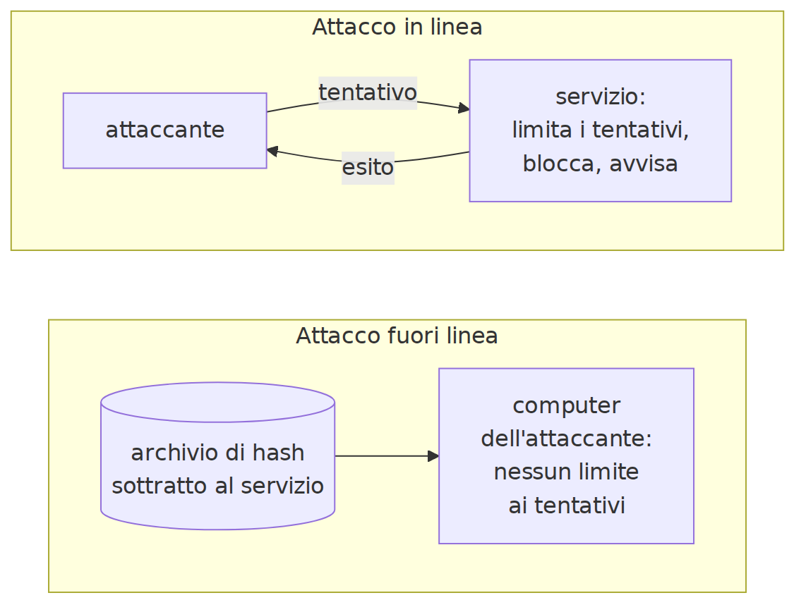
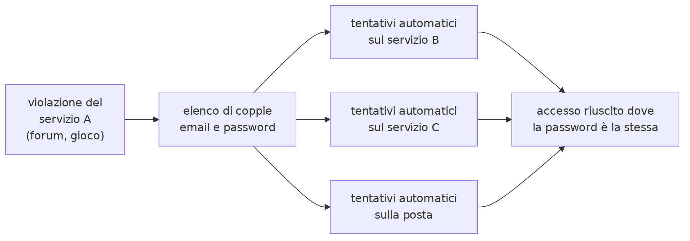
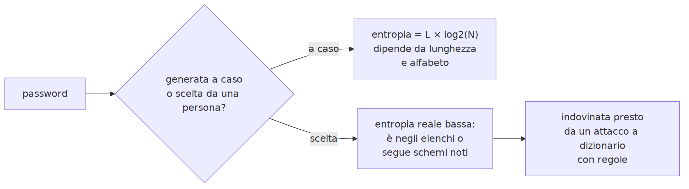
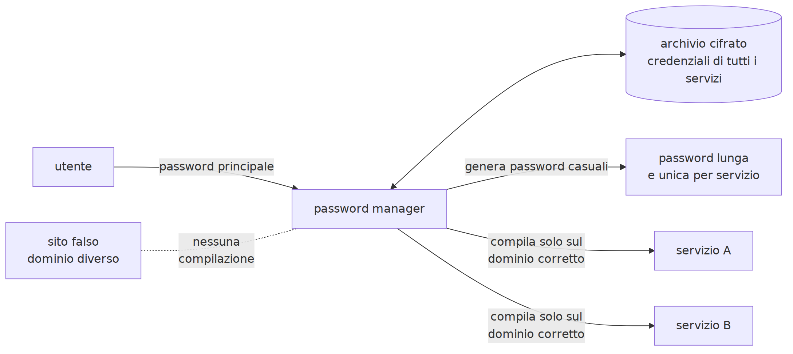
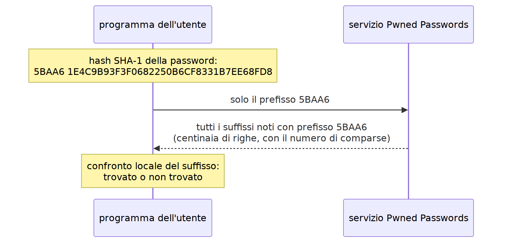
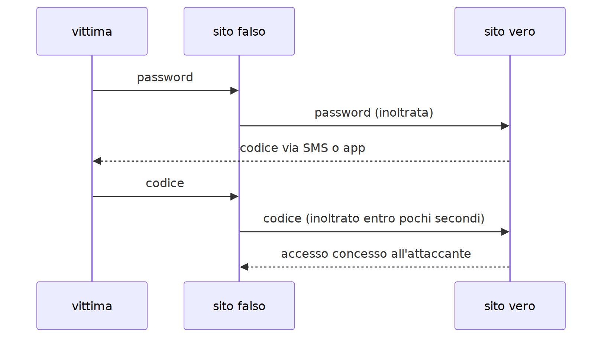
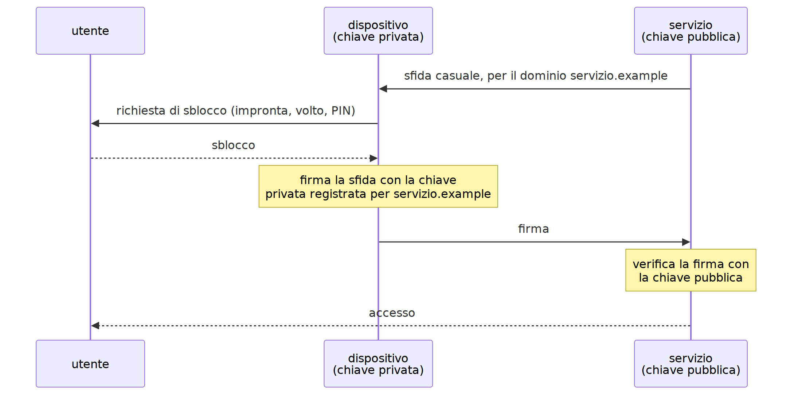
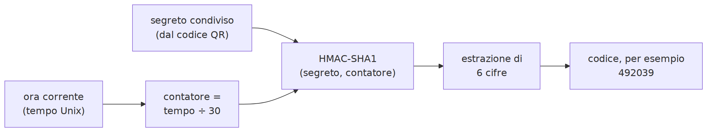

<!-- _class: titolo -->
<!-- _paginate: false -->

## Modulo 2 - Password e autenticazione

B.4 - Cybersicurezza e IA

Lezioni L5, L6, L7

---

## L5 - Come si attaccano le password

- autenticazione e fattori
- attacchi in linea e fuori linea
- famiglie di attacco
- violazioni di dati e riuso delle password
- entropia
- password prevedibili, informazioni pubbliche, IA
- il punto di vista del difensore

---

## Autenticazione e fattori

- **Identificazione**: dichiarare chi si è
- **Autenticazione**: dimostrarlo
- **Autorizzazione**: che cosa si può fare

Fattori:

- qualcosa che si **sa**: password, PIN
- qualcosa che si **ha**: smartphone, chiave di sicurezza
- qualcosa che si **è**: impronta, volto

MFA = fattori di **tipo diverso**. Due password non sono due fattori.

---

## In linea e fuori linea

---

## Conseguenze

- **in linea**: il servizio limita i tentativi; anche una password media resiste
- **fuori linea**: archivio di hash rubato, nessun limite; resistono solo password lunghe e imprevedibili
- l'utente non sa come il servizio protegge le password né se subirà una violazione

Conviene scegliere password che resistano al caso peggiore.

---

## Famiglie di attacco

- **Forza bruta**: tutte le combinazioni; solo contro password corte
- **Dizionario**: elenchi di parole e password comuni o trapelate
- **Dizionario con regole**: le abitudini umane (maiuscola iniziale, anno, simbolo finale, `a` → `4`)
- **Credential stuffing**: coppie email-password trapelate provate su altri servizi
- **Password spraying**: poche password comuni su molti account
- **Furto diretto**: phishing, infostealer, sguardo alle spalle

`Estate2026!` rispetta molte regole di composizione ed è debole.

---

## Credential stuffing

Una password riusata vale quanto il servizio **meno protetto** in cui è stata usata.

---

## Violazioni di dati

- **Data breach**: dati personali sottratti o esposti
- spesso contengono email e password o hash
- i dati vengono raccolti, scambiati, venduti
- Have I Been Pwned: oltre 17 miliardi di account compromessi, più di mille violazioni

Password **unica** per ogni servizio: il danno resta confinato.

---

## Entropia

Password **casuale**, L caratteri da un alfabeto di N simboli: **entropia = L × log2(N)** bit

| Alfabeto | N | L | Entropia |
|---|---|---|---|
| minuscole | 26 | 8 | 37,6 bit |
| minuscole, maiuscole, cifre | 62 | 8 | 47,6 bit |
| tutti gli stampabili | 94 | 8 | 52,4 bit |
| tutti gli stampabili | 94 | 12 | 78,7 bit |
| minuscole | 26 | 15 | 70,5 bit |

Ogni bit raddoppia i tentativi. La **lunghezza** conta più dell'alfabeto.

---

## La formula vale solo per password casuali

---

## Password prevedibili e IA

- schemi umani: parola significativa, nome, squadra, data; maiuscola iniziale; anno e simbolo finali
- **informazioni pubbliche**: nomi, animali, squadre, date dai social formano un dizionario personalizzato
- **modelli statistici e IA** addestrati su password trapelate: generano per prime le scelte più probabili

Contro password **lunghe e casuali** l'IA non ha vantaggi: non ci sono regolarità da sfruttare.

---

## Il punto di vista del difensore

Un servizio ben progettato:

- memorizza le password con sale e funzioni lente
- limita i tentativi falliti
- confronta le nuove password con una **lista di blocco** e spiega il rifiuto
- offre e incoraggia la MFA
- avvisa degli accessi da nuovi dispositivi

---

## Laboratorio L5

Notebook `L5_robustezza_password.ipynb` (JupyterLite o WinPython). Solo password di esempio.

1. (base) entropia per lunghezze e alfabeti diversi; grafico
2. (base) tempo stimato con tre velocità ipotetiche di attacco
3. (standard) `valuta_password`: lunghezza, lista di blocco, schemi prevedibili
4. (approfondimento) parole legate al contesto nella lista di blocco

---

<!-- _class: titolo -->

## L6 - Difendere le password

NIST, passphrase, password manager, violazioni

---

## NIST SP 800-63B-4 (agosto 2025)

| Requisito | Contenuto |
|---|---|
| lunghezza minima | 15 caratteri (8 se con MFA) |
| lunghezza massima | almeno 64 ammessi |
| regole di composizione | **vietate** |
| cambio periodico | **vietato**; obbligatorio solo se compromessa |
| lista di blocco | obbligatoria |
| suggerimenti, domande di sicurezza | vietati |
| password manager e "incolla" | da consentire |
| limitazione dei tentativi | obbligatoria |

https://pages.nist.gov/800-63-4/sp800-63b.html

---

## Perché le vecchie regole sono superate

- composizione obbligatoria → `Estate2026!`
- cambio ogni 90 giorni → `Autunno2026!`

Le regole cambiano quando le prove mostrano che producono l'effetto opposto.

---

## Passphrase

- più parole: lunga, robusta, memorizzabile
- parole scelte **a caso**, non da chi la crea: niente citazioni o versi di canzoni
- metodo diceware: elenco pubblico, estrazione casuale

Entropia = k × log2(W)

| Elenco | Parole | Entropia |
|---|---|---|
| 256 | 6 | 48 bit |
| 7.776 | 5 | circa 64,6 bit |
| 7.776 | 6 | circa 77,5 bit |

Generatore casuale sicuro: in Python il modulo `secrets`

---

## Password manager

Una sola password principale; password casuali e uniche; compilazione solo sul **dominio corretto**.

---

## Tipi di password manager

| Tipo | Esempi | Attenzione |
|---|---|---|
| browser o sistema | Firefox, Chrome, Apple, Android | legato all'account; dispositivo compromesso |
| locale | KeePassXC | backup a carico dell'utente |
| cloud | Bitwarden, 1Password, Proton Pass | dipendenza dal fornitore |

Password principale: passphrase lunga, mai usata altrove. MFA sull'account del password manager. Backup.

---

## KeePassXC

- open source (GPLv3), archivio cifrato `.kdbx`
- versione portable per Windows
- `Database`, `Nuovo database`; `Voci`, `Nuova voce`
- generatore di password e passphrase
- `Copia password`: gli appunti si cancellano dopo pochi secondi
- `Blocca database`

https://keepassxc.org/download/

---

## Have I Been Pwned

- ricerca per email: in quali violazioni compare
- **Pwned Passwords**: una password compare negli archivi trapelati?
- usato da servizi e password manager per la lista di blocco

https://haveibeenpwned.com/

---

## k-anonimato

Il servizio riceve solo 5 caratteri dell'hash: la password è una tra centinaia.

---

## Domande di sicurezza

- risposte spesso reperibili o indovinabili
- vietate dal NIST
- se imposte: risposta casuale generata dal password manager e salvata

---

## Laboratorio L6

KeePassXC portable; notebook `L6_passphrase_kanonimato.ipynb`

1. (base) archivio `laboratorio.kdbx`, tre voci fittizie, password e passphrase generate
2. (base) passphrase di 4, 6, 8 parole: entropia a confronto
3. (standard) simulazione del k-anonimato: che cosa sa il servizio?
4. (standard) Have I Been Pwned con password di esempio
5. (approfondimento) quante parole per superare 70 bit?

---

<!-- _class: titolo -->

## L7 - Autenticazione multifattore e passkey

---

## Metodi di secondo fattore

| Metodo | Punti deboli |
|---|---|
| SMS | SIM swap, malware, codice carpito da un sito falso |
| TOTP da app | codice carpito da un sito falso; perdita del telefono |
| notifica push | stanchezza da notifiche ripetute |
| chiave fisica | costo, smarrimento |
| passkey | sicurezza del dispositivo e dell'account di sincronizzazione |

Qualunque secondo fattore è molto meglio di nessuno.

---

## Resistenza al phishing

Un codice digitato a mano non è legato al sito:

---

## Passkey

---

## Proprietà delle passkey

- nessuna password da rubare, riusare, indovinare
- il servizio conserva solo chiavi pubbliche
- **resistente al phishing**: chiave legata al dominio
- impronta e volto restano nel dispositivo
- sincronizzate: la sicurezza dipende anche dall'account che le sincronizza

---

## Codici TOTP (RFC 6238)

- funziona senza rete; orologio corretto
- chi ha il segreto (il QR) genera gli stessi codici
- il segreto va conservato in modo recuperabile

---

## Biometria e voce clonata

- comoda come sblocco locale
- non è un segreto, non si può cambiare, è probabilistica
- NIST: solo con un dispositivo fisico; **la voce non va usata** per autenticare
- l'IA clona una voce da pochi secondi di registrazione (L9)

---

## Autenticazione basata sul rischio

Il servizio valuta ogni accesso, spesso con ML:

- dispositivo nuovo o noto
- posizione e rete
- orario e frequenza
- comportamento abituale

Accesso anomalo: fattore aggiuntivo, blocco, **avviso**. Gli avvisi vanno letti.

---

## Codici di recupero

- salvarli nel password manager o stamparli
- registrare più di un metodo (app + chiave, due passkey)
- backup cifrato dell'app TOTP

Senza codici di recupero, perdere il telefono può significare perdere l'account.

---

## Laboratorio L7

Notebook `L7_totp.ipynb`

1. (base) codice TOTP con il segreto di prova; dopo 30 secondi cambia
2. (base) verifica con i valori ufficiali di RFC 6238
3. (standard) stesso segreto in un'app di autenticazione: codici a confronto
4. (standard) orologio sfasato di 30, 60, 90 secondi
5. (approfondimento) che cosa ottiene chi fotografa il QR? Perché un sito falso riesce comunque?
