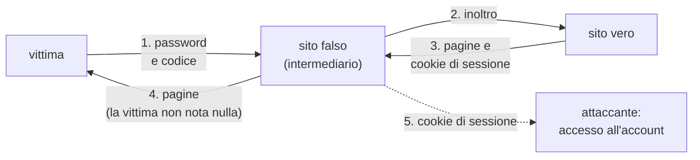
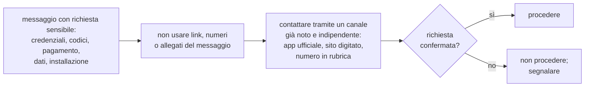
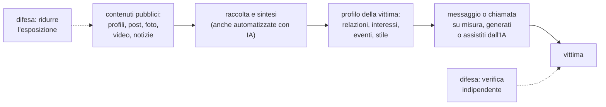
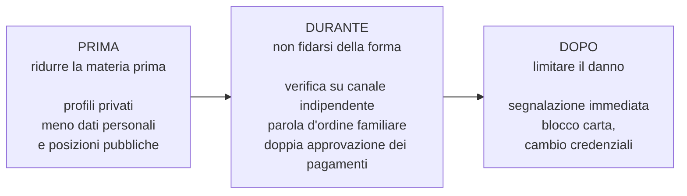

# Lezione L8 - Anatomia del phishing

## Obiettivi della lezione

- distinguere le forme di phishing in base al canale e al bersaglio
- descrivere le frodi basate sulla compromissione della posta aziendale
- spiegare come funzionano, a livello di meccanismo, i kit di phishing con inoltro in tempo reale
- applicare una procedura di analisi ai segnali tecnici e ai segnali di contesto
- applicare la regola della verifica attraverso un canale indipendente
- sapere come segnalare un messaggio di phishing
- usare un semplice programma per analizzare automaticamente un URL

## Che cos'è il phishing

- Phishing
  tecnica di ingegneria sociale (L4) in cui l'attaccante si presenta come un soggetto affidabile (banca, ente pubblico, corriere, scuola, collega) per indurre la vittima a rivelare credenziali o dati, pagare, aprire un file o installare un'app. Il nome richiama la pesca (fishing): si lancia un'esca e si attende che qualcuno abbocchi.

Il phishing è il vettore iniziale più frequente degli attacchi informatici: nelle sintesi settimanali del CERT-AGID le campagne di phishing sono ogni settimana decine.

## Forme di phishing

Per bersaglio:

- Phishing generico
  messaggi uguali inviati a migliaia o milioni di destinatari; basta che una piccola percentuale ci cada.
- Spear phishing
  messaggio preparato per una persona o un piccolo gruppo, usando informazioni raccolte su di loro (nome, ruolo, colleghi, interessi, eventi recenti). Più costoso da preparare, molto più efficace.
- Whaling
  spear phishing rivolto a dirigenti o persone con potere di spesa (dal termine inglese per la caccia alla balena).

Per canale:

- Email
  il canale storico; messaggi con link o allegati.
- Smishing
  phishing via SMS (SMS + phishing). Frequenti i falsi avvisi di consegna di pacchi, di multe, di blocco del conto.
- Vishing
  phishing con telefonate (voice + phishing): falsi operatori della banca, falsi tecnici, falsi agenti di polizia. L'attaccante può falsificare il numero chiamante (spoofing del numero).
- Quishing
  phishing tramite codice QR (QR + phishing): QR incollati sopra quelli legittimi nei parcheggi o nei ristoranti, QR in email o in lettere cartacee. Il QR nasconde l'URL alla vista e spesso viene aperto con lo smartphone, dove è più difficile controllare l'indirizzo.
- Social e messaggistica
  messaggi da profili falsi o compromessi, falsi concorsi, offerte di lavoro, richieste di "votare" per un amico, messaggi "Ciao mamma, ho cambiato numero".

## Compromissione della posta aziendale (BEC)

- BEC (Business Email Compromise)
  frode in cui l'attaccante usa una casella di posta aziendale compromessa, o un dominio simile, per chiedere pagamenti o dati fingendosi un dirigente, un collega o un fornitore.

Varianti tipiche:

- Frode del falso dirigente (CEO fraud)
  il "dirigente" chiede a un dipendente dell'amministrazione un bonifico urgente e riservato.
- Frode del falso fornitore
  il "fornitore" comunica un nuovo IBAN per i pagamenti delle fatture. Se la casella del fornitore è stata compromessa, il messaggio arriva dal suo indirizzo vero, nel mezzo di una conversazione reale.

Esempio didattico (organizzazioni fittizie): richiesta di cambio IBAN da un fornitore.

{width=85%}

Le frodi BEC spesso non contengono né link né allegati: sono solo testo, quindi superano facilmente i filtri automatici. La difesa è procedurale: ogni variazione di coordinate bancarie si verifica telefonando a un numero già noto, non a quello indicato nel messaggio.

## Kit di phishing con inoltro in tempo reale

In L7 si è visto che un codice digitato a mano (SMS o TOTP) può essere inoltrato da un sito falso al sito vero. Esistono kit di phishing, venduti come servizio nei mercati criminali, che automatizzano questo inoltro.

- Adversary in the middle (AiTM, avversario nel mezzo)
  il sito falso si comporta come un intermediario: mostra alla vittima le pagine del sito vero, inoltra al sito vero tutto ciò che la vittima inserisce (password, codice) e riceve dal sito vero il cookie di sessione, cioè il dato che il browser usa per restare autenticato. Con quel cookie l'attaccante accede all'account senza bisogno di password e codice.

Diagramma: phishing con intermediario



Conseguenze:

- l'aspetto del sito falso è identico al sito vero, perché mostra le sue stesse pagine
- l'unica differenza visibile è il dominio nella barra degli indirizzi
- difese efficaci: controllo del dominio, password manager (non compila su un dominio diverso), passkey e chiavi fisiche (non funzionano su un dominio diverso)

## I segnali: tecnici e di contesto

Segnali tecnici, già introdotti in L2:

- dominio del mittente diverso da quello ufficiale o simile a esso
- nome visualizzato che non corrisponde all'indirizzo
- `Reply-To` diverso dal mittente
- controlli SPF, DKIM, DMARC falliti
- link il cui testo mostra un indirizzo e la cui destinazione è un altro
- dominio del link che non appartiene all'organizzazione (sottodominio fuorviante, typosquatting, omografo, link accorciato)
- allegati inattesi: archivi compressi, file HTML, script, documenti che chiedono di attivare contenuti

Segnali di contesto, spesso più affidabili di quelli tecnici:

- richiesta inattesa, non collegata a un'azione compiuta dalla vittima
- urgenza, minaccia di conseguenze, scadenze brevi
- richiesta di dati che l'organizzazione non chiede mai per quel canale (password, codici ricevuti via SMS, codice di sicurezza della carta)
- cambio di canale: "non rispondere a questa email, contattami su WhatsApp"
- cambio di coordinate di pagamento
- richiesta di riservatezza ("non dirlo a nessuno, è una questione delicata")
- premio o rimborso inatteso

I segnali tecnici possono mancare: il messaggio può arrivare dalla casella vera di un collega compromesso, con controlli superati e senza errori. I segnali di contesto riguardano ciò che viene chiesto, e restano validi anche quando la forma è perfetta. L'IA generativa, tema di L9, rende la forma sempre più perfetta.

## La regola della verifica indipendente

Regola operativa per qualunque richiesta sensibile (credenziali, codici, pagamenti, dati personali, installazione di app):

1. non usare i link, i numeri di telefono o gli allegati del messaggio
2. contattare l'organizzazione o la persona attraverso un canale già noto e indipendente: l'app ufficiale, l'indirizzo del sito digitato a mano o salvato nei preferiti, il numero sul retro della carta, il numero del collega in rubrica
3. procedere solo se la richiesta viene confermata attraverso quel canale

Diagramma: verifica attraverso un canale indipendente



La regola funziona anche contro l'inganno perfetto, perché non dipende dalla capacità di riconoscere un messaggio falso.

## Segnalare il phishing

- nel programma di posta: comando `Segnala phishing` o `Segnala come spam`; aiuta il fornitore a bloccare la campagna per tutti
- a scuola o al lavoro: segnalare al referente informatico, anche se non si è cliccato; altri colleghi possono aver ricevuto lo stesso messaggio
- all'organizzazione imitata: molte banche ed enti hanno un indirizzo dedicato alle segnalazioni
- in caso di danno (dati della carta inseriti, denaro trasferito, account sottratto): banca subito, poi Polizia Postale (L4)

Chi ha cliccato su un link o inserito dati deve segnalarlo subito: il tempo di reazione riduce il danno. Il senso di colpa è comprensibile ma ritarda la reazione.

## Un programma che analizza gli URL

Un filtro antiphishing controlla automaticamente molti degli stessi segnali che una persona controlla a occhio. Il laboratorio usa un piccolo programma Python che scompone un URL e segnala le caratteristiche sospette.

Elementi di Python usati nel notebook:

- `urllib.parse.urlsplit(url)`: scompone un URL in schema, nome host, percorso, parametri, frammento; le parti si leggono come attributi (`.scheme`, `.hostname`, `.path`)
- `nome.split(".")`: divide una stringa in una lista, usando il punto come separatore
- `lista[-2:]`: gli ultimi due elementi della lista
- `".".join(lista)`: ricompone una stringa con il punto come separatore
- `"xn--" in nome`: vero se la stringa contiene `xn--`
- `nome.encode().decode("idna")`: converte un nome in Punycode nella forma leggibile

Estratto della funzione che individua il dominio registrato:

```python
from urllib.parse import urlsplit

def dominio_registrato(url):
    host = urlsplit(url).hostname          # nome host, senza schema, percorso, "@"
    parti = host.split(".")                # "www.bancaaurora.example" -> ["www", "bancaaurora", "example"]
    return ".".join(parti[-2:])            # ultimi due elementi: "bancaaurora.example"

print(dominio_registrato("https://bancaaurora.example.verifica-accessi.example/login"))
```

Output:

```text
verifica-accessi.example
```

La regola "ultimi due elementi" è una semplificazione: per alcuni domini di primo livello il nome registrato ha tre parti (per esempio `.co.uk`, `.gov.it`). I programmi professionali usano un elenco pubblico dei suffissi, la Public Suffix List. Il notebook usa un piccolo elenco di esempio.

## Laboratorio L8

Durata indicativa: 30 minuti. Materiali: `L8_corpus_messaggi.md` (otto messaggi con immagini), scheda `L8_scheda_analisi.md`, notebook `L8_analisi_url.ipynb`. Online, facoltativo: Jigsaw Phishing Quiz.

Esercizio 1 (base): a coppie, analizzare gli otto messaggi del corpus con la scheda. Per ciascuno indicare canale, pretesto, leve psicologiche, segnali tecnici, segnali di contesto, giudizio (legittimo o fraudolento) e azione corretta.

Esercizio 2 (base): nel notebook eseguire `analizza_url` sugli URL del corpus e confrontare i segnali trovati dal programma con quelli trovati a occhio.

Esercizio 3 (standard): nel notebook, aggiungere tre URL inventati a scelta (uno legittimo, due ingannevoli con tecniche diverse) e verificare se il programma li classifica correttamente. Individuare un caso che il programma non riconosce.

Esercizio 4 (standard): in CyberChef decodificare con `URL Decode` il link offuscato del messaggio 6 e con `From Punycode` il dominio del messaggio 7.

Esercizio 5 (approfondimento, online): svolgere il Jigsaw Phishing Quiz (in inglese), https://phishingquiz.withgoogle.com/, e annotare per ogni errore quale segnale non è stato notato.

# Lezione L9 - Phishing potenziato dall'IA

## Obiettivi della lezione

- descrivere come l'IA generativa cambia la produzione dei messaggi fraudolenti
- spiegare il ruolo delle informazioni pubbliche (OSINT) negli attacchi mirati
- descrivere le frodi con voce e video sintetici
- riconoscere chatbot, app ed estensioni di IA usati come esca
- applicare difese procedurali che funzionano anche contro un inganno perfetto
- ridurre la propria esposizione di informazioni pubbliche
- verificare con un programma quali segnali restano utili quando il testo è scritto dall'IA

## Che cosa cambia con l'IA generativa

- IA generativa
  sistemi di intelligenza artificiale che producono testi, immagini, audio o video a partire da istruzioni. I modelli linguistici di grandi dimensioni (LLM, large language models) producono testi.

Effetti sul phishing:

- Testi senza errori
  i messaggi fraudolenti tradotti male o pieni di errori, per anni un segnale utile, vengono sostituiti da testi corretti, nel tono giusto, in qualunque lingua. L'assenza di errori non è più un segnale di affidabilità.
- Personalizzazione su larga scala
  lo spear phishing richiedeva tempo per ogni vittima; con l'IA si possono produrre molti messaggi personalizzati in poco tempo, usando le informazioni pubbliche di ciascun destinatario.
- Conversazione
  un chatbot fraudolento può sostenere una conversazione prolungata, rispondere alle domande della vittima, adattarsi alle obiezioni.
- Imitazione dello stile
  dati alcuni messaggi di una persona, un modello può imitarne lo stile di scrittura.

I fornitori di modelli adottano regole e filtri contro gli usi fraudolenti, ma i criminali usano anche modelli senza restrizioni o aggirano i filtri. Il punto per chi si difende non cambia: la forma del messaggio non è più un indicatore affidabile.

## OSINT: le informazioni pubbliche come materia prima

- OSINT (Open Source Intelligence)
  raccolta e analisi di informazioni da fonti pubblicamente accessibili: social, siti web, notizie, registri pubblici, foto. È usata legittimamente da giornalisti, ricercatori e analisti di sicurezza, e dagli attaccanti nella fase di ricognizione (L1).

Informazioni che rendono credibile un messaggio mirato:

- nome, scuola o luogo di lavoro, ruolo
- nomi di familiari, amici, insegnanti, colleghi
- interessi, squadra, sport, gruppi frequentati
- eventi recenti (viaggio, gara, acquisto, festa)
- abitudini e orari (dalle storie e dai post con posizione)
- stile di scrittura, soprannomi, modi di dire
- voce e volto, da video pubblicati

L'IA accelera sia la raccolta sia l'uso: riassume grandi quantità di contenuti pubblici e trasforma le informazioni in un messaggio plausibile.

Diagramma: dalla ricognizione al messaggio mirato



## Voce e video sintetici nelle frodi

- Clonazione della voce
  produzione di audio sintetico con la voce di una persona reale, a partire da registrazioni della sua voce. Bastano pochi secondi di audio, per esempio da un video pubblicato.
- Deepfake video
  video sintetico o alterato in cui il volto e la voce di una persona reale compaiono in scene mai avvenute. Il riconoscimento tecnico dei deepfake è materia del corso B.7.

Schemi di frode:

- telefonata con la voce clonata di un familiare in difficoltà ("ho avuto un incidente, mi servono soldi subito, non dire niente a papà")
- messaggio vocale del "dirigente" che conferma un bonifico urgente
- videoconferenza con partecipanti falsi

Caso reale: nel febbraio 2024 un dipendente della sede di Hong Kong della società di ingegneria Arup ha trasferito circa 200 milioni di dollari di Hong Kong (circa 25 milioni di dollari statunitensi) dopo una videoconferenza in cui il direttore finanziario e altri colleghi erano stati ricreati con deepfake.
Fonte: AI Incident Database, Incident 634, https://incidentdatabase.ai/cite/634/

Norme collegate:

- l'AI Act (L16) impone, dal 2 agosto 2026, di dichiarare i contenuti audio e video generati o manipolati con IA (deepfake), con alcune eccezioni
- la legge italiana sull'IA (legge 132/2025) ha introdotto il reato di illecita diffusione di contenuti generati o alterati con IA che causa un danno ingiusto (art. 612-quater del codice penale)

Chi commette una frode non rispetta gli obblighi di trasparenza: le norme servono a perseguire, non a riconoscere in tempo reale. La difesa resta procedurale.

## Esche a tema IA

L'interesse per l'IA è a sua volta un pretesto:

- app e siti che imitano servizi di IA noti e installano malware o sottraggono credenziali
- estensioni del browser "con IA" che chiedono di leggere tutte le pagine visitate
- servizi di "IA gratuita senza limiti" che chiedono di accedere con l'account della scuola o di inserire i dati della carta
- offerte di lavoro, corsi o guadagni "con l'IA"

Le difese sono quelle di L4: app solo dagli store ufficiali, attenzione ai permessi, nessun accesso con account importanti a servizi sconosciuti.

## Difese contro l'inganno perfetto

Se il messaggio, la voce o il video possono essere perfetti, la difesa non può basarsi sul riconoscerli. Deve basarsi sulle procedure.

- Verifica attraverso un canale indipendente
  la regola di L8: si richiama la persona su un numero già noto, si accede al servizio dall'app ufficiale.
- Parola d'ordine familiare
  una parola o domanda concordata in famiglia, mai scritta nei messaggi né pubblicata, da chiedere in caso di richieste urgenti di denaro o aiuto. Una voce clonata non la conosce.
- Doppia approvazione
  nelle organizzazioni, i pagamenti sopra una soglia e le variazioni di IBAN richiedono l'approvazione di due persone, con verifica telefonica.
- Tempo
  l'urgenza è lo strumento dell'attaccante; una regola personale ("per le richieste di denaro richiamo sempre, anche se sembra urgente") toglie efficacia alla pressione.
- Riduzione dell'esposizione
  profili privati, meno dettagli personali pubblici, attenzione a posizione e orari nelle storie, attenzione ai video con la propria voce resi pubblici.

Diagramma: difese per livello



## Quali segnali restano utili: un esperimento con il codice

Il notebook del laboratorio contiene un semplice controllo automatico dei messaggi basato su regole. Le regole sono di due tipi:

- regole sulla forma: errori di ortografia frequenti, parole straniere tradotte male, eccesso di maiuscole e punti esclamativi
- regole sul contenuto della richiesta: urgenza, richiesta di codici o password, richiesta di dati della carta, cambio di IBAN, cambio di canale, richiesta di segretezza

Il controllo viene applicato a due gruppi di messaggi fraudolenti inventati per il corso: messaggi "vecchio stile", scritti male, e messaggi con testo curato, come quelli che produce un modello linguistico. Il risultato atteso: le regole sulla forma riconoscono solo i primi, le regole sul contenuto riconoscono entrambi.

Estratto delle regole sul contenuto:

```python
REGOLE_CONTENUTO = {
    "urgenza": ["entro 24 ore", "immediatamente", "subito", "ultimo avviso", "scade oggi"],
    "codici o password": ["codice ricevuto", "codice via sms", "password", "pin"],
    "dati della carta": ["numero della carta", "cvv", "codice di sicurezza della carta"],
    "cambio di iban": ["nuovo iban", "nuove coordinate", "iban aggiornato"],
    "cambio di canale": ["whatsapp", "questo numero", "non rispondere a questa email"],
    "segretezza": ["riservat", "non dirlo", "non parlarne"],
}
```

- `REGOLE_CONTENUTO` è un dizionario: a ogni nome di segnale corrisponde una lista di espressioni da cercare nel testo
- la funzione del notebook converte il messaggio in minuscolo e controlla, per ogni segnale, se almeno un'espressione compare nel testo

Un controllo a parole chiave è molto più semplice dei filtri reali basati sull'apprendimento automatico (L11), ma mostra lo stesso principio: conta che cosa viene chiesto, non come è scritto.

## Laboratorio L9

Durata indicativa: 30 minuti. Materiali: `L9_scheda_osint_fittizia.md`, notebook `L9_segnali_messaggio.ipynb`.

Esercizio 1 (base, a gruppi): la scheda contiene il profilo pubblico di una persona fittizia, Giulia, studentessa di quarta: post, storie, commenti, foto descritte. Individuare tutte le informazioni che un attaccante potrebbe usare per un messaggio o una telefonata mirata e, per ciascuna, il tipo di inganno che renderebbe possibile.

Esercizio 2 (base): per le stesse informazioni proporre la modifica del profilo che ne riduce l'esposizione (rimuovere, rendere privato, generalizzare) senza rinunciare all'uso dei social.

Esercizio 3 (standard): nel notebook eseguire il controllo sui due gruppi di messaggi. Confrontare quante volte scattano le regole sulla forma e quante le regole sul contenuto. Rispondere: perché la correttezza del testo non è più un indizio di affidabilità?

Esercizio 4 (standard): aggiungere al notebook due messaggi legittimi inventati (per esempio una comunicazione della scuola e un avviso di consegna atteso) e verificare se il controllo produce falsi allarmi. Proporre una modifica delle regole che li riduca.

Esercizio 5 (approfondimento): scrivere, per la propria famiglia o per un gruppo di amici, un protocollo in cinque punti per le richieste urgenti di denaro o di aiuto ricevute via messaggio, voce o video, comprendente l'uso di una parola d'ordine.
