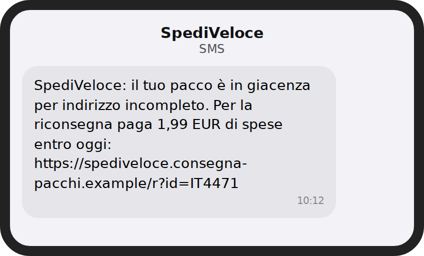
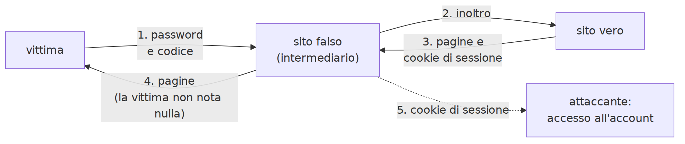
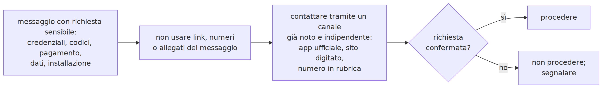
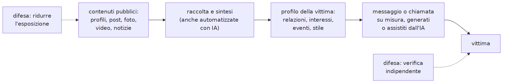
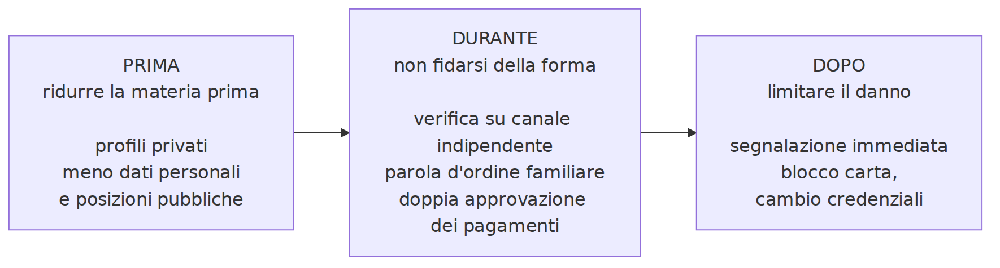

# L8 - Anatomia del phishing

## Contenuti della lezione

- forme di phishing
- compromissione della posta aziendale (BEC)
- kit con inoltro in tempo reale
- segnali tecnici e di contesto
- verifica attraverso un canale indipendente
- segnalazione
- un programma che analizza gli URL

## Phishing

Ingegneria sociale: l'attaccante si presenta come un soggetto affidabile per ottenere credenziali, dati, pagamenti, l'apertura di un file o l'installazione di un'app.

È il vettore iniziale più frequente: decine di campagne ogni settimana nelle sintesi del CERT-AGID.

## Forme di phishing

Per bersaglio:

- **generico**: stesso messaggio a moltissimi destinatari
- **spear phishing**: messaggio su misura, con informazioni sulla vittima
- **whaling**: rivolto a dirigenti

Per canale:

- **email**, **smishing** (SMS), **vishing** (telefono, anche con numero falsificato)
- **quishing** (codice QR), **social e messaggistica** ("Ciao mamma, ho cambiato numero")

## Esempi: SMS e QR

{height=45%} {height=45%}

## BEC: compromissione della posta aziendale

- **falso dirigente**: bonifico urgente e riservato
- **falso fornitore**: nuovo IBAN, spesso da una casella vera compromessa

Niente link né allegati: superano i filtri. Difesa procedurale: ogni variazione di IBAN si verifica con una telefonata a un numero già noto.

## Esempio: falso fornitore

{width=86%}

## Kit con inoltro in tempo reale (AiTM)

{width=90%}

- aspetto identico al sito vero: ne mostra le pagine
- unica differenza visibile: il **dominio**
- difese: controllo del dominio, password manager, passkey

## Segnali tecnici

- dominio del mittente diverso o simile
- nome visualizzato diverso dall'indirizzo
- `Reply-To` diverso
- SPF, DKIM, DMARC falliti
- testo del link diverso dalla destinazione
- dominio del link non dell'organizzazione
- allegati inattesi: archivi, HTML, script, documenti con contenuti attivi

## Segnali di contesto

- richiesta inattesa
- urgenza, minacce, scadenze brevi
- dati mai richiesti per quel canale: password, codici SMS, CVV
- **cambio di canale**: "scrivimi su WhatsApp"
- **cambio di IBAN**
- richiesta di **segretezza**
- premio o rimborso inatteso

Riguardano **che cosa** viene chiesto: valgono anche quando la forma è perfetta.

## La regola della verifica indipendente

{width=100%}

## Segnalare

- programma di posta: `Segnala phishing`
- scuola o lavoro: referente informatico, anche senza aver cliccato
- organizzazione imitata: indirizzo per le segnalazioni
- danno avvenuto: banca subito, poi Polizia Postale

Chi ha cliccato o inserito dati lo dice **subito**: il tempo riduce il danno.

## Un programma che analizza gli URL

```python
from urllib.parse import urlsplit

def dominio_registrato(url):
    host = urlsplit(url).hostname
    parti = host.split(".")
    return ".".join(parti[-2:])

print(dominio_registrato(
    "https://bancaaurora.example.verifica-accessi.example/login"))
```

```text
verifica-accessi.example
```

Semplificazione: per `.gov.it`, `.co.uk` servono tre parti (Public Suffix List).

## Laboratorio L8

Materiali: `L8_corpus_messaggi.md`, `L8_scheda_analisi.md`, notebook `L8_analisi_url.ipynb`

1. (base) otto messaggi: canale, pretesto, leve, segnali, giudizio, azione
2. (base) `analizza_url` sugli URL del corpus
3. (standard) tre URL inventati; trovare un caso che il programma non riconosce
4. (standard) CyberChef: `URL Decode` (messaggio 6), `From Punycode` (messaggio 7), `Parse QR Code` (messaggio 8)
5. (approfondimento) Jigsaw Phishing Quiz

# L9 - Phishing potenziato dall'IA

## Che cosa cambia con l'IA generativa

- **testi senza errori**, nel tono giusto, in ogni lingua
- **personalizzazione su larga scala**
- **conversazione**: chatbot fraudolenti che rispondono e insistono
- **imitazione dello stile** di una persona

L'assenza di errori non è più un segnale di affidabilità.

## OSINT

Raccolta di informazioni da fonti pubbliche: giornalisti, analisti, e attaccanti nella ricognizione.

{width=99%}

## Informazioni che rendono credibile un inganno

- nome, scuola, ruolo
- familiari, amici, insegnanti, allenatori
- interessi, squadra, gruppi
- eventi recenti: viaggi, gare, acquisti
- abitudini e orari (storie con posizione)
- stile di scrittura, soprannomi
- **voce e volto** da video pubblicati

## Voce e video sintetici

- **clonazione della voce**: bastano pochi secondi di audio
- **deepfake video** (riconoscimento tecnico: corso B.7)

Schemi: familiare in difficoltà, vocale del "dirigente", videoconferenza falsa.

Caso Arup, Hong Kong, febbraio 2024: circa 25 milioni di dollari trasferiti dopo una videoconferenza con dirigenti ricreati con deepfake.

AI Incident Database, Incident 634: https://incidentdatabase.ai/cite/634/

## Norme collegate

- **AI Act**: dal 2 agosto 2026 i deepfake vanno dichiarati (con eccezioni)
- **Legge 132/2025**: reato di illecita diffusione di contenuti generati o alterati con IA (art. 612-quater c.p.)

Chi truffa non rispetta gli obblighi: le norme servono a perseguire, non a riconoscere in tempo reale.

## Esche a tema IA

- app e siti che imitano servizi di IA noti
- estensioni "con IA" che leggono tutte le pagine
- "IA gratuita senza limiti" in cambio dell'account della scuola o della carta
- offerte di lavoro e guadagni "con l'IA"

Difese di L4: store ufficiali, permessi, niente account importanti su servizi sconosciuti.

## Difese contro l'inganno perfetto

{width=99%}

## Le difese procedurali

- **verifica indipendente**: richiamare su un numero noto
- **parola d'ordine familiare**: una voce clonata non la conosce
- **doppia approvazione** dei pagamenti
- **tempo**: l'urgenza è lo strumento dell'attaccante
- **meno esposizione**: profili privati, meno dettagli, attenzione a posizione e voce

## Un esperimento: quali segnali restano utili?

```python
REGOLE_CONTENUTO = {
    "urgenza": ["entro 24 ore", "immediatamente", "subito"],
    "codici o password": ["codice ricevuto", "codice via sms", "password"],
    "cambio di iban": ["nuovo iban", "nuove coordinate"],
    "cambio di canale": ["whatsapp", "questo numero"],
    "segretezza": ["riservat", "non dirlo", "non parlarne"],
}
```

| Regole | Messaggi con errori | Messaggi curati (stile IA) |
|---|---|---|
| sulla forma | riconosciuti | **non riconosciuti** |
| sul contenuto | riconosciuti | riconosciuti |

## Laboratorio L9

Materiali: `L9_scheda_osint_fittizia.md`, notebook `L9_segnali_messaggio.ipynb`

1. (base) profilo di Giulia (fittizia): quali informazioni sfrutterebbe un attaccante?
2. (base) come ridurre l'esposizione senza rinunciare ai social
3. (standard) regole sulla forma e sul contenuto sui due gruppi di messaggi
4. (standard) falsi allarmi su messaggi legittimi; modificare le regole
5. (approfondimento) protocollo familiare per le richieste urgenti, con parola d'ordine
