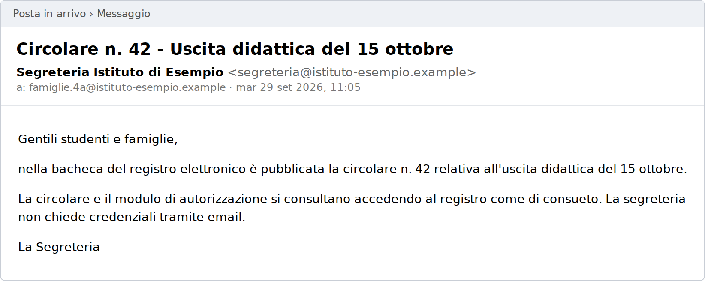
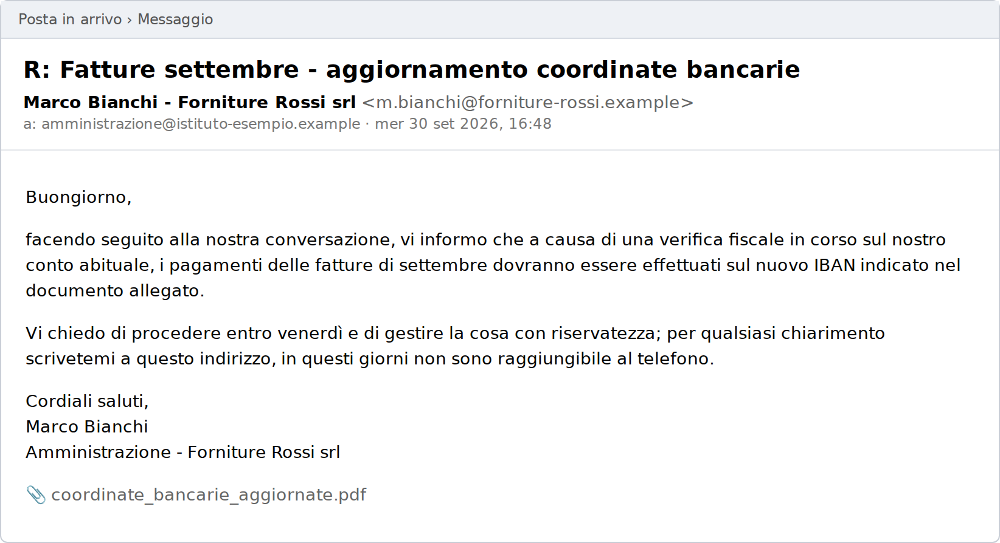
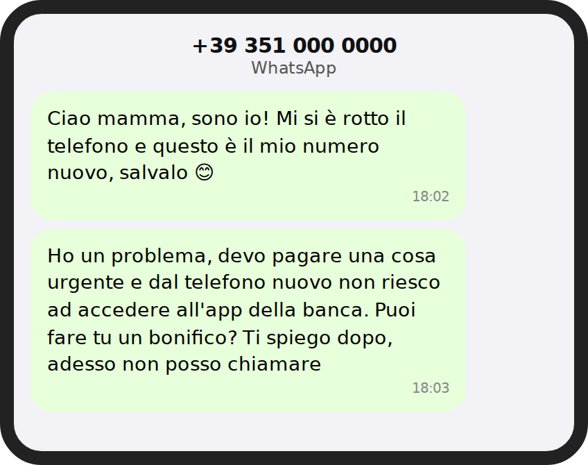
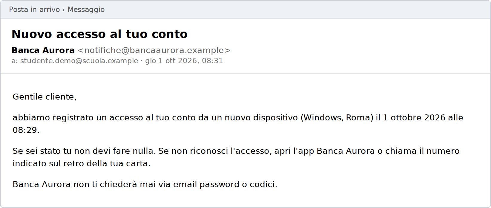
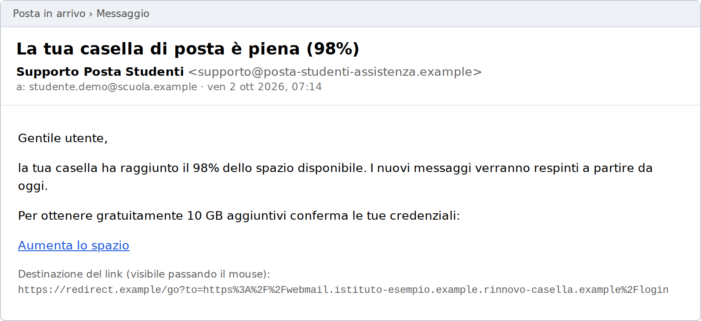
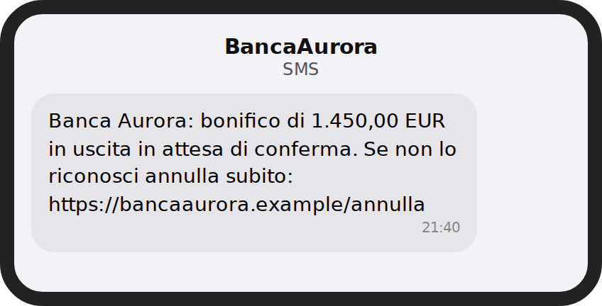

# Laboratorio L8 - Corpus di messaggi

Tutti i messaggi sono esempi didattici creati per il corso. Le organizzazioni (SpediVeloce, Istituto di Esempio, Forniture Rossi srl, Banca Aurora) sono fittizie e i domini `.example` non esistono.

Contesto: lo studente destinatario è cliente di Banca Aurora (dominio `bancaaurora.example`), frequenta l'Istituto di Esempio (dominio `istituto-esempio.example`) e non attende pacchi. L'Istituto acquista materiali da Forniture Rossi srl (dominio `forniture-rossi.example`).

## Messaggio 1 - SMS

{width=45%}

URL: `https://spediveloce.consegna-pacchi.example/r?id=IT4471`

## Messaggio 2 - Email

{width=90%}

## Messaggio 3 - Email all'amministrazione della scuola

{width=90%}

Intestazioni: `Authentication-Results: spf=pass dkim=pass dmarc=pass header.from=forniture-rossi.example`. Il messaggio risponde a una conversazione reale sulle fatture di settembre.

## Messaggio 4 - WhatsApp

{width=45%}

## Messaggio 5 - Email

{width=90%}

Intestazioni: `Authentication-Results: spf=pass dkim=pass dmarc=pass header.from=bancaaurora.example`.

## Messaggio 6 - Email

{width=90%}

URL: `https://redirect.example/go?to=https%3A%2F%2Fwebmail.istituto-esempio.example.rinnovo-casella.example%2Flogin`

## Messaggio 7 - SMS

{width=45%}

URL come appare: `https://bаncaaurora.example/annulla`

URL in forma Punycode: `https://xn--bncaaurora-zqi.example/annulla`

## Messaggio 8 - Adesivo su un cartello di parcheggio

{width=55%}

Il codice QR è anche nel file `L8_qr_messaggio8.png`: si decodifica in CyberChef con l'operazione `Parse QR Code`, senza aprire il link.
