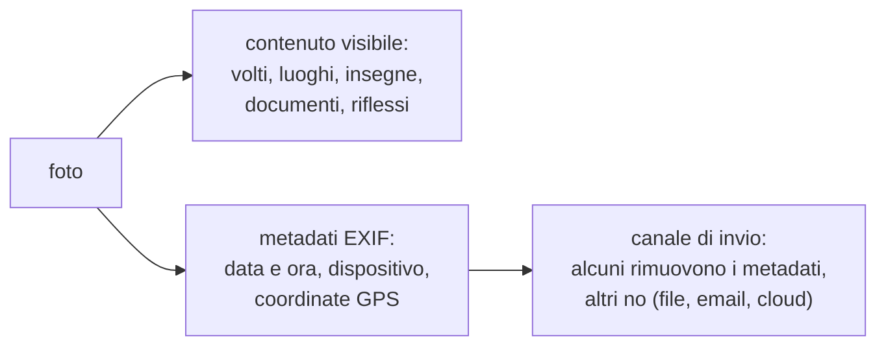
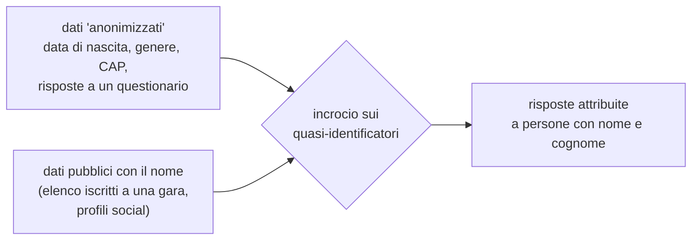
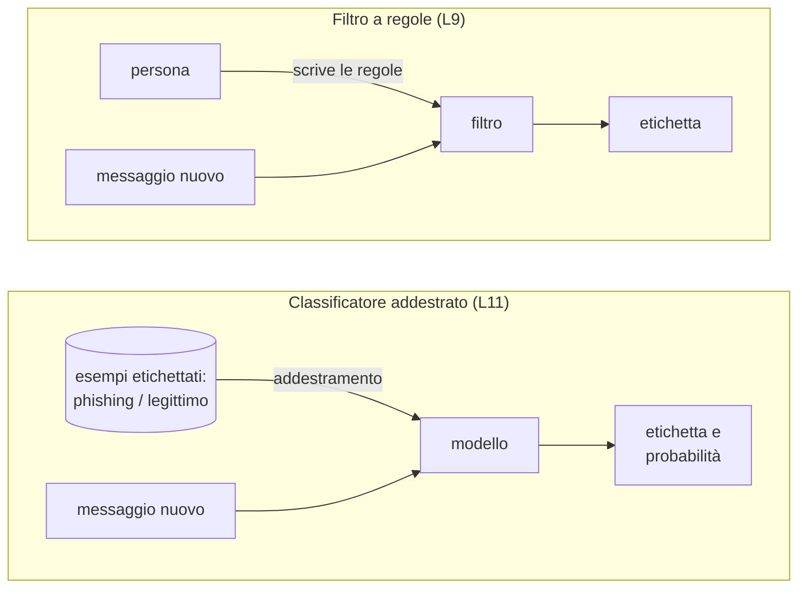
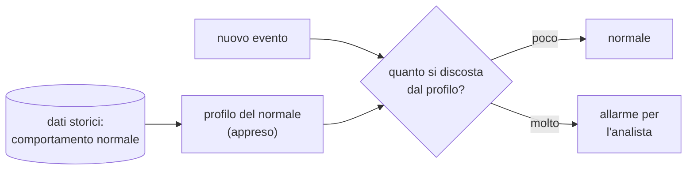

# Lezione L10 - Dati personali e riservatezza: i rischi non ovvi

## Obiettivi della lezione

- distinguere dato personale, dato particolare, dato anonimo e pseudonimo, metadato
- leggere e rimuovere i metadati di una foto
- spiegare perché dati "anonimizzati" possono essere reidentificati e che cosa misura il k-anonimato
- descrivere come i modelli di IA inferiscono informazioni non dichiarate
- conoscere le forme di tracciamento online
- valutare i rischi per la riservatezza nell'uso di chatbot e assistenti di IA
- conoscere i principi e i diritti essenziali del GDPR

## Dati personali: definizioni

- Dato personale
  qualunque informazione riguardante una persona fisica identificata o identificabile, direttamente (nome, foto del volto) o indirettamente, combinando più informazioni (numero di telefono, indirizzo IP, posizione, codice cliente). Definizione del Regolamento generale sulla protezione dei dati (GDPR), art. 4.
- Dati particolari (sensibili)
  categorie per cui il GDPR prevede una protezione rafforzata (art. 9): origine etnica, opinioni politiche, convinzioni religiose, appartenenza sindacale, dati genetici e biometrici usati per identificare, salute, vita e orientamento sessuale.
- Dato anonimo
  dato che non può più essere ricondotto a una persona con mezzi ragionevoli. I dati davvero anonimi sono fuori dall'ambito del GDPR.
- Dato pseudonimo
  dato in cui gli identificativi diretti sono sostituiti da un codice, ma che può essere ricondotto alla persona con informazioni aggiuntive (la tabella di corrispondenza). Resta un dato personale.
- Metadato
  dato che descrive un altro dato: data e luogo di scatto di una foto, autore di un documento, orario e destinatari di un messaggio.

Riferimento: Regolamento (UE) 2016/679 (GDPR), testo italiano, https://eur-lex.europa.eu/eli/reg/2016/679/oj?locale=it

## Metadati delle foto: EXIF

- EXIF (Exchangeable Image File Format)
  standard che memorizza, dentro il file di una foto, informazioni sullo scatto: data e ora, marca e modello del dispositivo, impostazioni della fotocamera e, se la localizzazione è attiva, le coordinate GPS del luogo.

Una foto scattata a casa e inviata come file può rivelare l'indirizzo. Molti social e app di messaggistica rimuovono i metadati quando la foto viene pubblicata, ma non tutti i canali lo fanno: invio "come documento" o "come file", email, cartelle condivise nel cloud, alcuni siti.

Le foto contengono anche informazioni visibili, non tecniche:

- riflessi in finestre, occhiali, schermi
- documenti, badge, lettere, targhe, schermi del computer inquadrati
- vista dalla finestra, insegne, numeri civici
- divise, loghi di scuole e società sportive

Diagramma: informazioni contenute in una foto



Difese:

- disattivare la localizzazione nella fotocamera se non serve
- rimuovere i metadati prima di condividere un file (molti sistemi operativi lo permettono dalle proprietà del file o dalla condivisione)
- guardare la foto prima di pubblicarla chiedendosi che cosa rivela sullo sfondo

Coordinate GPS in EXIF: sono memorizzate in gradi, minuti e secondi, con l'indicazione dell'emisfero (N/S, E/W). Per usarle in una mappa si convertono in gradi decimali:

gradi decimali = gradi + minuti / 60 + secondi / 3600 (con segno negativo per Sud e Ovest)

## Reidentificazione

Togliere nome e cognome da un insieme di dati non lo rende anonimo. Pochi attributi apparentemente innocui, detti quasi-identificatori, possono individuare una persona se incrociati con un'altra fonte che contiene gli stessi attributi e il nome.

- Quasi-identificatore
  attributo che da solo non identifica, ma che combinato con altri sì: data di nascita, genere, CAP, scuola, classe, professione.

Studio classico: nel 2000 Latanya Sweeney (Carnegie Mellon University) stimò che l'87% della popolazione degli Stati Uniti era identificata in modo univoco dalla sola combinazione di codice postale a 5 cifre, genere e data di nascita.
Fonte: L. Sweeney, Simple Demographics Often Identify People Uniquely, 2000, https://dataprivacylab.org/projects/identifiability/paper1.pdf

Diagramma: reidentificazione per incrocio



### k-anonimato

- k-anonimato
  proprietà di un insieme di dati: ogni combinazione di quasi-identificatori è condivisa da almeno k persone. Con k = 1 almeno una persona è unica, quindi potenzialmente reidentificabile.

Tecniche per aumentare k:

- generalizzazione: sostituire un valore preciso con uno meno preciso (data di nascita → anno; CAP completo → prime tre cifre)
- soppressione: eliminare i record troppo rari o gli attributi non necessari

Il k-anonimato riduce il rischio ma non lo elimina: se tutti i k record di un gruppo hanno la stessa risposta a una domanda sensibile, la risposta di ciascuno è comunque rivelata. È il motivo per cui la minimizzazione dei dati (raccogliere solo ciò che serve) è la prima difesa.

Lo stesso concetto di k-anonimato è stato usato in L6 per verificare le password senza rivelarle.

## Inferenza: che cosa l'IA deduce

- Inferenza
  deduzione di informazioni non dichiarate a partire da quelle disponibili.

I modelli di IA sono progettati per trovare regolarità, e questo include regolarità che rivelano dati personali mai comunicati:

- dai testi: età approssimativa, provenienza geografica (lessico, modi di dire), livello di istruzione, stato d'animo, orientamenti
- dalle foto: luogo (paesaggio, vegetazione, architettura, insegne), anche senza metadati
- dai comportamenti: interessi, abitudini, orari, relazioni (dai "mi piace", dai contatti, dai percorsi)
- dallo stile di scrittura (stilometria): chi ha scritto un testo anonimo, confrontandolo con testi firmati

La persona non ha comunicato quell'informazione, ma il sistema la ricava. Per questo il GDPR considera dati personali anche le informazioni dedotte, e l'AI Act vieta alcune forme di inferenza, per esempio il riconoscimento delle emozioni a scuola e sul lavoro (L16).

## Tracciamento online

- Cookie
  piccolo file che un sito salva nel browser per ricordare informazioni (sessione, preferenze). I cookie di terze parti, salvati da servizi presenti su molti siti (pubblicità, statistiche), permettono di seguire una persona da un sito all'altro.
- Impronta del browser (fingerprinting)
  identificazione di un dispositivo dalla combinazione delle sue caratteristiche (sistema operativo, schermo, caratteri installati, lingua, fuso orario). Funziona anche cancellando i cookie.
- Intermediari di dati (data broker)
  aziende che raccolgono, combinano e vendono profili di persone costruiti da molte fonti.
- Permessi delle app
  posizione, contatti, microfono, fotocamera concessi alle app, spesso più di quanto serva.

Difese: rifiutare i cookie non necessari nei banner di consenso, browser con protezione dal tracciamento, revisione periodica dei permessi delle app, account separati per usi diversi.

## Chatbot e assistenti di IA: che fine fanno i dati

Quando si scrive a un chatbot o si carica un documento in un assistente di IA:

- il testo viene inviato ai server del fornitore ed elaborato lì
- le conversazioni possono essere conservate per un certo periodo, secondo le condizioni del servizio
- possono essere lette da persone incaricate dal fornitore, per esempio per controlli di sicurezza o di qualità
- secondo le impostazioni e il tipo di account, possono essere usate per addestrare i modelli futuri
- le funzioni di "condivisione tramite link" rendono la conversazione accessibile a chiunque abbia il link; in passato conversazioni condivise sono finite nei risultati dei motori di ricerca
- gli assistenti con memoria conservano informazioni tra una conversazione e l'altra

Rischi non ovvi:

- Dati di terzi
  inserire in un chatbot il messaggio di un compagno, la verifica corretta di un'altra persona, i dati di un familiare significa trattare dati personali di altri senza il loro consenso.
- Documenti della scuola o di un'organizzazione
  caricarli in un servizio esterno può violare le regole dell'organizzazione e il GDPR.
- Memorizzazione nei modelli
  è stato dimostrato che i modelli linguistici possono memorizzare e restituire parti dei dati di addestramento, compresi dati personali presenti in quei dati.
- Inferenza
  dalle domande poste nel tempo un servizio può ricavare molte informazioni su chi le pone.

Buone pratiche:

- non inserire dati personali propri o altrui non necessari (nomi, indirizzi, numeri, foto di documenti, dati sanitari)
- sostituire i nomi con segnaposto ("studente A", "via X")
- verificare le impostazioni di conservazione e di uso per l'addestramento
- usare gli account forniti dalla scuola quando previsti: hanno condizioni contrattuali diverse da quelle degli account personali
- non condividere conversazioni tramite link se contengono informazioni personali

## GDPR: principi e diritti essenziali

Il GDPR si applica in tutta l'Unione europea dal 25 maggio 2018; in Italia l'autorità di controllo è il Garante per la protezione dei dati personali, https://www.garanteprivacy.it/

Principi (art. 5):

- liceità, correttezza, trasparenza: il trattamento deve avere una base giuridica ed essere comprensibile per l'interessato
- limitazione della finalità: i dati raccolti per uno scopo non si usano per altri scopi incompatibili
- minimizzazione: solo i dati necessari
- esattezza
- limitazione della conservazione: non oltre il tempo necessario
- integrità e riservatezza: sicurezza adeguata
- responsabilizzazione (accountability): il titolare deve poter dimostrare di rispettare i principi

Ruoli:

- interessato: la persona a cui si riferiscono i dati
- titolare del trattamento: chi decide finalità e mezzi (per esempio la scuola)
- responsabile del trattamento: chi tratta i dati per conto del titolare (per esempio il fornitore del registro elettronico)

Diritti dell'interessato:

- accesso: sapere quali dati vengono trattati e ottenerne copia
- rettifica dei dati inesatti
- cancellazione ("diritto all'oblio"), nei casi previsti
- limitazione del trattamento
- portabilità: ricevere i propri dati in un formato leggibile da un computer
- opposizione
- non essere sottoposti a decisioni basate unicamente su un trattamento automatizzato che producono effetti significativi (art. 22)

Violazione dei dati personali (data breach): il titolare deve notificarla al Garante entro 72 ore da quando ne è venuto a conoscenza, salvo che sia improbabile un rischio per le persone, e comunicarla agli interessati se il rischio è elevato.

Minori: in Italia il consenso ai servizi online può essere dato autonomamente dai 14 anni; sotto i 14 anni serve il consenso dei genitori. La legge italiana sull'IA (legge 132/2025) applica la stessa soglia all'accesso ai sistemi di IA (L16).

## Laboratorio L10

Durata indicativa: 30 minuti. Materiali: `L10_foto_esempio.jpg`, notebook `L10_metadati_reidentificazione.ipynb`, dataset `L10_questionario_anonimizzato.csv` e `L10_iscritti_torneo.csv` (dati fittizi).

Esercizio 1 (base): aprire `L10_foto_esempio.jpg` in CyberChef (trascinandola nell'area Input) e applicare `Extract EXIF`. Annotare data, dispositivo e coordinate GPS.

Esercizio 2 (base): nel notebook, leggere gli stessi metadati con Python, convertire le coordinate in gradi decimali e salvare una copia della foto senza metadati; verificare con CyberChef che la copia non li contiene.

Esercizio 3 (standard): nel notebook, incrociare il questionario "anonimizzato" (senza nomi) con l'elenco pubblico degli iscritti a un torneo usando data di nascita, genere e CAP. Contare quante risposte vengono attribuite a una persona con nome e cognome.

Esercizio 4 (standard): nel notebook, calcolare il k-anonimato del questionario prima e dopo la generalizzazione (anno di nascita al posto della data, prime tre cifre del CAP) e ripetere l'incrocio.

Esercizio 5 (approfondimento): aprire le impostazioni di un assistente di IA o di un social usato abitualmente (senza mostrarle alla classe) e rispondere alle domande della checklist nel notebook: conservazione delle conversazioni, uso per l'addestramento, memoria, condivisione tramite link, permessi di posizione.

# Lezione L11 - L'IA nella difesa

## Obiettivi della lezione

- spiegare la differenza tra un filtro a regole e un classificatore addestrato
- descrivere il funzionamento di un filtro antiphishing basato sull'apprendimento automatico
- descrivere il rilevamento di anomalie e il suo uso nella sicurezza
- conoscere il ruolo di SOC, SIEM ed EDR e dell'IA come assistente dell'analista
- spiegare falsi positivi e falsi negativi e il compromesso tra i due
- riconoscere i limiti dell'IA nella difesa
- addestrare e valutare un piccolo classificatore antiphishing

## Dalle regole ai modelli

In L9 i messaggi sono stati controllati con regole scritte a mano: elenchi di espressioni scelte da una persona. Le regole sono leggibili ma hanno limiti:

- chi le scrive deve prevedere tutte le varianti
- gli attaccanti le aggirano cambiando le parole
- mantenerle aggiornate richiede lavoro continuo

- Apprendimento automatico (machine learning)
  insieme di tecniche con cui un programma impara un compito dagli esempi invece di ricevere regole esplicite.
- Classificatore
  modello che assegna un'etichetta (per esempio "phishing" o "legittimo") a un nuovo elemento, dopo essere stato addestrato su esempi già etichettati.
- Addestramento
  fase in cui il modello ricava dagli esempi etichettati le regolarità che distinguono le classi.

Diagramma: regole scritte e regole apprese



Il funzionamento interno dei classificatori, la preparazione dei dati e le misure di qualità sono trattati nel corso B.6. In questa lezione il classificatore viene usato per osservare che cosa impara e come sbaglia.

## Un classificatore di messaggi: il modello "a sacchetto di parole"

Il classificatore del laboratorio usa due componenti della libreria scikit-learn:

- Rappresentazione a sacchetto di parole (bag of words)
  ogni messaggio viene trasformato in un elenco di conteggi: quante volte compare ciascuna parola del vocabolario. L'ordine delle parole si perde. `CountVectorizer` esegue questa trasformazione.
- Classificatore bayesiano ingenuo (Naive Bayes)
  modello probabilistico che stima, dagli esempi, quanto ciascuna parola è frequente nei messaggi di ciascuna classe, e combina queste frequenze per calcolare la probabilità che un nuovo messaggio appartenga a ciascuna classe. È detto "ingenuo" perché tratta le parole come indipendenti tra loro. È stato uno dei primi metodi usati nei filtri antispam. `MultinomialNB` lo implementa.

Esempio di codice:

```python
from sklearn.feature_extraction.text import CountVectorizer
from sklearn.naive_bayes import MultinomialNB

testi = ["conferma il codice ricevuto via sms entro 24 ore",
         "la circolare è disponibile nel registro elettronico"]
etichette = ["phishing", "legittimo"]

vettorizzatore = CountVectorizer()
X = vettorizzatore.fit_transform(testi)      # testi -> tabella di conteggi
modello = MultinomialNB().fit(X, etichette)  # addestramento

nuovo = vettorizzatore.transform(["inserisci il codice entro oggi"])
print(modello.predict(nuovo))                # ['phishing']
```

- `fit_transform(testi)`: costruisce il vocabolario dai testi di addestramento e li trasforma in conteggi
- `fit(X, etichette)`: addestra il modello sui conteggi e sulle etichette
- `transform(...)`: trasforma un nuovo testo usando lo stesso vocabolario
- `predict(...)`: restituisce l'etichetta prevista

Con due soli esempi il modello non è affidabile: il laboratorio usa un insieme di circa 200 messaggi.

## Valutare un classificatore: falsi positivi e falsi negativi

Per valutare un classificatore si usa un insieme di messaggi etichettati che non è stato usato nell'addestramento (insieme di verifica, o di test). Confrontando le etichette previste con quelle vere si contano quattro casi.

| | previsto phishing | previsto legittimo |
|---|---|---|
| **vero phishing** | vero positivo | **falso negativo**: phishing che passa |
| **vero legittimo** | **falso positivo**: messaggio legittimo bloccato | vero negativo |

- Accuratezza
  frazione dei messaggi classificati correttamente.

Nella sicurezza i due errori hanno costi diversi:

- un falso negativo lascia passare un attacco
- molti falsi positivi bloccano comunicazioni legittime e abituano gli utenti a ignorare gli avvisi, o a cercare il messaggio nello spam e fidarsi

Molti classificatori restituiscono una probabilità; la soglia oltre la quale si decide "phishing" regola il compromesso: una soglia bassa riduce i falsi negativi e aumenta i falsi positivi, una soglia alta fa il contrario.

## Rilevamento di anomalie

- Rilevamento di anomalie (anomaly detection)
  individuazione di eventi che si discostano dal comportamento normale, appreso da dati passati. Non richiede esempi di attacchi: basta conoscere bene ciò che è normale.

Esempi nella sicurezza:

- accesso a un account da un paese mai visto, o da due paesi lontani a pochi minuti di distanza
- un utente che scarica in un'ora molti più file del solito
- un computer che alle 3 di notte comunica con un indirizzo sconosciuto
- un programma che modifica migliaia di file in pochi secondi (comportamento tipico di un ransomware)

Diagramma: rilevamento di anomalie



Un'anomalia non è necessariamente un attacco (un viaggio, un nuovo progetto), e un attacco ben eseguito può apparire normale. Il rilevamento di anomalie produce segnalazioni da verificare, non verdetti.

## SOC, SIEM, EDR e IA

- SOC (Security Operations Center)
  gruppo di analisti che sorveglia in modo continuo la sicurezza di un'organizzazione.
- SIEM (Security Information and Event Management)
  sistema che raccoglie e correla i registri (log) di server, rete, applicazioni, dispositivi, e genera allarmi.
- EDR (Endpoint Detection and Response)
  software installato sui dispositivi (endpoint) che ne sorveglia il comportamento e permette di isolarli a distanza (L4).

L'IA è usata in questi strumenti per:

- ridurre il numero di allarmi da esaminare, raggruppando quelli collegati e dando priorità ai più gravi
- riconoscere malware nuovi dal comportamento, non solo dall'hash
- riassumere in linguaggio naturale un incidente e suggerire le azioni di risposta all'analista
- analizzare rapidamente file e codice sospetti

Le stesse capacità sono disponibili agli attaccanti: la cybersicurezza con l'IA è una competizione in cui entrambe le parti usano strumenti simili.

## Limiti dell'IA nella difesa

- Dipendenza dai dati
  un classificatore riconosce ciò che somiglia agli esempi di addestramento; forme nuove di attacco possono sfuggire.
- Deriva
  il comportamento normale e le tecniche di attacco cambiano nel tempo; i modelli vanno riaddestrati.
- Aggiramento
  l'attaccante può modificare il messaggio o il comportamento per non essere riconosciuto (tema di L12).
- Avvelenamento
  se l'attaccante influenza i dati di addestramento, il modello impara regole sbagliate (tema di L13).
- Errori e fiducia eccessiva
  un sistema automatico può sbagliare con sicurezza apparente; le decisioni con conseguenze rilevanti richiedono la supervisione di una persona.

## Laboratorio L11

Durata indicativa: 30 minuti. Materiali: notebook `L11_classificatore_phishing.ipynb`, dataset `L11_messaggi.csv` (messaggi fittizi in italiano, etichettati).

Esercizio 1 (base): eseguire le celle che caricano il dataset, lo dividono in insieme di addestramento e di verifica, addestrano il classificatore e mostrano accuratezza e tabella degli errori.

Esercizio 2 (base): osservare le parole più indicative di ciascuna classe calcolate dal modello. Confrontarle con le regole scritte a mano in L9: quali coincidono? Quali parole ha trovato il modello e non erano nelle regole?

Esercizio 3 (standard): classificare i messaggi del corpus di L8 e alcuni messaggi scritti da sé (sempre inventati) e osservare la probabilità assegnata. Individuare un falso positivo o un falso negativo e spiegarne la causa.

Esercizio 4 (standard): prendere un messaggio fraudolento riconosciuto dal modello e riscriverlo, mantenendo la stessa richiesta, in modo che il modello lo classifichi come legittimo. Annotare quali modifiche sono servite. Rispondere: una persona che applica la regola della verifica indipendente sarebbe stata ingannata?

Esercizio 5 (approfondimento): modificare la soglia di probabilità e osservare come cambiano falsi positivi e falsi negativi. Scegliere una soglia per la posta della segreteria di una scuola e motivarla.
