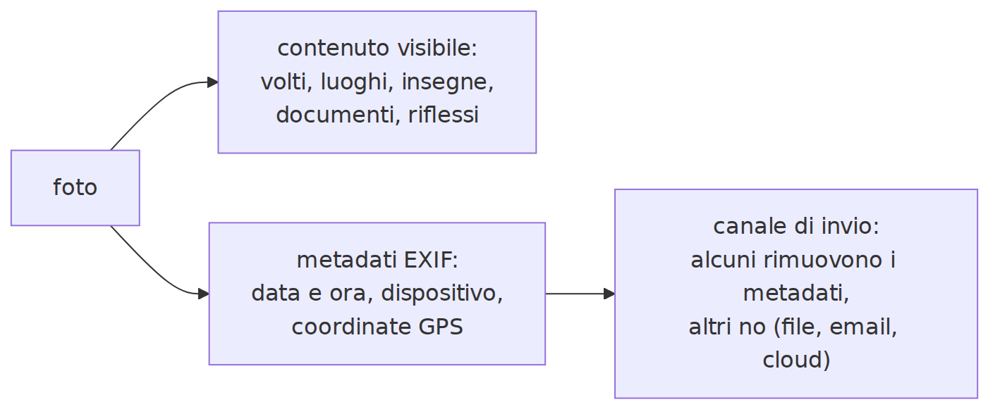
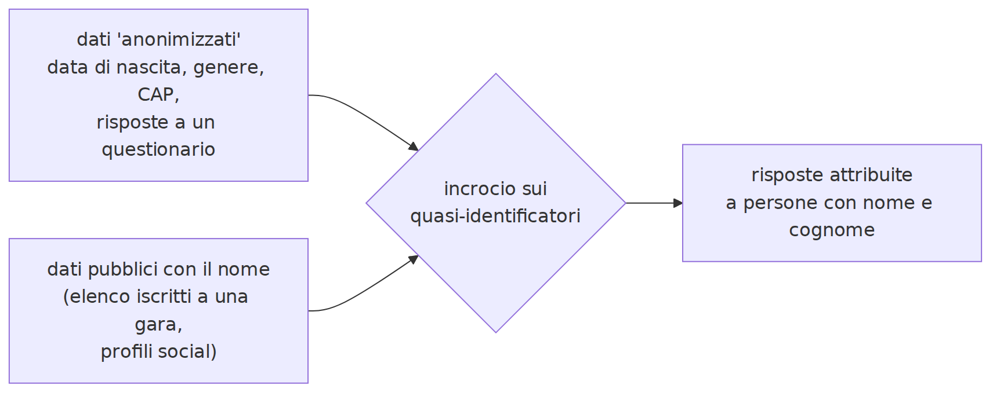
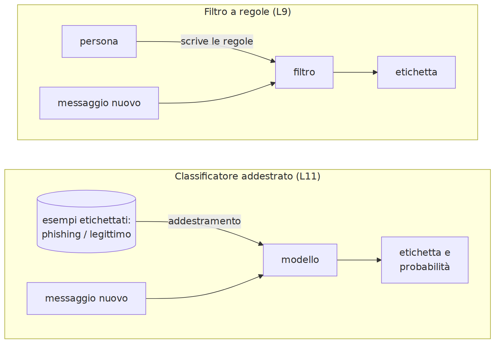
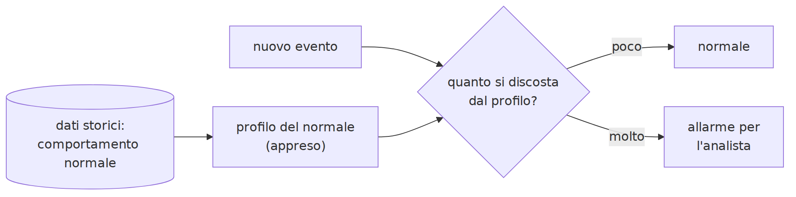

# L10 - Dati personali e riservatezza: i rischi non ovvi

## Contenuti della lezione

- definizioni
- metadati delle foto
- reidentificazione e k-anonimato
- inferenza
- tracciamento
- chatbot e assistenti di IA
- GDPR: principi e diritti

## Definizioni

- **Dato personale**: riguarda una persona identificata o **identificabile**, anche indirettamente (GDPR, art. 4)
- **Dati particolari**: salute, biometria, opinioni, religione, orientamento... (art. 9)
- **Anonimo**: non riconducibile alla persona con mezzi ragionevoli
- **Pseudonimo**: identificativi sostituiti da un codice; resta un dato personale
- **Metadato**: dato che descrive un dato (data, luogo, autore, destinatari)

## Metadati delle foto: EXIF

{height=34%}

- data e ora, dispositivo, **coordinate GPS**
- molti social li rimuovono, non tutti i canali: file, email, cloud
- anche lo **sfondo** parla: riflessi, documenti, insegne, divise

Gradi decimali = gradi + minuti/60 + secondi/3600

## Reidentificazione

{width=95%}

**Quasi-identificatori**: data di nascita, genere, CAP, scuola, classe

## Uno studio classico

Latanya Sweeney, 2000: CAP a 5 cifre + genere + data di nascita identificano in modo univoco circa l'**87%** della popolazione degli Stati Uniti.

https://dataprivacylab.org/projects/identifiability/paper1.pdf

Togliere nome e cognome non basta a rendere anonimi i dati.

## k-anonimato

Ogni combinazione di quasi-identificatori è condivisa da almeno **k** persone. k = 1: qualcuno è unico.

- **generalizzazione**: data → anno, CAP → prime tre cifre
- **soppressione**: eliminare record rari o colonne non necessarie

Limite: se tutto il gruppo ha la stessa risposta sensibile, la risposta è rivelata.

Prima difesa: **minimizzazione**.

## Inferenza

Informazioni non dichiarate, dedotte dai modelli:

- dai testi: età, provenienza, stato d'animo, orientamenti
- dalle foto: luogo, anche senza metadati
- dai comportamenti: interessi, abitudini, relazioni
- dallo stile di scrittura (stilometria): l'autore di un testo anonimo

L'AI Act vieta alcune inferenze, per esempio il riconoscimento delle emozioni a scuola.

## Tracciamento

- **cookie di terze parti**: seguono da un sito all'altro
- **fingerprinting**: impronta del dispositivo, anche senza cookie
- **data broker**: profili combinati da molte fonti, venduti
- **permessi delle app**: posizione, contatti, microfono

Difese: rifiutare i cookie non necessari, protezione dal tracciamento, revisione dei permessi.

## Chatbot e assistenti: che fine fanno i dati

- inviati ai server del fornitore
- **conservati** per un periodo
- possono essere **letti da persone** incaricate
- possono servire all'**addestramento** (secondo impostazioni e account)
- **link di condivisione**: conversazioni finite nei motori di ricerca
- **memoria** tra conversazioni

## Rischi non ovvi e buone pratiche

Rischi: **dati di terzi** inseriti senza consenso, documenti della scuola, **memorizzazione** nei modelli, inferenza dalle domande.

Buone pratiche:

- niente dati personali non necessari; segnaposto al posto dei nomi
- impostazioni di conservazione e addestramento
- account della scuola quando previsti
- niente link di condivisione con dati personali

## GDPR: principi (art. 5)

- liceità, correttezza, trasparenza
- limitazione della finalità
- **minimizzazione**
- esattezza
- limitazione della conservazione
- integrità e riservatezza
- responsabilizzazione

Ruoli: **interessato**, **titolare** (la scuola), **responsabile** (il fornitore del registro)

Garante: https://www.garanteprivacy.it/

## GDPR: diritti

- accesso, rettifica, cancellazione, limitazione, portabilità, opposizione
- non essere sottoposti a decisioni **solo automatizzate** con effetti significativi (art. 22)

Data breach: notifica al Garante entro **72 ore**.

Minori: consenso ai servizi online dai **14 anni** (stessa soglia per l'IA, legge 132/2025).

## Laboratorio L10

Materiali: `L10_foto_esempio.jpg`, notebook `L10_metadati_reidentificazione.ipynb`, due CSV fittizi

1. (base) CyberChef, `Extract EXIF`: data, dispositivo, GPS
2. (base) notebook: metadati, gradi decimali, copia senza metadati
3. (standard) incrocio questionario "anonimo" e iscritti al torneo
4. (standard) k-anonimato prima e dopo la generalizzazione
5. (approfondimento) checklist sulle proprie impostazioni di privacy

## Leggere i metadati con Python

```python
from PIL import Image, ExifTags

img = Image.open("L10_foto_esempio.jpg")
exif = img.getexif()
for codice, valore in exif.items():
    print(ExifTags.TAGS.get(codice, codice), valore)

gps = exif.get_ifd(0x8825)      # sezione GPS
print(gps)
```

## Reidentificare con pandas

```python
import pandas as pd

questionario = pd.read_csv("L10_questionario_anonimizzato.csv", dtype=str)
iscritti = pd.read_csv("L10_iscritti_torneo.csv", dtype=str)

incrocio = pd.merge(iscritti, questionario,
                    on=["data_nascita", "genere", "cap"])
print(len(incrocio), "risposte attribuite a persone con nome e cognome")
```

# L11 - L'IA nella difesa

## Dalle regole ai modelli

{height=49%}

- **apprendimento automatico**: impara dagli esempi
- **classificatore**: assegna un'etichetta
- **addestramento**: ricava le regolarità dagli esempi etichettati

## Sacchetto di parole e Naive Bayes

- **bag of words**: ogni messaggio diventa un conteggio di parole (`CountVectorizer`)
- **Naive Bayes**: frequenza delle parole in ciascuna classe, combinate in una probabilità (`MultinomialNB`); tra i primi metodi antispam

```python
vettorizzatore = CountVectorizer()
X = vettorizzatore.fit_transform(testi)      # testi -> conteggi
modello = MultinomialNB().fit(X, etichette)  # addestramento
nuovo = vettorizzatore.transform(["inserisci il codice entro oggi"])
print(modello.predict(nuovo))
```

## Falsi positivi e falsi negativi

| | previsto phishing | previsto legittimo |
|---|---|---|
| **vero phishing** | vero positivo | **falso negativo**: passa |
| **vero legittimo** | **falso positivo**: bloccato | vero negativo |

- verifica su messaggi **non usati** nell'addestramento
- falsi negativi: attacchi che passano
- troppi falsi positivi: avvisi ignorati
- la **soglia** regola il compromesso

## Rilevamento di anomalie

{width=90%}

Esempi: accesso da un paese mai visto, download massicci, traffico notturno verso indirizzi sconosciuti, migliaia di file modificati in pochi secondi.

Segnalazioni da verificare, non verdetti.

## SOC, SIEM, EDR e IA

- **SOC**: analisti che sorvegliano in modo continuo
- **SIEM**: raccoglie e correla i log, genera allarmi
- **EDR**: sorveglia i dispositivi, li isola a distanza

L'IA: raggruppa e ordina gli allarmi, riconosce malware dal comportamento, riassume gli incidenti, analizza file sospetti.

Gli attaccanti usano strumenti simili.

## Limiti dell'IA nella difesa

- **dipendenza dai dati**: il nuovo può sfuggire
- **deriva**: il normale cambia, serve riaddestrare
- **aggiramento** (L12)
- **avvelenamento** (L13)
- **fiducia eccessiva**: decisioni rilevanti con supervisione umana

## Laboratorio L11

Notebook `L11_classificatore_phishing.ipynb`, dataset `L11_messaggi.csv` (220 messaggi fittizi)

1. (base) addestramento, accuratezza, tabella degli errori
2. (base) parole più indicative: confronto con le regole di L9
3. (standard) nuovi messaggi, probabilità, un errore da spiegare
4. (standard) riscrivere un messaggio fraudolento finché passa il filtro
5. (approfondimento) soglia per la posta della segreteria
