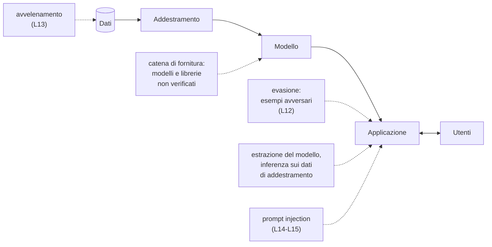
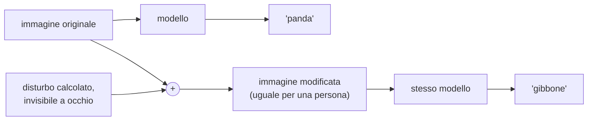
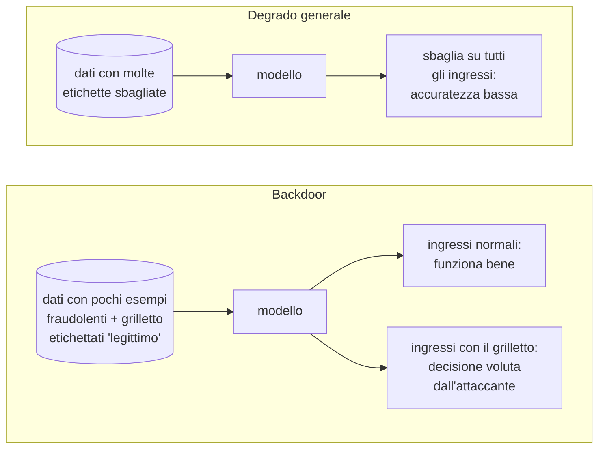

# Lezione L12 - La superficie di attacco dei sistemi di IA ed esempi avversari

## Obiettivi della lezione

- descrivere le fasi del ciclo di vita di un sistema di IA e i punti in cui può essere attaccato
- distinguere evasione, avvelenamento, estrazione del modello, inferenza sui dati di addestramento, attacchi alla catena di fornitura
- spiegare che cos'è un esempio avversario e perché i modelli ne sono vulnerabili
- riconoscere esempi avversari su immagini, oggetti fisici e testi
- misurare la robustezza di un classificatore e valutare le difese e i loro limiti

## Il ciclo di vita di un sistema di IA

Un sistema di IA non è solo un modello: è una catena di fasi, ciascuna con i propri punti deboli.

- Dati
  raccolti da archivi interni, dal web, dagli utenti, da fornitori esterni.
- Addestramento
  il modello ricava dai dati le regolarità che userà per decidere (L11).
- Modello
  il risultato dell'addestramento: un file di parametri, spesso scaricato da un archivio pubblico invece che addestrato in casa.
- Applicazione
  il programma che usa il modello: un filtro di posta, un'app, un servizio web.
- Utenti
  inviano dati al sistema e ricevono le decisioni.

Diagramma: ciclo di vita di un sistema di IA e punti di attacco

## Tassonomia essenziale degli attacchi

- Evasione
  l'attaccante modifica l'ingresso (un'immagine, un messaggio, un file) in modo che il modello, già addestrato, prenda la decisione sbagliata. Gli ingressi modificati si chiamano esempi avversari.
- Avvelenamento (poisoning)
  l'attaccante inserisce dati manipolati nella fase di addestramento, in modo che il modello impari regole sbagliate (L13).
- Estrazione del modello
  l'attaccante invia molte richieste al servizio e usa le risposte per costruire una copia del modello, senza pagarne il costo di sviluppo; la copia può poi servire a preparare attacchi di evasione.
- Inferenza sui dati di addestramento
  dalle risposte del modello si deduce se un certo dato era tra quelli di addestramento (inferenza di appartenenza, membership inference) o se ne ricostruiscono parti. È il rischio per la riservatezza già visto in L10, dal lato dell'attaccante.
- Attacchi alla catena di fornitura (supply chain)
  modelli, dataset e librerie scaricati da fonti non verificate possono contenere backdoor o codice malevolo. Alcuni formati di file usati per salvare i modelli, come `pickle` di Python, possono eseguire codice nel momento in cui il file viene caricato.

Le tassonomie di riferimento per chi si occupa professionalmente di questi attacchi:

- NIST AI 100-2 E2025, Adversarial Machine Learning: A Taxonomy and Terminology of Attacks and Mitigations (marzo 2025): https://csrc.nist.gov/pubs/ai/100/2/e2025/final
- MITRE ATLAS, base di conoscenza delle tecniche di attacco ai sistemi di IA, organizzata come MITRE ATT&CK: https://atlas.mitre.org/

Sui rischi del formato `pickle` e sulle alternative sicure: Hugging Face, Pickle Scanning, https://huggingface.co/docs/hub/security-pickle

## Esempi avversari

- Esempio avversario
  ingresso modificato in modo mirato, spesso con variazioni impercettibili per una persona, che fa prendere al modello una decisione sbagliata. La modifica è calcolata, non casuale: si cerca la variazione più piccola che produce l'errore voluto.

Esempio classico: nel 2014 Goodfellow, Shlens e Szegedy mostrano la foto di un panda classificata correttamente da una rete neurale; aggiungendo un disturbo calcolato, invisibile a occhio, la stessa foto viene classificata come gibbone con alta confidenza.
Fonte: I. Goodfellow, J. Shlens, C. Szegedy, Explaining and Harnessing Adversarial Examples, https://arxiv.org/abs/1412.6572

Diagramma: esempio avversario

### Nel mondo fisico

Gli esempi avversari non sono limitati ai file:

- Segnali stradali
  Eykholt e colleghi (2018) applicano adesivi bianchi e neri a un segnale di stop reale: il classificatore lo scambia per un limite di velocità nel 100% delle foto scattate in laboratorio e nell'84,8% dei fotogrammi ripresi da un'auto in movimento. Per una persona gli adesivi sembrano graffiti.
  Fonte: K. Eykholt et al., Robust Physical-World Attacks on Deep Learning Visual Classification, https://arxiv.org/abs/1707.08945
- Riconoscimento facciale
  montature di occhiali con motivi stampati appositamente fanno riconoscere una persona come un'altra o impediscono il riconoscimento (Sharif e colleghi, 2016).

### Nel testo

Nei classificatori di testo la modifica non è invisibile, ma può restare inosservata:

- aggiunta di parole tipiche dei messaggi legittimi, spesso in fondo al messaggio o in testo non visibile (bianco su bianco, caratteri minuscoli); è la tecnica usata dagli spammer contro i primi filtri bayesiani, studiata da Lowd e Meek nel 2005 con il nome di "good word attack"
- sostituzione di parole con sinonimi o con errori di battitura mirati ("acc0unt", "pass word")
- caratteri invisibili o di altri alfabeti (gli stessi omografi di L2) che spezzano le parole riconosciute dal filtro

Il laboratorio applica la prima tecnica al filtro di L11.

## Perché i modelli sono vulnerabili

- Regolarità statistiche, non concetti
  un modello non sa che cos'è un segnale di stop o una truffa: associa caratteristiche dell'ingresso a un'etichetta. Se le caratteristiche cambiano nel modo giusto, la decisione cambia, anche se per una persona l'oggetto è lo stesso.
- Molte dimensioni
  un'immagine ha centinaia di migliaia di valori; una variazione minima su ciascuno, sommata su tutti, sposta molto la decisione del modello. Il gruppo di Goodfellow ha individuato in questo comportamento "quasi lineare" la causa principale della vulnerabilità.
- Conoscenza del modello
  chi conosce il modello (attacco a scatola bianca, white-box) calcola direttamente la modifica. Chi può solo inviare ingressi e leggere le risposte (scatola nera, black-box) procede per tentativi, o prepara l'esempio su un modello simile: gli esempi avversari spesso si trasferiscono da un modello a un altro.

## Difese e loro limiti

- Test di robustezza
  prima della messa in uso si misura quanti ingressi modificati il modello classifica in modo sbagliato, con attacchi di diversa forza. È la misura svolta nel laboratorio.
- Addestramento con esempi avversari (adversarial training)
  esempi avversari, con l'etichetta corretta, vengono aggiunti ai dati di addestramento. Il modello diventa resistente agli attacchi visti, ma un attaccante che conosce il nuovo modello può calcolare nuovi esempi: la protezione è parziale.
- Pre-elaborazione dell'ingresso
  normalizzare il testo (caratteri invisibili, omografi, maiuscole), rimuovere il testo non visibile, ridurre la risoluzione delle immagini.
- Più segnali indipendenti
  un filtro di posta non si basa solo sul testo: dominio e autenticazione del mittente (L2), reputazione dei link, allegati. Ingannare un segnale non basta a ingannarli tutti (difesa in profondità, L1).
- Controllo umano
  nelle decisioni con conseguenze rilevanti il modello propone, una persona decide.

La ricerca sugli esempi avversari è una competizione continua: a ogni difesa pubblicata seguono attacchi che la aggirano. Nessuna difesa nota rende un modello immune.

## Laboratorio L12

Durata indicativa: 25 minuti. Materiali: dimostrazione adversarial.js (online, https://kennysong.github.io/adversarial.js/), notebook `L12_robustezza_filtro.ipynb`, dataset `L11_messaggi.csv`.

Esercizio 1 (base): in adversarial.js scegliere il modello dei segnali stradali (GTSRB) e un'immagine. Applicare l'attacco più debole (Fast Gradient Sign Method) e il più forte (Carlini & Wagner). Per ciascuno annotare la classe prevista prima e dopo e osservare il disturbo aggiunto: è visibile?

Esercizio 2 (base): nel notebook, elencare le parole che il filtro di L11 associa di più ai messaggi legittimi e rispondere alla domanda: descrivono che cosa rende legittimo un messaggio?

Esercizio 3 (standard): aggiungere parole in coda a un messaggio fraudolento, senza cambiarne la richiesta, e trovare l'aggiunta più breve che porta la probabilità di phishing sotto 0,5.

Esercizio 4 (standard): eseguire la ricerca automatica su tutti i messaggi fraudolenti dell'insieme di verifica e annotare quanti passano e con quante parole aggiunte in media. Spiegare perché il procedimento funziona con un modello a sacchetto di parole.

Esercizio 5 (approfondimento): addestrare il filtro con esempi avversari, verificare se riconosce i messaggi modificati e se una nuova ricerca riesce ancora a farli passare. Indicare le difese che non dipendono dal testo del messaggio.

# Lezione L13 - Avvelenamento dei dati e backdoor

## Obiettivi della lezione

- definire l'avvelenamento dei dati e distinguerne gli obiettivi
- descrivere l'inversione delle etichette e i suoi effetti
- spiegare che cos'è una backdoor in un modello e perché è difficile da scoprire
- riconoscere dove avviene l'avvelenamento nei sistemi reali
- applicare controlli sui dati e sul modello per individuarlo

## Avvelenamento dei dati

- Avvelenamento dei dati (data poisoning)
  inserimento di esempi manipolati nei dati di addestramento di un modello, con lo scopo di modificarne il comportamento.

L'evasione (L12) inganna un modello già addestrato; l'avvelenamento agisce prima, sui dati da cui il modello impara. Un modello avvelenato sbaglia anche con ingressi normali o si comporta come vuole l'attaccante in casi scelti.

Obiettivi dell'attaccante:

- Degrado generale (attacco alla disponibilità)
  il modello peggiora su tutti gli ingressi e diventa inutilizzabile. Esempio: un filtro antispam che blocca anche la posta legittima e viene quindi disattivato.
- Comportamento mirato (attacco all'integrità)
  il modello continua a funzionare bene in generale, ma sbaglia in casi scelti dall'attaccante. La backdoor è la forma più nota.

Diagramma: due obiettivi dell'avvelenamento

## Inversione delle etichette

- Inversione delle etichette (label flipping)
  una parte degli esempi di addestramento riceve l'etichetta sbagliata: messaggi fraudolenti marcati come legittimi e viceversa.

Con poche etichette invertite a caso il modello resiste: gli esempi corretti sono la maggioranza e le regolarità apprese restano valide. Oltre una certa soglia l'accuratezza crolla; con il 50% di etichette invertite a caso il modello non distingue più le classi.

Grafico: accuratezza del filtro di L11 al crescere delle etichette invertite (media di 5 ripetizioni)

{width=70%}

Questo attacco è efficace ma rumoroso: il calo di accuratezza si vede nei controlli ordinari.

## Backdoor

- Backdoor (in un modello)
  comportamento nascosto inserito durante l'addestramento: il modello funziona normalmente, tranne quando nell'ingresso compare un segnale scelto dall'attaccante, detto grilletto (trigger); in quel caso produce la risposta voluta dall'attaccante.
- Grilletto (trigger)
  caratteristica dell'ingresso che attiva la backdoor: un piccolo adesivo in un'immagine, una sequenza di caratteri in un testo, una parola rara.

Esempio: nel 2017 Gu, Dolan-Gavitt e Garg addestrano un riconoscitore di segnali stradali con una backdoor. Il modello riconosce correttamente i segnali, ma classifica come limite di velocità ogni segnale di stop su cui è applicato un piccolo adesivo. Il titolo dell'articolo, BadNets, ha dato il nome a questa famiglia di attacchi.
Fonte: T. Gu, B. Dolan-Gavitt, S. Garg, BadNets: Identifying Vulnerabilities in the Machine Learning Model Supply Chain, https://arxiv.org/abs/1708.06733

Perché una backdoor è difficile da scoprire:

- l'accuratezza sui dati di verifica resta invariata: i controlli ordinari non la vedono
- il grilletto è noto solo all'attaccante e non compare nei dati normali
- il comportamento di un modello complesso non si ricava leggendone i parametri

## Dove avviene l'avvelenamento

- Dati raccolti dal web
  i grandi modelli sono addestrati su enormi raccolte di pagine e immagini pubbliche. Carlini e colleghi (2023) hanno mostrato che per circa 60 dollari si poteva controllare lo 0,01% di due dataset molto usati, acquistando domini scaduti da cui i dataset scaricavano immagini.
  Fonte: N. Carlini et al., Poisoning Web-Scale Training Datasets is Practical, https://arxiv.org/abs/2302.10149
- Pochi documenti bastano anche per i modelli linguistici
  uno studio di Anthropic, UK AI Security Institute e Alan Turing Institute (ottobre 2025) ha inserito una backdoor in modelli linguistici da 600 milioni a 13 miliardi di parametri con circa 250 documenti avvelenati, indipendentemente dalla dimensione del modello e quindi dalla quantità totale di dati.
  Fonte: Anthropic, A small number of samples can poison LLMs of any size, https://www.anthropic.com/research/small-samples-poison
- Segnalazioni degli utenti
  molti filtri si riaddestrano con i pulsanti "è spam" e "non è spam". Nelson e colleghi (2008) hanno mostrato che controllando l'1% dei messaggi di addestramento di SpamBayes, un filtro antispam bayesiano, si poteva far classificare come spam oltre un terzo della posta legittima, rendendo il filtro inutilizzabile.
  Fonte: B. Nelson et al., Exploiting Machine Learning to Subvert Your Spam Filter, https://people.eecs.berkeley.edu/~tygar/papers/SML/Spam_filter.pdf
- Recensioni e valutazioni false
  i sistemi di raccomandazione imparano dalle valutazioni degli utenti; recensioni false coordinate spostano ciò che il sistema propone.
- Modelli e dataset condivisi
  un modello pre-addestrato scaricato da un archivio pubblico può contenere una backdoor inserita da chi lo ha pubblicato (catena di fornitura, L12).

## Difese

Difese sui dati:

- Provenienza
  sapere da dove vengono i dati e chi li ha modificati; preferire fonti controllate; conservare le versioni.
- Controlli statistici
  proporzioni delle etichette, messaggi duplicati con etichette diverse, parole o caratteristiche presenti solo in una classe.
- Controllo incrociato
  si addestra un modello su una parte dei dati e lo si usa per prevedere l'altra parte; gli esempi la cui etichetta non concorda con la previsione vengono esaminati da una persona. Una variante, proposta da Nelson e colleghi, scarta gli esempi la cui aggiunta peggiora le prestazioni del modello (RONI, Reject On Negative Impact).

Difese sul modello:

- Ispezione
  nei modelli semplici si possono leggere le caratteristiche più influenti: un grilletto compare tra le prime.
- Confronto tra versioni
  un nuovo modello si confronta con il precedente su un insieme di prova fisso; differenze inattese vanno spiegate prima della messa in uso.
- Test su casi scelti
  si prepara un insieme di ingressi critici (per esempio messaggi fraudolenti con aggiunte insolite) e si verifica il comportamento del modello.
- Formati e fonti sicuri
  modelli scaricati solo da fonti affidabili, con verifica dell'impronta (hash, L3) e in formati che non eseguono codice al caricamento.

## Laboratorio L13

Durata indicativa: 30 minuti. Materiali: notebook `L13_avvelenamento_backdoor.ipynb`, dataset `L11_messaggi.csv` e `L13_dataset_ricevuto.csv` (messaggi fittizi).

Esercizio 1 (base): eseguire l'esperimento di inversione delle etichette e leggere il grafico. Indicare da quale percentuale il danno diventa evidente e perché questo attacco è facile da notare.

Esercizio 2 (base): eseguire l'esperimento della backdoor con 0, 5, 10, 20 e 30 messaggi avvelenati. Confrontare l'accuratezza con il numero di messaggi fraudolenti con il grilletto ancora riconosciuti.

Esercizio 3 (standard): ripetere l'esperimento con un grilletto diverso (una parola comune, una sequenza di codici). Spiegare quale funziona meglio e perché.

Esercizio 4 (standard): il file `L13_dataset_ricevuto.csv` contiene una backdoor. Individuare il grilletto con i tre controlli del notebook: proporzioni delle etichette, parole indicative, controllo incrociato.

Esercizio 5 (approfondimento): rimuovere i messaggi che contengono il grilletto, riaddestrare il filtro e verificare che la backdoor non funzioni più. Scrivere tre regole per un'organizzazione che riceve dati o modelli da altri.
