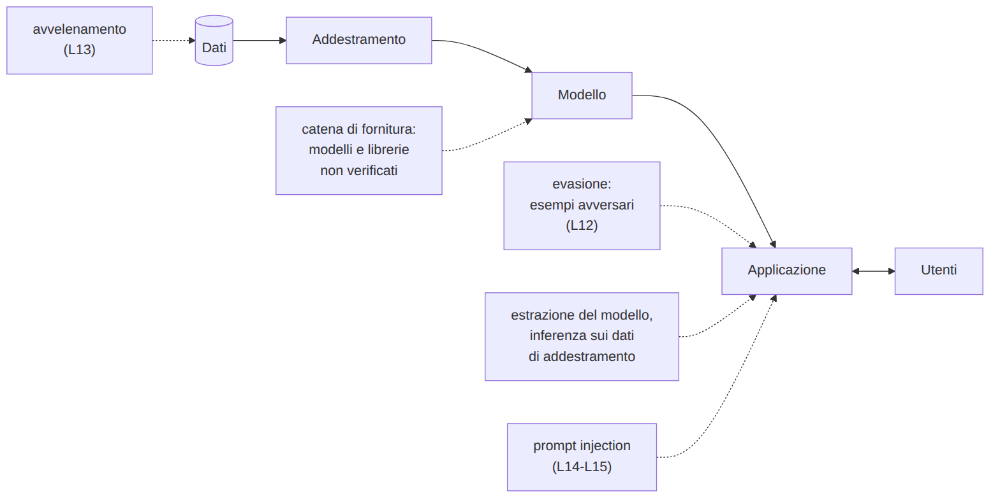
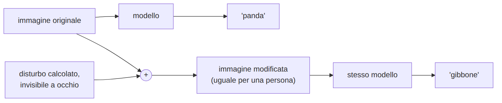
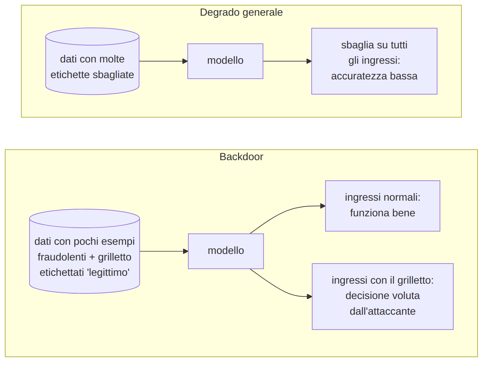
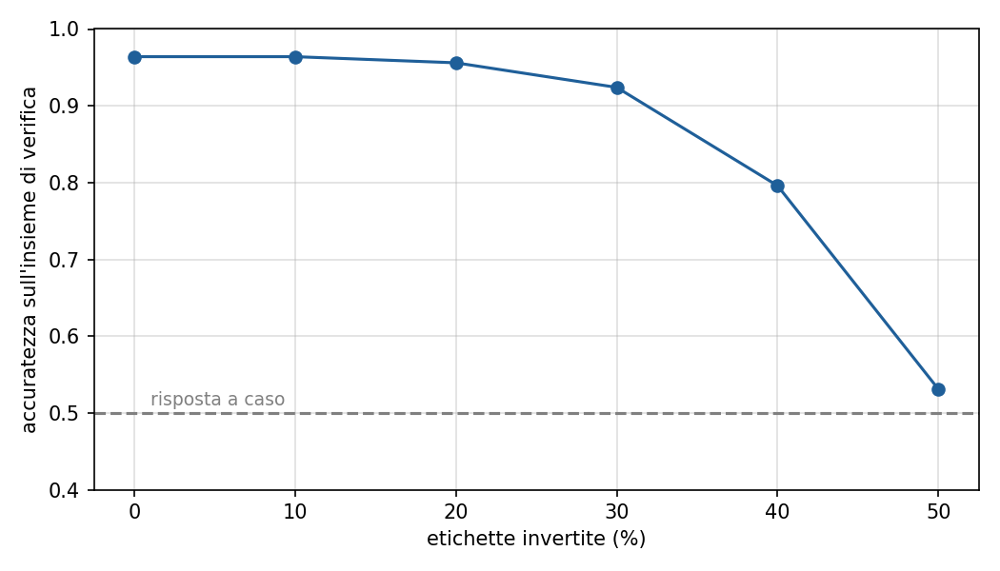

# L12 - La superficie di attacco dei sistemi di IA ed esempi avversari

## Contenuti della lezione

- ciclo di vita di un sistema di IA
- tassonomia degli attacchi
- esempi avversari: immagini, mondo fisico, testo
- perché i modelli sono vulnerabili
- difese e limiti


## Ciclo di vita e punti di attacco

{height=72%}


## Tassonomia essenziale

- **evasione**: ingresso modificato, modello già addestrato (L12)
- **avvelenamento**: dati di addestramento manipolati (L13)
- **estrazione del modello**: copia costruita dalle risposte
- **inferenza sui dati di addestramento**: "questo dato era tra quelli usati?"
- **catena di fornitura**: modelli, dataset, librerie non verificati; file `pickle` che eseguono codice al caricamento

NIST AI 100-2 E2025: https://csrc.nist.gov/pubs/ai/100/2/e2025/final
MITRE ATLAS: https://atlas.mitre.org/


## Esempio avversario

{height=38%}

- modifica **calcolata**, non casuale; spesso impercettibile
- Goodfellow, Shlens, Szegedy (2014): panda → gibbone
  https://arxiv.org/abs/1412.6572


## Nel mondo fisico e nel testo

- **segnale di stop** con adesivi: letto come limite di velocità nel 100% delle foto di laboratorio e nell'84,8% dei fotogrammi da auto in movimento (Eykholt et al., 2018)
  https://arxiv.org/abs/1707.08945
- **occhiali** con motivi stampati contro il riconoscimento facciale (Sharif et al., 2016)
- **testo**: parole "buone" aggiunte in coda o invisibili (good word attack, Lowd e Meek, 2005), sinonimi, errori mirati, caratteri invisibili e omografi


## Perché i modelli sono vulnerabili

- **regolarità statistiche, non concetti**: cambiano le caratteristiche, cambia la decisione
- **molte dimensioni**: tante piccole variazioni si sommano
- **conoscenza del modello**
  - scatola bianca: modifica calcolata direttamente
  - scatola nera: tentativi, o esempi preparati su un modello simile (trasferibilità)


## Difese e limiti

- **test di robustezza** prima della messa in uso
- **addestramento con esempi avversari**: protegge dagli attacchi visti, non da quelli nuovi
- **pre-elaborazione**: normalizzare testo e immagini, togliere il testo invisibile
- **più segnali indipendenti**: mittente, SPF/DKIM/DMARC, link, allegati
- **controllo umano** nelle decisioni rilevanti

Nessuna difesa nota rende un modello immune.


## Laboratorio L12

adversarial.js: https://kennysong.github.io/adversarial.js/
Notebook `L12_robustezza_filtro.ipynb`, dataset `L11_messaggi.csv`

1. (base) adversarial.js, segnali stradali: attacco debole e forte
2. (base) parole che il filtro associa a "legittimo"
3. (standard) aggiunta più breve che fa passare un messaggio fraudolento
4. (standard) ricerca automatica: quanti passano, con quante parole
5. (approfondimento) addestramento con esempi avversari e nuova ricerca


## Il cuore del laboratorio L12

```python
def aggiungi_parole(testo, v, m, candidate, max_parole=30):
    aggiunte = []
    while prob_phishing(testo, v, m) >= 0.5 and len(aggiunte) < max_parole:
        migliore = min(candidate, key=lambda w: prob_phishing(testo + " " + w, v, m))
        testo = testo + " " + migliore
        aggiunte.append(migliore)
    return testo, aggiunte
```

- a ogni passo aggiunge la parola che abbassa di più la probabilità di phishing
- la richiesta del messaggio non cambia


# L13 - Avvelenamento dei dati e backdoor

## Contenuti della lezione

- avvelenamento: definizione e obiettivi
- inversione delle etichette
- backdoor
- dove avviene
- difese


## Avvelenamento dei dati

- **data poisoning**: esempi manipolati nei dati di addestramento
- agisce **prima** dell'evasione: il modello impara regole sbagliate

{height=55%}


## Inversione delle etichette

{height=62%}

- poche etichette sbagliate: il modello resiste
- molte: l'accuratezza crolla; attacco **rumoroso**, visibile nei controlli


## Backdoor

- comportamento nascosto attivato da un **grilletto** (trigger)
- ingressi normali: funziona bene; con il grilletto: decide l'attaccante
- **BadNets** (Gu, Dolan-Gavitt, Garg, 2017): stop + adesivo → limite di velocità
  https://arxiv.org/abs/1708.06733

Difficile da scoprire:

- accuratezza invariata
- grilletto noto solo all'attaccante
- parametri illeggibili nei modelli complessi


## Dove avviene

- **dati dal web**: 0,01% di due grandi dataset controllabile con circa 60 dollari (Carlini et al., 2023)
  https://arxiv.org/abs/2302.10149
- **modelli linguistici**: circa 250 documenti bastano per una backdoor, qualunque sia la dimensione del modello (Anthropic, UK AISI, Alan Turing Institute, 2025)
  https://www.anthropic.com/research/small-samples-poison
- **segnalazioni degli utenti**: 1% dei messaggi di SpamBayes → oltre un terzo della posta legittima in spam (Nelson et al., 2008)
- **recensioni false**, **modelli condivisi**


## Difese

Sui dati:

- **provenienza** e versioni
- **controlli statistici**: proporzioni, duplicati con etichette diverse, parole presenti in una sola classe
- **controllo incrociato**: etichette in disaccordo con la previsione esaminate da una persona; RONI

Sul modello:

- **ispezione** delle caratteristiche più influenti
- **confronto tra versioni** su un insieme di prova fisso
- **test su casi scelti**
- **fonti e formati sicuri**, verifica dell'hash


## Laboratorio L13

Notebook `L13_avvelenamento_backdoor.ipynb`, dataset `L11_messaggi.csv`, `L13_dataset_ricevuto.csv`

1. (base) inversione delle etichette: grafico dell'accuratezza
2. (base) backdoor con 0-30 messaggi avvelenati: accuratezza e grilletto
3. (standard) grilletti diversi a confronto
4. (standard) trovare la backdoor nel dataset ricevuto
5. (approfondimento) bonifica, verifica, regole per dati e modelli esterni
