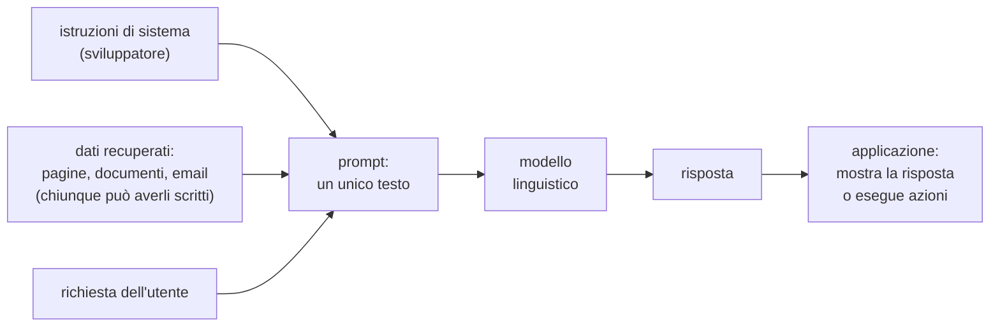
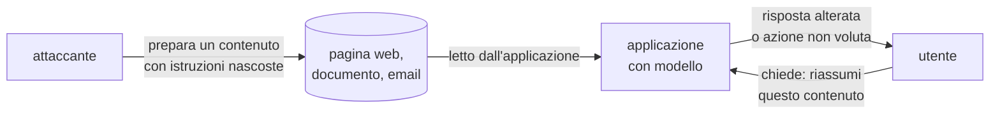
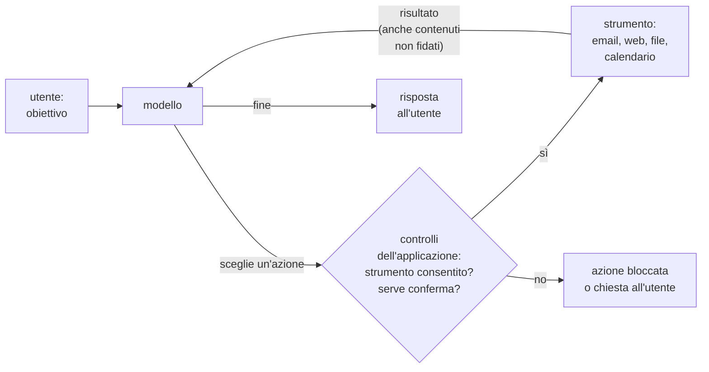
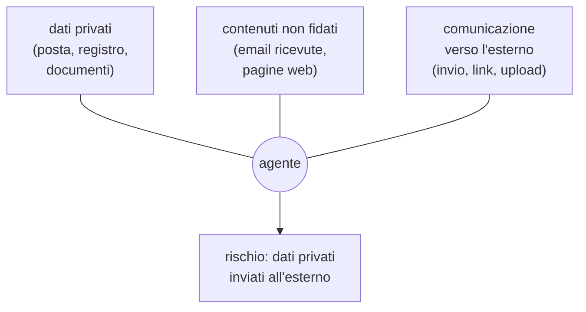

# Lezione L14 - Modelli linguistici: prompt injection, jailbreak, fuga di informazioni

## Obiettivi della lezione

- descrivere come un'applicazione costruisce il testo inviato a un modello linguistico
- spiegare perché istruzioni e dati nello stesso canale sono un problema di sicurezza
- distinguere prompt injection diretta e indiretta, jailbreak, fuga del prompt di sistema
- riconoscere le allucinazioni come rischio di sicurezza
- conoscere le categorie della OWASP Top 10 per le applicazioni LLM
- applicare controlli difensivi sulle istruzioni di sistema e sul codice suggerito

## Come un'applicazione usa un modello linguistico

- Modello linguistico (LLM, Large Language Model)
  modello addestrato su grandi quantità di testo che, ricevuto un testo in ingresso, produce il testo che più probabilmente lo continua. Chatbot, assistenti di scrittura e di programmazione si basano su modelli di questo tipo.
- Prompt
  il testo inviato al modello. In un'applicazione non è scritto solo dall'utente: il programma lo compone mettendo insieme più parti.
- Istruzioni di sistema (system prompt)
  la parte del prompt scritta dallo sviluppatore dell'applicazione: ruolo del chatbot, regole, limiti, tono.

Le parti di un prompt:

- istruzioni di sistema (sviluppatore)
- dati recuperati dall'applicazione: pagine web, documenti, email, risultati di una ricerca
- richiesta dell'utente
- conversazione precedente

Diagramma: composizione del prompt

Tutte le parti arrivano al modello come un unico testo. Il modello non dispone di un meccanismo affidabile per distinguere un'istruzione dello sviluppatore da una frase che si trova in un documento letto per conto dell'utente. È la differenza fondamentale rispetto a un programma tradizionale, in cui codice e dati sono separati (per esempio nelle query parametrizzate di un database).

## Prompt injection

- Prompt injection
  attacco in cui un testo inserito nel prompt contiene istruzioni che il modello segue al posto di quelle dello sviluppatore o dell'utente.
- Prompt injection diretta
  le istruzioni sono scritte dall'utente stesso nella propria richiesta, per far fare all'applicazione qualcosa che lo sviluppatore non prevedeva.
- Prompt injection indiretta
  le istruzioni si trovano in un contenuto che il modello legge per conto dell'utente: una pagina web, un documento condiviso, un'email ricevuta. L'utente non le vede o non le nota; il modello le legge insieme al resto.

Diagramma: prompt injection indiretta

La prompt injection indiretta è la più pericolosa: la vittima non fa nulla di sbagliato e l'attaccante non ha bisogno di accedere all'applicazione, gli basta far leggere al modello un contenuto che controlla. Le istruzioni possono essere nascoste in modo che una persona non le veda: testo bianco su bianco, caratteri minuscoli, commenti nel codice HTML, metadati di un documento.

Il rischio dipende da ciò che l'applicazione può fare:

- se il modello produce solo testo che l'utente legge, il danno è una risposta falsa o manipolata (per esempio un riassunto che invita a visitare un sito fraudolento)
- se il modello può usare strumenti (inviare email, aprire link, modificare file), il danno è un'azione eseguita a nome dell'utente (L15)

Caso reale: nel 2025 è stata documentata una vulnerabilità di Microsoft 365 Copilot (CVE-2025-32711, detta EchoLeak) in cui un'email ricevuta, senza alcuna azione dell'utente, poteva indurre l'assistente a far uscire dati aziendali a cui aveva accesso. La vulnerabilità è stata corretta da Microsoft nel giugno 2025.
Fonte: P. Reddy, A. S. Gujral, EchoLeak: The First Real-World Zero-Click Prompt Injection Exploit in a Production LLM System, https://arxiv.org/abs/2509.10540

## Jailbreak

- Jailbreak
  aggiramento delle regole di comportamento di un modello, cioè dei limiti che il produttore ha addestrato nel modello per evitare risposte dannose.

La differenza con la prompt injection: il jailbreak prende di mira le regole del modello, la prompt injection prende di mira le istruzioni dell'applicazione costruita sopra il modello. Nella pratica le due cose si sovrappongono.

I produttori addestrano i modelli a riconoscere questi tentativi e aggiungono controlli esterni (classificatori che esaminano richieste e risposte). È una competizione continua, come per gli esempi avversari di L12: nessuna difesa è completa.

## Fuga del prompt di sistema e di informazioni riservate

- Fuga del prompt di sistema (system prompt leakage)
  l'utente riesce a farsi mostrare, in tutto o in parte, le istruzioni di sistema.

Regola per chi sviluppa: le istruzioni di sistema vanno considerate pubbliche. Non devono contenere:

- chiavi di accesso, password, token
- dati personali (numeri di telefono, nomi e informazioni su persone)
- regole interne che non devono essere note (eccezioni, trattamenti riservati)

Le chiavi e i controlli di accesso vanno nel programma che chiama il modello, non nel testo che il modello legge. Un controllo di sicurezza affidato solo alle istruzioni ("non rivelare questa informazione") non è un controllo di sicurezza.

Lo stesso vale per i dati: se un chatbot ha accesso a documenti riservati, occorre assumere che un utente possa riuscire a farseli mostrare. Il chatbot deve avere accesso solo ai dati che l'utente che lo sta usando ha diritto di vedere.

## Allucinazioni come rischio di sicurezza

- Allucinazione
  risposta del modello plausibile nella forma ma falsa nel contenuto: fatti, citazioni, riferimenti normativi, nomi.

Alcune allucinazioni diventano un rischio di sicurezza:

- Pacchetti software inesistenti
  gli assistenti di programmazione citano a volte librerie che non esistono. Un attaccante può pubblicare un pacchetto con quel nome nell'archivio pubblico (per Python, PyPI) con codice malevolo. Uno studio del 2024 su 16 modelli e 576 000 esempi di codice ha trovato nomi di pacchetti inesistenti in almeno il 5,2% del codice prodotto dai modelli commerciali e nel 21,7% di quello dei modelli open source.
  Fonte: J. Spracklen et al., We Have a Package for You! A Comprehensive Analysis of Package Hallucinations by Code Generating LLMs, https://arxiv.org/abs/2406.10279
- Citazioni e fonti inventate
  articoli, sentenze, numeri di legge inesistenti riportati in documenti ufficiali.
- Istruzioni tecniche sbagliate
  configurazioni non sicure presentate come corrette.

Difesa: ogni affermazione rilevante e ogni riferimento si verificano sulla fonte originale; ogni pacchetto si verifica prima dell'installazione.

## OWASP Top 10 per le applicazioni LLM (2025)

OWASP (Open Worldwide Application Security Project) è una comunità internazionale che pubblica guide e classifiche dei rischi per la sicurezza del software. La classifica per le applicazioni basate su modelli linguistici, edizione 2025:

| Codice | Rischio | Descrizione sintetica |
|---|---|---|
| LLM01 | Prompt injection | istruzioni nel prompt alterano il comportamento del modello |
| LLM02 | Divulgazione di informazioni sensibili | il modello rivela dati personali o riservati |
| LLM03 | Catena di fornitura | modelli, dati, librerie di terzi compromessi (L12) |
| LLM04 | Avvelenamento di dati e modelli | L13 |
| LLM05 | Gestione impropria dell'output | la risposta del modello usata senza controlli da altri programmi |
| LLM06 | Eccesso di autonomia (excessive agency) | il modello può eseguire più azioni del necessario (L15) |
| LLM07 | Fuga del prompt di sistema | le istruzioni di sistema diventano visibili |
| LLM08 | Debolezze di vettori ed embedding | attacchi ai sistemi di ricerca che forniscono documenti al modello |
| LLM09 | Disinformazione | allucinazioni e contenuti falsi presi per veri |
| LLM10 | Consumo illimitato | richieste che esauriscono risorse o budget del servizio |

Riferimento: OWASP Top 10 for Large Language Model Applications, https://owasp.org/projects/top-10-for-large-language-model-applications

## Difese per le applicazioni

Nessuna tecnica impedisce del tutto la prompt injection. Le difese riducono la probabilità e soprattutto limitano i danni:

- trattare tutto il testo recuperato (pagine, documenti, email) come non fidato
- separare e marcare i dati rispetto alle istruzioni: riduce il rischio, non lo elimina
- controllare l'output prima di usarlo: per esempio consentire solo link verso domini noti
- dare al modello solo i dati e gli strumenti indispensabili (minimo privilegio, L15)
- chiedere conferma a una persona prima delle azioni con effetti esterni o irreversibili
- non affidare segreti o controlli di accesso alle istruzioni di sistema
- registrare le richieste e le azioni per poterle verificare

## Laboratorio L14

Durata indicativa: 30 minuti. Materiali: notebook `L14_verifiche_difensive.ipynb`; Lakera Gandalf (online, facoltativo, https://gandalf.lakera.ai/).

Esercizio 1 (base): per ciascuno dei quattro scenari seguenti indicare se si tratta di prompt injection diretta, indiretta, jailbreak o fuga del prompt di sistema, e quale parte del prompt è stata usata dall'attaccante.

- uno studente chiede al chatbot di orientamento di mostrare le proprie istruzioni e ottiene le regole interne sulle iscrizioni
- un assistente che riassume pagine web restituisce, per una pagina di recensioni, un riassunto che invita a scaricare un'app da un sito sconosciuto
- un utente riesce a ottenere da un chatbot generico una risposta che il produttore del modello aveva escluso
- un assistente di posta, riassumendo un'email di un fornitore, scrive che le fatture vanno pagate su un nuovo IBAN, informazione che nell'email non compariva in forma visibile

Esercizio 2 (base): con la tabella OWASP, associare a ciascuno scenario dell'esercizio 1 uno o più codici LLM01-LLM10.

Esercizio 3 (standard): nel notebook, analizzare le istruzioni di sistema di un chatbot di orientamento con il controllo automatico, individuare le informazioni che non devono comparire, riscrivere le istruzioni e aggiungere un controllo per gli indirizzi email.

Esercizio 4 (standard): nel notebook, verificare quali pacchetti citati in un codice suggerito sono installati e descrivere i controlli da fare su PyPI prima di installare un pacchetto sconosciuto.

Esercizio 5 (approfondimento, facoltativo, a coppie): livelli iniziali di Lakera Gandalf. Il registro delle attività contiene, per ciascun livello, la difesa che il gioco sembra applicare e perché non basta; non si annotano né si condividono le frasi usate.

<!-- LABORATORIO AGGIUNTIVO L14: spazio per un esercizio preparato dal docente -->

# Lezione L15 - Assistenti e agenti di IA: usarli in sicurezza

## Obiettivi della lezione

- spiegare che cos'è un agente di IA e perché amplifica il rischio di prompt injection
- applicare il principio del minimo privilegio e la conferma umana delle azioni
- riconoscere la combinazione di capacità che rende un agente pericoloso
- valutare i permessi di estensioni e app di IA
- rivedere il codice generato da un assistente
- formulare regole d'uso sicuro degli assistenti di IA

## Agenti di IA

- Agente di IA
  sistema in cui un modello linguistico non si limita a rispondere, ma decide ed esegue azioni usando strumenti collegati: leggere e inviare email, navigare sul web, compilare moduli, modificare file, eseguire programmi, fare acquisti.
- Strumento (tool)
  funzione che l'applicazione mette a disposizione del modello: il modello chiede di usarla, l'applicazione la esegue e restituisce il risultato.

Diagramma: ciclo di un agente

Il ciclo si ripete: il modello legge il risultato di ogni azione e decide la successiva. Se tra i risultati c'è un contenuto non fidato (una pagina, un'email), una prompt injection indiretta può cambiare le azioni successive dell'agente.

## La combinazione pericolosa

Simon Willison, sviluppatore e ricercatore indipendente, ha descritto nel 2025 la combinazione di tre capacità che rende un agente esposto al furto di dati, chiamandola "triade letale" (lethal trifecta):

- accesso a dati privati
- esposizione a contenuti non fidati
- possibilità di comunicare verso l'esterno

Con tutte e tre, un contenuto non fidato può indurre l'agente a leggere dati privati e inviarli fuori. Togliere una delle tre capacità, o sottoporla a conferma umana, interrompe la catena.

Riferimento: S. Willison, The lethal trifecta for AI agents: private data, untrusted content, and external communication, https://simonwillison.net/2025/Jun/16/the-lethal-trifecta/

Diagramma: la triade letale

## Principi di difesa per gli agenti

- Minimo privilegio
  l'agente riceve solo gli strumenti e i dati necessari al compito. Un agente che riassume le circolari non ha bisogno di inviare email.
- Conferma umana
  le azioni con effetti esterni o irreversibili (inviare, pagare, cancellare, pubblicare) richiedono la conferma esplicita dell'utente, mostrando che cosa verrà fatto.
- Elenchi di destinazioni consentite
  destinatari, domini, siti verso cui l'agente può comunicare.
- Separazione dei compiti
  un agente che legge contenuti non fidati non ha accesso a dati privati, o viceversa.
- Registro delle azioni
  ogni azione eseguita viene registrata e può essere verificata e annullata dove possibile.

Questi principi corrispondono ai rischi LLM06 (eccesso di autonomia) e LLM01 (prompt injection) della classifica OWASP.

## Codice generato dall'IA

Gli assistenti di programmazione producono codice che funziona ma non è necessariamente sicuro:

- errori di sicurezza classici: password memorizzate in chiaro, dati inseriti senza controlli, chiavi di accesso scritte nel codice
- dipendenze inesistenti o obsolete (L14)
- codice copiato da esempi vecchi, con pratiche non più raccomandate

Regola: il codice generato si legge, si capisce e si verifica come quello di un collega sconosciuto, prima di eseguirlo.

## Estensioni e app di IA

Estensioni del browser, app e siti che promettono funzioni di IA sono un vettore diffuso di malware e furto di dati:

- app false che imitano servizi noti (L9)
- estensioni con permessi eccessivi: leggere tutti i siti visitati, i cookie di sessione, gli appunti
- estensioni legittime vendute a nuovi proprietari e aggiornate con codice malevolo

Prima di installare un'estensione: verificare l'editore, leggere i permessi richiesti e chiedersi se servono alla funzione promessa.

## Regole pratiche per lo studente

- non inserire nei chatbot dati personali propri o di altri, né documenti riservati (L10)
- verificare affermazioni, citazioni e fonti sulle fonti originali
- non aprire link e file suggeriti da un chatbot senza gli stessi controlli usati per le email (L8)
- non installare estensioni o app di IA non ufficiali; controllarne i permessi
- per le attività scolastiche, usare gli strumenti e gli account forniti dalla scuola quando previsti
- prima di autorizzare un'azione di un assistente, leggere che cosa verrà fatto

## Laboratorio L15

Durata indicativa: 25 minuti. Materiali: notebook `L15_agenti_estensioni.ipynb`.

Esercizio 1 (base, a gruppi): per ciascuno dei quattro scenari indicare l'attacco possibile, il danno, la contromisura.

- un assistente di posta che può leggere e inviare email riceve un messaggio con istruzioni nascoste
- un agente incaricato di prenotare una gita consulta il sito di un'agenzia che contiene testo manipolato
- un assistente di programmazione suggerisce un codice che importa una libreria inesistente
- un'estensione "di IA" per riassumere le pagine chiede l'accesso a tutti i siti, ai cookie e agli appunti

Esercizio 2 (base): nel notebook, analizzare i permessi di un'estensione immaginaria e scrivere il manifesto minimo.

Esercizio 3 (standard): nel notebook, individuare l'errore di sicurezza di una funzione di registrazione suggerita da un assistente e verificare la versione corretta con hash e sale.

Esercizio 4 (standard): nel notebook, verificare quali agenti immaginari hanno la triade completa e modificarne gli strumenti per interromperla.

Esercizio 5 (approfondimento, tutta la classe): stesura di una carta d'uso sicuro degli assistenti di IA per la classe, di non più di dieci regole, ciascuna collegata a un rischio visto nel corso.
