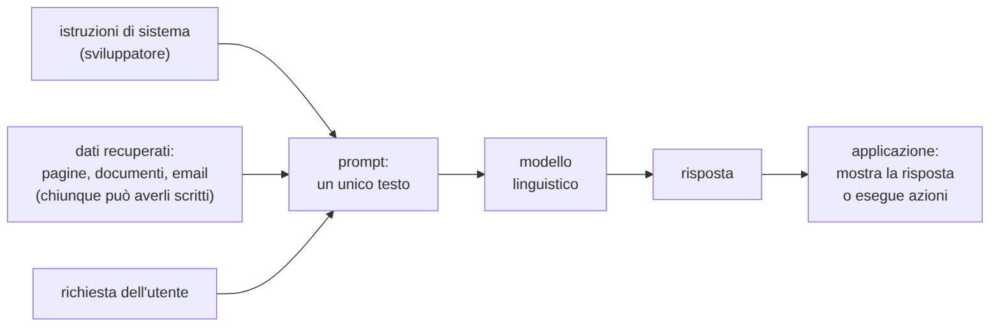
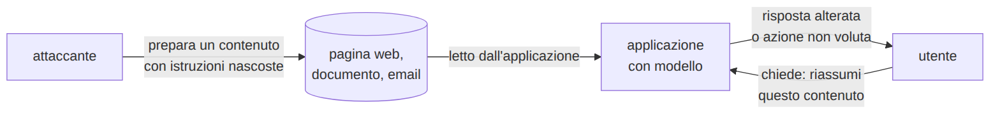
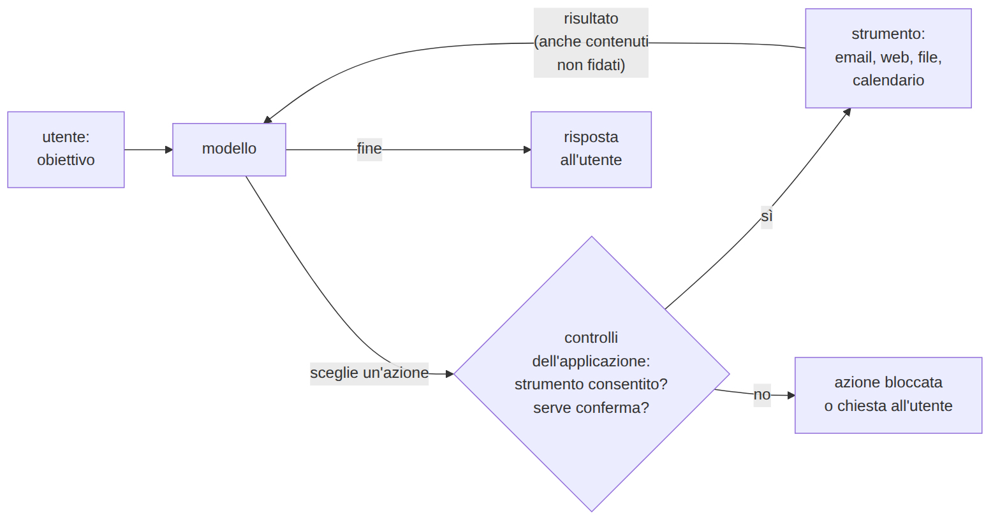
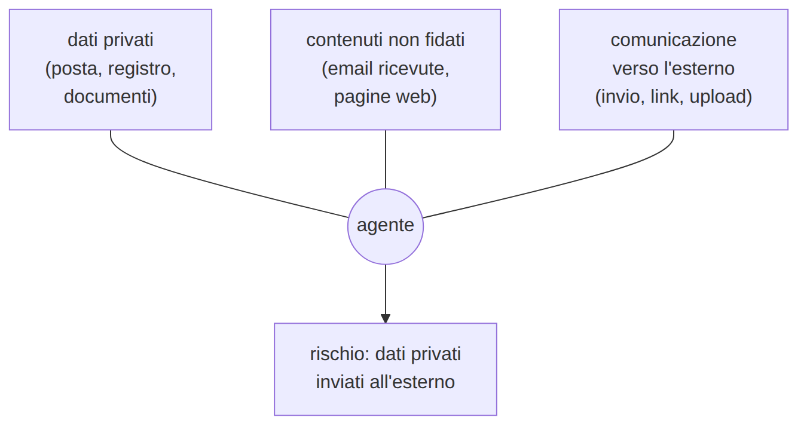

# L14 - Modelli linguistici: prompt injection, jailbreak, fuga di informazioni

## Contenuti della lezione

- come un'applicazione costruisce il prompt
- prompt injection diretta e indiretta
- jailbreak
- fuga del prompt di sistema
- allucinazioni come rischio
- OWASP Top 10 per le applicazioni LLM
- difese

## Composizione del prompt

{width=90%}

- **istruzioni di sistema**: scritte dallo sviluppatore
- **dati recuperati**: scritti da chiunque
- tutto arriva al modello come **un unico testo**: istruzioni e dati non sono separati

## Prompt injection

- **diretta**: istruzioni scritte dall'utente nella propria richiesta
- **indiretta**: istruzioni nascoste in un contenuto letto per conto dell'utente

{width=95%}

- il danno dipende da ciò che l'applicazione **può fare**: testo falso o azioni eseguite

## Un caso reale: EchoLeak (2025)

- Microsoft 365 Copilot, CVE-2025-32711
- un'email ricevuta, **senza alcuna azione dell'utente**, poteva far uscire dati a cui l'assistente aveva accesso
- corretta da Microsoft nel giugno 2025

https://arxiv.org/abs/2509.10540

## Jailbreak e fuga del prompt di sistema

- **jailbreak**: aggirare le regole di comportamento del **modello**
- **prompt injection**: aggirare le istruzioni dell'**applicazione**
- **fuga del prompt di sistema**: le istruzioni diventano visibili all'utente

Le istruzioni di sistema vanno considerate **pubbliche**:

- niente chiavi, password, token
- niente dati personali
- niente regole interne riservate
- controlli di accesso nel programma, non nel testo per il modello

## Allucinazioni come rischio di sicurezza

- **pacchetti inesistenti**: un attaccante registra il nome suggerito
  - almeno 5,2% (modelli commerciali) e 21,7% (open source) del codice con nomi inesistenti (Spracklen et al., 2024)
  - https://arxiv.org/abs/2406.10279
- **citazioni e fonti inventate**
- **configurazioni non sicure** presentate come corrette

Si verifica tutto sulla fonte originale.

## OWASP Top 10 per le applicazioni LLM (2025)

| | | | |
|---|---|---|---|
| LLM01 | prompt injection | LLM06 | eccesso di autonomia |
| LLM02 | informazioni sensibili | LLM07 | fuga del prompt di sistema |
| LLM03 | catena di fornitura | LLM08 | vettori ed embedding |
| LLM04 | avvelenamento | LLM09 | disinformazione |
| LLM05 | gestione impropria dell'output | LLM10 | consumo illimitato |

https://owasp.org/projects/top-10-for-large-language-model-applications

## Difese per le applicazioni

- testo recuperato = **non fidato**
- dati separati e marcati: **riduce**, non elimina
- **controllo dell'output** (per esempio link solo verso domini noti)
- **minimo privilegio** su dati e strumenti
- **conferma umana** per azioni esterne o irreversibili
- nessun segreto nelle istruzioni di sistema
- **registro** di richieste e azioni

## Laboratorio L14

Notebook `L14_verifiche_difensive.ipynb`; Lakera Gandalf (facoltativo): https://gandalf.lakera.ai/

1. (base) quattro scenari: diretta, indiretta, jailbreak, fuga del prompt
2. (base) scenari e codici OWASP
3. (standard) istruzioni di sistema: trovare e togliere le informazioni riservate
4. (standard) pacchetti suggeriti: installati? da verificare su PyPI?
5. (approfondimento, facoltativo) Gandalf: quale difesa, perché non basta

<!-- LABORATORIO AGGIUNTIVO L14: spazio per una slide sull'esercizio preparato dal docente -->

# L15 - Assistenti e agenti di IA: usarli in sicurezza

## Contenuti della lezione

- agenti e strumenti
- la triade letale
- minimo privilegio e conferma umana
- codice generato dall'IA
- estensioni e app di IA
- regole pratiche

## Agenti di IA

{height=60%}

- il modello **sceglie ed esegue azioni** con strumenti collegati
- i risultati, anche **non fidati**, tornano al modello

## La triade letale (Simon Willison, 2025)

{height=55%}

Togliere una capacità, o sottoporla a conferma, interrompe la catena.

https://simonwillison.net/2025/Jun/16/the-lethal-trifecta/

## Principi di difesa per gli agenti

- **minimo privilegio**: solo gli strumenti necessari al compito
- **conferma umana**: inviare, pagare, cancellare, pubblicare
- **destinazioni consentite**: destinatari, domini, siti
- **separazione dei compiti**: chi legge contenuti non fidati non accede a dati privati
- **registro delle azioni**

OWASP: LLM06 eccesso di autonomia, LLM01 prompt injection

## Codice generato, estensioni e app

Codice generato:

- errori classici (password in chiaro, chiavi nel codice), dipendenze inesistenti
- si legge e si verifica **prima** di eseguirlo

Estensioni e app di IA:

- app false, **permessi eccessivi**, estensioni vendute e aggiornate con codice malevolo
- editore, permessi, necessità reale

## Regole pratiche

- nessun dato personale o documento riservato nei chatbot
- verifica di affermazioni e fonti
- link e file suggeriti: stessi controlli delle email
- niente estensioni e app non ufficiali; controllo dei permessi
- strumenti e account della scuola, quando previsti
- leggere che cosa farà un assistente prima di autorizzarlo

## Laboratorio L15

Notebook `L15_agenti_estensioni.ipynb`

1. (base, gruppi) quattro scenari: attacco, danno, contromisura
2. (base) permessi di un'estensione e manifesto minimo
3. (standard) funzione di registrazione suggerita: errore e correzione
4. (standard) agenti con la triade completa: quale strumento togliere
5. (approfondimento) carta d'uso sicuro degli assistenti per la classe
