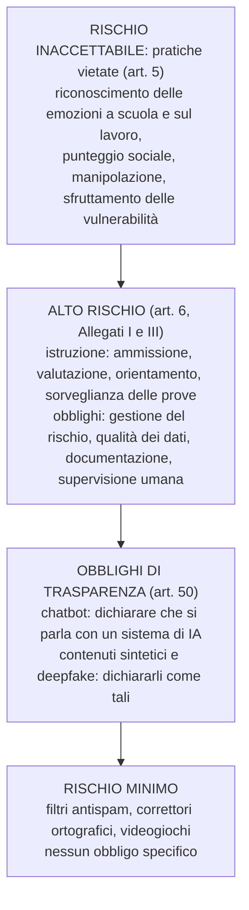
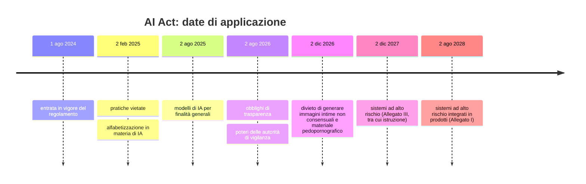
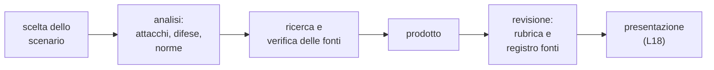

# Lezione L16 - Il quadro normativo: GDPR, AI Act, legge italiana, scuola

## Obiettivi della lezione

- collocare GDPR, AI Act, legge italiana sull'IA e linee guida per la scuola nel quadro delle fonti
- classificare un sistema di IA secondo le categorie di rischio dell'AI Act
- indicare gli obblighi essenziali in caso di violazione di dati personali
- conoscere le regole sull'uso dell'IA da parte dei minori
- riconoscere i principali reati informatici e il nuovo reato sui contenuti falsificati con IA

## Le fonti in sintesi

- GDPR (Regolamento UE 2016/679)
  protegge i dati personali in qualunque trattamento, con o senza IA (L10).
- AI Act (Regolamento UE 2024/1689)
  regola i sistemi di IA in base al rischio che presentano per salute, sicurezza e diritti fondamentali.
- Omnibus digitale sull'IA (Regolamento UE 2026/1744)
  modifica l'AI Act: rinvia alcune scadenze, semplifica alcuni obblighi, aggiunge nuovi divieti.
- Legge italiana sull'IA (legge 23 settembre 2025, n. 132)
  principi nazionali, regole per settori specifici tra cui minori e lavoro, autorità nazionali, nuovi reati.
- Linee guida del Ministero dell'Istruzione e del Merito (allegato al DM 166 del 9 agosto 2025)
  indicazioni per l'introduzione dell'IA nelle scuole.
- Codice penale
  reati informatici, già trattati in L1.

Un regolamento dell'Unione europea si applica direttamente in tutti gli Stati membri, senza bisogno di una legge nazionale di recepimento. La legge italiana interviene negli spazi lasciati agli Stati e nelle materie di competenza nazionale, come il diritto penale.

## GDPR: richiami essenziali

Principi, ruoli e diritti sono stati presentati in L10. Qui si riprendono gli aspetti operativi:

- Base giuridica
  ogni trattamento deve fondarsi su una delle basi previste dall'art. 6: consenso, contratto, obbligo di legge, interesse vitale, compito di interesse pubblico, interesse legittimo. Una scuola statale tratta i dati degli studenti per l'esecuzione di un compito di interesse pubblico, non sulla base del consenso.
- Protezione dei dati fin dalla progettazione e per impostazione predefinita (art. 25)
  la protezione va prevista quando si progetta un servizio e le impostazioni predefinite devono essere le più protettive.
- Valutazione d'impatto (DPIA, art. 35)
  obbligatoria prima dei trattamenti che presentano un rischio elevato, per esempio quelli che usano nuove tecnologie su larga scala o riguardano soggetti vulnerabili come i minori.
- Violazione di dati personali (data breach, artt. 33 e 34)
  notifica al Garante entro 72 ore dalla scoperta, salvo che sia improbabile un rischio per le persone; comunicazione agli interessati se il rischio è elevato; registrazione interna di ogni violazione.
- Consenso dei minori ai servizi online
  in Italia il minore può acconsentire autonomamente dai 14 anni (Codice in materia di protezione dei dati personali, art. 2-quinquies).

## AI Act

### Approccio basato sul rischio

- Sistema di IA (definizione semplificata, art. 3)
  sistema automatizzato che, con un certo grado di autonomia, deduce dagli ingressi che riceve come generare previsioni, contenuti, raccomandazioni o decisioni.

L'AI Act distingue quattro livelli di rischio, con obblighi crescenti.

Diagramma: livelli di rischio dell'AI Act

### Pratiche vietate (art. 5)

Tra le pratiche vietate:

- tecniche manipolative o ingannevoli che alterano in modo significativo il comportamento delle persone causando danni
- sfruttamento delle vulnerabilità legate all'età, alla disabilità o alla situazione sociale o economica
- punteggio sociale: valutazione delle persone in base al comportamento sociale o a caratteristiche personali, quando porta a trattamenti sfavorevoli in contesti non collegati o sproporzionati
- riconoscimento delle emozioni nei luoghi di lavoro e negli istituti di istruzione, salvo motivi medici o di sicurezza
- raccolta indiscriminata di immagini di volti da internet o da telecamere per creare banche dati di riconoscimento facciale
- categorizzazione biometrica per dedurre caratteristiche sensibili (opinioni politiche, orientamento sessuale, convinzioni religiose)

L'Omnibus digitale aggiunge il divieto dei sistemi di IA che generano immagini intime non consensuali di persone reali o materiale pedopornografico, applicabile dal 2 dicembre 2026.

### Alto rischio nell'istruzione

L'Allegato III, punto 3, considera ad alto rischio i sistemi di IA usati per:

- determinare l'accesso o l'ammissione a istituti di istruzione e formazione
- valutare i risultati dell'apprendimento, anche quando orientano il percorso di apprendimento
- valutare il livello di istruzione adeguato a cui una persona potrà accedere
- sorvegliare e rilevare comportamenti vietati degli studenti durante le prove

Chi fornisce questi sistemi deve, tra l'altro, gestire i rischi, usare dati di qualità, documentare il sistema, garantirne accuratezza, robustezza e sicurezza informatica (i temi del modulo 4) e permettere la supervisione umana. Chi li usa, per esempio una scuola, deve usarli secondo le istruzioni, affidarne la supervisione a persone competenti e informare le persone interessate.

### Trasparenza (art. 50)

- le persone devono sapere che stanno interagendo con un sistema di IA, salvo che sia evidente
- i contenuti audio, immagini, video e testi generati o manipolati artificialmente devono essere marcati in modo riconoscibile da una macchina
- chi pubblica un deepfake deve dichiarare che il contenuto è stato generato o manipolato artificialmente

### Alfabetizzazione in materia di IA (art. 4)

Fornitori e utilizzatori di sistemi di IA devono adottare misure per garantire un livello sufficiente di competenza sull'IA del proprio personale. L'Omnibus digitale ha reso l'obbligo meno rigido: servono misure concrete di formazione, senza dover dimostrare il raggiungimento di un livello predefinito.

### Calendario di applicazione

Diagramma: date di applicazione dell'AI Act dopo l'Omnibus digitale

L'Omnibus digitale è stato pubblicato nella Gazzetta ufficiale dell'Unione europea il 24 luglio 2026 ed è in vigore dal 27 luglio 2026. Le sanzioni per le pratiche vietate arrivano fino a 35 milioni di euro o al 7% del fatturato mondiale annuo.

Riferimenti:

- Regolamento (UE) 2024/1689 (AI Act), testo italiano: https://eur-lex.europa.eu/eli/reg/2024/1689/oj?locale=it
- Regolamento (UE) 2026/1744 (Omnibus digitale sull'IA): https://eur-lex.europa.eu/eli/reg/2026/1744/oj?locale=it

## Legge italiana sull'IA (legge 132/2025)

In vigore dal 10 ottobre 2025. Punti essenziali per la scuola e per il corso:

- principi: centralità della persona, trasparenza, sicurezza, protezione dei dati, supervisione umana
- minori: i minori di 14 anni possono accedere ai sistemi di IA e acconsentire al trattamento dei dati connesso solo con il consenso di chi esercita la responsabilità genitoriale (art. 4); dai 14 anni possono acconsentire autonomamente, purché le informazioni siano chiare e comprensibili
- autorità nazionali: Agenzia per l'Italia digitale (AgID) e Agenzia per la cybersicurezza nazionale (ACN), con ACN responsabile della vigilanza e delle ispezioni
- nuovo reato di illecita diffusione di contenuti generati o alterati con sistemi di IA (art. 612-quater del codice penale): punisce chi diffonde senza consenso immagini, video o voci falsificati con IA, idonei a ingannare sulla loro autenticità, causando un danno ingiusto; reclusione da uno a cinque anni; si procede d'ufficio, tra l'altro, quando la vittima è un minore
- aggravante per i reati commessi usando sistemi di IA come mezzo insidioso

Riferimento: Legge 23 settembre 2025, n. 132, Gazzetta Ufficiale: https://www.gazzettaufficiale.it/eli/id/2025/09/25/25G00143/sg

## Linee guida per la scuola (DM 166/2025)

Le Linee guida del Ministero dell'Istruzione e del Merito per l'introduzione dell'IA nelle istituzioni scolastiche indicano:

- principi: centralità della persona, equità, innovazione responsabile, supervisione umana, trasparenza
- requisiti: scelta di fornitori con garanzie di sicurezza e di protezione dei dati, rispetto del GDPR (in particolare artt. 5 e 25)
- percorso di introduzione in fasi: definizione del progetto con il coinvolgimento della comunità scolastica, pianificazione centrata sui rischi, attuazione con un piano di comunicazione, monitoraggio, valutazione dei risultati
- ruolo del dirigente scolastico nel governo del processo e nella formazione del personale

Scheda di sintesi: Biodiritto, AI Legal Atlas, https://www.biodiritto.org/AI-Legal-Atlas/AI-Docs/Italia-Ministero-dell-Istruzione-e-del-Merito-Linee-guida-per-l-introduzione-dell-Intelligenza-Artificiale-nelle-Istituzioni-scolastiche

## Reati informatici

Richiamo di L1, con le fattispecie più vicine ai temi del corso:

- Accesso abusivo a un sistema informatico o telematico (art. 615-ter c.p.)
  introdursi in un sistema protetto da misure di sicurezza, o restarvi, contro la volontà di chi ha il diritto di escluderlo. È reato anche senza danni e anche se la password è stata indovinata o ottenuta con l'inganno.
- Detenzione e diffusione abusiva di codici di accesso (art. 615-quater c.p.)
  procurarsi, diffondere o consegnare password, codici o altri mezzi per accedere a sistemi protetti. Comprende la vendita o lo scambio di credenziali rubate.
- Frode informatica (art. 640-ter c.p.)
  procurarsi un ingiusto profitto alterando il funzionamento di un sistema o intervenendo sui dati; è la norma applicata a molte truffe basate sul phishing.
- Illecita diffusione di contenuti generati o alterati con IA (art. 612-quater c.p.)
  introdotto dalla legge 132/2025, vedi sopra.

Le tecniche studiate nel corso si sperimentano solo su materiali predisposti e con autorizzazione.

## Laboratorio L16

Durata indicativa: 25 minuti. Materiali: notebook `L16_norme_in_pratica.ipynb`.

Esercizio 1 (base, a coppie): classificare a mano i dieci sistemi di IA immaginari usati in una scuola elencati nel notebook (correttore automatico dei compiti con voto, sorveglianza delle prove online, chatbot di segreteria, rilevatore dell'attenzione tramite webcam, generatore di immagini per il giornalino, filtro antispam, sistema che ordina le domande di iscrizione, app di orientamento, punteggio di comportamento, correttore ortografico), con categoria e motivazione; poi eseguire la classificazione del notebook e discutere le differenze.

Esercizio 2 (standard): aggiungere un sistema descritto dal gruppo e prevederne la classificazione. Individuare un caso che la funzione semplificata classifica in modo discutibile e spiegare quale condizione della norma manca nel codice.

Esercizio 3 (standard): calcolare la scadenza di notifica di una violazione di dati e rivalutarla se il file conteneva dati sanitari.

Esercizio 4 (approfondimento): calcolare l'età di alcuni studenti fittizi a una data e indicare se possono usare autonomamente un servizio di IA; spiegare perché il calcolo dell'età non si ottiene con una semplice differenza tra anni.

# Lezione L17 - Progetto finale: preparazione

## Organizzazione

Gruppi di 3-4 studenti, uno scenario per gruppo. Durata: 50 minuti in aula, più il tempo a casa stabilito dal docente.

Scenari:

- Campagna di sensibilizzazione sul phishing generato con IA per le classi prime
  prodotto: materiali (locandina, breve presentazione) e un mini quiz di 5 domande con soluzioni.
- Analisi dei rischi di un chatbot immaginario di orientamento scolastico
  prodotto: documento con dati trattati, possibili attacchi (prompt injection, fuga di dati, allucinazioni), contromisure, obblighi normativi (GDPR, AI Act: il chatbot di orientamento può essere ad alto rischio, L16).
- Proposta di regole sulle credenziali per la scuola coerenti con NIST SP 800-63B-4
  prodotto: regolamento di una pagina, con motivazione per il personale non tecnico (L5-L7).
- Esperimento documentato con il classificatore del corso
  prodotto: notebook con esperimenti di aggiramento o avvelenamento e contromisure, con grafici e conclusioni (L11-L13).

Ogni progetto include:

- una tabella attacco-difesa
- una pagina di riferimenti con fonti verificate, controllata con il notebook `L17_registro_fonti.ipynb`
- l'indicazione di chi ha fatto che cosa nel gruppo

Diagramma: fasi del progetto

## Tabella attacco-difesa

Modello da compilare per ogni rischio individuato:

| Rischio o attacco | Chi attacca e come | Danno (proprietà RID violata) | Difesa tecnica | Difesa organizzativa o procedurale | Norma di riferimento |
|---|---|---|---|---|---|
| | | | | | |

Esempio compilato:

| Rischio o attacco | Chi attacca e come | Danno (proprietà RID violata) | Difesa tecnica | Difesa organizzativa o procedurale | Norma di riferimento |
|---|---|---|---|---|---|
| email del falso fornitore con cambio di IBAN | criminale; testo curato generato con IA, casella del fornitore compromessa | pagamento a un conto sbagliato (integrità) | filtri antiphishing, autenticazione del mittente | richiamata al numero noto del fornitore, doppia approvazione dei pagamenti | art. 640-ter c.p. (frode informatica) |

## Uso dell'IA nel progetto

Gli strumenti di IA si possono usare nel progetto secondo le regole della carta d'uso redatta in L15. In particolare:

- dichiarare nel prodotto quali strumenti sono stati usati e per quale parte
- verificare ogni fatto, numero e riferimento sulla fonte originale
- non inserire dati personali reali di nessuno
- non produrre messaggi di phishing "realistici" rivolti a persone reali: la campagna di sensibilizzazione usa esempi già presenti nei materiali del corso o chiaramente fittizi

## Laboratorio L17

Durata indicativa: 50 minuti. Materiali: notebook `L17_registro_fonti.ipynb`, file `L17_fonti.csv`, materiali dei laboratori precedenti.

Esercizio 1 (base): scegliere lo scenario, distribuire i ruoli nel gruppo, scrivere l'indice del prodotto.

Esercizio 2 (standard): compilare la tabella attacco-difesa con almeno quattro righe.

Esercizio 3 (standard): eseguire il notebook sul registro di esempio e correggere gli errori segnalati; poi creare il registro delle fonti del gruppo con le stesse colonne e controllarlo.

Esercizio 4 (approfondimento): per ogni fonte classificata come "altra", cercare una fonte istituzionale o scientifica che confermi le informazioni usate, o sostituirla.

# Lezione L18 - Presentazione, valutazione, progettazione didattica

## Presentazione dei progetti

- 5 minuti per gruppo, 2-3 minuti di domande
- la presentazione mostra: scenario, due righe significative della tabella attacco-difesa, prodotto, una fonte ritenuta particolarmente utile e il motivo
- ogni gruppo valuta un altro gruppo con la rubrica (valutazione tra pari), come riscontro e non come voto

## Rubrica di valutazione

| Criterio | 1 - insufficiente | 2 - di base | 3 - adeguato | 4 - avanzato |
|---|---|---|---|---|
| Correttezza tecnica | errori sui concetti fondamentali | concetti corretti ma superficiali | concetti corretti e applicati allo scenario | concetti corretti, collegati tra loro, con limiti dichiarati |
| Analisi attacco-difesa | attacchi o difese mancanti | coppie generiche | coppie specifiche per lo scenario | coppie specifiche, con difese tecniche e procedurali e rischio residuo |
| Fonti e norme | fonti assenti o non verificabili | poche fonti, norme citate genericamente | fonti verificate, norme pertinenti | fonti istituzionali o scientifiche, articoli di legge precisi |
| Comunicazione | prodotto non adatto ai destinatari | comprensibile ma disordinato | chiaro e adatto ai destinatari | efficace, con esempi e verifica di comprensione |
| Lavoro di gruppo | contributi non individuabili | contributi squilibrati | ruoli chiari e rispettati | ruoli chiari, revisione reciproca documentata |

Il punteggio si calcola con i pesi indicati nella traccia docenti.

## Conclusione del corso

Idee da portare via:

- ogni attacco ha una difesa, e le difese migliori combinano misure tecniche e procedure
- l'IA è arma, scudo e bersaglio: gli stessi strumenti servono a chi attacca e a chi difende
- i modelli di IA seguono regolarità statistiche, non significati: si ingannano, si avvelenano, si manipolano con il testo
- la verifica attraverso un canale indipendente resta efficace anche contro inganni perfetti
- le tecniche di attacco si studiano per difendersi e si sperimentano solo dove è autorizzato

La seconda parte della lezione (25 minuti) è riservata ai docenti ed è descritta nella traccia docenti.
