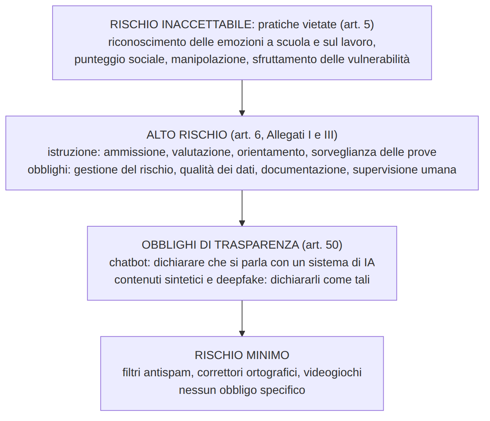
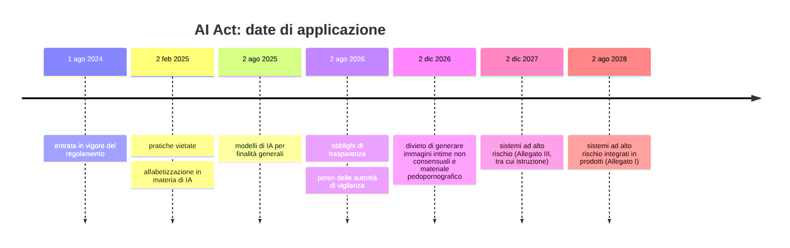
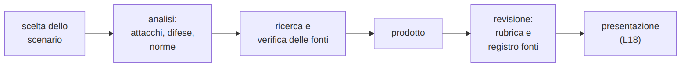

<!-- _class: titolo -->
<!-- _paginate: false -->

## Modulo 5 - Norme e progetto finale

B.4 - Cybersicurezza e IA

Lezioni L16, L17, L18

---

## L16 - Il quadro normativo: GDPR, AI Act, legge italiana, scuola

- le fonti in sintesi
- GDPR: aspetti operativi
- AI Act: livelli di rischio, istruzione, trasparenza, calendario
- legge italiana sull'IA
- linee guida per la scuola
- reati informatici

---

## Le fonti in sintesi

- **GDPR** (Reg. UE 2016/679): dati personali
- **AI Act** (Reg. UE 2024/1689): sistemi di IA, in base al rischio
- **Omnibus digitale sull'IA** (Reg. UE 2026/1744): rinvii, semplificazioni, nuovi divieti
- **legge 132/2025**: principi nazionali, minori, autorità, nuovi reati
- **Linee guida MIM** (DM 166/2025): IA nelle scuole
- **codice penale**: reati informatici

Un regolamento UE si applica direttamente in tutti gli Stati.

---

## GDPR: aspetti operativi

- **base giuridica** (art. 6): una scuola statale tratta i dati per un compito di interesse pubblico, non sul consenso
- **protezione fin dalla progettazione** e impostazioni protettive (art. 25)
- **valutazione d'impatto** (DPIA, art. 35) per trattamenti ad alto rischio, per esempio con minori e nuove tecnologie
- **violazione dei dati**: Garante entro **72 ore**; interessati se il rischio è elevato
- **consenso dei minori** ai servizi online: autonomo dai **14 anni**

---

## AI Act: livelli di rischio



---

## Alto rischio nell'istruzione (Allegato III, punto 3)

- **ammissione** agli istituti
- **valutazione** dei risultati dell'apprendimento
- **livello di istruzione** a cui una persona potrà accedere
- **sorveglianza delle prove**

Obblighi per chi fornisce: gestione del rischio, dati di qualità, documentazione, accuratezza, robustezza, **sicurezza informatica**, supervisione umana
Obblighi per chi usa (la scuola): uso secondo le istruzioni, supervisione di persone competenti, informazione agli interessati

---

## Trasparenza e alfabetizzazione

- **art. 50**: dichiarare l'interazione con un sistema di IA; marcare i contenuti sintetici; dichiarare i deepfake
- **art. 4**: misure di formazione sull'IA per il personale (reso meno rigido dall'Omnibus)
- sanzioni per le pratiche vietate: fino a **35 milioni di euro o 7%** del fatturato mondiale

---

## Calendario di applicazione



https://eur-lex.europa.eu/eli/reg/2024/1689/oj?locale=it
https://eur-lex.europa.eu/eli/reg/2026/1744/oj?locale=it

---

## Legge italiana sull'IA (legge 132/2025)

- in vigore dal **10 ottobre 2025**
- **minori di 14 anni**: accesso ai sistemi di IA solo con il consenso dei genitori (art. 4)
- autorità: **AgID** e **ACN** (vigilanza)
- **art. 612-quater c.p.**: diffusione senza consenso di contenuti falsificati con IA che causano un danno ingiusto; da 1 a 5 anni; d'ufficio se la vittima è minore
- aggravante per i reati commessi con l'IA come mezzo insidioso

https://www.gazzettaufficiale.it/eli/id/2025/09/25/25G00143/sg

---

## Linee guida per la scuola (DM 166/2025)

- principi: centralità della persona, equità, innovazione responsabile, supervisione umana, trasparenza
- fornitori con garanzie di sicurezza e protezione dei dati; GDPR artt. 5 e 25
- percorso in fasi: progetto condiviso, pianificazione sui rischi, attuazione e comunicazione, monitoraggio, valutazione
- ruolo del dirigente scolastico

---

## Reati informatici

- **art. 615-ter**: accesso abusivo, anche senza danni
- **art. 615-quater**: detenzione e diffusione di codici di accesso
- **art. 640-ter**: frode informatica
- **art. 612-quater**: contenuti falsificati con IA

Le tecniche del corso si sperimentano solo su materiali predisposti e con autorizzazione.

---

## Laboratorio L16

Notebook `L16_norme_in_pratica.ipynb`

1. (base, coppie) dieci sistemi di IA della scuola: classificazione a mano, poi con il codice
2. (standard) un sistema nuovo; un caso che il codice semplificato classifica male
3. (standard) violazione di dati: scadenza di notifica, dati sanitari
4. (approfondimento) età e uso autonomo dei servizi di IA

```python
if s.get("emozioni") and s.get("contesto") in ("scuola", "lavoro"):
    return "VIETATO", "art. 5: riconoscimento delle emozioni a scuola o sul lavoro"
```

---

## L17 - Progetto finale: preparazione

Gruppi di 3-4, uno scenario:

- **campagna di sensibilizzazione** sul phishing con IA per le classi prime
- **analisi dei rischi** di un chatbot di orientamento
- **regole sulle credenziali** per la scuola (NIST SP 800-63B-4)
- **esperimento documentato** con il classificatore del corso

In ogni progetto: tabella attacco-difesa, fonti verificate, ruoli nel gruppo

---

## Fasi del progetto



Uso dell'IA nel progetto: dichiarato, verificato, senza dati personali reali, senza messaggi di phishing rivolti a persone reali

---

## Tabella attacco-difesa

| Rischio | Chi e come | Danno (RID) | Difesa tecnica | Difesa procedurale | Norma |
|---|---|---|---|---|---|
| falso fornitore, cambio di IBAN | criminale; testo con IA, casella compromessa | pagamento sbagliato (integrità) | filtri, autenticazione del mittente | richiamata al numero noto, doppia approvazione | art. 640-ter c.p. |

---

## Laboratorio L17

Notebook `L17_registro_fonti.ipynb`, file `L17_fonti.csv`

1. (base) scenario, ruoli, indice del prodotto
2. (standard) tabella attacco-difesa, almeno quattro righe
3. (standard) registro delle fonti: errori nel registro di esempio, poi registro del gruppo
4. (approfondimento) fonti "altre": conferma su fonti istituzionali o scientifiche

---

## L18 - Presentazione e valutazione

- 5 minuti per gruppo, 2-3 minuti di domande
- scenario, due righe della tabella attacco-difesa, prodotto, una fonte utile
- valutazione tra pari con la rubrica (riscontro, non voto)

---

## Rubrica

| Criterio | 1 | 2 | 3 | 4 |
|---|---|---|---|---|
| Correttezza tecnica | errori di fondo | superficiale | applicata allo scenario | collegata, con limiti dichiarati |
| Attacco-difesa | mancante | generica | specifica | tecnica + procedurale + rischio residuo |
| Fonti e norme | assenti | poche, generiche | verificate, pertinenti | istituzionali, articoli precisi |
| Comunicazione | non adatta | disordinata | chiara | efficace, con verifica |
| Lavoro di gruppo | non individuabile | squilibrato | ruoli chiari | revisione reciproca |

---

## Conclusione del corso

- difese migliori: misure tecniche **e** procedure
- l'IA è **arma, scudo e bersaglio**
- i modelli seguono regolarità statistiche, non significati
- la **verifica attraverso un canale indipendente** resiste anche agli inganni perfetti
- si attacca solo per difendersi, e solo dove è autorizzato
