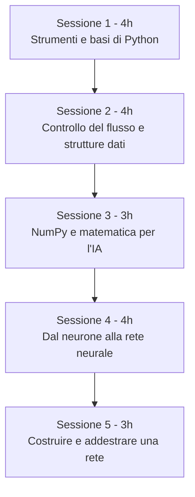
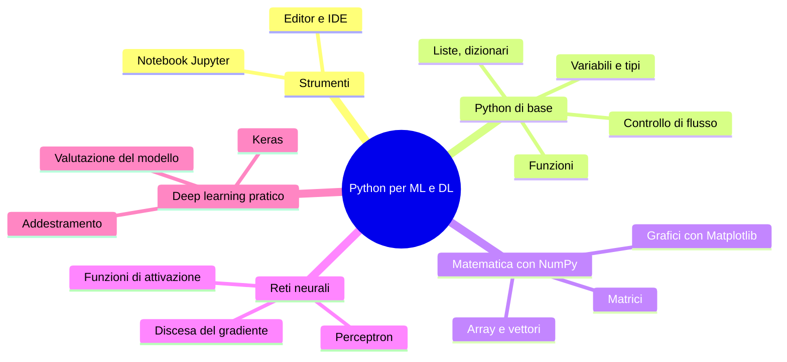

# Syllabus - B.8: Linguaggio Python per il Machine Learning ed il Deep Learning

## Nota di progettazione

Prima di entrare nel dettaglio, alcune scelte fatte in assenza di indicazioni più specifiche, così sono visibili e modificabili:

- come framework di deep learning è stato scelto Keras su TensorFlow, perché la sua sintassi ad alto livello è più adatta a un pubblico di 16-18 anni senza basi pregresse; PyTorch viene solo citato per completezza nella lezione 15.
- non viene trattato scikit-learn e il machine learning "classico" (regressione, alberi decisionali, eccetera), perché la descrizione del modulo B.8 parla esplicitamente di "basi matematiche e logiche delle reti neurali": il corso è quindi orientato a Python più NumPy più un primo contatto con le reti neurali, non a un corso generale di ML.
- gli esercizi che coinvolgono l'addestramento di una rete neurale (sessioni 4 e 5) usano dataset minuscoli (XOR, un sottoinsieme di poche centinaia di immagini MNIST, o dataset sintetici a 2 variabili) che si addestrano in pochi secondi su CPU, per rispettare il vincolo del laptop di fascia bassa.
- per lo stesso motivo, come ambiente di lavoro predefinito viene proposto Google Colab (gira nel browser, non richiede installazioni né una macchina potente); l'installazione locale con Jupyter viene comunque insegnata come alternativa, per chi vuole lavorare offline.

## Informazioni generali

| Voce | Valore |
|---|---|
| Codice incarico | B.8 |
| Titolo | Linguaggio Python per il Machine Learning ed il Deep Learning: Python per l'Intelligenza Artificiale |
| Destinatari | Studenti di 16-18 anni (laboratorio formativo sul campo, gruppi di almeno 5 unità) |
| Durata totale | 18 ore |
| Struttura proposta | 5 incontri (sessioni), ciascuno da 3 o 4 ore |
| Durata di ogni lezione | circa 1 ora (di cui 20-30 minuti di esercitazione pratica) |
| Tipo di lezione | lezpub (materiale destinato alla distribuzione agli studenti) |
| Ambiente principale | notebook Jupyter, preferibilmente via Google Colab |
| Requisito hardware | laptop di fascia bassa, nessuna GPU richiesta |

## Corsi open source di riferimento

Prima di scrivere il syllabus sono stati cercati corsi open source simili, per verificare se già esiste materiale riutilizzabile o da cui prendere ispirazione. I più pertinenti sono questi tre.

Microsoft AI for Beginners è un curriculum open source di 12 settimane e 24 lezioni che parte dai concetti classici di intelligenza artificiale e arriva alle reti neurali e al deep learning, con notebook Jupyter eseguibili sia in TensorFlow sia in PyTorch: https://github.com/microsoft/AI-For-Beginners. È la fonte più vicina nei contenuti (percettrone, reti neurali, framework di deep learning), anche se pensata per un pubblico più ampio e con un ritmo più lento del nostro.

Microsoft ML for Beginners è il curriculum "gemello" dedicato al machine learning classico con Scikit-learn, utile come riferimento se in futuro si volesse ampliare il corso in quella direzione: https://github.com/microsoft/ML-For-Beginners.

Intro to AI Course (Intro-Course-AI-ML/LessonMaterials) è un corso open source pensato originariamente per studenti delle scuole medie americane, strutturato in notebook Jupyter progressivi che vanno dai concetti di machine learning al deep learning con Keras: https://github.com/Intro-Course-AI-ML/LessonMaterials. È il riferimento più vicino per età del pubblico e per l'uso di Keras come prima libreria di deep learning.

Nessuno dei tre è tarato su 18 ore né segue esattamente la nostra scansione in lezioni da un'ora con editor/IDE e notebook Jupyter spiegati come lezioni dedicate, ma sono buone fonti da cui riprendere esempi, dataset e impostazione dei notebook.

## Obiettivi generali del corso

Al termine del corso lo studente dovrebbe essere in grado di leggere e scrivere programmi Python di base, di usare un notebook Jupyter in autonomia, di utilizzare NumPy per rappresentare vettori e matrici, e di capire, a livello concettuale e con un piccolo esempio funzionante, come è strutturata e come si addestra una semplice rete neurale.

## Struttura del corso





## Panoramica delle lezioni

| Sessione | Lezione | Titolo | Durata |
|---|---|---|---|
| 1 | 1 | Intelligenza artificiale, machine learning e perché Python | 1h |
| 1 | 2 | Editor e IDE gratuiti per programmare in Python | 1h |
| 1 | 3 | Cos'è un notebook Jupyter e come si usa | 1h |
| 1 | 4 | Primi passi con Python: variabili, tipi, operatori | 1h |
| 2 | 5 | Strutture di controllo: if/else, cicli for e while | 1h |
| 2 | 6 | Funzioni in Python | 1h |
| 2 | 7 | Strutture dati: liste e tuple | 1h |
| 2 | 8 | Strutture dati: dizionari e insiemi | 1h |
| 3 | 9 | Introduzione a NumPy: array e operazioni vettoriali | 1h |
| 3 | 10 | Algebra lineare essenziale con NumPy | 1h |
| 3 | 11 | Visualizzare i dati con Matplotlib | 1h |
| 4 | 12 | Dal neurone biologico al neurone artificiale: il perceptron | 1h |
| 4 | 13 | Funzioni di attivazione e reti neurali | 1h |
| 4 | 14 | Come impara una rete: intuizione sulla discesa del gradiente | 1h |
| 4 | 15 | Le librerie per il deep learning: TensorFlow/Keras e PyTorch | 1h |
| 5 | 16 | Costruire e addestrare la prima rete neurale con Keras | 1h |
| 5 | 17 | Valutare un modello: training set, test set, overfitting | 1h |
| 5 | 18 | Progetto finale guidato e riepilogo del corso | 1h |

## Dettaglio delle lezioni

### Sessione 1 - Strumenti e basi di Python (4 ore)

#### Lezione 1 - Intelligenza artificiale, machine learning e perché Python

Obiettivi: dare un quadro comune di cosa sono intelligenza artificiale, machine learning e deep learning, e di come si collocano l'uno rispetto all'altro; motivare la scelta di Python come linguaggio del corso.

Contenuti: differenza tra AI, ML e DL con esempi concreti familiari agli studenti (riconoscimento vocale, raccomandazioni video, filtri antispam); breve storia e stato dell'arte; perché Python è il linguaggio più usato in questo campo (leggibilità, librerie disponibili, comunità).

Diagramma previsto: un diagramma Mermaid a cerchi concentrici o a insiemi che mostra AI che contiene ML che contiene DL.

Esercizio (20-25 minuti): nessun codice ancora; attività di classificazione in piccoli gruppi di esempi reali di applicazioni AI/ML/DL viste dagli studenti nella vita quotidiana, da riportare su una tabella condivisa.

#### Lezione 2 - Editor e IDE gratuiti per programmare in Python

Obiettivi: conoscere le principali opzioni gratuite per scrivere ed eseguire codice Python, e scegliere quella più adatta al proprio laptop.

Contenuti: differenza tra editor di testo, IDE e ambiente cloud; rassegna di Visual Studio Code con estensione Python, PyCharm Community Edition, Thonny (pensato per principianti, molto leggero) e Google Colab (nessuna installazione, tutto nel browser). Per ciascuno: requisiti hardware, punti di forza, punti debol. Raccomandazione per laptop di fascia bassa: Google Colab come opzione principale, Thonny come alternativa offline più leggera.

Diagramma previsto: una tabella comparativa (già inclusa nei contenuti) più un diagramma Mermaid a albero decisionale "che strumento uso in base al mio laptop e alla connessione disponibile".

Esercizio (25-30 minuti): gli studenti aprono Google Colab con il proprio account, creano un notebook vuoto, scrivono ed eseguono la riga `print("Ciao mondo")`; chi vuole prova anche a installare Thonny in locale.

#### Lezione 3 - Cos'è un notebook Jupyter e come si usa

Obiettivi: capire cosa è un notebook Jupyter, come è organizzato in celle, e perché è lo strumento standard per programmare in ambito data science e machine learning.

Contenuti: cos'è un kernel; differenza tra cella di codice e cella di testo (Markdown); esecuzione delle celle in ordine e stato condiviso tra celle; salvataggio, esportazione, differenza tra Jupyter Notebook/JupyterLab installati in locale e Google Colab (che è un servizio che esegue notebook Jupyter nel cloud). Spiegazione dei comandi principali dell'interfaccia: eseguire una cella (Shift+Invio), aggiungere una cella (spiegando sia il tasto che l'icona corrispondente), cambiare tipo di cella da codice a testo.

Diagramma previsto: un diagramma di flusso Mermaid che mostra il ciclo cella scritta, cella eseguita dal kernel, risultato mostrato sotto la cella.

Esercizio (25 minuti): gli studenti creano un notebook con almeno tre celle di codice e due celle di testo, scrivono un breve titolo, una spiegazione e un piccolo calcolo, poi lo eseguono per intero con "esegui tutto".

#### Lezione 4 - Primi passi con Python: variabili, tipi, operatori

Obiettivi: scrivere le prime istruzioni Python, riconoscere i tipi di dato fondamentali e usare gli operatori aritmetici e di confronto.

Contenuti: variabili e assegnazione; tipi `int`, `float`, `str`, `bool`; conversione tra tipi con `int()`, `float()`, `str()`; operatori aritmetici (`+ - * / // % **`) e operatori di confronto (`== != < > <= >=`); la funzione `print()` e i suoi argomenti principali.

Esempio di codice commentato riga per riga:

```python
eta = 17          # variabile di tipo int
altezza = 1.72    # variabile di tipo float
nome = "Giulia"   # variabile di tipo str
maggiorenne = eta >= 18   # confronto, risultato di tipo bool

print(nome, "ha", eta, "anni ed è alta", altezza, "metri")
print("È maggiorenne?", maggiorenne)
```

Diagramma previsto: uno schema Mermaid dei tipi di dato fondamentali di Python, con una freccia di esempio di conversione da `str` a `int`.

Esercizio (25-30 minuti): completare un piccolo notebook guidato in cui lo studente calcola età, verifica se è maggiorenne, e calcola il proprio indice di massa corporea a partire da peso e altezza inseriti come variabili.

### Sessione 2 - Controllo del flusso e strutture dati (4 ore)

#### Lezione 5 - Strutture di controllo: if/else, cicli for e while

Obiettivi: far scegliere al programma un comportamento diverso in base a una condizione, e ripetere istruzioni con i cicli.

Contenuti: costrutto `if`, `elif`, `else`; indentazione come sintassi (non decorazione); ciclo `for` su una sequenza di numeri con `range()`; ciclo `while` con condizione di uscita; istruzioni `break` e `continue`.

Esempio di codice commentato:

```python
for i in range(5):        # range(5) genera i numeri da 0 a 4
    if i % 2 == 0:         # % è l'operatore resto della divisione
        print(i, "è pari")
    else:
        print(i, "è dispari")
```

Diagramma previsto: un diagramma di flusso Mermaid che rappresenta l'esecuzione di un `if/else` e, separatamente, di un ciclo `for`.

Esercizio (25-30 minuti): scrivere un piccolo programma che, dato un elenco di voti scolastici scritto a mano nel codice, conta quanti sono sufficienti e quanti insufficienti, usando un ciclo `for` e un `if`.

#### Lezione 6 - Funzioni in Python

Obiettivi: capire perché e come si scrivono le funzioni, per organizzare il codice ed evitare ripetizioni.

Contenuti: definizione di funzione con `def`; parametri e valori di default; istruzione `return`; differenza tra una funzione che stampa e una che restituisce un valore; ambito (scope) delle variabili locali.

Esempio di codice commentato:

```python
def area_rettangolo(base, altezza):
    # calcola e restituisce l'area di un rettangolo
    return base * altezza

risultato = area_rettangolo(4, 3)
print("L'area è", risultato)
```

Diagramma previsto: un diagramma Mermaid che mostra l'ingresso di parametri in una funzione e l'uscita del valore restituito, come una scatola con freccia di ingresso e freccia di uscita.

Esercizio (25-30 minuti): scrivere due o tre funzioni semplici (per esempio calcolo dell'area di un cerchio, conversione da gradi Celsius a Fahrenheit) e richiamarle con valori diversi.

#### Lezione 7 - Strutture dati: liste e tuple

Obiettivi: rappresentare collezioni di valori con liste e tuple, e saperle manipolare.

Contenuti: creazione di una lista; indicizzazione (compreso l'indice negativo); slicing; metodi principali (`append`, `remove`, `sort`, `len`); differenza tra lista (modificabile) e tupla (non modificabile) e quando preferire una o l'altra.

Esempio di codice commentato:

```python
voti = [6, 7, 5, 8, 9]     # lista di interi
voti.append(10)             # aggiunge 10 in fondo alla lista
media = sum(voti) / len(voti)   # sum() somma gli elementi, len() conta gli elementi
print("Media:", media)
```

Diagramma previsto: uno schema Mermaid di una lista come sequenza di caselle numerate a partire da 0, con indicizzazione negativa mostrata sotto.

Esercizio (25-30 minuti): dato un elenco di temperature registrate in una settimana, calcolare massimo, minimo e media usando le funzioni built-in e i metodi di lista.

#### Lezione 8 - Strutture dati: dizionari e insiemi

Obiettivi: rappresentare dati associativi con i dizionari e collezioni senza duplicati con gli insiemi.

Contenuti: creazione di un dizionario chiave-valore; accesso, aggiunta e modifica di una coppia; ciclo `for` su un dizionario con `.items()`; insiemi (`set`) e operazioni di unione e intersezione, con un parallelo intuitivo alla teoria degli insiemi già nota dalla matematica.

Esempio di codice commentato:

```python
alunno = {"nome": "Marco", "eta": 17, "materia_preferita": "informatica"}
print(alunno["nome"])          # accesso al valore tramite la chiave "nome"
alunno["eta"] = 18              # modifica del valore associato alla chiave "eta"

for chiave, valore in alunno.items():   # items() restituisce le coppie chiave-valore
    print(chiave, "->", valore)
```

Diagramma previsto: uno schema Mermaid a due colonne (chiave, valore) collegate da freccia, per visualizzare un dizionario.

Esercizio (25-30 minuti): costruire un piccolo dizionario che rappresenta una rubrica (nome come chiave, numero di telefono come valore) e scrivere codice per aggiungere, cercare e rimuovere un contatto.

### Sessione 3 - NumPy e matematica per l'IA (3 ore)

#### Lezione 9 - Introduzione a NumPy: array e operazioni vettoriali

Obiettivi: capire perché le reti neurali hanno bisogno di una libreria per calcolare con vettori e matrici in modo efficiente, e usare i primi comandi di NumPy.

Contenuti: limiti delle liste Python per il calcolo numerico; installazione/import di NumPy; creazione di array con `np.array()`; operazioni elemento per elemento (somma, prodotto, potenza) senza bisogno di cicli espliciti; forma (`shape`) di un array.

Esempio di codice commentato:

```python
import numpy as np              # np è l'alias convenzionale della libreria NumPy

voti = np.array([6, 7, 5, 8, 9])   # array() crea un array NumPy da una lista
voti_raddoppiati = voti * 2         # ogni elemento viene moltiplicato per 2
print(voti_raddoppiati)
print("Forma dell'array:", voti.shape)   # shape restituisce le dimensioni dell'array
```

Diagramma previsto: un diagramma Mermaid che confronta il ciclo esplicito su una lista con l'operazione vettoriale equivalente su un array NumPy.

Esercizio (25-30 minuti): dato un array di prezzi, calcolare prezzi con lo sconto del 10% e la somma totale, confrontando il codice con e senza NumPy.

#### Lezione 10 - Algebra lineare essenziale con NumPy

Obiettivi: introdurre vettori e matrici come li useremo nelle reti neurali, con il minimo di formalismo matematico necessario.

Contenuti: cos'è un vettore e cosa una matrice, in termini pratici; creazione di matrici con `np.array()` a due dimensioni; prodotto scalare (`np.dot`) tra due vettori come somma di prodotti; prodotto matriciale come applicazione ripetuta del prodotto scalare; perché questa operazione è al centro del funzionamento di una rete neurale (verrà ripreso nella lezione 12).

Esempio di codice commentato:

```python
pesi = np.array([0.5, -0.2, 0.1])     # un vettore di tre pesi
ingressi = np.array([2, 3, 1])        # un vettore di tre valori di ingresso

prodotto_scalare = np.dot(pesi, ingressi)   # dot() calcola la somma dei prodotti elemento per elemento
print("Prodotto scalare:", prodotto_scalare)
```

Diagramma previsto: uno schema Mermaid che mostra un vettore di pesi e un vettore di ingressi che si combinano nel prodotto scalare, con il risultato che diventa un singolo numero.

Esercizio (25 minuti): calcolare a mano su carta un piccolo prodotto scalare tra due vettori di tre numeri, poi verificare il risultato con `np.dot()`.

#### Lezione 11 - Visualizzare i dati con Matplotlib

Obiettivi: rappresentare graficamente dati numerici, competenza necessaria per interpretare l'andamento dell'addestramento di una rete nelle sessioni successive.

Contenuti: import di `matplotlib.pyplot`; grafico a linee con `plt.plot()`; grafico a punti con `plt.scatter()`; etichette degli assi e titolo del grafico; visualizzazione del grafico con `plt.show()`.

Esempio di codice commentato:

```python
import matplotlib.pyplot as plt   # plt è l'alias convenzionale del modulo pyplot

x = [1, 2, 3, 4, 5]
y = [2, 4, 5, 4, 5]

plt.plot(x, y)               # plot() disegna una linea che collega i punti (x, y)
plt.xlabel("Ora del giorno")
plt.ylabel("Temperatura")
plt.title("Andamento della temperatura")
plt.show()                   # show() mostra il grafico
```

Diagramma previsto: non serve un diagramma Mermaid in questa lezione, il grafico stesso prodotto dal codice ne fa le veci; eventualmente uno screenshot di esempio del grafico atteso.

Esercizio (25-30 minuti): a partire da un piccolo array NumPy di dati (per esempio le temperature della lezione 9), produrre un grafico a linee e uno a punti, personalizzando titolo ed etichette.

### Sessione 4 - Dal neurone alla rete neurale (4 ore)

#### Lezione 12 - Dal neurone biologico al neurone artificiale: il perceptron

Obiettivi: capire l'analogia (e i limiti dell'analogia) tra neurone biologico e neurone artificiale, e come funziona il primo modello storico di neurone artificiale, il perceptron.

Contenuti: breve richiamo illustrativo del neurone biologico; il perceptron come somma pesata degli ingressi più bias, seguita da una soglia di decisione; collegamento diretto con il prodotto scalare visto nella lezione 10; limiti storici del perceptron (problema XOR) come motivazione per le reti neurali a più livelli che vedremo nella lezione successiva.

Esempio di codice commentato:

```python
import numpy as np

def perceptron(ingressi, pesi, bias):
    somma = np.dot(ingressi, pesi) + bias   # dot() somma i prodotti, poi si aggiunge il bias
    return 1 if somma > 0 else 0             # soglia di decisione a zero

ingressi = np.array([1, 0])
pesi = np.array([0.6, 0.6])
print(perceptron(ingressi, pesi, bias=-0.5))
```

Diagramma previsto: un diagramma Mermaid del perceptron con gli ingressi, i pesi sulle freccette, la somma e la funzione a soglia in uscita.

Esercizio (25-30 minuti): far variare a mano i pesi e il bias del perceptron dell'esempio per implementare la funzione logica AND e poi la funzione OR, osservando cosa cambia.

#### Lezione 13 - Funzioni di attivazione e reti neurali

Obiettivi: superare i limiti del perceptron introducendo funzioni di attivazione non lineari e l'idea di rete organizzata a strati.

Contenuti: perché una soglia netta (0 o 1) è limitante; le funzioni di attivazione più comuni (sigmoide, ReLU) e cosa rappresentano graficamente; concetto di strato di ingresso, strato nascosto e strato di uscita; come più neuroni collegati in strati formano una rete neurale.

Esempio di codice commentato:

```python
import numpy as np

def sigmoide(x):
    return 1 / (1 + np.exp(-x))   # exp() calcola l'esponenziale, base del numero di Napier

valori = np.array([-2, -1, 0, 1, 2])
print(sigmoide(valori))
```

Diagramma previsto: un diagramma Mermaid a strati (ingresso, nascosto, uscita) con i collegamenti tra i neuroni, e a parte il grafico della funzione sigmoide realizzato con Matplotlib.

Esercizio (25-30 minuti): calcolare e disegnare con Matplotlib (richiamando la lezione 11) il grafico della funzione sigmoide e della funzione ReLU su un intervallo di valori.

#### Lezione 14 - Come impara una rete: intuizione sulla discesa del gradiente

Obiettivi: capire, a livello intuitivo e senza il formalismo completo del calcolo differenziale, come una rete neurale modifica i propri pesi per migliorare le proprie previsioni.

Contenuti: concetto di errore (o funzione di costo) tra previsione e valore corretto; l'idea della discesa del gradiente come "scendere lungo la pendenza" di una funzione di errore per trovare il punto più basso, con un'analogia grafica; il ciclo previsione, calcolo dell'errore, aggiornamento dei pesi, ripetuto molte volte (le "epoche" di addestramento).

Diagramma previsto: un diagramma Mermaid che rappresenta il ciclo previsione-errore-aggiornamento come un anello (loop), più un grafico Matplotlib di una curva a forma di valle con un punto che scende verso il minimo, disegnato passo per passo.

Esercizio (20-25 minuti): con un piccolo script guidato che simula pochi passi di discesa del gradiente su una funzione di errore semplice a una sola variabile, gli studenti osservano come il valore si avvicina al minimo a ogni iterazione, modificando il tasso di apprendimento e osservando l'effetto.

#### Lezione 15 - Le librerie per il deep learning: TensorFlow/Keras e PyTorch

Obiettivi: conoscere gli strumenti professionali che permettono di costruire e addestrare reti neurali senza scrivere da zero le formule matematiche viste nelle lezioni precedenti.

Contenuti: perché esistono librerie dedicate; panoramica di TensorFlow e della sua interfaccia semplificata Keras; breve cenno a PyTorch come alternativa molto diffusa nella ricerca; installazione (o verifica della disponibilità, dato che Google Colab le include già) delle librerie che verranno usate nella sessione 5.

Diagramma previsto: un diagramma Mermaid che posiziona NumPy, Keras/TensorFlow e PyTorch su livelli di abstrazione crescente, dal calcolo numerico di base agli strumenti pronti per il deep learning.

Esercizio (20-25 minuti): su Google Colab, verificare che TensorFlow/Keras sia disponibile con `import tensorflow as tf` e `print(tf.__version__)`, e osservare la documentazione ufficiale di un livello Keras (`tf.keras.layers.Dense`) per prepararsi alla lezione 16.

### Sessione 5 - Costruire e addestrare una rete (3 ore)

#### Lezione 16 - Costruire e addestrare la prima rete neurale con Keras

Obiettivi: costruire e addestrare, con poche righe di codice, una piccola rete neurale in grado di risolvere un problema semplice ma non lineare.

Contenuti: struttura minima di un modello Keras sequenziale; aggiunta di strati con `Dense`; compilazione del modello (scelta di funzione di errore e ottimizzatore, collegando questi concetti a quanto visto nella lezione 14); addestramento con `fit()` sul problema XOR, scelto apposta perché richiede pochissima potenza di calcolo e pochi secondi di addestramento.

Esempio di codice commentato:

```python
import numpy as np
import tensorflow as tf

# il problema XOR: quattro esempi di ingresso e la risposta corretta attesa
ingressi = np.array([[0,0], [0,1], [1,0], [1,1]])
uscite = np.array([0, 1, 1, 0])

modello = tf.keras.Sequential([
    tf.keras.layers.Dense(4, activation="relu", input_shape=(2,)),  # Dense crea uno strato di neuroni completamente collegati
    tf.keras.layers.Dense(1, activation="sigmoid")                   # activation imposta la funzione di attivazione dello strato
])

modello.compile(optimizer="adam", loss="binary_crossentropy")  # optimizer indica come aggiornare i pesi, loss come misurare l'errore
modello.fit(ingressi, uscite, epochs=200, verbose=0)             # epochs indica quante volte la rete ripassa tutti gli esempi

print(modello.predict(ingressi))
```

Diagramma previsto: un diagramma Mermaid della rete usata nell'esempio, con due ingressi, quattro neuroni nello strato nascosto e un neurone di uscita.

Esercizio (30 minuti): eseguire il codice guidato su Google Colab, poi modificare il numero di neuroni nello strato nascosto e il numero di epoche, osservando l'effetto sul risultato finale.

#### Lezione 17 - Valutare un modello: training set, test set, overfitting

Obiettivi: capire perché non basta che un modello funzioni bene sugli esempi già visti, e introdurre i concetti fondamentali per valutare un modello in modo corretto.

Contenuti: perché si separano i dati in insieme di addestramento (training set) e insieme di verifica (test set); il concetto di overfitting con un'analogia semplice (uno studente che ha imparato le risposte a memoria invece di aver capito l'argomento); metriche semplici di valutazione (accuratezza) su un problema di classificazione leggero, ad esempio un piccolo sottoinsieme del dataset MNIST (poche centinaia di immagini, non l'intero dataset, per restare compatibili con laptop di fascia bassa).

Diagramma previsto: un diagramma Mermaid che mostra la separazione dei dati in training set e test set, e un grafico Matplotlib che confronta l'andamento dell'errore su training set e test set durante l'addestramento, come illustrazione visiva dell'overfitting.

Esercizio (25-30 minuti): addestrare il piccolo modello Keras su un sottoinsieme di dati fornito dal docente, valutarne l'accuratezza sia sul training set sia sul test set, e discutere in coppia se e quanto il modello ha generalizzato bene.

#### Lezione 18 - Progetto finale guidato e riepilogo del corso

Obiettivi: consolidare in un piccolo progetto autonomo i concetti visti nelle 17 lezioni precedenti, e fare il punto su cosa si è imparato e su come proseguire.

Contenuti: presentazione di due o tre possibili mini-progetti a scelta (per esempio: classificare piccoli numeri scritti a mano con un sottoinsieme di MNIST, oppure risolvere con una piccola rete un secondo problema logico oltre allo XOR); lavoro guidato degli studenti sul progetto scelto; riepilogo visuale di tutto il percorso del corso; indicazioni su risorse gratuite per continuare ad approfondire (tra cui i corsi open source citati in apertura di questo syllabus).

Diagramma previsto: una versione arricchita del mindmap iniziale del corso, con accanto a ogni ramo un'icona o una nota su "cosa sappiamo fare adesso" che non sapevamo fare all'inizio.

Esercizio (30-35 minuti, l'intera parte pratica della lezione): sviluppo autonomo o in piccoli gruppi del mini-progetto scelto, con il docente e il tutor che girano tra i gruppi per assistenza puntuale.

## Note tecniche per la stesura del materiale (lezioni vere e proprie)

Queste indicazioni riguardano la fase successiva, quando dal syllabus si passerà a scrivere il markdown di ogni singola lezione, e sono qui solo come riferimento per quella fase.

Per la compatibilità simultanea con anteprima standard di VS Code, pandoc (verso PDF, DOCX, PPTX) ed eventualmente reveal.js, la scelta più robusta è: usare intestazioni di livello 1 (`#`) per il titolo della lezione, intestazioni di livello 2 (`##`) per ogni sezione che deve diventare una diapositiva (in coerenza con la convenzione MARP già in uso), evitare tabelle troppo larghe o codice con righe molto lunghe che non si adattino a uno slide 16:9, e inserire un'interruzione di pagina esplicita prima delle sezioni pensate per il formato A4, con il commento HTML standard di pandoc `<!-- \newpage -->` per l'export in PDF/DOCX oppure l'equivalente riconosciuto da reveal.js per iniziare una nuova diapositiva. Ogni lezione dovrebbe avere un proprio file, con un front matter YAML minimo (titolo, autore, data) che pandoc userà per generare automaticamente la copertina in PDF/DOCX/PPTX.

## Riepilogo del monte ore

| Sessione | Ore | Lezioni |
|---|---|---|
| 1 | 4 | 4 |
| 2 | 4 | 4 |
| 3 | 3 | 3 |
| 4 | 4 | 4 |
| 5 | 3 | 3 |
| **Totale** | **18** | **18** |
