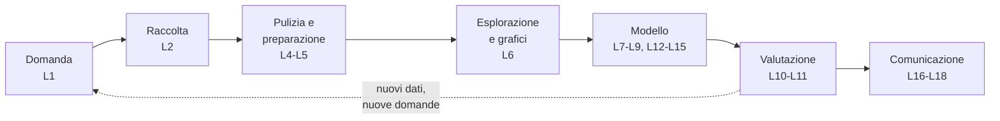
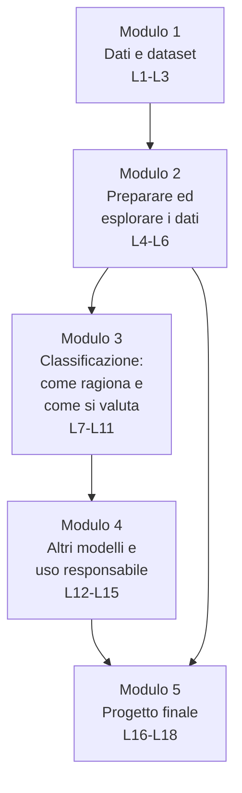

# B.6 - Data science e Machine Learning: dai dati ai modelli

## Scheda del corso

- Titolo: Data science e Machine Learning: dai dati ai modelli
- Tipo: corso introduttivo e laboratoriale di data science e apprendimento automatico
- Durata: 18 ore, articolate in 18 lezioni autonome di circa un'ora, raggruppabili in sessioni da 2, 3 o 4 ore
- Destinatari della traccia studenti: studenti di scuola secondaria di secondo grado, 16-18 anni
- Destinatari della traccia docenti: docenti che progettano e conducono il corso con la propria classe
- Prerequisiti di programmazione: nessuno. I notebook Python sono forniti già scritti e commentati; gli studenti eseguono le celle, modificano parametri e completano righe di codice guidate. Chi ha frequentato il corso B.8 svolge gli esercizi di approfondimento
- Prerequisiti di matematica: percentuali, media aritmetica, piano cartesiano, retta; il teorema di Pitagora per la distanza tra due punti. Mediana, quartili, deviazione standard e correlazione vengono introdotti nel corso

## Obiettivi

Al termine del corso lo studente è in grado di:

- descrivere il ciclo di lavoro della data science, dalla domanda alla comunicazione dei risultati
- distinguere tipi di dati (qualitativi e quantitativi, discreti e continui) e riconoscere la struttura di un dataset tabellare: osservazioni, variabili, caratteristiche (feature), etichetta
- progettare e svolgere la raccolta di un piccolo dataset, con un dizionario dei dati, attenzione alla qualità, alle distorsioni del campione, alla riservatezza e alle licenze
- trovare e valutare dataset aperti (open data)
- caricare, esplorare, pulire e riassumere un dataset con pandas in un notebook Jupyter
- rappresentare i dati con istogrammi, diagrammi a scatola (boxplot) e grafici a dispersione, e interpretarli
- spiegare come "ragiona" un classificatore: regole scritte a mano, k vicini più prossimi (k-NN), albero di decisione, confine di decisione
- addestrare un classificatore con scikit-learn, valutarlo su dati non visti con accuratezza, matrice di confusione, precisione e richiamo, e confrontarlo con un modello di riferimento (baseline)
- riconoscere sovradattamento (overfitting) e sottoadattamento (underfitting)
- addestrare un modello di regressione lineare e interpretarne l'errore
- addestrare un classificatore di immagini senza codice e analizzarne i limiti dovuti ai dati
- descrivere l'apprendimento non supervisionato con l'esempio del raggruppamento k-means
- riconoscere distorsioni (bias), scorciatoie apprese e fughe di informazione (data leakage), e valutare l'uso responsabile di un modello

## Filo conduttore: dai dati al modello

Ogni lezione corrisponde a una fase del ciclo di lavoro della data science. Il ciclo viene percorso tre volte con dati di complessità crescente:

- dataset di riferimento: Palmer Penguins, 344 pinguini di tre specie misurati in Antartide; dati reali, puliti quasi del tutto, rilasciati con licenza CC0 (moduli 2-4)
- dataset della classe: tragitti casa-scuola raccolti dagli studenti con un questionario anonimo; dati propri, imperfetti, da pulire (moduli 1, 2 e 5)
- dataset di immagini raccolto con la webcam (L13)

Diagramma: il ciclo della data science e le lezioni che lo trattano

Il classificatore dei pinguini viene costruito più volte: prima come regola scritta a mano dagli studenti (L7), poi come k-NN (L8) e come albero di decisione (L9), infine valutato e confrontato correttamente (L10-L11). Gli studenti vedono così che cosa cambia tra una regola decisa da una persona e una regola ricavata dai dati.

## Ambiente di lavoro e vincoli tecnici

Tutti i laboratori sono eseguibili su PC di fascia bassa. Nessun laboratorio richiede privilegi di amministratore; per ogni attività sono previste una modalità offline e, dove utile, una modalità online.

| Strumento | Tipo | Installazione | Uso nel corso |
|---|---|---|---|
| LibreOffice Calc (anche Portable) | foglio di calcolo | già presente o versione portable da chiavetta | L1, L2: primo contatto con un CSV, filtri, ordinamenti |
| JupyterLite (Try Jupyter) | JupyterLab nel browser, Python eseguito localmente tramite WebAssembly | nessuna, solo browser | tutti i notebook del corso |
| WinPython | distribuzione Python portable per Windows con JupyterLab, pandas, scikit-learn | nessuna: si scompatta, anche su chiavetta | alternativa offline completa per i notebook |
| Google Colab | notebook Jupyter su server remoto | nessuna, richiede account Google e connessione | alternativa online, usata solo se l'istituto la abilita |
| Teachable Machine | addestramento di classificatori di immagini nel browser, senza codice | nessuna, solo browser e webcam | L13 |
| Moduli online (Google Moduli, Microsoft Forms) o scheda cartacea | raccolta di risposte | nessuna | L2: questionario della classe |

Riferimenti:

- LibreOffice Portable: https://portableapps.com/apps/office/libreoffice_portable
- Try Jupyter (JupyterLite): https://jupyter.org/try-jupyter/lab/
- WinPython: https://winpython.github.io/
- Google Colab, domande frequenti: https://research.google.com/colaboratory/faq.html
- Teachable Machine: https://teachablemachine.withgoogle.com/
- Palmer Penguins: https://allisonhorst.github.io/palmerpenguins/

Tutti i notebook sono forniti come file `.ipynb` locali, apribili in JupyterLite, in WinPython e in Colab, e usano solo librerie presenti in tutti e tre: pandas, NumPy, matplotlib, scikit-learn. I dataset sono file CSV forniti con il corso.

## Struttura in moduli

Diagramma: moduli e dipendenze

| Modulo | Lezioni | Ore | Contenuto |
|---|---|---|---|
| 1. Dati e dataset | L1-L3 | 3 | data science, tipi di dati, raccolta di un dataset, notebook e pandas |
| 2. Preparare ed esplorare i dati | L4-L6 | 3 | statistica descrittiva, pulizia, visualizzazione esplorativa |
| 3. Classificazione | L7-L11 | 5 | regole, k-NN, alberi di decisione, addestramento e verifica, metriche, sovradattamento |
| 4. Altri modelli e uso responsabile | L12-L15 | 4 | regressione, immagini senza codice, bias e scorciatoie, k-means |
| 5. Progetto finale | L16-L18 | 3 | progetto a gruppi sull'intero ciclo, presentazione, valutazione |

## Programma delle lezioni

Ogni lezione dura circa un'ora ed è composta da una parte di spiegazione con dimostrazione dal vivo e da una parte di laboratorio (indicata tra parentesi). Le indicazioni "Traccia docenti" identificano i contenuti di progettazione didattica collegati alla lezione, trattati nei file `_docente.md`.

### Modulo 1 - Dati e dataset

#### L1 - Che cos'è la data science: dati, variabili, dataset

Contenuti:

- data science, statistica, apprendimento automatico (machine learning), intelligenza artificiale: relazioni tra i termini
- esempi di applicazioni: previsioni meteo, raccomandazioni, diagnosi assistita, filtri antispam
- dato, informazione, conoscenza
- dataset tabellare: righe come osservazioni, colonne come variabili; unità di osservazione
- tipi di variabili: qualitative (nominali, ordinali) e quantitative (discrete, continue); unità di misura
- caratteristiche (feature) ed etichetta (target) in vista dei modelli
- formato CSV: separatore, intestazione, codifica dei caratteri; separatore decimale e differenze tra impostazioni italiane e inglesi
- il ciclo della data science

Laboratorio (25 min): apertura di `pinguini.csv` in LibreOffice Calc; classificazione delle colonne per tipo; filtri e ordinamenti; conteggio dei valori mancanti; formulazione di tre domande a cui i dati possono rispondere e di una a cui non possono rispondere.

#### L2 - Raccogliere un dataset

Contenuti:

- dalla domanda ai dati: quali variabili servono, a quale livello di dettaglio
- fonti: misure dirette e sensori, questionari, registri e archivi, dati aperti, dati raccolti dal web
- popolazione e campione; distorsione del campione (bias di selezione); dimensione del campione
- qualità dei dati: accuratezza, completezza, coerenza, attualità; errori di misura e di trascrizione
- progettazione di un questionario: domande chiuse e aperte, valori ammessi, unità di misura
- dizionario dei dati (metadati): nome, descrizione, tipo, unità, valori ammessi
- riservatezza: dati personali, minimizzazione, anonimato; perché il questionario della classe non raccoglie nomi né dati sensibili
- licenze dei dati: pubblico dominio (CC0), CC BY; dati aperti italiani (dati.gov.it) e repository di dataset (Kaggle, UCI)

Laboratorio (30 min): progettazione collettiva del questionario "tragitti casa-scuola" (distanza, tempo, mezzo, orario di partenza, anno di corso) con dizionario dei dati; compilazione anonima; ricerca e valutazione di un dataset su dati.gov.it (fonte, licenza, aggiornamento, variabili).

Riferimenti:

- Portale dei dati aperti della pubblica amministrazione: https://www.dati.gov.it/
- UCI Machine Learning Repository: https://archive.ics.uci.edu/

#### L3 - Notebook Jupyter e primi passi con pandas

Contenuti:

- notebook: celle di codice e celle di testo (Markdown), output, kernel, ordine di esecuzione
- tre modi di eseguire un notebook: nel browser (JupyterLite), da chiavetta (WinPython), su server remoto (Colab)
- Python quanto basta: istruzione, variabile, funzione, metodo, commento, `import`
- libreria pandas: `DataFrame` e `Series`
- `pd.read_csv`, `head`, `tail`, `shape`, `columns`, `dtypes`, `info`
- selezione di colonne e di righe (`df["colonna"]`, `df[condizione]`), conteggio dei valori (`value_counts`)

Laboratorio (30 min): caricamento dei pinguini in JupyterLite; ispezione del dataset; filtri (pinguini di un'isola, pinguini con massa superiore a una soglia); conteggi per specie e isola; caricamento del CSV del questionario della classe.

Traccia docenti: notebook come strumento didattico; confronto JupyterLite, WinPython, Colab; Kaggle come risorsa per il docente; distribuzione e raccolta dei notebook.

### Modulo 2 - Preparare ed esplorare i dati

#### L4 - Riassumere i dati: statistica descrittiva con pandas

Contenuti:

- distribuzione di una variabile
- misure di posizione: media, mediana, moda; effetto dei valori estremi sulla media
- misure di dispersione: intervallo, quartili, scarto interquartile, deviazione standard
- `describe`, `mean`, `median`, `std`, `min`, `max`, `quantile`
- raggruppamento: `groupby` con una e due variabili; tabelle di frequenza e tabelle a doppia entrata (`crosstab`)
- ordinamento (`sort_values`)

Laboratorio (30 min): statistiche per specie e per sesso dei pinguini; individuazione della variabile che separa meglio le specie osservando le medie; confronto tra media e mediana del tempo di tragitto della classe.

#### L5 - Pulire i dati

Contenuti:

- problemi tipici: valori mancanti, duplicati, errori di battitura, unità incoerenti, valori impossibili, formati diversi per lo stesso dato
- valori mancanti: `isna`, `dropna`, `fillna`; eliminare o sostituire e con quali conseguenze
- duplicati: `duplicated`, `drop_duplicates`
- testo: uniformare maiuscole, spazi, varianti (`str.lower`, `str.strip`, `replace`)
- conversione di tipo (`astype`, `pd.to_numeric`); separatore decimale
- valori anomali (outlier): errori o casi reali? criteri basati sui quartili
- tracciabilità: il dataset originale non si modifica, si documentano le trasformazioni

Laboratorio (30 min): pulizia del dataset dei tragitti (fornito anche in versione di esempio con errori inseriti): mezzi scritti in modi diversi, tempi con unità diverse, righe duplicate, valori impossibili; registro delle operazioni svolte.

Traccia docenti: progettare dataset didattici "sporchi" con errori calibrati; perché i dati raccolti dalla classe insegnano più dei dataset puliti.

#### L6 - Esplorare i dati con i grafici

Contenuti:

- scelta del grafico in base al tipo di variabile e alla domanda
- grafico a barre per variabili qualitative
- istogramma: intervalli (classi), forma della distribuzione, effetto del numero di intervalli
- diagramma a scatola (boxplot): mediana, quartili, baffi, outlier; confronto tra gruppi
- grafico a dispersione (scatter plot) tra due variabili quantitative, colorato per gruppo
- matrice dei grafici a dispersione
- correlazione: coefficiente di Pearson in forma intuitiva; correlazione e causalità
- grafici fuorvianti: assi troncati, scale non omogenee

Laboratorio (30 min): istogrammi e boxplot delle misure dei pinguini per specie; grafico a dispersione lunghezza del becco e lunghezza della pinna colorato per specie; ipotesi su quali coppie di variabili separano le specie; grafici del dataset dei tragitti.

### Modulo 3 - Classificazione: come ragiona e come si valuta

#### L7 - Il problema della classificazione e le regole scritte a mano

Contenuti:

- apprendimento supervisionato e non supervisionato
- classificazione e regressione
- esempio, caratteristiche, etichetta, classe, previsione
- classificatore a regole: regole del tipo "se la pinna è più lunga di 206 mm allora Gentoo"
- confine di decisione nel piano di due caratteristiche
- accuratezza come prima misura della qualità
- limiti delle regole scritte a mano e idea di ricavare le regole dai dati

Laboratorio (30 min): attività senza computer su schede con misure di pinguini: ogni gruppo scrive un sistema di regole per riconoscere le specie; verifica delle regole nel notebook sull'intero dataset; disegno del confine di decisione delle proprie regole.

#### L8 - Il classificatore k-NN: decidere guardando i vicini

Contenuti:

- idea: un nuovo esempio riceve la classe degli esempi più simili
- distanza euclidea tra due punti in due e più dimensioni
- il parametro k; voto a maggioranza; parità
- effetto della scala delle caratteristiche sulla distanza; normalizzazione e standardizzazione
- scikit-learn: stimatore, `fit`, `predict`, `KNeighborsClassifier`
- confine di decisione del k-NN al variare di k

Laboratorio (30 min): k-NN svolto a mano su sei punti; stessa previsione con scikit-learn; confini di decisione per k = 1, 5, 25; effetto della standardizzazione con massa in grammi e becco in millimetri.

Riferimento: scikit-learn, Getting Started: https://scikit-learn.org/stable/getting_started.html

#### L9 - L'albero di decisione: le regole imparate dai dati

Contenuti:

- albero di decisione: nodi, domande sì/no su una caratteristica, foglie con la classe
- come l'algoritmo sceglie la domanda: impurità di Gini in forma intuitiva, confronto tra divisioni possibili
- profondità dell'albero e numero minimo di esempi per foglia
- lettura e interpretazione dell'albero addestrato (`plot_tree`, `export_text`)
- confronto con le regole scritte a mano in L7
- importanza delle caratteristiche
- modelli interpretabili e modelli "a scatola nera"

Laboratorio (30 min): calcolo a mano dell'impurità di Gini per due divisioni candidate; addestramento di `DecisionTreeClassifier`; lettura dell'albero e confronto con le regole della propria scheda di L7; alberi di profondità 1, 2, 3.

Traccia docenti: attività senza computer (unplugged) come introduzione agli algoritmi; gestione dei gruppi; uso dell'errore dello studente per introdurre il concetto successivo.

#### L10 - Addestrare e valutare un modello

Contenuti:

- perché non si valuta un modello sugli stessi dati con cui è stato addestrato
- insieme di addestramento e insieme di verifica (test); `train_test_split`, stratificazione, seme casuale
- modello di riferimento (baseline): la classe più frequente (`DummyClassifier`)
- matrice di confusione
- accuratezza, precisione, richiamo; quando l'accuratezza inganna (classi sbilanciate)
- confronto corretto tra k-NN e albero di decisione

Laboratorio (30 min): addestramento e verifica di k-NN e albero sui pinguini; matrice di confusione; confronto con la baseline; caso sbilanciato (riconoscere una specie rara) e differenza tra accuratezza e richiamo.

#### L11 - Sovradattamento e generalizzazione

Contenuti:

- generalizzazione: prestazioni su dati mai visti
- sottoadattamento (underfitting) e sovradattamento (overfitting); un modello che "impara a memoria"
- curve di accuratezza su addestramento e verifica al variare della complessità (profondità dell'albero, k)
- variabilità del risultato con suddivisioni diverse; validazione incrociata (cross-validation) in forma introduttiva
- iperparametri e loro scelta; perché l'insieme di verifica non si usa per scegliere
- più dati o modello più semplice

Laboratorio (30 min): curve addestramento-verifica per la profondità dell'albero e per k; ripetizione con dieci semi diversi; validazione incrociata a 5 blocchi (`cross_val_score`); scelta motivata degli iperparametri.

Traccia docenti: valutazione del lavoro di laboratorio; errori concettuali frequenti (valutare sui dati di addestramento, confondere accuratezza e qualità); uso delle visualizzazioni interattive online.

### Modulo 4 - Altri modelli e uso responsabile

#### L12 - Prevedere un numero: la regressione lineare

Contenuti:

- regressione: la previsione è un numero
- retta di regressione: pendenza e intercetta e loro significato
- residuo; errore assoluto medio (MAE) e radice dell'errore quadratico medio (RMSE) in forma intuitiva
- `LinearRegression`: addestramento, coefficienti, previsione
- regressione con più caratteristiche e con una variabile qualitativa codificata (codifica one-hot)
- estrapolazione: previsioni fuori dall'intervallo dei dati
- come la retta viene trovata: rimando al corso B.8 (discesa del gradiente)

Laboratorio (30 min): previsione della massa di un pinguino dalla lunghezza della pinna; grafico dei punti, della retta e dei residui; aggiunta della specie come caratteristica e confronto del MAE; previsione del tempo di tragitto dalla distanza nei dati della classe.

#### L13 - Classificare immagini senza scrivere codice

Contenuti:

- un'immagine come tabella di numeri: pixel, canali di colore
- perché per le immagini non si usano caratteristiche scritte a mano: reti neurali e caratteristiche apprese (cenni, approfonditi in B.8)
- apprendimento per trasferimento (transfer learning): riuso di un modello già addestrato
- Teachable Machine: classi, raccolta di esempi con la webcam, addestramento, anteprima, esportazione
- raccolta di un dataset di immagini: varietà, bilanciamento, sfondo e illuminazione
- scorciatoie: il modello impara lo sfondo invece dell'oggetto

Laboratorio (30 min): classificatore di tre oggetti con Teachable Machine; prova con condizioni diverse (sfondo, luce, persona); raccolta di un secondo dataset più vario e confronto; alternativa offline: k-NN sulle cifre scritte a mano 8x8 incluse in scikit-learn.

Traccia docenti: strumenti di IA senza codice nella didattica; condizioni d'uso con studenti minorenni e dati delle immagini; alternative quando la webcam o la rete non sono disponibili.

#### L14 - Bias, scorciatoie e uso responsabile dei modelli

Contenuti:

- bias nei dati: campione non rappresentativo, etichette distorte, dati storici che riflettono discriminazioni
- casi reali: sistemi di selezione del personale e di valutazione del rischio; riconoscimento facciale con errori diversi per gruppi diversi
- scorciatoie apprese (shortcut learning)
- fuga di informazione (data leakage): una caratteristica che contiene la risposta
- prestazioni diverse per gruppi diversi: valutare separatamente per sottogruppo
- persone coinvolte nelle decisioni; trasparenza; sistemi ad alto rischio nell'istruzione secondo l'AI Act (cenno, trattato in B.4)
- scheda di un modello e di un dataset (model card, datasheet)

Laboratorio (30 min): notebook con un dataset sintetico di ammissione a un corso con distorsione inserita: addestramento, accuratezza complessiva e per gruppo, individuazione della causa nei dati; esempio di data leakage con prestazioni "troppo buone"; compilazione di una scheda essenziale del modello dei pinguini.

Traccia docenti: come trattare casi reali di discriminazione in classe; collegamenti con i corsi B.2 e B.4.

#### L15 - Apprendimento non supervisionato: raggruppare i dati

Contenuti:

- dati senza etichetta: trovare gruppi (clustering)
- algoritmo k-means: centroidi, assegnazione al centroide più vicino, aggiornamento, ripetizione
- scelta di k: metodo del gomito in forma intuitiva
- confronto tra gruppi trovati e specie reali dei pinguini
- applicazioni: segmentazione, riduzione dei colori di un'immagine, anomalie
- quando usare apprendimento supervisionato e non supervisionato

Laboratorio (30 min): k-means svolto a mano per due iterazioni su pochi punti; `KMeans` sui pinguini senza specie e confronto con le specie; effetto della standardizzazione; metodo del gomito; riduzione a k colori di un'immagine.

### Modulo 5 - Progetto finale

#### L16 - Progetto: domanda, dati, preparazione

Parte studenti (55 min): progetto a gruppi sull'intero ciclo. Ogni gruppo sceglie uno scenario:

- dataset della classe: prevedere il mezzo di trasporto o il tempo di tragitto
- dataset aperto scelto dal gruppo tra quelli proposti (dati.gov.it, UCI), con licenza verificata
- dataset di immagini raccolto con Teachable Machine, con analisi delle scorciatoie

Fasi di L16: domanda, dizionario dei dati, pulizia, esplorazione con almeno tre grafici commentati.

#### L17 - Progetto: modello, valutazione, conclusioni

Parte studenti (55 min): baseline, almeno due modelli, valutazione su dati di verifica, analisi degli errori, limiti e bias possibili, conclusioni; preparazione di una presentazione di 5 minuti in un notebook con celle Markdown o in slide.

#### L18 - Presentazione, valutazione, progettazione didattica

Parte studenti (35 min): presentazione dei progetti e domande tra gruppi.

Parte docenti (25 min): rubrica di valutazione; adattamento del corso ad altri monte ore; collegamenti con i corsi B.4 e B.8; riuso dei materiali in altre discipline.

## Materiali prodotti per ciascun argomento

Per ogni modulo vengono prodotti:

- `B6_Mn_<argomento>_lezione.md`: testo delle lezioni (formato A4)
- `B6_Mn_<argomento>_marp.md`: presentazione MARP
- `B6_Mn_<argomento>_prezpdoc.md`: presentazione Pandoc (compatibile, dove possibile, con reveal.js)
- `B6_Mn_<argomento>_docente.md`: traccia docenti del modulo
- notebook `.ipynb` locali, dataset CSV, schede per le attività senza computer

## Valutazione

- formativa, a ogni lezione: esercizi di laboratorio con verifiche automatiche nei notebook e domande di interpretazione dei risultati
- di modulo: breve esercizio al termine dei moduli 2, 3 e 4 su un dataset non visto
- finale: progetto di L16-L18, valutato con rubrica (qualità della preparazione dei dati, correttezza della valutazione, interpretazione e limiti, comunicazione)

## Rapporti con gli altri corsi del programma

- B.8 "Python per l'IA": B.6 non richiede la programmazione e usa i modelli tramite scikit-learn; B.8 spiega il funzionamento interno del neurone, della discesa del gradiente e delle reti. Gli studenti che hanno frequentato B.8 svolgono gli esercizi di approfondimento dei notebook. La regressione di L12 e le immagini di L13 rimandano a B.8 per il meccanismo di apprendimento.
- B.4 "Cybersicurezza e IA": B.4 usa un classificatore antiphishing già costruito per mostrare come lo si attacca e lo si difende; B.6 spiega come si costruisce e si valuta un classificatore (L7-L11). Se B.6 precede B.4, B.4 può ridurre la parte introduttiva delle lezioni L11-L13; i temi di avvelenamento dei dati e di norme sull'IA sono trattati in B.4 e solo richiamati in B.6 (L14).
- B.1 "STEM & AI Lab": i dataset scientifici di B.1 possono essere usati come alternativa nel progetto finale.
- B.2 "Umani e Algoritmi": B.2 affronta bias e impatto sociale dal punto di vista del dibattito; B.6 ne mostra l'origine tecnica nei dati (L14).

## Risorse di riferimento

- pandas, 10 minutes to pandas: https://pandas.pydata.org/docs/user_guide/10min.html
- scikit-learn, Getting Started: https://scikit-learn.org/stable/getting_started.html
- Palmer Penguins, Horst AM, Hill AP, Gorman KB (2020), licenza CC0: https://allisonhorst.github.io/palmerpenguins/
- Microsoft, Data Science for Beginners (licenza MIT, traduzione italiana disponibile): https://github.com/microsoft/Data-Science-For-Beginners
- Microsoft, ML for Beginners (licenza MIT): https://github.com/microsoft/ML-For-Beginners
- Google, Machine Learning Crash Course (disponibile in italiano): https://developers.google.com/machine-learning/crash-course
- MLU-Explain, spiegazioni visuali interattive di concetti di machine learning: https://mlu-explain.github.io/
- Kaggle Learn: https://www.kaggle.com/learn
- Portale dei dati aperti della pubblica amministrazione: https://www.dati.gov.it/
