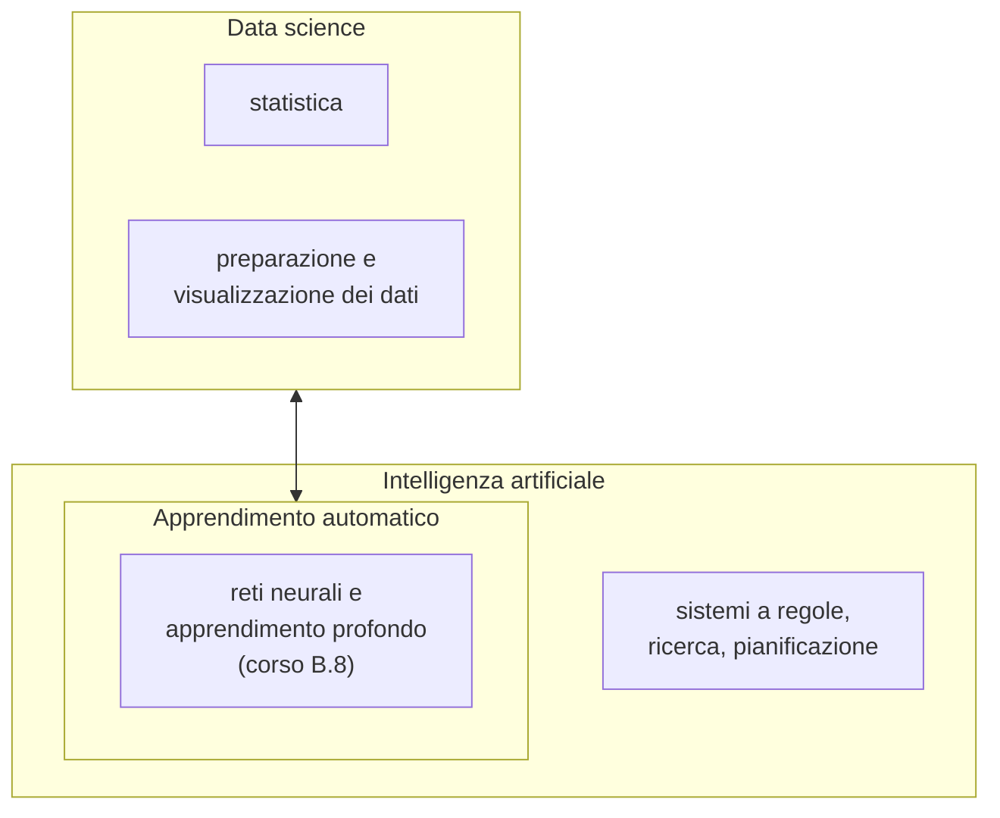
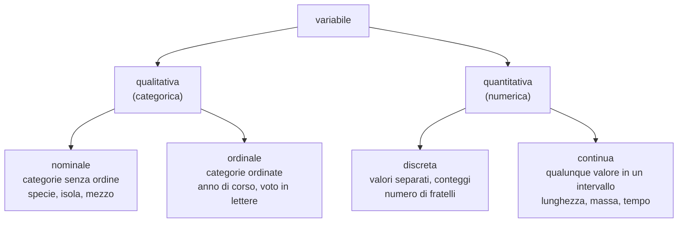
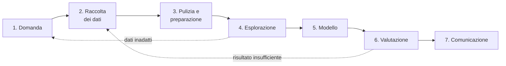
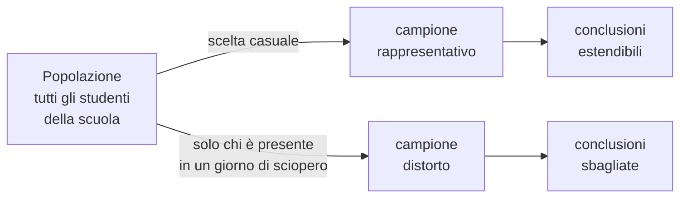
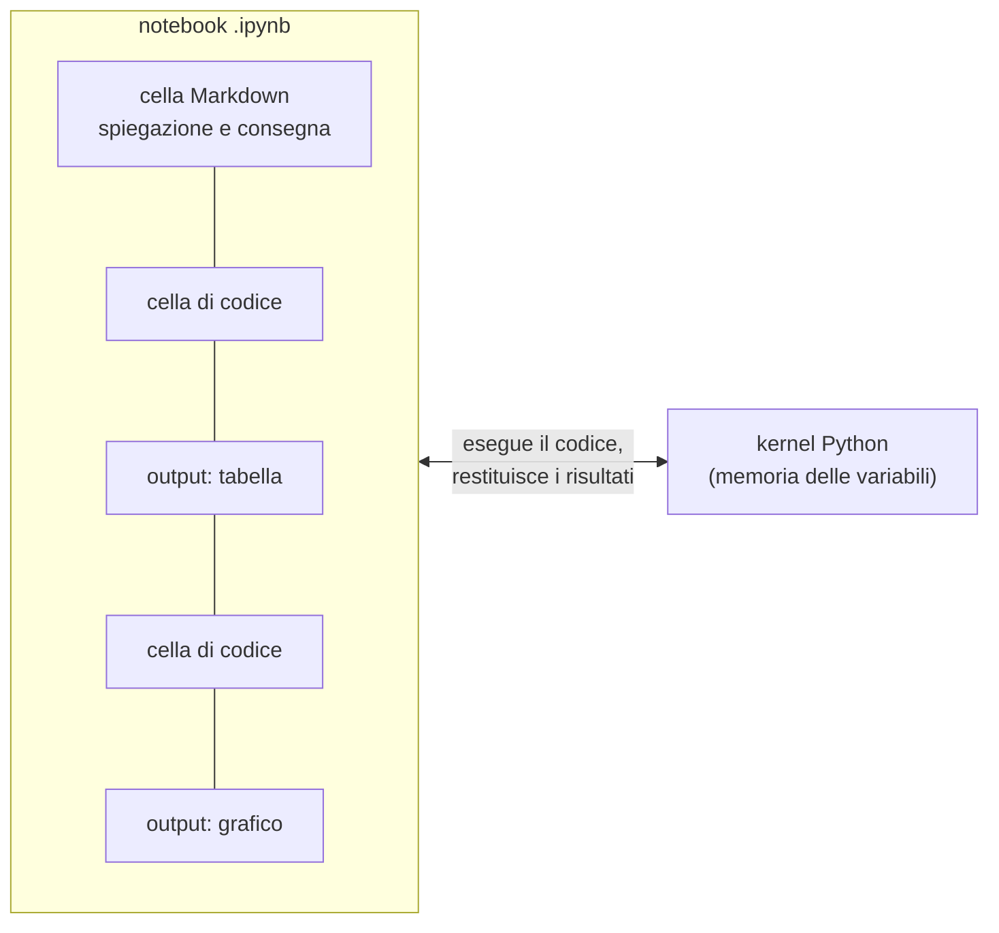
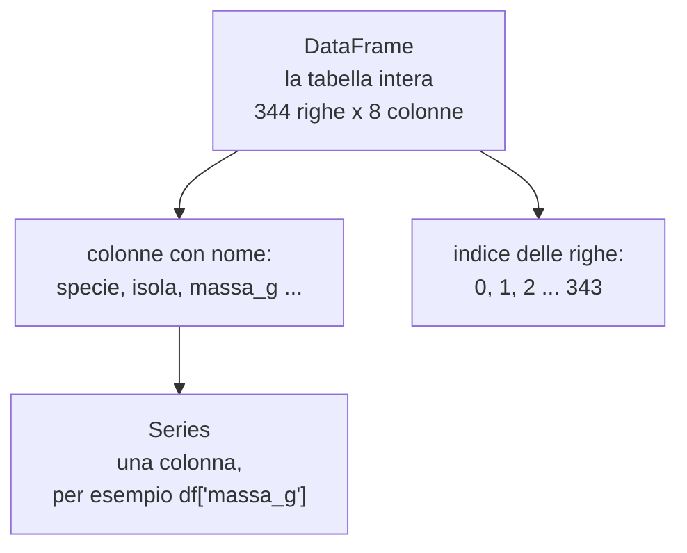
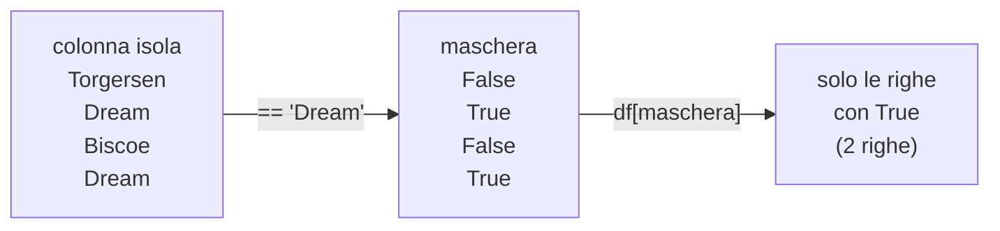

# Lezione L1 - Che cos'è la data science: dati, variabili, dataset

## Obiettivi della lezione

- distinguere data science, statistica, apprendimento automatico e intelligenza artificiale
- descrivere il ciclo di lavoro della data science
- riconoscere la struttura di un dataset tabellare: osservazioni e variabili
- classificare le variabili per tipo
- distinguere caratteristiche ed etichetta
- aprire e ispezionare un file CSV in un foglio di calcolo

## Termini e aree

- Data science
  insieme di metodi per ricavare conoscenza e previsioni dai dati. Combina statistica, informatica e conoscenza del dominio a cui i dati si riferiscono (biologia, economia, sport, trasporti).
- Statistica
  disciplina che studia come raccogliere, descrivere e interpretare i dati e come trarre conclusioni da un campione. È la base matematica della data science.
- Apprendimento automatico (machine learning)
  insieme di tecniche con cui un programma ricava dagli esempi una regola per svolgere un compito (riconoscere, prevedere, raggruppare), invece di ricevere la regola scritta da una persona.
- Intelligenza artificiale (IA)
  campo dell'informatica che studia sistemi capaci di svolgere compiti che, svolti da una persona, richiedono intelligenza. Oggi la maggior parte dei sistemi di IA si basa sull'apprendimento automatico, ma l'IA comprende anche sistemi a regole e di ricerca.

Diagramma: relazioni tra i termini

<!-- diag: aree -->


La data science e l'apprendimento automatico si sovrappongono: la data science usa i modelli di apprendimento automatico come strumento, e l'apprendimento automatico non funziona senza dati raccolti e preparati con i metodi della data science.

Esempi di applicazioni:

- previsioni meteorologiche: modelli fisici corretti con modelli appresi dai dati storici
- raccomandazioni di film, musica, prodotti: previsione di che cosa interesserà a una persona in base alle scelte di persone simili
- filtri antispam e antiphishing: classificazione dei messaggi (corso B.4)
- diagnosi assistita: riconoscimento di anomalie in immagini mediche, sempre con la valutazione di un medico
- trasporti: previsione dei tempi di arrivo dei mezzi pubblici dai dati di posizione

## Dato, informazione, conoscenza

- Dato
  valore registrato: un numero, una parola, una data. Da solo non ha significato: `39.1`.
- Informazione
  dato con un contesto: "il becco di questo pinguino è lungo 39,1 mm".
- Conoscenza
  regolarità ricavata da molte informazioni: "i pinguini di questa specie hanno il becco più corto di quelli dell'altra".

La data science parte dai dati e produce conoscenza; un modello di apprendimento automatico è una forma di conoscenza che si può usare per fare previsioni su casi nuovi.

## Il dataset tabellare

- Dataset
  insieme di dati raccolti con uno scopo e organizzati in modo uniforme.
- Dataset tabellare
  dataset organizzato come una tabella:
  - ogni riga è un'osservazione (o record, o esempio): una cosa, una persona, un evento su cui si è misurato qualcosa
  - ogni colonna è una variabile: una proprietà misurata su tutte le osservazioni
  - la prima riga contiene di solito i nomi delle variabili (intestazione)
- Unità di osservazione
  che cosa rappresenta una riga: un pinguino, uno studente, un viaggio, una giornata di misure.

Il dataset di riferimento del corso è Palmer Penguins: misure di 344 pinguini di tre specie (Adelie, Chinstrap, Gentoo), raccolte tra il 2007 e il 2009 su tre isole dell'arcipelago di Palmer, in Antartide, dalla dottoressa Kristen Gorman e dal programma di ricerca Palmer Station LTER. I dati sono rilasciati con licenza CC0 (pubblico dominio). Nel corso si usa una versione con i nomi delle colonne tradotti in italiano, `pinguini.csv`.

Fonte: Horst AM, Hill AP, Gorman KB (2020), palmerpenguins: Palmer Archipelago (Antarctica) penguin data, https://allisonhorst.github.io/palmerpenguins/

Prime righe del dataset:

| specie | isola | becco_lunghezza_mm | becco_profondita_mm | pinna_lunghezza_mm | massa_g | sesso | anno |
|---|---|---|---|---|---|---|---|
| Adelie | Torgersen | 39.1 | 18.7 | 181 | 3750 | maschio | 2007 |
| Adelie | Torgersen | 39.5 | 17.4 | 186 | 3800 | femmina | 2007 |
| Adelie | Torgersen | 40.3 | 18.0 | 195 | 3250 | femmina | 2007 |
| Adelie | Torgersen | | | | | | 2007 |
| Adelie | Torgersen | 36.7 | 19.3 | 193 | 3450 | femmina | 2007 |

La quarta riga contiene celle vuote: sono valori mancanti, cioè misure non disponibili. Sono frequenti nei dati reali e vanno gestiti (L5).

Dizionario del dataset:

| variabile | descrizione | tipo | unità |
|---|---|---|---|
| specie | specie del pinguino | qualitativa nominale | |
| isola | isola in cui è stato osservato | qualitativa nominale | |
| becco_lunghezza_mm | lunghezza del becco | quantitativa continua | mm |
| becco_profondita_mm | altezza del becco alla base | quantitativa continua | mm |
| pinna_lunghezza_mm | lunghezza della pinna | quantitativa continua (registrata in mm interi) | mm |
| massa_g | massa corporea | quantitativa continua (registrata a 25 g) | g |
| sesso | sesso | qualitativa nominale | |
| anno | anno dell'osservazione | quantitativa discreta | |

## Tipi di variabili

Il tipo di una variabile determina quali operazioni hanno senso (calcolare una media, ordinare, contare) e quali grafici e modelli si possono usare.

Diagramma: tipi di variabili

<!-- diag: tipi-variabili -->


- Variabile qualitativa (o categorica)
  assume come valori delle categorie.
  - nominale: le categorie non hanno un ordine (specie, colore, mezzo di trasporto)
  - ordinale: le categorie hanno un ordine naturale (livello: base, intermedio, avanzato; fascia oraria)
- Variabile quantitativa (o numerica)
  assume valori numerici su cui hanno senso le operazioni aritmetiche.
  - discreta: valori separati, tipicamente conteggi (numero di uova, numero di fermate)
  - continua: qualunque valore in un intervallo, limitato solo dalla precisione dello strumento (lunghezza, massa, tempo)

Attenzione ai numeri che non sono quantità: CAP, numero di matricola, codice di una classe sono scritti con cifre ma sono qualitativi. La media dei CAP non ha significato.

La precisione di registrazione non cambia il tipo: la massa dei pinguini è registrata ad arrotondamenti di 25 g, ma resta una variabile continua.

## Caratteristiche ed etichetta

Quando un dataset viene usato per costruire un modello, le variabili hanno due ruoli:

- Caratteristiche (feature)
  variabili usate come ingresso del modello: le informazioni disponibili.
- Etichetta (target, variabile obiettivo)
  variabile che il modello deve prevedere.

Esempio: prevedere la specie di un pinguino dalle misure del becco e della pinna. Caratteristiche: `becco_lunghezza_mm`, `becco_profondita_mm`, `pinna_lunghezza_mm`. Etichetta: `specie`.

Lo stesso dataset può servire a domande diverse: prevedere la massa dalla lunghezza della pinna usa `pinna_lunghezza_mm` come caratteristica e `massa_g` come etichetta. La scelta dipende dalla domanda.

## Il ciclo della data science

Il lavoro con i dati segue un ciclo, ripetuto più volte perché ogni fase può rivelare problemi di quella precedente.

Diagramma: il ciclo della data science

<!-- diag: ciclo -->


1. Domanda: che cosa si vuole sapere o prevedere, e perché. Una domanda chiara determina quali dati servono.
2. Raccolta: si trovano dati esistenti o se ne raccolgono di nuovi (L2).
3. Pulizia e preparazione: si correggono errori, si gestiscono valori mancanti, si uniformano formati (L4-L5).
4. Esplorazione: statistiche e grafici per capire i dati e formulare ipotesi (L6).
5. Modello: si costruisce un modello che risponde alla domanda (L7-L15).
6. Valutazione: si verifica quanto il modello funziona su dati che non ha visto (L10-L11).
7. Comunicazione: si presentano risultati e limiti a chi deve usarli (L16-L18).

Nei progetti reali la raccolta e la preparazione dei dati occupano la maggior parte del tempo.

Il ciclo descritto è una versione semplificata di CRISP-DM (Cross-Industry Standard Process for Data Mining), modello di processo pubblicato nel 1999 e ancora molto usato: https://en.wikipedia.org/wiki/Cross-industry_standard_process_for_data_mining

## Il formato CSV

- CSV (Comma-Separated Values)
  file di testo in cui ogni riga è un'osservazione e i valori sono separati da un carattere separatore, di solito la virgola. La prima riga contiene l'intestazione. È il formato più usato per scambiare dataset tabellari perché è semplice e leggibile da qualunque programma.

Esempio (prime righe di `pinguini.csv` aperto con un editor di testo):

```text
specie,isola,becco_lunghezza_mm,becco_profondita_mm,pinna_lunghezza_mm,massa_g,sesso,anno
Adelie,Torgersen,39.1,18.7,181,3750,maschio,2007
Adelie,Torgersen,,,,,,2007
```

Aspetti da controllare quando si apre un CSV:

- separatore: virgola nei file internazionali; nei file prodotti con impostazioni italiane spesso punto e virgola, perché la virgola è il separatore decimale
- separatore decimale: punto (`39.1`) nei file internazionali, virgola (`39,1`) in molti file italiani; se il programma lo interpreta male, i numeri diventano testo o vengono letti in modo errato
- codifica dei caratteri: UTF-8 è lo standard attuale; con codifiche diverse le lettere accentate appaiono come simboli strani (`è` al posto di `è`)
- valori mancanti: cella vuota, oppure codici come `NA`, `NaN`, `-`, `999`, da riconoscere prima di calcolare

## Laboratorio L1

Durata indicativa: 25 minuti. Materiali: `pinguini.csv`, scheda `L1_scheda_dataset.md`. Strumento: LibreOffice Calc (versione installata o LibreOffice Portable, https://portableapps.com/apps/office/libreoffice_portable).

Aprire il CSV in LibreOffice Calc:

1. File, Apri, selezionare `pinguini.csv`: si apre la finestra "Importazione testo"
2. in "Opzioni di separazione" selezionare solo "Virgola"
3. in "Lingua" selezionare "Inglese (USA)": così `39.1` viene letto come numero con il punto decimale; con la lingua italiana verrebbe letto come testo o come data
4. controllare l'anteprima e confermare con OK

Comandi usati:

- Dati, Filtro automatico: aggiunge a ogni intestazione un menu a tendina per mostrare solo le righe con certi valori
- Dati, Ordina: ordina le righe secondo una o più colonne, in ordine crescente o decrescente
- `=CONTA.VUOTE(C2:C345)`: conta le celle vuote dell'intervallo (valori mancanti della colonna C)
- `=CONTA.SE(A2:A345;"Gentoo")`: conta le celle dell'intervallo uguali a un valore
- `=MEDIA(E2:E345)`: media dei valori numerici dell'intervallo (le celle vuote vengono ignorate)

Esercizio 1 (base): completare nella scheda il dizionario del dataset indicando per ogni colonna il tipo di variabile e l'unità di misura.

Esercizio 2 (base): con il filtro automatico, contare i pinguini di ciascuna specie e di ciascuna isola. Quali specie vivono su tutte e tre le isole?

Esercizio 3 (standard): contare i valori mancanti di ogni colonna con `CONTA.VUOTE`. Quali colonne ne hanno di più? Perché il sesso potrebbe mancare più spesso delle misure?

Esercizio 4 (standard): ordinare per `pinna_lunghezza_mm` decrescente. Di quale specie sono i primi 20 pinguini? E gli ultimi 20? Che cosa suggerisce questo per riconoscere le specie?

Esercizio 5 (approfondimento): scrivere tre domande a cui il dataset può rispondere e una a cui non può rispondere (per esempio perché manca la variabile necessaria), motivando.

# Lezione L2 - Raccogliere un dataset

## Obiettivi della lezione

- passare da una domanda alle variabili da raccogliere
- conoscere le principali fonti di dati
- distinguere popolazione e campione e riconoscere le distorsioni del campione
- valutare la qualità di un dataset
- progettare un questionario e scrivere un dizionario dei dati
- applicare i principi di minimizzazione e anonimato
- trovare un dataset aperto e valutarne fonte e licenza

## Dalla domanda ai dati

Ogni raccolta di dati parte da una domanda. La domanda stabilisce:

- l'unità di osservazione: che cosa rappresenta una riga
- le variabili: che cosa misurare
- il livello di dettaglio: con quale precisione e con quali categorie
- la popolazione: su chi o su che cosa

Esempio del corso: "Quanto tempo impiegano gli studenti della scuola ad arrivare, e da che cosa dipende?"

- unità di osservazione: uno studente, in un giorno tipico
- variabili: distanza casa-scuola, tempo impiegato, mezzo di trasporto, orario di partenza, anno di corso
- dettaglio: distanza in km con una cifra decimale; tempo in minuti interi; mezzo tra categorie fissate
- popolazione: gli studenti della scuola; campione: gli studenti delle classi che partecipano

Una domanda vaga ("studiamo i trasporti") produce dati raccolti senza criterio, che poi non rispondono a nessuna domanda precisa.

## Fonti dei dati

- Misure dirette e sensori
  strumenti (righello, bilancia, cronometro) o sensori automatici (temperatura, posizione GPS, accelerometri dello smartphone). I pinguini del corso sono misure dirette fatte da ricercatori sul campo.
- Questionari e sondaggi
  domande rivolte a persone. Economici ma soggetti a errori di risposta, risposte mancanti, interpretazioni diverse della stessa domanda.
- Registri e archivi amministrativi
  dati raccolti per altri scopi: registro elettronico, dati di vendita, registri anagrafici. Spesso precisi ma non pensati per la domanda di chi li analizza.
- Dati aperti (open data)
  dati pubblicati da enti pubblici, istituti di ricerca, organizzazioni, liberamente utilizzabili secondo una licenza.
- Dati raccolti dal web
  pagine, commenti, immagini. Grandi quantità, ma qualità, rappresentatività, diritti d'autore e riservatezza vanno verificati caso per caso.

## Popolazione, campione, distorsione

- Popolazione
  l'insieme completo su cui si vuole trarre una conclusione: tutti gli studenti della scuola, tutti i pinguini Adelie dell'arcipelago.
- Campione
  la parte della popolazione effettivamente osservata.
- Campione rappresentativo
  campione le cui caratteristiche rispecchiano quelle della popolazione. Si ottiene di solito con una scelta casuale e con un numero sufficiente di osservazioni.
- Distorsione del campione (bias di selezione)
  differenza sistematica tra campione e popolazione dovuta al modo in cui il campione è stato scelto.

Esempi di distorsione:

- questionario sui tragitti compilato solo dagli studenti presenti il primo giorno di sciopero dei mezzi: sovrarappresenta chi arriva a piedi o in auto
- sondaggio online su un sito di appassionati: rappresenta gli appassionati, non la popolazione
- misure raccolte solo in estate: non descrivono l'inverno
- dataset di foto di volti con poche persone di certe fasce d'età o carnagione: un modello addestrato su di esso funziona peggio proprio per quelle persone (L14)

Un modello impara ciò che è nei dati: se il campione è distorto, il modello eredita la distorsione.

Diagramma: popolazione, campione e distorsione

<!-- diag: campione -->


## Qualità dei dati

Dimensioni della qualità:

- accuratezza: i valori corrispondono alla realtà (misure corrette, nessun errore di trascrizione)
- completezza: i valori necessari sono presenti
- coerenza: stesso dato scritto nello stesso modo e nella stessa unità in tutto il dataset (`bus`, `Bus`, `autobus` sono tre scritture della stessa categoria)
- attualità: i dati sono abbastanza recenti per la domanda
- validità: i valori rispettano le regole attese (un tempo non può essere negativo)

Molti problemi di qualità si evitano in fase di raccolta, progettando bene lo strumento: un menu a tendina con i mezzi ammessi evita le varianti scritte a mano; un campo numerico con unità indicata evita "45 min" e "3/4 d'ora".

## Progettare un questionario

- Domanda chiusa
  la risposta si sceglie tra opzioni prefissate. Dati uniformi, facili da analizzare. Le opzioni devono essere esaustive (coprire tutti i casi, eventualmente con "altro") e mutuamente esclusive (una sola opzione valida per ogni caso).
- Domanda aperta
  la risposta è libera. Più ricca ma difficile da analizzare; da usare solo quando serve.
- Domanda numerica
  richiede un numero; va indicata l'unità di misura e, se utile, un intervallo ammesso.

Regole di formulazione:

- una sola informazione per domanda
- linguaggio non ambiguo: "tempo impiegato di solito, in minuti, dall'uscita di casa all'ingresso a scuola", non "quanto ci metti?"
- domande neutre, che non suggeriscono la risposta
- mezzo di trasporto principale, se se ne usano più d'uno: stabilire la regola (il mezzo su cui si passa più tempo)

## Il dizionario dei dati

- Dizionario dei dati (o codebook)
  documento che descrive ogni variabile di un dataset: nome, descrizione, tipo, unità di misura, valori ammessi, modo di raccolta, codifica dei valori mancanti. È una forma di metadati, cioè dati che descrivono altri dati.

Senza dizionario un dataset è difficile da usare anche per chi l'ha raccolto, dopo qualche mese. Esempio per il questionario dei tragitti:

| variabile | descrizione | tipo | unità | valori ammessi |
|---|---|---|---|---|
| anno_corso | anno di corso dello studente | qualitativa ordinale | | 3, 4, 5 |
| mezzo | mezzo di trasporto principale | qualitativa nominale | | piedi, bici, monopattino, bus, auto, treno |
| distanza_km | distanza casa-scuola | quantitativa continua | km | 0,1-60, una cifra decimale |
| tempo_min | tempo impiegato di solito | quantitativa continua | minuti | 1-150, numero intero |
| fascia_partenza | orario di uscita da casa | qualitativa ordinale | | prima delle 7:00, 7:00-7:30, 7:30-7:45, dopo le 7:45 |

## Riservatezza dei dati raccolti

- Dato personale
  informazione riguardante una persona identificata o identificabile, anche indirettamente (Regolamento generale sulla protezione dei dati, GDPR, art. 4).
- Minimizzazione
  principio del GDPR: si raccolgono solo i dati necessari allo scopo.
- Anonimato
  un dato è anonimo se non può essere ricondotto alla persona con mezzi ragionevoli. Togliere il nome non basta: una combinazione di risposte rare può identificare qualcuno (tema trattato nel corso B.4).

Scelte del questionario della classe:

- nessun nome, email, indirizzo, data di nascita
- nessun dato sensibile (salute, opinioni, origine)
- anno di corso e fascia oraria invece di classe e orario esatto: il dettaglio in più non serve alla domanda e aumenterebbe il rischio di identificazione
- nessuna domanda obbligatoria che uno studente non voglia rispondere

Riferimento: Garante per la protezione dei dati personali, https://www.garanteprivacy.it/

## Dati aperti e licenze

- Dati aperti (open data)
  dati accessibili a tutti, in formato leggibile da un computer, con una licenza che ne permette il riuso.
- Licenza
  documento che stabilisce che cosa si può fare con i dati. Licenze frequenti:
  - CC0: rinuncia a tutti i diritti, equivalente al pubblico dominio; nessun obbligo
  - CC BY 4.0: riuso libero con obbligo di citare la fonte (attribuzione); è la licenza più usata dalla pubblica amministrazione italiana
  - CC BY-SA 4.0: come CC BY, e le opere derivate devono avere la stessa licenza
  - licenze non commerciali (NC): riuso vietato per scopi commerciali

Riferimento: licenza CC BY 4.0, sintesi in italiano, https://creativecommons.org/licenses/by/4.0/deed.it

Dove trovare dataset:

- dati.gov.it: catalogo nazionale dei dati aperti della pubblica amministrazione italiana, con oltre diecimila dataset (trasporti, ambiente, istruzione, popolazione): https://www.dati.gov.it/
- UCI Machine Learning Repository: repository dell'Università della California a Irvine, centinaia di dataset usati nella didattica e nella ricerca sull'apprendimento automatico: https://archive.ics.uci.edu/
- Kaggle Datasets: centinaia di migliaia di dataset caricati da utenti e organizzazioni; qualità e licenza variabili, da verificare: https://www.kaggle.com/datasets

Domande da porsi davanti a un dataset trovato:

- chi l'ha prodotto e come sono stati raccolti i dati?
- quando è stato aggiornato l'ultima volta?
- c'è un dizionario dei dati o una descrizione delle variabili?
- quale licenza ha?
- il campione è adatto alla mia domanda?

## Laboratorio L2

Durata indicativa: 30 minuti. Materiali: scheda `L2_questionario_tragitti.md` (questionario e dizionario dei dati da completare), `L2_valutazione_dataset.md` (scheda di valutazione), `tragitti_esempio.csv` (dataset di esempio, da usare se la raccolta in classe non è possibile).

Esercizio 1 (base): completare collettivamente il questionario sui tragitti, discutendo per ogni domanda tipo, unità, valori ammessi. Aggiungere al massimo una variabile nuova, motivandone l'utilità per la domanda e verificando che rispetti la minimizzazione.

Esercizio 2 (base): compilare il questionario in modo anonimo, sul modulo predisposto dal docente o su carta.

Esercizio 3 (standard): individuare due possibili distorsioni del campione raccolto dalla classe rispetto alla popolazione di tutti gli studenti della scuola.

Esercizio 4 (standard): su dati.gov.it cercare un dataset su un tema a scelta (trasporti, ambiente, scuola) e compilare la scheda di valutazione: fonte, data di aggiornamento, formato, licenza, variabili, unità di osservazione, una domanda a cui potrebbe rispondere.

Esercizio 5 (approfondimento): aprire `tragitti_esempio.csv` in LibreOffice Calc e individuare almeno cinque problemi di qualità diversi, classificandoli secondo le dimensioni della qualità.

# Lezione L3 - Notebook Jupyter e primi passi con pandas

## Obiettivi della lezione

- descrivere un notebook Jupyter e i suoi componenti
- aprire ed eseguire un notebook in JupyterLite, WinPython o Colab
- riconoscere gli elementi essenziali di Python usati nei notebook del corso
- caricare un CSV in pandas e ispezionarlo
- selezionare colonne e righe e contare i valori

## Il notebook Jupyter

- Notebook
  documento interattivo che contiene celle di testo e celle di codice eseguibile, con i risultati dell'esecuzione (numeri, tabelle, grafici) mostrati sotto ciascuna cella. Il formato è `.ipynb` (IPython Notebook). Il progetto Jupyter, open source, ne definisce il formato e fornisce l'ambiente JupyterLab: https://jupyter.org/
- Cella di testo (Markdown)
  contiene spiegazioni e consegne, scritte in Markdown, un linguaggio semplice di formattazione (`# Titolo`, `**grassetto**`, elenchi con `-`).
- Cella di codice
  contiene istruzioni Python; si esegue con Maiusc+Invio. Il risultato compare sotto la cella; il numero tra parentesi quadre a sinistra (`[3]`) indica l'ordine in cui la cella è stata eseguita.
- Kernel
  il programma che esegue il codice delle celle. Ricorda variabili e dati tra una cella e l'altra finché non viene riavviato.

Diagramma: struttura di un notebook

<!-- diag: notebook -->


Ordine di esecuzione: le celle si eseguono di solito dall'alto in basso, ma il kernel esegue ciò che viene lanciato nell'ordine in cui viene lanciato. Se si esegue una cella che usa una variabile definita in una cella non ancora eseguita, si ottiene un errore `NameError`. Se il notebook si comporta in modo strano: menu Kernel, "Restart Kernel and Run All Cells" (riavvia ed esegui tutto).

Comandi principali in JupyterLab:

- Maiusc+Invio: esegue la cella e passa alla successiva
- pulsante `+`: inserisce una nuova cella
- menu a tendina nella barra: cambia il tipo di cella (Code, Markdown)
- File, Download: scarica il notebook sul proprio PC

## Tre modi di eseguire un notebook

| | JupyterLite | WinPython | Google Colab |
|---|---|---|---|
| dove gira il codice | nel browser del proprio PC | sul proprio PC | su un server di Google |
| installazione | nessuna | nessuna: cartella scompattata, anche su chiavetta | nessuna |
| rete | solo al primo caricamento | non serve | sempre necessaria |
| account | nessuno | nessuno | account Google |
| dove sono salvati i file | memoria del browser di quella postazione | cartella sul disco o sulla chiavetta | Google Drive |

- JupyterLite: https://jupyter.org/try-jupyter/lab/
- WinPython: https://winpython.github.io/
- Google Colab: https://colab.research.google.com/

In JupyterLite i file restano nel browser della postazione: a fine lezione occorre scaricare il notebook (tasto destro sul file, Download). Per usare un CSV, caricarlo con il pulsante di upload (freccia verso l'alto) nella stessa cartella del notebook.

## Python quanto basta

I notebook del corso sono già scritti; per leggerli servono pochi elementi del linguaggio Python.

- Istruzione
  una riga di codice che esegue un'azione.
- Commento
  testo dopo il simbolo `#`, ignorato da Python; spiega il codice.
- Variabile
  nome che si riferisce a un valore; si crea con `=` (assegnazione).
- Funzione
  operazione con un nome, che riceve valori tra parentesi (argomenti) e può restituire un risultato: `len("pinguino")` restituisce 8.
- Metodo
  funzione che appartiene a un oggetto e si chiama con il punto: `tabella.head()`.
- Libreria e `import`
  una libreria è un insieme di funzioni pronte; `import pandas as pd` rende disponibile la libreria pandas con il nome breve `pd`.

```python
# commento: questa riga non viene eseguita
soglia = 200                 # variabile con un numero
specie = "Gentoo"            # variabile con un testo (stringa, tra virgolette)
print(soglia, specie)        # funzione print: mostra i valori
```

Nei notebook, il valore dell'ultima riga di una cella viene mostrato automaticamente, senza `print`.

## La libreria pandas

- pandas
  libreria Python open source per l'analisi di dati tabellari; è lo strumento più usato nella data science in Python. Documentazione e introduzione rapida: https://pandas.pydata.org/docs/user_guide/10min.html
- DataFrame
  tabella di pandas: righe (con un indice) e colonne con un nome.
- Series
  una singola colonna di un DataFrame.

Diagramma: DataFrame, Series, indice

<!-- diag: dataframe -->


### Caricare e ispezionare

```python
import pandas as pd

pinguini = pd.read_csv("pinguini.csv")
pinguini.head()
```

- `pd.read_csv("pinguini.csv")`: legge il file CSV e restituisce un DataFrame; il file deve trovarsi nella stessa cartella del notebook
- `pinguini.head()`: mostra le prime 5 righe; `head(10)` le prime 10; `tail()` le ultime

```python
print(pinguini.shape)      # (344, 8): numero di righe e di colonne
print(pinguini.columns)    # nomi delle colonne
pinguini.info()            # tipo e numero di valori non mancanti per colonna
```

- `shape`: attributo (senza parentesi) con il numero di righe e di colonne
- `columns`: elenco dei nomi delle colonne
- `info()`: per ogni colonna, numero di valori presenti (non-null) e tipo:
  - `int64`: numeri interi
  - `float64`: numeri con la virgola; pandas usa questo tipo anche per colonne di interi che contengono valori mancanti
  - `object` o `str`: testo
- valori mancanti: pandas li rappresenta con `NaN` (Not a Number); `info()` li rivela perché il conteggio dei non-null è inferiore al numero di righe

### Selezionare colonne e righe

```python
pinguini["massa_g"]                          # una colonna: Series
pinguini[["specie", "massa_g"]]              # più colonne: DataFrame (doppie parentesi)
pinguini[pinguini["isola"] == "Dream"]       # righe che soddisfano una condizione
pinguini[pinguini["massa_g"] > 5000]
```

- `df["colonna"]`: seleziona una colonna per nome
- `df[["a", "b"]]`: seleziona più colonne; la lista dei nomi è tra parentesi quadre, da cui le doppie parentesi
- `df["isola"] == "Dream"`: confronta ogni valore della colonna con `"Dream"` e produce una serie di `True`/`False` (maschera booleana)
- `df[maschera]`: tiene solo le righe in cui la maschera vale `True`
- operatori di confronto: `==` uguale, `!=` diverso, `>`, `>=`, `<`, `<=`

Diagramma: filtro con una maschera booleana

<!-- diag: maschera -->


Condizioni combinate:

```python
pinguini[(pinguini["isola"] == "Dream") & (pinguini["massa_g"] > 4000)]   # e
pinguini[(pinguini["specie"] == "Adelie") | (pinguini["specie"] == "Gentoo")]  # oppure
```

- `&`: entrambe le condizioni vere; `|`: almeno una vera
- ogni condizione va racchiusa tra parentesi tonde

### Contare i valori

```python
pinguini["specie"].value_counts()
len(pinguini[pinguini["isola"] == "Dream"])
```

- `value_counts()`: quante volte compare ciascun valore di una colonna, in ordine decrescente
- `len(df)`: numero di righe di un DataFrame

## Laboratorio L3

Durata indicativa: 30 minuti. Materiali: notebook `L3_primi_passi_pandas.ipynb`, `pinguini.csv`, `tragitti_esempio.csv` (oppure il CSV del questionario della classe).

Esercizio 1 (base): aprire JupyterLite, caricare il notebook e i due CSV, eseguire le prime celle e rispondere alle domande su righe, colonne e tipi.

Esercizio 2 (base): selezionare i pinguini dell'isola Biscoe e contarli; contare i pinguini per specie.

Esercizio 3 (standard): trovare quanti pinguini hanno massa superiore a 5000 g e di quale specie sono; ripetere con la pinna più corta di 185 mm.

Esercizio 4 (standard): caricare il CSV dei tragitti; controllare con `info()` quali colonne pandas ha letto come testo anche se dovrebbero essere numeri, e spiegare perché (collegamento con L5).

Esercizio 5 (approfondimento): contare quanti pinguini di ciascuna specie vivono su ciascuna isola usando `value_counts()` su due colonne (`pinguini[["specie", "isola"]].value_counts()`); riavviare il kernel ed eseguire tutto per verificare che il notebook funzioni dall'inizio alla fine.
