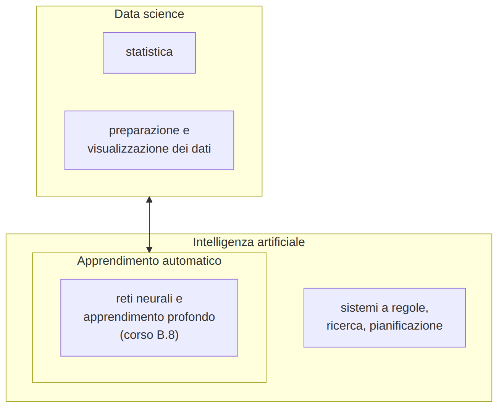
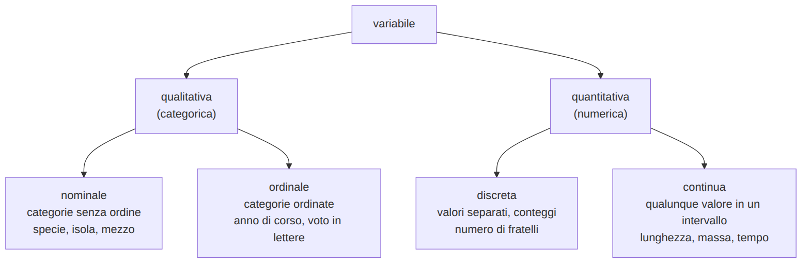
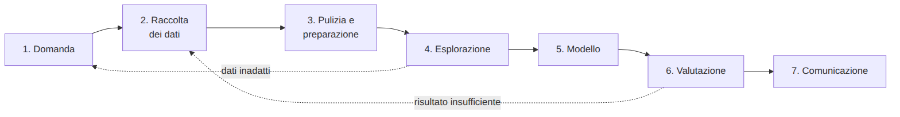
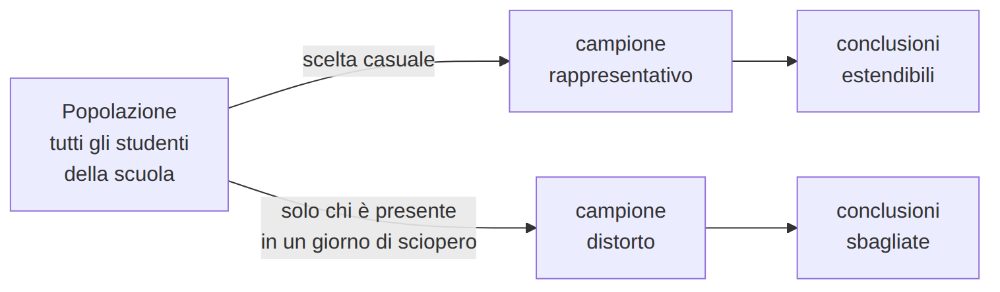
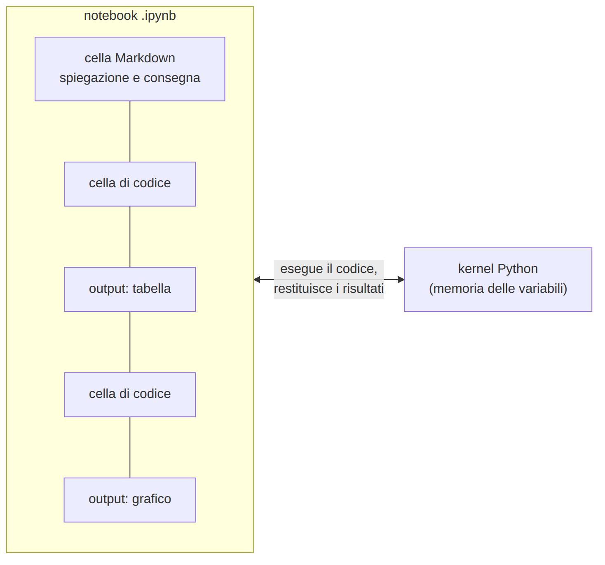
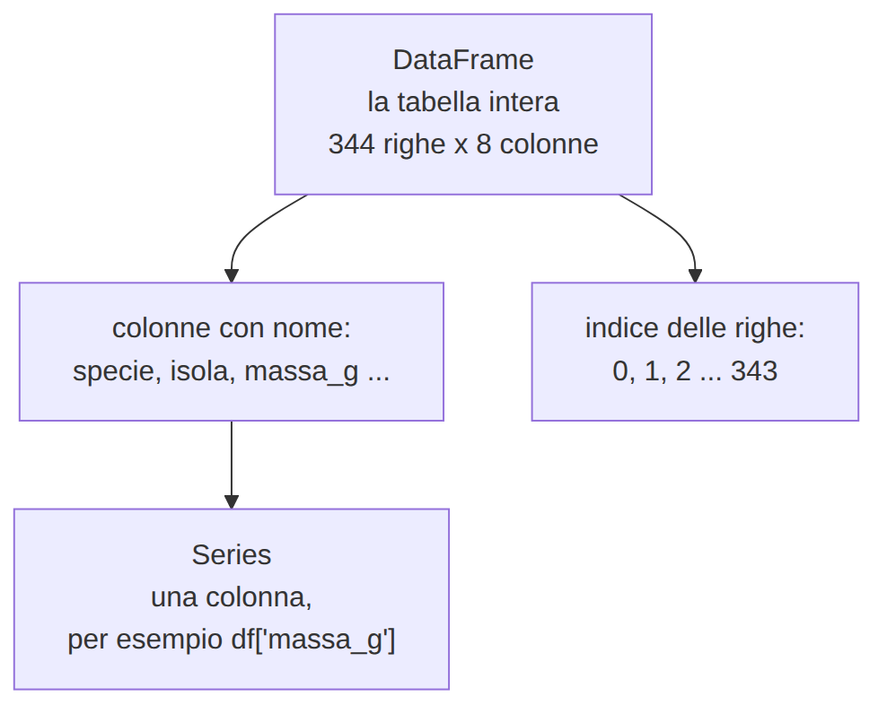
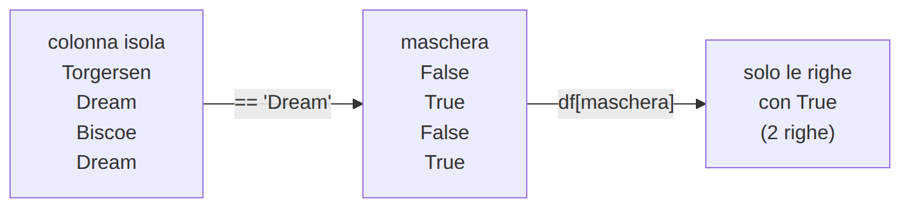

<!-- _class: titolo -->
<!-- _paginate: false -->

## Modulo 1 - Dati e dataset

B.6 - Data science e Machine Learning: dai dati ai modelli

Lezioni L1, L2, L3

---

<!-- _class: titolo -->

## L1 - Che cos'è la data science: dati, variabili, dataset

---

## Termini e aree



- **Data science**: conoscenza e previsioni dai dati
- **Statistica**: descrivere e interpretare i dati
- **Apprendimento automatico**: regole ricavate dagli esempi
- **IA**: sistemi che svolgono compiti che richiedono intelligenza

---

## Dato, informazione, conoscenza

- **Dato**: `39.1`
- **Informazione**: il becco di questo pinguino è lungo 39,1 mm
- **Conoscenza**: i pinguini di questa specie hanno il becco più corto di quelli dell'altra

Un modello di apprendimento automatico è conoscenza usata per prevedere casi nuovi.

---

## Il dataset tabellare

| specie | isola | becco_lunghezza_mm | becco_profondita_mm | pinna_lunghezza_mm | massa_g | sesso | anno |
|---|---|---|---|---|---|---|---|
| Adelie | Torgersen | 39.1 | 18.7 | 181 | 3750 | maschio | 2007 |
| Adelie | Torgersen | 39.5 | 17.4 | 186 | 3800 | femmina | 2007 |
| Adelie | Torgersen | | | | | | 2007 |

- riga = **osservazione** (un pinguino); colonna = **variabile**
- celle vuote = **valori mancanti**

Palmer Penguins: 344 pinguini, 3 specie, 3 isole, licenza CC0
https://allisonhorst.github.io/palmerpenguins/

---

## Tipi di variabili



Attenzione: CAP e codici sono cifre, ma sono **qualitativi**.

---

## Caratteristiche ed etichetta

- **caratteristiche** (feature): ingressi del modello
- **etichetta** (target): ciò che il modello deve prevedere

| domanda | caratteristiche | etichetta |
|---|---|---|
| quale specie? | misure di becco e pinna | specie |
| quanto pesa? | lunghezza della pinna | massa_g |

La scelta dipende dalla **domanda**.

---

## Il ciclo della data science



Raccolta e preparazione occupano la maggior parte del lavoro.

---

## Il formato CSV

```text
specie,isola,becco_lunghezza_mm,becco_profondita_mm,pinna_lunghezza_mm,massa_g,sesso,anno
Adelie,Torgersen,39.1,18.7,181,3750,maschio,2007
Adelie,Torgersen,,,,,,2007
```

Da controllare:

- **separatore**: virgola o punto e virgola
- **decimali**: punto (`39.1`) o virgola (`39,1`)
- **codifica**: UTF-8
- **valori mancanti**: vuoto, `NA`, `-`, `999`

---

## Laboratorio L1 - LibreOffice Calc

Apertura: separatore **Virgola**, lingua **Inglese (USA)** per leggere il punto decimale

- Dati, Filtro automatico; Dati, Ordina
- `=CONTA.VUOTE(C2:C345)`, `=CONTA.SE(A2:A345;"Gentoo")`, `=MEDIA(E2:E345)`

1. (base) dizionario: tipo e unità di ogni colonna
2. (base) pinguini per specie e per isola
3. (standard) valori mancanti per colonna
4. (standard) ordinamento per pinna: quali specie ai due estremi?
5. (approfondimento) tre domande possibili e una impossibile

---

<!-- _class: titolo -->

## L2 - Raccogliere un dataset

---

## Dalla domanda ai dati

"Quanto tempo impiegano gli studenti ad arrivare a scuola, e da che cosa dipende?"

- **unità di osservazione**: uno studente, in un giorno tipico
- **variabili**: distanza, tempo, mezzo, orario di partenza, anno di corso
- **dettaglio**: km con un decimale, minuti interi, categorie fissate
- **popolazione**: studenti della scuola; **campione**: le classi che rispondono

---

## Fonti dei dati

- **misure dirette e sensori**: righello, bilancia, GPS
- **questionari**: economici, ma con errori e risposte mancanti
- **registri e archivi**: raccolti per altri scopi
- **dati aperti**: enti pubblici, istituti di ricerca
- **web**: tanti dati; qualità, diritti e riservatezza da verificare

---

## Popolazione, campione, distorsione



- **campione rappresentativo**: rispecchia la popolazione (scelta casuale, numerosità)
- **bias di selezione**: differenza sistematica dovuta alla scelta del campione
- un modello **eredita** le distorsioni dei dati

---

## Qualità dei dati

- **accuratezza**: valori corretti
- **completezza**: valori presenti
- **coerenza**: `bus`, `Bus`, `autobus` sono la stessa categoria
- **attualità**: dati abbastanza recenti
- **validità**: un tempo non può essere negativo

Molti problemi si evitano **progettando la raccolta**: menu a tendina, unità indicate, intervalli ammessi.

---

## Progettare un questionario

- **domanda chiusa**: opzioni esaustive e mutuamente esclusive
- **domanda aperta**: ricca, difficile da analizzare
- **domanda numerica**: con unità di misura

Regole: una informazione per domanda, linguaggio non ambiguo, domande neutre.

"tempo impiegato di solito, in minuti, dall'uscita di casa all'ingresso a scuola"

---

## Il dizionario dei dati

| variabile | tipo | unità | valori ammessi |
|---|---|---|---|
| anno_corso | qualitativa ordinale | | 3, 4, 5 |
| mezzo | qualitativa nominale | | piedi, bici, monopattino, bus, auto, treno |
| distanza_km | quantitativa continua | km | 0,1-60 |
| tempo_min | quantitativa continua | minuti | 1-150 |
| fascia_partenza | qualitativa ordinale | | 4 fasce orarie |

Metadati: dati che descrivono i dati.

---

## Riservatezza

- **dato personale**: persona identificata o identificabile, anche indirettamente (GDPR, art. 4)
- **minimizzazione**: solo i dati necessari
- **anonimato**: togliere il nome non basta

Il questionario della classe: niente nomi, email, indirizzi, date di nascita, dati sensibili; anno di corso e fascia oraria invece di classe e orario esatto.

---

## Dati aperti e licenze

- **CC0**: pubblico dominio
- **CC BY 4.0**: riuso libero citando la fonte
- **CC BY-SA 4.0**: e le opere derivate con la stessa licenza
- **NC**: niente usi commerciali

Dove cercare:

- dati.gov.it: https://www.dati.gov.it/
- UCI ML Repository: https://archive.ics.uci.edu/
- Kaggle Datasets: https://www.kaggle.com/datasets

Chi, come, quando, licenza, dizionario, campione adatto?

---

## Laboratorio L2

Schede `L2_questionario_tragitti.md` e `L2_valutazione_dataset.md`

1. (base) completare insieme questionario e dizionario dei dati
2. (base) compilare il questionario in forma anonima
3. (standard) due distorsioni del campione della classe
4. (standard) valutare un dataset su dati.gov.it
5. (approfondimento) cinque problemi di qualità in `tragitti_esempio.csv`

---

<!-- _class: titolo -->

## L3 - Notebook Jupyter e primi passi con pandas

---

## Il notebook



- **cella Markdown**: spiegazioni e consegne
- **cella di codice**: Maiusc+Invio; `[3]` = ordine di esecuzione
- **kernel**: esegue e ricorda le variabili

In caso di dubbio: Kernel, Restart Kernel and Run All Cells

---

## Tre modi di eseguire un notebook

| | JupyterLite | WinPython | Colab |
|---|---|---|---|
| codice eseguito | nel browser | sul PC | su server Google |
| installazione | nessuna | cartella, anche su chiavetta | nessuna |
| rete | solo al primo avvio | no | sempre |
| account | no | no | Google |
| file | nel browser | su disco | su Drive |

JupyterLite: scaricare il notebook a fine lezione.

---

## Python quanto basta

```python
import pandas as pd          # libreria pandas, nome breve pd
soglia = 200                 # variabile con un numero
specie = "Gentoo"            # variabile con un testo
print(soglia, specie)        # funzione: mostra i valori
tabella.head()               # metodo: funzione di un oggetto
```

- `#` commento, `=` assegnazione
- **funzione**: `nome(argomenti)`; **metodo**: `oggetto.nome()`
- l'ultima riga di una cella viene mostrata automaticamente

---

## pandas: DataFrame e Series



```python
pinguini = pd.read_csv("pinguini.csv")
pinguini.head()        # prime 5 righe
pinguini.shape         # (344, 8)
pinguini.info()        # tipi e valori non mancanti
```

`int64` interi, `float64` numeri con la virgola, `str` testo, `NaN` valore mancante

---

## Selezionare righe e colonne

```python
pinguini["massa_g"]                        # una colonna
pinguini[["specie", "massa_g"]]            # più colonne
pinguini[pinguini["isola"] == "Dream"]     # righe con una condizione
pinguini[(pinguini["isola"] == "Dream") & (pinguini["massa_g"] > 4000)]
pinguini["specie"].value_counts()          # conteggi
```



---

## Laboratorio L3

Notebook `L3_primi_passi_pandas.ipynb`, `pinguini.csv`, `tragitti_esempio.csv`

1. (base) caricare, `shape`, `info()`, valori mancanti
2. (base) pinguini di un'isola; conteggi per specie
3. (standard) massa > 5000 g; pinna < 185 mm
4. (standard) tragitti: colonne numeriche lette come testo, perché?
5. (approfondimento) conteggi per specie e isola; riavvio ed esecuzione completa
