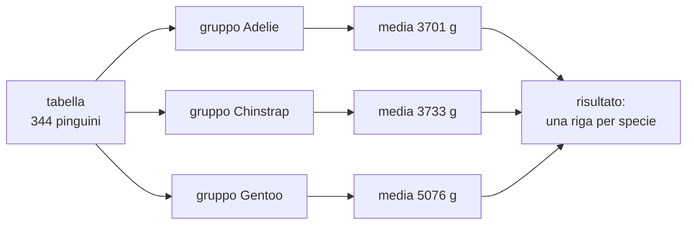
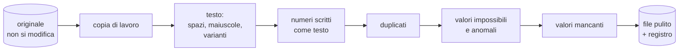
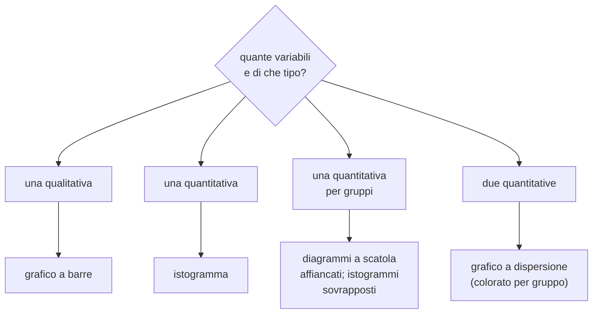

# Lezione L4 - Riassumere i dati: statistica descrittiva con pandas

## Obiettivi della lezione

- descrivere la distribuzione di una variabile
- calcolare e interpretare media, mediana e moda
- calcolare e interpretare intervallo, quartili, scarto interquartile e deviazione standard
- scegliere tra media e mediana in base alla forma della distribuzione
- calcolare statistiche per gruppi con `groupby`
- costruire tabelle di frequenza e tabelle a doppia entrata

## Distribuzione

- Statistica descrittiva
  insieme dei metodi che riassumono un insieme di dati con pochi numeri (indici) e con grafici, senza trarre conclusioni oltre i dati osservati.
- Distribuzione di una variabile
  il modo in cui i valori della variabile si ripartiscono: quali valori compaiono e con quale frequenza. Per una variabile qualitativa si descrive con i conteggi per categoria; per una variabile quantitativa con indici di posizione, di dispersione e con l'istogramma (L6).

Due domande guidano la descrizione di una variabile quantitativa:

- dove si trova il centro dei valori? (indici di posizione)
- quanto sono sparsi i valori intorno al centro? (indici di dispersione)

## Indici di posizione

- Media aritmetica
  somma dei valori divisa per il loro numero. Con i valori 2, 3, 4, 5, 21 la media è 35 / 5 = 7.
- Mediana
  valore centrale dei dati ordinati: metà dei valori è minore o uguale, metà è maggiore o uguale. Con 2, 3, 4, 5, 21 la mediana è 4. Con un numero pari di valori è la media dei due valori centrali: con 2, 3, 4, 5 è 3,5.
- Moda
  valore o categoria più frequente. È l'unico indice di posizione applicabile alle variabili qualitative nominali (la specie più numerosa è Adelie).

La media è sensibile ai valori estremi, la mediana no. Nell'esempio 2, 3, 4, 5, 21 un solo valore grande porta la media a 7, più alta di quattro valori su cinque; la mediana 4 rappresenta meglio il valore "tipico".

Quando la distribuzione è asimmetrica, cioè ha una "coda" da un lato, media e mediana si separano: la media si sposta verso la coda. È il caso dei tempi di tragitto: molti studenti impiegano 10-30 minuti, pochi impiegano un'ora o più.

{width=85%}

Regola pratica: per distribuzioni simmetriche media e mediana quasi coincidono e si usa la media; per distribuzioni asimmetriche o con valori anomali la mediana descrive meglio il centro. Per questo le statistiche sui redditi riportano spesso la mediana.

## Indici di dispersione

- Intervallo (campo di variazione)
  differenza tra massimo e minimo. Semplice ma dipende solo da due valori, spesso estremi.
- Quartili
  i tre valori che dividono i dati ordinati in quattro parti con lo stesso numero di valori:
  - primo quartile Q1: il 25% dei valori è minore o uguale
  - secondo quartile Q2: coincide con la mediana
  - terzo quartile Q3: il 75% dei valori è minore o uguale
- Scarto interquartile (IQR, interquartile range)
  Q3 - Q1: ampiezza dell'intervallo che contiene la metà centrale dei valori. Come la mediana, non risente dei valori estremi.
- Deviazione standard
  misura di quanto i valori si discostano in media dalla media aritmetica. Si calcola così:
  1. per ogni valore, la differenza dalla media (scarto)
  2. il quadrato di ogni scarto (così gli scarti negativi non annullano quelli positivi)
  3. la media dei quadrati (varianza); pandas divide per n - 1 invece che per n, per ragioni legate alla stima da un campione
  4. la radice quadrata, che riporta la misura nell'unità della variabile

  Una deviazione standard piccola indica valori raccolti vicino alla media; grande, valori sparsi.

Esempio: la massa dei pinguini ha media 4202 g e deviazione standard 802 g; la massa dei soli Chinstrap ha deviazione standard 384 g, quella dei Gentoo 504 g. I Chinstrap hanno masse più simili tra loro.

Percentile: generalizzazione dei quartili; il 90° percentile è il valore sotto cui cade il 90% dei dati. I quartili sono il 25°, 50° e 75° percentile.

## Statistiche con pandas

```python
massa = pinguini["massa_g"]
massa.mean()            # 4201.8
massa.median()          # 4050.0
massa.std()             # 802.0
massa.quantile(0.25)    # 3550.0
massa.quantile(0.75)    # 4750.0
pinguini.describe()     # tutte le statistiche per ogni colonna numerica
```

- `mean()`, `median()`, `std()`, `min()`, `max()`: media, mediana, deviazione standard, minimo, massimo
- `quantile(q)`: il valore sotto cui cade la frazione `q` dei dati
- `describe()`: per ogni colonna numerica `count` (valori presenti), `mean`, `std`, `min`, i quartili `25%`, `50%`, `75%`, `max`
- i valori mancanti vengono ignorati; `count` indica su quanti valori è calcolato il risultato

## Statistiche per gruppi

Molte domande confrontano gruppi: i Gentoo pesano più degli Adelie? I maschi hanno il becco più lungo?

- `groupby(colonna)`
  divide le righe in gruppi secondo i valori della colonna; a ogni gruppo si applica poi una statistica.

```python
pinguini.groupby("specie")["massa_g"].mean()
```

1. `groupby("specie")`: tre gruppi, uno per specie
2. `["massa_g"]`: in ogni gruppo si considera la massa
3. `.mean()`: si calcola la media in ogni gruppo

Diagramma: dividi, applica, combina

<!-- diag: groupby -->


Medie per specie:

| specie | becco lunghezza (mm) | becco profondità (mm) | pinna (mm) | massa (g) |
|---|---|---|---|---|
| Adelie | 38,8 | 18,3 | 190,0 | 3701 |
| Chinstrap | 48,8 | 18,4 | 195,8 | 3733 |
| Gentoo | 47,5 | 15,0 | 217,2 | 5076 |

La tabella suggerisce già come riconoscere le specie: i Gentoo hanno pinna lunga, massa alta e becco poco profondo; Adelie e Chinstrap si somigliano per massa e pinna ma differiscono per la lunghezza del becco.

Altre forme:

- `groupby(["specie", "sesso"])`: un gruppo per ogni combinazione
- `agg(["count", "mean", "median", "std"])`: più statistiche insieme

## Tabelle di frequenza

- Frequenza assoluta
  numero di osservazioni con un certo valore.
- Frequenza relativa
  frequenza assoluta divisa per il totale, spesso espressa in percentuale.
- Tabella a doppia entrata (tabella di contingenza)
  conteggi per ogni combinazione dei valori di due variabili qualitative.

```python
pinguini["specie"].value_counts()                                  # frequenze assolute
pinguini["specie"].value_counts(normalize=True)                    # frequenze relative
pd.crosstab(pinguini["isola"], pinguini["specie"])                 # doppia entrata
pd.crosstab(pinguini["isola"], pinguini["specie"], normalize="index")  # percentuali per riga
```

| isola | Adelie | Chinstrap | Gentoo |
|---|---|---|---|
| Biscoe | 44 | 0 | 124 |
| Dream | 56 | 68 | 0 |
| Torgersen | 52 | 0 | 0 |

Le percentuali per riga (`normalize="index"`) rispondono alla domanda "su ciascuna isola, quale frazione dei pinguini è di ciascuna specie?".

Ordinamento: `sort_values("massa_g", ascending=False)` ordina le righe per massa decrescente; `head(5)` mostra le prime cinque.

## Laboratorio L4

Durata indicativa: 30 minuti. Materiali: notebook `L4_statistiche.ipynb`, `pinguini.csv`, `tragitti_esempio.csv`.

Esercizio 1 (base): calcolare le medie delle misure per specie; indicare quale misura distingue meglio i Gentoo e quale distingue Adelie da Chinstrap.

Esercizio 2 (base): calcolare la massa media per specie e sesso; costruire la tabella isola-specie in conteggi e in percentuali per riga.

Esercizio 3 (standard): individuare i cinque pinguini più pesanti; verificare se hanno qualcosa in comune (specie, sesso, isola).

Esercizio 4 (standard): confrontare media e mediana del tempo di tragitto nei dati non ancora puliti; individuare i valori che allontanano la media dalla mediana.

Esercizio 5 (approfondimento): calcolare scarto interquartile e deviazione standard della massa per specie; indicare la specie più variabile.

# Lezione L5 - Pulire i dati

## Obiettivi della lezione

- riconoscere i problemi di qualità tipici di un dataset
- uniformare valori di testo
- convertire in numero valori scritti come testo
- individuare ed eliminare duplicati
- distinguere valori impossibili, valori anomali e casi reali
- scegliere come trattare i valori mancanti
- documentare la pulizia in un registro

## Perché si pulisce

- Pulizia dei dati (data cleaning)
  insieme delle operazioni che individuano e correggono, o segnalano, errori e incoerenze in un dataset prima dell'analisi.

Un modello o un grafico calcolati su dati non puliti producono risultati sbagliati senza segnalarlo: se `bus` e `Bus` sono due categorie, il conteggio degli studenti in autobus è sbagliato; se un tempo è scritto `45 min`, pandas legge l'intera colonna come testo e non calcola la media; se una distanza è 250 km invece di 2,5, la media della distanza raddoppia.

Diagramma: il flusso della pulizia

<!-- diag: pulizia -->


L'ordine conta: i duplicati si riconoscono meglio dopo aver uniformato il testo; i valori anomali si calcolano solo su colonne già numeriche.

## Problemi tipici

| problema | esempio nei tragitti | trattamento |
|---|---|---|
| varianti della stessa categoria | `bus`, `Bus`, `autobus`, `pullman`, ` bus` | minuscole, spazi, tabella di corrispondenza |
| separatore decimale | `1,2` | sostituire la virgola con il punto |
| unità nel testo | `45 min`, `45'` | estrarre la parte numerica |
| duplicati | stessa risposta inviata due volte | eliminare le copie |
| valori impossibili | distanza -3, tempo 0 | rendere mancanti |
| valori anomali | distanza 250 km in autobus | valutare caso per caso |
| valori mancanti | distanza non indicata | eliminare o sostituire, secondo l'uso |
| risposte ambigue | `treno + bus` | applicare la regola del questionario |

## Principi

- l'originale non si modifica: si lavora su una copia e si salva un nuovo file
- ogni operazione è scritta nel codice del notebook, quindi ripetibile: se arrivano nuove risposte, si riesegue il notebook
- le decisioni si documentano in un registro: che cosa, quante righe, perché
- non si "correggono" i valori inventando: se non si sa il valore vero, lo si rende mancante

```python
originale = pd.read_csv("tragitti_esempio.csv")
dati = originale.copy()
```

- `copy()`: crea una copia indipendente del DataFrame; le modifiche a `dati` non cambiano `originale`

## Uniformare il testo

```python
dati["mezzo"] = dati["mezzo"].str.strip().str.lower()
correzioni = {"autobus": "bus", "pullman": "bus", "a piedi": "piedi",
              "bicicletta": "bici", "macchina": "auto", "in auto": "auto",
              "monopattino elettrico": "monopattino", "treno + bus": "treno"}
dati["mezzo"] = dati["mezzo"].replace(correzioni)
```

- `str`: dà accesso ai metodi per il testo applicati a ogni valore della colonna
- `str.strip()`: toglie gli spazi all'inizio e alla fine
- `str.lower()`: trasforma in minuscolo
- dizionario Python `{chiave: valore, ...}`: associa a ogni variante il valore corretto
- `replace(dizionario)`: sostituisce ogni valore uguale a una chiave con il valore associato

Dopo queste operazioni le 23 varianti del dataset di esempio si riducono ai 6 mezzi del dizionario dei dati.

## Convertire in numero

```python
testo = dati["distanza_km"].astype(str).str.replace(",", ".")
dati["distanza_km"] = pd.to_numeric(testo, errors="coerce")

dati["tempo_min"] = pd.to_numeric(dati["tempo_min"].astype(str).str.extract(r"(\d+)")[0], errors="coerce")
```

- `astype(str)`: tratta ogni valore come testo
- `str.replace(",", ".")`: sostituisce la virgola con il punto
- `pd.to_numeric(..., errors="coerce")`: converte in numero; i valori non convertibili diventano `NaN` invece di bloccare il programma con un errore
- `str.extract(r"(\d+)")`: estrae la prima sequenza di cifre; `r"(\d+)"` è un'espressione regolare, un linguaggio per descrivere schemi di testo:
  - `\d`: una cifra
  - `+`: una o più volte
  - `( )`: la parte da estrarre
- `[0]`: `extract` restituisce una tabella; `[0]` ne prende la prima colonna

Attenzione: `str.extract` di `1h 20` restituirebbe `1`. Dopo la conversione occorre sempre controllare i valori ottenuti (minimo, massimo, valori mancanti) e guardare le righe che erano scritte come testo.

## Duplicati

```python
risposte = ["anno_corso", "mezzo", "distanza_km", "tempo_min", "fascia_partenza"]
dati.duplicated(subset=risposte).sum()           # quante righe duplicate
dati[dati.duplicated(subset=risposte, keep=False)]  # tutte le copie, per esaminarle
dati = dati.drop_duplicates(subset=risposte)     # tiene la prima di ogni gruppo
```

- `duplicated(subset=...)`: `True` per ogni riga uguale a una precedente nelle colonne indicate
- `subset`: le risposte duplicate hanno `id` e ora di invio diversi, quindi il confronto si limita alle colonne delle risposte
- `keep=False`: segna anche la prima copia, utile per esaminare i casi prima di eliminarli
- `sum()` su una serie di `True`/`False` conta i `True`

Con pochi campi e molte risposte, due persone diverse possono dare risposte identiche. Nel dataset di esempio le tre coppie hanno distanza con un decimale e tempo identici: è molto probabile che si tratti di invii ripetuti. In un dataset reale si possono usare indizi aggiuntivi (ora di invio vicina).

## Valori impossibili e valori anomali

- Valore impossibile
  valore che viola una regola certa: distanza negativa, tempo zero, età di 200 anni. È un errore.
- Valore anomalo (outlier)
  valore molto lontano dagli altri. Può essere un errore (250 km invece di 2,50) o un caso reale e raro (uno studente che arriva in treno da 35 km).

Criterio dei quartili (di Tukey): si segnala come anomalo un valore

- minore di Q1 - 1,5 x IQR, oppure
- maggiore di Q3 + 1,5 x IQR

È lo stesso criterio usato per i baffi del diagramma a scatola (L6). È un criterio di segnalazione, non di eliminazione: nel dataset di esempio segnala otto distanze, sette delle quali sono tragitti in treno reali. Solo il valore di 250 km in autobus è un errore.

```python
dati.loc[dati["distanza_km"] <= 0, "distanza_km"] = np.nan
dati.loc[dati["distanza_km"] > 100, "distanza_km"] = np.nan
```

- `dati.loc[condizione, "colonna"] = valore`: assegna il valore alla colonna solo nelle righe in cui la condizione è vera
- `np.nan`: il valore mancante della libreria NumPy (`import numpy as np`)

Le soglie (100 km, 150 minuti) vengono dal dizionario dei dati, deciso prima di guardare i risultati.

## Valori mancanti

Strategie:

- eliminare le righe (`dropna`): semplice; riduce il campione e può introdurre distorsioni se i dati mancano più spesso per certi gruppi
- sostituire (imputare) con un valore plausibile (`fillna`), per esempio la mediana della colonna o del gruppo: mantiene le righe ma inventa valori
- lasciare i valori mancanti e trattarli al momento dell'analisi: molte funzioni di pandas li ignorano

```python
dati.isna().sum()                                     # mancanti per colonna
completi = dati.dropna(subset=["distanza_km", "tempo_min"])
dati["tempo_min"].fillna(dati["tempo_min"].median())  # esempio di sostituzione
```

Per la maggior parte dei modelli del modulo 3 servono righe complete nelle colonne usate; per un grafico della sola distanza bastano le righe con la distanza.

## Documentare: il registro della pulizia

Esempio di registro per il dataset di esempio:

| operazione | righe o valori coinvolti | motivazione |
|---|---|---|
| mezzo: spazi, minuscole, varianti | 23 varianti ridotte a 6 categorie | coerenza con il dizionario dei dati |
| distanza: virgola decimale | 21 valori | formato numerico |
| tempo: unità nel testo | 10 valori | formato numerico |
| duplicati eliminati | 3 righe | invii ripetuti del modulo |
| valori impossibili resi mancanti | 2 valori (distanza -3, tempo 0) | violano le regole del dizionario |
| valori anomali resi mancanti | 2 valori (distanza 250 km, tempo 300 min) | incompatibili con il mezzo o con le soglie del dizionario |
| colonna eliminata | `inviato_il` | non necessaria (minimizzazione) |

Il registro permette a chi usa i dati di sapere che cosa è stato cambiato e di dissentire da una scelta.

## Laboratorio L5

Durata indicativa: 30 minuti. Materiali: notebook `L5_pulizia.ipynb`, `tragitti_esempio.csv` o il CSV della classe.

Esercizio 1 (base): uniformare il mezzo di trasporto completando il dizionario delle correzioni.

Esercizio 2 (base): convertire in numero distanza e tempo; verificare con `info()` il tipo delle colonne.

Esercizio 3 (standard): individuare ed eliminare i duplicati; discutere se due studenti potrebbero dare le stesse risposte.

Esercizio 4 (standard): individuare valori impossibili e anomali; decidere, per ciascun valore anomalo, se è un errore o un caso reale, motivando.

Esercizio 5 (approfondimento): contare i valori mancanti, confrontare eliminazione e sostituzione con la mediana (quanto cambiano media e mediana del tempo?), salvare il file pulito e completare il registro.

# Lezione L6 - Esplorare i dati con i grafici

## Obiettivi della lezione

- scegliere il grafico adatto al tipo di variabile e alla domanda
- costruire e leggere grafici a barre, istogrammi, diagrammi a scatola e grafici a dispersione
- leggere una matrice dei grafici a dispersione
- interpretare il coefficiente di correlazione e i suoi limiti
- distinguere correlazione e causalità
- riconoscere grafici fuorvianti

## Analisi esplorativa

- Analisi esplorativa dei dati (EDA, exploratory data analysis)
  fase in cui si osservano i dati con statistiche e grafici per capirne la struttura, scoprire regolarità e anomalie, formulare ipotesi. Il termine si deve allo statistico John Tukey (1977). Precede la costruzione dei modelli e spesso ne decide la forma.

Un grafico mostra in un colpo d'occhio ciò che le statistiche riassumono e nascondono: forma della distribuzione, gruppi, valori anomali, relazioni non lineari.

## Scegliere il grafico

Diagramma: quale grafico per quale domanda

<!-- diag: scelta-grafico -->


Grafico a torta: rappresenta le parti di un intero, ma l'occhio confronta male angoli e aree; con più di tre o quattro categorie il grafico a barre è più leggibile.

## La libreria matplotlib

- matplotlib
  libreria Python per i grafici, la più usata; pandas la usa internamente. Si importa come `import matplotlib.pyplot as plt`. Guida rapida: https://matplotlib.org/stable/users/explain/quick_start.html

Schema di un grafico:

```python
plt.bar(["Adelie", "Chinstrap", "Gentoo"], [152, 68, 124])  # il grafico
plt.xlabel("specie")                                        # etichetta asse x
plt.ylabel("numero di pinguini")                            # etichetta asse y
plt.title("Pinguini per specie")                            # titolo
plt.show()                                                  # mostra il grafico
```

Regole di buona costruzione:

- etichette sugli assi, con unità di misura
- la stessa categoria ha sempre lo stesso colore in tutti i grafici (nel corso: Adelie blu, Chinstrap arancione, Gentoo verde acqua)
- colore affiancato da un secondo segno distintivo (forma del marcatore, etichetta), perché circa l'8% dei maschi ha una forma di daltonismo
- legenda quando ci sono più serie

## Istogramma

- Istogramma
  grafico della distribuzione di una variabile quantitativa: l'intervallo dei valori è diviso in sottointervalli di uguale ampiezza (classi, in inglese bins); l'altezza di ogni barra è il numero di valori nella classe. Le barre sono adiacenti perché le classi sono contigue.

```python
plt.hist(pinguini["pinna_lunghezza_mm"].dropna(), bins=20)
```

- `bins=20`: numero di classi
- `dropna()`: toglie i valori mancanti

Il numero di classi cambia l'aspetto: troppo poche nascondono la forma, troppe producono un grafico frastagliato.

{width=100%}

Forme tipiche:

- simmetrica a campana
- asimmetrica a destra (coda verso i valori alti): tempi, redditi
- bimodale (due picchi): spesso indica due gruppi mescolati. La lunghezza della pinna di tutti i pinguini è bimodale perché mescola i Gentoo con le altre due specie

## Diagramma a scatola

- Diagramma a scatola (boxplot)
  rappresentazione compatta della distribuzione basata sui quartili, ideata da John Tukey:
  - la scatola va da Q1 a Q3 e contiene la metà centrale dei valori
  - la linea nella scatola è la mediana
  - i baffi arrivano al valore più estremo che non supera 1,5 x IQR dalla scatola
  - i punti oltre i baffi sono i valori anomali

{width=85%}

È il grafico più adatto per confrontare la distribuzione di una variabile tra gruppi: nel grafico si vede che Adelie e Chinstrap hanno masse simili e i Gentoo sono nettamente più pesanti, con scatole che non si sovrappongono.

```python
dati_specie = [pinguini[pinguini["specie"] == s]["massa_g"].dropna() for s in SPECIE]
plt.boxplot(dati_specie)
plt.xticks(range(1, len(SPECIE) + 1), SPECIE)
```

- `[... for s in SPECIE]`: costruisce una lista con una serie di valori per ogni specie (list comprehension)
- `plt.boxplot(lista)`: un diagramma per ogni elemento della lista, nelle posizioni 1, 2, 3...
- `plt.xticks(posizioni, nomi)`: scrive i nomi in corrispondenza delle posizioni

## Grafico a dispersione

- Grafico a dispersione (scatter plot)
  ogni osservazione è un punto con coordinate date da due variabili quantitative. Mostra la relazione tra le due variabili e, colorando i punti per gruppo, come i gruppi si separano.

{width=80%}

Il grafico mostra ciò che le medie di L4 suggerivano: con queste due misure le tre specie occupano tre zone diverse del piano, con una piccola sovrapposizione. È la base dei classificatori del modulo 3.

- Matrice dei grafici a dispersione
  griglia con un grafico a dispersione per ogni coppia di variabili; sulla diagonale, gli istogrammi di ciascuna variabile. Permette di cercare le coppie di variabili più informative.

{width=90%}

## Correlazione

- Correlazione
  relazione per cui due variabili tendono a variare insieme: positiva se crescono insieme, negativa se una cresce quando l'altra diminuisce.
- Coefficiente di correlazione di Pearson (r)
  numero tra -1 e 1 che misura la forza della relazione lineare tra due variabili quantitative:
  - vicino a 1: punti vicini a una retta crescente
  - vicino a -1: punti vicini a una retta decrescente
  - vicino a 0: nessuna relazione lineare

{width=100%}

```python
pinguini[misure].corr()                                     # tutte le coppie
pinguini["pinna_lunghezza_mm"].corr(pinguini["massa_g"])    # una coppia: 0.87
```

Limiti:

- misura solo relazioni lineari: una relazione a U può avere r vicino a 0

{width=45%}

- è sensibile ai valori anomali
- può cambiare segno quando si mescolano gruppi diversi: sull'intero dataset la correlazione tra lunghezza e profondità del becco è -0,24, ma all'interno di ciascuna specie è positiva (0,39 Adelie, 0,65 Chinstrap, 0,64 Gentoo). L'inversione dipende dal fatto che i Gentoo hanno becchi lunghi e poco profondi. È un esempio del paradosso di Simpson: https://it.wikipedia.org/wiki/Paradosso_di_Simpson

## Correlazione e causalità

Una correlazione non dimostra che una variabile causi l'altra. Spiegazioni alternative:

- una terza variabile influenza entrambe (variabile confondente): le vendite di gelati e gli annegamenti sono correlati perché entrambi aumentano d'estate
- la causa va nella direzione opposta
- coincidenza, soprattutto confrontando molte coppie di variabili

Nei tragitti, distanza e tempo sono correlati (r circa 0,84 nei dati di esempio) e qui la relazione causale è plausibile per ragioni fisiche, non per la correlazione in sé. Per stabilire una causa servono esperimenti controllati o conoscenze del fenomeno.

Riferimento con molti esempi di correlazioni casuali: Tyler Vigen, Spurious Correlations, https://www.tylervigen.com/spurious-correlations

## Grafici fuorvianti

- asse verticale che non parte da zero nei grafici a barre: esagera le differenze, perché l'occhio confronta le altezze delle barre

{width=90%}

- scale diverse in grafici affiancati da confrontare
- due variabili con due scale diverse sullo stesso grafico (doppio asse): la relazione apparente dipende dalla scelta delle scale
- dati selezionati (solo il periodo favorevole)
- aree o volumi al posto delle lunghezze (icone ingrandite in due dimensioni)

Negli istogrammi e nei grafici a dispersione l'asse può non partire da zero: lì si confrontano posizioni, non lunghezze.

## Laboratorio L6

Durata indicativa: 30 minuti. Materiali: notebook `L6_grafici.ipynb`, `pinguini.csv`, `tragitti_puliti_classe.csv` prodotto in L5 (in alternativa `tragitti_puliti.csv`).

Esercizio 1 (base): istogramma della lunghezza della pinna con diversi numeri di classi e per specie; diagrammi a scatola di lunghezza e profondità del becco per specie.

Esercizio 2 (base): grafici a dispersione per diverse coppie di misure; scegliere la coppia che separa meglio le specie e descrivere dove si trova ciascuna.

Esercizio 3 (standard): matrice dei grafici a dispersione e tabella delle correlazioni; spiegare perché la correlazione tra lunghezza e profondità del becco è negativa sull'insieme e positiva in ogni specie.

Esercizio 4 (standard): diagrammi a scatola del tempo per mezzo e grafico a dispersione distanza-tempo dei tragitti; commentare.

Esercizio 5 (approfondimento): grafico a dispersione distanza-tempo con un colore per mezzo; indicare quali mezzi sono più veloci a parità di distanza.
