# L4 - Riassumere i dati: statistica descrittiva con pandas

## Distribuzione

- **statistica descrittiva**: riassumere i dati con pochi numeri e grafici
- **distribuzione**: quali valori compaiono e con quale frequenza

Due domande:

- dove si trova il **centro**? indici di posizione
- quanto sono **sparsi** i valori? indici di dispersione

## Indici di posizione

- **media**: somma / numero dei valori
- **mediana**: valore centrale dei dati ordinati
- **moda**: valore più frequente (anche per variabili qualitative)

Valori 2, 3, 4, 5, 21: media **7**, mediana **4**

La media è sensibile ai valori estremi, la mediana no.

## Media e mediana in una distribuzione asimmetrica

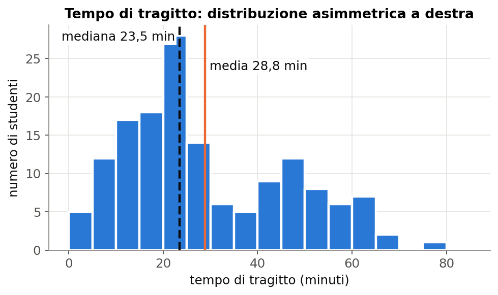{width=86%}

Distribuzione asimmetrica o con valori anomali: meglio la **mediana**.

## Indici di dispersione

- **intervallo**: massimo - minimo
- **quartili**: Q1 (25%), Q2 = mediana, Q3 (75%)
- **scarto interquartile** IQR = Q3 - Q1: la metà centrale dei valori
- **deviazione standard**: scarto tipico dalla media (scarti, quadrati, media, radice)

Massa: media 4202 g, deviazione standard 802 g; solo Chinstrap: 384 g

## Statistiche con pandas

```python
massa = pinguini["massa_g"]
massa.mean()            # 4201.8
massa.median()          # 4050.0
massa.std()             # 802.0
massa.quantile(0.25)    # 3550.0
pinguini.describe()     # count, mean, std, min, 25%, 50%, 75%, max
```

I valori mancanti vengono ignorati; `count` dice su quanti valori.

## Statistiche per gruppi: groupby

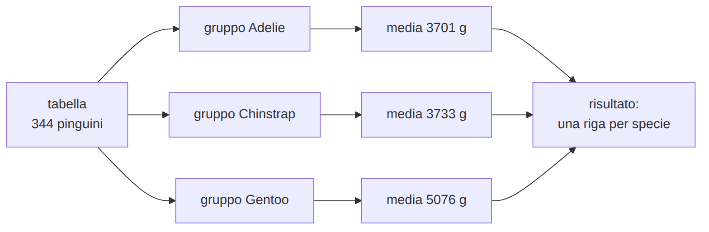{width=91%}

```python
pinguini.groupby("specie")["massa_g"].mean()
pinguini.groupby(["specie", "sesso"])["massa_g"].mean()
```

## Medie per specie

| specie | becco lungh. (mm) | becco prof. (mm) | pinna (mm) | massa (g) |
|---|---|---|---|---|
| Adelie | 38,8 | 18,3 | 190,0 | 3701 |
| Chinstrap | 48,8 | 18,4 | 195,8 | 3733 |
| Gentoo | 47,5 | 15,0 | 217,2 | 5076 |

- Gentoo: pinna lunga, massa alta, becco poco profondo
- Adelie e Chinstrap: differiscono per la **lunghezza del becco**

## Tabelle di frequenza

```python
pinguini["specie"].value_counts()
pd.crosstab(pinguini["isola"], pinguini["specie"])
pd.crosstab(pinguini["isola"], pinguini["specie"], normalize="index")
```

| isola | Adelie | Chinstrap | Gentoo |
|---|---|---|---|
| Biscoe | 44 | 0 | 124 |
| Dream | 56 | 68 | 0 |
| Torgersen | 52 | 0 | 0 |

## Laboratorio L4

Notebook `L4_statistiche.ipynb`

1. (base) medie delle misure per specie
2. (base) massa per specie e sesso; tabella isola-specie
3. (standard) i cinque pinguini più pesanti
4. (standard) media e mediana del tempo di tragitto
5. (approfondimento) IQR e deviazione standard per specie

# L5 - Pulire i dati

## Perché si pulisce

- `bus` e `Bus` contati come due mezzi
- `45 min`: l'intera colonna diventa testo
- 250 km invece di 2,5: la media raddoppia

Il risultato è sbagliato **senza avvisi**.

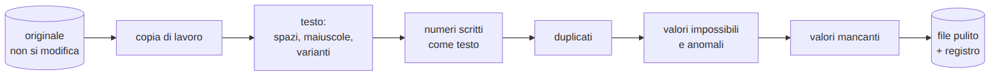{width=95%}

## Principi

- l'**originale non si modifica**: `dati = originale.copy()`
- ogni operazione è nel codice: **ripetibile**
- ogni decisione va nel **registro**
- non si inventano valori: se il vero valore è ignoto, diventa **mancante**

## Uniformare il testo

```python
dati["mezzo"] = dati["mezzo"].str.strip().str.lower()
correzioni = {"autobus": "bus", "pullman": "bus", "a piedi": "piedi",
              "bicicletta": "bici", "macchina": "auto", "in auto": "auto",
              "monopattino elettrico": "monopattino", "treno + bus": "treno"}
dati["mezzo"] = dati["mezzo"].replace(correzioni)
```

- `str.strip()` spazi, `str.lower()` minuscole
- dizionario `{variante: valore corretto}`, `replace`

23 varianti diventano 6 mezzi.

## Convertire in numero

```python
testo = dati["distanza_km"].astype(str).str.replace(",", ".")
dati["distanza_km"] = pd.to_numeric(testo, errors="coerce")
dati["tempo_min"] = pd.to_numeric(
    dati["tempo_min"].astype(str).str.extract(r"(\d+)")[0], errors="coerce")
```

- `errors="coerce"`: ciò che non è convertibile diventa `NaN`
- `r"(\d+)"`: espressione regolare, una o più cifre
- dopo la conversione: **controllare** minimo, massimo, mancanti

## Duplicati

```python
risposte = ["anno_corso", "mezzo", "distanza_km", "tempo_min", "fascia_partenza"]
dati[dati.duplicated(subset=risposte, keep=False)]   # esaminare
dati = dati.drop_duplicates(subset=risposte)         # eliminare
```

- `subset`: le copie hanno `id` e ora di invio diversi
- due studenti possono dare risposte identiche? con quali indizi si decide?

## Impossibili, anomali, reali

- **impossibile**: viola una regola certa (distanza -3, tempo 0)
- **anomalo**: fuori da [Q1 - 1,5 IQR, Q3 + 1,5 IQR]
- anomalo **non** vuol dire errore: 7 distanze anomale su 8 sono tragitti in treno reali

```python
dati.loc[dati["distanza_km"] <= 0, "distanza_km"] = np.nan
dati.loc[dati["distanza_km"] > 100, "distanza_km"] = np.nan
```

Soglie dal dizionario dei dati, decise **prima**.

## Valori mancanti

| strategia | pro | contro |
|---|---|---|
| eliminare (`dropna`) | semplice | campione ridotto, possibili distorsioni |
| sostituire (`fillna`) | righe conservate | valori inventati |
| lasciare | nessuna scelta arbitraria | da gestire nell'analisi |

Per i modelli servono righe **complete** nelle colonne usate.

## Il registro della pulizia

| operazione | coinvolti | motivazione |
|---|---|---|
| mezzo | da 23 varianti a 6 | coerenza |
| virgola decimale | 21 valori | formato |
| unità nel testo | 10 valori | formato |
| duplicati | 3 righe | invii ripetuti |
| impossibili | 2 valori | regole del dizionario |
| anomali errati | 2 valori | incompatibili con mezzo e soglie |
| `inviato_il` eliminata | 1 colonna | minimizzazione |

## Laboratorio L5

Notebook `L5_pulizia.ipynb`, `tragitti_esempio.csv` o CSV della classe

1. (base) uniformare il mezzo
2. (base) distanza e tempo in numero
3. (standard) duplicati
4. (standard) impossibili e anomali: errore o caso reale?
5. (approfondimento) mancanti: eliminare o sostituire; salvare e completare il registro

# L6 - Esplorare i dati con i grafici

## Analisi esplorativa

**EDA** (exploratory data analysis, John Tukey, 1977): statistiche e grafici per capire i dati, trovare regolarità e anomalie, formulare ipotesi.

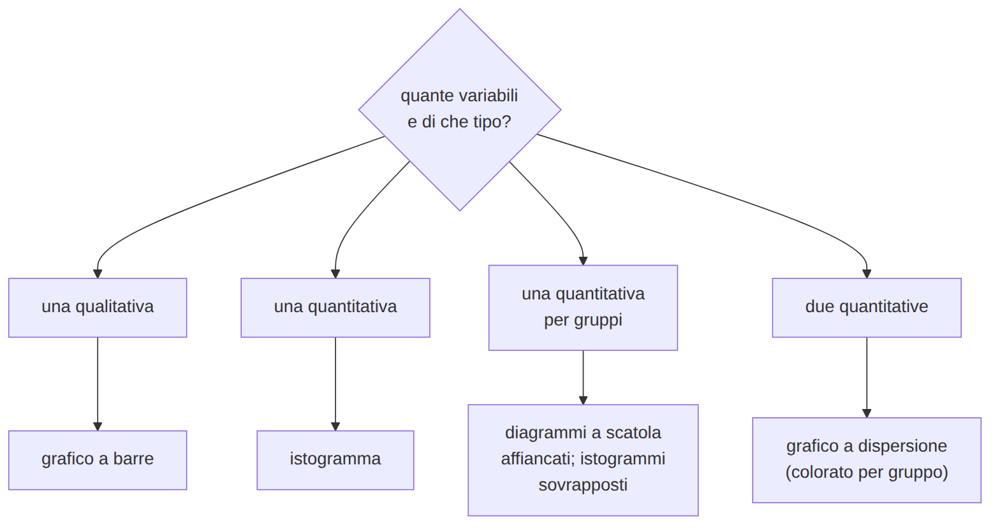{height=53%}

## matplotlib

```python
import matplotlib.pyplot as plt
plt.bar(["Adelie", "Chinstrap", "Gentoo"], [152, 68, 124])
plt.xlabel("specie")
plt.ylabel("numero di pinguini")
plt.title("Pinguini per specie")
plt.show()
```

- etichette con unità
- **stessa categoria, stesso colore** in tutti i grafici
- colore + forma o etichetta: circa l'8% dei maschi è daltonico

## Istogramma

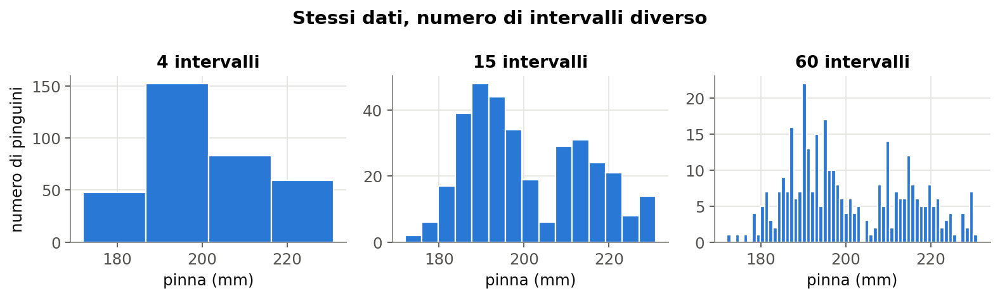{width=95%}

`plt.hist(valori, bins=20)`

Forme: simmetrica, asimmetrica, **bimodale** (due gruppi mescolati)

## Diagramma a scatola

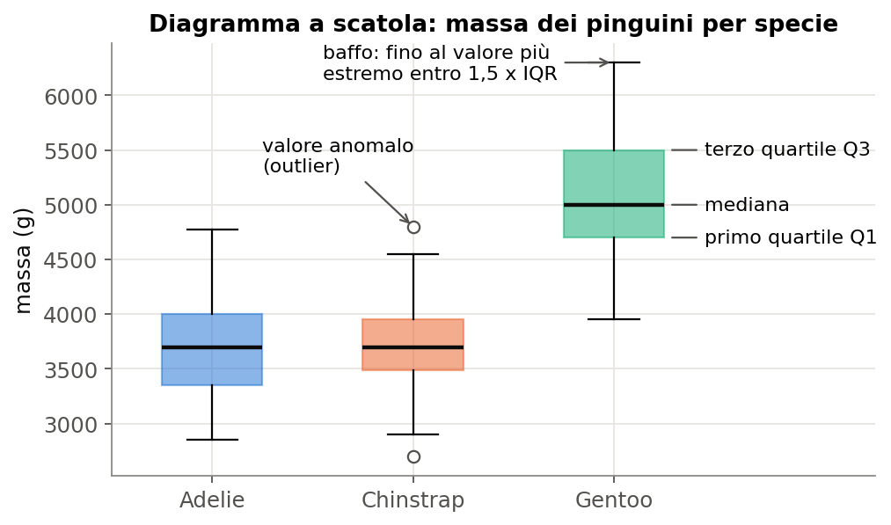{height=58%}

Il grafico per confrontare **gruppi**.

## Grafico a dispersione

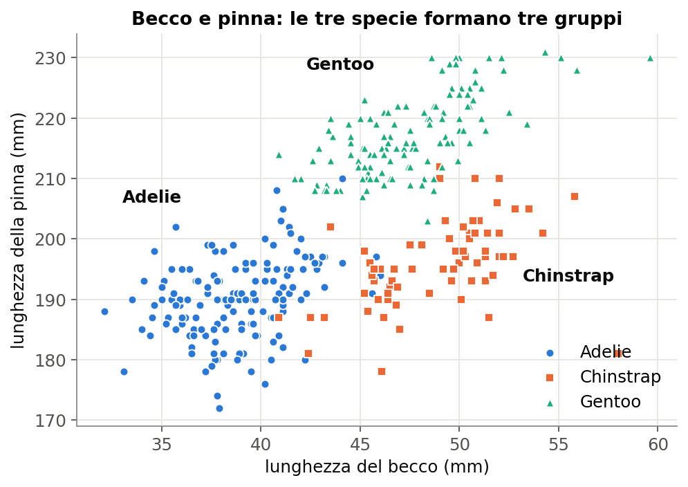{height=65%}

## Matrice dei grafici a dispersione

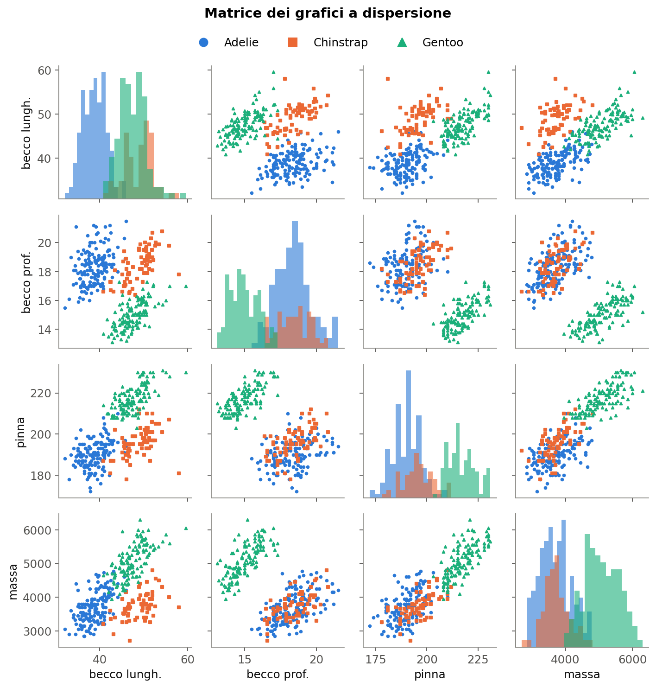{height=75%}

## Correlazione

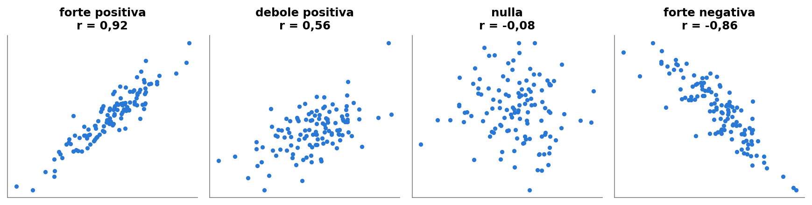{width=95%}

Pearson **r** tra -1 e 1: forza della relazione **lineare**

```python
pinguini[misure].corr()
pinguini["pinna_lunghezza_mm"].corr(pinguini["massa_g"])   # 0.87
```

## Limiti della correlazione

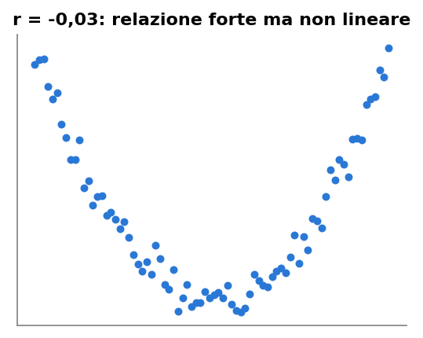{height=32%}

- solo relazioni **lineari**; sensibile ai valori anomali
- **paradosso di Simpson**: becco lunghezza-profondità r = -0,24 su tutti, positiva in ogni specie (0,39; 0,65; 0,64)

## Correlazione non è causalità

- **variabile confondente**: gelati e annegamenti, entrambi d'estate
- causa in direzione opposta
- coincidenza: https://www.tylervigen.com/spurious-correlations

Distanza e tempo (r circa 0,84): causalità plausibile per ragioni **fisiche**, non per la correlazione.

## Grafici fuorvianti

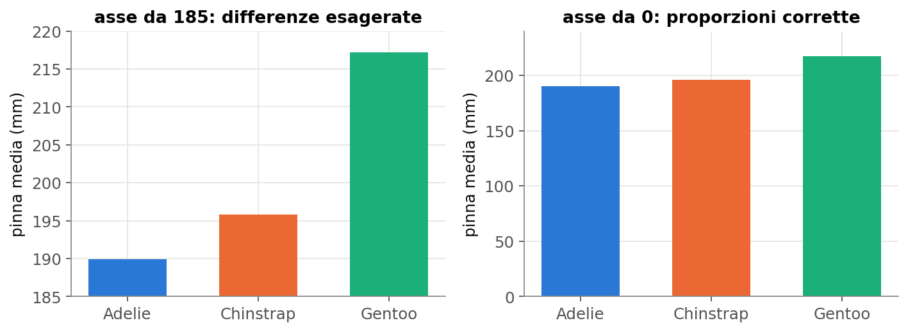{width=91%}

- barre con asse che non parte da zero
- scale diverse da confrontare, doppio asse
- dati selezionati, aree al posto delle lunghezze

## Laboratorio L6

Notebook `L6_grafici.ipynb`

1. (base) istogrammi e diagrammi a scatola per specie
2. (base) dispersione: quale coppia separa meglio le specie?
3. (standard) matrice, correlazioni, paradosso di Simpson
4. (standard) tragitti: tempo per mezzo, distanza e tempo
5. (approfondimento) distanza e tempo colorati per mezzo
