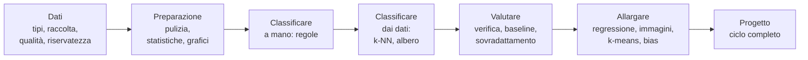

# Logica della progettazione didattica del corso B.6

## Finalità della traccia docenti

La traccia docenti accompagna il syllabus e ne spiega le scelte: perché gli argomenti sono stati selezionati e ordinati in questo modo, come il limite delle 18 ore ha determinato tagli e compressioni, quali strumenti usare e come inserirli nel corso, come condurre i laboratori e come valutare.

Ripartizione indicativa:

- traccia studenti: circa 16 ore
- traccia docenti: circa 2 ore, distribuite in brevi segmenti di 10-15 minuti al termine delle lezioni L3, L5, L9, L11, L13, L14 e nella seconda parte di L18

## Il problema didattico del corso

La descrizione del corso contiene tre richieste:

- come si raccoglie un dataset
- come "ragiona" un algoritmo di classificazione
- come si addestra un piccolo modello predittivo

Le tre richieste corrispondono a tre modi diversi di fallire nell'insegnamento della data science a scuola:

- un corso centrato sugli strumenti (pandas, scikit-learn) produce studenti che eseguono `fit` e `predict` senza sapere che cosa succede né se il risultato ha senso
- un corso centrato sugli algoritmi richiede matematica e programmazione che gli studenti non hanno, e lascia fuori i dati, che nella pratica occupano la maggior parte del lavoro
- un corso centrato sulle applicazioni di IA mostra risultati spettacolari ma non costruisce nessuna competenza trasferibile

La soluzione adottata:

- il ciclo della data science come struttura del corso: ogni lezione è una fase del ciclo, e il ciclo viene percorso più volte
- i dati prima dei modelli: sei ore su diciotto sono dedicate a raccolta, pulizia ed esplorazione
- ogni algoritmo viene prima eseguito a mano, su carta o con pochi punti, e poi con scikit-learn; il codice conferma ciò che gli studenti hanno già capito
- la valutazione come parte integrante del modello: nessun risultato è accettato senza verifica su dati non visti e confronto con una baseline

Diagramma: progressione dei contenuti

## Scelte sui contenuti

### Due dataset principali

- Palmer Penguins: dati reali, pochi e comprensibili (344 righe, 8 colonne), con variabili qualitative e quantitative, pochi valori mancanti, tre classi separabili ma non banalmente. È stato proposto dalle autrici come alternativa al dataset Iris ed è rilasciato con licenza CC0, quindi utilizzabile e modificabile senza vincoli; nel corso viene fornito anche con i nomi delle colonne tradotti in italiano. Citazione raccomandata: Horst AM, Hill AP, Gorman KB (2020), palmerpenguins: Palmer Archipelago (Antarctica) penguin data, https://allisonhorst.github.io/palmerpenguins/
- dataset della classe sui tragitti casa-scuola: raccolto dagli studenti in L2, necessariamente imperfetto. Serve a mostrare che la pulizia dei dati non è un esercizio artificiale e che le scelte di raccolta (domande, unità, valori ammessi) determinano la qualità del risultato. Il tema è stato scelto perché non riguarda dati sensibili, è comprensibile a tutti e contiene una relazione prevedibile (distanza e tempo) e una classificazione sensata (mezzo di trasporto).

Per le classi in cui la raccolta non è possibile o produce troppo pochi dati, il corso fornisce un dataset sintetico dei tragitti con errori inseriti in modo calibrato.

### Perché k-NN e alberi di decisione

Sono i due classificatori che uno studente di 16 anni può eseguire a mano e spiegare a un compagno:

- k-NN si basa su un'idea intuitiva (somigliare ai vicini) e sulla distanza euclidea, già nota dalla geometria; permette di introdurre la scala delle caratteristiche e l'effetto di un iperparametro (k)
- l'albero di decisione produce regole leggibili, confrontabili con quelle scritte dagli studenti in L7: è il collegamento diretto tra "regole scritte da una persona" e "regole ricavate dai dati"

La regressione logistica, le macchine a vettori di supporto e le foreste casuali sono state escluse: richiedono concetti (probabilità condizionata, ottimizzazione, combinazione di modelli) che non si possono trattare in modo onesto nel tempo disponibile. Le reti neurali sono affidate al corso B.8.

### Perché la regressione e il k-means

La descrizione del corso parla di "piccolo modello predittivo". La regressione lineare (L12) è il modello predittivo più semplice e mostra che la previsione non è sempre una classe. Il k-means (L15) completa il quadro minimo dell'apprendimento automatico con un esempio di apprendimento non supervisionato; il confronto tra i gruppi trovati e le specie reali dei pinguini rende evidente la differenza tra i due tipi di apprendimento.

### Perché le immagini senza codice

Teachable Machine (L13) permette in 30 minuti di raccogliere un dataset, addestrare un classificatore di immagini e verificarne i limiti. Serve a due scopi: estendere alle immagini i concetti già visti (raccolta, bilanciamento, verifica), e mostrare in modo immediato le scorciatoie apprese, tema di L14. Il funzionamento interno delle reti neurali resta materia di B.8.

### Raccolta dei dati e riservatezza

La raccolta dei dati della classe è progettata per non trattare dati personali identificativi:

- nessun nome, indirizzo, data di nascita o altro identificativo diretto
- nessun dato particolare (salute, opinioni, origine)
- risposte per fasce (anno di corso, fascia oraria) dove il dettaglio non serve
- in classi piccole, attenzione alle combinazioni di risposte che identificano una persona (tema trattato in B.4, L10)

Il questionario può essere su carta, su un modulo online dell'account della scuola, o su un foglio condiviso. Prima di usare un servizio online occorre verificare che sia tra quelli autorizzati dall'istituto.

## Effetti del limite di 18 ore

Un'introduzione alla data science e al machine learning di livello universitario occupa uno o due semestri; i curricula open source di riferimento (Microsoft Data Science for Beginners e ML for Beginners) sono organizzati rispettivamente in 10 e 12 settimane. Con 18 ore sono state fatte le scelte seguenti.

Contenuti esclusi o ridotti:

- programmazione: Python non viene insegnato in modo sistematico; ogni riga di codice mostrata viene spiegata, ma il corso non fornisce competenze di programmazione autonoma (compito di B.8)
- statistica: solo statistica descrittiva; probabilità, inferenza, test di ipotesi e intervalli di confidenza esclusi
- basi di dati e SQL: esclusi; i dati sono sempre in file CSV
- raccolta automatica di dati dal web (web scraping) e interfacce di programmazione (API): esclusi; citati come fonti in L2
- algoritmi: esclusi regressione logistica, SVM, foreste casuali, gradient boosting, riduzione della dimensionalità; le reti neurali sono affidate a B.8
- metriche: escluse curve ROC, AUC, F1 (citata come combinazione di precisione e richiamo); la validazione incrociata è presentata in forma introduttiva
- pipeline e preelaborazione avanzata: la standardizzazione è trattata, le pipeline di scikit-learn no
- norme sull'IA e avvelenamento dei dati: affidati a B.4 e solo richiamati in L14

Scelte strutturali dovute al monte ore:

- lezioni autonome di un'ora con un laboratorio che produce un risultato osservabile
- notebook forniti già scritti, con celle da eseguire, parametri da modificare e poche righe da completare; ogni notebook ha esercizi su tre livelli (base, standard, approfondimento)
- dataset preparati in anticipo, tranne quello della classe, per ridurre i tempi morti
- progetto finale su tre ore invece delle cinque o sei che un progetto completo richiederebbe: le fasi sono guidate da una scheda e il notebook di partenza è fornito

## Scelte sugli strumenti

Criteri: PC di fascia bassa, nessun privilegio di amministratore, funzionamento anche senza rete, nessun account obbligatorio per gli studenti.

| Esigenza | Strumento principale | Alternativa | Motivazione |
|---|---|---|---|
| primo contatto con un CSV | LibreOffice Calc | qualunque foglio di calcolo | strumento noto, abbassa la soglia d'ingresso; LibreOffice Portable non richiede installazione |
| notebook | JupyterLite | WinPython da chiavetta; Colab se abilitato dall'istituto | stesso materiale online e offline; nessun account |
| classificazione di immagini | Teachable Machine | k-NN sulle cifre 8x8 in un notebook | nessun codice, nessun account, esecuzione nel browser |
| programmazione visuale (facoltativa) | Orange Data Mining, versione portable | notebook | per classi senza alcuna esperienza di programmazione |

## Gli strumenti del laboratorio: analisi per il docente

### Notebook Jupyter nella didattica

Il notebook unisce in un unico documento spiegazione, codice eseguibile e risultati. Per la didattica laboratoriale offre:

- esecuzione a piccoli passi: ogni cella produce un risultato immediato che lo studente può osservare prima di proseguire
- spiegazione accanto al codice: le celle Markdown contengono consegne, domande e spazi per le risposte
- scaffolding graduato: celle complete da eseguire, celle con parametri da modificare, celle con righe da completare (`___`), celle vuote per gli esercizi di approfondimento
- verifica automatica: funzioni di controllo che danno un riscontro immediato (nel corso: la funzione `controlla`)
- documento finale consegnabile: il notebook eseguito, con grafici e risposte, è il prodotto del laboratorio

Debolezze da gestire:

- stato nascosto: le celle possono essere eseguite in ordine qualunque; una variabile può esistere perché definita in una cella poi cancellata. Regola d'aula: in caso di dubbio, "riavvia il kernel ed esegui tutto"
- esecuzione passiva: lo studente può premere Maiusc+Invio su tutte le celle senza leggere. Contromisura: domande di interpretazione tra le celle, previsione del risultato prima dell'esecuzione
- file `.ipynb` poco leggibili fuori da Jupyter e difficili da confrontare; per la consegna si può esportare in HTML o PDF

### JupyterLite

JupyterLab eseguito interamente nel browser tramite WebAssembly: nessuna installazione, nessun server, nessun account. Il codice gira sul PC dello studente.

- pro: funziona su qualunque PC con un browser recente; dopo il primo caricamento l'interfaccia è in cache; pandas, NumPy, matplotlib e scikit-learn sono disponibili
- contro: il primo caricamento scarica alcune decine di MB; la prima importazione di scikit-learn richiede alcuni secondi; i file restano nella memoria del browser di quella postazione, quindi gli studenti devono scaricare il notebook a fine lezione; su PC molto lenti i calcoli sono più lenti che in Python nativo (irrilevante con i dataset del corso)
- inserimento nel corso: aprire JupyterLite su tutte le postazioni prima della lezione; distribuire notebook e CSV su chiavetta o cartella condivisa; caricarli con il pulsante di upload

### WinPython

Distribuzione Python portable per Windows: si scompatta in una cartella, anche su chiavetta, e contiene JupyterLab, pandas e scikit-learn nella versione "slim" (circa 670 MB). È la soluzione per laboratori senza rete o con browser vecchi. Va preparata una volta dal docente e copiata sulle postazioni o sulle chiavette.

### Google Colab

Notebook Jupyter eseguiti su server Google, salvati su Google Drive.

- pro: nessuna installazione, prestazioni indipendenti dal PC, condivisione immediata tramite link, commenti, integrazione con Drive; utile anche per lavoro a casa
- contro: richiede un account Google e connessione stabile; le sessioni inattive vengono chiuse e le risorse gratuite non sono garantite; per gli utenti Google Workspace for Education minorenni l'accesso richiede che l'amministratore abiliti il servizio e, secondo le domande frequenti di Colab, il consenso dei genitori; le funzioni di IA integrate richiedono account di utenti maggiorenni. I dati caricati risiedono su server esterni
- conclusione per il corso: Colab è un'alternativa, non lo strumento principale. Tutti i notebook funzionano anche in Colab senza modifiche, ma il corso non dipende da esso

Riferimento: Google Colab, domande frequenti, https://research.google.com/colaboratory/faq.html

### Kaggle

Kaggle (di proprietà di Google) è una piattaforma di data science con quattro componenti rilevanti per la scuola:

- Datasets: centinaia di migliaia di dataset pubblici, ciascuno con descrizione, licenza e notebook di esempio; utile al docente per trovare dati per esercitazioni e progetti. La qualità e la licenza vanno verificate caso per caso
- Notebooks (Code): ambiente di notebook su server, simile a Colab, con i dataset già collegati; permette di vedere come altre persone analizzano lo stesso dataset
- Learn: micro-corsi gratuiti in inglese, di poche ore ciascuno, con esercizi in notebook verificati automaticamente e attestato finale
- Competitions: competizioni pubbliche e competizioni di comunità, che un docente può creare per la propria classe con un dataset e una metrica di valutazione

Micro-corsi di Kaggle Learn più adatti alla scuola secondaria, in ordine di uso:

- Intro to Programming e Python: prerequisiti di programmazione, per chi non ha seguito B.8
- Pandas: approfondimento dei moduli 1-2
- Data Visualization: approfondimento di L6
- Intro to Machine Learning: approfondimento dei moduli 3-4; usa alberi di decisione e foreste casuali su dati immobiliari
- Data Cleaning: approfondimento di L5
- Intro to AI Ethics: approfondimento di L14

Uso didattico:

- per il docente: fonte di dataset, esempi di analisi, formazione personale con i micro-corsi
- per gli studenti: approfondimento individuale facoltativo, non attività obbligatoria in classe; i corsi sono in inglese e presuppongono una certa autonomia
- competizione di classe: dopo il modulo 3, una competizione di comunità sul dataset della classe o su un dataset aperto rende concreta la separazione tra dati di addestramento e di verifica (la classifica è calcolata su dati che gli studenti non vedono)

Vincoli: Kaggle richiede un account; per i minori è prevista una procedura di consenso del genitore o tutore (https://www.kaggle.com/guardian-consent-minor-use). Prima di proporlo agli studenti occorre verificare i termini d'uso vigenti e le regole dell'istituto. Nessuna attività del corso richiede Kaggle.

Riferimento: Kaggle Learn, https://www.kaggle.com/learn

### Teachable Machine

Strumento web di Google per addestrare classificatori di immagini, suoni e pose, senza codice. Usa un modello già addestrato e ne adatta l'ultima parte agli esempi forniti (apprendimento per trasferimento). Verifiche prima dell'uso: raggiungibilità dalla rete della scuola, permessi della webcam nel browser, politiche dell'istituto sulle immagini. Le immagini raccolte non devono ritrarre volti di studenti: si usano oggetti.

Riferimento: https://teachablemachine.withgoogle.com/

### Orange Data Mining (facoltativo)

Ambiente di programmazione visuale per l'analisi dei dati, sviluppato dall'Università di Lubiana: i passaggi (caricamento, pulizia, modello, valutazione) sono blocchi collegati con frecce. È disponibile in versione portable per Windows. È un'alternativa per classi o studenti per cui il codice è un ostacolo eccessivo; il corso non lo usa come strumento principale perché i concetti restano gli stessi e i notebook sono più trasferibili.

Riferimento: https://orangedatamining.com/download/

## Struttura della lezione di laboratorio

Schema tipico di una lezione di un'ora:

1. richiamo (5 min): un grafico, una tabella o un risultato da interpretare
2. spiegazione con dimostrazione (20-25 min): il docente esegue il notebook alla cattedra, facendo prevedere agli studenti il risultato prima di ogni cella importante
3. laboratorio (25-30 min): notebook a coppie con esercizi su tre livelli (base, standard, approfondimento)
4. chiusura (5 min): una domanda di interpretazione a cui ogni coppia risponde

Lavoro a coppie con ruoli alternati (chi usa la tastiera, chi legge le consegne e controlla): riduce il tempo perso sui problemi tecnici e obbliga a verbalizzare le scelte.

Tre attività si svolgono senza computer: regole di classificazione su schede (L7), k-NN su carta (L8), impurità di Gini a mano (L9), k-means su carta (L15). Servono a costruire il modello mentale dell'algoritmo prima che il codice lo nasconda.

## Valutazione

- formativa: esercizi dei notebook con verifica automatica e domande di interpretazione; la domanda di chiusura di ogni lezione
- verifiche di modulo: al termine dei moduli 2, 3 e 4, un breve notebook su un dataset non visto (per esempio misure di altre specie animali o dati aperti) con domande di interpretazione
- progetto finale (L16-L18): valutato con rubrica su quattro dimensioni

| Dimensione | Descrittori |
|---|---|
| dati | domanda chiara; dizionario dei dati; pulizia documentata; grafici pertinenti e commentati |
| modello e valutazione | baseline; almeno due modelli; valutazione su dati non visti; nessun errore metodologico (per esempio valutare sui dati di addestramento) |
| interpretazione e limiti | analisi degli errori; bias e limiti dei dati individuati; conclusioni proporzionate ai risultati |
| comunicazione | presentazione chiara per un pubblico non tecnico; notebook leggibile |

## Coordinamento con gli altri corsi

- B.8: B.8 costruisce a mano il neurone e la discesa del gradiente; B.6 usa i modelli tramite scikit-learn e si concentra su dati e valutazione. Se B.8 precede B.6, gli studenti possono svolgere gli esercizi di approfondimento; se lo segue, B.8 può riusare i pinguini come dataset
- B.4: B.6 spiega costruzione e valutazione dei classificatori, che B.4 (L11-L13) usa come oggetto di attacco e difesa. Falsi positivi e falsi negativi, trattati in B.4 per il phishing, coincidono con la matrice di confusione di L10
- B.2: il dibattito su bias e impatto sociale di B.2 trova in L14 la spiegazione tecnica
- B.1: i dataset scientifici di B.1 sono candidati per il progetto finale

## Adattamento ad altri monte ore

- 12 ore: unire L1 e L2, unire L4 e L5, unire L8 e L9 (solo albero di decisione con richiamo intuitivo al k-NN), togliere L15, ridurre il progetto a due lezioni
- 24-30 ore: aggiungere una lezione di statistica (probabilità e variabilità del campione), una sulla regressione logistica e la curva ROC, una sulle foreste casuali, una competizione di classe su Kaggle, e portare il progetto a sei ore con una fase di revisione tra gruppi

## Materiale open source di riferimento

Verifica complessiva sul syllabus: esistono curricula open source che coprono gran parte degli argomenti, ma nessuno con gli stessi vincoli (lingua italiana, 18 ore, nessun prerequisito di programmazione, dati raccolti dalla classe, PC di fascia bassa senza installazioni). La verifica puntuale viene ripetuta per ogni lezione al momento della stesura.

Criterio adottato: le lezioni sono scritte da zero. Dove è utile, riusano parti di materiali esistenti, tradotte in italiano, compatibili con la licenza e accompagnate da un'attribuzione esplicita nel punto in cui compaiono (autore, titolo, licenza, URL completo).

Materiali individuati:

- Microsoft, Data Science for Beginners: 20 lezioni in 10 settimane, licenza MIT, con traduzione italiana. Copre definizioni, etica, tipi di dati, statistica, preparazione e visualizzazione dei dati, ciclo di vita della data science; usa pandas e notebook. Molto vicino ai moduli 1 e 2, ma presuppone Python, dedica molto spazio a database e cloud e non tratta i modelli di classificazione. https://github.com/microsoft/Data-Science-For-Beginners
- Microsoft, ML for Beginners: 26 lezioni in 12 settimane, licenza MIT, traduzioni in molte lingue. Copre regressione, classificazione, clustering, elaborazione del linguaggio, serie temporali; usa scikit-learn. Vicino ai moduli 3 e 4, ma i dataset (cucine del mondo, zucche, musica nigeriana) e il ritmo sono pensati per studenti universitari o autodidatti con basi di Python. https://github.com/microsoft/ML-For-Beginners
- Google, Machine Learning Crash Course: corso con video, visualizzazioni interattive ed esercizi, disponibile in italiano; utile al docente come formazione e per alcune visualizzazioni (classificazione, soglie, equità). https://developers.google.com/machine-learning/crash-course
- MLU-Explain (Amazon Machine Learning University): spiegazioni visuali interattive, tra cui alberi di decisione, insiemi di addestramento e verifica, precisione e richiamo, validazione incrociata, compromesso bias-varianza; utilizzabili come dimostrazione in L9-L11. La licenza va verificata prima di un riuso dei contenuti; il collegamento alla pagina è sempre possibile. https://mlu-explain.github.io/
- Kaggle Learn: micro-corsi gratuiti ma non open source; usati solo come collegamento per l'approfondimento. https://www.kaggle.com/learn
- Palmer Penguins (CC0): dataset di riferimento del corso. https://allisonhorst.github.io/palmerpenguins/
