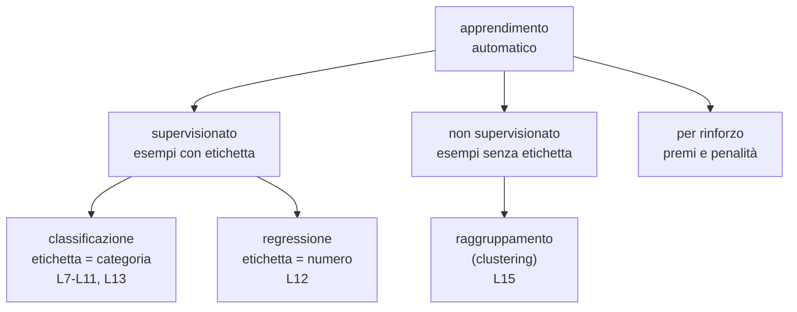
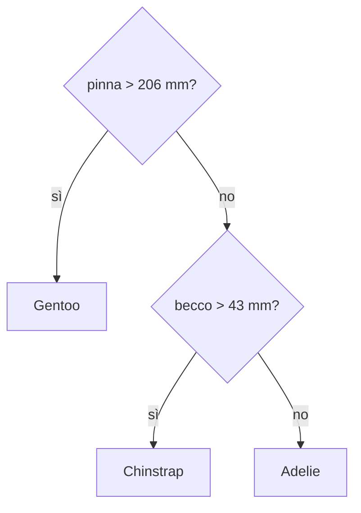
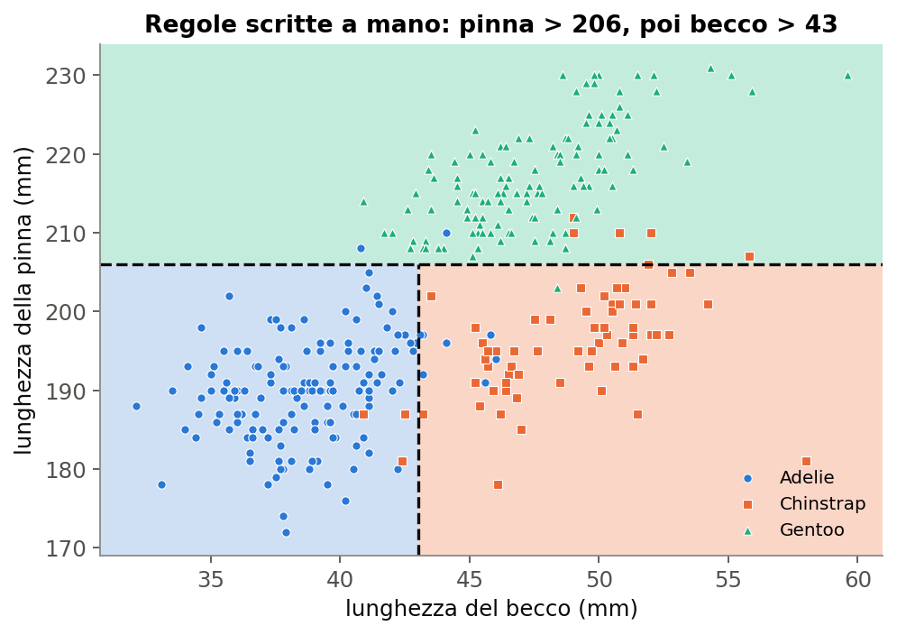
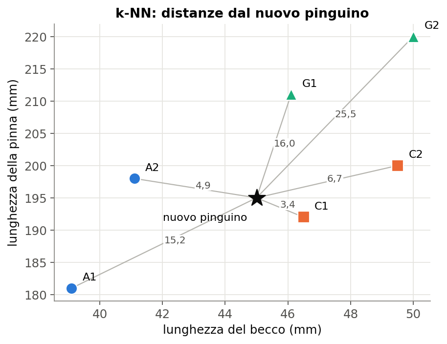
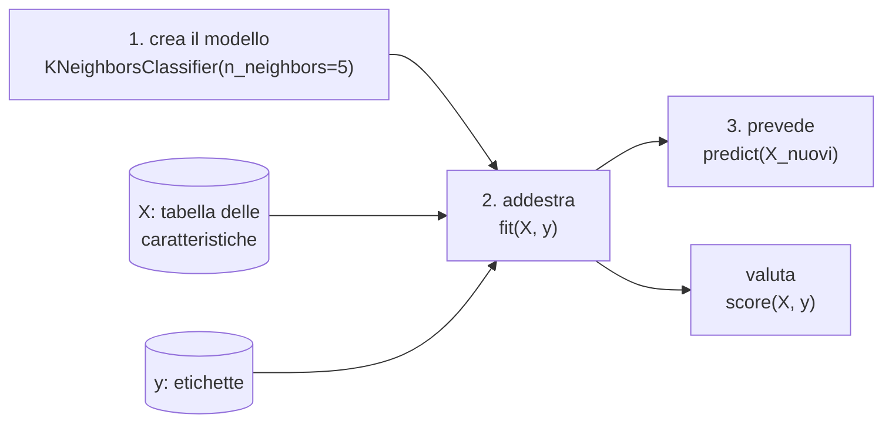
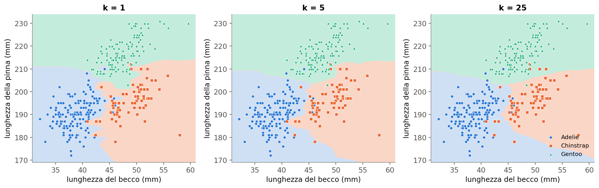
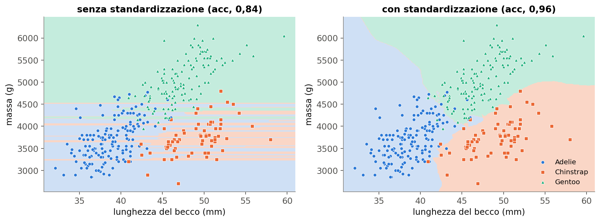
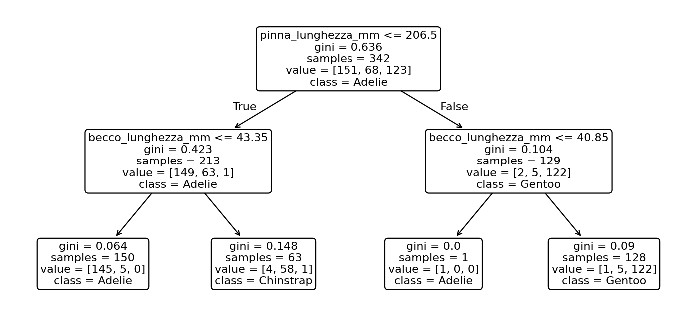
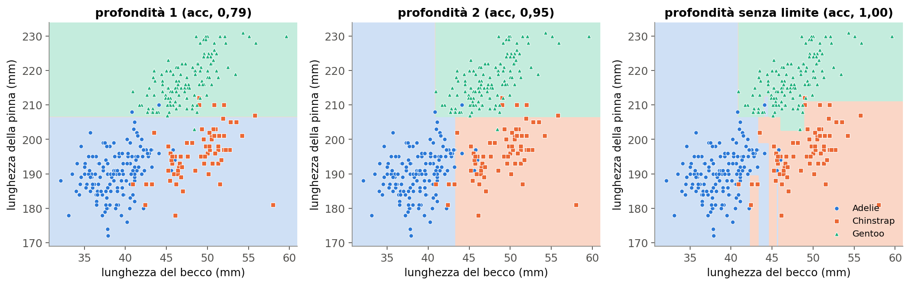

# Lezione L7 - Il problema della classificazione e le regole scritte a mano

## Obiettivi della lezione

- distinguere apprendimento supervisionato e non supervisionato
- distinguere classificazione e regressione
- usare correttamente i termini esempio, caratteristica, etichetta, classe, previsione
- scrivere un classificatore a regole e misurarne l'accuratezza
- rappresentare un classificatore con il suo confine di decisione
- spiegare i limiti delle regole scritte a mano

## Tipi di apprendimento

- Apprendimento supervisionato
  il modello impara da esempi di cui è nota la risposta corretta (etichetta). Dopo l'addestramento prevede l'etichetta di esempi nuovi. Esempio: dalle misure di pinguini di specie nota, imparare a riconoscere la specie.
- Apprendimento non supervisionato
  gli esempi non hanno etichetta; il modello cerca una struttura nei dati, per esempio gruppi di esempi simili (L15).
- Apprendimento per rinforzo
  un agente impara per tentativi, ricevendo premi o penalità dalle conseguenze delle proprie azioni (giochi, robotica). Non è trattato nel corso.

Nell'apprendimento supervisionato il tipo di etichetta distingue due problemi:

- Classificazione
  l'etichetta è una categoria: specie del pinguino, messaggio legittimo o phishing, mezzo di trasporto.
- Regressione
  l'etichetta è un numero: massa del pinguino, tempo di tragitto, temperatura di domani (L12).

Diagramma: tipi di apprendimento automatico

<!-- diag: tipi-apprendimento -->


## Termini

- Esempio (osservazione, istanza)
  una riga del dataset: un pinguino.
- Caratteristiche (feature)
  le variabili usate per decidere: lunghezza del becco, lunghezza della pinna.
- Etichetta
  la risposta corretta: la specie.
- Classi
  i valori possibili dell'etichetta: Adelie, Chinstrap, Gentoo.
- Classificatore
  procedura che riceve le caratteristiche di un esempio e restituisce una classe.
- Previsione
  la classe restituita dal classificatore; può essere giusta o sbagliata.
- Accuratezza
  frazione di esempi per cui la previsione coincide con l'etichetta vera. Con 342 pinguini e 323 previsioni corrette l'accuratezza è 323 / 342 = 0,944, cioè 94,4%.

## Un classificatore a regole

In L4 e L6 si è osservato che i Gentoo hanno la pinna più lunga e che Adelie e Chinstrap si distinguono per la lunghezza del becco. Da queste osservazioni si può scrivere un classificatore:

1. se la pinna è più lunga di 206 mm, allora Gentoo
2. altrimenti, se il becco è più lungo di 43 mm, allora Chinstrap
3. altrimenti Adelie

Le regole si applicano nell'ordine: la prima condizione vera decide.

Diagramma: le regole come sequenza di domande

<!-- diag: regole -->


In Python:

```python
def classifica(becco, pinna):
    if pinna > 206:
        return "Gentoo"
    elif becco > 43:
        return "Chinstrap"
    else:
        return "Adelie"
```

- `def nome(parametri):` definisce una funzione; il corpo è il blocco indentato
- `if`, `elif` (altrimenti se), `else` (altrimenti): esecuzione condizionata; l'indentazione indica quali istruzioni appartengono a ciascun ramo
- `return`: restituisce il risultato

Applicate a tutti i 342 pinguini, queste regole danno un'accuratezza di 0,944.

Tabella degli errori (righe: specie vera; colonne: specie prevista):

| | prevista Adelie | prevista Chinstrap | prevista Gentoo |
|---|---|---|---|
| Adelie | 142 | 7 | 2 |
| Chinstrap | 4 | 59 | 5 |
| Gentoo | 0 | 1 | 122 |

La diagonale contiene le previsioni corrette; gli altri numeri sono errori. La tabella mostra quali specie vengono confuse: soprattutto Adelie e Chinstrap.

## Il confine di decisione

Ogni classificatore divide lo spazio delle caratteristiche in zone, una per classe: ogni punto del piano riceve la classe che il classificatore assegnerebbe a un pinguino con quelle misure.

- Confine di decisione
  linea (o superficie, con più caratteristiche) che separa le zone di classi diverse.

{width=80%}

Le regole a soglia producono confini fatti di segmenti orizzontali e verticali, perché ogni regola confronta una sola caratteristica con un valore. Gli errori sono i pinguini che cadono nella zona di un'altra specie, concentrati dove le specie si sovrappongono.

## Limiti delle regole scritte a mano

- le soglie sono scelte guardando un piccolo numero di esempi e possono non essere le migliori
- con molte caratteristiche e molte classi diventa impossibile scrivere regole a mano
- migliorare le regole oltre un certo punto richiede tentativi sempre più lunghi
- regole ottimizzate guardando tutti gli esempi funzionano bene su quegli esempi, non necessariamente su esempi nuovi

L'apprendimento automatico risolve i primi tre problemi: un algoritmo cerca le regole, o un altro tipo di modello, a partire dagli esempi. Il quarto problema resta ed è l'argomento di L10-L11.

## Laboratorio L7

Durata indicativa: 30 minuti. Materiali: `L7_schede_pinguini.md` (schede da stampare), notebook `L7_regole.ipynb`, `L7_schede_pinguini.csv`, `pinguini.csv`.

Esercizio 1 (base, senza computer, 12 minuti): ogni gruppo riceve 24 schede di pinguini; su 12 la specie è indicata. Scrivere al massimo tre regole che riconoscono le specie e applicarle alle altre 12 schede.

Esercizio 2 (base): trascrivere le regole nella funzione `classifica` del notebook e calcolarne l'accuratezza sulle 24 schede; individuare le schede classificate male.

Esercizio 3 (standard): calcolare l'accuratezza delle regole su tutti i 342 pinguini e costruire la tabella degli errori. L'accuratezza è più alta o più bassa di quella sulle schede? Perché?

Esercizio 4 (standard): disegnare il confine di decisione delle regole; modificare le soglie per ridurre gli errori.

Esercizio 5 (approfondimento): scrivere regole che usano anche la profondità del becco e confrontarne l'accuratezza.

# Lezione L8 - Il classificatore k-NN: decidere guardando i vicini

## Obiettivi della lezione

- descrivere l'algoritmo k-NN
- calcolare la distanza euclidea tra due esempi
- applicare il k-NN a mano su pochi esempi
- usare scikit-learn: creare, addestrare e usare un modello
- descrivere l'effetto di k sul confine di decisione
- spiegare perché le caratteristiche vanno portate sulla stessa scala

## L'idea

- k-NN (k nearest neighbors, k vicini più prossimi)
  classificatore che assegna a un nuovo esempio la classe più frequente tra i k esempi di addestramento più simili, cioè più vicini nello spazio delle caratteristiche.

Non c'è una regola esplicita: il modello è l'insieme degli esempi stessi. "Addestrare" un k-NN significa memorizzare gli esempi; il lavoro avviene al momento della previsione.

Algoritmo, per un nuovo esempio:

1. calcolare la distanza tra il nuovo esempio e ogni esempio di addestramento
2. ordinare gli esempi per distanza crescente
3. prendere i primi k
4. assegnare la classe più frequente tra i k (voto a maggioranza)

## La distanza euclidea

Distanza tra due punti del piano (x1, y1) e (x2, y2), dal teorema di Pitagora:

distanza = radice quadrata di ((x1 - x2)² + (y1 - y2)²)

Con più caratteristiche si sommano i quadrati delle differenze di tutte le caratteristiche: la formula resta la stessa in 3, 4 o 100 dimensioni, anche se non si può più disegnare.

Esempio: nuovo pinguino con becco 45,0 mm e pinna 195 mm; pinguino A2 con becco 41,1 mm e pinna 198 mm.

- differenze: 45,0 - 41,1 = 3,9; 195 - 198 = -3
- quadrati: 15,21 e 9
- somma: 24,21; radice: 4,92

{width=70%}

| pinguino | specie | distanza | posizione |
|---|---|---|---|
| C1 | Chinstrap | 3,35 | 1 |
| A2 | Adelie | 4,92 | 2 |
| C2 | Chinstrap | 6,73 | 3 |
| A1 | Adelie | 15,19 | 4 |
| G1 | Gentoo | 16,04 | 5 |
| G2 | Gentoo | 25,50 | 6 |

- k = 1: il vicino è C1, previsione Chinstrap
- k = 3: C1, A2, C2; due voti Chinstrap e uno Adelie, previsione Chinstrap
- k = 5: due Chinstrap, due Adelie, un Gentoo: parità

Parità: si usa di solito un k dispari (con due classi evita la parità), oppure si pesa il voto con la distanza (i vicini più vicini contano di più). scikit-learn, in caso di parità, sceglie la prima classe in ordine alfabetico tra quelle a pari merito.

## scikit-learn

- scikit-learn
  libreria Python open source per l'apprendimento automatico, con decine di modelli che condividono la stessa interfaccia. Introduzione: https://scikit-learn.org/stable/getting_started.html
- Stimatore
  nome che scikit-learn dà a un modello. Ogni stimatore si usa con gli stessi passi.

Diagramma: il flusso di lavoro di scikit-learn

<!-- diag: sklearn -->


```python
from sklearn.neighbors import KNeighborsClassifier

X = pinguini[["becco_lunghezza_mm", "pinna_lunghezza_mm"]]
y = pinguini["specie"]
modello = KNeighborsClassifier(n_neighbors=5)
modello.fit(X, y)
modello.predict(pd.DataFrame({"becco_lunghezza_mm": [45.0], "pinna_lunghezza_mm": [195]}))
modello.score(X, y)
```

- `from ... import ...`: importa un solo elemento da una libreria
- `X`: per convenzione, tabella delle caratteristiche (maiuscola perché è una tabella); `y`: etichette
- `KNeighborsClassifier(n_neighbors=5)`: crea un k-NN con k = 5; `n_neighbors` è un iperparametro, cioè un parametro scelto da chi costruisce il modello e non appreso dai dati
- `fit(X, y)`: addestra
- `predict(nuovi)`: restituisce le previsioni per una tabella di nuovi esempi con le stesse colonne
- `score(X, y)`: accuratezza delle previsioni su `X` rispetto a `y`

## L'effetto di k

{width=100%}

- k piccolo: il confine segue ogni singolo esempio, anche quelli "fuori posto"; compaiono piccole isole di una classe dentro la zona di un'altra
- k grande: il confine è più regolare; i casi isolati vengono ignorati; con k molto grande il modello tende a prevedere la classe più numerosa

Accuratezza misurata sugli stessi pinguini usati per addestrare: 1,000 con k = 1; 0,962 con k = 5; 0,944 con k = 25. Il valore 1,000 per k = 1 non indica un modello perfetto: ogni pinguino è il vicino più vicino di sé stesso. Questo modo di valutare è ingannevole; il modo corretto è l'argomento di L10.

## La scala delle caratteristiche

La distanza somma le differenze di tutte le caratteristiche. Se una caratteristica ha valori molto più grandi delle altre, domina la distanza.

Esempio: lunghezza del becco (32-60 mm) e massa (2700-6300 g). Una differenza di 10 mm nel becco è grande per un pinguino; una differenza di 10 g nella massa è irrilevante, ma nella distanza pesano uguale. Di fatto il k-NN guarda quasi solo la massa.

- Standardizzazione
  trasformazione che porta ogni caratteristica ad avere media 0 e deviazione standard 1: si sottrae la media e si divide per la deviazione standard. Dopo la trasformazione un valore indica di quante deviazioni standard l'esempio si scosta dalla media.
- Normalizzazione (min-max)
  trasformazione che porta ogni caratteristica nell'intervallo tra 0 e 1. Alternativa più semplice, più sensibile ai valori anomali.

{width=100%}

Senza standardizzazione le zone sono quasi strisce orizzontali, perché decide solo la massa: l'accuratezza è 0,84. Con la standardizzazione il becco torna a contare: 0,96.

```python
from sklearn.preprocessing import StandardScaler

scala = StandardScaler().fit(X)        # calcola media e deviazione standard di ogni colonna
X_std = scala.transform(X)             # applica la trasformazione
modello = KNeighborsClassifier(n_neighbors=5).fit(X_std, y)
```

I nuovi esempi vanno trasformati con la stessa scala, calcolata sui dati di addestramento: `modello.predict(scala.transform(X_nuovi))`.

## Pregi e limiti del k-NN

Pregi:

- idea semplice e spiegabile ("somiglia a questi esempi")
- nessuna ipotesi sulla forma del confine
- funziona con qualunque numero di classi

Limiti:

- la previsione è lenta con molti esempi, perché richiede di calcolare tutte le distanze
- richiede caratteristiche sulla stessa scala
- con molte caratteristiche le distanze diventano poco informative (tutti i punti risultano circa ugualmente lontani)
- non produce regole leggibili

## Laboratorio L8

Durata indicativa: 30 minuti. Materiali: notebook `L8_knn.ipynb`, `pinguini.csv`.

Esercizio 1 (base): calcolare a mano, poi con il notebook, le distanze del nuovo pinguino dai sei pinguini di specie nota; indicare la previsione per k = 1, 3, 5.

Esercizio 2 (base): addestrare `KNeighborsClassifier` sui sei pinguini e poi su tutto il dataset; calcolare l'accuratezza per k = 1, 5, 25.

Esercizio 3 (standard): disegnare il confine di decisione per k = 1, 5, 25 e descrivere come cambia.

Esercizio 4 (standard): confrontare il k-NN su becco e massa senza e con standardizzazione; spiegare la forma delle zone.

Esercizio 5 (approfondimento): k-NN con tutte e quattro le misure standardizzate; confrontare l'accuratezza.

# Lezione L9 - L'albero di decisione: le regole imparate dai dati

## Obiettivi della lezione

- descrivere la struttura di un albero di decisione
- calcolare l'impurità di Gini di un gruppo e di una divisione
- spiegare come l'algoritmo sceglie le domande
- addestrare, leggere e disegnare un albero con scikit-learn
- descrivere l'effetto della profondità
- interpretare l'importanza delle caratteristiche
- distinguere modelli interpretabili e modelli "a scatola nera"

## Struttura

- Albero di decisione
  modello che classifica un esempio con una sequenza di domande sì/no sulle caratteristiche. È la stessa forma delle regole di L7, ma le domande e le soglie sono scelte da un algoritmo a partire dagli esempi.
- Nodo interno
  contiene una domanda su una caratteristica, per esempio "pinna <= 206,5 mm?".
- Radice
  il primo nodo, da cui partono tutti gli esempi.
- Ramo
  collegamento verso il nodo successivo, secondo la risposta.
- Foglia
  nodo finale, che contiene la classe prevista.
- Profondità
  numero massimo di domande dalla radice a una foglia.

Per classificare un pinguino si parte dalla radice, si risponde alla domanda, si segue il ramo corrispondente, fino a una foglia.

## Come vengono scelte le domande

L'algoritmo costruisce l'albero dall'alto verso il basso. A ogni nodo:

1. considera tutte le caratteristiche e, per ciascuna, tutte le soglie possibili (i punti intermedi tra valori consecutivi)
2. per ogni domanda candidata divide gli esempi del nodo in due gruppi
3. misura quanto i due gruppi sono "puri", cioè contengono prevalentemente una classe
4. sceglie la domanda che produce i gruppi più puri
5. ripete su ciascun gruppo, finché i gruppi sono puri o si raggiunge un limite (profondità massima, numero minimo di esempi)

È un algoritmo "goloso" (greedy): sceglie la domanda migliore in quel momento, senza considerare le domande successive.

## Impurità di Gini

- Impurità di Gini di un gruppo
  1 - (somma dei quadrati delle frazioni di ciascuna classe nel gruppo). Si può interpretare come la probabilità di sbagliare assegnando a un esempio del gruppo una classe estratta a caso secondo le proporzioni del gruppo.
  - vale 0 se il gruppo contiene una sola classe (gruppo puro)
  - con tre classi in parti uguali vale 1 - 3 x (1/3)² = 0,667, il massimo per tre classi

Esempio: 10 pinguini, 4 Adelie, 3 Chinstrap, 3 Gentoo.

Gini = 1 - (0,4² + 0,3² + 0,3²) = 1 - (0,16 + 0,09 + 0,09) = 0,66

Impurità di una divisione: media delle impurità dei due gruppi, pesata con il numero di esempi di ciascun gruppo.

| divisione | gruppo sinistro | gruppo destro | impurità pesata |
|---|---|---|---|
| A: pinna > 206? | 4 A, 3 C, 0 G: Gini 0,490 | 0 A, 0 C, 3 G: Gini 0 | 7/10 x 0,490 + 3/10 x 0 = 0,343 |
| B: becco > 43? | 4 A, 0 C, 0 G: Gini 0 | 0 A, 3 C, 3 G: Gini 0,5 | 4/10 x 0 + 6/10 x 0,5 = 0,300 |

L'algoritmo sceglie la divisione B, con impurità più bassa. Calcolo del Gini del gruppo sinistro di A: 1 - ((4/7)² + (3/7)²) = 1 - (16 + 9) / 49 = 0,490.

Esiste un'altra misura di impurità, l'entropia, derivata dalla teoria dell'informazione; produce alberi di solito molto simili.

## Un albero addestrato sui pinguini

```python
from sklearn.tree import DecisionTreeClassifier, export_text, plot_tree

albero = DecisionTreeClassifier(max_depth=2, random_state=0)
albero.fit(X, y)
print(export_text(albero, feature_names=list(X.columns)))
```

- `DecisionTreeClassifier(max_depth=2)`: albero con al massimo due livelli di domande
- `random_state=0`: fissa il generatore di numeri casuali usato per spareggiare domande equivalenti; rende il risultato ripetibile
- `export_text`: stampa l'albero come testo

```text
|--- pinna_lunghezza_mm <= 206.50
|   |--- becco_lunghezza_mm <= 43.35
|   |   |--- class: Adelie
|   |--- becco_lunghezza_mm >  43.35
|   |   |--- class: Chinstrap
|--- pinna_lunghezza_mm >  206.50
|   |--- becco_lunghezza_mm <= 40.85
|   |   |--- class: Adelie
|   |--- becco_lunghezza_mm >  40.85
|   |   |--- class: Gentoo
```

L'albero ha trovato da solo quasi le stesse regole scritte in L7 (pinna 206, becco 43), con in più una regola per un singolo Adelie con pinna lunga.

{width=95%}

Lettura di un nodo di `plot_tree` (le etichette sono in inglese):

- prima riga: la domanda; a sinistra si va se la risposta è vera (True)
- `gini`: impurità del gruppo nel nodo
- `samples`: numero di esempi nel nodo
- `value`: numero di esempi di ciascuna classe, in ordine alfabetico (Adelie, Chinstrap, Gentoo)
- `class`: classe più frequente, cioè la previsione in quel nodo

La radice ha impurità 0,636; dopo le prime due domande le foglie hanno impurità tra 0 e 0,148.

## Profondità e confine di decisione

{width=100%}

- profondità 1: una sola domanda, due zone; una delle tre specie non viene mai prevista (accuratezza 0,79)
- profondità 2: quattro foglie, confine simile alle regole di L7 (0,95)
- senza limite: l'albero continua a dividere finché ogni foglia è pura; 27 foglie, profondità 7, accuratezza 1,00 sui dati di addestramento, con zone minuscole costruite attorno a singoli pinguini

Come per il k-NN con k = 1, un'accuratezza di 1,00 sui dati di addestramento non indica un buon modello: l'albero ha "imparato a memoria" anche le eccezioni. I parametri `max_depth` e `min_samples_leaf` (numero minimo di esempi per foglia) limitano la crescita dell'albero; la loro scelta è l'argomento di L11.

## Importanza delle caratteristiche

- Importanza di una caratteristica
  quanto le domande su quella caratteristica riducono complessivamente l'impurità nell'albero; le importanze sommano a 1. In scikit-learn: `feature_importances_`.

Albero di profondità 3 con tutte e quattro le misure:

| caratteristica | importanza |
|---|---|
| pinna_lunghezza_mm | 0,559 |
| becco_lunghezza_mm | 0,361 |
| becco_profondita_mm | 0,066 |
| massa_g | 0,014 |

L'importanza dipende dall'albero: caratteristiche che portano la stessa informazione (pinna e massa sono fortemente correlate) si "dividono" l'importanza, e l'albero tende a usarne una sola.

## Modelli interpretabili e scatole nere

- Modello interpretabile
  modello di cui una persona può seguire e spiegare il ragionamento: un albero poco profondo, un piccolo insieme di regole.
- Modello a scatola nera (black box)
  modello di cui si osservano ingressi e uscite, ma il cui funzionamento interno non è comprensibile direttamente: un k-NN su molte caratteristiche, una rete neurale con milioni di parametri.

Un albero profondo resta tecnicamente leggibile, ma con decine di foglie diventa difficile da comprendere nel suo insieme. Nelle decisioni che riguardano persone (ammissioni, prestiti, valutazioni) l'interpretabilità è spesso un requisito: chi riceve una decisione ha interesse a conoscerne le ragioni (L14).

## Laboratorio L9

Durata indicativa: 30 minuti. Materiali: notebook `L9_albero.ipynb`, `pinguini.csv`.

Esercizio 1 (base, anche su carta): calcolare l'impurità di Gini del gruppo di 10 pinguini e delle due divisioni candidate; indicare quale divisione sceglie l'algoritmo.

Esercizio 2 (base): addestrare un albero di profondità 2; leggerlo con `export_text` e `plot_tree`; confrontarlo con le regole scritte in L7; seguire il percorso di un pinguino nuovo.

Esercizio 3 (standard): disegnare il confine di decisione per profondità 1, 2, 3 e senza limite; spiegare perché con profondità 1 una specie non viene mai prevista.

Esercizio 4 (standard): addestrare un albero con le quattro misure e leggere l'importanza delle caratteristiche; confrontarla con le osservazioni dei grafici di L6.

Esercizio 5 (approfondimento): variare `min_samples_leaf` e osservare numero di foglie, accuratezza e confine.
