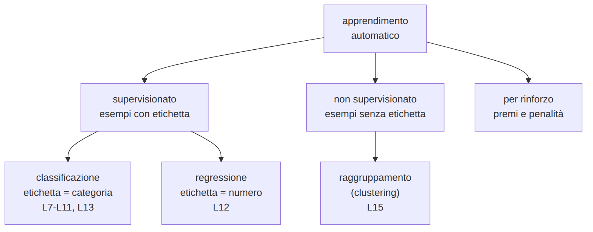
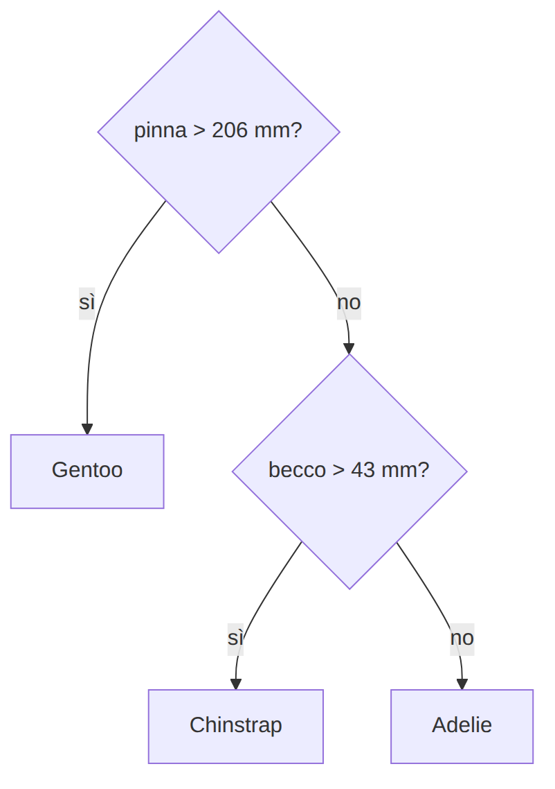
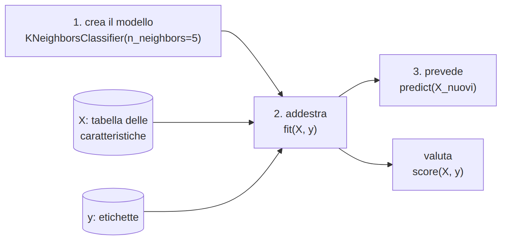

# L7 - Il problema della classificazione e le regole scritte a mano

## Tipi di apprendimento

{height=58%}

## Termini

- **esempio**: una riga (un pinguino)
- **caratteristiche**: becco, pinna
- **etichetta**: la specie
- **classi**: Adelie, Chinstrap, Gentoo
- **classificatore**: caratteristiche in ingresso, classe in uscita
- **accuratezza**: previsioni corrette / totale

## Un classificatore a regole

{height=42%}

```python
def classifica(becco, pinna):
    if pinna > 206:
        return "Gentoo"
    elif becco > 43:
        return "Chinstrap"
    else:
        return "Adelie"
```

## Tabella degli errori

Accuratezza su 342 pinguini: **0,944**

| | prevista Adelie | prevista Chinstrap | prevista Gentoo |
|---|---|---|---|
| Adelie | **142** | 7 | 2 |
| Chinstrap | 4 | **59** | 5 |
| Gentoo | 0 | 1 | **122** |

Diagonale: corrette. Fuori diagonale: errori.

## Il confine di decisione

{height=61%}

Regole a soglia: confini orizzontali e verticali.

## Limiti delle regole a mano

- soglie scelte guardando pochi esempi
- con molte caratteristiche è impossibile scriverle
- migliorarle richiede sempre più tentativi
- ottime sugli esempi visti, non per forza su quelli nuovi

L'apprendimento automatico cerca le regole dai dati. L'ultimo problema resta: **L10-L11**.

## Laboratorio L7

Schede `L7_schede_pinguini.md`, notebook `L7_regole.ipynb`

1. (base, senza computer) regole su 12 schede, previsioni sulle altre 12
2. (base) regole nel notebook: accuratezza sulle 24 schede
3. (standard) accuratezza su 342 pinguini e tabella degli errori
4. (standard) confine di decisione; migliorare le soglie
5. (approfondimento) regole con la profondità del becco

# L8 - Il classificatore k-NN: decidere guardando i vicini

## L'idea del k-NN

Un nuovo esempio riceve la classe **più frequente tra i k esempi più vicini**.

1. distanza dal nuovo esempio a tutti gli esempi
2. ordinare per distanza
3. prendere i primi k
4. voto a maggioranza

"Addestrare" = memorizzare gli esempi.

## La distanza euclidea

{height=53%}

distanza = radice di (differenza becco)² + (differenza pinna)²

Nuovo (45,0; 195) e A2 (41,1; 198): radice di 15,21 + 9 = **4,92**

## Vicini e voti

| pinguino | specie | distanza |
|---|---|---|
| C1 | Chinstrap | 3,35 |
| A2 | Adelie | 4,92 |
| C2 | Chinstrap | 6,73 |
| A1 | Adelie | 15,19 |
| G1 | Gentoo | 16,04 |

- k = 1: Chinstrap
- k = 3: 2 Chinstrap, 1 Adelie: Chinstrap
- k = 5: 2 Chinstrap, 2 Adelie, 1 Gentoo: **parità**

## scikit-learn

{width=91%}

```python
from sklearn.neighbors import KNeighborsClassifier
modello = KNeighborsClassifier(n_neighbors=5)   # iperparametro k
modello.fit(X, y)                               # addestra
modello.predict(X_nuovi)                        # prevede
modello.score(X, y)                             # accuratezza
```

## L'effetto di k

{width=95%}

Accuratezza sui dati di addestramento: k=1 **1,000**; k=5 0,962; k=25 0,944

k = 1: ogni pinguino è il vicino di sé stesso. Valutazione ingannevole: **L10**.

## La scala delle caratteristiche

{width=95%}

- becco 32-60 mm, massa 2700-6300 g: la **massa domina** la distanza
- **standardizzazione**: media 0, deviazione standard 1

## Standardizzare con scikit-learn

```python
from sklearn.preprocessing import StandardScaler
scala = StandardScaler().fit(X)      # medie e deviazioni standard
X_std = scala.transform(X)
modello = KNeighborsClassifier(n_neighbors=5).fit(X_std, y)
modello.predict(scala.transform(X_nuovi))   # stessa scala per i nuovi
```

Pregi del k-NN: semplice, nessuna forma imposta al confine.
Limiti: lento con molti esempi, sensibile alla scala, nessuna regola leggibile.

## Laboratorio L8

Notebook `L8_knn.ipynb`

1. (base) distanze a mano; previsione per k = 1, 3, 5
2. (base) scikit-learn: k = 1, 5, 25
3. (standard) confini di decisione al variare di k
4. (standard) becco e massa, senza e con standardizzazione
5. (approfondimento) quattro misure standardizzate

# L9 - L'albero di decisione: le regole imparate dai dati

## Struttura dell'albero

- **radice**: prima domanda
- **nodo interno**: domanda sì/no su una caratteristica
- **foglia**: classe prevista
- **profondità**: numero massimo di domande

Stessa forma delle regole di L7, ma domande e soglie scelte da un **algoritmo**.

## Come vengono scelte le domande

1. tutte le caratteristiche, tutte le soglie possibili
2. ogni domanda divide il gruppo in due
3. si misura la **purezza** dei due gruppi
4. si sceglie la domanda migliore
5. si ripete su ogni gruppo, fino a gruppi puri o a un limite

Algoritmo **goloso**: la scelta migliore adesso.

## Impurità di Gini

Gini = 1 - somma dei quadrati delle frazioni delle classi

- gruppo puro: **0**
- 4 A, 3 C, 3 G: 1 - (0,16 + 0,09 + 0,09) = **0,66**

| divisione | sinistra | destra | pesata |
|---|---|---|---|
| A: pinna > 206? | 4, 3, 0: 0,490 | 0, 0, 3: 0 | **0,343** |
| B: becco > 43? | 4, 0, 0: 0 | 0, 3, 3: 0,5 | **0,300** |

L'algoritmo sceglie **B**.

## L'albero dei pinguini

{width=95%}

`gini` impurità, `samples` esempi, `value` per classe (A, C, G), `class` previsione

## Profondità

{width=95%}

- profondità 1: una specie mai prevista (0,79)
- profondità 2: come le regole di L7 (0,95)
- senza limite: 27 foglie, **1,00** sui dati di addestramento: impara a memoria

## Importanza delle caratteristiche

| caratteristica | importanza |
|---|---|
| pinna | 0,559 |
| becco lunghezza | 0,361 |
| becco profondità | 0,066 |
| massa | 0,014 |

Caratteristiche correlate (pinna e massa) si dividono l'importanza.

**Interpretabile** (albero poco profondo) o **scatola nera** (k-NN con molte caratteristiche, reti neurali)?

## Laboratorio L9

Notebook `L9_albero.ipynb`

1. (base, anche su carta) Gini del gruppo e delle due divisioni
2. (base) albero di profondità 2: `export_text`, `plot_tree`, confronto con L7
3. (standard) confini per profondità 1, 2, 3, senza limite
4. (standard) quattro misure e importanza
5. (approfondimento) `min_samples_leaf`
