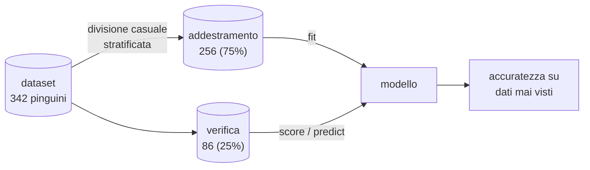
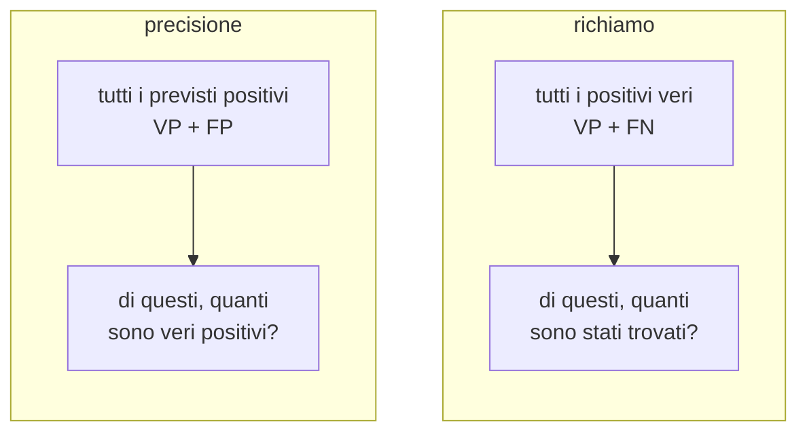
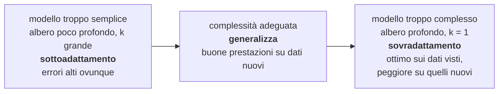
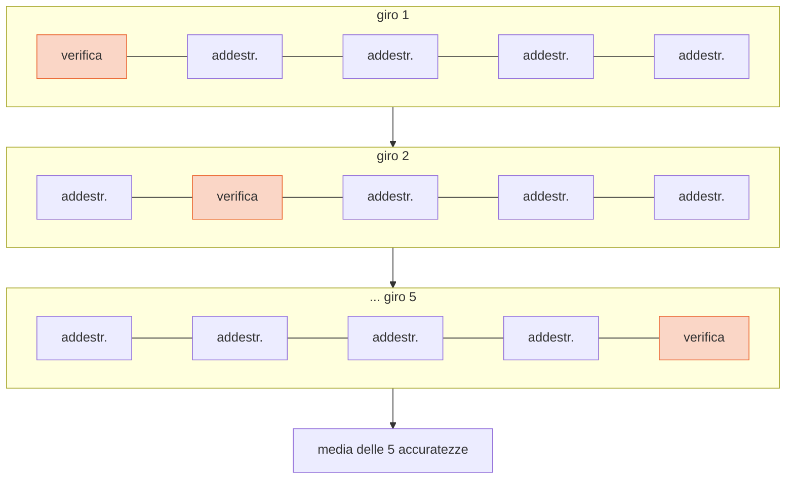
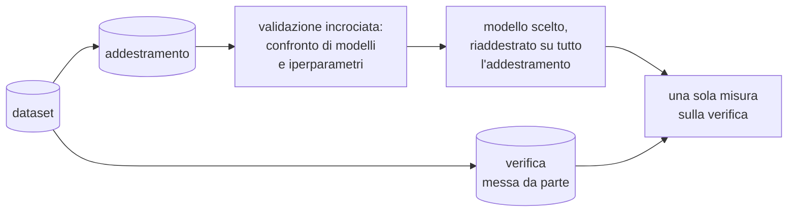

# Lezione L10 - Addestrare e valutare un modello

## Obiettivi della lezione

- spiegare perché un modello non si valuta sui dati di addestramento
- dividere un dataset in insieme di addestramento e insieme di verifica
- confrontare un modello con una baseline
- costruire e leggere una matrice di confusione
- calcolare e interpretare accuratezza, precisione e richiamo
- riconoscere quando l'accuratezza inganna

## Il problema: valutare su dati già visti

In L8 e L9 due modelli hanno ottenuto accuratezza 1,00: il k-NN con k = 1 e l'albero senza limite di profondità. Quei valori sono stati calcolati sugli stessi pinguini usati per costruire i modelli.

Analogia: uno studente che si prepara alla verifica imparando a memoria le soluzioni degli esercizi del libro. Se la verifica contiene gli stessi esercizi, prende il massimo; se contiene esercizi nuovi, il risultato dipende da quanto ha capito davvero. Lo scopo di un modello è prevedere casi nuovi, come lo scopo dello studio è risolvere problemi nuovi.

- Generalizzazione
  capacità di un modello di funzionare bene su esempi che non ha visto durante l'addestramento.

L'accuratezza sui dati di addestramento misura quanto il modello si adatta agli esempi noti, non quanto generalizza.

## Insieme di addestramento e insieme di verifica

- Insieme di addestramento (training set)
  esempi usati per costruire il modello.
- Insieme di verifica (test set)
  esempi tenuti da parte e usati solo per misurare le prestazioni. Simulano i casi nuovi.

Proporzioni usuali: 70-80% addestramento, 20-30% verifica. La divisione è casuale, per evitare che i due insiemi siano sistematicamente diversi (per esempio tutti i pinguini del 2007 nell'addestramento e quelli del 2009 nella verifica).

Diagramma: addestramento e verifica

<!-- diag: split -->


```python
from sklearn.model_selection import train_test_split

X_add, X_ver, y_add, y_ver = train_test_split(X, y, test_size=0.25, random_state=42, stratify=y)
modello.fit(X_add, y_add)          # solo dati di addestramento
modello.score(X_ver, y_ver)        # solo dati di verifica
```

- `test_size=0.25`: frazione destinata alla verifica
- `random_state=42`: seme del generatore casuale; con lo stesso seme si ottiene la stessa divisione, e il risultato è ripetibile
- `stratify=y`: divisione stratificata, cioè con le stesse proporzioni delle classi in entrambi gli insiemi; importante quando una classe è poco numerosa
- i quattro risultati sono, nell'ordine: caratteristiche di addestramento, caratteristiche di verifica, etichette di addestramento, etichette di verifica

Ogni trasformazione calcolata dai dati (come la standardizzazione di L8) va calcolata sul solo insieme di addestramento e poi applicata all'insieme di verifica: anche le medie e le deviazioni standard dei dati di verifica sono informazioni che il modello non deve vedere.

## Risultati sui pinguini

| modello | accuratezza addestramento | accuratezza verifica |
|---|---|---|
| baseline (sempre Adelie) | | 0,442 |
| k-NN, k = 1 | 1,000 | 0,965 |
| k-NN, k = 5 | 0,961 | 0,988 |
| k-NN, k = 15 | 0,949 | 0,988 |
| albero, profondità 1 | 0,789 | 0,802 |
| albero, profondità 2 | 0,941 | 0,977 |
| albero, profondità 3 | 0,941 | 0,977 |
| albero senza limite | 1,000 | 0,953 |

(caratteristiche: lunghezza del becco e della pinna; k-NN su dati standardizzati)

Osservazioni:

- i modelli perfetti sull'addestramento non sono i migliori sulla verifica
- modelli più semplici (k = 5, albero di profondità 2) generalizzano meglio
- l'accuratezza di verifica può anche superare quella di addestramento: con 86 esempi di verifica, pochi casi facili o difficili spostano il risultato

## La baseline

- Baseline (modello di riferimento)
  modello elementare che fissa il livello minimo da superare. La più comune per la classificazione prevede sempre la classe più frequente nell'insieme di addestramento.

Sui pinguini la baseline prevede sempre Adelie e ottiene 0,442. Un modello con accuratezza 0,50 sembrerebbe "a metà strada", ma è appena migliore di chi non guarda nemmeno le misure. Un'accuratezza ha significato solo se confrontata con la baseline.

```python
from sklearn.dummy import DummyClassifier
baseline = DummyClassifier(strategy="most_frequent").fit(X_add, y_add)
baseline.score(X_ver, y_ver)
```

## Matrice di confusione

- Matrice di confusione
  tabella che confronta classi vere (righe) e classi previste (colonne). Sulla diagonale le previsioni corrette; fuori diagonale gli errori, con l'indicazione di quale classe è stata scambiata con quale.

Albero di profondità 3 sull'insieme di verifica:

| | prevista Adelie | prevista Chinstrap | prevista Gentoo |
|---|---|---|---|
| vera Adelie | 38 | 0 | 0 |
| vera Chinstrap | 1 | 16 | 0 |
| vera Gentoo | 1 | 0 | 30 |

Accuratezza: (38 + 16 + 30) / 86 = 84 / 86 = 0,977. I due errori sono un Chinstrap e un Gentoo classificati come Adelie.

```python
from sklearn.metrics import confusion_matrix
confusion_matrix(y_ver, previsti, labels=["Adelie", "Chinstrap", "Gentoo"])
```

## Due classi: veri e falsi positivi e negativi

Molti problemi hanno due classi: una classe "positiva", quella da riconoscere (malattia, frode, phishing, specie rara), e una classe "negativa". La matrice di confusione ha allora quattro caselle.

| | previsto positivo | previsto negativo |
|---|---|---|
| **vero positivo** | vero positivo (VP) | falso negativo (FN): non riconosciuto |
| **vero negativo** | falso positivo (FP): falso allarme | vero negativo (VN) |

- Precisione
  VP / (VP + FP): tra gli esempi previsti positivi, quale frazione lo è davvero. Risponde alla domanda "quando il modello dice sì, quanto ci si può fidare?"
- Richiamo (recall, sensibilità)
  VP / (VP + FN): tra gli esempi positivi, quale frazione viene riconosciuta. Risponde alla domanda "quanti casi positivi il modello trova?"
- F1
  media armonica di precisione e richiamo; è alta solo se entrambe sono alte.

Diagramma: che cosa misurano precisione e richiamo

<!-- diag: precisione-richiamo -->


Quale errore costa di più dipende dal problema:

- screening medico: un falso negativo (malato non riconosciuto) è grave; si privilegia il richiamo, accettando falsi allarmi da verificare con altri esami
- filtro antispam: un falso positivo (messaggio importante nello spam) può essere grave; si privilegia la precisione
- filtro antiphishing: entrambi contano (corso B.4)

## Quando l'accuratezza inganna: classi sbilanciate

Problema: riconoscere i Chinstrap tra tutti i pinguini. I Chinstrap sono il 20%; le classi sono sbilanciate.

| modello | accuratezza | precisione | richiamo |
|---|---|---|---|
| baseline (sempre "altro") | 0,802 | 0 | 0 |
| albero, profondità 2 | 0,872 | 1,000 | 0,353 |
| albero, profondità 3 | 0,953 | 0,810 | 1,000 |

- la baseline ha accuratezza 0,80 senza riconoscere un solo Chinstrap: con classi sbilanciate l'accuratezza da sola è ingannevole
- l'albero di profondità 2 non sbaglia mai quando dice "Chinstrap" (precisione 1), ma ne trova solo 6 su 17 (richiamo 0,35)
- l'albero di profondità 3 li trova tutti, al prezzo di 4 falsi allarmi

Matrice dell'albero di profondità 2:

| | previsto Chinstrap | previsto altro |
|---|---|---|
| vero Chinstrap | 6 | 11 |
| vero altro | 0 | 69 |

```python
from sklearn.metrics import precision_score, recall_score, classification_report
precision_score(y_ver, previsti, pos_label="Chinstrap")
recall_score(y_ver, previsti, pos_label="Chinstrap")
print(classification_report(y_ver, previsti))
```

- `pos_label`: la classe positiva
- `classification_report`: precisione, richiamo, F1 e numero di esempi (support) per ogni classe

Riferimento, spiegazione visuale interattiva: MLU-Explain, Precision and Recall, https://mlu-explain.github.io/precision-recall/

## Laboratorio L10

Durata indicativa: 30 minuti. Materiali: notebook `L10_valutazione.ipynb`, `pinguini.csv`.

Esercizio 1 (base): dividere i dati in addestramento e verifica; calcolare l'accuratezza della baseline.

Esercizio 2 (base): addestrare k-NN e alberi con diversi iperparametri; confrontare accuratezza di addestramento e di verifica; scegliere un modello motivando.

Esercizio 3 (standard): costruire e disegnare la matrice di confusione dell'albero di profondità 3; calcolare l'accuratezza dalla matrice.

Esercizio 4 (standard): problema Chinstrap contro altro: confrontare accuratezza, precisione e richiamo di baseline e alberi di profondità 2, 3, 4.

Esercizio 5 (approfondimento): leggere il `classification_report` sulle tre specie.

# Lezione L11 - Sovradattamento e generalizzazione

## Obiettivi della lezione

- riconoscere sottoadattamento e sovradattamento
- costruire e leggere una curva addestramento-verifica
- spiegare la variabilità della valutazione con suddivisioni diverse
- usare la validazione incrociata
- scegliere gli iperparametri senza usare l'insieme di verifica

## Sottoadattamento e sovradattamento

- Sottoadattamento (underfitting)
  il modello è troppo semplice per cogliere la struttura dei dati: sbaglia molto sia sui dati di addestramento sia su quelli nuovi. Esempio: albero di profondità 1 per tre classi.
- Sovradattamento (overfitting)
  il modello è così flessibile da adattarsi anche al rumore e alle eccezioni dei dati di addestramento: è molto accurato su di essi, meno su quelli nuovi. Esempio: albero senza limite di profondità, k-NN con k = 1.
- Complessità di un modello
  capacità di rappresentare confini di decisione complicati. Cresce con la profondità di un albero; nel k-NN cresce al diminuire di k.

Esempio con i dati dei tragitti: prevedere il mezzo di trasporto da distanza e tempo. Il problema è più difficile dei pinguini, perché mezzi diversi si sovrappongono (piedi, bici e monopattino sulle brevi distanze; bus e auto sulle medie).

{width=100%}

- profondità 1: due zone per sei mezzi; sottoadattamento (0,48 in addestramento)
- profondità 5: zone che seguono la struttura principale (0,92 in addestramento, 0,71 in verifica)
- senza limite: zone ritagliate attorno a singoli esempi, come la sottile striscia di "treno" dentro la zona del bus; 0,99 in addestramento, 0,69 in verifica

## La curva addestramento-verifica

{width=85%}

Lettura:

- a sinistra entrambe le accuratezze sono basse: sottoadattamento
- aumentando la profondità entrambe crescono
- oltre una certa profondità (qui 5) l'accuratezza di addestramento continua a crescere, quella di verifica si ferma o scende: sovradattamento
- la distanza tra le due curve misura quanto il modello ha "imparato a memoria"

Il modello da scegliere è quello con le migliori prestazioni su dati non visti, non quello con le migliori prestazioni sui dati visti.

Diagramma: complessità del modello e comportamento

<!-- diag: complessita -->


Rimedi al sovradattamento:

- modello più semplice (limitare profondità, aumentare k, aumentare il numero minimo di esempi per foglia)
- più dati di addestramento
- meno caratteristiche, scegliendo quelle informative

Rimedi al sottoadattamento:

- modello più complesso
- caratteristiche più informative (per esempio la velocità media, distanza diviso tempo, per i tragitti)

## Iperparametri

- Parametro del modello
  valore appreso dai dati durante l'addestramento: le soglie di un albero, i coefficienti di una retta (L12).
- Iperparametro
  valore scelto da chi costruisce il modello prima dell'addestramento: la profondità massima, k, il numero minimo di esempi per foglia.

La scelta degli iperparametri è una delle decisioni principali nella costruzione di un modello, e va fatta senza usare l'insieme di verifica (vedi più avanti).

## Un solo insieme di verifica non basta

Con pochi dati il risultato su un insieme di verifica dipende da quali esempi sono capitati in quell'insieme.

{width=80%}

Sui pinguini, lo stesso modello ottiene tra 0,90 e 0,99 secondo la suddivisione; sui tragitti un albero di profondità 5 va da 0,67 a 0,76 su dieci suddivisioni. Una differenza di 0,02 tra due modelli, misurata su una sola suddivisione, può essere dovuta al caso.

## La validazione incrociata

- Validazione incrociata a k blocchi (k-fold cross-validation)
  i dati vengono divisi in k blocchi di uguale dimensione (di solito 5 o 10). Per k volte il modello viene addestrato su k - 1 blocchi e valutato sul blocco rimanente, cambiando ogni volta il blocco di verifica. Il risultato è la media delle k accuratezze, con la loro deviazione standard. Ogni esempio viene usato una volta per la verifica.

Il "k" della validazione incrociata non ha nulla a che fare con il k del k-NN: è una coincidenza di lettere.

Diagramma: validazione incrociata a 5 blocchi

<!-- diag: cv -->


```python
from sklearn.model_selection import cross_val_score

punteggi = cross_val_score(DecisionTreeClassifier(max_depth=5, random_state=0), X, y, cv=5)
punteggi.mean(), punteggi.std()
```

- `cross_val_score(modello, X, y, cv=5)`: esegue i 5 addestramenti e restituisce le 5 accuratezze; per la classificazione i blocchi sono stratificati

Validazione incrociata sui tragitti, al variare della profondità:

| profondità | media | deviazione standard |
|---|---|---|
| 1 | 0,480 | 0,027 |
| 3 | 0,580 | 0,045 |
| 5 | 0,707 | 0,080 |
| 6 | 0,740 | 0,080 |
| 8 | 0,713 | 0,109 |
| senza limite | 0,713 | 0,120 |

Le profondità da 5 a 8 hanno medie simili, entro la variabilità. A parità di prestazioni conviene il modello più semplice: è più interpretabile e meno esposto al sovradattamento (principio di parsimonia, o rasoio di Occam).

## La procedura corretta

L'insieme di verifica serve a stimare le prestazioni su dati nuovi. Se lo si usa per scegliere tra molti modelli, si finisce per scegliere il modello che va bene su quegli esempi in particolare: la stima diventa ottimistica, e l'insieme di verifica non è più "mai visto".

Diagramma: scelta del modello e verifica finale

<!-- diag: procedura -->


1. mettere da parte l'insieme di verifica all'inizio
2. confrontare modelli e iperparametri con la validazione incrociata sui soli dati di addestramento
3. addestrare il modello scelto su tutti i dati di addestramento
4. misurare le prestazioni sulla verifica una sola volta, e riportare quel valore

Nelle competizioni di data science (per esempio su Kaggle) il principio è applicato in modo rigoroso: i partecipanti non vedono le etichette dei dati su cui viene calcolata la classifica finale.

Riferimento, spiegazione visuale interattiva: MLU-Explain, Cross-Validation, https://mlu-explain.github.io/cross-validation/

## Laboratorio L11

Durata indicativa: 30 minuti. Materiali: notebook `L11_sovradattamento.ipynb`, `tragitti_puliti.csv` (o il file pulito della classe).

Esercizio 1 (base): costruire la curva addestramento-verifica al variare della profondità; individuare sottoadattamento e sovradattamento e la profondità migliore sulla verifica.

Esercizio 2 (base): ripetere la valutazione con dieci suddivisioni diverse; indicare minimo, massimo e media.

Esercizio 3 (standard): validazione incrociata a 5 blocchi per diverse profondità; scegliere la profondità motivando.

Esercizio 4 (standard): validazione incrociata per diversi valori di k nel k-NN.

Esercizio 5 (approfondimento): applicare la procedura corretta: scelta con la validazione incrociata sull'addestramento, una sola misura finale sulla verifica.
