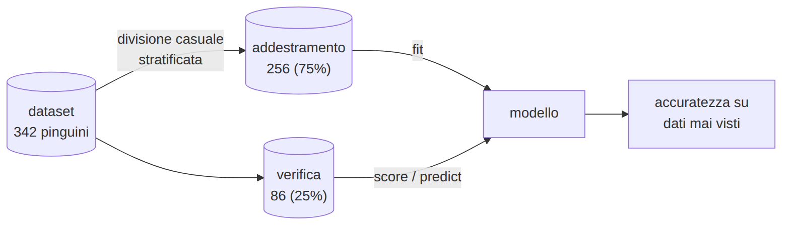
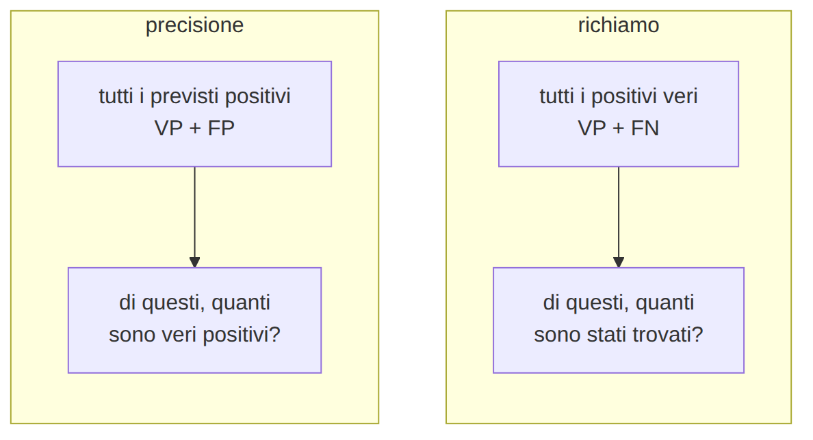
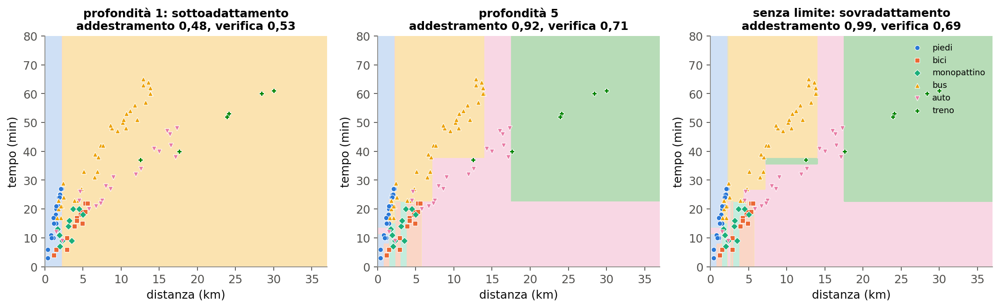
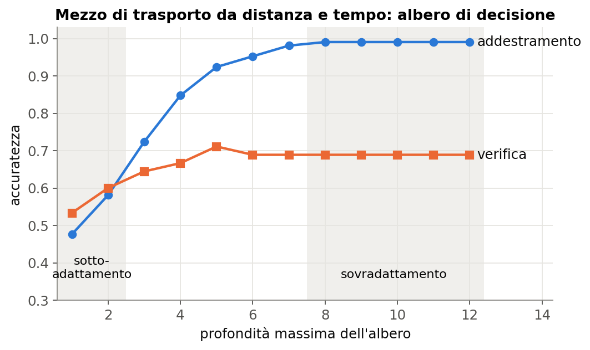
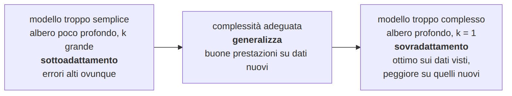
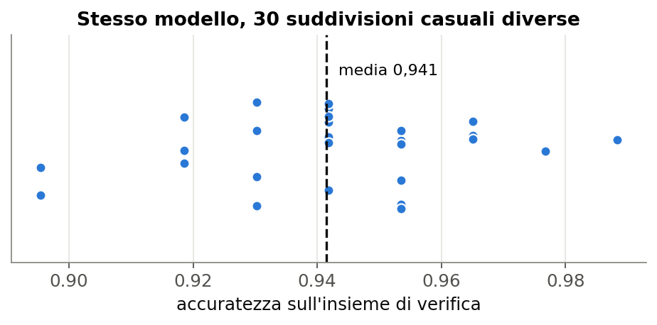
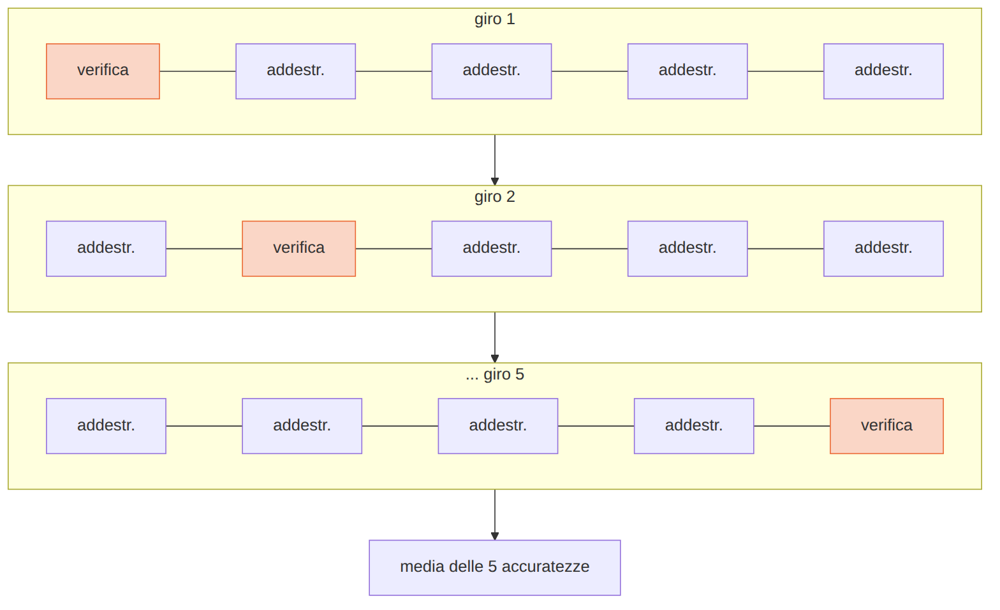
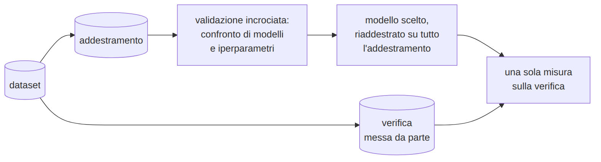

# L10 - Addestrare e valutare un modello

## Il problema

k-NN con k = 1 e albero senza limite: accuratezza **1,00**... sugli stessi dati usati per addestrarli.

Studiare a memoria le soluzioni del libro: massimo dei voti se la verifica ha gli stessi esercizi.

**Generalizzazione**: funzionare bene su esempi **mai visti**.

## Addestramento e verifica

{width=95%}

```python
X_add, X_ver, y_add, y_ver = train_test_split(
    X, y, test_size=0.25, random_state=42, stratify=y)
modello.fit(X_add, y_add)       # solo addestramento
modello.score(X_ver, y_ver)     # solo verifica
```

Anche la standardizzazione si calcola solo sull'addestramento.

## Risultati sui pinguini

| modello | addestramento | verifica |
|---|---|---|
| baseline (sempre Adelie) | | 0,442 |
| k-NN, k = 1 | **1,000** | 0,965 |
| k-NN, k = 5 | 0,961 | **0,988** |
| albero, profondità 2 | 0,941 | 0,977 |
| albero senza limite | **1,000** | 0,953 |

I modelli perfetti sull'addestramento **non** sono i migliori sulla verifica.

## La baseline

Prevede sempre la classe più frequente: **0,442** sui pinguini

Un'accuratezza ha significato solo **confrontata** con la baseline.

```python
from sklearn.dummy import DummyClassifier
baseline = DummyClassifier(strategy="most_frequent").fit(X_add, y_add)
baseline.score(X_ver, y_ver)
```

## Matrice di confusione

| | prevista Adelie | prevista Chinstrap | prevista Gentoo |
|---|---|---|---|
| vera Adelie | **38** | 0 | 0 |
| vera Chinstrap | 1 | **16** | 0 |
| vera Gentoo | 1 | 0 | **30** |

Accuratezza = diagonale / totale = 84 / 86 = **0,977**

```python
confusion_matrix(y_ver, previsti, labels=["Adelie", "Chinstrap", "Gentoo"])
```

## Due classi

| | previsto positivo | previsto negativo |
|---|---|---|
| **vero positivo** | VP | **FN**: non riconosciuto |
| **vero negativo** | **FP**: falso allarme | VN |

- **precisione** = VP / (VP + FP): quando dice sì, quanto ci si può fidare?
- **richiamo** = VP / (VP + FN): quanti positivi trova?
- **F1**: media armonica delle due

## Precisione e richiamo

{width=91%}

- screening medico: conta il **richiamo**
- filtro antispam: conta la **precisione**

## Classi sbilanciate: riconoscere i Chinstrap (20%)

| modello | accuratezza | precisione | richiamo |
|---|---|---|---|
| baseline "altro" | **0,802** | 0 | **0** |
| albero prof. 2 | 0,872 | 1,000 | 0,353 |
| albero prof. 3 | 0,953 | 0,810 | 1,000 |

Con classi sbilanciate l'accuratezza da sola **inganna**.

https://mlu-explain.github.io/precision-recall/

## Laboratorio L10

Notebook `L10_valutazione.ipynb`

1. (base) divisione e baseline
2. (base) k-NN e alberi: addestramento e verifica; quale modello?
3. (standard) matrice di confusione
4. (standard) Chinstrap contro altro: precisione e richiamo
5. (approfondimento) `classification_report`

# L11 - Sovradattamento e generalizzazione

## Sotto e sovradattamento

{width=95%}

Mezzo di trasporto da distanza e tempo (tragitti)

## La curva addestramento-verifica

{height=58%}

La distanza tra le curve misura quanto il modello **impara a memoria**.

## Complessità

{width=95%}

- contro il sovradattamento: modello più semplice, più dati, meno caratteristiche
- contro il sottoadattamento: modello più complesso, caratteristiche migliori

## Parametri e iperparametri

- **parametro**: appreso dai dati (soglie dell'albero, coefficienti di una retta)
- **iperparametro**: scelto prima (profondità, k, esempi minimi per foglia)

Come si scelgono gli iperparametri **senza** usare la verifica?

## Una sola verifica non basta

{width=86%}

Stesso modello, suddivisioni diverse: da 0,90 a 0,99.

## Validazione incrociata

{height=54%}

```python
cross_val_score(DecisionTreeClassifier(max_depth=5, random_state=0), X, y, cv=5)
```

## Scegliere la profondità (tragitti)

| profondità | media | dev. std. |
|---|---|---|
| 1 | 0,480 | 0,027 |
| 3 | 0,580 | 0,045 |
| 5 | 0,707 | 0,080 |
| 6 | 0,740 | 0,080 |
| 8 | 0,713 | 0,109 |
| senza limite | 0,713 | 0,120 |

Differenze entro la variabilità: a parità di prestazioni, il modello **più semplice**.

## La procedura corretta

{width=95%}

La verifica si usa **una sola volta**, alla fine. https://mlu-explain.github.io/cross-validation/

## Laboratorio L11

Notebook `L11_sovradattamento.ipynb`, `tragitti_puliti.csv`

1. (base) curva addestramento-verifica
2. (base) dieci suddivisioni diverse
3. (standard) validazione incrociata per la profondità
4. (standard) validazione incrociata per k
5. (approfondimento) procedura corretta con verifica finale
