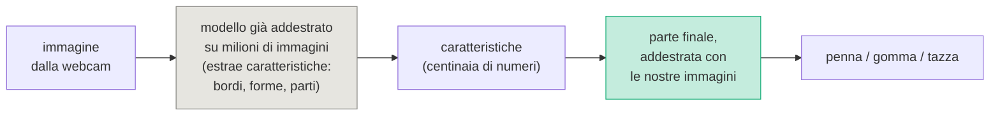
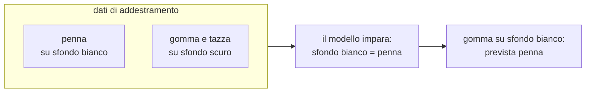

# Lezione L12 - Prevedere un numero: la regressione lineare

## Obiettivi della lezione

- distinguere regressione e classificazione
- interpretare pendenza e intercetta di una retta di regressione
- calcolare e interpretare residui, MAE e RMSE
- confrontare un modello di regressione con una baseline
- usare più caratteristiche, anche qualitative, con la codifica one-hot
- riconoscere i rischi dell'estrapolazione

## Regressione

- Regressione
  problema di apprendimento supervisionato in cui l'etichetta è un numero: prevedere la massa di un pinguino, il tempo di un tragitto, il prezzo di una casa, la temperatura di domani.
- Regressione lineare
  modello che prevede l'etichetta come somma pesata delle caratteristiche più una costante. Con una sola caratteristica il modello è una retta:

  previsione = pendenza x caratteristica + intercetta

  - pendenza (coefficiente): di quanto cambia la previsione quando la caratteristica aumenta di 1
  - intercetta: la previsione quando la caratteristica vale 0

Il nome "regressione" viene dagli studi di Francis Galton (fine Ottocento) sull'altezza di genitori e figli; oggi indica in generale la previsione di valori numerici.

## La retta dei pinguini

Caratteristica: lunghezza della pinna. Etichetta: massa. Dati: i 333 pinguini con tutte le misure, divisi in addestramento (75%) e verifica (25%).

{width=80%}

Retta ottenuta:

massa = 50,0 x pinna - 5849

- pendenza 50,0 g/mm: ogni millimetro di pinna in più corrisponde in media a 50 g di massa in più
- intercetta -5849 g: la massa prevista per una pinna di 0 mm; non ha significato fisico, perché nessun pinguino ha la pinna lunga 0 mm; serve solo a posizionare la retta
- esempio: pinna di 200 mm, massa prevista 50,0 x 200 - 5849 = 4155 g circa

## Come si trova la retta

- Residuo
  differenza tra valore vero e valore previsto per un esempio: massa vera - massa prevista. Nel grafico è il segmento verticale tra il punto e la retta.
- Metodo dei minimi quadrati
  la retta scelta è quella che rende minima la somma dei quadrati dei residui. Il quadrato rende tutti i contributi positivi e pesa di più i residui grandi. Il metodo risale a Legendre e Gauss (inizio Ottocento).

Per la regressione lineare esiste una formula che calcola direttamente pendenza e intercetta. Per modelli più complessi, come le reti neurali, i parametri si trovano per approssimazioni successive con la discesa del gradiente, trattata nel corso B.8.

```python
from sklearn.linear_model import LinearRegression

retta = LinearRegression().fit(X_add, y_add)
retta.coef_          # pendenza, una per caratteristica: [50.0]
retta.intercept_     # intercetta: -5848.7
retta.predict(X_ver) # previsioni
```

- `LinearRegression()`: modello di regressione lineare, stessa interfaccia dei classificatori (`fit`, `predict`)
- `coef_`, `intercept_`: parametri appresi, disponibili dopo `fit`

## Misurare l'errore

In regressione non si parla di previsioni "giuste" o "sbagliate": ogni previsione ha un errore più o meno grande.

- MAE (mean absolute error, errore assoluto medio)
  media dei valori assoluti dei residui. Si esprime nell'unità dell'etichetta ed è di interpretazione immediata: "in media la previsione sbaglia di 290 g".
- RMSE (root mean squared error, radice dell'errore quadratico medio)
  radice della media dei quadrati dei residui. Nella stessa unità, ma pesa di più gli errori grandi; è sempre maggiore o uguale al MAE.
- Baseline per la regressione
  prevedere sempre la media dell'etichetta nei dati di addestramento.

Risultati sull'insieme di verifica:

| modello | MAE | RMSE |
|---|---|---|
| baseline (sempre la massa media) | 643 g | |
| retta con la pinna | 290 g | 371 g |

La retta dimezza l'errore della baseline.

```python
from sklearn.metrics import mean_absolute_error, mean_squared_error
mean_absolute_error(y_ver, previsti)
mean_squared_error(y_ver, previsti) ** 0.5
```

{width=50%}

## Più caratteristiche

Con più caratteristiche la previsione è una somma pesata:

previsione = c1 x caratteristica1 + c2 x caratteristica2 + ... + intercetta

Ogni coefficiente indica l'effetto di una caratteristica a parità delle altre.

### Caratteristiche qualitative: la codifica one-hot

La regressione lavora con numeri. Una variabile qualitativa con n categorie si trasforma in n - 1 colonne di 0 e 1:

| specie | specie_Chinstrap | specie_Gentoo |
|---|---|---|
| Adelie | 0 | 0 |
| Chinstrap | 1 | 0 |
| Gentoo | 0 | 1 |

- Codifica one-hot
  una colonna per categoria, che vale 1 se l'esempio appartiene a quella categoria e 0 altrimenti. Una categoria (qui Adelie) può essere omessa e fa da riferimento: gli altri coefficienti indicano la differenza rispetto a essa.

Non si può codificare la specie come 1, 2, 3: il modello tratterebbe Gentoo come "il triplo" di Adelie e Chinstrap come "a metà strada", relazioni che non esistono.

```python
X = pd.get_dummies(pinguini[["pinna_lunghezza_mm", "specie"]], drop_first=True, dtype=int)
```

- `pd.get_dummies`: applica la codifica one-hot alle colonne di testo
- `drop_first=True`: omette la prima categoria in ordine alfabetico
- `dtype=int`: colonne di 0 e 1 (invece di `True` e `False`)

Risultati sull'insieme di verifica:

| caratteristiche | MAE |
|---|---|
| pinna | 290 g |
| pinna, specie | 258 g |
| pinna, specie, sesso | 217 g |

{width=80%}

Nel modello con la specie il coefficiente di `specie_Gentoo` (280 g) indica che un Gentoo pesa in media 280 g più di un Adelie con la stessa pinna. Aggiungendo il sesso l'errore scende ancora, perché i maschi sono più pesanti delle femmine (L4). I coefficienti cambiano quando si aggiungono caratteristiche: la pinna "spiegava" anche una parte dell'effetto di specie e sesso.

## Estrapolazione

- Interpolazione
  previsione per valori della caratteristica compresi nell'intervallo dei dati di addestramento.
- Estrapolazione
  previsione per valori fuori da quell'intervallo.

La retta dei pinguini è stata costruita con pinne tra 172 e 231 mm. Per una pinna di 100 mm prevede una massa di -847 g; per 300 mm, oltre 9 kg. Nessun modello garantisce che la relazione osservata continui fuori dall'intervallo dei dati: le previsioni per estrapolazione vanno evitate o trattate con grande cautela.

## Regressione e tragitti

Previsione del tempo di tragitto (dati di esempio):

- con la sola distanza: tempo = 2,24 x distanza + 13,1 (MAE 7,1 minuti). Circa 2,2 minuti per km in più, più una parte fissa di 13 minuti (uscire di casa, attese, parcheggio)
- con distanza e mezzo: MAE 4,2 minuti. Il mezzo cambia la parte fissa: il bus, per esempio, aggiunge circa 18 minuti rispetto all'auto, il tempo delle attese e delle fermate

## Laboratorio L12

Durata indicativa: 30 minuti. Materiali: notebook `L12_regressione.ipynb`, `pinguini.csv`, `tragitti_puliti.csv` (o il file pulito della classe).

Esercizio 1 (base): addestrare la retta della massa dalla pinna; interpretare pendenza e intercetta; calcolare una previsione a mano e con `predict`.

Esercizio 2 (base): disegnare punti, retta e istogramma dei residui; calcolare MAE e RMSE sulla verifica e confrontarli con la baseline.

Esercizio 3 (standard): aggiungere specie e sesso con la codifica one-hot; interpretare i coefficienti e il miglioramento dell'errore.

Esercizio 4 (standard): prevedere la massa per pinne di 100, 150, 200, 250, 300 mm; individuare le previsioni assurde.

Esercizio 5 (approfondimento): prevedere il tempo di tragitto dalla distanza, poi da distanza e mezzo; interpretare i coefficienti.

# Lezione L13 - Classificare immagini senza scrivere codice

## Obiettivi della lezione

- descrivere un'immagine digitale come tabella di numeri
- spiegare perché per le immagini si usano caratteristiche apprese
- descrivere l'apprendimento per trasferimento
- raccogliere un dataset di immagini, addestrare e provare un classificatore con Teachable Machine
- riconoscere i limiti dovuti al dataset: varietà, bilanciamento, scorciatoie

## Un'immagine è una tabella di numeri

- Pixel
  il più piccolo elemento di un'immagine digitale; ha un valore di intensità.
- Immagine in scala di grigi
  tabella di pixel, ciascuno con un numero (per esempio da 0 a 255, o da 0 a 16 nel dataset delle cifre).
- Immagine a colori
  tre tabelle sovrapposte (canali), per il rosso, il verde e il blu (RGB). Una foto di 224 x 224 pixel contiene 224 x 224 x 3 = 150.528 numeri.

{width=75%}

Per un modello, un'immagine di 8 x 8 pixel è un esempio con 64 caratteristiche, una per pixel. Il dataset delle cifre scritte a mano incluso in scikit-learn contiene 1797 immagini di questo tipo; un k-NN che usa direttamente i pixel come caratteristiche le riconosce con un'accuratezza di circa 0,99.

{width=90%}

## Perché i pixel non bastano

Con fotografie reali i pixel grezzi funzionano male come caratteristiche:

- lo stesso oggetto spostato di pochi pixel produce una tabella di numeri completamente diversa
- luce, colore, sfondo, dimensione e inclinazione cambiano tutti i valori
- le caratteristiche sono centinaia di migliaia, e le distanze tra immagini smettono di essere informative

Scrivere a mano caratteristiche utili (bordi, forme, colori prevalenti) è stato per decenni il lavoro principale della visione artificiale. Dagli anni 2010 si usano le reti neurali convoluzionali, che imparano dagli esempi anche le caratteristiche: i primi strati riconoscono bordi e macchie di colore, gli strati successivi forme sempre più complesse, gli ultimi oggetti interi. Il funzionamento delle reti neurali è trattato nel corso B.8.

Addestrare una rete di questo tipo richiede milioni di immagini e molta potenza di calcolo. Per un uso scolastico esiste una scorciatoia.

## Apprendimento per trasferimento

- Apprendimento per trasferimento (transfer learning)
  riuso di un modello già addestrato su un grande dataset per un compito nuovo. Si conserva la parte che estrae le caratteristiche e si riaddestra solo la parte finale, che decide la classe, con pochi esempi del nuovo compito.

Diagramma: apprendimento per trasferimento

<!-- diag: trasferimento -->


Con questa tecnica bastano qualche decina di immagini per classe e pochi secondi di addestramento anche su un PC modesto.

## Teachable Machine

- Teachable Machine
  strumento web gratuito di Google per addestrare, senza scrivere codice, classificatori di immagini, suoni e pose del corpo. Usa l'apprendimento per trasferimento e la libreria TensorFlow.js; l'addestramento avviene nel browser, sul computer dell'utente. https://teachablemachine.withgoogle.com/

Flusso di lavoro:

1. Image Project, Standard image model
2. una "classe" per ogni categoria, con un nome
3. per ogni classe, raccolta di esempi con la webcam ("Hold to Record") o caricando file
4. Train Model: addestramento
5. Preview: prova in tempo reale, con la percentuale di confidenza per ogni classe
6. Export Model: il modello può essere scaricato o usato in altri progetti; il progetto (immagini comprese) può essere salvato come file o su Google Drive

Tutti i concetti del corso si ritrovano nello strumento:

| concetto | in Teachable Machine |
|---|---|
| raccolta del dataset (L2) | registrazione degli esempi per classe |
| etichette | nomi delle classi |
| bilanciamento delle classi | numero di esempi per classe |
| addestramento e verifica (L10) | una parte degli esempi è tenuta da parte per la verifica (pannello Advanced, Under the hood) |
| epoche, iperparametri (L11) | pannello Advanced |
| probabilità della previsione | percentuali nella finestra Preview |

## Il dataset decide che cosa impara il modello

Un classificatore di immagini impara qualunque regolarità permetta di distinguere le classi nei dati di addestramento, anche se non è quella voluta.

- Varietà
  se tutte le immagini di una classe hanno lo stesso sfondo, la stessa luce, la stessa posizione, il modello funziona solo in quelle condizioni.
- Bilanciamento
  se una classe ha molti più esempi delle altre, il modello tende a prevederla più spesso.
- Classe "nessuno"
  il modello sceglie sempre una delle classi che conosce, anche davanti a un oggetto mai visto o a un'inquadratura vuota; se serve, si aggiunge una classe "sfondo" o "altro".
- Scorciatoia (shortcut learning)
  il modello usa una caratteristica facile, correlata con la classe nei dati di addestramento ma estranea al compito: lo sfondo, una macchia sull'obiettivo, un'etichetta nell'angolo della foto.

Esempio noto: in un esperimento sulla spiegazione dei modelli, un classificatore di foto di lupi e di husky addestrato su immagini in cui i lupi erano sempre sulla neve (scelte apposta dagli autori) si basava sulla neve dello sfondo, non sull'animale; il metodo di spiegazione proposto lo rendeva visibile (Ribeiro, Singh, Guestrin, "Why Should I Trust You?", 2016, https://arxiv.org/abs/1602.04938). Casi analoghi sono stati documentati in modelli per immagini mediche, che riconoscevano il reparto o lo strumento con cui l'immagine era stata acquisita invece della malattia.

Diagramma: una scorciatoia appresa

<!-- diag: scorciatoia -->


Il tema è ripreso in L14 per i dati che riguardano persone.

## Laboratorio L13

Durata indicativa: 30 minuti. Materiali: scheda `L13_scheda_teachable_machine.md`; PC con webcam e browser recente; tre oggetti per gruppo. Alternativa senza webcam o senza rete: notebook `L13_cifre_offline.ipynb`.

Esercizio 1 (base): creare un progetto con tre classi di oggetti; registrare un primo dataset con sfondo, luce e posizione fissi; addestrare e provare.

Esercizio 2 (base): provare il modello nelle condizioni della scheda (sfondo, luce, rotazione, distanza, oggetto nuovo, inquadratura vuota) e annotare i risultati.

Esercizio 3 (standard): costruire una scorciatoia con sfondi diversi per classi diverse e verificarne l'effetto.

Esercizio 4 (standard): registrare un secondo dataset vario e confrontare i risultati con il primo.

Esercizio 5 (approfondimento): variare le epoche e osservare le curve nel pannello Advanced; provare un dataset sbilanciato.

Alternativa offline (notebook `L13_cifre_offline.ipynb`): immagini come tabelle di numeri; k-NN sulle cifre 8 x 8; analisi degli errori; una scorciatoia simulata (una macchia nell'angolo delle sole immagini di 7 di addestramento).
