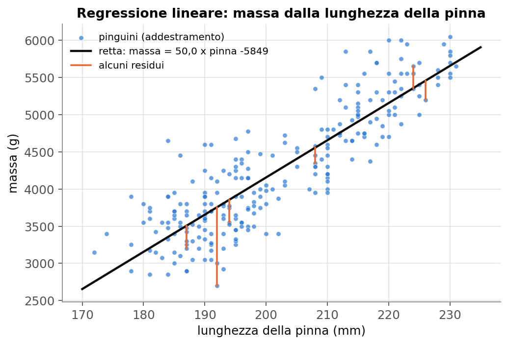
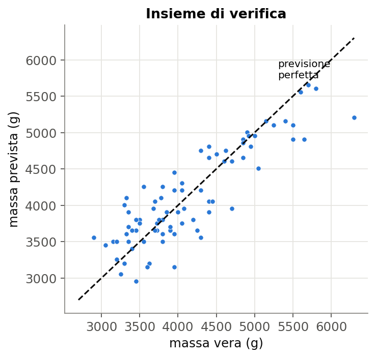
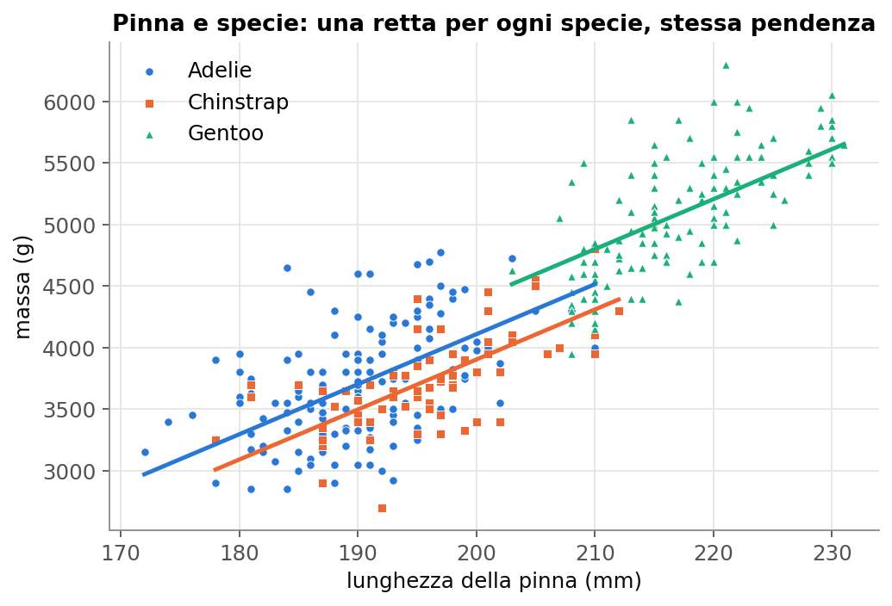
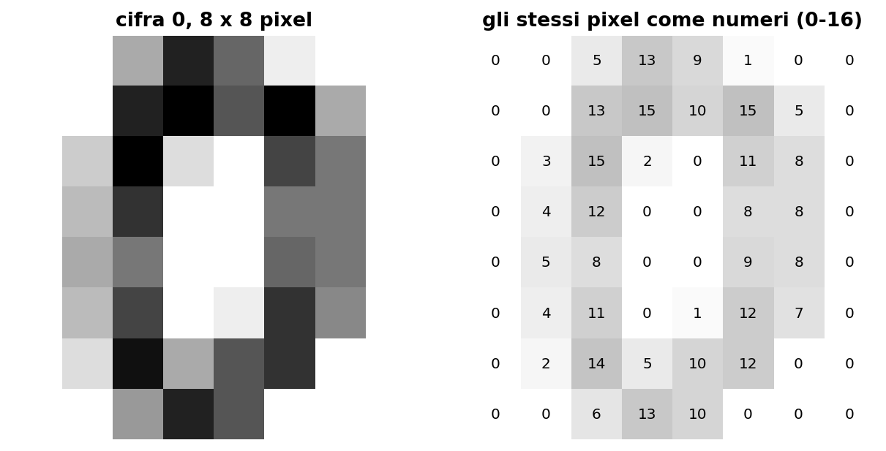
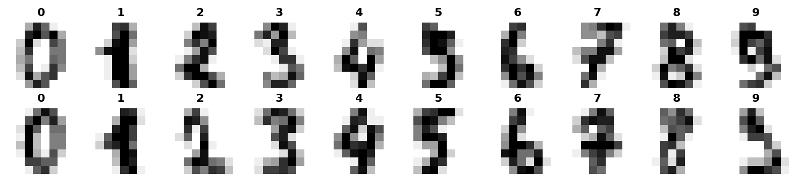
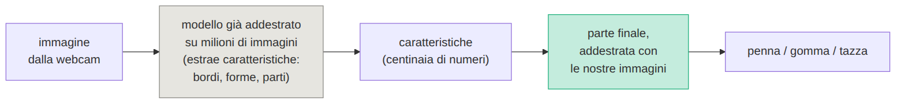
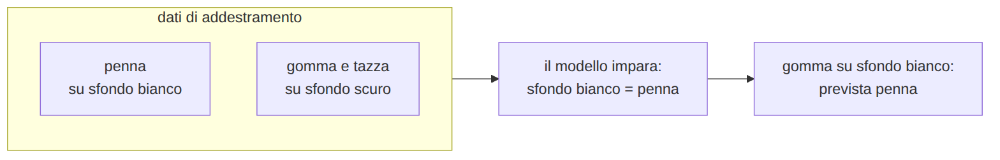

# L12 - Prevedere un numero: la regressione lineare

## Regressione

L'etichetta è un **numero**: massa, tempo, prezzo, temperatura.

**Regressione lineare** con una caratteristica:

previsione = **pendenza** x caratteristica + **intercetta**

- pendenza: variazione della previsione per 1 unità in più
- intercetta: previsione con caratteristica 0

## La retta dei pinguini

{height=56%}

massa = 50,0 x pinna - 5849: **50 g per ogni mm** di pinna; intercetta senza significato fisico

## Come si trova la retta

- **residuo** = valore vero - valore previsto
- **minimi quadrati**: la retta che rende minima la somma dei quadrati dei residui
- per modelli più complessi: discesa del gradiente (corso **B.8**)

```python
from sklearn.linear_model import LinearRegression
retta = LinearRegression().fit(X_add, y_add)
retta.coef_, retta.intercept_      # [50.0], -5848.7
retta.predict(X_ver)
```

## Misurare l'errore

- **MAE**: media dei residui in valore assoluto
- **RMSE**: radice della media dei quadrati; pesa di più gli errori grandi
- **baseline**: sempre la media

| modello | MAE | RMSE |
|---|---|---|
| baseline | 643 g | |
| retta con la pinna | **290 g** | 371 g |

## Previsti e veri

{height=62%}

## Più caratteristiche e codifica one-hot

| specie | specie_Chinstrap | specie_Gentoo |
|---|---|---|
| Adelie | 0 | 0 |
| Chinstrap | 1 | 0 |
| Gentoo | 0 | 1 |

Non 1, 2, 3: Gentoo non è "il triplo" di Adelie.

```python
X = pd.get_dummies(pinguini[["pinna_lunghezza_mm", "specie"]], drop_first=True, dtype=int)
```

## Pinna, specie, sesso

{height=46%}

| caratteristiche | MAE |
|---|---|
| pinna | 290 g |
| pinna, specie | 258 g |
| pinna, specie, sesso | **217 g** |

## Estrapolazione

Dati: pinne tra 172 e 231 mm

| pinna | massa prevista |
|---|---|
| 100 mm | **-847 g** |
| 200 mm | 4155 g |
| 300 mm | **9157 g** |

Fuori dall'intervallo dei dati il modello non è affidabile.

Tragitti: tempo = 2,24 x distanza + 13,1 (MAE 7,1 min); con il mezzo MAE 4,2 min

## Laboratorio L12

Notebook `L12_regressione.ipynb`

1. (base) retta, pendenza e intercetta, previsione a mano
2. (base) residui, MAE, RMSE, baseline
3. (standard) specie e sesso con la codifica one-hot
4. (standard) estrapolazione
5. (approfondimento) tempo di tragitto da distanza e mezzo

# L13 - Classificare immagini senza scrivere codice

## Un'immagine è una tabella di numeri

{width=77%}

- scala di grigi: un numero per pixel
- colore: tre canali RGB; 224 x 224 x 3 = 150.528 numeri

## Cifre scritte a mano

{width=95%}

1797 immagini 8 x 8: **64 caratteristiche**, una per pixel; k-NN: accuratezza circa **0,99**

Con foto reali i pixel grezzi non bastano: posizione, luce, sfondo cambiano tutti i valori.

## Caratteristiche apprese e trasferimento

{width=95%}

- reti convoluzionali: bordi, forme, oggetti (corso **B.8**)
- **transfer learning**: si riaddestra solo la parte finale, con pochi esempi

## Teachable Machine

https://teachablemachine.withgoogle.com/

1. Image Project, Standard image model
2. classi con un nome
3. esempi dalla webcam ("Hold to Record")
4. Train Model
5. Preview: percentuali per classe
6. Export Model; salvataggio del progetto

Addestramento **nel browser**, con TensorFlow.js.

## I concetti del corso nello strumento

| concetto | Teachable Machine |
|---|---|
| raccolta del dataset | registrazione degli esempi |
| etichette | nomi delle classi |
| bilanciamento | esempi per classe |
| addestramento e verifica | Advanced, Under the hood |
| iperparametri | epoche, Advanced |
| probabilità | percentuali in Preview |

## Il dataset decide che cosa impara il modello

- **varietà**: stesso sfondo e stessa luce = funziona solo lì
- **bilanciamento**: la classe più numerosa viene prevista più spesso
- **classe "nessuno"**: il modello sceglie sempre una classe nota
- **scorciatoia**: sfondo, macchie, etichette

{width=91%}

Lupi e husky: la neve sullo sfondo (Ribeiro et al., 2016)

## Laboratorio L13

Scheda `L13_scheda_teachable_machine.md`; alternativa offline `L13_cifre_offline.ipynb`

1. (base) tre classi di oggetti, dataset "facile"
2. (base) prove: sfondo, luce, rotazione, distanza, oggetto nuovo, vuoto
3. (standard) costruire una scorciatoia con gli sfondi
4. (standard) dataset "vario" e confronto
5. (approfondimento) epoche e sbilanciamento

Solo oggetti, mai volti.
