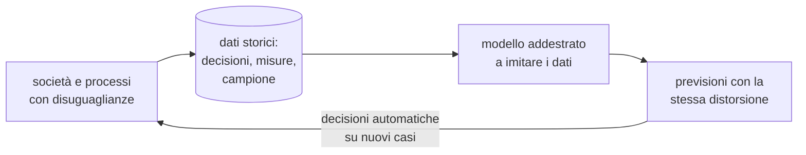
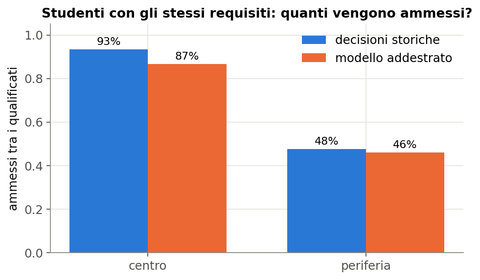
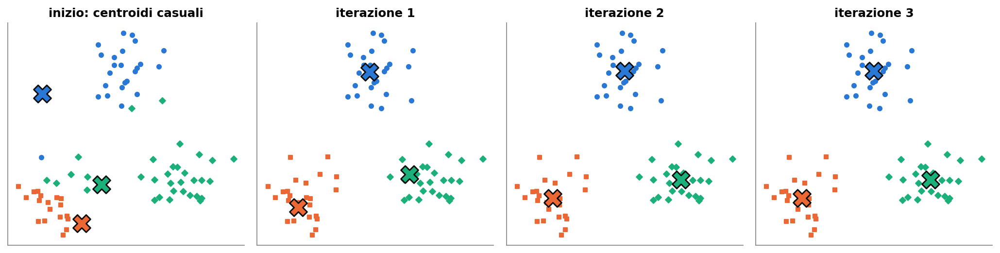
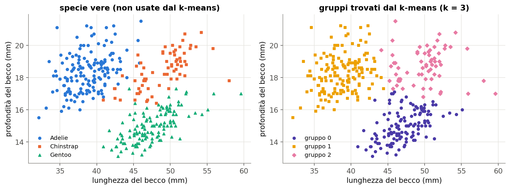
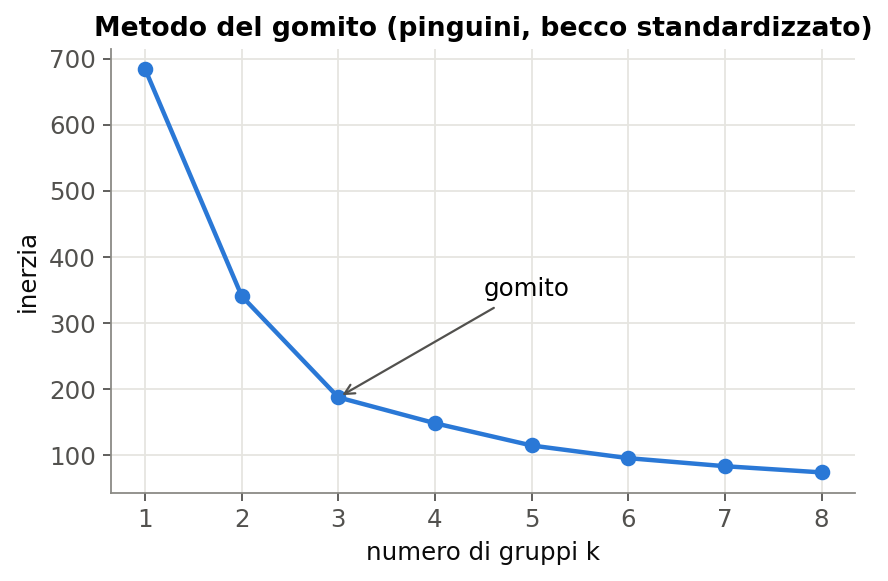
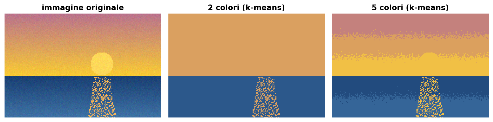

# Lezione L14 - Bias, scorciatoie e uso responsabile dei modelli

## Obiettivi della lezione

- riconoscere le principali origini del bias nei dati
- spiegare perché un modello addestrato su decisioni storiche ne riproduce le distorsioni
- spiegare perché togliere una variabile sensibile non basta
- valutare un modello separatamente per gruppi
- riconoscere una fuga di informazione
- conoscere gli strumenti di documentazione di dati e modelli e i principi essenziali delle norme europee

## Bias

Nel linguaggio dell'apprendimento automatico "bias" ha più significati. In questa lezione:

- Bias (distorsione) nei dati o in un modello
  errore sistematico che porta il modello a funzionare peggio, o a decidere in modo diverso, per alcuni gruppi di persone o di casi, senza una giustificazione legata al compito.

Origini principali:

- Campione non rappresentativo (L2)
  alcuni gruppi sono poco presenti nei dati; il modello impara poco su di loro e sbaglia di più.
- Etichette distorte
  le etichette sono state prodotte da persone o processi con pregiudizi; il modello impara i pregiudizi come se fossero la "risposta corretta".
- Dati storici
  i dati descrivono il passato, comprese disuguaglianze e discriminazioni; un modello che li imita le prolunga nel futuro.
- Misura inadeguata
  si misura una cosa diversa da quella che interessa: per esempio si usa il numero di arresti come misura della criminalità, ma gli arresti dipendono anche da dove la polizia pattuglia di più.

Diagramma: come la distorsione passa dai dati al modello

<!-- diag: bias -->


La freccia di ritorno indica il rischio maggiore: le decisioni del modello producono nuovi dati, usati per addestrare i modelli successivi, e la distorsione si rafforza.

## Casi reali

- Selezione del personale
  Amazon ha sviluppato tra il 2014 e il 2017 un sistema sperimentale per valutare i curricula, addestrato sui curricula ricevuti negli anni precedenti, in maggioranza maschili. Il sistema penalizzava i curricula che contenevano la parola "women's" (per esempio "capitana del club di scacchi femminile") e quelli di college femminili; il progetto è stato abbandonato. Scheda dell'AI Incident Database: https://incidentdatabase.ai/cite/37/
- Valutazione del rischio di recidiva
  nel 2016 l'inchiesta "Machine Bias" di ProPublica ha analizzato COMPAS, un software usato nei tribunali statunitensi per stimare il rischio che un imputato commetta nuovi reati: gli imputati neri che non avevano commesso nuovi reati erano classificati "ad alto rischio" quasi il doppio delle volte rispetto agli imputati bianchi, anche se la variabile "etnia" non era tra le caratteristiche. https://www.propublica.org/article/machine-bias-risk-assessments-in-criminal-sentencing
- Riconoscimento facciale
  lo studio "Gender Shades" (Buolamwini e Gebru, 2018) ha misurato tre sistemi commerciali di classificazione del genere da foto del volto: l'errore massimo era dello 0,8% per gli uomini con pelle chiara e fino al 34,7% per le donne con pelle scura, per effetto soprattutto della composizione dei dati di addestramento. https://proceedings.mlr.press/v81/buolamwini18a.html

In tutti e tre i casi i modelli avevano buone prestazioni complessive. Il problema emerge solo valutando i gruppi separatamente.

## Un esperimento: la selezione per uno stage

Il laboratorio usa un dataset simulato: 600 candidature fittizie a uno stage estivo e le decisioni prese negli anni precedenti da una commissione. Ogni candidato ha media dei voti, percentuale di assenze, attività extrascolastiche, quartiere di residenza (centro o periferia), uso del trasporto scolastico. I dati sono costruiti in modo che:

- i requisiti dichiarati del bando dipendano solo da media, assenze e attività
- la commissione, nelle decisioni storiche, sia stata più severa con i candidati della periferia

Risultati:

- tra i candidati qualificati, la commissione ha ammesso il 93% dei candidati del centro e il 48% di quelli della periferia
- un albero di decisione addestrato sulle decisioni storiche ha accuratezza 0,86 sulla verifica
- tra i candidati qualificati dell'insieme di verifica, il modello ammette l'87% dei candidati del centro e il 46% di quelli della periferia

{width=75%}

L'accuratezza è alta perché misura la somiglianza con le decisioni storiche: il modello imita bene la commissione, distorsione compresa. Un'alta accuratezza non dice nulla sulla correttezza delle etichette.

## Togliere la variabile sensibile non basta

Si addestra un secondo modello senza la colonna `quartiere`. La differenza tra i due gruppi resta quasi uguale (80% contro 46% di ammessi tra i qualificati).

- Variabile proxy (variabile sostitutiva)
  variabile che non è la caratteristica sensibile ma è fortemente correlata con essa, e permette al modello di ricostruirla. Nel dataset: l'uso del trasporto scolastico (77% dei candidati della periferia, 13% del centro) e, in parte, le assenze, più alte in periferia a causa dei tragitti.

Nei casi reali sono proxy tipiche il codice di avviamento postale, la scuola frequentata, il nome, alcune parole in un curriculum. È lo stesso meccanismo del caso COMPAS e del caso Amazon.

Rimedi possibili, nessuno automatico:

- controllare l'origine delle etichette: sono decisioni da imitare?
- valutare il modello per gruppo, con le stesse metriche (tasso di ammissione, falsi negativi) per ogni gruppo
- raccogliere dati più rappresentativi
- rivedere le caratteristiche usate
- mantenere una persona responsabile della decisione finale, con la possibilità di contestarla

## Valutare per gruppo

- Valutazione disaggregata
  calcolo delle metriche (accuratezza, precisione, richiamo, tasso di esiti positivi) separatamente per ogni gruppo rilevante: genere, età, provenienza, zona, e nel caso dei pinguini specie e sesso.

Esistono diverse definizioni formali di equità di un classificatore (stesso tasso di esiti positivi, stessi tassi di errore, stessa precisione tra i gruppi); in generale non possono essere soddisfatte tutte insieme. Scegliere quale privilegiare è una decisione etica e politica, non solo tecnica.

## Fuga di informazione

- Fuga di informazione (data leakage)
  presenza, tra le caratteristiche, di un'informazione che non sarebbe disponibile al momento della previsione, oppure che contiene già la risposta. Produce prestazioni eccellenti in verifica e inutili nell'uso reale.

Nel dataset della selezione: la colonna `colloquio_svolto` vale 1 esattamente per i candidati ammessi, perché il colloquio si svolgeva dopo la decisione. Un modello che la usa ha accuratezza 1,0, ma per un nuovo candidato l'informazione non esiste ancora.

Altri esempi:

- prevedere se un paziente ha una malattia usando il farmaco che gli è stato prescritto per curarla
- nei tragitti, usare la fascia oraria di arrivo a scuola per prevedere il tempo impiegato
- standardizzare o pulire i dati usando anche l'insieme di verifica (L10)

Segnale d'allarme: un risultato "troppo buono" per il problema. Va sempre chiesto: questa informazione sarebbe disponibile, al momento della decisione, per un caso nuovo?

## Documentare dati e modelli

- Scheda del dataset (datasheet)
  documento che descrive come e perché un dataset è stato raccolto, chi contiene, quali limiti ha, per quali usi è adatto. Estende il dizionario dei dati di L2.
- Scheda del modello (model card)
  documento che descrive un modello: scopo, dati di addestramento, caratteristiche, prestazioni complessive e per gruppo, limiti, usi sconsigliati. Proposta in: Mitchell e altri, Model Cards for Model Reporting, 2019, https://arxiv.org/abs/1810.03993

Esempio di scheda essenziale per il classificatore dei pinguini:

| voce | contenuto |
|---|---|
| scopo | riconoscere la specie di un pinguino adulto (Adelie, Chinstrap, Gentoo) da misure del becco e della pinna |
| dati | Palmer Penguins, 342 pinguini, isole Biscoe, Dream, Torgersen, 2007-2009, licenza CC0 |
| caratteristiche | lunghezza del becco, lunghezza della pinna |
| modello | albero di decisione, profondità massima 3 |
| prestazioni | accuratezza 0,977 su 86 pinguini di verifica |
| per gruppo | da calcolare per specie e per sesso |
| limiti | solo tre specie; solo pinguini adulti; altre specie verrebbero comunque assegnate a una delle tre; misure prese con il protocollo dei ricercatori |

## Norme: cenni

Il Regolamento europeo sull'intelligenza artificiale (AI Act, Regolamento UE 2024/1689) classifica i sistemi di IA secondo il rischio. Tra i sistemi ad alto rischio rientrano quelli usati nell'istruzione per l'ammissione, la valutazione e la sorveglianza durante le prove, e quelli usati per la selezione del personale. Per questi sistemi sono previsti obblighi su qualità dei dati, documentazione, trasparenza e supervisione umana. Il GDPR (art. 22) prevede il diritto di non essere sottoposti a decisioni basate unicamente su un trattamento automatizzato che producono effetti significativi sulla persona. Il quadro normativo è trattato nel corso B.4.

Testo italiano dell'AI Act: https://eur-lex.europa.eu/eli/reg/2024/1689/oj?locale=it

## Laboratorio L14

Durata indicativa: 30 minuti. Materiali: notebook `L14_bias.ipynb`, `L14_selezione_stage.csv` (dati simulati), `pinguini.csv`.

Esercizio 1 (base): confrontare per quartiere la frazione di qualificati e di ammessi nelle decisioni storiche.

Esercizio 2 (base): addestrare un albero sulle decisioni storiche e leggerne accuratezza e importanza delle caratteristiche.

Esercizio 3 (standard): valutare il modello per quartiere tra i candidati qualificati; spiegare perché l'accuratezza alta non basta.

Esercizio 4 (standard): togliere il quartiere e verificare se la differenza sparisce; individuare le variabili proxy.

Esercizio 5 (standard): aggiungere `colloquio_svolto`, spiegare l'accuratezza perfetta e la fuga di informazione.

Esercizio 6 (approfondimento): compilare la scheda del modello dei pinguini, con le prestazioni per specie e per sesso.

# Lezione L15 - Apprendimento non supervisionato: raggruppare i dati

## Obiettivi della lezione

- distinguere apprendimento supervisionato e non supervisionato
- descrivere e applicare a mano l'algoritmo k-means
- usare `KMeans` di scikit-learn e interpretarne i risultati
- scegliere il numero di gruppi con il metodo del gomito
- riconoscere applicazioni e limiti del raggruppamento

## Dati senza etichetta

Nell'apprendimento non supervisionato gli esempi non hanno etichetta: non esiste una "risposta corretta" da imitare. Il modello cerca una struttura nei dati.

- Raggruppamento (clustering)
  divisione degli esempi in gruppi (cluster) tali che gli esempi di uno stesso gruppo siano simili tra loro e diversi da quelli degli altri gruppi.

Applicazioni:

- segmentazione: gruppi di clienti, di studenti, di utenti con comportamenti simili
- esplorazione: scoprire se nei dati esistono tipi diversi non ancora noti
- compressione: ridurre il numero di colori di un'immagine
- rilevamento di anomalie: esempi lontani da tutti i gruppi (corso B.4, L11)

## L'algoritmo k-means

- k-means
  algoritmo di raggruppamento che divide gli esempi in k gruppi, ciascuno rappresentato dal proprio centroide, cioè il punto medio degli esempi del gruppo. Il numero k si sceglie in anticipo.

Passi:

1. scegliere k centroidi iniziali, di solito a caso
2. assegnare ogni esempio al centroide più vicino (distanza euclidea, come nel k-NN)
3. spostare ogni centroide nella media degli esempi assegnati
4. ripetere i passi 2 e 3 finché le assegnazioni non cambiano più

{width=100%}

Esempio a mano: punti (1, 1), (1,5; 2), (2, 1), (6, 5), (7, 6), (6,5; 7); centroidi iniziali A = (1,5; 3) e B = (6, 0).

- passo 1, assegnazione: il punto (6, 5) dista 4,9 da A e 5,0 da B, quindi va con A; solo (7, 6) è più vicino a B
- passo 1, aggiornamento: A diventa la media di cinque punti, (3,4; 3,2); B diventa (7, 6)
- passo 2: i tre punti in alto a destra sono ora più vicini a B; A = (1,5; 1,33), B = (6,5; 6)
- passo 3: le assegnazioni non cambiano, l'algoritmo si ferma

Il k-means trova sempre k gruppi, anche se nei dati non ci sono gruppi naturali; e il risultato dipende dai centroidi iniziali. Per questo si ripete l'algoritmo più volte da punti di partenza diversi e si tiene il risultato con l'inerzia più bassa.

- Inerzia
  somma dei quadrati delle distanze di ogni esempio dal proprio centroide. Misura quanto i gruppi sono compatti.

Nomi da non confondere: il k del k-means è il numero di gruppi; il k del k-NN è il numero di vicini; il k della validazione incrociata il numero di blocchi.

## I pinguini senza specie

Si applica il k-means a lunghezza e profondità del becco, standardizzate, senza fornire la specie. La specie si usa solo dopo, per confrontare.

```python
from sklearn.cluster import KMeans
from sklearn.preprocessing import StandardScaler

X = StandardScaler().fit_transform(pinguini[["becco_lunghezza_mm", "becco_profondita_mm"]])
km = KMeans(n_clusters=3, n_init=10, random_state=0).fit(X)
km.labels_            # gruppo di ogni pinguino: 0, 1, 2
km.cluster_centers_   # coordinate dei centroidi
```

- `KMeans(n_clusters=3)`: k = 3 gruppi
- `n_init=10`: ripete l'algoritmo 10 volte da centroidi iniziali diversi e tiene il risultato migliore
- `fit(X)`: nessuna etichetta
- `labels_`: numeri dei gruppi; non hanno significato, e non corrispondono in ordine alle specie

{width=100%}

| specie | gruppo 0 | gruppo 1 | gruppo 2 |
|---|---|---|---|
| Adelie | 0 | 147 | 4 |
| Chinstrap | 9 | 5 | 54 |
| Gentoo | 116 | 1 | 6 |

Senza conoscere le specie, il k-means trova tre gruppi che corrispondono in larga parte alle tre specie: 317 pinguini su 342 (93%) sono nel gruppo della propria specie. È un modo per scoprire una struttura nei dati; in un caso reale i gruppi andrebbero poi interpretati da un esperto.

Standardizzazione: con le quattro misure non standardizzate, la massa (migliaia di grammi) domina le distanze e i gruppi corrispondono molto meno alle specie (237 pinguini su 342); standardizzando si torna a 313.

## Quanti gruppi?

Aumentando k l'inerzia diminuisce sempre: con k uguale al numero di esempi, ogni esempio è un gruppo e l'inerzia è zero. Non si sceglie quindi il k con l'inerzia minima.

- Metodo del gomito
  si disegna l'inerzia al variare di k e si sceglie il valore oltre il quale la diminuzione diventa piccola, il "gomito" della curva.

{width=65%}

Per i pinguini l'inerzia passa da 684 (k = 1) a 340 (k = 2) e 187 (k = 3), poi scende lentamente (148 con k = 4): il gomito è a k = 3. Spesso il gomito non è così netto; la scelta di k dipende allora anche dallo scopo (quanti gruppi di clienti è utile gestire?).

## Ridurre i colori di un'immagine

Ogni pixel di un'immagine a colori è un punto con tre coordinate (rosso, verde, blu). Il k-means divide i pixel in k gruppi di colori simili; sostituendo ogni pixel con il colore del proprio centroide si ottiene un'immagine con soli k colori. È una forma di compressione: basta memorizzare k colori e, per ogni pixel, il numero del gruppo.

{width=100%}

## Supervisionato o non supervisionato?

| | supervisionato | non supervisionato |
|---|---|---|
| dati | esempi con etichetta | esempi senza etichetta |
| obiettivo | prevedere l'etichetta di esempi nuovi | trovare struttura: gruppi, anomalie |
| valutazione | confronto con le etichette vere (L10) | più difficile: compattezza, interpretazione |
| esempi nel corso | regole, k-NN, alberi, regressione | k-means |

Quando le etichette mancano o costano troppo, il raggruppamento aiuta a esplorare i dati; i gruppi trovati possono poi diventare etichette da verificare.

## Laboratorio L15

Durata indicativa: 30 minuti. Materiali: notebook `L15_kmeans.ipynb`, `pinguini.csv`, `L15_tramonto.npy` (immagine sintetica).

Esercizio 1 (base, anche su carta): eseguire a mano i passi del k-means sui sei punti; verificare con il notebook.

Esercizio 2 (base): k-means sui pinguini senza la specie; confrontare gruppi e specie con una tabella a doppia entrata.

Esercizio 3 (standard): ripetere con quattro misure, senza e con standardizzazione; spiegare la differenza.

Esercizio 4 (standard): metodo del gomito.

Esercizio 5 (approfondimento): ridurre i colori dell'immagine con k = 2, 4, 8, 16.
