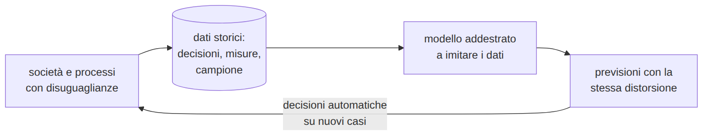

<!-- _class: titolo -->
<!-- _paginate: false -->

## Modulo 4B - Bias, uso responsabile, apprendimento non supervisionato

B.6 - Data science e Machine Learning: dai dati ai modelli

Lezioni L14, L15

---

<!-- _class: titolo -->

## L14 - Bias, scorciatoie e uso responsabile dei modelli

---

## Bias: da dove viene

- **campione non rappresentativo**: gruppi poco presenti
- **etichette distorte**: pregiudizi di chi ha etichettato
- **dati storici**: le disuguaglianze del passato
- **misura inadeguata**: arresti al posto dei reati

---

## Casi reali

- **Amazon, 2014-2017**: curricula valutati imitando assunzioni passate, penalizzata la parola "women's". https://incidentdatabase.ai/cite/37/
- **COMPAS, ProPublica 2016**: falsi "alto rischio" quasi doppi per gli imputati neri, senza la variabile etnia. https://www.propublica.org/article/machine-bias-risk-assessments-in-criminal-sentencing
- **Gender Shades, 2018**: errore fino a 34,7% per donne con pelle scura, 0,8% per uomini con pelle chiara. https://proceedings.mlr.press/v81/buolamwini18a.html

Prestazioni complessive buone: il problema si vede **per gruppo**.

---

## Esperimento: selezione per uno stage (dati simulati)

Accuratezza del modello **0,86**: imita bene la commissione, **distorsione compresa**.

---

## Togliere il quartiere non basta

Senza `quartiere`: 80% contro 46%.

**Variabili proxy**: trasporto scolastico (77% periferia, 13% centro), assenze

Nel mondo reale: CAP, scuola, nome, parole del curriculum.

Rimedi: origine delle etichette, **valutazione per gruppo**, dati rappresentativi, persona responsabile della decisione.

---

## Fuga di informazione

`colloquio_svolto` = 1 solo per gli ammessi (colloquio **dopo** la decisione): accuratezza **1,0**, modello inutile.

- farmaco prescritto per prevedere la malattia
- orario di arrivo per prevedere il tempo di tragitto
- pulizia o standardizzazione con i dati di verifica

Domanda da porsi: l'informazione è disponibile **al momento della decisione**?

---

## Documentare dati e modelli

- **scheda del dataset** (datasheet): raccolta, contenuto, limiti, usi
- **scheda del modello** (model card): scopo, dati, prestazioni **per gruppo**, limiti

Mitchell e altri, 2019: https://arxiv.org/abs/1810.03993

AI Act: sistemi ad **alto rischio** nell'istruzione e nella selezione del personale; GDPR art. 22: decisioni solo automatizzate. (Corso B.4)

---

## Laboratorio L14

Notebook `L14_bias.ipynb`, `L14_selezione_stage.csv` (simulato)

1. (base) qualificati e ammessi per quartiere
2. (base) modello sulle decisioni storiche
3. (standard) valutazione per gruppo
4. (standard) senza quartiere: le variabili proxy
5. (standard) fuga di informazione
6. (approfondimento) scheda del modello dei pinguini

---

<!-- _class: titolo -->

## L15 - Apprendimento non supervisionato: raggruppare i dati

---

## Dati senza etichetta

**Raggruppamento** (clustering): gruppi di esempi simili tra loro

- segmentazione di clienti o utenti
- esplorazione dei dati
- riduzione dei colori di un'immagine
- anomalie (B.4)

---

## L'algoritmo k-means

1. k centroidi iniziali
2. ogni esempio al centroide più vicino
3. ogni centroide nella media dei suoi esempi
4. ripetere finché nulla cambia

---

## k-means a mano

Punti (1, 1), (1,5; 2), (2, 1), (6, 5), (7, 6), (6,5; 7)
Centroidi iniziali A = (1,5; 3), B = (6, 0)

- passo 1: solo (7, 6) va a B; A = (3,4; 3,2), B = (7, 6)
- passo 2: i tre punti in alto passano a B; A = (1,5; 1,33), B = (6,5; 6)
- passo 3: nessun cambiamento

**Inerzia**: somma dei quadrati delle distanze dai centroidi. Risultato dipendente dall'inizio: si ripete più volte (`n_init`).

---

## I pinguini senza specie

317 pinguini su 342 nel gruppo della propria specie. Senza standardizzare (4 misure): 237.

---

## Quanti gruppi? Il gomito

L'inerzia scende sempre: si cerca dove smette di scendere molto. Pinguini: **k = 3**.

---

## Ridurre i colori

Ogni pixel = punto (rosso, verde, blu); k gruppi = k colori.

---

## Supervisionato o non supervisionato?

| | supervisionato | non supervisionato |
|---|---|---|
| dati | con etichetta | senza etichetta |
| obiettivo | prevedere | trovare struttura |
| valutazione | con le etichette vere | compattezza, interpretazione |
| nel corso | regole, k-NN, alberi, regressione | k-means |

---

## Laboratorio L15

Notebook `L15_kmeans.ipynb`

1. (base, anche su carta) k-means a mano
2. (base) pinguini senza specie: gruppi e specie
3. (standard) quattro misure, con e senza standardizzazione
4. (standard) metodo del gomito
5. (approfondimento) ridurre i colori di un'immagine
