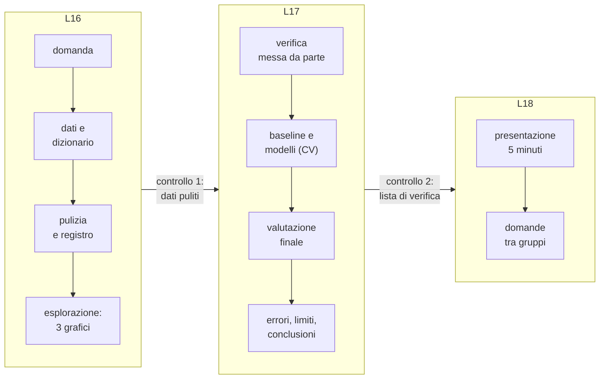
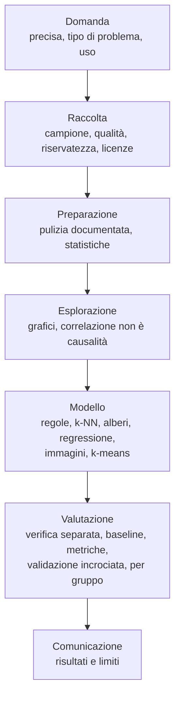

# Lezione L16 - Progetto: domanda, dati, preparazione

## Obiettivi delle lezioni L16-L18

- applicare l'intero ciclo della data science a un problema scelto dal gruppo
- documentare dati, scelte e risultati in un notebook rieseguibile
- valutare un modello con un metodo corretto e riconoscerne i limiti
- comunicare risultati e limiti a un pubblico non tecnico
- porre domande sul metodo del lavoro di altri gruppi

## Il progetto

Il progetto ripercorre il ciclo del corso su un problema nuovo, a gruppi di tre o quattro, in tre lezioni.

Diagramma: il progetto e i suoi punti di controllo

<!-- diag: progetto -->

Scenari tra cui scegliere:

1. Dataset della classe (tragitti): prevedere il mezzo o il tempo di tragitto
2. Vini italiani: riconoscere il vitigno da 13 misure chimiche; dataset "Wine" dell'UCI Machine Learning Repository (178 vini, tre vitigni, licenza CC BY 4.0), incluso in scikit-learn e disponibile offline. https://archive.ics.uci.edu/dataset/109/wine
3. Dataset aperto scelto dal gruppo (dati.gov.it, UCI), approvato dal docente
4. Immagini con Teachable Machine, con un'analisi sistematica delle prove

Materiali: scheda `L16_scheda_progetto.md`, modello del notebook `L16_progetto_modello.ipynb`, esempio completo `L16_progetto_esempio.ipynb` (progetto svolto sui tragitti).

## Fase 1: la domanda

Una buona domanda di progetto:

- è precisa: "dalla distanza e dal tempo si può prevedere il mezzo?" e non "studiamo i trasporti"
- indica il tipo di problema (classificazione, regressione, raggruppamento) e l'etichetta
- è rispondibile con i dati disponibili
- ha un uso plausibile, e chi la pone sa dire per che cosa il risultato non deve essere usato

## Fase 2: i dati

Da documentare nel notebook:

- fonte (URL o descrizione della raccolta) e licenza
- unità di osservazione, numero di righe e colonne
- dizionario dei dati
- possibili distorsioni del campione (L2)

Per i dataset aperti: controllare che la dimensione sia adatta (da qualche centinaio a qualche migliaio di righe), che le variabili siano descritte, che non contengano dati personali identificativi.

## Fase 3: pulizia

Si applicano le tecniche di L5 (uniformare, convertire, duplicati, valori impossibili e anomali, mancanti), raccogliendo le operazioni in una funzione o in celle ordinate e compilando il registro. Una funzione di pulizia, come `pulisci(d)` nel progetto di esempio, permette di riapplicare le stesse operazioni a nuovi dati.

## Fase 4: esplorazione

Almeno tre grafici (L6), ciascuno con un commento di due o tre righe che risponde a due domande:

- che cosa mostra?
- che cosa suggerisce per il modello? (quali caratteristiche separano le classi, quali classi saranno difficili, servono nuove caratteristiche?)

Nuove caratteristiche calcolate da quelle esistenti sono spesso utili: nel progetto di esempio la velocità media (distanza diviso tempo) separa meglio i mezzi lenti. Una caratteristica calcolata va controllata per la fuga di informazione (L14): deve essere disponibile al momento della previsione.

# Lezione L17 - Progetto: modello, valutazione, conclusioni

## Fase 5: modelli

Procedura (L10-L11):

1. separare subito l'insieme di verifica (per esempio il 25%)
2. calcolare la baseline
3. confrontare almeno due modelli, e per ciascuno alcuni valori degli iperparametri, con la validazione incrociata sui soli dati di addestramento
4. scegliere il modello: la media più alta, e a parità il più semplice o il più interpretabile

Scelte da motivare:

- quale metrica: accuratezza, precisione e richiamo per una classe importante, MAE per la regressione
- standardizzazione: necessaria per k-NN e k-means, calcolata sui soli dati di addestramento
- codifica one-hot per le variabili qualitative

## Fase 6: valutazione finale e analisi degli errori

- una sola misura sulla verifica, confrontata con la baseline
- matrice di confusione (classificazione) o grafico dei residui e dei valori previsti contro i veri (regressione)
- almeno due errori esaminati: che cosa avevano di particolare quegli esempi?
- prestazioni per gruppo, se esistono gruppi rilevanti (L14)
- attenzione alle classi con pochissimi esempi di verifica: il loro risultato è poco affidabile

## Fase 7: limiti

Un limite utile è specifico. Confronto:

- generico: "servirebbero più dati"
- specifico: "i monopattini sono solo 15 e hanno velocità simili alle bici: il modello non li distingue; servirebbe un'altra informazione, oppure unire le due classi"

Elenco di controllo:

- limiti del campione (chi manca, quale periodo, quale luogo)
- limiti della qualità dei dati
- limiti del modello (classi confuse, estrapolazione)
- possibili bias e usi sconsigliati

## Fase 8: conclusioni e comunicazione

La conclusione risponde alla domanda iniziale in poche righe, con parole comprensibili a chi non ha seguito il corso, e con la cautela proporzionata ai risultati.

Espressioni da evitare e alternative:

| da evitare | alternativa |
|---|---|
| "il modello è accurato al 77%" | "su 35 studenti che il modello non aveva visto, il mezzo è stato riconosciuto per 27" |
| "l'IA ha capito che..." | "il modello usa soprattutto la velocità media per distinguere..." |
| "abbiamo dimostrato che la distanza causa..." | "distanza e tempo sono fortemente correlati; la relazione causale è plausibile per ragioni fisiche" |
| "il modello funziona" | "il modello funziona bene per bus e spostamenti a piedi, male per monopattino e bici" |

Una presentazione di 5 minuti segue la struttura della scheda: domanda, dati, un grafico, modello contro baseline, un errore e un limite, risposta in una frase.

## Errori metodologici frequenti

- valutare sui dati di addestramento
- scegliere gli iperparametri guardando la verifica
- nessuna baseline
- sola accuratezza con classi sbilanciate
- standardizzare o pulire usando anche i dati di verifica
- caratteristiche che contengono la risposta
- conclusioni generali da pochi esempi
- notebook che funziona solo eseguendo le celle in un ordine particolare

# Lezione L18 - Presentazione e valutazione

## Presentazioni

Ogni gruppo presenta in 5 minuti. Gli altri gruppi compilano la scheda delle domande tra gruppi: una cosa convincente e una domanda sul metodo.

Domande utili sul metodo:

- come sono stati trattati i valori mancanti e i valori anomali?
- quale era la baseline?
- come avete scelto gli iperparametri?
- quali esempi il modello sbaglia, e perché?
- per chi o per che cosa il modello non andrebbe usato?

## Valutazione

Il progetto è valutato con la rubrica `L18_rubrica.md` su quattro dimensioni: dati, modello e valutazione, interpretazione e limiti, comunicazione.

## Il corso in sintesi

Diagramma: che cosa si è fatto in ogni fase del ciclo

<!-- diag: sintesi -->

Tre idee attraversano tutto il corso:

- un modello impara ciò che è nei dati, comprese le distorsioni e le scorciatoie
- un modello si giudica su dati che non ha visto, confrontandolo con una baseline
- ogni scelta (quali dati, quali caratteristiche, quale metrica) va documentata, perché altri possano verificarla

Per proseguire:

- corso B.8: come funzionano all'interno neuroni, discesa del gradiente e reti neurali
- corso B.4: come si attaccano e si difendono i modelli
- Kaggle Learn, micro-corsi gratuiti in inglese (Pandas, Data Visualization, Intro to Machine Learning, Intro to AI Ethics): https://www.kaggle.com/learn
- Microsoft, ML for Beginners, curriculum gratuito con licenza MIT: https://github.com/microsoft/ML-For-Beginners
