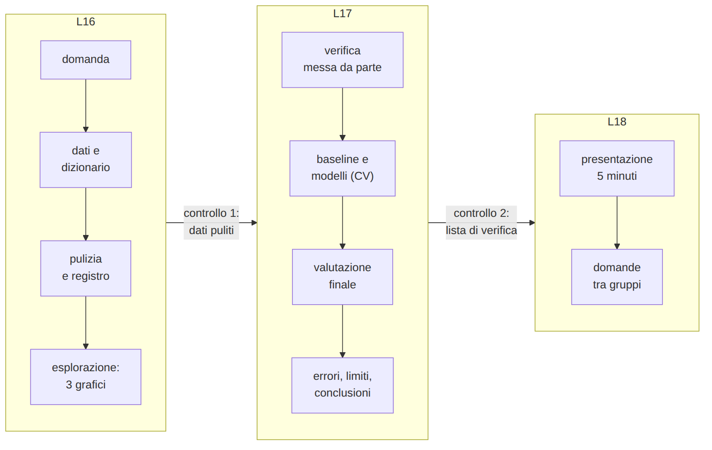
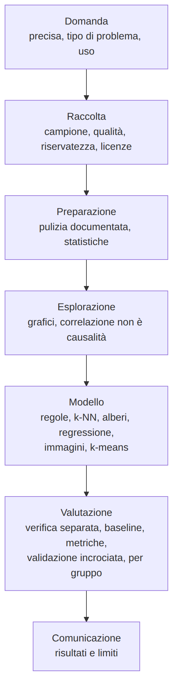

<!-- _class: titolo -->
<!-- _paginate: false -->

## Modulo 5 - Progetto finale

B.6 - Data science e Machine Learning: dai dati ai modelli

Lezioni L16, L17, L18

---

<!-- _class: titolo -->

## L16 - Progetto: domanda, dati, preparazione

---

## Il progetto

---

## Scenari

1. **tragitti della classe**: mezzo o tempo
2. **vini italiani**: vitigno da 13 misure chimiche (UCI Wine, CC BY 4.0, incluso in scikit-learn)
3. **dataset aperto** approvato (dati.gov.it, UCI)
4. **immagini** con Teachable Machine

Materiali: `L16_scheda_progetto.md`, `L16_progetto_modello.ipynb`, `L16_progetto_esempio.ipynb`

---

## Domanda e dati

Una buona domanda:

- è **precisa** e indica tipo di problema ed etichetta
- è **rispondibile** con i dati
- ha un **uso** plausibile (e usi sconsigliati)

Dati: fonte, licenza, unità di osservazione, dizionario, distorsioni del campione

---

## Pulizia ed esplorazione

- pulizia in una funzione, con **registro**
- almeno **tre grafici**, ciascuno con commento:
  - che cosa mostra?
  - che cosa suggerisce per il modello?
- nuove caratteristiche (velocità = distanza / tempo): disponibili **al momento della previsione**?

---

<!-- _class: titolo -->

## L17 - Progetto: modello, valutazione, conclusioni

---

## Modelli

1. verifica **messa da parte subito**
2. **baseline**
3. almeno **due modelli**, iperparametri con **validazione incrociata** sull'addestramento
4. scelta: media più alta; a parità, il più semplice

Metrica motivata; standardizzazione solo sull'addestramento; one-hot per le qualitative

---

## Valutazione finale ed errori

- **una sola** misura sulla verifica, confrontata con la baseline
- matrice di confusione o residui
- almeno **due errori** esaminati
- prestazioni **per gruppo**
- classi con pochi esempi: risultato poco affidabile

---

## Limiti specifici, non generici

- generico: "servirebbero più dati"
- specifico: "i monopattini sono 15 e hanno velocità simili alle bici: il modello non li distingue"

Campione, qualità, modello, bias, usi sconsigliati

---

## Comunicare

| da evitare | alternativa |
|---|---|
| "accurato al 77%" | "27 studenti su 35 mai visti riconosciuti" |
| "l'IA ha capito che..." | "il modello usa soprattutto..." |
| "la distanza causa..." | "sono correlate; causalità plausibile per ragioni fisiche" |
| "il modello funziona" | "bene per bus e piedi, male per monopattino" |

---

## Errori metodologici frequenti

- valutare sui dati di addestramento
- iperparametri scelti sulla verifica
- nessuna baseline
- sola accuratezza con classi sbilanciate
- trasformazioni calcolate anche sulla verifica
- caratteristiche che contengono la risposta
- conclusioni generali da pochi esempi
- notebook che non si riesegue da capo

---

<!-- _class: titolo -->

## L18 - Presentazione e valutazione

---

## Presentazione: 5 minuti

1. domanda (30 s)
2. dati e pulizia (1 min)
3. un grafico (1 min)
4. modello e baseline (1 min)
5. un errore e un limite (1 min)
6. risposta in una frase (30 s)

Domande tra gruppi: baseline? iperparametri? errori? usi sconsigliati?

---

## Il corso in sintesi

---

## Tre idee

- un modello impara ciò che è nei dati, **distorsioni e scorciatoie comprese**
- un modello si giudica su **dati mai visti**, contro una **baseline**
- ogni scelta va **documentata**

Per proseguire: corso **B.8** (dentro le reti neurali), corso **B.4** (attacchi e difese), Kaggle Learn, ML for Beginners
