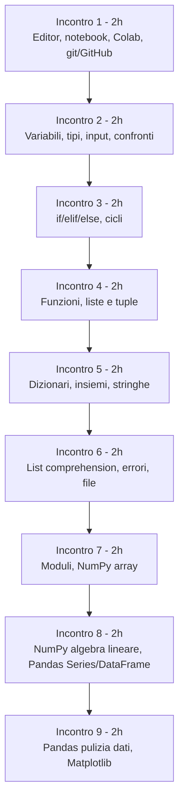
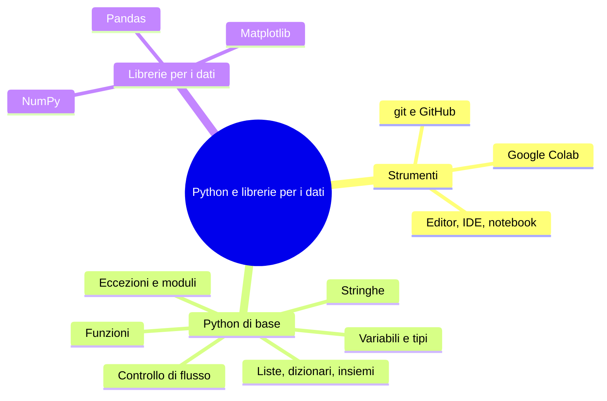

# Syllabus - B.8: Linguaggio Python per il Machine Learning ed il Deep Learning

## Informazioni generali

| Voce | Valore |
|---|---|
| Codice incarico | B.8 |
| Titolo | Linguaggio Python per il Machine Learning ed il Deep Learning: Python per l'Intelligenza Artificiale |
| Destinatari | Studenti di 16-18 anni (laboratorio formativo sul campo, gruppi di almeno 5 unità) |
| Durata totale | 18 ore |
| Struttura proposta | 9 incontri da 2 ore (ipotesi principale); in alternativa, 6 incontri da 3 ore |
| Durata di ogni lezione | circa 1 ora (di cui 20-30 minuti di esercitazione pratica) |
| Tipo di lezione | lezpub (materiale destinato alla distribuzione agli studenti) |
| Ambiente principale | notebook Jupyter, preferibilmente via Google Colab; alternativa offline con Jupyter locale |
| Requisito hardware | laptop di fascia bassa, nessuna GPU richiesta |

Le 18 lezioni da un'ora sono l'unità stabile di questo syllabus.  
La loro aggregazione in incontri dipende dalla durata effettiva delle sessioni, non ancora certa: 18 si divide esattamente sia per 2 sia per 3, quindi entrambe le ipotesi restano percorribili senza spezzare una lezione a metà.  
La sezione "Struttura del corso" mostra entrambe le aggregazioni; il resto del documento, incluso il dettaglio delle lezioni, segue l'ipotesi principale a 2 ore.

## Corsi open source di riferimento

### Software Carpentry, Plotting and Programming in Python  

introduzione a Python per persone senza esperienza di programmazione, con lettura di dati tabulari, Pandas e Matplotlib come filo conduttore; è la fonte più vicina nei contenuti e nell'impostazione a questo modulo. https://swcarpentry.github.io/python-novice-gapminder/  

### Kaggle Learn, Python  

microcorso gratuito sulla sintassi di base, funzioni, condizionali, liste e cicli, dizionari e stringhe.  
https://www.kaggle.com/learn/python  

### Kaggle Learn, Pandas  

microcorso gratuito su creazione e lettura di DataFrame, selezione dei dati, raggruppamento e ordinamento.  
https://www.kaggle.com/learn/pandas  

### Kaggle Learn, Data Visualization  

microcorso gratuito sui grafici più comuni (linee, barre, dispersione, istogrammi) applicati a dati reali.  
https://www.kaggle.com/learn/data-visualization  

### NumPy quickstart  

guida introduttiva ufficiale alla libreria, con la spiegazione degli array multidimensionali e delle operazioni vettoriali di base.  
https://numpy.org/doc/stable/user/quickstart.html  

### GitHub Skills, Introduction to GitHub  

corso interattivo ufficiale di GitHub, gratuito, che in meno di un'ora guida alla creazione di un repository, un commit e una pull request; utile come riferimento per il docente anche se la lezione di questo modulo si limita a un sottoinsieme più semplice (repository, commit, push, condivisione), senza branch né pull request.  
https://github.com/skills/introduction-to-github  


## Obiettivi generali del corso

Al termine del corso lo studente dovrebbe essere in grado di

- leggere e scrivere programmi Python di base, comprese le strutture dati fondamentali e la gestione degli errori più comuni
- lavorare in autonomia con un notebook Jupyter, sia in locale sia su Google Colab
- salvare e condividere i propri programmi con git e GitHub
- usare NumPy per rappresentare vettori e matrici e calcolare prodotto scalare e prodotto matriciale
- usare Pandas per leggere, esplorare e ripulire un insieme di dati tabulare
- usare Matplotlib per rappresentare graficamente dei dati

## Struttura del corso

### Ipotesi principale: 9 incontri da 2 ore



### Ipotesi alternativa: 6 incontri da 3 ore

Le stesse 18 lezioni, raggruppate diversamente se gli incontri risultassero da 3 ore invece che da 2:

| Incontro | Ore | Lezioni | Contenuto |
|---|---|---|---|
| 1 | 3 | 1-3 | Strumenti di lavoro, variabili e tipi |
| 2 | 3 | 4-6 | Input e confronti, if/elif/else, cicli |
| 3 | 3 | 7-9 | Funzioni, liste e tuple, dizionari e insiemi |
| 4 | 3 | 10-12 | Stringhe, list comprehension, errori e file |
| 5 | 3 | 13-15 | Moduli, NumPy array, NumPy algebra lineare |
| 6 | 3 | 16-18 | Pandas Series/DataFrame, pulizia dati, Matplotlib |



## Panoramica delle lezioni

| Incontro (2h) | Lezione | Titolo | Area | Durata |
|---|---|---|---|---|
| 1 | 1 | Editor, IDE, notebook Jupyter e Google Colab | Strumenti | 1h |
| 1 | 2 | Versionare e condividere il codice con git e GitHub | Strumenti | 1h |
| 2 | 3 | Variabili, tipi di dato e operatori | Python | 1h |
| 2 | 4 | Input, conversioni di tipo e operatori di confronto | Python | 1h |
| 3 | 5 | Strutture di controllo: if, elif, else | Python | 1h |
| 3 | 6 | Cicli: for, while, break, continue | Python | 1h |
| 4 | 7 | Funzioni | Python | 1h |
| 4 | 8 | Liste e tuple | Python | 1h |
| 5 | 9 | Dizionari e insiemi | Python | 1h |
| 5 | 10 | Stringhe e formattazione del testo | Python | 1h |
| 6 | 11 | List comprehension | Python | 1h |
| 6 | 12 | Gestione degli errori e lettura di file di testo e CSV | Python | 1h |
| 7 | 13 | Moduli, pacchetti e organizzazione del codice | Python | 1h |
| 7 | 14 | NumPy: array e operazioni vettoriali | Librerie | 1h |
| 8 | 15 | NumPy: vettori, matrici e prodotto scalare | Librerie | 1h |
| 8 | 16 | Pandas: Series e DataFrame | Librerie | 1h |
| 9 | 17 | Pandas: pulizia, raggruppamento e statistiche descrittive | Librerie | 1h |
| 9 | 18 | Matplotlib: visualizzare i dati | Librerie | 1h |

## Dettaglio delle lezioni

### Incontro 1 - Editor, notebook, Colab, git/GitHub (2 ore)

#### Lezione 1 - Editor, IDE, notebook Jupyter e Google Colab

Obiettivi: conoscere le principali opzioni gratuite per scrivere ed eseguire Python, capire cos'è un notebook Jupyter e come è organizzato in celle, e avviare il proprio primo notebook.

Contenuti:

- differenza tra editor di testo, IDE e notebook
- rassegna sintetica di Visual Studio Code con estensione Python, Thonny (leggero, adatto a chi inizia) e Jupyter/JupyterLab installato in locale, per esempio tramite Anaconda
- Google Colab come servizio che esegue notebook Jupyter nel browser, senza installazioni, con verifica che l'account Google richiesto non comporta alcun pagamento, e precisazione che le sessioni gratuite hanno comunque un tempo massimo e si disconnettono dopo un periodo di inattività, motivo per cui conviene salvare spesso il lavoro su Google Drive
- struttura di un notebook in celle di codice e celle di testo (Markdown), esecuzione di una cella con Shift+Invio, stato condiviso tra le celle di uno stesso notebook

Diagramma previsto: un diagramma di flusso Mermaid che mostra il ciclo cella scritta, cella eseguita dal kernel, risultato mostrato sotto la cella; a fianco, uno schema che confronta le opzioni (locale/cloud, con/senza installazione).

Esercizio (25-30 minuti): aprire Google Colab con il proprio account, creare un notebook con almeno tre celle di codice e due celle di testo (un titolo, una breve spiegazione, un piccolo calcolo), eseguirlo per intero, poi salvarlo su Google Drive; chi vuole prova anche a installare Thonny o Jupyter in locale.

#### Lezione 2 - Versionare e condividere il codice con git e GitHub

Obiettivi: capire a cosa serve un sistema di controllo di versione, creare un repository su GitHub, e salvare e condividere un proprio programma tramite commit e push.

Contenuti:

- perché conviene salvare le versioni del proprio codice, anche solo per poterle recuperare o condividere
- creazione di un account GitHub, gratuito per l'uso previsto in questo corso, e creazione di un repository
- i comandi di base (`git init`, `git add`, `git commit`, `git push`, `git clone`) usati sia da riga di comando sia dal pannello grafico integrato in Visual Studio Code
- come condividere un repository con l'insegnante, aggiungendolo come collaboratore oppure lasciando il repository pubblico (branch e pull request restano fuori dagli obiettivi di questo modulo)

Diagramma previsto: un diagramma Mermaid che mostra il percorso file modificato, `git add`, `git commit`, `git push`, dal computer dello studente al repository su GitHub.

Esercizio (25-30 minuti): creare un repository su GitHub, clonarlo sul proprio computer o collegarlo a un progetto già esistente, salvare un file Python con `git add` e `git commit`, eseguire il primo `git push`, e infine invitare l'insegnante come collaboratore del repository.

### Incontro 2 - Variabili, tipi, input, confronti (2 ore)

#### Lezione 3 - Variabili, tipi di dato e operatori

Obiettivi: scrivere le prime istruzioni Python, riconoscere i tipi di dato fondamentali e usare gli operatori aritmetici.

Contenuti:

- variabili e assegnazione
- tipi `int`, `float`, `str`, `bool`
- operatori aritmetici (`+ - * / // % **`)
- la funzione `print()` e i suoi argomenti principali
- commenti nel codice con `#`

Esempio di codice commentato riga per riga:

```python
eta = 17          # variabile di tipo int
altezza = 1.72    # variabile di tipo float
nome = "Giulia"   # variabile di tipo str

print(nome, "ha", eta, "anni ed è alta", altezza, "metri")
```

Diagramma previsto: uno schema Mermaid dei tipi di dato fondamentali di Python, con un esempio per ciascuno.

Esercizio (25-30 minuti): scrivere un notebook guidato in cui lo studente definisce alcune variabili su di sé (nome, età, altezza, peso), calcola una quantità derivata (per esempio l'indice di massa corporea) e stampa i risultati con `print()`.

#### Lezione 4 - Input, conversioni di tipo e operatori di confronto

Obiettivi: leggere un valore inserito dall'utente, convertire tra tipi di dato diversi, e confrontare valori tra loro.

Contenuti:

- la funzione `input()` e il fatto che restituisce sempre una stringa
- conversione con `int()`, `float()`, `str()`
- operatori di confronto (`== != < > <= >=`) e il tipo `bool` come loro risultato
- operatori logici `and`, `or`, `not`

Esempio di codice commentato:

```python
eta_testo = input("Quanti anni hai? ")   # input() restituisce sempre una stringa
eta = int(eta_testo)                      # conversione da stringa a intero

maggiorenne = eta >= 18   # confronto, il risultato è di tipo bool
print("È maggiorenne?", maggiorenne)
```

Diagramma previsto: uno schema Mermaid che mostra la conversione tra i tipi `str`, `int` e `float`, con le funzioni che permettono di passare dall'uno all'altro.

Esercizio (25-30 minuti): scrivere un programma che chiede all'utente due numeri, li converte e confronta, e stampa quale dei due è maggiore, usando `input()`, la conversione di tipo e gli operatori di confronto.

### Incontro 3 - if/elif/else, cicli (2 ore)

#### Lezione 5 - Strutture di controllo: if, elif, else

Obiettivi: far scegliere al programma un comportamento diverso in base a una condizione.

Contenuti:

- costrutto `if`, `elif`, `else`
- indentazione come parte della sintassi, non decorazione
- condizioni composte con `and`, `or`, `not`

Esempio di codice commentato:

```python
voto = 6

if voto >= 6:
    print("Sufficiente")
elif voto >= 4:
    print("Insufficiente lieve")
else:
    print("Insufficiente grave")
```

Diagramma previsto: un diagramma di flusso Mermaid che rappresenta l'esecuzione di un `if/elif/else` con tre rami.

Esercizio (25-30 minuti): scrivere un programma che, dato un voto inserito dall'utente, classifica il risultato in una delle categorie sopra e ne stampa il commento.

#### Lezione 6 - Cicli: for, while, break, continue

Obiettivi: ripetere istruzioni con i cicli, e controllarne l'interruzione o la prosecuzione.

Contenuti:

- ciclo `for` su una sequenza di numeri con `range()`
- ciclo `while` con condizione di uscita
- istruzioni `break` e `continue`

Esempio di codice commentato:

```python
for i in range(5):        # range(5) genera i numeri da 0 a 4
    if i % 2 == 0:          # % è l'operatore resto della divisione
        print(i, "è pari")
    else:
        print(i, "è dispari")
```

Diagramma previsto: un diagramma di flusso Mermaid che rappresenta l'esecuzione di un ciclo `for`, con l'evidenza del punto in cui interviene `break`.

Esercizio (25-30 minuti): scrivere un programma che, dato un elenco di voti scolastici scritto a mano nel codice, conta quanti sono sufficienti e quanti insufficienti, usando un ciclo `for` e un `if`.

### Incontro 4 - Funzioni, liste e tuple (2 ore)

#### Lezione 7 - Funzioni

Obiettivi: capire perché e come si scrivono le funzioni, per organizzare il codice ed evitare ripetizioni.

Contenuti:

- definizione di funzione con `def`
- parametri e valori di default
- istruzione `return`, e differenza tra una funzione che stampa e una che restituisce un valore
- ambito (scope) delle variabili locali

Esempio di codice commentato:

```python
def area_rettangolo(base, altezza):
    # calcola e restituisce l'area di un rettangolo
    return base * altezza

risultato = area_rettangolo(4, 3)
print("L'area è", risultato)
```

Diagramma previsto: un diagramma Mermaid che mostra l'ingresso di parametri in una funzione e l'uscita del valore restituito, come una scatola con freccia di ingresso e freccia di uscita.

Esercizio (25-30 minuti): scrivere due o tre funzioni semplici (per esempio calcolo dell'area di un cerchio, conversione da gradi Celsius a Fahrenheit) e richiamarle con valori diversi.

#### Lezione 8 - Liste e tuple

Obiettivi: rappresentare collezioni di valori con liste e tuple, e saperle manipolare.

Contenuti:

- creazione di una lista, indicizzazione (compreso l'indice negativo), slicing
- metodi principali (`append`, `remove`, `sort`, `len`)
- differenza tra lista (modificabile) e tupla (non modificabile), e quando preferire l'una o l'altra

Esempio di codice commentato:

```python
voti = [6, 7, 5, 8, 9]     # lista di interi
voti.append(10)             # aggiunge 10 in fondo alla lista
media = sum(voti) / len(voti)   # sum() somma gli elementi, len() conta gli elementi
print("Media:", media)
```

Diagramma previsto: uno schema Mermaid di una lista come sequenza di caselle numerate a partire da 0, con l'indicizzazione negativa mostrata sotto.

Esercizio (25-30 minuti): dato un elenco di temperature registrate in una settimana, calcolare massimo, minimo e media usando le funzioni built-in e i metodi di lista.

### Incontro 5 - Dizionari, insiemi, stringhe (2 ore)

#### Lezione 9 - Dizionari e insiemi

Obiettivi: rappresentare dati associativi con i dizionari e collezioni senza duplicati con gli insiemi.

Contenuti:

- creazione di un dizionario chiave-valore, accesso, aggiunta e modifica di una coppia
- ciclo `for` su un dizionario con `.items()`
- insiemi (`set`) e operazioni di unione e intersezione

Esempio di codice commentato:

```python
alunno = {"nome": "Marco", "eta": 17, "materia_preferita": "informatica"}
print(alunno["nome"])          # accesso al valore tramite la chiave "nome"
alunno["eta"] = 18              # modifica del valore associato alla chiave "eta"

for chiave, valore in alunno.items():   # items() restituisce le coppie chiave-valore
    print(chiave, "->", valore)
```

Diagramma previsto: uno schema Mermaid a due colonne (chiave, valore) collegate da freccia, per visualizzare un dizionario.

Esercizio (25-30 minuti): costruire un piccolo dizionario che rappresenta una rubrica (nome come chiave, numero di telefono come valore) e scrivere codice per aggiungere, cercare e rimuovere un contatto.

#### Lezione 10 - Stringhe e formattazione del testo

Obiettivi: manipolare il testo con i metodi delle stringhe e produrre output leggibile.

Contenuti:

- le stringhe come sequenze di caratteri, indicizzazione e slicing
- metodi principali (`upper`, `lower`, `strip`, `split`, `replace`, `join`)
- formattazione con le f-string

Esempio di codice commentato:

```python
nome = "Giulia"
eta = 17

messaggio = f"{nome} ha {eta} anni"   # f-string: inserisce il valore delle variabili nel testo
print(messaggio)

frase = "  Ciao a tutti  "
print(frase.strip())    # strip() rimuove gli spazi bianchi iniziali e finali
```

Diagramma previsto: uno schema Mermaid di una stringa come sequenza di caratteri indicizzati, analogo a quello già visto per le liste nella lezione 8.

Esercizio (25-30 minuti): dato un testo scritto a mano nel codice, contare quante volte compare una parola, trasformarlo in maiuscolo o minuscolo, e ricomporre una frase a partire da un elenco di parole con `join`.

### Incontro 6 - List comprehension, errori, file (2 ore)

#### Lezione 11 - List comprehension

Obiettivi: scrivere in modo compatto le operazioni più comuni su una lista.

Contenuti:

- sintassi della list comprehension come alternativa a un ciclo `for` che costruisce una nuova lista
- comprehension con condizione (`if`)
- quando preferire una comprehension e quando invece un ciclo esplicito è più leggibile

Esempio di codice commentato:

```python
numeri = [1, 2, 3, 4, 5, 6]

pari = [n for n in numeri if n % 2 == 0]   # equivalente a un ciclo for con un if e un append
quadrati = [n ** 2 for n in numeri]

print(pari)
print(quadrati)
```

Diagramma previsto: un diagramma Mermaid che confronta, fianco a fianco, il ciclo `for` esplicito e la list comprehension equivalente.

Esercizio (25-30 minuti): riscrivere con una list comprehension due o tre dei cicli `for` scritti nelle lezioni precedenti (per esempio il filtro dei voti sufficienti della lezione 6).

#### Lezione 12 - Gestione degli errori e lettura di file di testo e CSV

Obiettivi: prevedere e gestire gli errori più comuni, e leggere dati da un file esterno invece che scriverli a mano nel codice.

Contenuti:

- tipi di errore comuni (`ValueError`, `ZeroDivisionError`, `FileNotFoundError`)
- blocco `try`/`except`
- apertura e lettura di un file di testo con `open()` e il costrutto `with`
- lettura di un file CSV riga per riga con il modulo `csv` della libreria standard

Esempio di codice commentato:

```python
try:
    numero = int(input("Inserisci un numero: "))
    print("Il doppio è", numero * 2)
except ValueError:
    print("Non hai inserito un numero valido")
```

Diagramma previsto: un diagramma di flusso Mermaid che mostra il percorso normale del blocco `try` e la deviazione verso `except` quando si verifica un errore.

Esercizio (25-30 minuti): scrivere un piccolo programma che legge un file CSV contenente alcuni dati numerici (per esempio le temperature della lezione 8, salvate in un file), gestendo con `try`/`except` il caso in cui il file non esista.

### Incontro 7 - Moduli, NumPy array (2 ore)

#### Lezione 13 - Moduli, pacchetti e organizzazione del codice

Obiettivi: capire cosa sono moduli e pacchetti, e come si importano ed eventualmente si installano librerie esterne, in preparazione a NumPy, Pandas e Matplotlib.

Contenuti:

- la libreria standard di Python e i suoi moduli (per esempio `math`, `random`)
- istruzione `import` e alias (`import numpy as np`)
- differenza tra moduli della libreria standard, già disponibili, e librerie esterne, da installare con `pip install` (già presenti su Google Colab)
- organizzazione di un progetto in più file quando il codice cresce

Esempio di codice commentato:

```python
import math

area_cerchio = math.pi * (2 ** 2)   # math.pi è il valore di pi greco fornito dal modulo math
print(area_cerchio)
```

Diagramma previsto: un diagramma Mermaid che mostra la differenza tra libreria standard (già inclusa in Python) e librerie esterne (da installare con pip), come premessa alle lezioni su NumPy, Pandas e Matplotlib.

Esercizio (20-25 minuti): usare due o tre funzioni del modulo `math` (per esempio radice quadrata e potenza) e del modulo `random` (per esempio la generazione di un numero casuale) in un piccolo programma.

#### Lezione 14 - NumPy: array e operazioni vettoriali

Obiettivi: capire perché il calcolo numerico su grandi quantità di dati richiede una libreria dedicata, e usare i primi comandi di NumPy.

Contenuti:

- limiti delle liste Python per il calcolo numerico
- import di NumPy, creazione di array con `np.array()`
- operazioni elemento per elemento (somma, prodotto, potenza) senza bisogno di cicli espliciti
- forma (`shape`) di un array

Esempio di codice commentato:

```python
import numpy as np              # np è l'alias convenzionale della libreria NumPy

voti = np.array([6, 7, 5, 8, 9])   # array() crea un array NumPy da una lista
voti_raddoppiati = voti * 2         # ogni elemento viene moltiplicato per 2
print(voti_raddoppiati)
print("Forma dell'array:", voti.shape)   # shape restituisce le dimensioni dell'array
```

Diagramma previsto: un diagramma Mermaid che confronta il ciclo esplicito su una lista con l'operazione vettoriale equivalente su un array NumPy.

Esercizio (25-30 minuti): dato un array di prezzi, calcolare i prezzi con lo sconto del 10% e la somma totale, confrontando il codice con e senza NumPy.

### Incontro 8 - NumPy algebra lineare, Pandas Series/DataFrame (2 ore)

#### Lezione 15 - NumPy: vettori, matrici e prodotto scalare

Obiettivi: introdurre vettori e matrici con il minimo di formalismo matematico necessario, e collegare il prodotto scalare all'operazione alla base di un neurone artificiale.

Contenuti:

- cos'è un vettore e cosa una matrice, in termini pratici
- creazione di matrici con `np.array()` a due dimensioni
- prodotto scalare (`np.dot`) tra due vettori come somma di prodotti, e prodotto matriciale come applicazione ripetuta del prodotto scalare
- perché questa operazione, sommare più valori pesati, è il calcolo che una rete neurale ripete moltissime volte, senza però costruire qui una rete neurale, argomento degli altri corsi del programma

Esempio di codice commentato:

```python
pesi = np.array([0.5, -0.2, 0.1])     # un vettore di tre pesi
ingressi = np.array([2, 3, 1])        # un vettore di tre valori di ingresso

prodotto_scalare = np.dot(pesi, ingressi)   # dot() calcola la somma dei prodotti elemento per elemento
print("Prodotto scalare:", prodotto_scalare)
```

Diagramma previsto: uno schema Mermaid che mostra un vettore di pesi e un vettore di ingressi che si combinano nel prodotto scalare, con il risultato che diventa un singolo numero.

Esercizio (25 minuti): calcolare a mano su carta un piccolo prodotto scalare tra due vettori di tre numeri, poi verificare il risultato con `np.dot()`.

#### Lezione 16 - Pandas: Series e DataFrame

Obiettivi: rappresentare e leggere dati tabulari con Pandas, la libreria più usata per organizzare insiemi di dati in Python.

Contenuti:

- perché una tabella di dati non si rappresenta comodamente con liste o dizionari
- la `Series` come colonna di dati con un'etichetta per ogni valore, e il `DataFrame` come tabella di Series
- lettura di un file CSV con `pd.read_csv()`
- ispezione di un DataFrame con `head()`, `shape`, `columns`, e selezione di una colonna e di una riga

Esempio di codice commentato:

```python
import pandas as pd   # pd è l'alias convenzionale della libreria Pandas

dati = pd.read_csv("studenti.csv")   # read_csv() legge un file CSV e lo trasforma in DataFrame
print(dati.head())                    # head() mostra le prime righe della tabella
print(dati["voto"])                   # selezione della colonna "voto"
```

Diagramma previsto: uno schema Mermaid che rappresenta un DataFrame come una tabella con righe e colonne etichettate, con una colonna evidenziata come Series.

Esercizio (25-30 minuti): caricare un piccolo file CSV fornito dal docente (per esempio un elenco di studenti con voti in diverse materie), ispezionarlo con `head()` e `shape`, e selezionare una colonna e alcune righe.

### Incontro 9 - Pandas pulizia dati, Matplotlib (2 ore)

#### Lezione 17 - Pandas: pulizia, raggruppamento e statistiche descrittive

Obiettivi: individuare e correggere problemi comuni in un insieme di dati, e calcolarne le statistiche di base.

Contenuti:

- valori mancanti e come individuarli con `isna()`
- rimozione o sostituzione dei valori mancanti con `dropna()` e `fillna()`
- filtraggio delle righe in base a una condizione, e raggruppamento con `groupby()`
- statistiche descrittive con `describe()`, `mean()`, `median()`

Esempio di codice commentato:

```python
dati_puliti = dati.dropna()                 # dropna() rimuove le righe con valori mancanti
media_per_classe = dati_puliti.groupby("classe")["voto"].mean()   # media dei voti per ciascuna classe

print(media_per_classe)
print(dati_puliti["voto"].describe())        # describe() restituisce un riepilogo statistico della colonna
```

Diagramma previsto: uno schema Mermaid che mostra la tabella originale, il filtro dei valori mancanti, e il raggruppamento in sottogruppi come tre passaggi in sequenza.

Esercizio (25-30 minuti): sullo stesso file CSV della lezione 16, individuare eventuali valori mancanti, ripulirli, calcolare la media dei voti per classe o per materia, e confrontare i risultati.

#### Lezione 18 - Matplotlib: visualizzare i dati

Obiettivi: rappresentare graficamente i dati esplorati nelle due lezioni precedenti, come chiusura pratica del percorso su Python e sulle librerie di base.

Contenuti:

- import di `matplotlib.pyplot`
- grafico a linee con `plt.plot()`, grafico a barre con `plt.bar()`, grafico a dispersione con `plt.scatter()`
- etichette degli assi, titolo e legenda
- uso diretto di una colonna Pandas come dato da rappresentare

Esempio di codice commentato:

```python
import matplotlib.pyplot as plt   # plt è l'alias convenzionale del modulo pyplot

media_per_classe.plot(kind="bar")   # i DataFrame e le Series di Pandas si possono disegnare direttamente
plt.xlabel("Classe")
plt.ylabel("Voto medio")
plt.title("Voto medio per classe")
plt.show()                          # show() mostra il grafico
```

Diagramma previsto: non serve un diagramma Mermaid in questa lezione, il grafico stesso prodotto dal codice ne fa le veci.

Esercizio (30 minuti, l'intera parte pratica della lezione): a partire dai dati puliti della lezione 17, produrre almeno due grafici diversi (per esempio un grafico a barre della media per classe e un grafico a dispersione tra due colonne numeriche), personalizzando titolo, etichette e colori.

## Note tecniche per la stesura del materiale (lezioni vere e proprie)

Queste indicazioni riguardano la fase successiva, quando dal syllabus si passerà a scrivere il markdown di ogni singola lezione, e sono qui solo come riferimento per quella fase.

Per la compatibilità simultanea con anteprima standard di VS Code, pandoc (verso PDF, DOCX, PPTX) ed eventualmente reveal.js, la scelta più robusta è:

- usare intestazioni di livello 1 (`#`) per il titolo della lezione
- usare intestazioni di livello 2 (`##`) per ogni sezione che deve diventare una diapositiva, in coerenza con la convenzione MARP già in uso
- evitare tabelle troppo larghe o codice con righe molto lunghe che non si adattino a uno slide 16:9
- inserire un'interruzione di pagina esplicita prima delle sezioni pensate per il formato A4, con il commento HTML standard di pandoc `<!-- \newpage -->` per l'export in PDF/DOCX, oppure l'equivalente riconosciuto da reveal.js per iniziare una nuova diapositiva
- dare a ogni lezione un proprio file, con un front matter YAML minimo (titolo, autore, data) che pandoc userà per generare automaticamente la copertina in PDF/DOCX/PPTX

## Riepilogo del monte ore

| Categoria | Ore | Percentuale richiesta | Lezioni |
|---|---|---|---|
| Strumenti (editor, notebook, Colab, git/GitHub) | 2 | 10% | 1-2 |
| Python | 11 | 60% | 3-13 |
| Librerie (NumPy, Pandas, Matplotlib) | 5 | 30% | 14-18 |
| **Totale** | **18** | **100%** | 1-18 |

| Ipotesi | Incontri | Ore per incontro | Ore totali |
|---|---|---|---|
| Principale | 9 | 2 | 18 |
| Alternativa | 6 | 3 | 18 |