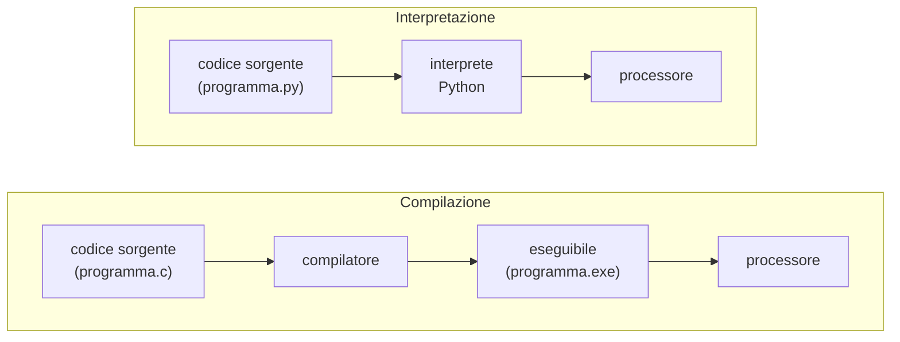
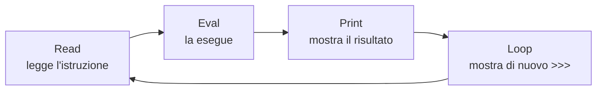
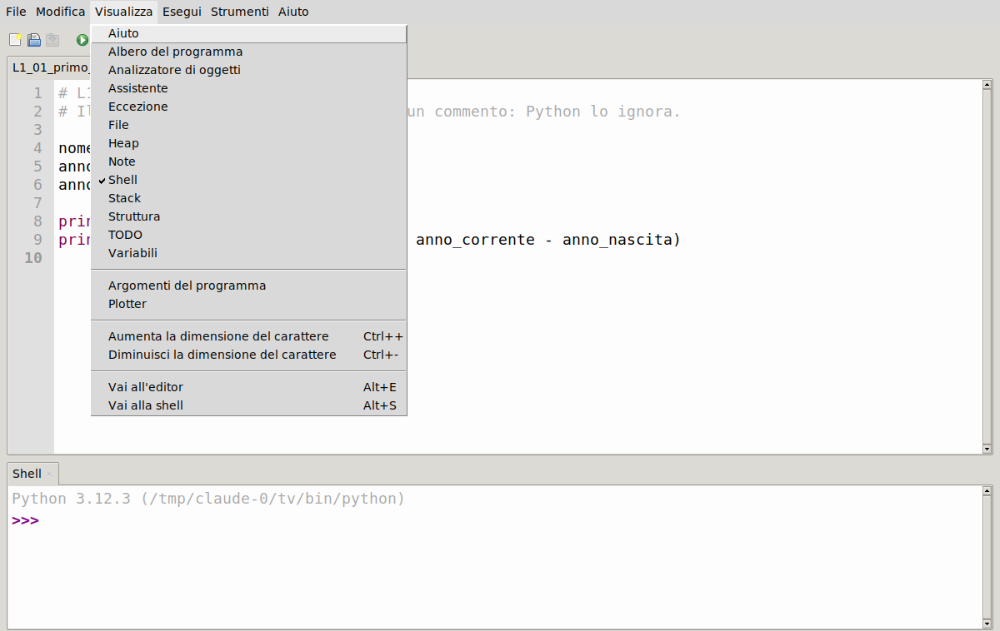
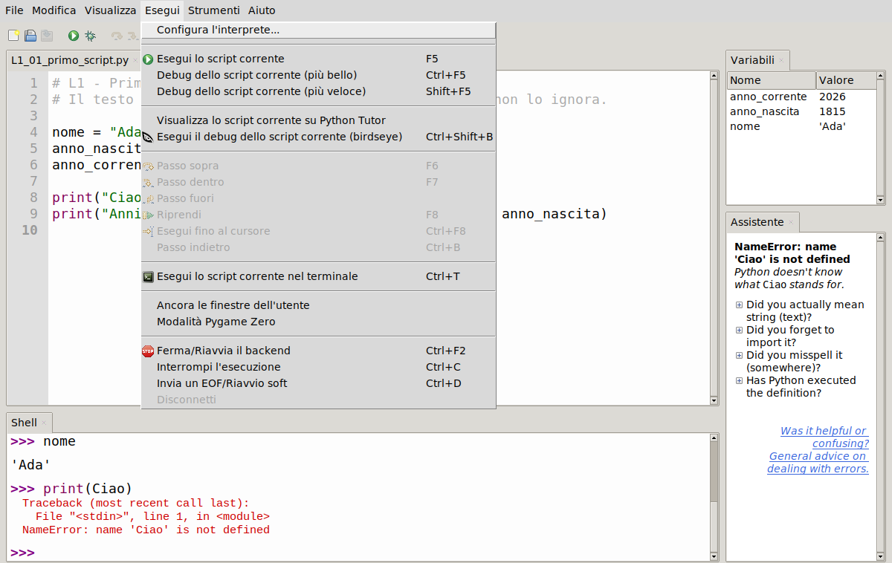
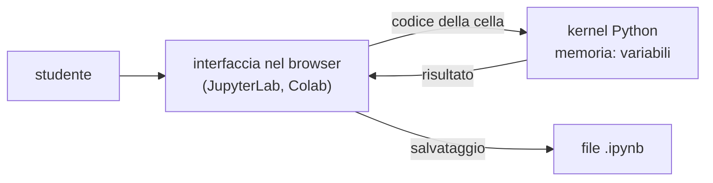
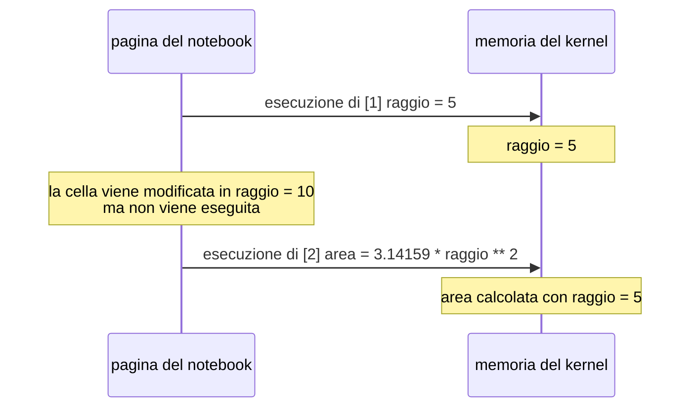
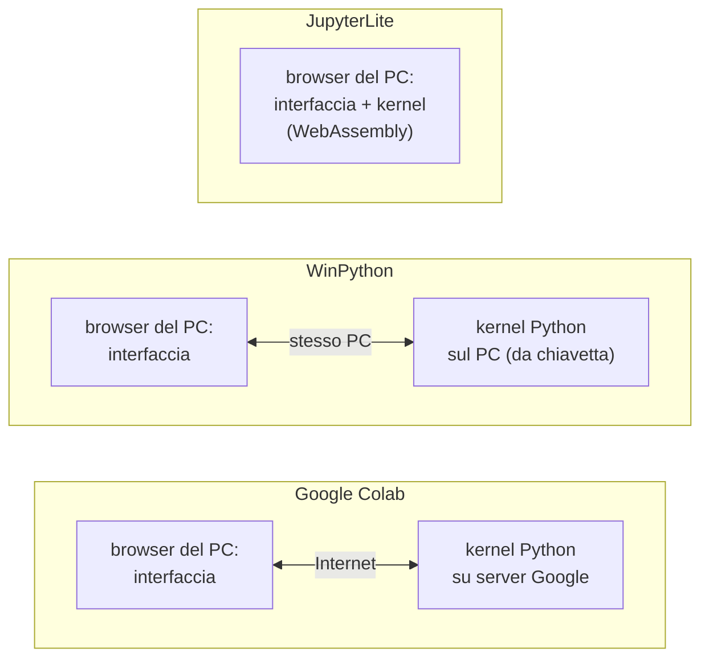

# Lezione L1 - Programmi, interpreti, editor e IDE

## Obiettivi della lezione

- distinguere programma, linguaggio di programmazione e codice sorgente
- distinguere compilazione e interpretazione
- conoscere le caratteristiche principali di Python
- usare Python in modalità interattiva e tramite script
- distinguere editor di testo e IDE e conoscere i più diffusi per Python
- scrivere, eseguire e correggere un primo programma con Thonny

## Programmi e linguaggi

Termini di base:

- Programma
  sequenza di istruzioni che un computer esegue per svolgere un compito.
- Linguaggio di programmazione
  linguaggio formale, con regole precise di scrittura (sintassi) e di significato (semantica), usato per scrivere programmi.
- Codice sorgente
  testo di un programma scritto in un linguaggio di programmazione; è leggibile da una persona e viene salvato in file di testo.
- Linguaggio macchina
  insieme delle istruzioni elementari, codificate in binario, che il processore esegue direttamente.

Il processore non comprende il codice sorgente: esegue solo istruzioni in linguaggio macchina. Serve quindi un programma che traduca il codice sorgente in operazioni eseguibili. Esistono due strategie principali di traduzione.

## Compilazione e interpretazione

- Compilatore
  programma che traduce l'intero codice sorgente in un file eseguibile in linguaggio macchina, prima dell'esecuzione. L'eseguibile può poi essere avviato senza il compilatore. Esempi: C, C++, Rust.
- Interprete
  programma che legge il codice sorgente e lo esegue direttamente, istruzione dopo istruzione, senza produrre un eseguibile separato. Per eseguire il programma serve sempre l'interprete. Esempi: Python, JavaScript nei browser.

Diagramma: compilazione e interpretazione



| Aspetto | Linguaggio compilato | Linguaggio interpretato |
|---|---|---|
| traduzione | una volta, prima dell'esecuzione | durante ogni esecuzione |
| velocità di esecuzione | in genere più alta | in genere più bassa |
| ciclo modifica-prova | modificare, compilare, eseguire | modificare, eseguire |
| per eseguire serve | solo l'eseguibile | il sorgente e l'interprete |

Nel caso di Python la distinzione è meno netta: l'interprete ufficiale, chiamato CPython, traduce prima il sorgente in una forma intermedia (bytecode) e poi esegue il bytecode. Per chi programma il comportamento resta quello di un linguaggio interpretato: si scrive il codice e lo si esegue subito.

## Il linguaggio Python

Python è un linguaggio di programmazione creato da Guido van Rossum e pubblicato per la prima volta nel 1991. È sviluppato come software libero ed è gestito dalla Python Software Foundation.

Riferimenti:

- Cos'è Python, Python Italia: https://www.python.it/about/
- Sito ufficiale, pagina di download: https://www.python.org/downloads/

Caratteristiche principali:

- sintassi leggibile, vicina all'inglese, con poche parentesi e simboli
- indentazione obbligatoria: i rientri del testo fanno parte della sintassi e indicano quali istruzioni appartengono a un blocco
- tipizzazione dinamica: il tipo di una variabile (numero, testo, ...) non va dichiarato, viene determinato dal valore assegnato
- ampia libreria standard, cioè moduli già inclusi nell'installazione (matematica, date, file, rete, ...)
- ecosistema molto ampio di librerie esterne, installabili separatamente

Versioni: dal 2020 l'unica versione mantenuta è Python 3; Python 2 non è più supportato e il suo codice non è pienamente compatibile con Python 3. Il corso usa Python 3.

### Python e intelligenza artificiale

Python è il linguaggio più usato nel machine learning e nel deep learning. Le ragioni principali:

- le librerie di calcolo numerico e di IA più diffuse (NumPy, scikit-learn, PyTorch, TensorFlow) hanno un'interfaccia Python
- il calcolo pesante è svolto da codice compilato (C, C++, CUDA) contenuto nelle librerie; Python coordina le operazioni. Si ottiene così la semplicità di Python con la velocità dei linguaggi compilati
- i notebook Jupyter, molto usati nella ricerca e nella didattica, sono nati nell'ecosistema Python

## Due modi di usare Python

### Modalità interattiva

In modalità interattiva l'interprete mostra un prompt, cioè un simbolo che indica che è in attesa di un comando. Il prompt di Python è `>>>`. Si scrive un'istruzione, si preme Invio e l'interprete la esegue e mostra subito il risultato.

Questa modalità si chiama REPL, dall'inglese Read-Eval-Print Loop: ciclo di lettura, valutazione e stampa.

Diagramma: ciclo REPL



Esempio di sessione interattiva:

```python
>>> 2 + 3
5
>>> 10 / 4
2.5
>>> "ciao" * 3
'ciaociaociao'
```

- `2 + 3` è un'espressione: l'interprete la calcola e ne mostra il valore
- `10 / 4` usa l'operatore `/` di divisione, il cui risultato è un numero con la virgola (in Python si usa il punto come separatore decimale)
- `"ciao"` è una stringa, cioè un testo, racchiuso tra virgolette; l'operatore `*` applicato a una stringa e a un numero intero ripete la stringa

La modalità interattiva è adatta a provare singole istruzioni, fare calcoli rapidi, verificare come si comporta un comando. Quello che si scrive non viene salvato.

### Script

Uno script è un file di testo, con estensione `.py`, che contiene un programma completo. L'interprete esegue le istruzioni dello script dall'alto in basso, una dopo l'altra. Lo script si può salvare, modificare, rieseguire e condividere.

| Aspetto | Modalità interattiva | Script |
|---|---|---|
| dove si scrive | dopo il prompt `>>>` | in un file `.py` |
| esecuzione | un'istruzione alla volta | tutto il file, dall'alto in basso |
| risultato delle espressioni | mostrato automaticamente | mostrato solo con `print()` |
| conservazione | nessuna | il file resta salvato |
| uso tipico | prove, calcoli rapidi | programmi veri e propri |

## Editor di testo e IDE

- Editor di testo
  programma per scrivere e modificare file di testo. Gli editor per programmatori evidenziano la sintassi con colori diversi, numerano le righe, gestiscono l'indentazione. Esempi: Notepad++, Visual Studio Code nella configurazione di base.
- IDE (Integrated Development Environment, ambiente di sviluppo integrato)
  programma che riunisce in un'unica interfaccia gli strumenti necessari per sviluppare: editor, esecuzione del programma, shell interattiva, visualizzazione delle variabili, debugger, gestione dei pacchetti.
- Debugger
  strumento che esegue un programma un passo alla volta e mostra il valore delle variabili a ogni passo; serve a trovare gli errori (in inglese bug).

La distinzione tra editor evoluto e IDE non è rigida: molti editor, come Visual Studio Code, diventano IDE complete tramite estensioni.

Funzioni tipiche di un IDE:

- evidenziazione della sintassi: parole chiave, stringhe, numeri e commenti con colori diversi
- completamento automatico: suggerimento dei nomi mentre si scrive
- segnalazione degli errori prima dell'esecuzione
- esecuzione del programma con un comando o un tasto
- debugger
- visualizzazione delle variabili in memoria

### Ambienti di sviluppo diffusi per Python

| Nome | Tipo | Caratteristiche | Adatto a |
|---|---|---|---|
| IDLE | IDE essenziale | incluso nell'installazione ufficiale di Python; editor e shell | primi passi, quando non è disponibile altro |
| Thonny | IDE per principianti | Python incluso, interfaccia semplice, debugger che mostra la valutazione delle espressioni, disponibile in versione portable | apprendimento della programmazione |
| Visual Studio Code | editor estensibile | gratuito, multi-linguaggio, estensioni per Python e per i notebook | uso generale, progetti di media dimensione |
| PyCharm | IDE professionale | molto completo; pesante per PC di fascia bassa | sviluppo professionale |
| Spyder | IDE scientifico | interfaccia simile a MATLAB, esplora variabili e grafici | calcolo scientifico, analisi dati |
| JupyterLab | ambiente per notebook | codice, risultati e testo nello stesso documento, si usa dal browser | analisi dati, IA, didattica (lezione L2) |

Riferimenti:

- IDLE, documentazione ufficiale: https://docs.python.org/3/library/idle.html
- Thonny: https://thonny.org/
- Python in Visual Studio Code: https://code.visualstudio.com/docs/languages/python
- PyCharm: https://www.jetbrains.com/pycharm/
- Spyder: https://www.spyder-ide.org/
- Project Jupyter: https://jupyter.org/

Nel corso si usano Thonny per gli script (moduli 1 e 2) e JupyterLab per i notebook (dal modulo 3).

## Thonny

Thonny è un IDE per Python progettato per chi inizia a programmare, sviluppato presso l'Università di Tartu (Estonia) e distribuito come software libero (licenza MIT).

Caratteristiche utili per l'apprendimento:

- include già un interprete Python: non serve installare Python separatamente
- interfaccia con pochi elementi, traducibile in italiano
- pannello Variabili che mostra i valori in memoria
- debugger che mostra passo passo anche la valutazione delle singole espressioni
- pannello Assistente che spiega i messaggi di errore

### Installazione senza privilegi di amministratore

Sul sito ufficiale, https://thonny.org/, sono disponibili:

- un installatore per Windows che può installare Thonny nella cartella dell'utente, senza privilegi di amministratore
- una versione portable per Windows: un archivio `.zip` da estrarre in una cartella qualsiasi, anche su una chiavetta USB; si avvia con il file `thonny.exe` contenuto nella cartella
- versioni per macOS e Linux

Tutte le versioni rilasciate sono elencate nella pagina Releases del progetto: https://github.com/thonny/thonny/releases

### Primo avvio

Al primo avvio Thonny chiede la lingua dell'interfaccia e le impostazioni iniziali. Si sceglie `Italiano` e `Standard`, poi si preme `Let's go!`.

{width=60%}

### Le parti della finestra

{width=100%}

- Barra dei menu: `File`, `Modifica`, `Visualizza`, `Esegui`, `Strumenti`, `Aiuto`
- Barra degli strumenti: nuovo file, apri, salva, esegui (triangolo verde), debug (insetto), comandi di esecuzione passo passo, stop
- Editor (in alto): area in cui si scrive lo script; a sinistra i numeri di riga; ogni file aperto ha una propria scheda
- Shell (in basso): la modalità interattiva di Python, con il prompt `>>>`; qui compaiono anche l'output e i messaggi di errore degli script
- Pannello Variabili (a destra): nomi e valori delle variabili presenti in memoria

I pannelli si attivano e disattivano dal menu `Visualizza`. Per il corso conviene attivare `Variabili`. Dallo stesso menu si modifica la dimensione del carattere (`Ctrl++` e `Ctrl+-`), utile quando si proietta lo schermo.

{width=80%}

Comandi principali:

| Comando | Menu | Tasto |
|---|---|---|
| nuovo file | File, Nuovo | `Ctrl+N` |
| salva | File, Salva | `Ctrl+S` |
| esegui lo script corrente | Esegui, Esegui lo script corrente | `F5` |
| interrompi il programma in esecuzione | Esegui, Interrompi l'esecuzione | `Ctrl+C` |
| riavvia l'interprete (cancella le variabili) | Esegui, Ferma/Riavvia il backend | `Ctrl+F2` |
| debug dello script | Esegui, Debug dello script corrente (più bello) | `Ctrl+F5` |

{width=80%}

Nel menu Esegui, "backend" indica il processo Python che esegue i programmi e la Shell.

## Il primo programma

File `L1_01_primo_script.py`:

```python
# L1 - Primo script Python
# Il testo che segue il carattere # è un commento: Python lo ignora.

nome = "Ada"
anno_nascita = 1815
anno_corrente = 2026

print("Ciao,", nome)
print("Anni trascorsi dalla nascita:", anno_corrente - anno_nascita)
```

Output nella Shell:

```text
Ciao, Ada
Anni trascorsi dalla nascita: 211
```

Spiegazione riga per riga:

- `# ...`: commento. Tutto ciò che segue `#` sulla stessa riga viene ignorato dall'interprete; serve a chi legge il codice.
- `nome = "Ada"`: assegnazione. Il simbolo `=` non indica un'uguaglianza matematica ma un'azione: il valore a destra viene memorizzato con il nome indicato a sinistra. `nome` è una variabile, cioè un nome associato a un valore in memoria. Il valore `"Ada"` è una stringa.
- `anno_nascita = 1815`: assegnazione di un numero intero. I nomi delle variabili non possono contenere spazi; per unire più parole si usa il trattino basso `_`.
- `print("Ciao,", nome)`: chiamata della funzione `print`. Una funzione è un'operazione con un nome; si esegue scrivendo il nome seguito da parentesi tonde, che contengono i valori da passare alla funzione, detti argomenti. `print` scrive i propri argomenti nella Shell, separati da uno spazio. Il primo argomento è la stringa `"Ciao,"`; il secondo è la variabile `nome`, di cui viene stampato il valore.
- `anno_corrente - anno_nascita`: espressione. Python calcola la differenza tra i valori delle due variabili e passa il risultato a `print`.

Le istruzioni vengono eseguite in ordine, dall'alto in basso. Una variabile deve essere assegnata prima di essere usata.

Chi era Ada: Ada Lovelace (1815-1852) scrisse nel 1843 quello che è considerato il primo algoritmo destinato a una macchina, la macchina analitica di Charles Babbage.

## Gli errori

Un programma che contiene errori si interrompe e l'interprete mostra un messaggio chiamato traceback. Leggere il traceback è una competenza fondamentale: indica dove si trova l'errore e di che tipo è.

Esempio, nella Shell:

```text
>>> print(Ciao)
Traceback (most recent call last):
  File "<stdin>", line 1, in <module>
NameError: name 'Ciao' is not defined
```

Struttura del messaggio:

- `Traceback (most recent call last):` intestazione
- `File "...", line 1`: il file e il numero della riga in cui si è verificato l'errore (`<stdin>` indica la Shell)
- `NameError`: il tipo di errore
- `name 'Ciao' is not defined`: la descrizione. Senza virgolette, `Ciao` è interpretato come nome di variabile; la variabile non esiste

In Thonny, quando si verifica un errore, il pannello Assistente (menu `Visualizza`, voce `Assistente`) mostra una spiegazione e alcune ipotesi sulla causa. I messaggi dell'Assistente sono in inglese anche con l'interfaccia in italiano.

{width=100%}

Tipi di errore più frequenti all'inizio:

| Errore | Significato | Esempio |
|---|---|---|
| `SyntaxError` | il testo non rispetta le regole di scrittura del linguaggio; il programma non parte | `print("a" b)`: manca la virgola |
| `NameError` | si usa un nome che non esiste | `print(Nome)` con variabile `nome`: Python distingue maiuscole e minuscole |
| `TypeError` | operazione non applicabile ai tipi dei valori | `"anni: " + 5`: non si può sommare una stringa a un numero |
| `IndentationError` | rientro del testo non corretto | uno spazio iniziale in una riga che non deve essere rientrata |

Procedura per correggere un errore:

1. leggere l'ultima riga del traceback: tipo e descrizione
2. individuare il numero di riga indicato
3. osservare la riga indicata e, se non contiene errori evidenti, quella precedente (un `SyntaxError` dovuto a una parentesi non chiusa può essere segnalato sulla riga successiva)
4. correggere un solo errore alla volta e rieseguire

## Laboratorio L1

Durata indicativa: 25 minuti. Ambiente: Thonny.

Esercizio 1 (base): nella Shell, calcolare le espressioni seguenti e osservare il risultato.

```python
>>> 7 + 8
>>> 7 - 8
>>> 7 * 8
>>> 7 / 8
>>> "Python" + "3"
>>> "=" * 20
```

Poi scrivere `print(7 + 8)` e confrontare il risultato con quello di `7 + 8`.

Esercizio 2 (base): aprire `L1_01_primo_script.py`, eseguirlo con `F5`, osservare il pannello Variabili. Modificare il nome e l'anno di nascita con quelli di un'altra persona e rieseguire.

Esercizio 3 (standard): aprire `L1_02_trova_errori.py`. Il programma contiene tre errori di tipo diverso. Eseguirlo, leggere il traceback, correggere la riga indicata e rieseguire, fino a quando il programma stampa tutte le righe. Per ogni errore annotare in un commento il tipo di errore e la correzione.

```python
citta = "Roma"
abitanti = 2750000

print("Città:", citta)
print("Abitanti:" abitanti)
print("Abitanti in milioni: " + abitanti / 1000000)
print("Fine del programma", Citta)
```

Esercizio 4 (standard): in `L1_03_esercizio_libero.py`, scrivere un programma che memorizza in tre variabili il proprio nome, la propria classe e l'anno scolastico, stampa una frase che contiene i tre valori e stampa il numero di anni mancanti al 2030.

Esercizio 5 (approfondimento): scrivere uno script che calcola e stampa area e perimetro di un rettangolo i cui lati sono memorizzati in due variabili. Provocare di proposito un `SyntaxError`, un `NameError` e un `TypeError` e osservare come cambia il messaggio.

# Lezione L2 - Notebook Jupyter: JupyterLite, WinPython, Colab

## Obiettivi della lezione

- descrivere la struttura di un notebook: celle, output, kernel
- eseguire e modificare celle di codice e di testo
- spiegare il ruolo dello stato del kernel e dell'ordine di esecuzione
- scrivere testo formattato in Markdown
- usare un notebook in tre ambienti: JupyterLite, WinPython, Google Colab
- scegliere tra script e notebook in base al compito

## Il notebook

- Notebook
  documento che contiene, nello stesso file, codice eseguibile, risultati dell'esecuzione (numeri, tabelle, grafici) e testo descrittivo.
- Jupyter
  progetto open source che ha definito il formato dei notebook e sviluppa i programmi per usarli. Il nome richiama i linguaggi Julia, Python e R. Sito: https://jupyter.org/
- File `.ipynb`
  formato dei notebook Jupyter (dal nome del progetto da cui deriva, IPython Notebook). È un file di testo in formato JSON che contiene celle e risultati. Lo stesso file si apre in JupyterLab, JupyterLite, Colab, Visual Studio Code.
- JupyterLab
  l'applicazione principale del progetto Jupyter per lavorare con i notebook; si usa dal browser.

I notebook sono lo strumento più diffuso nell'analisi dei dati e nel machine learning perché permettono di procedere per piccoli passi, vedere subito il risultato di ogni passo e documentare il lavoro nello stesso file.

## Celle, kernel, interfaccia

Un notebook è una sequenza di celle. Tipi di cella:

- Cella di codice
  contiene istruzioni Python. Quando viene eseguita, il risultato compare sotto la cella. A sinistra è indicato un numero tra parentesi quadre, per esempio `[3]`, che indica l'ordine di esecuzione.
- Cella di testo (Markdown)
  contiene testo formattato con la sintassi Markdown: titoli, elenchi, grassetto, formule, immagini, link.

L'esecuzione del codice non avviene nella pagina che si vede, ma in un programma separato:

- Kernel
  processo che esegue il codice delle celle e conserva in memoria le variabili. Per Python il kernel si chiama `ipykernel`.
- Interfaccia (front-end)
  la pagina nel browser in cui si scrivono le celle e si vedono i risultati.

Diagramma: interfaccia e kernel



{width=100%}

Nell'immagine:

- la barra dei menu (`File`, `Edit`, `View`, `Run`, `Kernel`, ...) e, sotto, la barra degli strumenti del notebook: salva, aggiungi cella, taglia, copia, incolla, esegui (triangolo), interrompi (quadrato), riavvia il kernel (freccia circolare), esegui tutto (doppio triangolo), menu del tipo di cella
- in alto a destra il nome del kernel (`Python 3 (ipykernel)`) e un cerchio che indica lo stato: vuoto se il kernel è inattivo, pieno se sta eseguendo codice
- la cella selezionata è indicata dalla barra blu a sinistra

L'interfaccia di JupyterLab è in inglese. I nomi dei menu vengono quindi indicati in inglese.

## Modalità di lavoro e comandi da tastiera

JupyterLab ha due modalità:

- Modalità comando: la cella è selezionata ma non si sta scrivendo al suo interno; i tasti agiscono sulle celle (aggiungere, eliminare, cambiare tipo). Si attiva con `Esc`.
- Modalità modifica: il cursore è dentro la cella e si scrive testo o codice. Si attiva con `Invio` o con un clic nella cella.

Comandi principali:

| Tasti | Modalità | Effetto |
|---|---|---|
| `Maiusc+Invio` | entrambe | esegue la cella e passa alla successiva |
| `Ctrl+Invio` | entrambe | esegue la cella e resta sulla stessa |
| `Esc` | modifica | passa alla modalità comando |
| `Invio` | comando | passa alla modalità modifica |
| `A` / `B` | comando | inserisce una cella sopra (Above) / sotto (Below) |
| `M` / `Y` | comando | trasforma la cella in Markdown / in codice |
| `D`, `D` | comando | elimina la cella (premere `D` due volte) |
| `Z` | comando | annulla l'ultima operazione sulle celle |

In Colab i comandi da tastiera sono in parte diversi: la maggior parte si ottiene premendo prima `Ctrl+M` e poi il tasto (per esempio `Ctrl+M` seguito da `B` per inserire una cella sotto). `Maiusc+Invio` e `Ctrl+Invio` funzionano allo stesso modo.

## Il risultato di una cella

Se l'ultima riga di una cella di codice è un'espressione, il notebook ne mostra il valore anche senza `print()`, come nella modalità interattiva. Le righe precedenti vengono eseguite, ma il loro valore non viene mostrato.

```python
2 + 3
10 * 4
```

Output:

```text
40
```

Per mostrare più valori si usa `print()` per ciascuno.

## Stato del kernel e ordine di esecuzione

Il kernel conserva in memoria tutte le variabili create dalle celle eseguite, nell'ordine in cui sono state eseguite. Questo ordine può essere diverso dall'ordine in cui le celle compaiono nella pagina.

Esempio:

```python
raggio = 5
```

```python
area = 3.14159 * raggio ** 2
area
```

`**` è l'operatore di elevamento a potenza: `raggio ** 2` è il quadrato di `raggio`. Se si modifica la prima cella in `raggio = 10` senza eseguirla, e si riesegue la seconda, il risultato non cambia: il kernel conosce ancora il valore 5. Il valore di una variabile dipende dalle celle eseguite, non da quello che è scritto nella pagina.

Diagramma: pagina e memoria del kernel possono non coincidere



Problemi tipici:

- celle eseguite in ordine diverso da quello della pagina
- variabili che esistono in memoria anche se la cella che le ha create è stata cancellata
- notebook che funziona per chi l'ha scritto e dà errore a chi lo riapre, perché alcune celle non erano state eseguite

Regola pratica: prima di consegnare o condividere un notebook, riavviare il kernel ed eseguire tutte le celle dall'inizio (menu `Kernel`, voce `Restart Kernel and Run All Cells...`). Se il notebook arriva in fondo senza errori, il risultato non dipende da esecuzioni precedenti.

Il riavvio del kernel cancella tutte le variabili in memoria; il contenuto delle celle resta invariato.

## Markdown

Markdown è un linguaggio per scrivere testo formattato usando solo caratteri normali. Il testo resta leggibile anche senza formattazione.

| Si scrive | Si ottiene |
|---|---|
| `# Titolo` | titolo di primo livello |
| `## Sottotitolo` | titolo di secondo livello |
| `**grassetto**` | **grassetto** |
| `*corsivo*` | *corsivo* |
| `` `codice` `` | `codice` |
| `- elemento` | elemento di elenco puntato |
| `1. elemento` | elemento di elenco numerato |
| `[testo](https://jupyter.org/)` | link |
| `$x^2$` | formula matematica: $x^2$ |

Una cella di testo si modifica con doppio clic e si visualizza formattata eseguendola con `Maiusc+Invio`.

Riferimento: Markdown Reference, CommonMark: https://commonmark.org/help/

## Tre modi di usare un notebook

Lo stesso file `.ipynb` si può aprire in ambienti diversi. Le differenze principali riguardano dove viene eseguito il kernel.

Diagramma: dove viene eseguito il codice



### JupyterLite

JupyterLite è una versione di JupyterLab che funziona interamente nel browser. Il kernel Python è eseguito dal browser stesso grazie a Pyodide, una versione di Python compilata in WebAssembly, un formato di codice che i browser moderni eseguono a velocità vicina a quella dei programmi installati.

- Indirizzo: Try Jupyter, https://jupyter.org/try-jupyter/lab/
- Progetto: https://github.com/jupyterlite/jupyterlite

Caratteristiche:

- nessuna installazione e nessun account
- il codice viene eseguito sul PC dello studente, non su un server
- include le librerie usate nel corso (NumPy, matplotlib, scikit-learn); elenco completo: https://pyodide.org/en/stable/usage/packages-in-pyodide.html
- al primo avvio scarica alcune decine di MB; le volte successive usa i file già memorizzati dal browser
- i file creati sono salvati nella memoria del browser: se si cancellano i dati di navigazione o si cambia PC vanno persi. Per conservarli si scarica il file (menu `File`, voce `Download`)
- più lento di Python installato; non adatto a calcoli pesanti

Aprire un notebook ricevuto dal docente: trascinare il file `.ipynb` nel pannello dei file a sinistra, oppure usare il pulsante di caricamento (freccia verso l'alto) nello stesso pannello.

### WinPython

WinPython è una distribuzione di Python per Windows che non richiede installazione: si scarica un archivio autoestraente, lo si estrae in una cartella qualsiasi, anche su una chiavetta USB, e si usa da lì. Include l'interprete Python, JupyterLab e le principali librerie scientifiche.

- Sito: https://winpython.github.io/

Caratteristiche:

- funziona senza rete e senza privilegi di amministratore
- contiene tutto il necessario per il corso
- occupa da alcune centinaia di MB a qualche GB, secondo la versione scelta
- solo per Windows

Avvio di JupyterLab: nella cartella principale di WinPython si avvia il programma `Jupyter Lab.exe`. Si apre una finestra di terminale, da lasciare aperta perché esegue il server di Jupyter, e poco dopo il browser con JupyterLab. Il pannello dei file a sinistra mostra la cartella `notebooks` di WinPython, dove conviene copiare i notebook del corso.

Per chiudere: salvare il notebook, chiudere il browser e poi la finestra del terminale.

### Google Colab

Google Colaboratory, abbreviato in Colab, è un servizio di Google che esegue notebook Jupyter su server remoti.

- Notebook introduttivo: https://colab.research.google.com/notebooks/intro.ipynb

Caratteristiche:

- richiede un account Google e una connessione a Internet
- il codice viene eseguito su un server di Google: la potenza di calcolo non dipende dal PC in uso ed è disponibile, con limiti, anche una GPU, il processore specializzato usato per il deep learning
- sono già installate molte librerie, comprese quelle di deep learning (PyTorch, TensorFlow)
- i notebook sono salvati su Google Drive e si possono condividere con un link
- la sessione sul server è temporanea: dopo un periodo di inattività, o comunque dopo un certo tempo, il server viene liberato e le variabili in memoria e i file caricati nella sessione vengono cancellati; il notebook salvato su Drive resta

Aprire un notebook ricevuto dal docente: menu `File`, voce `Carica notebook` (`Upload notebook` con l'interfaccia in inglese). Scaricare una copia locale: menu `File`, voce `Scarica`, poi `Scarica .ipynb` (`Download`, `Download .ipynb`). Riavviare il kernel: menu `Runtime`, voce `Riavvia sessione` (`Restart session`).

### Confronto

| Aspetto | JupyterLite | WinPython | Colab |
|---|---|---|---|
| installazione | nessuna | nessuna, estrazione di un archivio | nessuna |
| rete | solo al primo caricamento | non necessaria | sempre necessaria |
| account | no | no | sì, Google |
| dove gira il codice | nel browser del PC | sul PC | su server Google |
| potenza di calcolo | bassa | quella del PC | alta, anche GPU |
| dove restano i file | memoria del browser | cartella su disco o chiavetta | Google Drive |
| sistemi operativi | tutti (browser moderno) | Windows | tutti (browser) |
| uso nel corso | principale | alternativa offline | solo per le librerie di deep learning (L17) |

## Script o notebook

| Compito | Strumento più adatto |
|---|---|
| imparare le basi del linguaggio, seguire il flusso di un programma | script (Thonny) |
| esplorare dati, fare calcoli per passi, produrre grafici | notebook |
| documentare un esperimento con testo, codice e risultati | notebook |
| scrivere un programma da eseguire più volte, o da riusare in altri programmi | script |

Nel notebook le celle si possono eseguire in qualsiasi ordine; nello script l'esecuzione procede sempre dall'alto in basso. Per questo, nelle prime lezioni sul linguaggio, si usano gli script.

## Laboratorio L2

Durata indicativa: 25 minuti. Ambiente: JupyterLite; in alternativa WinPython.

Materiale: notebook `L2_primo_notebook.ipynb`.

1. Aprire JupyterLite (https://jupyter.org/try-jupyter/lab/) e caricare il notebook trascinandolo nel pannello dei file.
2. Svolgere le sezioni del notebook eseguendo le celle in ordine:
   - Esercizio 1 (base): modificare una variabile senza eseguire la cella e osservare l'effetto sulle celle successive
   - Esercizio 2 (base): eseguire più volte la stessa cella, riavviare il kernel e interpretare l'errore che compare
   - Esercizio 3 (standard): scrivere una cella di testo con titolo, elenco puntato e grassetto
   - Esercizio 4 (standard): completare una cella di codice e verificarla con la cella di controllo, che mostra `Corretto` se il calcolo è giusto
3. Riavviare il kernel ed eseguire tutte le celle (`Kernel`, `Restart Kernel and Run All Cells...`). Verificare che il notebook arrivi in fondo senza errori e che la cella di controllo mostri `Corretto`.
4. Scaricare il notebook completato (`File`, `Download`).
5. Approfondimento: aprire lo stesso file in WinPython o in Colab e verificare che il contenuto e i risultati siano gli stessi.

La cella di controllo dell'Esercizio 4 usa l'istruzione `assert`, che verifica una condizione: se la condizione è vera il programma prosegue, se è falsa si interrompe con un errore `AssertionError` e il messaggio indicato.

```python
assert perimetro == 4 * lato, "Il perimetro non è corretto"
print("Corretto")
```

- `perimetro == 4 * lato`: confronto; `==` verifica se due valori sono uguali (a differenza di `=`, che assegna un valore)
- `"Il perimetro non è corretto"`: messaggio mostrato se il confronto è falso

## Crediti delle immagini

Le schermate sono state realizzate per questo corso a partire dai programmi Thonny (licenza MIT, https://thonny.org/) e JupyterLab (licenza BSD, https://jupyter.org/).
