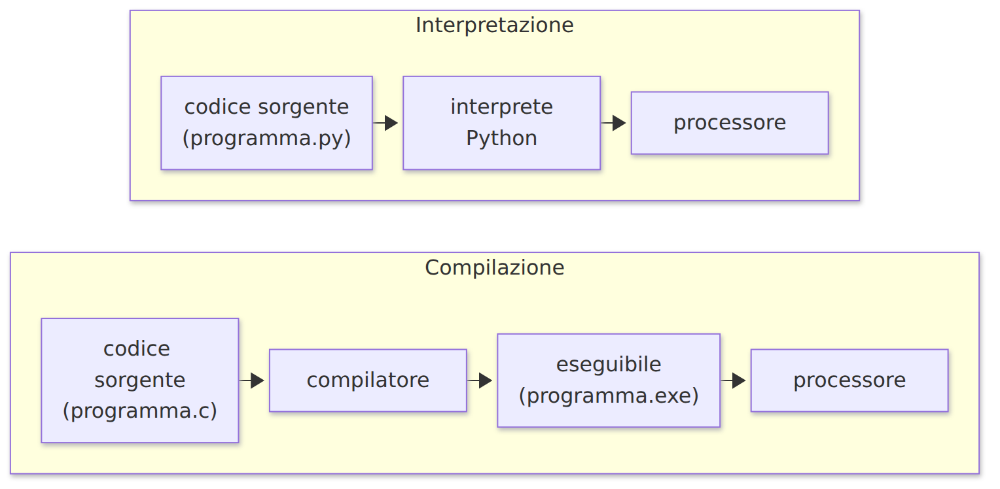
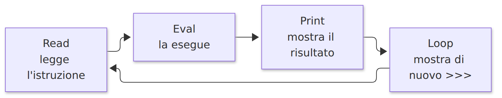
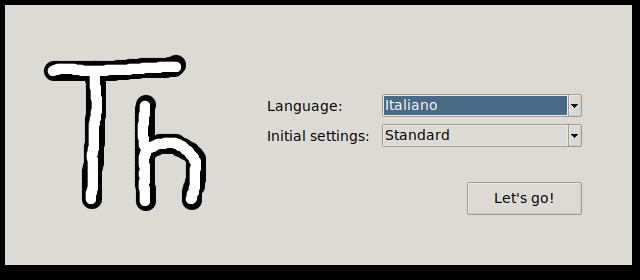
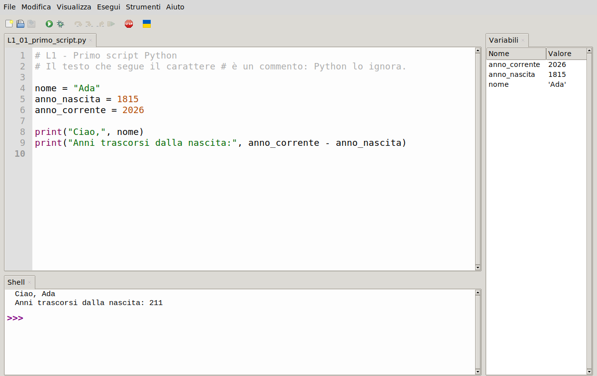
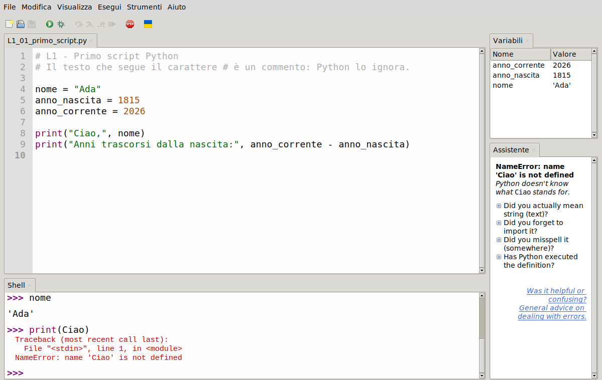
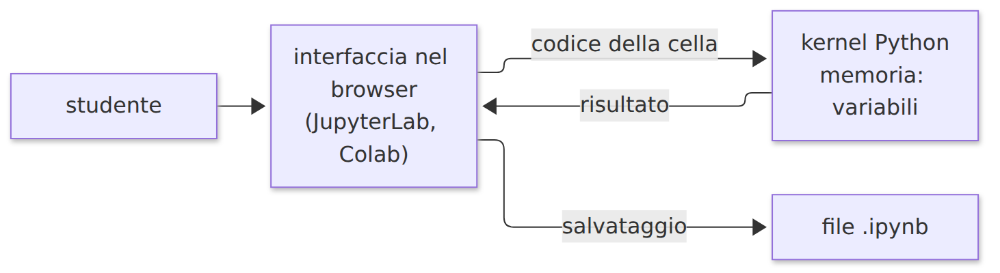
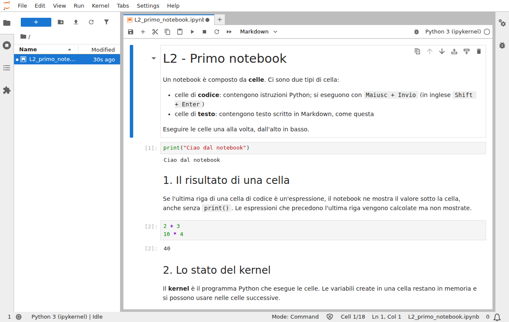
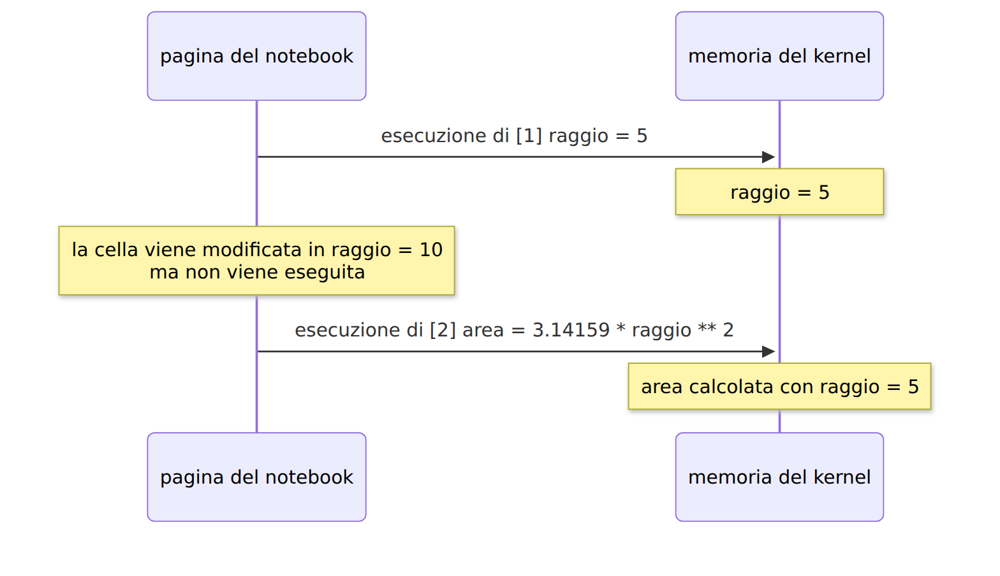
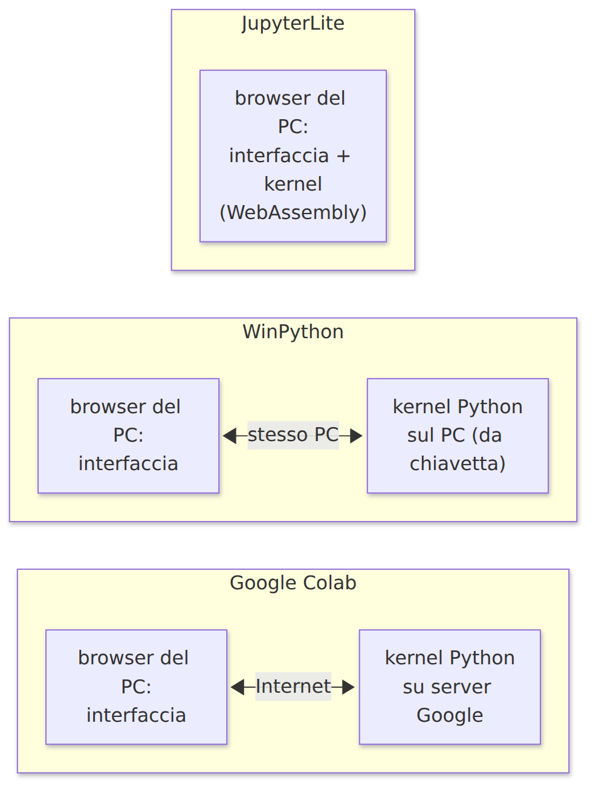

<!-- _class: titolo -->
<!-- _paginate: false -->

## Modulo 1 - L'ambiente di lavoro

B.8 - Python per l'Intelligenza Artificiale

Lezioni L1 e L2

---

## L1 - Programmi, interpreti, editor e IDE

- programmi e linguaggi
- compilazione e interpretazione
- il linguaggio Python
- modalità interattiva e script
- editor e IDE
- Thonny: primo programma ed errori

---

## Termini di base

- **Programma**: sequenza di istruzioni che un computer esegue per svolgere un compito
- **Linguaggio di programmazione**: linguaggio formale con regole di scrittura (sintassi) e di significato (semantica)
- **Codice sorgente**: testo del programma, leggibile da una persona
- **Linguaggio macchina**: istruzioni binarie eseguite direttamente dal processore

Il processore esegue solo linguaggio macchina: il codice sorgente va tradotto.

---

## Compilazione e interpretazione



---

## Compilato o interpretato

| Aspetto | Compilato | Interpretato |
|---|---|---|
| traduzione | una volta, prima | a ogni esecuzione |
| velocità | in genere più alta | in genere più bassa |
| ciclo di lavoro | modifica, compila, esegui | modifica, esegui |
| per eseguire serve | l'eseguibile | sorgente e interprete |

Python (CPython) traduce il sorgente in bytecode e lo esegue: per chi programma si comporta come un linguaggio interpretato.

---

## Il linguaggio Python

- creato da Guido van Rossum, prima versione 1991; software libero
- sintassi leggibile, pochi simboli
- **indentazione obbligatoria**: i rientri fanno parte della sintassi
- **tipizzazione dinamica**: il tipo dipende dal valore assegnato
- ampia libreria standard ed ecosistema di librerie esterne
- versione in uso: **Python 3** (Python 2 non è più supportato)

Cos'è Python, Python Italia: https://www.python.it/about/

---

## Perché Python nell'intelligenza artificiale

- NumPy, scikit-learn, PyTorch, TensorFlow hanno un'interfaccia Python
- il calcolo pesante è svolto da codice compilato (C, C++, CUDA) dentro le librerie
- Python coordina: semplicità di scrittura, velocità di calcolo
- i notebook Jupyter sono nati nell'ecosistema Python

---

## Modalità interattiva: il REPL



```python
>>> 2 + 3
5
>>> 10 / 4
2.5
>>> "ciao" * 3
'ciaociaociao'
```

---

## Modalità interattiva e script

| Aspetto | Interattiva | Script |
|---|---|---|
| dove si scrive | dopo `>>>` | in un file `.py` |
| esecuzione | un'istruzione alla volta | tutto il file, dall'alto in basso |
| valore delle espressioni | mostrato automaticamente | solo con `print()` |
| conservazione | nessuna | il file resta salvato |
| uso | prove, calcoli rapidi | programmi |

---

## Editor, IDE, debugger

- **Editor di testo**: scrive e modifica file di testo; evidenzia la sintassi, numera le righe
- **IDE**: ambiente integrato con editor, esecuzione, shell, variabili, debugger, pacchetti
- **Debugger**: esegue il programma un passo alla volta mostrando i valori delle variabili

Molti editor, come Visual Studio Code, diventano IDE con le estensioni.

---

## Ambienti di sviluppo per Python

| Nome | Tipo | Adatto a |
|---|---|---|
| IDLE | IDE essenziale, incluso in Python | primi passi |
| **Thonny** | IDE per principianti, portable | **apprendimento** |
| Visual Studio Code | editor estensibile | uso generale |
| PyCharm | IDE professionale, pesante | sviluppo professionale |
| Spyder | IDE scientifico | analisi dati |
| **JupyterLab** | ambiente per notebook | **dati, IA, didattica** |

---

## Thonny

- IDE per principianti, Università di Tartu, licenza MIT
- Python già incluso
- pannello **Variabili**, pannello **Assistente** per gli errori
- debugger passo passo
- installazione utente o **versione portable** (anche da chiavetta)

Sito: https://thonny.org/

Versioni rilasciate: https://github.com/thonny/thonny/releases

---

## Thonny: primo avvio



Lingua: `Italiano`, impostazioni: `Standard`, poi `Let's go!`

---

## Thonny: la finestra



Editor in alto, Shell in basso, Variabili a destra (menu `Visualizza`)

---

## Thonny: comandi principali

| Comando | Menu | Tasto |
|---|---|---|
| nuovo file | File, Nuovo | `Ctrl+N` |
| salva | File, Salva | `Ctrl+S` |
| esegui lo script | Esegui, Esegui lo script corrente | `F5` |
| interrompi l'esecuzione | Esegui, Interrompi l'esecuzione | `Ctrl+C` |
| riavvia l'interprete | Esegui, Ferma/Riavvia il backend | `Ctrl+F2` |
| debug | Esegui, Debug dello script corrente | `Ctrl+F5` |

Dimensione del carattere: `Ctrl++` e `Ctrl+-`

---

## Il primo programma

```python
# L1 - Primo script Python
# Il testo che segue il carattere # è un commento: Python lo ignora.

nome = "Ada"
anno_nascita = 1815
anno_corrente = 2026

print("Ciao,", nome)
print("Anni trascorsi dalla nascita:", anno_corrente - anno_nascita)
```

```text
Ciao, Ada
Anni trascorsi dalla nascita: 211
```

---

## Il primo programma: spiegazione

- `#`: commento, ignorato dall'interprete
- `nome = "Ada"`: **assegnazione**; `=` memorizza il valore a destra con il nome a sinistra
- `nome`: **variabile**; `"Ada"`: **stringa** (testo tra virgolette)
- nomi senza spazi: si usa `_`, come in `anno_nascita`
- `print(...)`: **funzione**; tra parentesi gli **argomenti**, stampati separati da uno spazio
- `anno_corrente - anno_nascita`: **espressione** calcolata prima della stampa

Le istruzioni sono eseguite dall'alto in basso.

---

## Gli errori: il traceback

```text
>>> print(Ciao)
Traceback (most recent call last):
  File "<stdin>", line 1, in <module>
NameError: name 'Ciao' is not defined
```

- `File "...", line 1`: file e riga dell'errore
- `NameError`: tipo di errore
- `name 'Ciao' is not defined`: descrizione

---

## Thonny: il pannello Assistente



---

## Errori frequenti

| Errore | Significato | Esempio |
|---|---|---|
| `SyntaxError` | regole di scrittura non rispettate | `print("a" b)` |
| `NameError` | nome inesistente | `print(Nome)` con variabile `nome` |
| `TypeError` | operazione non valida per i tipi | `"anni: " + 5` |
| `IndentationError` | rientro non corretto | spazio iniziale non previsto |

Procedura: ultima riga del traceback, numero di riga, riga indicata e precedente, un errore alla volta.

---

## Laboratorio L1

1. (base) espressioni nella Shell: `7 + 8`, `7 / 8`, `"Python" + "3"`, `"=" * 20`
2. (base) eseguire `L1_01_primo_script.py`, osservare le Variabili, modificare i valori
3. (standard) correggere i tre errori di `L1_02_trova_errori.py`
4. (standard) `L1_03_esercizio_libero.py`: nome, classe, anno scolastico, anni al 2030
5. (approfondimento) area e perimetro di un rettangolo; provocare tre tipi di errore

---

<!-- _class: titolo -->

## L2 - Notebook Jupyter

JupyterLite, WinPython, Colab

---

## Il notebook

- **Notebook**: codice eseguibile, risultati e testo nello stesso documento
- **Jupyter**: progetto open source (Julia, Python, R), https://jupyter.org/
- **File `.ipynb`**: formato JSON; si apre in JupyterLab, JupyterLite, Colab, VS Code
- **JupyterLab**: applicazione principale per i notebook, usata dal browser

---

## Celle e kernel

- **Cella di codice**: istruzioni Python; `[3]` indica l'ordine di esecuzione
- **Cella di testo**: Markdown
- **Kernel**: processo che esegue le celle e conserva le variabili
- **Interfaccia**: la pagina nel browser



---

## JupyterLab



---

## Modalità e comandi da tastiera

| Tasti | Effetto |
|---|---|
| `Maiusc+Invio` | esegue e passa alla cella successiva |
| `Ctrl+Invio` | esegue e resta sulla cella |
| `Esc` / `Invio` | modalità comando / modifica |
| `A` / `B` | nuova cella sopra / sotto |
| `M` / `Y` | cella Markdown / codice |
| `D`, `D` | elimina la cella |

In Colab: `Ctrl+M` seguito dal tasto (per esempio `Ctrl+M`, `B`)

---

## Il risultato di una cella

```python
2 + 3
10 * 4
```

```text
40
```

Viene mostrato solo il valore dell'ultima espressione. Per più valori: `print()`.

---

## Stato del kernel



Il valore di una variabile dipende dalle celle **eseguite**, non da quelle visibili.

---

## Ordine di esecuzione: regola pratica

Problemi tipici:

- celle eseguite in ordine diverso da quello della pagina
- variabili in memoria create da celle ormai cancellate
- notebook che funziona solo sul PC di chi l'ha scritto

Prima di consegnare: `Kernel`, `Restart Kernel and Run All Cells...`

Il riavvio cancella le variabili, non il contenuto delle celle.

---

## Markdown

| Si scrive | Si ottiene |
|---|---|
| `# Titolo` / `## Sottotitolo` | titoli |
| `**grassetto**` / `*corsivo*` | **grassetto** / *corsivo* |
| `` `codice` `` | `codice` |
| `- elemento` / `1. elemento` | elenchi |
| `[testo](https://jupyter.org/)` | link |
| `$x^2$` | formula |

Markdown Reference: https://commonmark.org/help/

---

## Dove viene eseguito il codice



---

## JupyterLite

- JupyterLab nel browser; Python eseguito dal browser (Pyodide, WebAssembly)
- nessuna installazione, nessun account
- include NumPy, matplotlib, scikit-learn
- primo avvio: alcune decine di MB
- file nella memoria del browser: scaricarli con `File`, `Download`

Try Jupyter: https://jupyter.org/try-jupyter/lab/

---

## WinPython

- distribuzione Python portable per Windows, anche da chiavetta
- include Python, JupyterLab, librerie scientifiche
- nessuna rete, nessun privilegio di amministratore
- avvio: `Jupyter Lab.exe` nella cartella principale; lasciare aperta la finestra del terminale

Sito: https://winpython.github.io/

---

## Google Colab

- notebook eseguiti su server Google; account Google e rete necessari
- potenza di calcolo alta, anche GPU (con limiti)
- librerie di deep learning già installate
- notebook su Google Drive, condivisibili
- sessione temporanea: variabili e file caricati vengono cancellati

Notebook introduttivo: https://colab.research.google.com/notebooks/intro.ipynb

---

## Confronto

| Aspetto | JupyterLite | WinPython | Colab |
|---|---|---|---|
| installazione | nessuna | estrazione archivio | nessuna |
| rete | primo caricamento | no | sempre |
| account | no | no | Google |
| codice eseguito | browser | PC | server Google |
| potenza | bassa | quella del PC | alta, GPU |
| file | memoria del browser | disco, chiavetta | Google Drive |
| uso nel corso | principale | offline | L17 |

---

## Script o notebook

| Compito | Strumento |
|---|---|
| imparare le basi, seguire il flusso del programma | script (Thonny) |
| esplorare dati, calcoli per passi, grafici | notebook |
| documentare un esperimento | notebook |
| programma da rieseguire o riusare | script |

---

## Laboratorio L2

Notebook `L2_primo_notebook.ipynb` in JupyterLite (in alternativa WinPython)

1. (base) modificare una variabile senza eseguire la cella: effetto?
2. (base) eseguire più volte una cella, riavviare il kernel, interpretare l'errore
3. (standard) cella Markdown con titolo, elenco, grassetto
4. (standard) completare il calcolo e verificarlo con `assert`
5. `Restart Kernel and Run All Cells...`, poi `File`, `Download`
6. (approfondimento) aprire il file in WinPython o Colab

---

## La verifica con assert

```python
assert perimetro == 4 * lato, "Il perimetro non è corretto"
print("Corretto")
```

- condizione vera: il programma prosegue
- condizione falsa: `AssertionError` con il messaggio indicato
- `==` confronta due valori; `=` assegna un valore
