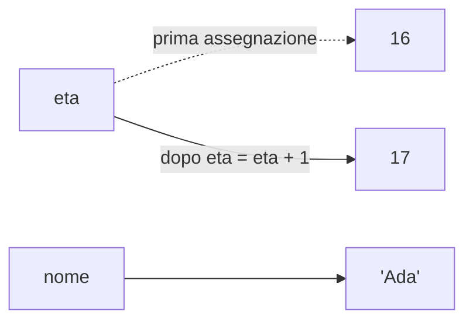
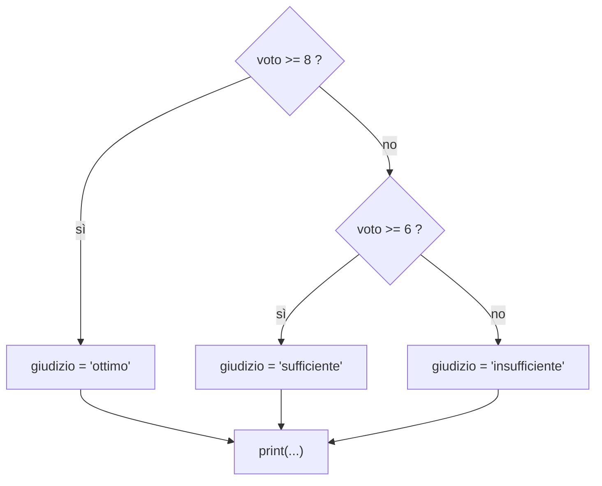
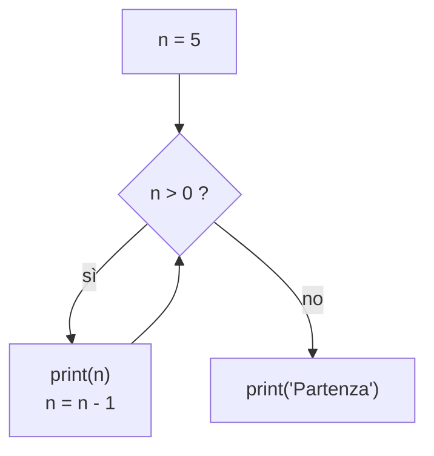
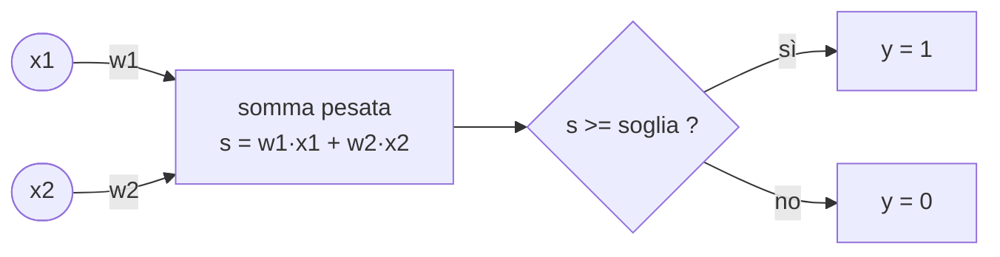
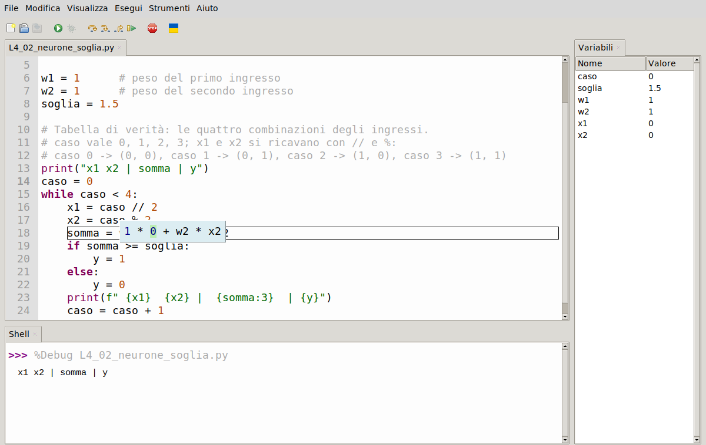
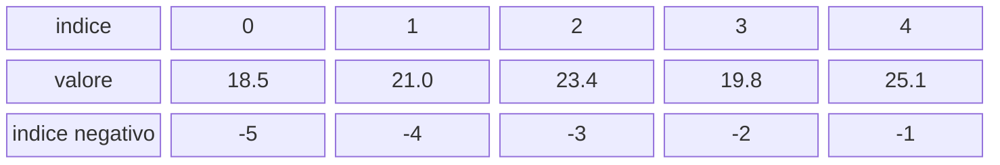
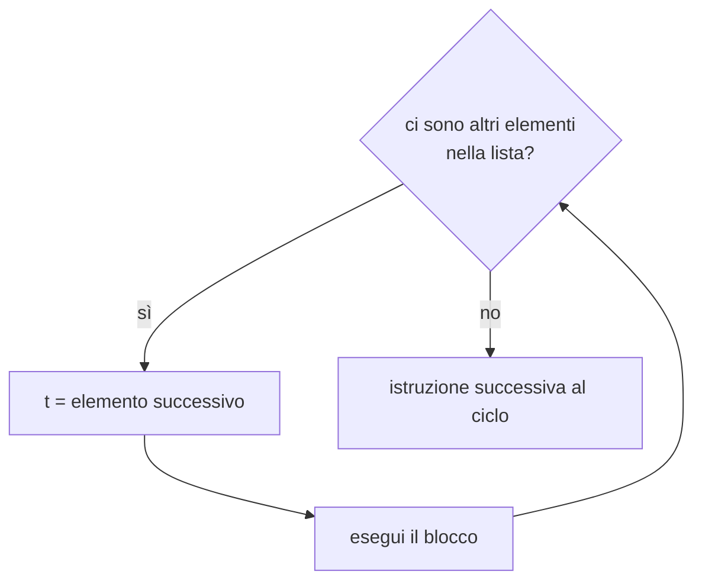
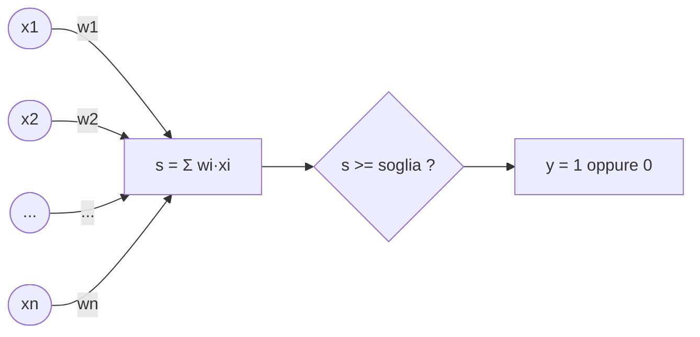

# Lezione L3 - Valori, tipi, variabili, espressioni

## Obiettivi della lezione

- riconoscere i tipi di dato fondamentali: `int`, `float`, `str`, `bool`
- creare e aggiornare variabili rispettando le regole sui nomi
- scrivere espressioni aritmetiche e prevederne il risultato
- spiegare perché i numeri con la virgola sono approssimati
- formattare l'output con le f-string
- leggere dati dall'utente e convertirli nel tipo corretto
- usare le funzioni matematiche del modulo `math`, in particolare `math.exp`

## Valori e tipi

Ogni dato elaborato da un programma è un valore, e ogni valore ha un tipo. Il tipo stabilisce quali valori sono possibili e quali operazioni si possono eseguire.

Tipi fondamentali:

- `int` (integer, intero)
  numeri interi, positivi e negativi, senza limite di grandezza: `42`, `-7`, `2026`.
- `float` (floating point, virgola mobile)
  numeri con parte decimale: `3.14`, `-0.5`, `2.0`. Il separatore decimale è il punto. Sono ammessi anche in notazione scientifica: `1e-3` vale 0.001, `2.5e6` vale 2 500 000.
- `str` (string, stringa)
  testo racchiuso tra virgolette doppie o singole: `"ciao"`, `'Python'`. Le due forme sono equivalenti.
- `bool` (boolean, booleano)
  valori logici: `True` (vero) e `False` (falso), con l'iniziale maiuscola. Sono il risultato dei confronti (lezione L4).

La funzione `type()` restituisce il tipo di un valore:

```python
>>> type(42)
<class 'int'>
>>> type(3.14)
<class 'float'>
>>> type("ciao")
<class 'str'>
>>> type(True)
<class 'bool'>
```

`2` e `2.0` rappresentano lo stesso numero ma hanno tipi diversi: il primo è un `int`, il secondo un `float`. Allo stesso modo, `"2"` è una stringa: un testo che contiene il carattere 2, non un numero.

Un valore speciale, `None`, indica l'assenza di un valore. Negli esercizi del corso è usato come segnaposto da sostituire con il calcolo richiesto.

## Variabili

Una variabile è un nome associato a un valore. L'assegnazione, con il simbolo `=`, crea l'associazione; se il nome esiste già, l'associazione precedente viene sostituita.

```python
eta = 16
eta = eta + 1     # prima si calcola eta + 1 (17), poi il risultato viene associato a eta
```

La seconda riga non è un'equazione: si legge "calcola il valore dell'espressione a destra e associalo al nome a sinistra".

Diagramma: nomi e valori in memoria dopo le due assegnazioni



In Python il tipo appartiene al valore, non alla variabile: lo stesso nome può essere associato prima a un numero e poi a una stringa. È possibile, ma rende il codice difficile da leggere e va evitato.

Regole sui nomi:

- possono contenere lettere, cifre e il trattino basso `_`
- non possono iniziare con una cifra: `2voto` non è valido, `voto2` sì
- maiuscole e minuscole sono distinte: `voto` e `Voto` sono due nomi diversi
- non possono coincidere con le parole riservate del linguaggio, come `if`, `for`, `while`, `True`, `None`, `import`

Convenzioni:

- nomi in minuscolo, con le parole separate da `_` (stile chiamato snake_case): `anno_nascita`, `media_voti`
- nomi che descrivono il contenuto: `temperatura` è preferibile a `t` o `x`, salvo nelle formule matematiche in cui la lettera è il nome consueto

## Operatori aritmetici

| Operatore | Operazione | Esempio | Risultato |
|---|---|---|---|
| `+` | somma | `17 + 5` | `22` |
| `-` | sottrazione | `17 - 5` | `12` |
| `*` | moltiplicazione | `17 * 5` | `85` |
| `/` | divisione | `17 / 5` | `3.4` |
| `//` | divisione intera | `17 // 5` | `3` |
| `%` | resto della divisione intera (modulo) | `17 % 5` | `2` |
| `**` | potenza | `17 ** 2` | `289` |

Osservazioni:

- `/` produce sempre un `float`, anche quando la divisione è esatta: `10 / 2` vale `5.0`
- `//` e `%` sono complementari: `17 = 5 * 3 + 2`, quindi `17 // 5` vale 3 e `17 % 5` vale 2
- `%` è utile per stabilire se un numero è divisibile per un altro (resto uguale a 0) e per ottenere l'ultima cifra di un numero (`n % 10`)

Esempio: conversione di una durata in secondi in ore, minuti e secondi.

```python
secondi_totali = 3725
ore = secondi_totali // 3600                 # 1 ora intera
minuti = (secondi_totali % 3600) // 60       # dei 125 secondi rimanenti, 2 minuti interi
secondi = secondi_totali % 60                # 5 secondi rimanenti
```

### Precedenza

Le operazioni si eseguono nell'ordine consueto della matematica:

1. parentesi tonde
2. potenza `**`
3. segno meno davanti a un numero (`-x`)
4. `*`, `/`, `//`, `%`
5. `+`, `-`

A parità di precedenza le operazioni si eseguono da sinistra a destra, con l'eccezione della potenza, che si esegue da destra a sinistra (`2 ** 3 ** 2` vale `2 ** 9`).

Attenzione: `-2 ** 2` vale `-4`, perché la potenza precede il segno meno; per elevare al quadrato il numero negativo si scrive `(-2) ** 2`.

Nei casi dubbi, le parentesi rendono esplicito l'ordine e migliorano la leggibilità.

### Assegnazione aumentata

Aggiornare una variabile a partire dal suo valore è un'operazione frequente; esiste una forma abbreviata:

| Forma abbreviata | Equivale a |
|---|---|
| `x += 3` | `x = x + 3` |
| `x -= 3` | `x = x - 3` |
| `x *= 3` | `x = x * 3` |
| `x /= 3` | `x = x / 3` |

## Numeri in virgola mobile

```python
>>> 0.1 + 0.2
0.30000000000000004
>>> 0.1 + 0.2 == 0.3
False
```

Il risultato non è un errore di Python. Il computer rappresenta i numeri in base 2, con un numero fisso di cifre (64 bit per un `float`). Molti numeri che in base 10 hanno una scrittura finita, come 0.1, in base 2 hanno infinite cifre, come 1/3 in base 10 (0.3333...). Vengono quindi memorizzati in forma approssimata, e gli errori di approssimazione possono sommarsi.

Conseguenze pratiche:

- due `float` calcolati in modi diversi raramente vanno confrontati con `==`; si verifica invece che siano molto vicini, con `math.isclose(a, b)`
- per mostrare un risultato si arrotonda la visualizzazione, non il valore: `round(x, 2)` restituisce `x` arrotondato a due cifre decimali; le f-string (più avanti) permettono di scegliere quante cifre mostrare

Rilevanza per l'intelligenza artificiale: le reti neurali eseguono miliardi di operazioni su numeri `float`. Le librerie usano spesso `float` a 32 o anche a 16 bit, meno precisi ma più veloci e meno ingombranti in memoria. La precisione è un compromesso tecnico, non un valore assoluto.

## Stringhe e f-string

Operazioni di base sulle stringhe:

```python
>>> "Intelligenza" + " " + "artificiale"     # concatenazione
'Intelligenza artificiale'
>>> "ab" * 3                                   # ripetizione
'ababab'
>>> len("Python")                              # lunghezza, in caratteri
6
```

`+` tra una stringa e un numero produce un errore (`TypeError`): Python non converte automaticamente i numeri in testo.

Una f-string è una stringa preceduta dalla lettera `f`, in cui le espressioni racchiuse tra parentesi graffe vengono calcolate e il risultato viene inserito nel testo:

```python
nome = "Ada"
voto = 8.456
print(f"{nome} ha ottenuto {voto}")        # Ada ha ottenuto 8.456
print(f"{nome} ha ottenuto {voto:.1f}")    # Ada ha ottenuto 8.5
print(f"Doppio: {voto * 2:.2f}")          # Doppio: 16.91
```

Dopo l'espressione si può indicare un formato, preceduto da due punti:

| Formato | Significato | Esempio con `x = 3.14159` |
|---|---|---|
| `:.2f` | numero con 2 cifre decimali | `3.14` |
| `:.0f` | numero senza decimali, arrotondato | `3` |
| `:8.2f` | 2 decimali, occupando almeno 8 caratteri (allineato a destra) | `    3.14` |
| `:5` | occupa almeno 5 caratteri | `3.14159` (già più lungo di 5) |

La larghezza minima serve ad allineare i valori in colonna, per esempio nelle tabelle stampate con un ciclo.

## Input e conversioni

La funzione `input()` mostra un messaggio, attende che l'utente scriva un testo e prema Invio, e restituisce il testo scritto. Il risultato è sempre una stringa, anche se l'utente scrive un numero.

```python
testo = input("Temperatura in gradi Celsius: ")
celsius = float(testo)
fahrenheit = celsius * 9 / 5 + 32
print(f"{celsius:.1f} °C corrispondono a {fahrenheit:.1f} °F")
```

Funzioni di conversione:

| Funzione | Converte in | Esempio | Risultato |
|---|---|---|---|
| `int()` | intero | `int("25")`, `int(3.9)` | `25`, `3` (tronca, non arrotonda) |
| `float()` | virgola mobile | `float("2.5")`, `float(3)` | `2.5`, `3.0` |
| `str()` | stringa | `str(25)` | `'25'` |

Se il testo non rappresenta un numero, la conversione produce un errore `ValueError`:

```text
>>> float("ventuno")
ValueError: could not convert string to float: 'ventuno'
```

La gestione di questi errori, con `try` ed `except`, è trattata nella lezione L7.

## Il modulo math

Un modulo è un file che contiene funzioni e valori pronti all'uso. Il modulo `math` fa parte della libreria standard e contiene le funzioni matematiche più comuni. Per usarlo si scrive all'inizio del programma:

```python
import math
```

Le funzioni del modulo si richiamano con il nome del modulo, un punto e il nome della funzione.

| Espressione | Significato |
|---|---|
| `math.sqrt(x)` | radice quadrata |
| `math.pi` | pi greco |
| `math.e` | numero di Nepero, circa 2.71828 |
| `math.exp(x)` | funzione esponenziale $e^x$ |
| `math.log(x)` | logaritmo naturale |
| `math.isclose(a, b)` | `True` se `a` e `b` sono molto vicini |

### La funzione esponenziale

La funzione esponenziale $e^x$ ha un ruolo centrale nelle reti neurali. Comportamento:

- vale 1 per $x = 0$
- cresce molto rapidamente per $x$ positivo: $e^5 \approx 148$, $e^{10} \approx 22026$
- tende a 0, senza mai raggiungerlo, per $x$ negativo: $e^{-5} \approx 0.0067$
- è sempre positiva

```python
>>> math.exp(0)
1.0
>>> math.exp(2)
7.38905609893065
>>> math.exp(-2)
0.1353352832366127
```

Anticipazione: la funzione sigmoide, $\sigma(x) = \frac{1}{1 + e^{-x}}$, trasforma qualsiasi numero in un valore compreso tra 0 e 1. È una delle funzioni di attivazione dei neuroni artificiali (lezione L6) e si calcola con `1 / (1 + math.exp(-x))`.

## Laboratorio L3

Durata indicativa: 25 minuti. Ambiente: Thonny.

File:

- `L3_01_esempi.py`: gli esempi della lezione; eseguirlo e confrontare ogni riga di output con il codice
- `L3_02_esercizi.py`: esercizi con verifica automatica
- `L3_03_conversione_interattiva.py`: programma con `input()`

Negli esercizi con verifica automatica ogni `None` va sostituito con il calcolo richiesto. Al termine di ogni esercizio le righe che iniziano con `assert` controllano il risultato: se è corretto il programma prosegue, altrimenti si ferma e il messaggio indica quale esercizio rivedere. Le righe di controllo usano costrutti spiegati nelle lezioni successive e non vanno modificate.

- Esercizio 1 (base): convertire 3725 secondi in ore, minuti e secondi con `//` e `%`
- Esercizio 2 (base): convertire 36.6 °C in gradi Fahrenheit; osservare il numero di cifre del risultato
- Esercizio 3 (standard): media di tre voti, stampata con due cifre decimali tramite f-string
- Esercizio 4 (approfondimento): calcolare la sigmoide in 0, 4 e -4; verificare che $\sigma(4) + \sigma(-4) = 1$
- Esercizio 5 (standard, `L3_03_conversione_interattiva.py`): programma che legge una temperatura con `input()` e la converte; provare a inserire un testo non numerico e interpretare l'errore

# Lezione L4 - Decisioni e ripetizioni

## Obiettivi della lezione

- scrivere condizioni con gli operatori di confronto e gli operatori logici
- far eseguire al programma istruzioni diverse secondo una condizione, con `if`, `elif`, `else`
- ripetere istruzioni finché una condizione è vera, con `while`
- costruire un primo modello di neurone artificiale: il neurone a soglia
- seguire l'esecuzione di un programma passo passo con il debugger di Thonny

## Operatori di confronto

Un confronto produce un valore `bool`: `True` o `False`.

| Operatore | Significato | Esempio con `x = 7` | Risultato |
|---|---|---|---|
| `==` | uguale | `x == 7` | `True` |
| `!=` | diverso | `x != 7` | `False` |
| `<` | minore | `x < 5` | `False` |
| `>` | maggiore | `x > 5` | `True` |
| `<=` | minore o uguale | `x <= 7` | `True` |
| `>=` | maggiore o uguale | `x >= 8` | `False` |

`=` e `==` hanno significati diversi: `=` assegna un valore a una variabile, `==` confronta due valori. Scrivere `=` al posto di `==` in una condizione produce un `SyntaxError`.

Le stringhe si confrontano carattere per carattere: `"ciao" == "Ciao"` vale `False`, perché maiuscole e minuscole sono caratteri diversi.

## Operatori logici

Gli operatori logici combinano più condizioni.

- `and`: vero se entrambe le condizioni sono vere
- `or`: vero se almeno una delle condizioni è vera
- `not`: inverte il valore di una condizione

| `a` | `b` | `a and b` | `a or b` | `not a` |
|---|---|---|---|---|
| `False` | `False` | `False` | `False` | `True` |
| `False` | `True` | `False` | `True` | `True` |
| `True` | `False` | `False` | `True` | `False` |
| `True` | `True` | `True` | `True` | `False` |

Esempio: un'età compresa tra 14 e 17 anni si esprime con `eta >= 14 and eta <= 17`. Python ammette anche la forma abbreviata `14 <= eta <= 17`.

Queste tabelle, dette tabelle di verità, definiscono le funzioni logiche AND e OR, che il neurone a soglia della fine della lezione è in grado di calcolare.

## L'istruzione if

L'istruzione `if` esegue un gruppo di istruzioni solo se una condizione è vera.

```python
voto = 6.5
if voto >= 8:
    giudizio = "ottimo"
elif voto >= 6:
    giudizio = "sufficiente"
else:
    giudizio = "insufficiente"
print("Voto", voto, "->", giudizio)
```

Struttura:

- `if condizione:` la riga termina con i due punti `:`
- le istruzioni da eseguire se la condizione è vera formano un blocco e sono rientrate (indentate) di 4 spazi. Thonny inserisce il rientro automaticamente dopo i due punti
- `elif condizione:` (abbreviazione di else if): condizione alternativa, verificata solo se le precedenti sono false; possono essercene più di una
- `else:` blocco eseguito se nessuna condizione precedente è vera; è facoltativo
- il blocco termina alla prima riga che torna al livello di rientro dell'`if`

Le condizioni vengono verificate in ordine e viene eseguito solo il primo blocco la cui condizione è vera. Nell'esempio, con `voto = 9` la prima condizione è vera e le altre non vengono verificate: per questo la seconda condizione può essere semplicemente `voto >= 6`, senza aggiungere `voto < 8`.

Diagramma: flusso dell'esempio



### L'indentazione

In molti linguaggi i blocchi sono delimitati da parentesi graffe e l'indentazione serve solo alla leggibilità. In Python l'indentazione fa parte della sintassi: istruzioni con lo stesso rientro appartengono allo stesso blocco.

```python
if voto >= 6:
    print("promosso")
    print("complimenti")    # nel blocco: eseguita solo se voto >= 6
print("fine")               # fuori dal blocco: eseguita sempre
```

Errori tipici:

- rientri non uniformi all'interno di un blocco: `IndentationError`
- dimenticare i due punti alla fine della riga `if`: `SyntaxError`
- mescolare spazi e caratteri di tabulazione: da evitare; Thonny usa sempre spazi

## Il ciclo while

Il ciclo `while` ripete un blocco di istruzioni finché una condizione è vera.

```python
n = 5
while n > 0:
    print(n)
    n = n - 1
print("Partenza")
```

Esecuzione:

1. si verifica la condizione `n > 0`
2. se è vera, si esegue il blocco e si torna al punto 1
3. se è falsa, si prosegue con l'istruzione successiva al blocco

Diagramma: flusso del ciclo while



Ogni ciclo `while` ha tre elementi:

- inizializzazione: la variabile della condizione riceve un valore prima del ciclo (`n = 5`)
- condizione: determina se il ciclo continua (`n > 0`)
- aggiornamento: nel blocco, la variabile cambia in modo che prima o poi la condizione diventi falsa (`n = n - 1`)

Se manca l'aggiornamento, la condizione resta sempre vera e il ciclo non termina mai (ciclo infinito). In Thonny il programma si interrompe con il pulsante Stop o con `Ctrl+C`.

L'istruzione `break`, all'interno del blocco, interrompe immediatamente il ciclo, indipendentemente dalla condizione.

### Numeri casuali

Il modulo `random` della libreria standard genera numeri casuali (più precisamente pseudocasuali, cioè prodotti da un algoritmo ma con le proprietà statistiche dei numeri casuali).

```python
import random
segreto = random.randint(1, 100)    # intero casuale tra 1 e 100, estremi inclusi
```

I numeri casuali sono indispensabili nel machine learning: i pesi di una rete neurale vengono inizializzati con valori casuali prima dell'addestramento.

## Il neurone a soglia

Un neurone artificiale è un modello di calcolo ispirato, in modo molto semplificato, ai neuroni biologici. La versione più semplice, il neurone a soglia, funziona così:

1. riceve alcuni ingressi numerici, per esempio due valori $x_1$ e $x_2$ che valgono 0 oppure 1
2. moltiplica ogni ingresso per un peso ($w_1$, $w_2$), che indica quanto quell'ingresso conta
3. somma i risultati: $s = w_1 x_1 + w_2 x_2$
4. confronta la somma con una soglia: l'uscita $y$ vale 1 se $s \geq$ soglia, altrimenti 0

Diagramma: neurone a soglia con due ingressi



Con $w_1 = w_2 = 1$ e soglia 1.5, la somma raggiunge la soglia solo quando entrambi gli ingressi valgono 1: il neurone calcola la funzione AND.

| $x_1$ | $x_2$ | $s$ | $s \geq 1.5$ ? | $y$ |
|---|---|---|---|---|
| 0 | 0 | 0 | no | 0 |
| 0 | 1 | 1 | no | 0 |
| 1 | 0 | 1 | no | 0 |
| 1 | 1 | 2 | sì | 1 |

Cambiando soltanto i pesi e la soglia, lo stesso neurone calcola funzioni diverse. Questa è l'idea alla base di tutte le reti neurali: il comportamento non è scritto nel codice, ma dipende dai valori dei parametri. L'apprendimento (lezione L14) consiste nel trovare automaticamente i valori adatti.

Programma `L4_02_neurone_soglia.py`:

```python
w1 = 1      # peso del primo ingresso
w2 = 1      # peso del secondo ingresso
soglia = 1.5

print("x1 x2 | somma | y")
caso = 0
while caso < 4:
    x1 = caso // 2
    x2 = caso % 2
    somma = w1 * x1 + w2 * x2
    if somma >= soglia:
        y = 1
    else:
        y = 0
    print(f" {x1}  {x2} |  {somma:3}  | {y}")
    caso = caso + 1
```

Spiegazione:

- `caso` assume i valori 0, 1, 2, 3, uno per ogni combinazione di ingressi
- `caso // 2` e `caso % 2` ricavano i due ingressi: per `caso = 2`, `2 // 2` vale 1 e `2 % 2` vale 0, quindi $x_1 = 1$, $x_2 = 0$. In pratica sono le due cifre del numero `caso` scritto in base 2
- `{somma:3}` nella f-string stampa la somma occupando almeno 3 caratteri, per allineare la colonna

Output:

```text
x1 x2 | somma | y
 0  0 |    0  | 0
 0  1 |    1  | 0
 1  0 |    1  | 0
 1  1 |    2  | 1
```

## Il debugger di Thonny

Il debugger esegue il programma un passo alla volta. È lo strumento principale per capire perché un programma non si comporta come previsto.

Avvio: menu `Esegui`, voce `Debug dello script corrente (più bello)`, oppure `Ctrl+F5`. La prima istruzione viene evidenziata e l'esecuzione si ferma.

Comandi:

| Comando | Tasto | Effetto |
|---|---|---|
| Passo sopra | `F6` | esegue l'intera istruzione evidenziata; se è un ciclo o un `if`, esegue tutto il blocco |
| Passo dentro | `F7` | entra nell'istruzione: nei blocchi passa alla prima istruzione interna, nelle espressioni mostra il calcolo di ogni parte |
| Passo fuori | | completa il blocco o la funzione corrente |
| Riprendi | `F8` | prosegue senza fermarsi |

Con `F7` Thonny mostra la valutazione delle espressioni: nell'immagine, durante il calcolo di `somma = w1 * x1 + w2 * x2`, il nome `w1` è già stato sostituito dal suo valore 1 e il nome `x1` dal suo valore 0. Il pannello Variabili mostra i valori correnti.

{width=100%}

## Laboratorio L4

Durata indicativa: 25 minuti. Ambiente: Thonny.

File: `L4_01_esempi.py`, `L4_02_neurone_soglia.py`, `L4_03_esercizi.py`, `L4_04_indovina_numero.py`.

1. (base) Eseguire `L4_02_neurone_soglia.py` con il debugger (`Ctrl+F5`) e seguire con `F7` il primo giro del ciclo, osservando il pannello Variabili.
2. Esercizi di `L4_03_esercizi.py`:
   - Esercizio 1 (base): stabilire se un numero è pari o dispari
   - Esercizio 2 (base): classificare un'età in tre fasce con `if`, `elif`, `else`
   - Esercizio 3 (standard): somma dei numeri da 1 a 100 con `while`
   - Esercizio 4 (standard): trovare pesi e soglia per cui il neurone calcola OR; provarli in `L4_02_neurone_soglia.py` e riportarli nel file degli esercizi
   - Esercizio 5 (approfondimento): trovare pesi e soglia per NAND (uscita 0 solo se entrambi gli ingressi valgono 1)
3. Esercizio 6 (standard): completare il gioco `L4_04_indovina_numero.py`.

Domanda per la discussione finale: esistono pesi e soglia per cui il neurone calcola XOR (uscita 1 se esattamente uno degli ingressi vale 1)? La risposta è nella lezione L13.

# Lezione L5 - Liste e ciclo for

## Obiettivi della lezione

- creare liste, accedere agli elementi con indici e sottoliste
- modificare liste e aggiungere elementi
- scorrere una lista con il ciclo `for`; usare `range`, `enumerate`, `zip`
- calcolare somma, media, minimo e massimo con il metodo dell'accumulatore
- calcolare la somma pesata di due liste e costruire un neurone con un numero qualsiasi di ingressi

## Liste

Una lista è una sequenza ordinata di valori, scritta tra parentesi quadre con gli elementi separati da virgole.

```python
temperature = [18.5, 21.0, 23.4, 19.8, 25.1]
nomi = ["Ada", "Alan", "Grace"]
vuota = []
```

Una lista può contenere valori di qualsiasi tipo, anche misti, ma di solito contiene valori dello stesso tipo.

### Indici

Ogni elemento ha una posizione, detta indice. Il primo elemento ha indice 0. Gli indici negativi contano dalla fine: -1 è l'ultimo elemento.

Diagramma: indici della lista `temperature`



```python
>>> temperature[0]
18.5
>>> temperature[-1]
25.1
>>> len(temperature)
5
>>> temperature[5]
IndexError: list index out of range
```

Con 5 elementi gli indici validi vanno da 0 a 4: l'indice dell'ultimo elemento è sempre `len(lista) - 1`.

### Sottoliste (slicing)

`lista[inizio:fine]` restituisce una nuova lista con gli elementi dall'indice `inizio` (incluso) all'indice `fine` (escluso).

```python
>>> temperature[1:3]
[21.0, 23.4]
>>> temperature[:2]       # dall'inizio all'indice 2 escluso
[18.5, 21.0]
>>> temperature[3:]       # dall'indice 3 alla fine
[19.8, 25.1]
```

La regola "inizio incluso, fine esclusa" ha una conseguenza utile: `temperature[:k]` e `temperature[k:]` dividono la lista in due parti senza sovrapposizioni, e `temperature[a:b]` contiene `b - a` elementi.

### Modifica

Le liste sono modificabili (mutabili): si possono cambiare gli elementi e aggiungerne di nuovi.

```python
temperature[0] = 18.0          # sostituisce il primo elemento
temperature.append(22.7)       # aggiunge un elemento in fondo
```

`append` è un metodo, cioè una funzione associata a un tipo di valore; si richiama scrivendo il valore (o la variabile), un punto e il nome del metodo. I metodi sono trattati in dettaglio nella lezione L8.

L'operatore `in` verifica se un valore è contenuto in una lista: `21.0 in temperature` vale `True`.

## Il ciclo for

Il ciclo `for` ripete un blocco una volta per ogni elemento di una sequenza; a ogni ripetizione la variabile del ciclo assume il valore dell'elemento successivo.

```python
for t in temperature:
    print("temperatura:", t)
```

Si legge: "per ogni elemento `t` della lista `temperature`, esegui il blocco". Non serve gestire un contatore né una condizione di uscita: il ciclo termina quando gli elementi sono finiti. Per questo, quando si devono scorrere gli elementi di una sequenza, `for` è preferibile a `while`.

Diagramma: esecuzione del ciclo for



### range

`range` genera una sequenza di numeri interi, usata per ripetere un blocco un numero stabilito di volte o per scorrere gli indici.

| Forma | Numeri generati | Esempio | Risultato |
|---|---|---|---|
| `range(n)` | da 0 a n-1 | `range(4)` | 0, 1, 2, 3 |
| `range(a, b)` | da a a b-1 | `range(2, 6)` | 2, 3, 4, 5 |
| `range(a, b, passo)` | da a, con incremento passo, fino a b escluso | `range(2, 10, 3)` | 2, 5, 8 |

Come nello slicing, l'estremo finale è escluso. `list(range(4))` trasforma la sequenza in una lista, utile per vederne il contenuto.

### enumerate e zip

`enumerate` fornisce, a ogni ripetizione, l'indice e il valore dell'elemento:

```python
for i, t in enumerate(temperature):
    print(i, t)
```

`zip` scorre due liste in parallelo, fornendo a ogni ripetizione un elemento di ciascuna:

```python
giorni = ["lun", "mar", "mer", "gio", "ven"]
for g, t in zip(giorni, temperature):
    print(g, t)
```

In entrambi i casi il `for` ha due variabili, separate da una virgola. Se le liste passate a `zip` hanno lunghezze diverse, il ciclo si ferma alla fine della più corta.

## Il metodo dell'accumulatore

Molti calcoli su una lista seguono lo stesso schema: una variabile, detta accumulatore, riceve un valore iniziale prima del ciclo e viene aggiornata a ogni elemento.

Somma e media:

```python
somma = 0                      # valore iniziale: elemento neutro della somma
for t in temperature:
    somma = somma + t          # aggiornamento
media = somma / len(temperature)
```

Massimo:

```python
massimo = temperature[0]       # valore iniziale: il primo elemento
for t in temperature:
    if t > massimo:
        massimo = t
```

Il valore iniziale del massimo è il primo elemento e non 0: con temperature tutte negative, un valore iniziale 0 darebbe un risultato sbagliato.

Conteggio degli elementi che soddisfano una condizione:

```python
conteggio = 0
for t in temperature:
    if t > 20:
        conteggio = conteggio + 1
```

Per le operazioni più comuni Python dispone di funzioni predefinite: `sum(lista)`, `max(lista)`, `min(lista)`. Scrivere il ciclo a mano serve a capire il procedimento, che resta necessario quando il calcolo è diverso da quelli già previsti.

## La somma pesata

Nella media aritmetica tutti i valori contano allo stesso modo. Nella media ponderata ogni valore ha un peso. Esempio: una valutazione formata da scritto (peso 50%), orale (30%) e laboratorio (20%).

```python
voti = [7, 6, 9]
pesi = [0.5, 0.3, 0.2]

somma_pesata = 0
for v, p in zip(voti, pesi):
    somma_pesata = somma_pesata + v * p
print("Media ponderata:", somma_pesata)     # 7 * 0.5 + 6 * 0.3 + 9 * 0.2 = 7.1
```

La somma dei prodotti di elementi corrispondenti di due liste si chiama prodotto scalare. Con le liste $x = [x_1, x_2, \dots, x_n]$ e $w = [w_1, w_2, \dots, w_n]$:

$$s = w_1 x_1 + w_2 x_2 + \dots + w_n x_n = \sum_{i=1}^{n} w_i x_i$$

Il simbolo $\sum$ (sommatoria) indica la somma dei termini $w_i x_i$ per $i$ che va da 1 a $n$: è la scrittura matematica di un ciclo `for` con accumulatore.

È esattamente il calcolo del neurone della lezione L4, esteso a un numero qualsiasi di ingressi.

Diagramma: neurone con n ingressi



```python
ingressi = [1, 0, 1]
pesi = [0.6, 0.6, 0.6]
soglia = 1.0

s = 0
for x, w in zip(ingressi, pesi):
    s = s + x * w
y = 1 if s >= soglia else 0
```

L'ultima riga usa l'espressione condizionale: `valore1 if condizione else valore2` vale `valore1` se la condizione è vera, `valore2` altrimenti. È una forma compatta, adatta ai casi semplici, del costrutto `if`/`else` che assegna un valore alla stessa variabile nei due rami.

### Cicli annidati

Un ciclo può contenerne un altro. Per ogni ripetizione del ciclo esterno, il ciclo interno viene eseguito completamente. Con due ingressi binari si ottengono così tutte e quattro le combinazioni:

```python
for x1 in [0, 1]:
    for x2 in [0, 1]:
        print(x1, x2)
```

Output: `0 0`, `0 1`, `1 0`, `1 1`, uno per riga. Con tre cicli annidati si ottengono le 8 combinazioni di tre ingressi.

### Dalla soglia al bias

La condizione $s \geq \text{soglia}$ equivale a $s - \text{soglia} \geq 0$. Se si definisce $b = -\text{soglia}$, il neurone calcola

$$z = w_1 x_1 + \dots + w_n x_n + b$$

e l'uscita vale 1 se $z \geq 0$. Il valore $b$ si chiama bias. È la forma usata nelle reti neurali e nelle lezioni successive: il bias è trattato come un parametro del neurone, allo stesso modo dei pesi.

## Laboratorio L5

Durata indicativa: 30 minuti. Ambiente: Thonny.

File: `L5_01_esempi.py`, `L5_02_somma_pesata.py`, `L5_03_esercizi.py`.

Negli esercizi 1-3 va usato un ciclo `for`, non le funzioni `sum`, `max`, `min`.

- Esercizio 1 (base): somma e media di una lista di misure
- Esercizio 2 (base): minimo delle misure
- Esercizio 3 (standard): numero di misure superiori alla media
- Esercizio 4 (standard): somma pesata di ingressi e pesi, con valori anche negativi
- Esercizio 5 (standard): neurone di maggioranza con tre ingressi (uscita 1 se almeno due ingressi valgono 1); il controllo prova automaticamente tutte le 8 combinazioni
- Esercizio 6 (approfondimento): normalizzazione delle misure nell'intervallo [0, 1] con la formula $\frac{x - \min}{\max - \min}$; costruire la nuova lista con `append`. La normalizzazione è un'operazione standard di preparazione dei dati per le reti neurali
