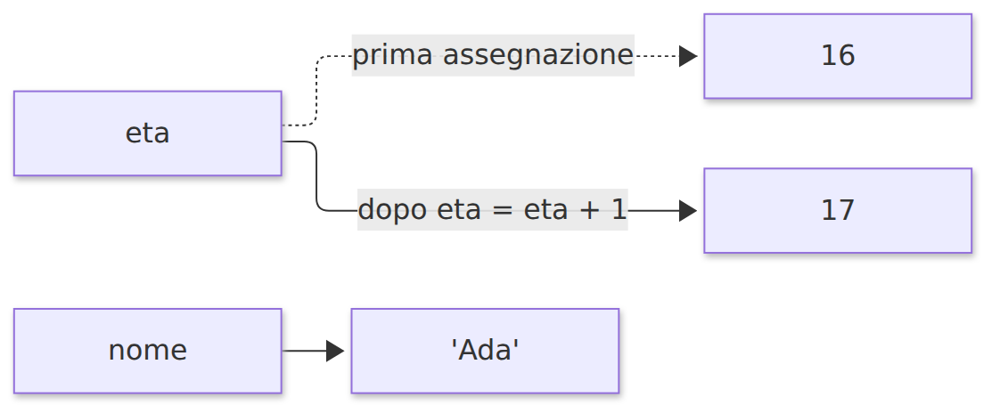
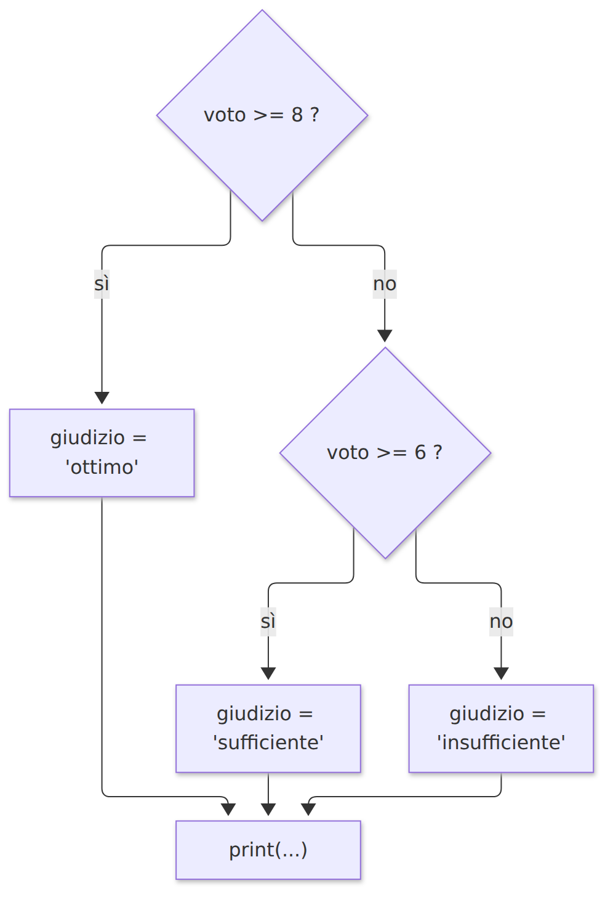
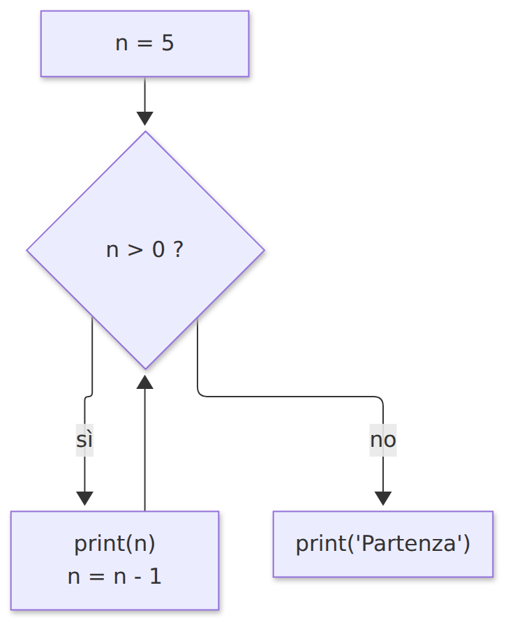
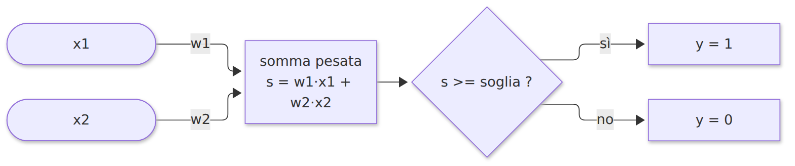
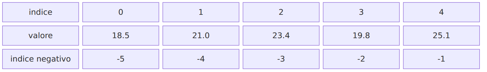
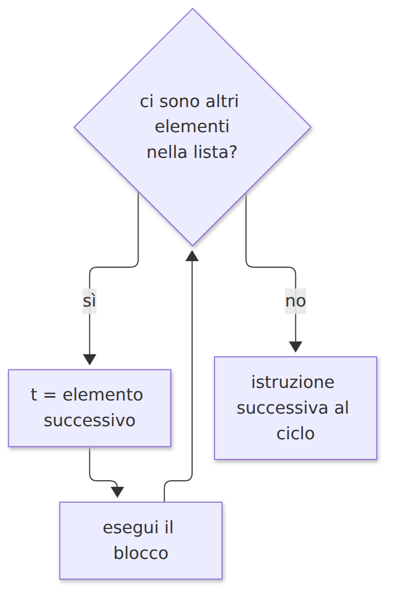
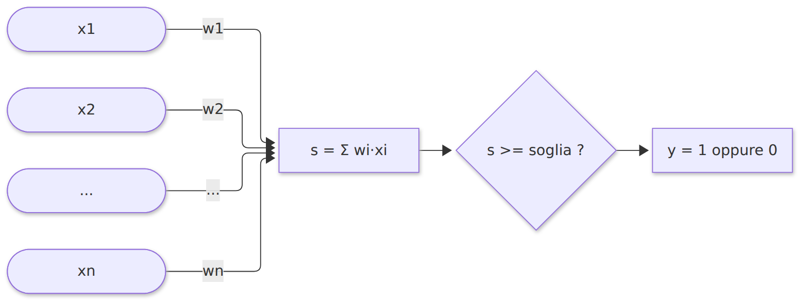

<!-- _class: titolo -->
<!-- _paginate: false -->

## Modulo 2 - Fondamenti di Python (parte 1)

B.8 - Python per l'Intelligenza Artificiale

Lezioni L3, L4, L5

---

<!-- _class: titolo -->

## L3 - Valori, tipi, variabili, espressioni

---

## Tipi fondamentali

| Tipo | Contenuto | Esempi |
|---|---|---|
| `int` | numeri interi | `42`, `-7` |
| `float` | numeri con la virgola | `3.14`, `2.0`, `1e-3` |
| `str` | testo | `"ciao"`, `'Python'` |
| `bool` | valori logici | `True`, `False` |

- `type(valore)` restituisce il tipo
- `2`, `2.0` e `"2"` hanno tipi diversi
- `None`: valore speciale che indica assenza di valore

---

## Variabili

```python
eta = 16
eta = eta + 1     # si calcola eta + 1, poi si associa il risultato a eta
```



`=` non è un'equazione: calcola a destra, associa a sinistra.

---

## Nomi delle variabili

- lettere, cifre, `_`; non iniziano con una cifra
- maiuscole e minuscole distinte: `voto` e `Voto` sono nomi diversi
- non si usano parole riservate: `if`, `for`, `while`, `True`, `None`, `import`, ...
- convenzione snake_case: `anno_nascita`, `media_voti`
- nomi che descrivono il contenuto

---

## Operatori aritmetici

| Operatore | Operazione | `17 ? 5` |
|---|---|---|
| `+` `-` `*` | somma, sottrazione, prodotto | `22`, `12`, `85` |
| `/` | divisione (risultato `float`) | `3.4` |
| `//` | divisione intera | `3` |
| `%` | resto (modulo) | `2` |
| `**` | potenza (`17 ** 2`) | `289` |

`17 = 5 * 3 + 2`: `//` dà 3, `%` dà 2

---

## Esempio: secondi in ore e minuti

```python
secondi_totali = 3725
ore = secondi_totali // 3600                 # 1
minuti = (secondi_totali % 3600) // 60       # 2
secondi = secondi_totali % 60                # 5
```

---

## Precedenza

1. parentesi
2. `**` (da destra a sinistra)
3. segno meno `-x`
4. `*` `/` `//` `%`
5. `+` `-`

`-2 ** 2` vale `-4`; `(-2) ** 2` vale `4`

Assegnazione aumentata: `x += 3` equivale a `x = x + 3`

---

## Numeri in virgola mobile

```python
>>> 0.1 + 0.2
0.30000000000000004
>>> 0.1 + 0.2 == 0.3
False
>>> math.isclose(0.1 + 0.2, 0.3)
True
```

- rappresentazione in base 2 con 64 bit: 0.1 non è rappresentabile esattamente
- non confrontare `float` con `==`: usare `math.isclose`
- reti neurali: spesso `float` a 32 o 16 bit, precisione contro velocità

---

## Stringhe e f-string

```python
"Intelligenza" + " " + "artificiale"    # concatenazione
"ab" * 3                                  # 'ababab'
len("Python")                             # 6

nome = "Ada"
voto = 8.456
print(f"{nome} ha ottenuto {voto:.1f}")   # Ada ha ottenuto 8.5
```

| Formato | Significato |
|---|---|
| `:.2f` | 2 cifre decimali |
| `:8.2f` | 2 decimali, almeno 8 caratteri |
| `:5` | almeno 5 caratteri |

---

## Input e conversioni

```python
testo = input("Temperatura in gradi Celsius: ")   # sempre str
celsius = float(testo)
fahrenheit = celsius * 9 / 5 + 32
print(f"{celsius:.1f} °C corrispondono a {fahrenheit:.1f} °F")
```

| Funzione | Esempio | Risultato |
|---|---|---|
| `int()` | `int("25")`, `int(3.9)` | `25`, `3` |
| `float()` | `float("2.5")` | `2.5` |
| `str()` | `str(25)` | `'25'` |

`float("ventuno")`: `ValueError`

---

## Il modulo math

```python
import math
math.sqrt(16)      # 4.0
math.pi            # 3.141592653589793
math.exp(2)        # 7.38905609893065
```

Esponenziale $e^x$:

- vale 1 in 0, sempre positiva
- cresce rapidamente per $x > 0$, tende a 0 per $x < 0$
- sigmoide: $\sigma(x) = \dfrac{1}{1 + e^{-x}}$ = `1 / (1 + math.exp(-x))`

---

## Laboratorio L3

File `L3_02_esercizi.py`: sostituire ogni `None`, eseguire, leggere i controlli `assert`

1. (base) 3725 secondi in ore, minuti, secondi
2. (base) 36.6 °C in gradi Fahrenheit
3. (standard) media di tre voti con f-string
4. (approfondimento) sigmoide in 0, 4, -4

File `L3_03_conversione_interattiva.py`:

5. (standard) conversione con `input()`; provare un testo non numerico

---

<!-- _class: titolo -->

## L4 - Decisioni e ripetizioni

---

## Confronti e operatori logici

| Confronto | Significato |
|---|---|
| `==` `!=` | uguale, diverso |
| `<` `>` `<=` `>=` | minore, maggiore, ... |

| `a` | `b` | `a and b` | `a or b` | `not a` |
|---|---|---|---|---|
| F | F | F | F | T |
| F | T | F | T | T |
| T | F | F | T | F |
| T | T | T | T | F |

`=` assegna, `==` confronta. `14 <= eta <= 17` è ammesso.

---

## if, elif, else

```python
voto = 6.5
if voto >= 8:
    giudizio = "ottimo"
elif voto >= 6:
    giudizio = "sufficiente"
else:
    giudizio = "insufficiente"
print("Voto", voto, "->", giudizio)
```

- due punti a fine riga, blocco rientrato di 4 spazi
- si esegue solo il primo blocco con condizione vera

---

## Flusso dell'if



---

## L'indentazione è sintassi

```python
if voto >= 6:
    print("promosso")
    print("complimenti")    # nel blocco
print("fine")               # fuori dal blocco: sempre eseguita
```

Errori tipici:

- rientri non uniformi: `IndentationError`
- due punti mancanti: `SyntaxError`
- spazi e tabulazioni mescolati

---

## Il ciclo while

```python
n = 5
while n > 0:
    print(n)
    n = n - 1
print("Partenza")
```



---

## Elementi di un ciclo while

- **inizializzazione**: `n = 5`
- **condizione**: `n > 0`
- **aggiornamento**: `n = n - 1`

Senza aggiornamento: ciclo infinito (Stop o `Ctrl+C` in Thonny)

`break`: interrompe il ciclo

Numeri casuali: `import random`, `random.randint(1, 100)`

---

## Il neurone a soglia



1. ingressi $x_1, x_2$ (0 o 1)
2. somma pesata $s = w_1 x_1 + w_2 x_2$
3. uscita 1 se $s \geq$ soglia, altrimenti 0

---

## Neurone AND: $w_1 = w_2 = 1$, soglia 1.5

| $x_1$ | $x_2$ | $s$ | $y$ |
|---|---|---|---|
| 0 | 0 | 0 | 0 |
| 0 | 1 | 1 | 0 |
| 1 | 0 | 1 | 0 |
| 1 | 1 | 2 | 1 |

Stesso codice, pesi diversi, funzione diversa. Apprendere = trovare i pesi.

---

## Il neurone in Python

```python
w1 = 1
w2 = 1
soglia = 1.5
caso = 0
while caso < 4:
    x1 = caso // 2
    x2 = caso % 2
    somma = w1 * x1 + w2 * x2
    if somma >= soglia:
        y = 1
    else:
        y = 0
    print(f" {x1}  {x2} |  {somma:3}  | {y}")
    caso = caso + 1
```

---

## Il debugger di Thonny


`Ctrl+F5` avvia; `F6` passo sopra; `F7` passo dentro; `F8` riprendi

---

## Laboratorio L4

1. (base) debugger su `L4_02_neurone_soglia.py`
2. `L4_03_esercizi.py`:
   - (base) pari o dispari; fasce d'età
   - (standard) somma da 1 a 100 con `while`
   - (standard) pesi e soglia per OR
   - (approfondimento) pesi e soglia per NAND
3. (standard) gioco `L4_04_indovina_numero.py`

Domanda: esistono pesi e soglia per XOR?

---

<!-- _class: titolo -->

## L5 - Liste e ciclo for

---

## Liste e indici

```python
temperature = [18.5, 21.0, 23.4, 19.8, 25.1]
```



- `temperature[0]`, `temperature[-1]`, `len(temperature)`
- indice fuori dall'intervallo: `IndexError`

---

## Slicing e modifica

```python
temperature[1:3]        # [21.0, 23.4]   inizio incluso, fine esclusa
temperature[:2]         # [18.5, 21.0]
temperature[3:]         # [19.8, 25.1]

temperature[0] = 18.0   # modifica
temperature.append(22.7)  # aggiunta in fondo
21.0 in temperature     # True
```

---

## Il ciclo for

```python
for t in temperature:
    print("temperatura:", t)
```



---

## range, enumerate, zip

| Forma | Genera |
|---|---|
| `range(4)` | 0, 1, 2, 3 |
| `range(2, 6)` | 2, 3, 4, 5 |
| `range(2, 10, 3)` | 2, 5, 8 |

```python
for i, t in enumerate(temperature):
    print(i, t)

for g, t in zip(giorni, temperature):
    print(g, t)
```

---

## Il metodo dell'accumulatore

```python
somma = 0
for t in temperature:
    somma = somma + t
media = somma / len(temperature)

massimo = temperature[0]
for t in temperature:
    if t > massimo:
        massimo = t
```

Funzioni predefinite: `sum`, `max`, `min`

---

## Media ponderata

```python
voti = [7, 6, 9]
pesi = [0.5, 0.3, 0.2]      # scritto, orale, laboratorio

somma_pesata = 0
for v, p in zip(voti, pesi):
    somma_pesata = somma_pesata + v * p
# 7 * 0.5 + 6 * 0.3 + 9 * 0.2 = 7.1
```

Prodotto scalare: $s = \sum_{i=1}^{n} w_i x_i$

---

## Neurone con n ingressi



```python
s = 0
for x, w in zip(ingressi, pesi):
    s = s + x * w
y = 1 if s >= soglia else 0
```

`valore1 if condizione else valore2`: espressione condizionale

---

## Cicli annidati

```python
for x1 in [0, 1]:
    for x2 in [0, 1]:
        print(x1, x2)
```

Output: `0 0`, `0 1`, `1 0`, `1 1`

Tre cicli annidati: 8 combinazioni di tre ingressi

---

## Dalla soglia al bias

$s \geq \text{soglia} \iff s - \text{soglia} \geq 0$

Con $b = -\text{soglia}$:

$$z = w_1 x_1 + \dots + w_n x_n + b \qquad y = 1 \text{ se } z \geq 0$$

Il bias $b$ è un parametro del neurone, come i pesi.

---

## Laboratorio L5

`L5_03_esercizi.py` (nei primi tre: ciclo `for`, non `sum`, `max`, `min`)

1. (base) somma e media
2. (base) minimo
3. (standard) misure sopra la media
4. (standard) somma pesata con valori negativi
5. (standard) neurone di maggioranza a tre ingressi
6. (approfondimento) normalizzazione in [0, 1]: $\dfrac{x - \min}{\max - \min}$
