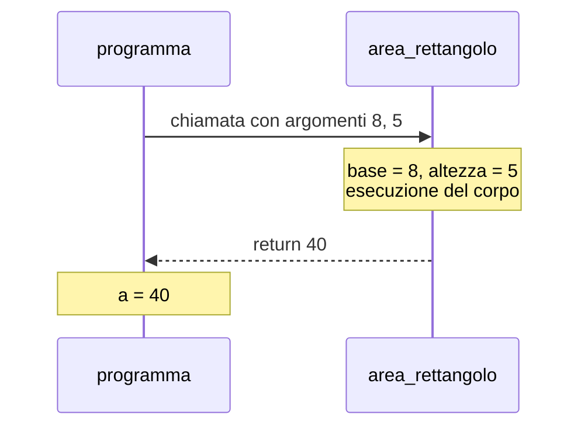
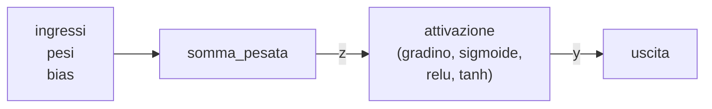
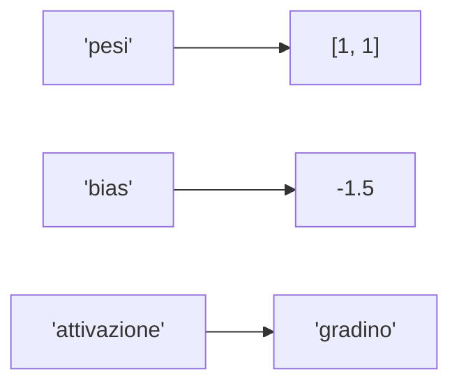
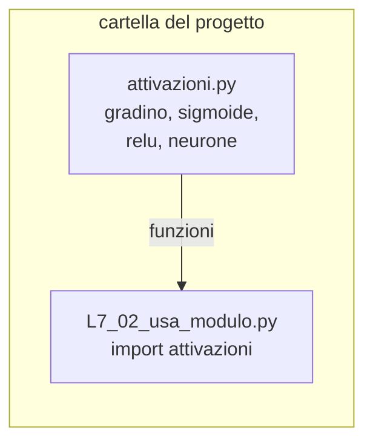
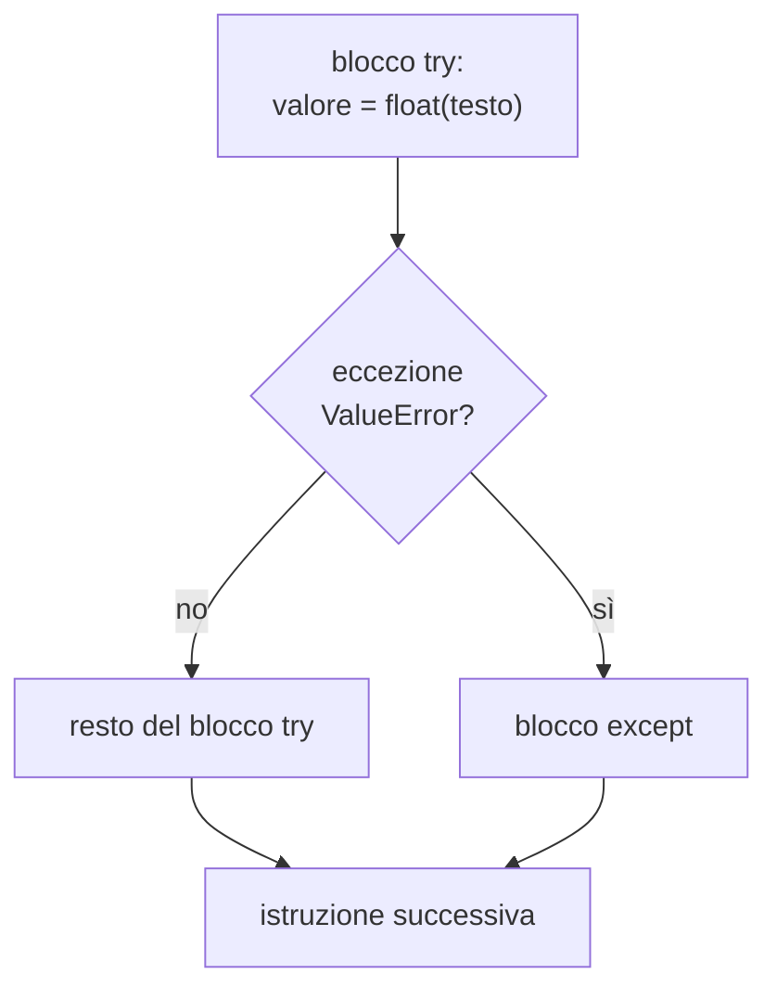
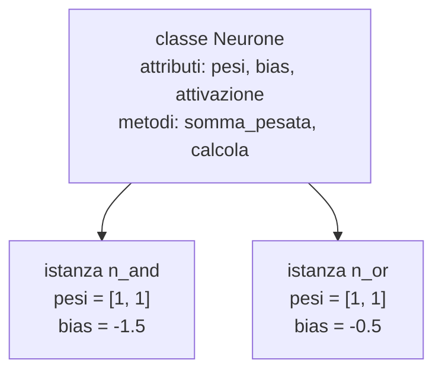
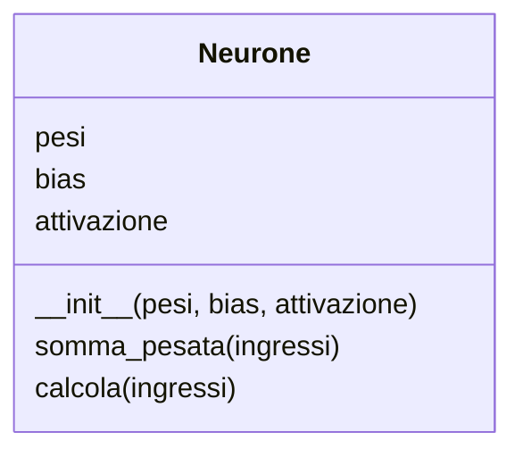
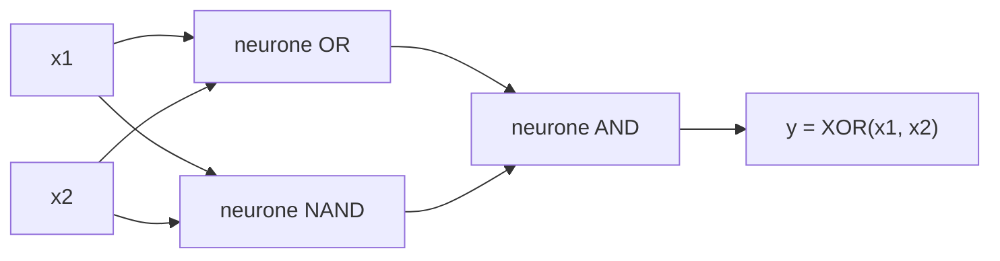

# Lezione L6 - Funzioni

## Obiettivi della lezione

- definire funzioni con parametri e valore di ritorno
- distinguere `return` e `print`
- distinguere variabili locali e globali
- usare parametri con valore predefinito e argomenti con nome
- implementare le principali funzioni di attivazione: gradino, sigmoide, ReLU, tangente iperbolica
- passare una funzione come argomento di un'altra funzione
- scrivere il neurone artificiale come funzione

## Definire una funzione

Una funzione è un gruppo di istruzioni con un nome, che si può eseguire (chiamare) più volte da punti diversi del programma. Finora sono state usate funzioni già esistenti (`print`, `len`, `math.exp`); ora se ne definiscono di nuove.

```python
def area_rettangolo(base, altezza):
    """Restituisce l'area di un rettangolo."""
    return base * altezza


a = area_rettangolo(8, 5)
print("Area:", a)                                   # Area: 40
print(area_rettangolo(2.5, 4))                      # 10.0
```

Elementi della definizione:

- `def`: parola chiave che introduce la definizione
- `area_rettangolo`: nome della funzione; valgono le stesse regole dei nomi di variabile
- `(base, altezza)`: parametri, cioè nomi che, a ogni chiamata, ricevono i valori passati
- `:` e blocco rientrato: il corpo della funzione
- `"""..."""`: stringa di documentazione (docstring), facoltativa; descrive che cosa fa la funzione. Le virgolette triple permettono di scrivere testo su più righe. Thonny e gli altri IDE la mostrano quando si usa la funzione
- `return`: termina la funzione e restituisce il valore indicato a chi l'ha chiamata

La definizione non esegue il corpo: crea soltanto la funzione. Il corpo viene eseguito a ogni chiamata, `area_rettangolo(8, 5)`, in cui i valori tra parentesi (argomenti) vengono assegnati ai parametri nell'ordine: `base` riceve 8, `altezza` riceve 5.

Diagramma: esecuzione di una chiamata



Vantaggi delle funzioni:

- il codice si scrive una volta e si usa molte volte
- un problema complesso si scompone in parti più semplici, ciascuna con un nome che ne descrive lo scopo
- una funzione si può verificare separatamente dal resto del programma

L'istruzione `pass` non fa nulla. Si usa come segnaposto dove la sintassi richiede un blocco ma il codice non è ancora stato scritto: negli esercizi del laboratorio le funzioni da completare contengono `pass`.

## return e print

`return` e `print` sono spesso confusi.

- `print` mostra un valore sullo schermo; il programma non può riutilizzarlo
- `return` restituisce un valore al punto della chiamata, dove si può assegnare a una variabile, usare in un'espressione, passare a un'altra funzione

```python
def doppio_con_return(x):
    return 2 * x


def doppio_con_print(x):
    print(2 * x)


r1 = doppio_con_return(7)    # r1 vale 14
r2 = doppio_con_print(7)     # stampa 14, ma r2 vale None
```

Una funzione che termina senza `return` restituisce `None`. Regola pratica: le funzioni che calcolano qualcosa usano `return`; la stampa si fa nel programma che le chiama.

## Parametri: valori predefiniti e argomenti con nome

Un parametro può avere un valore predefinito, usato quando l'argomento corrispondente non viene passato:

```python
def saluta(nome, saluto="Ciao"):
    return f"{saluto}, {nome}!"


saluta("Ada")                              # 'Ciao, Ada!'
saluta("Alan", "Buongiorno")               # 'Buongiorno, Alan!'
saluta(saluto="Salve", nome="Grace")       # 'Salve, Grace!'
```

Nell'ultima chiamata gli argomenti sono passati con il nome del parametro (argomenti con nome, in inglese keyword arguments): l'ordine non conta e la chiamata è più leggibile. Le librerie di machine learning usano molto questa forma, per esempio `MLPClassifier(hidden_layer_sizes=(4,), max_iter=500)` nella lezione L17.

## Variabili locali e globali

- Variabile locale
  variabile creata all'interno di una funzione (compresi i parametri). Esiste solo durante l'esecuzione della chiamata e non è visibile dall'esterno.
- Variabile globale
  variabile creata fuori da qualsiasi funzione, nel programma principale. È leggibile anche all'interno delle funzioni.

```python
def calcola_media(valori):
    somma = 0              # locale
    for v in valori:
        somma = somma + v
    return somma / len(valori)


print(calcola_media([6, 7, 8]))    # 7.0
print(somma)                        # NameError: somma non esiste fuori dalla funzione
```

Ogni chiamata ha il proprio spazio di variabili locali, creato all'inizio della chiamata e cancellato alla fine. Due funzioni diverse possono usare lo stesso nome locale senza interferire.

Regola pratica: una funzione riceve i dati attraverso i parametri e restituisce i risultati con `return`, senza leggere o modificare variabili globali. Così il suo comportamento dipende solo dagli argomenti ed è facile da verificare.

Il debugger di Thonny mostra le variabili locali in un riquadro separato. Nell'immagine l'esecuzione è all'interno della funzione `neurone`: il pannello Variabili a destra contiene solo i nomi globali (`math`, `neurone`, `sigmoide`), il riquadro Variabili locali contiene i parametri e le variabili della chiamata in corso.

{width=100%}

## Funzioni di attivazione

Nel neurone della lezione L5 l'uscita si otteneva confrontando la somma pesata con zero (dopo l'introduzione del bias): 1 se $z \geq 0$, altrimenti 0. Questa regola è una funzione di $z$, chiamata funzione di attivazione. Le reti neurali usano diverse funzioni di attivazione.

- Gradino
  $g(z) = 1$ se $z \geq 0$, altrimenti 0. È la funzione del neurone a soglia. Ha solo due valori possibili.
- Sigmoide
  $\sigma(z) = \frac{1}{1 + e^{-z}}$. Valori compresi tra 0 e 1, con passaggio graduale; vale 0.5 in $z = 0$. Si interpreta spesso come probabilità.
- ReLU (Rectified Linear Unit)
  $\text{ReLU}(z) = z$ se $z > 0$, altrimenti 0. Molto semplice da calcolare; è la funzione di attivazione più usata negli strati interni delle reti profonde.
- Tangente iperbolica
  $\tanh(z)$, disponibile come `math.tanh`. Valori compresi tra -1 e 1, forma simile alla sigmoide.

Grafici delle quattro funzioni:

{width=95%}

Perché servono attivazioni diverse dal gradino: il gradino è piatto ovunque tranne che in 0, quindi una piccola variazione dei pesi quasi sempre non cambia l'uscita. Gli algoritmi di apprendimento delle reti neurali (lezioni L15 e L16) modificano i pesi di piccole quantità osservando come cambia l'uscita; per questo richiedono funzioni che variano gradualmente, come sigmoide, tangente iperbolica e ReLU.

Implementazione:

```python
import math


def gradino(z):
    if z >= 0:
        return 1
    return 0


def sigmoide(z):
    return 1 / (1 + math.exp(-z))


def relu(z):
    if z > 0:
        return z
    return 0


def tangente_iperbolica(z):
    return math.tanh(z)
```

In `gradino` e `relu` il secondo `return` non è preceduto da `else`: se la condizione è vera, il primo `return` termina la funzione e le righe successive non vengono eseguite.

## Funzioni come valori

In Python una funzione è un valore, come un numero o una stringa: si può assegnare a una variabile, inserire in una lista, passare come argomento. Il nome della funzione senza parentesi indica la funzione stessa; con le parentesi indica la chiamata.

```python
f = sigmoide          # f è la funzione sigmoide (nessuna chiamata)
print(f(0))           # 0.5: chiamata di f
print(f.__name__)     # 'sigmoide': nome della funzione
```

`__name__` (con due trattini bassi prima e dopo) è un attributo che ogni funzione possiede e che contiene il suo nome.

Questa possibilità permette di scrivere un neurone in cui la funzione di attivazione è un parametro:

```python
def somma_pesata(ingressi, pesi, bias):
    z = bias
    for x, w in zip(ingressi, pesi):
        z = z + x * w
    return z


def neurone(ingressi, pesi, bias, attivazione):
    z = somma_pesata(ingressi, pesi, bias)
    return attivazione(z)


print(neurone([1, 0], [0.8, -0.4], -0.3, gradino))     # 1
print(neurone([1, 0], [0.8, -0.4], -0.3, sigmoide))    # 0.622...
```

Diagramma: il neurone come composizione di due funzioni



La funzione `neurone` usa `somma_pesata`: una funzione può chiamarne altre. Il neurone AND della lezione L4 si ottiene con `neurone([x1, x2], [1, 1], -1.5, gradino)`: il bias -1.5 corrisponde alla soglia 1.5.

## Laboratorio L6

Durata indicativa: 30 minuti. Ambiente: Thonny.

File:

- `L6_01_esempi.py`, `L6_02_attivazioni.py`: esempi della lezione; `L6_02_attivazioni.py` stampa la tabella dei valori delle quattro funzioni di attivazione
- `L6_04_debug_funzione.py`: da eseguire con il debugger (`Ctrl+F5`, poi `F7`) per osservare le variabili locali durante una chiamata
- `L6_03_esercizi.py`: esercizi; al posto di `pass` va scritto il corpo della funzione. In fondo al file i controlli stampano "corretto" o "da rivedere" per ogni esercizio

Esercizi:

1. (base) `perimetro_rettangolo(base, altezza)`
2. (base) `sigmoide(z)`
3. (base) `relu(z)`
4. (standard) `somma_pesata(ingressi, pesi, bias)`
5. (standard) `neurone(ingressi, pesi, bias, attivazione)`, usando `somma_pesata`
6. (approfondimento) `applica(f, valori)`: restituisce la lista dei risultati di `f` applicata a ogni valore
7. (approfondimento) `derivata_sigmoide(z)`, pari a $\sigma(z)\,(1 - \sigma(z))$; servirà nella lezione L15

# Lezione L7 - Tuple, dizionari, comprehension, moduli, errori

## Obiettivi della lezione

- usare tuple e spacchettamento; restituire più valori da una funzione
- usare dizionari per associare chiavi e valori
- costruire liste con le list comprehension
- importare moduli in forme diverse e scrivere un proprio modulo
- distinguere errori di sintassi, errori di esecuzione ed errori logici
- gestire le eccezioni con `try` ed `except`
- applicare una procedura di ricerca degli errori (debug)

## Tuple

Una tupla è una sequenza ordinata come la lista, ma non modificabile (immutabile). Si scrive con le parentesi tonde.

```python
punto = (3, 4)
print(punto[0])        # 3
punto[0] = 5           # TypeError: le tuple non si modificano
```

Spacchettamento: gli elementi di una tupla si assegnano a più variabili in una sola istruzione.

```python
x, y = punto           # x vale 3, y vale 4
```

Lo spacchettamento è già stato usato nei cicli `for i, t in enumerate(...)` e `for x, w in zip(...)`: a ogni ripetizione `enumerate` e `zip` producono una tupla.

Una funzione restituisce più valori sotto forma di tupla:

```python
def minimo_massimo(valori):
    return min(valori), max(valori)


mn, mx = minimo_massimo([7, 2, 9, 4])     # mn vale 2, mx vale 9
```

Le tuple si usano per gruppi di valori che vanno insieme e non devono cambiare: coordinate, dimensioni. In NumPy (modulo 3) la forma di un array è una tupla, per esempio `(3, 2)` per una matrice di 3 righe e 2 colonne.

## Dizionari

Un dizionario associa chiavi a valori. Si scrive tra parentesi graffe, con coppie `chiave: valore` separate da virgole. Si accede a un valore tramite la sua chiave, non tramite una posizione.

```python
neurone_and = {"pesi": [1, 1], "bias": -1.5, "attivazione": "gradino"}
```

Diagramma: struttura del dizionario



Operazioni principali:

| Operazione | Esempio | Effetto |
|---|---|---|
| lettura | `neurone_and["bias"]` | `-1.5`; `KeyError` se la chiave non esiste |
| lettura con valore predefinito | `neurone_and.get("soglia", 0)` | `0` se la chiave non esiste |
| modifica | `neurone_and["bias"] = -1.2` | sostituisce il valore |
| aggiunta | `neurone_and["nome"] = "AND"` | aggiunge una nuova coppia |
| verifica | `"pesi" in neurone_and` | `True` |
| numero di coppie | `len(neurone_and)` | `4` dopo l'aggiunta |
| scorrere le coppie | `for chiave, valore in neurone_and.items():` | chiave e valore a ogni ripetizione |

Le chiavi sono di solito stringhe o numeri e sono uniche; i valori possono essere di qualsiasi tipo, anche liste o altri dizionari.

Uso tipico: contare le occorrenze. Esempio, frequenza delle parole di un testo:

```python
testo = "il gatto e il cane e il topo"
conteggi = {}
for parola in testo.split():
    if parola in conteggi:
        conteggi[parola] = conteggi[parola] + 1
    else:
        conteggi[parola] = 1
print(conteggi)       # {'il': 3, 'gatto': 1, 'e': 2, 'cane': 1, 'topo': 1}
```

`testo.split()` è un metodo delle stringhe che restituisce la lista delle parole separate da spazi. `testo.lower()` restituisce il testo in minuscolo. Contare le parole è il primo passo di molti sistemi di elaborazione del linguaggio naturale.

## List comprehension

Una list comprehension costruisce una lista in una sola espressione, partendo da una sequenza.

```python
quadrati = [n ** 2 for n in range(6)]          # [0, 1, 4, 9, 16, 25]
pari = [n for n in range(10) if n % 2 == 0]    # [0, 2, 4, 6, 8]
```

Si legge: "la lista di `n ** 2` per ogni `n` in `range(6)`". La parte `if` facoltativa filtra gli elementi. È equivalente a:

```python
quadrati = []
for n in range(6):
    quadrati.append(n ** 2)
```

La forma compatta è comoda per trasformazioni semplici; per calcoli complessi il ciclo esplicito resta più leggibile.

## Moduli

Tre forme di importazione:

| Forma | Uso successivo | Quando |
|---|---|---|
| `import math` | `math.sqrt(2)` | forma standard: è chiaro da dove viene ogni nome |
| `from math import sqrt` | `sqrt(2)` | pochi nomi usati spesso |
| `import random as rnd` | `rnd.randint(1, 6)` | nome del modulo lungo; alias convenzionali |

Gli alias convenzionali sono diffusi nelle librerie scientifiche: `import numpy as np`, `import matplotlib.pyplot as plt`. Si incontreranno nel modulo 3.

### Un proprio modulo

Qualsiasi file `.py` è un modulo e può essere importato da un altro file nella stessa cartella, usando il nome del file senza estensione. Il file `attivazioni.py` contiene le funzioni di attivazione e il neurone; il file `L7_02_usa_modulo.py` le usa:

```python
import attivazioni
from attivazioni import neurone, gradino

print(attivazioni.sigmoide(0))
print(neurone([1, 0], [1, 1], -0.5, gradino))
```

Diagramma: importazione di un modulo



Suddividere il codice in moduli permette di riusare le stesse funzioni in programmi diversi. Le librerie come NumPy sono, in sostanza, grandi raccolte di moduli.

## Tre tipi di errore

- Errori di sintassi
  il testo non rispetta le regole del linguaggio. Python li rileva prima di eseguire il programma, che quindi non parte (`SyntaxError`, `IndentationError`).
- Errori di esecuzione (eccezioni)
  il programma è scritto correttamente ma durante l'esecuzione si verifica una situazione impossibile: divisione per zero, indice inesistente, conversione di un testo non numerico. Il programma si interrompe con un traceback.
- Errori logici
  il programma viene eseguito senza messaggi di errore ma produce risultati sbagliati. Sono i più difficili da trovare, perché Python non li segnala.

Eccezioni frequenti:

| Eccezione | Causa | Esempio |
|---|---|---|
| `ValueError` | valore del tipo giusto ma non valido | `float("dodici")` |
| `TypeError` | operazione non valida per il tipo | `"a" + 1` |
| `IndexError` | indice fuori dalla sequenza | `[1, 2, 3][3]` |
| `KeyError` | chiave assente in un dizionario | `{"a": 1}["b"]` |
| `ZeroDivisionError` | divisione per zero | `5 / 0` |
| `NameError` | nome non definito | variabile scritta in modo diverso |
| `AttributeError` | attributo o metodo inesistente | `[1, 2].add(3)` |

## Gestire le eccezioni: try ed except

Alcune eccezioni dipendono da dati esterni, per esempio da ciò che scrive l'utente, e non si possono evitare scrivendo meglio il codice. Si possono però gestire: `try` ed `except` permettono di intercettare l'eccezione e reagire, invece di interrompere il programma.

```python
for testo in ["12", "3.5", "dodici"]:
    try:
        valore = float(testo)
        print(testo, "->", valore)
    except ValueError:
        print(testo, "-> non è un numero")
```

Esecuzione:

1. si eseguono le istruzioni del blocco `try`
2. se non si verificano eccezioni, il blocco `except` viene saltato
3. se si verifica un'eccezione del tipo indicato (`ValueError`), il resto del blocco `try` viene saltato e si esegue il blocco `except`; poi il programma prosegue normalmente

Diagramma: flusso di try ed except



Uso tipico: leggere un numero dall'utente finché non ne scrive uno valido.

```python
while True:
    try:
        n = int(input("Numero intero: "))
        break
    except ValueError:
        print("Valore non valido, riprovare.")
```

`while True` ripete il ciclo all'infinito; `break` lo interrompe quando la conversione riesce.

Indicare sempre il tipo di eccezione atteso (`except ValueError`). Un `except` senza tipo intercetta qualsiasi errore, compresi gli errori di programmazione, e li nasconde.

## Procedura di debug

1. Riprodurre l'errore: individuare i dati o le azioni che lo provocano.
2. Se c'è un traceback, leggere l'ultima riga (tipo e descrizione) e la riga indicata.
3. Se il risultato è sbagliato senza messaggi (errore logico), stabilire che cosa ci si aspetta a ogni passo e confrontarlo con ciò che succede, con il debugger (`F7`) o con `print` temporanei dei valori intermedi.
4. Formulare un'ipotesi sulla causa, modificare una sola cosa, rieseguire.
5. Dopo la correzione, verificare anche i casi che prima funzionavano.

Esempio di errore logico, presente nel file di laboratorio:

```python
def media(valori):
    somma = 0
    for v in valori:
        somma = somma + v
        return somma / len(valori)     # return dentro il ciclo
```

La funzione restituisce un risultato alla prima ripetizione del ciclo: `media([6, 7, 8])` vale 2.0 invece di 7.0. Nessun messaggio di errore; l'indentazione di una sola riga cambia il significato del programma. Il debugger mostra che il ciclo viene eseguito una sola volta.

## Laboratorio L7

Durata indicativa: 30 minuti. Ambiente: Thonny.

File:

- `L7_01_esempi.py`: esempi della lezione
- `attivazioni.py` e `L7_02_usa_modulo.py`: modulo e programma che lo importa (devono stare nella stessa cartella)
- `L7_03_trova_errori.py`: programma con quattro errori (uno di sintassi, due di esecuzione, uno logico); i risultati attesi sono scritti in testa al file
- `L7_04_esercizi.py`: esercizi con controlli automatici

Esercizi:

1. (base) trovare e correggere i quattro errori di `L7_03_trova_errori.py`; per ciascuno annotare in un commento il tipo di errore
2. `L7_04_esercizi.py`:
   - Esercizio 1 (base): `quadrati(n)` con una list comprehension
   - Esercizio 2 (base): `positivi(valori)` con una list comprehension con `if`
   - Esercizio 3 (standard): `conta_parole(testo)`, con un dizionario
   - Esercizio 4 (standard): `leggi_numero(testo)`, che restituisce `None` se il testo non è un numero, con `try`/`except`
   - Esercizio 5 (standard): `statistiche(valori)`, che restituisce la tupla (minimo, massimo, media)
   - Esercizio 6 (approfondimento): `neurone_da_dizionario(ingressi, parametri)`, con pesi e bias contenuti in un dizionario
3. (approfondimento) aggiungere a `attivazioni.py` la funzione `tangente_iperbolica` e usarla da `L7_02_usa_modulo.py`

# Lezione L8 - Classi e oggetti

## Obiettivi della lezione

- distinguere classe, istanza, attributo e metodo
- definire una classe con `__init__` e metodi
- creare più oggetti della stessa classe e modificarne lo stato
- scrivere la classe `Neurone`
- riconoscere perché le librerie di deep learning rappresentano modelli e strati come oggetti

## Oggetti e classi

Finora dati e funzioni sono stati separati: i pesi e il bias in variabili o in un dizionario, il calcolo in una funzione a cui passarli ogni volta. Un oggetto riunisce in un'unica entità i dati e le operazioni che li riguardano.

- Classe
  modello che descrive un tipo di oggetto: quali dati contiene e quali operazioni permette. Esempio: la classe `Neurone`.
- Istanza (oggetto)
  un singolo oggetto costruito a partire da una classe, con i propri valori. Esempio: il neurone AND e il neurone OR sono due istanze della classe `Neurone`.
- Attributo
  dato associato a un oggetto. Esempio: `pesi`, `bias`.
- Metodo
  funzione associata a una classe, che opera sui dati dell'oggetto. Esempio: `calcola(ingressi)`.

In Python tutti i valori sono oggetti. Una lista è un'istanza della classe `list`, e `append` è un suo metodo: `temperature.append(22.7)` chiama il metodo `append` dell'oggetto `temperature`.

Diagramma: una classe, più istanze



## Definire una classe

```python
class Rettangolo:
    """Un rettangolo definito da base e altezza."""

    def __init__(self, base, altezza):
        self.base = base
        self.altezza = altezza

    def area(self):
        return self.base * self.altezza

    def perimetro(self):
        return 2 * (self.base + self.altezza)

    def scala(self, fattore):
        self.base = self.base * fattore
        self.altezza = self.altezza * fattore
```

Elementi:

- `class Rettangolo:` introduce la definizione. Per convenzione i nomi delle classi iniziano con la maiuscola
- i metodi si definiscono con `def` all'interno del blocco della classe
- `__init__` è il metodo di inizializzazione (costruttore): viene eseguito automaticamente alla creazione di ogni istanza e assegna i valori iniziali degli attributi. Il nome ha due trattini bassi prima e dopo
- `self` è il primo parametro di ogni metodo e indica l'oggetto su cui il metodo sta lavorando. `self.base = base` crea l'attributo `base` dell'oggetto e gli assegna il valore del parametro `base`: sono due nomi diversi, uno legato all'oggetto, l'altro locale al metodo

Creazione e uso delle istanze:

```python
r1 = Rettangolo(8, 5)      # chiama __init__ con base = 8, altezza = 5
r2 = Rettangolo(2, 3)

print(r1.base, r1.area())  # 8 40
print(r2.area())           # 6

r1.scala(2)                # modifica lo stato di r1
print(r1.base, r1.area())  # 16 160
print(r2.base)             # 2: r2 non cambia
```

- `Rettangolo(8, 5)`: il nome della classe usato come una funzione crea una nuova istanza
- `r1.area()`: chiamata di un metodo. Python passa automaticamente `r1` come `self`: nella chiamata `self` non si scrive
- `r1.base`: accesso a un attributo, in lettura o in scrittura

Ogni istanza ha i propri attributi: modificare `r1` non modifica `r2`. L'insieme dei valori degli attributi di un oggetto in un certo momento si chiama stato dell'oggetto. I metodi come `scala` modificano lo stato.

## La classe Neurone

```python
class Neurone:
    """Neurone artificiale con pesi, bias e funzione di attivazione."""

    def __init__(self, pesi, bias, attivazione):
        self.pesi = pesi
        self.bias = bias
        self.attivazione = attivazione

    def somma_pesata(self, ingressi):
        z = self.bias
        for x, w in zip(ingressi, self.pesi):
            z = z + x * w
        return z

    def calcola(self, ingressi):
        return self.attivazione(self.somma_pesata(ingressi))
```

Diagramma: struttura della classe



Uso:

```python
n_and = Neurone([1, 1], -1.5, gradino)
n_or = Neurone([1, 1], -0.5, gradino)

print(n_and.calcola([1, 1]), n_or.calcola([0, 1]))     # 1 1

n_and.bias = -0.5          # modificando un parametro il neurone cambia comportamento
```

Differenze rispetto alla funzione `neurone(ingressi, pesi, bias, attivazione)` della lezione L6:

- i parametri vengono indicati una sola volta, alla creazione; ogni calcolo richiede solo gli ingressi
- ogni neurone conserva i propri parametri: se ne possono creare molti, ciascuno indipendente
- l'addestramento (lezione L14) consisterà nel modificare gli attributi `pesi` e `bias` dell'oggetto

Nel metodo `calcola` si chiama un altro metodo dello stesso oggetto: `self.somma_pesata(ingressi)`.

## Perché gli oggetti nelle librerie di IA

Nelle librerie di deep learning i modelli sono oggetti. Esempi (codice mostrato solo per confronto, trattato nella lezione L17):

```python
# Keras: uno strato di 4 neuroni con attivazione ReLU
strato = keras.layers.Dense(4, activation="relu")

# PyTorch: uno strato con 3 ingressi e 4 uscite
strato = torch.nn.Linear(3, 4)

# scikit-learn: una rete da addestrare
modello = MLPClassifier(hidden_layer_sizes=(4,))
modello.fit(X, y)              # addestramento: modifica lo stato dell'oggetto
modello.predict(X_nuovi)       # uso
```

La struttura è quella della classe `Neurone`: un oggetto contiene i parametri (pesi, bias) e i metodi per calcolare l'uscita e per addestrarsi. Riconoscere questa struttura rende leggibile il codice delle librerie.

## Dal neurone allo strato

Più neuroni che ricevono gli stessi ingressi formano uno strato. Uno strato si può rappresentare con una classe che contiene una lista di neuroni:

```python
class Strato:
    def __init__(self, neuroni):
        self.neuroni = neuroni

    def calcola(self, ingressi):
        return [n.calcola(ingressi) for n in self.neuroni]
```

Collegando le uscite di uno strato agli ingressi di un altro neurone si ottiene una rete a più livelli. L'esercizio di approfondimento del laboratorio usa questa idea per calcolare XOR, che un singolo neurone non può calcolare: XOR$(x_1, x_2)$ = AND(OR$(x_1, x_2)$, NAND$(x_1, x_2)$).

Diagramma: rete a due livelli per XOR



In questa rete i pesi sono scelti a mano. Nel modulo 4 la stessa struttura, con attivazioni graduali, imparerà i pesi da sola.

## Laboratorio L8

Durata indicativa: 25 minuti. Ambiente: Thonny.

File:

- `L8_01_esempi.py`: classi `Rettangolo` e `Contatore`
- `L8_02_neurone.py`: classe `Neurone`, neuroni AND e OR, neurone con attivazione sigmoide
- `L8_03_esercizi.py`: esercizi con controlli automatici

I controlli in fondo al file usano costrutti non trattati nel corso (`lambda`, `except Exception`), che servono a proseguire con i controlli anche quando un esercizio contiene un errore; non vanno modificati.

Esercizi:

1. (base) classe `Cerchio` con i metodi `area` e `circonferenza`
2. (standard) classe `Studente` con una lista di voti, i metodi `aggiungi_voto` e `media`
3. (standard) completare il metodo `calcola` della classe `Neurone`
4. (standard) creare le istanze `n_nand` e `n_maggioranza` (tre ingressi)
5. (approfondimento) classe `Strato`
6. (approfondimento) rete a due livelli per XOR

La verifica del modulo 2 (file `verifica_modulo2.py`, distribuito dal docente) si svolge individualmente, in un momento stabilito dal docente.
