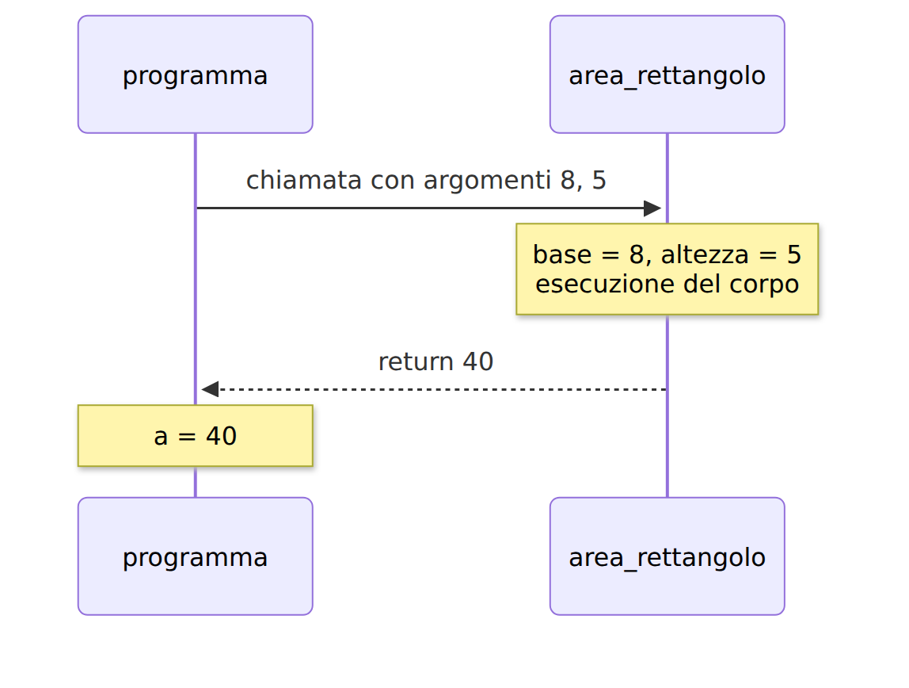
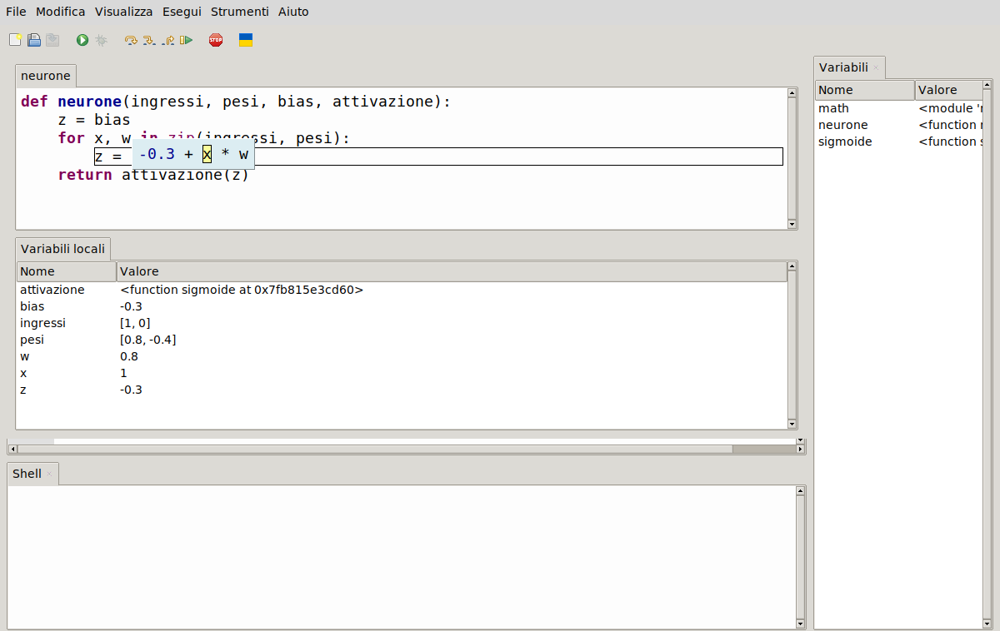
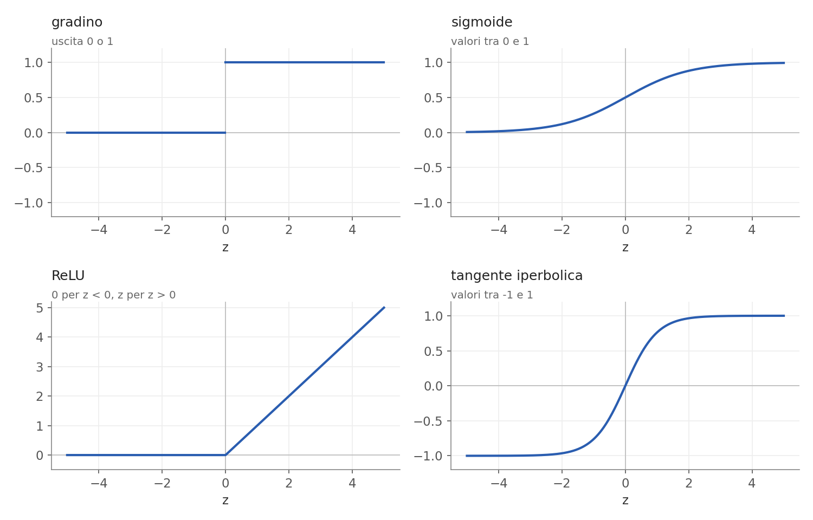
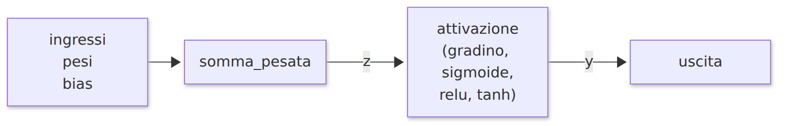
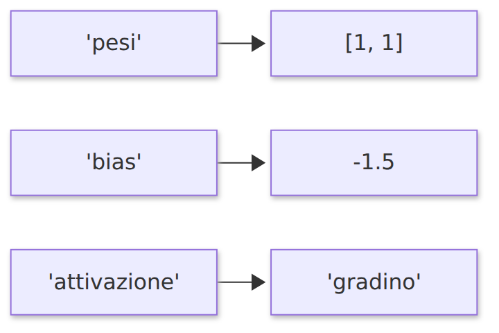
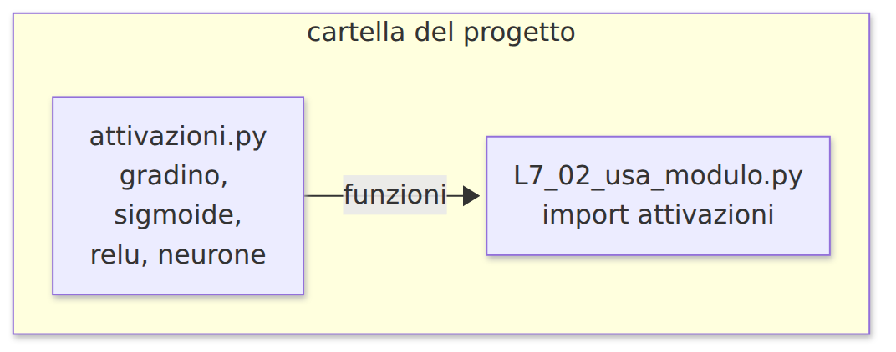
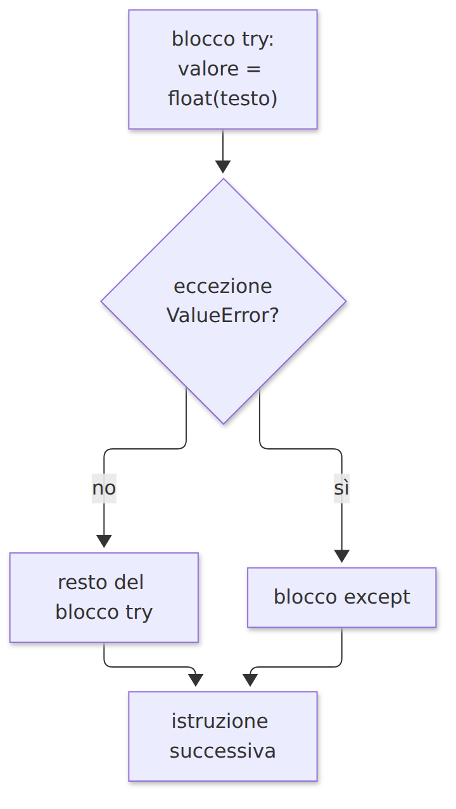
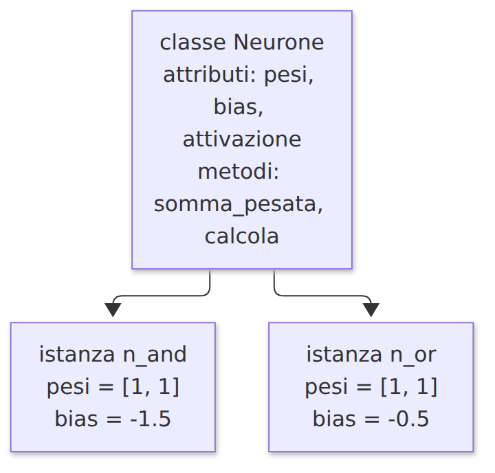
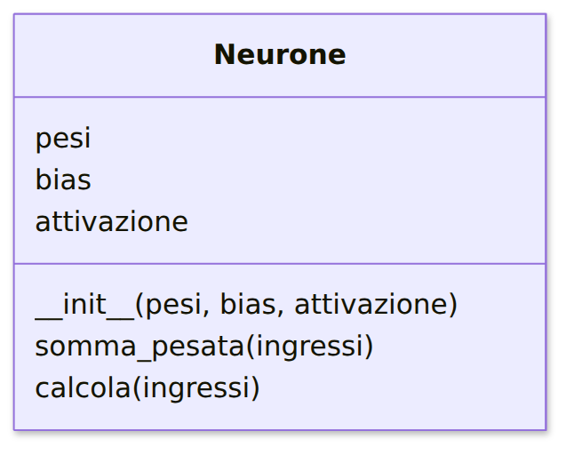
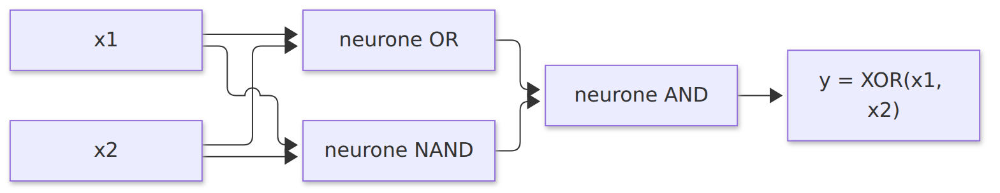

# L6 - Funzioni

## Definire una funzione

```python
def area_rettangolo(base, altezza):
    """Restituisce l'area di un rettangolo."""
    return base * altezza

a = area_rettangolo(8, 5)     # 40
```

- `def`, nome, **parametri** tra parentesi, `:` e blocco rientrato
- docstring `"""..."""`: descrizione facoltativa
- `return`: termina e restituisce il valore
- chiamata: gli **argomenti** vengono assegnati ai parametri
- `pass`: segnaposto per un blocco vuoto

## Esecuzione di una chiamata

{width=63%}

## return e print

```python
def doppio_con_return(x):
    return 2 * x

def doppio_con_print(x):
    print(2 * x)

r1 = doppio_con_return(7)    # r1 vale 14
r2 = doppio_con_print(7)     # stampa 14, r2 vale None
```

- `print` mostra; `return` restituisce un valore riutilizzabile
- senza `return` la funzione restituisce `None`

## Valori predefiniti e argomenti con nome

```python
def saluta(nome, saluto="Ciao"):
    return f"{saluto}, {nome}!"

saluta("Ada")                              # 'Ciao, Ada!'
saluta("Alan", "Buongiorno")               # 'Buongiorno, Alan!'
saluta(saluto="Salve", nome="Grace")       # 'Salve, Grace!'
```

Nelle librerie di IA: `MLPClassifier(hidden_layer_sizes=(4,), max_iter=500)`

## Variabili locali e globali

```python
def calcola_media(valori):
    somma = 0              # locale
    for v in valori:
        somma = somma + v
    return somma / len(valori)

print(calcola_media([6, 7, 8]))    # 7.0
print(somma)                        # NameError
```

- **locale**: creata nella funzione, esiste solo durante la chiamata
- **globale**: creata fuori dalle funzioni
- dati in ingresso con i parametri, risultati con `return`

## Il debugger: variabili locali

{width=75%}

## Funzioni di attivazione

{width=75%}

## Le quattro attivazioni

| Funzione | Formula | Valori |
|---|---|---|
| gradino | 1 se $z \geq 0$, altrimenti 0 | 0, 1 |
| sigmoide | $\frac{1}{1 + e^{-z}}$ | (0, 1) |
| ReLU | $z$ se $z > 0$, altrimenti 0 | $[0, +\infty)$ |
| tanh | `math.tanh(z)` | (-1, 1) |

L'apprendimento modifica i pesi di poco e osserva l'effetto: servono funzioni graduali, non il gradino.

## Attivazioni in Python

```python
def gradino(z):
    if z >= 0:
        return 1
    return 0

def sigmoide(z):
    return 1 / (1 + math.exp(-z))

def relu(z):
    if z > 0:
        return z
    return 0
```

## Funzioni come valori

```python
f = sigmoide          # la funzione, senza chiamarla
f(0)                  # 0.5
f.__name__            # 'sigmoide'

def neurone(ingressi, pesi, bias, attivazione):
    z = somma_pesata(ingressi, pesi, bias)
    return attivazione(z)

neurone([1, 0], [0.8, -0.4], -0.3, gradino)     # 1
neurone([1, 0], [0.8, -0.4], -0.3, sigmoide)    # 0.622...
```

{width=72%}

## Laboratorio L6

`L6_03_esercizi.py`: sostituire `pass`; i controlli stampano "corretto" o "da rivedere"

1. (base) `perimetro_rettangolo`
2. (base) `sigmoide`
3. (base) `relu`
4. (standard) `somma_pesata(ingressi, pesi, bias)`
5. (standard) `neurone(ingressi, pesi, bias, attivazione)`
6. (approfondimento) `applica(f, valori)`
7. (approfondimento) `derivata_sigmoide(z)` = $\sigma(z)(1 - \sigma(z))$

Debugger: `L6_04_debug_funzione.py`

# L7 - Tuple, dizionari, comprehension, moduli, errori

## Tuple

```python
punto = (3, 4)
x, y = punto                  # spacchettamento
punto[0] = 5                  # TypeError: immutabile

def minimo_massimo(valori):
    return min(valori), max(valori)

mn, mx = minimo_massimo([7, 2, 9, 4])
```

In NumPy la forma di un array è una tupla: `(3, 2)`

## Dizionari

```python
neurone_and = {"pesi": [1, 1], "bias": -1.5, "attivazione": "gradino"}
```

{width=50%}

## Operazioni sui dizionari

| Operazione | Esempio |
|---|---|
| lettura | `d["bias"]` (`KeyError` se manca) |
| lettura con predefinito | `d.get("soglia", 0)` |
| modifica, aggiunta | `d["bias"] = -1.2`, `d["nome"] = "AND"` |
| verifica | `"pesi" in d` |
| scorrere | `for k, v in d.items():` |

## Contare le parole

```python
testo = "il gatto e il cane e il topo"
conteggi = {}
for parola in testo.split():
    if parola in conteggi:
        conteggi[parola] = conteggi[parola] + 1
    else:
        conteggi[parola] = 1
# {'il': 3, 'gatto': 1, 'e': 2, 'cane': 1, 'topo': 1}
```

`split()`: lista delle parole; `lower()`: testo in minuscolo

## List comprehension

```python
quadrati = [n ** 2 for n in range(6)]          # [0, 1, 4, 9, 16, 25]
pari = [n for n in range(10) if n % 2 == 0]    # [0, 2, 4, 6, 8]
```

Equivale a:

```python
quadrati = []
for n in range(6):
    quadrati.append(n ** 2)
```

## Moduli

| Forma | Uso |
|---|---|
| `import math` | `math.sqrt(2)` |
| `from math import sqrt` | `sqrt(2)` |
| `import random as rnd` | `rnd.randint(1, 6)` |

Alias convenzionali: `import numpy as np`, `import matplotlib.pyplot as plt`

{width=68%}

## Tre tipi di errore

- **sintassi**: il programma non parte (`SyntaxError`, `IndentationError`)
- **esecuzione** (eccezioni): il programma si interrompe con un traceback
- **logici**: nessun messaggio, risultato sbagliato

| Eccezione | Esempio |
|---|---|
| `ValueError` | `float("dodici")` |
| `IndexError` | `[1, 2, 3][3]` |
| `KeyError` | `{"a": 1}["b"]` |
| `ZeroDivisionError` | `5 / 0` |
| `AttributeError` | `[1, 2].add(3)` |

## try ed except

```python
for testo in ["12", "3.5", "dodici"]:
    try:
        valore = float(testo)
        print(testo, "->", valore)
    except ValueError:
        print(testo, "-> non è un numero")
```

{height=46%}

## Input robusto

```python
while True:
    try:
        n = int(input("Numero intero: "))
        break
    except ValueError:
        print("Valore non valido, riprovare.")
```

Indicare sempre il tipo di eccezione: un `except` generico nasconde gli errori di programmazione.

## Procedura di debug

1. riprodurre l'errore
2. traceback: ultima riga e riga indicata
3. errore logico: confrontare atteso e reale (debugger, `print` temporanei)
4. un'ipotesi, una modifica, rieseguire
5. verificare anche i casi che funzionavano

```python
def media(valori):
    somma = 0
    for v in valori:
        somma = somma + v
        return somma / len(valori)     # return dentro il ciclo: errore logico
```

## Laboratorio L7

1. (base) `L7_03_trova_errori.py`: quattro errori (sintassi, due di esecuzione, logico)
2. `L7_04_esercizi.py`:
   - (base) `quadrati(n)`, `positivi(valori)` con comprehension
   - (standard) `conta_parole(testo)`
   - (standard) `leggi_numero(testo)` con `try`/`except`
   - (standard) `statistiche(valori)`: tupla (minimo, massimo, media)
   - (approfondimento) `neurone_da_dizionario(ingressi, parametri)`
3. (approfondimento) aggiungere `tangente_iperbolica` al modulo `attivazioni.py`

# L8 - Classi e oggetti

## Classe, istanza, attributo, metodo

- **classe**: modello di un tipo di oggetto (`Neurone`)
- **istanza**: oggetto costruito dalla classe (`n_and`, `n_or`)
- **attributo**: dato dell'oggetto (`pesi`, `bias`)
- **metodo**: funzione della classe (`calcola`)

{height=42%}

## Definire una classe

```python
class Rettangolo:
    def __init__(self, base, altezza):
        self.base = base
        self.altezza = altezza

    def area(self):
        return self.base * self.altezza

    def scala(self, fattore):
        self.base = self.base * fattore
        self.altezza = self.altezza * fattore
```

- `__init__`: eseguito alla creazione, assegna gli attributi
- `self`: l'oggetto su cui lavora il metodo

## Istanze e stato

```python
r1 = Rettangolo(8, 5)
r2 = Rettangolo(2, 3)
r1.area()             # 40   (self non si scrive nella chiamata)
r1.scala(2)           # modifica lo stato di r1
r1.base               # 16
r2.base               # 2: r2 non cambia
```

Tutti i valori sono oggetti: `lista.append(x)` è un metodo della classe `list`

## La classe Neurone

```python
class Neurone:
    def __init__(self, pesi, bias, attivazione):
        self.pesi = pesi
        self.bias = bias
        self.attivazione = attivazione

    def somma_pesata(self, ingressi):
        z = self.bias
        for x, w in zip(ingressi, self.pesi):
            z = z + x * w
        return z

    def calcola(self, ingressi):
        return self.attivazione(self.somma_pesata(ingressi))
```

## Uso della classe Neurone

{width=38%}

```python
n_and = Neurone([1, 1], -1.5, gradino)
n_or = Neurone([1, 1], -0.5, gradino)
n_and.calcola([1, 1])       # 1
n_and.bias = -0.5           # ora si comporta come OR
```

## Oggetti nelle librerie di IA

```python
strato = keras.layers.Dense(4, activation="relu")     # Keras
strato = torch.nn.Linear(3, 4)                         # PyTorch

modello = MLPClassifier(hidden_layer_sizes=(4,))      # scikit-learn
modello.fit(X, y)             # addestramento: cambia lo stato
modello.predict(X_nuovi)      # uso
```

Parametri negli attributi, calcolo e addestramento nei metodi

## Dal neurone allo strato: XOR

```python
class Strato:
    def __init__(self, neuroni):
        self.neuroni = neuroni

    def calcola(self, ingressi):
        return [n.calcola(ingressi) for n in self.neuroni]
```

{width=81%}

## Laboratorio L8

`L8_03_esercizi.py`

1. (base) classe `Cerchio`
2. (standard) classe `Studente`: `aggiungi_voto`, `media`
3. (standard) metodo `calcola` di `Neurone`
4. (standard) istanze `n_nand` e `n_maggioranza`
5. (approfondimento) classe `Strato`
6. (approfondimento) rete a due livelli per XOR

Verifica del modulo 2: `verifica_modulo2.py`
