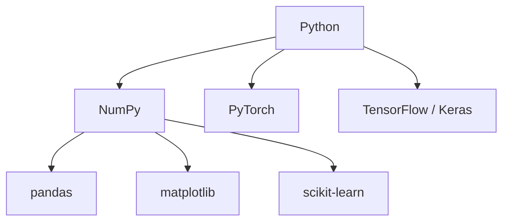
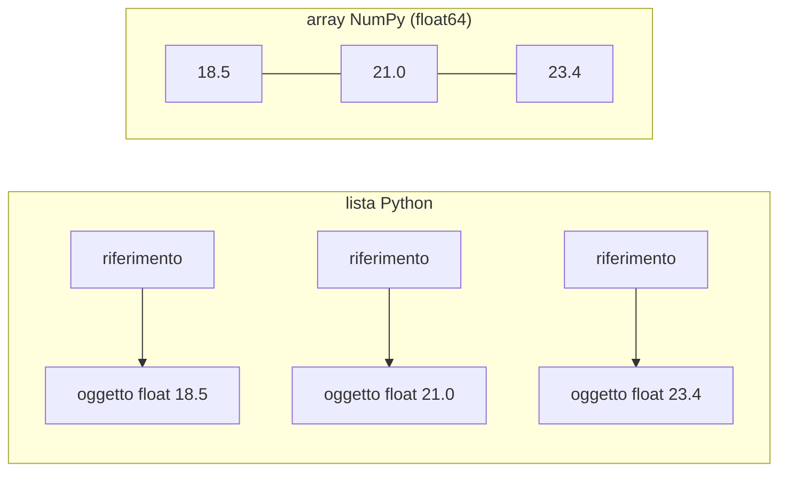
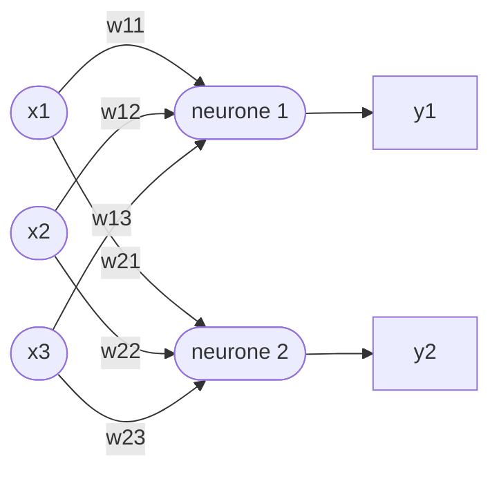
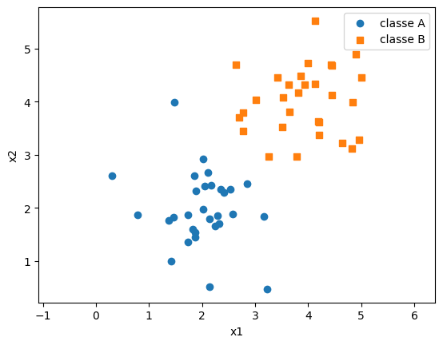

# Lezione L9 - Pacchetti e array NumPy

## Obiettivi della lezione

- distinguere modulo, pacchetto e libreria; conoscere il ruolo di PyPI e di `pip`
- conoscere le principali librerie Python per l'intelligenza artificiale e il loro ruolo
- spiegare perché si usa NumPy invece delle liste per il calcolo numerico
- creare array a una e due dimensioni e ispezionarne tipo e forma
- accedere a elementi, righe, colonne e sottomatrici

Da questa lezione il laboratorio si svolge con i notebook Jupyter (JupyterLite, WinPython o Colab), come descritto nella lezione L2.

## Moduli, pacchetti, librerie

- Modulo
  un file `.py` che contiene funzioni, classi e variabili (lezione L7).
- Pacchetto
  una cartella che raggruppa più moduli sotto un unico nome. Esempio: `numpy.random` e `numpy.linalg` sono moduli del pacchetto `numpy`.
- Libreria
  termine generico per un insieme di codice riutilizzabile, di solito distribuito come uno o più pacchetti.
- Libreria standard
  i moduli inclusi in ogni installazione di Python (`math`, `random`, ...).
- PyPI (Python Package Index)
  il repository pubblico dei pacchetti Python, con centinaia di migliaia di pacchetti: https://pypi.org/
- pip
  il programma che scarica e installa i pacchetti da PyPI.

### Installare un pacchetto

Da una finestra di terminale (nel caso di WinPython, `WinPython Command Prompt.exe`):

```text
pip install --user numpy
```

- `pip install numpy`: scarica da PyPI il pacchetto `numpy` e lo installa, insieme ai pacchetti da cui dipende
- `--user`: installa nella cartella dell'utente, senza privilegi di amministratore

In un notebook si usa il comando speciale `%pip install nomepacchetto`, che installa nell'ambiente del kernel in uso. Nel corso non è necessario: WinPython, JupyterLite e Colab contengono già le librerie usate.

Ambiente virtuale: una cartella con un'installazione di Python separata, con i propri pacchetti, creata per un singolo progetto. Permette di usare versioni diverse delle stesse librerie in progetti diversi senza conflitti. Nel corso non si usano ambienti virtuali; sono citati perché ricorrono in qualsiasi guida di installazione.

## L'ecosistema Python per l'intelligenza artificiale

| Libreria | Ruolo | Nel corso |
|---|---|---|
| NumPy | array multidimensionali e calcolo numerico; base di quasi tutte le altre | moduli 3 e 4 |
| matplotlib | grafici | L12 e modulo 4 |
| pandas | tabelle di dati (come un foglio di calcolo), lettura di file CSV ed Excel | corso B.6 |
| scikit-learn | algoritmi di machine learning classici, compresa una semplice rete neurale | L17 |
| PyTorch | deep learning, sviluppato inizialmente da Meta | L17, dimostrazione |
| TensorFlow e Keras | deep learning, sviluppati inizialmente da Google | L17, dimostrazione |

Diagramma: dipendenze tra le librerie



PyTorch e TensorFlow hanno propri tipi di array (tensori), molto simili agli array NumPy e convertibili da e verso NumPy. Chi conosce NumPy riconosce la maggior parte delle operazioni dei tensori.

Riferimento: NumPy, the absolute basics for beginners: https://numpy.org/doc/stable/user/absolute_beginners.html

## Perché NumPy

Le liste Python possono contenere valori di tipo diverso; ogni elemento è un oggetto separato in memoria e ogni operazione passa per l'interprete. Per milioni di numeri questo è lento.

Un array NumPy:

- contiene valori tutti dello stesso tipo, memorizzati uno dopo l'altro in un blocco continuo di memoria
- esegue le operazioni su tutti gli elementi con codice compilato (C), senza cicli Python
- rende il codice più corto: `a * 2` al posto di un ciclo

Diagramma: lista e array in memoria



In L10 si misura la differenza di velocità: per operazioni semplici l'array è decine di volte più veloce.

## Creare array

```python
import numpy as np

a = np.array([18.5, 21.0, 23.4, 19.8, 25.1])
print(a.dtype, a.shape, a.ndim, a.size)      # float64 (5,) 1 5
```

Attributi di un array:

| Attributo | Significato | Valore per `a` |
|---|---|---|
| `dtype` | tipo degli elementi | `float64` (virgola mobile a 64 bit) |
| `shape` | forma: numero di elementi per ogni dimensione, come tupla | `(5,)` |
| `ndim` | numero di dimensioni | `1` |
| `size` | numero totale di elementi | `5` |

`(5,)` è una tupla con un solo elemento: la virgola la distingue dal numero 5 tra parentesi.

Funzioni di creazione:

| Funzione | Risultato |
|---|---|
| `np.zeros(4)` | `[0. 0. 0. 0.]` |
| `np.ones((2, 3))` | matrice 2 x 3 di uni |
| `np.full(3, 7.5)` | `[7.5 7.5 7.5]` |
| `np.arange(0, 10, 2)` | `[0 2 4 6 8]`, come `range`, fine esclusa |
| `np.linspace(0, 1, 5)` | `[0. 0.25 0.5 0.75 1.]`, 5 valori equidistanti, estremi inclusi |

Per le forme a più dimensioni si passa una tupla: `np.zeros((3, 2))` (con doppie parentesi).

`arange` e `linspace` differiscono nel modo di indicare l'intervallo: con `arange` si indica il passo, con `linspace` il numero di valori. `linspace` è più adatto a disegnare grafici di funzioni (L12).

## Array a due dimensioni

Una matrice si crea da una lista di liste; ogni lista interna è una riga.

```python
m = np.array([[1, 2, 3],
              [4, 5, 6]])
print(m.shape)       # (2, 3): 2 righe, 3 colonne
```

`reshape` dispone gli stessi elementi in una forma diversa, purché il numero totale sia lo stesso:

```python
np.arange(12).reshape(3, 4)
# [[ 0  1  2  3]
#  [ 4  5  6  7]
#  [ 8  9 10 11]]
```

Nel machine learning i dati si organizzano quasi sempre in una matrice con una riga per ogni esempio e una colonna per ogni caratteristica misurata. Per esempio: 100 fiori descritti da 4 misure formano una matrice (100, 4).

## Indici e sottoarray

In una matrice riga e colonna si indicano tra le stesse parentesi quadre, separate da una virgola. I due punti `:` da soli significano "tutte".

```python
t = np.array([[10, 11, 12, 13],
              [20, 21, 22, 23],
              [30, 31, 32, 33]])
t[1, 2]        # 22: riga 1, colonna 2
t[0]           # [10 11 12 13]: riga 0
t[:, 1]        # [11 21 31]: colonna 1
t[0:2, 1:3]    # [[11 12] [21 22]]: righe 0-1, colonne 1-2
t[-1, -1]      # 33
```

Valgono le regole dello slicing delle liste: inizio incluso, fine esclusa, indici negativi dalla fine, passo facoltativo (`t[:, ::2]` sono le colonne di indice pari).

Assegnando un valore a un sottoarray si modificano tutti i suoi elementi: `t[0] = 0` azzera la prima riga.

## Laboratorio L9

Durata indicativa: 25 minuti. Notebook: `L9_array_numpy.ipynb`.

Il notebook contiene gli esempi della lezione, da eseguire in ordine, e gli esercizi. La prima cella di codice definisce la funzione `controlla`, usata dalle celle di controllo: va eseguita per prima.

1. (base) creare array con `arange`, `linspace`, `zeros`
2. (base) estrarre un elemento, una riga, una colonna
3. (standard) matrice 4 x 5 con `reshape` e una sua sottomatrice
4. (standard) matrice dei pesi di uno strato di 2 neuroni con 3 ingressi: estrarre i pesi di un neurone e i pesi applicati a un ingresso
5. (approfondimento) una scacchiera 8 x 8 con lo slicing con passo

# Lezione L10 - Calcolo vettoriale con NumPy

## Obiettivi della lezione

- eseguire operazioni elemento per elemento e applicare funzioni matematiche a interi array
- prevedere il risultato del broadcasting tra array di forme diverse
- calcolare somme, medie, massimi lungo un asse
- selezionare elementi con maschere booleane
- generare numeri casuali riproducibili
- confrontare la velocità di cicli e operazioni vettoriali

## Operazioni elemento per elemento

Gli operatori aritmetici tra due array della stessa forma agiscono su ogni coppia di elementi corrispondenti:

```python
a = np.array([1.0, 2.0, 3.0, 4.0])
b = np.array([10.0, 20.0, 30.0, 40.0])
a + b        # [11. 22. 33. 44.]
a * b        # [10. 40. 90. 160.]
a * 2        # [2. 4. 6. 8.]
a ** 2       # [1. 4. 9. 16.]
```

`a * b` non è il prodotto scalare (L11) ma il prodotto elemento per elemento.

Scrivere operazioni su interi array invece che su singoli elementi si chiama vettorizzazione. È il modo normale di programmare con NumPy e con le librerie di deep learning.

## Funzioni universali

Le funzioni matematiche di NumPy (funzioni universali, in inglese ufunc) si applicano a ogni elemento:

```python
z = np.array([-2.0, -1.0, 0.0, 1.0, 2.0])
np.exp(z)                    # e elevato a ogni elemento
1 / (1 + np.exp(-z))         # sigmoide di ogni elemento
np.maximum(z, 0)             # ReLU: il maggiore tra ogni elemento e 0
np.tanh(z)
```

`math.exp` accetta un solo numero; `np.exp` accetta anche un array. Le funzioni di attivazione della lezione L6 diventano così funzioni che calcolano, in una volta, le uscite di un intero strato di neuroni.

## Broadcasting

Quando le forme dei due operandi sono diverse, NumPy prova a estendere l'array più piccolo ripetendolo, senza copiarlo davvero in memoria. Questo meccanismo si chiama broadcasting.

Casi più comuni:

- array e numero: il numero si applica a ogni elemento (`a * 2`)
- matrice (r, c) e vettore di c elementi: il vettore si applica a ogni riga
- matrice (r, c) e colonna (r, 1): la colonna si applica a ogni colonna della matrice

{width=85%}

Regola: confrontando le forme a partire dall'ultima dimensione, ogni coppia di dimensioni deve essere uguale oppure una delle due deve valere 1 (o mancare). Se la regola non è rispettata si ottiene un errore:

```text
ValueError: operands could not be broadcast together with shapes (3,2) (3,)
```

Il broadcasting è ciò che permette di scrivere `W @ x + b` (L11): il vettore dei bias `b` si somma al risultato senza cicli.

## Aggregazioni e parametro axis

Le funzioni di aggregazione riducono un array a un singolo valore o a un valore per riga o per colonna: `sum`, `mean`, `std` (deviazione standard), `min`, `max`, `argmin`, `argmax` (indice del minimo e del massimo).

```python
voti = np.array([[6, 7, 8],
                 [5, 9, 7],
                 [8, 8, 6],
                 [7, 7, 9]])      # 4 studenti (righe), 3 prove (colonne)
voti.mean()             # media di tutti i valori
voti.mean(axis=0)       # [6.5  7.75 7.5 ]: una media per prova
voti.mean(axis=1)       # [7.   7.   7.33 7.67]: una media per studente
voti.mean(axis=1).argmax()   # 3: indice dello studente con la media più alta
```

Il parametro `axis` indica la dimensione lungo cui si calcola, che scompare nel risultato:

- `axis=0`: si scorre lungo le righe, si ottiene un valore per colonna
- `axis=1`: si scorre lungo le colonne, si ottiene un valore per riga

{width=80%}

## Maschere booleane

Un confronto tra un array e un valore produce un array di valori `bool`, detto maschera:

```python
t = np.array([18.5, 21.0, 23.4, 19.8, 25.1])
maschera = t > 20          # [False  True  True False  True]
t[maschera]                # [21.  23.4 25.1]: solo gli elementi con True
maschera.sum()             # 3: True vale 1, False vale 0
maschera.mean()            # 0.6: frazione di elementi con True
np.where(t > 20, 1, 0)     # [0 1 1 0 1]
```

`np.where(condizione, a, b)` restituisce, elemento per elemento, `a` dove la condizione è vera e `b` dove è falsa. Con `np.where(z >= 0, 1, 0)` si ottiene la funzione gradino applicata a un intero array.

Più condizioni si combinano con `&` (e), `|` (o), `~` (non), mettendo ogni condizione tra parentesi: `(t > 20) & (t < 25)`. Con gli array non si usano `and` e `or`.

## Numeri casuali

```python
rng = np.random.default_rng(42)          # generatore con seme 42
rng.uniform(0, 1, size=5)                # 5 valori uniformi tra 0 e 1
rng.normal(0, 1, size=5)                 # 5 valori dalla distribuzione normale
rng.integers(1, 7, size=10)              # 10 interi tra 1 e 6
rng.normal(0, 1, size=(4, 3))            # matrice 4 x 3 di valori normali
```

- Distribuzione uniforme: tutti i valori dell'intervallo sono ugualmente probabili.
- Distribuzione normale (gaussiana): i valori si concentrano attorno alla media, con frequenza che diminuisce allontanandosi; la deviazione standard misura quanto sono dispersi. È la distribuzione usata di solito per inizializzare i pesi delle reti neurali.
- Seme (seed): numero che determina la sequenza generata. Con lo stesso seme si ottengono sempre gli stessi valori: gli esperimenti diventano riproducibili e i risultati confrontabili.

## Normalizzazione e standardizzazione

Due trasformazioni dei dati usate prima di addestrare una rete neurale, per portare tutte le caratteristiche su scale confrontabili:

- normalizzazione min-max: $x' = \frac{x - \min}{\max - \min}$, valori tra 0 e 1
- standardizzazione: $x' = \frac{x - \mu}{\sigma}$, con $\mu$ media e $\sigma$ deviazione standard; il risultato ha media 0 e deviazione standard 1

Con NumPy, per una matrice di dati con una colonna per caratteristica:

```python
X_std = (X - X.mean(axis=0)) / X.std(axis=0)
```

La media e la deviazione standard di ogni colonna sono vettori; il broadcasting li applica a ogni riga.

## Velocità

Nei notebook `%timeit` esegue un'istruzione molte volte e ne misura il tempo medio. È un comando speciale di Jupyter (magic command), non un'istruzione Python.

```python
valori = list(range(100_000))
arr = np.arange(100_000)
%timeit [v * 2 for v in valori]      # alcuni millisecondi
%timeit arr * 2                      # alcune decine di microsecondi
```

Il trattino basso in `100_000` separa le migliaia e rende il numero più leggibile; Python lo ignora. I tempi dipendono dal computer; il rapporto tra i due è in genere tra 10 e 100.

## Laboratorio L10

Durata indicativa: 30 minuti. Notebook: `L10_calcolo_vettoriale.ipynb`.

1. (base) `sigmoide(z)` e `relu(z)` vettoriali
2. (base) media di una colonna e studente con la media più alta
3. (standard) normalizzazione min-max senza cicli
4. (standard) standardizzazione per colonne con il broadcasting
5. (standard) simulazione di 1000 lanci di un dado e frequenza del 6 con una maschera
6. (approfondimento) uscite a gradino di uno strato su più esempi e numero di attivazioni per neurone

# Lezione L11 - Vettori e matrici

## Obiettivi della lezione

- interpretare un vettore come elenco di numeri e come freccia nel piano
- calcolare prodotto scalare e norma, e interpretare il segno del prodotto scalare
- calcolare a mano e con NumPy il prodotto tra matrice e vettore e tra matrici
- verificare la compatibilità delle forme
- rappresentare uno strato di neuroni con una matrice dei pesi: `W @ x + b`

## Vettori

Un vettore è un elenco ordinato di numeri, le sue componenti. Con due componenti si può rappresentare come una freccia nel piano cartesiano, dall'origine al punto di coordinate indicate; con tre, nello spazio. Con più componenti la rappresentazione grafica non è possibile, ma le operazioni restano le stesse.

In NumPy un vettore è un array a una dimensione. Gli ingressi di un neurone formano un vettore $x$, i suoi pesi un vettore $w$.

- Norma
  lunghezza del vettore: $\|v\| = \sqrt{v_1^2 + v_2^2 + \dots + v_n^2}$ (teorema di Pitagora). In NumPy: `np.linalg.norm(v)`. Esempio: il vettore (3, 4) ha norma 5.

## Prodotto scalare

Il prodotto scalare di due vettori con lo stesso numero di componenti è

$$x \cdot w = x_1 w_1 + x_2 w_2 + \dots + x_n w_n$$

cioè la somma pesata della lezione L5. In NumPy: `np.dot(x, w)` oppure `x @ w`.

```python
x = np.array([1.0, 0.0, 1.0])
w = np.array([0.6, 0.6, 0.6])
x @ w            # 1.2
```

Interpretazione geometrica: $x \cdot w = \|x\|\,\|w\| \cos\theta$, dove $\theta$ è l'angolo tra i due vettori. Quindi:

- prodotto scalare positivo: angolo minore di 90 gradi, i vettori puntano in direzioni simili
- zero: vettori perpendicolari
- negativo: angolo maggiore di 90 gradi, direzioni opposte

Conseguenza per il neurone: la somma pesata $w \cdot x$ è positiva per gli ingressi che "puntano" nella direzione del vettore dei pesi. L'insieme dei punti in cui $w \cdot x + b = 0$ è una retta (in due dimensioni) perpendicolare a $w$: il neurone divide il piano in due parti. Questa interpretazione è sviluppata nella lezione L13.

## Matrici

Una matrice è una tabella rettangolare di numeri, con $r$ righe e $c$ colonne: la sua forma è $(r, c)$. In NumPy è un array a due dimensioni.

- Trasposta
  matrice ottenuta scambiando righe e colonne: da forma $(r, c)$ a forma $(c, r)$. In NumPy: `W.T`.

## Prodotto matrice-vettore

Il prodotto di una matrice $W$ di forma $(r, c)$ per un vettore $x$ di $c$ componenti è un vettore di $r$ componenti: ogni componente è il prodotto scalare di una riga di $W$ con $x$.

{width=85%}

```python
W = np.array([[0.2, -0.5, 1.0],
              [0.7,  0.1, -0.3]])
x = np.array([1.0, 2.0, 3.0])
W @ x            # [ 2.20000000e+00 -5.55111512e-17]
```

Il secondo valore, $-5.55 \cdot 10^{-17}$, è zero a meno dell'errore di approssimazione dei numeri `float` (lezione L3).

## Prodotto tra matrici e compatibilità delle forme

Il prodotto $A B$ tra una matrice $A$ di forma $(r, k)$ e una matrice $B$ di forma $(k, c)$ è una matrice di forma $(r, c)$: l'elemento in riga $i$ e colonna $j$ è il prodotto scalare della riga $i$ di $A$ con la colonna $j$ di $B$.

Regola delle forme: $(r, \mathbf{k}) \times (\mathbf{k}, c) \to (r, c)$. Le due dimensioni "interne" devono coincidere. Altrimenti:

```text
ValueError: matmul: Input operand 1 has a mismatch in its core dimension 0, ... (size 2 is different from 3)
```

Il prodotto tra matrici non è commutativo: in generale $AB \neq BA$, e spesso $BA$ non è nemmeno definito.

Prima di scrivere un prodotto conviene annotare le forme: la maggior parte degli errori nel codice delle reti neurali è un errore di forma.

## Uno strato di neuroni

Uno strato con $n$ ingressi e $m$ neuroni ha:

- una matrice dei pesi $W$ di forma $(m, n)$: la riga $i$ contiene i pesi del neurone $i$
- un vettore dei bias $b$ di $m$ componenti

Le uscite di tutti i neuroni si calcolano con una sola espressione:

$$y = f(W x + b)$$

dove $f$ è la funzione di attivazione applicata a ogni componente.

```python
def sigmoide(z):
    return 1 / (1 + np.exp(-z))

W = np.array([[0.2, -0.5, 1.0],
              [0.7,  0.1, -0.3]])
b = np.array([0.1, -0.2])
x = np.array([1.0, 2.0, 3.0])
y = sigmoide(W @ x + b)       # uscite dei 2 neuroni
```

Diagramma: strato con 3 ingressi e 2 neuroni; ogni freccia corrisponde a un elemento della matrice $W$



Confronto con la classe `Strato` della lezione L8: la lista di oggetti `Neurone` e il ciclo sui neuroni sono sostituiti da una matrice e da un prodotto. Il risultato è lo stesso, il codice è più breve e molto più veloce.

### Più esempi insieme

Nell'addestramento si elaborano molti esempi insieme (un lotto, in inglese batch). Se $X$ ha forma $(p, n)$, con un esempio per riga, le somme pesate di tutti gli esempi per tutti i neuroni sono:

```python
Z = X @ W.T + b      # forma (p, m): una riga per esempio, una colonna per neurone
```

Forme: $(p, n) \times (n, m) \to (p, m)$; il vettore `b` si somma a ogni riga per broadcasting. È esattamente l'operazione eseguita da uno strato `Dense` di Keras o `Linear` di PyTorch.

## Laboratorio L11

Durata indicativa: 30 minuti. Notebook: `L11_vettori_matrici.ipynb`.

1. (base) prodotto scalare con un ciclo e con `@`
2. (base) prodotto matrice-vettore calcolato a mano su carta e verificato con NumPy
3. (standard) neurone a gradino in forma vettoriale; verifica con AND
4. (standard) strato con 3 ingressi e 4 neuroni, pesi casuali e attivazione ReLU
5. (standard) somme pesate di 5 esempi in una sola espressione: `X @ W.T + b`
6. (approfondimento) la rete XOR della lezione L8 in forma matriciale

# Lezione L12 - Grafici con matplotlib

## Obiettivi della lezione

- conoscere la struttura di un grafico matplotlib: figura, assi, titolo, etichette, legenda
- disegnare grafici di funzioni, insiemi di punti, istogrammi
- affiancare più grafici e salvarli su file
- rappresentare due classi di punti e la retta di separazione di un neurone

## matplotlib

matplotlib è la libreria di grafici più diffusa in Python. Il modulo `matplotlib.pyplot`, importato con l'alias `plt`, fornisce funzioni che costruiscono un grafico un elemento alla volta.

Riferimento: Matplotlib, Quick start guide: https://matplotlib.org/stable/users/explain/quick_start.html

Struttura di un grafico:

- Figura (Figure): l'intera immagine
- Assi (Axes): un'area di disegno con il proprio sistema di coordinate; una figura può contenerne più di una
- elementi degli assi: titolo, etichette degli assi, tacche, griglia, legenda, e i dati disegnati (linee, punti, barre)

Nei notebook il grafico compare sotto la cella; `plt.show()` indica che il grafico è completo e va mostrato.

## Grafico di una funzione

Una funzione si disegna calcolando molti punti e unendoli con una linea:

```python
import numpy as np
import matplotlib.pyplot as plt

x = np.linspace(-5, 5, 200)            # 200 valori di x
y = 1 / (1 + np.exp(-x))               # sigmoide di ogni x

plt.plot(x, y, label="sigmoide")
plt.title("Funzione sigmoide")
plt.xlabel("z")
plt.ylabel("valore")
plt.grid(True)
plt.legend()
plt.show()
```

{width=60%}

| Funzione | Effetto |
|---|---|
| `plt.plot(x, y)` | linea che unisce i punti (x, y) |
| `label="..."` | nome della serie, mostrato nella legenda |
| `plt.title`, `plt.xlabel`, `plt.ylabel` | titolo ed etichette degli assi |
| `plt.grid(True)` | griglia |
| `plt.legend()` | legenda con i nomi indicati da `label` |
| `plt.xlim(a, b)`, `plt.ylim(a, b)` | intervallo visibile degli assi |
| `plt.axhline(0)`, `plt.axvline(0)` | linea orizzontale o verticale |

Chiamando `plt.plot` più volte prima di `plt.show()` si disegnano più curve nello stesso grafico, con colori diversi assegnati automaticamente.

Parametri di stile frequenti: `color="black"`, `linewidth=2`, `linestyle="--"` (tratteggio), `marker="o"` (simbolo sui punti).

## Insiemi di punti: scatter

`plt.scatter(x, y)` disegna un simbolo per ogni punto, senza unirli. È il grafico usato per rappresentare dati con due caratteristiche.

```python
rng = np.random.default_rng(3)
classe_a = rng.normal(loc=[2, 2], scale=0.6, size=(30, 2))
classe_b = rng.normal(loc=[4, 4], scale=0.6, size=(30, 2))

plt.scatter(classe_a[:, 0], classe_a[:, 1], label="classe A")
plt.scatter(classe_b[:, 0], classe_b[:, 1], marker="s", label="classe B")
plt.xlabel("x1")
plt.ylabel("x2")
plt.legend()
plt.show()
```

- `rng.normal(loc=[2, 2], scale=0.6, size=(30, 2))`: 30 punti, ciascuno con due coordinate estratte dalla distribuzione normale con media 2 e deviazione standard 0.6
- `classe_a[:, 0]` e `classe_a[:, 1]`: la prima e la seconda colonna, cioè le coordinate x1 e x2 di tutti i punti
- `marker="s"`: quadrati invece di cerchi. Usare simboli diversi oltre ai colori rende le classi distinguibili anche in stampa in bianco e nero e per chi non distingue bene i colori

{width=60%}

## La retta di separazione di un neurone

Un neurone con due ingressi assegna un punto alla classe B se $w_1 x_1 + w_2 x_2 + b \geq 0$. Il confine tra le due classi è la retta $w_1 x_1 + w_2 x_2 + b = 0$, da cui, se $w_2 \neq 0$:

$$x_2 = -\frac{w_1 x_1 + b}{w_2}$$

```python
w1, w2, b = 1.0, 1.0, -6.0
x1 = np.linspace(0, 6, 50)
x2 = -(w1 * x1 + b) / w2
plt.plot(x1, x2, color="black", label="retta del neurone")
```

{width=60%}

Con questi pesi scelti a mano la retta separa quasi tutti i punti. Nel modulo 4 il perceptron troverà da solo i pesi, e il grafico permetterà di osservare la retta mentre si sposta durante l'addestramento.

## Istogrammi

Un istogramma divide l'intervallo dei valori in intervalli (bins) e disegna per ciascuno una barra alta quanto il numero di valori che vi cadono. Mostra la distribuzione di un insieme di valori.

```python
campione = rng.normal(0, 1, size=1000)
plt.hist(campione, bins=30)
plt.show()
```

{width=90%}

## Più grafici e salvataggio

`plt.subplots(righe, colonne)` crea una figura con più assi e restituisce la figura e gli assi. Si disegna su ciascun asse con i suoi metodi; i nomi dei metodi per titolo ed etichette iniziano con `set_`:

```python
fig, assi = plt.subplots(1, 2, figsize=(9, 3))
assi[0].plot(x, np.maximum(x, 0))
assi[0].set_title("ReLU")
assi[1].plot(x, np.tanh(x))
assi[1].set_title("tanh")
fig.tight_layout()
fig.savefig("attivazioni.png")
plt.show()
```

- `figsize=(9, 3)`: larghezza e altezza della figura in pollici
- `fig.tight_layout()`: sistema gli spazi perché titoli ed etichette non si sovrappongano
- `fig.savefig("attivazioni.png")`: salva la figura nella cartella del notebook; con JupyterLite il file compare nel pannello dei file e va scaricato

{width=80%}

## Regione di decisione

Con una griglia di punti si può colorare il piano secondo l'uscita del neurone: `np.meshgrid` crea le coordinate di tutti i punti di una griglia, `plt.contourf` colora le zone del piano secondo un valore. L'immagine mostra l'uscita della sigmoide del neurone su tutto il piano: bianco vicino a 0, nero vicino a 1. È l'esercizio di approfondimento del laboratorio.

{width=60%}

## Laboratorio L12

Durata indicativa: 30 minuti. Notebook: `L12_grafici.ipynb`.

Per i grafici le celle di controllo verificano i dati calcolati; il grafico va controllato guardandolo.

1. (base) sigmoide e sua derivata nello stesso grafico
2. (base) istogramma delle somme di due dadi su 10 000 lanci
3. (standard) i quattro punti della tabella di verità di AND e la retta del neurone AND
4. (standard) frazione di punti classificati correttamente dalla retta del neurone
5. (approfondimento) regione di decisione con `np.meshgrid` e `plt.contourf`

La verifica del modulo 3 (notebook `verifica_modulo3.ipynb`, distribuito dal docente) si svolge individualmente, in un momento stabilito dal docente.
