# L9 - Pacchetti e array NumPy

## Moduli, pacchetti, librerie

- **modulo**: file `.py`
- **pacchetto**: cartella di moduli (`numpy.random`, `numpy.linalg`)
- **libreria standard**: moduli inclusi in Python
- **PyPI**: repository pubblico dei pacchetti, https://pypi.org/
- **pip**: installa i pacchetti

```text
pip install --user numpy
```

Nel notebook: `%pip install nomepacchetto`. Ambiente virtuale: installazione separata per progetto.

## L'ecosistema per l'IA

| Libreria | Ruolo |
|---|---|
| NumPy | array e calcolo numerico: base di tutto |
| matplotlib | grafici |
| pandas | tabelle di dati (corso B.6) |
| scikit-learn | machine learning classico |
| PyTorch, TensorFlow/Keras | deep learning |

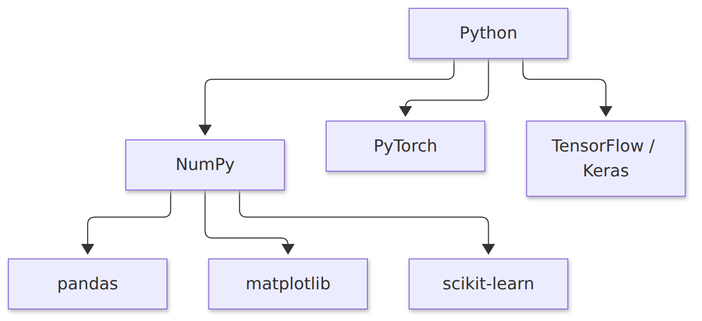{height=32%}

## Perché NumPy

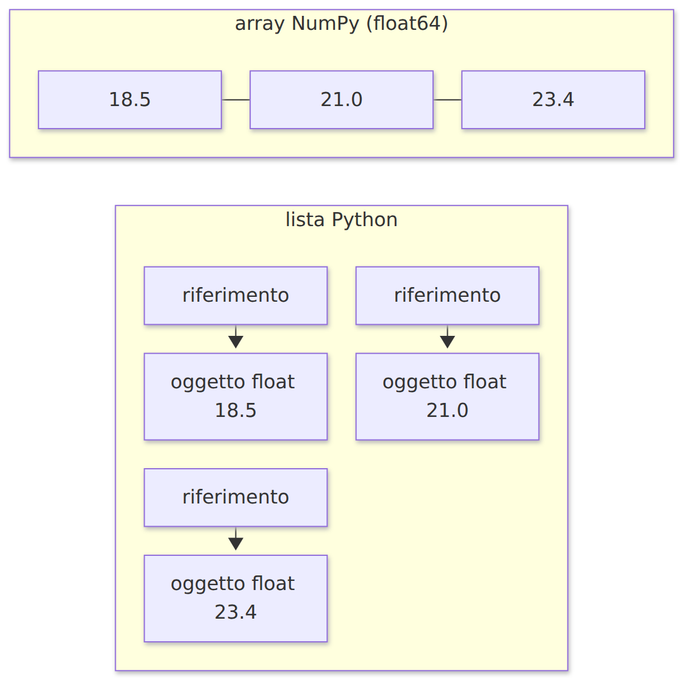{height=46%}

- elementi dello stesso tipo, in un blocco continuo di memoria
- operazioni eseguite da codice compilato, senza cicli Python
- codice più corto: `a * 2`

## Creare array

```python
import numpy as np
a = np.array([18.5, 21.0, 23.4, 19.8, 25.1])
a.dtype, a.shape, a.ndim, a.size     # float64 (5,) 1 5
```

| Funzione | Risultato |
|---|---|
| `np.zeros(4)` | `[0. 0. 0. 0.]` |
| `np.ones((2, 3))` | matrice 2 x 3 di uni |
| `np.arange(0, 10, 2)` | `[0 2 4 6 8]` (passo) |
| `np.linspace(0, 1, 5)` | 5 valori da 0 a 1 inclusi |

## Array a due dimensioni

```python
m = np.array([[1, 2, 3],
              [4, 5, 6]])
m.shape                      # (2, 3): righe, colonne

np.arange(12).reshape(3, 4)
```

Dati per il machine learning: **una riga per esempio, una colonna per caratteristica**

100 fiori con 4 misure: forma (100, 4)

## Indici e sottoarray

```python
t = np.array([[10, 11, 12, 13],
              [20, 21, 22, 23],
              [30, 31, 32, 33]])
t[1, 2]        # 22
t[0]           # riga 0
t[:, 1]        # colonna 1
t[0:2, 1:3]    # [[11 12] [21 22]]
t[-1, -1]      # 33
t[0] = 0       # azzera la riga 0
```

## Laboratorio L9

`L9_array_numpy.ipynb`: eseguire prima la cella con `controlla`

1. (base) `arange`, `linspace`, `zeros`
2. (base) elemento, riga, colonna
3. (standard) `reshape` e sottomatrice
4. (standard) pesi di uno strato: riga di un neurone, colonna di un ingresso
5. (approfondimento) scacchiera con slicing con passo

# L10 - Calcolo vettoriale con NumPy

## Elemento per elemento

```python
a = np.array([1.0, 2.0, 3.0, 4.0])
b = np.array([10.0, 20.0, 30.0, 40.0])
a + b        # [11. 22. 33. 44.]
a * b        # [10. 40. 90. 160.]   non è il prodotto scalare
a * 2        # [2. 4. 6. 8.]
```

Funzioni universali:

```python
np.exp(z)
1 / (1 + np.exp(-z))     # sigmoide di tutti gli elementi
np.maximum(z, 0)         # ReLU
```

## Broadcasting

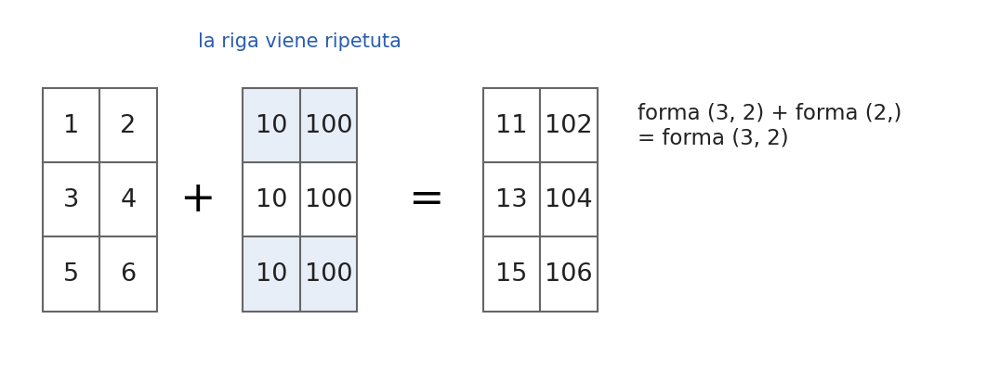{width=79%}

Forme confrontate dall'ultima dimensione: uguali, oppure una vale 1 (o manca)

Errore: `operands could not be broadcast together with shapes (3,2) (3,)`

## Aggregazioni e axis

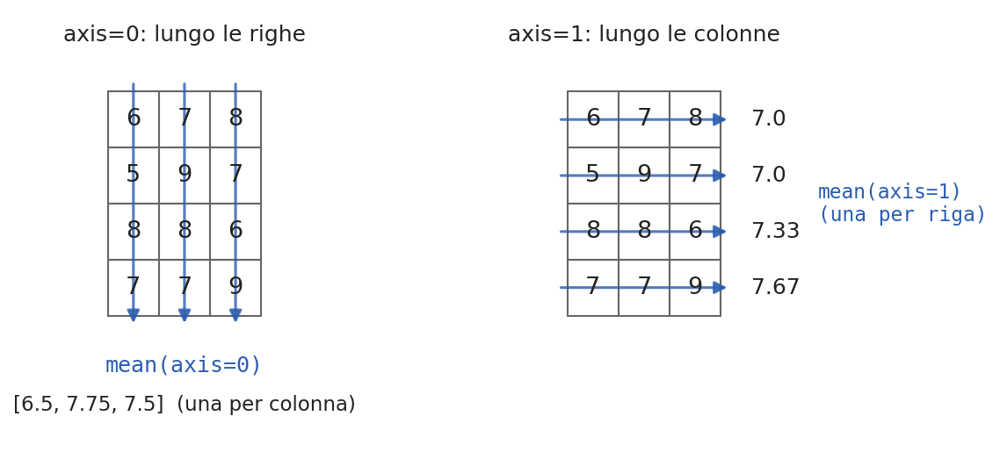{width=72%}

`sum`, `mean`, `std`, `min`, `max`, `argmin`, `argmax`

## Maschere booleane

```python
t = np.array([18.5, 21.0, 23.4, 19.8, 25.1])
maschera = t > 20          # [False  True  True False  True]
t[maschera]                # [21.  23.4 25.1]
maschera.sum()             # 3
maschera.mean()            # 0.6
np.where(t > 20, 1, 0)     # [0 1 1 0 1]
(t > 20) & (t < 25)        # & | ~ al posto di and or not
```

`np.where(z >= 0, 1, 0)`: gradino su tutto l'array

## Numeri casuali

```python
rng = np.random.default_rng(42)          # seme 42
rng.uniform(0, 1, size=5)
rng.normal(0, 1, size=5)
rng.integers(1, 7, size=10)
rng.normal(0, 1, size=(4, 3))
```

- uniforme: tutti i valori ugualmente probabili
- normale: valori concentrati attorno alla media; inizializzazione dei pesi
- seme: stessi numeri a ogni esecuzione, esperimenti riproducibili

## Normalizzazione e standardizzazione

- min-max: $x' = \dfrac{x - \min}{\max - \min}$, valori in [0, 1]
- standardizzazione: $x' = \dfrac{x - \mu}{\sigma}$, media 0 e deviazione standard 1

```python
X_std = (X - X.mean(axis=0)) / X.std(axis=0)
```

Caratteristiche su scale confrontabili prima dell'addestramento

## Velocità

```python
valori = list(range(100_000))
arr = np.arange(100_000)
%timeit [v * 2 for v in valori]      # millisecondi
%timeit arr * 2                      # microsecondi
```

`%timeit`: comando speciale di Jupyter. Rapporto tipico: da 10 a 100 volte.

## Laboratorio L10

`L10_calcolo_vettoriale.ipynb`

1. (base) `sigmoide` e `relu` vettoriali
2. (base) media di una prova, studente migliore
3. (standard) normalizzazione min-max
4. (standard) standardizzazione per colonne
5. (standard) 1000 lanci di un dado, frequenza del 6
6. (approfondimento) strato a gradino su più esempi

# L11 - Vettori e matrici

## Vettori, norma, prodotto scalare

- vettore: elenco ordinato di numeri; freccia nel piano
- norma: $\|v\| = \sqrt{v_1^2 + \dots + v_n^2}$, `np.linalg.norm(v)`
- prodotto scalare: $x \cdot w = x_1 w_1 + \dots + x_n w_n$ = somma pesata

```python
x @ w          # oppure np.dot(x, w)
```

$x \cdot w = \|x\|\,\|w\| \cos\theta$: positivo (angolo acuto), zero (perpendicolari), negativo (ottuso)

## Matrici

- tabella $r \times c$; forma `(r, c)`
- trasposta `W.T`: righe e colonne scambiate

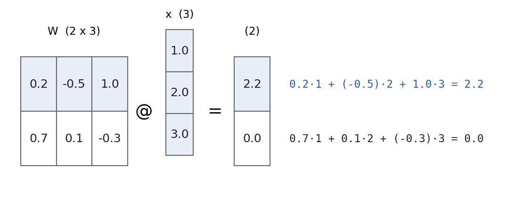{width=81%}

## Compatibilità delle forme

$(r, \mathbf{k}) \times (\mathbf{k}, c) \to (r, c)$

- dimensioni interne uguali, altrimenti `ValueError`
- in generale $AB \neq BA$
- annotare le forme prima di scrivere un prodotto

```python
W @ x      # [ 2.20000000e+00 -5.55111512e-17]
```

$-5.55 \cdot 10^{-17}$: zero a meno dell'approssimazione dei `float`

## Uno strato di neuroni

$$y = f(Wx + b) \qquad W: (m, n) \quad b: (m)$$

```python
y = sigmoide(W @ x + b)
```

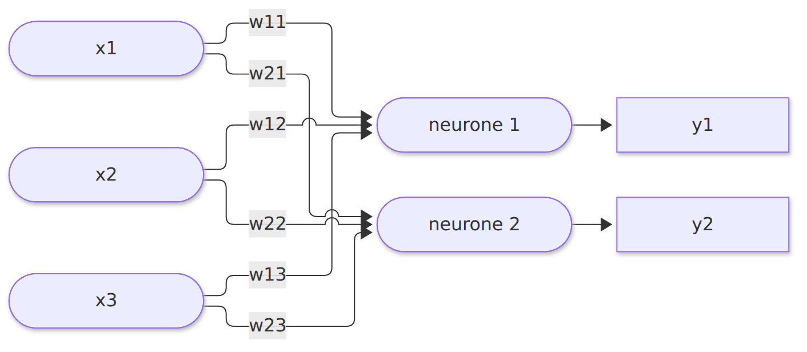{width=68%}

## Più esempi insieme

```python
Z = X @ W.T + b      # X: (p, n)   W.T: (n, m)   Z: (p, m)
```

- una riga per esempio, una colonna per neurone
- `b` sommato a ogni riga per broadcasting
- è l'operazione di `Dense` (Keras) e `Linear` (PyTorch)

## Laboratorio L11

`L11_vettori_matrici.ipynb`

1. (base) prodotto scalare con ciclo e con `@`
2. (base) prodotto matrice-vettore a mano, verifica con NumPy
3. (standard) neurone a gradino vettoriale, AND
4. (standard) strato 3 ingressi, 4 neuroni, ReLU
5. (standard) `X @ W.T + b` su 5 esempi
6. (approfondimento) rete XOR in forma matriciale

# L12 - Grafici con matplotlib

## Grafico di una funzione

```python
import matplotlib.pyplot as plt
x = np.linspace(-5, 5, 200)
y = 1 / (1 + np.exp(-x))
plt.plot(x, y, label="sigmoide")
plt.title("Funzione sigmoide")
plt.xlabel("z"); plt.ylabel("valore")
plt.grid(True); plt.legend()
plt.show()
```

Figura, assi, titolo, etichette, legenda

## Il risultato

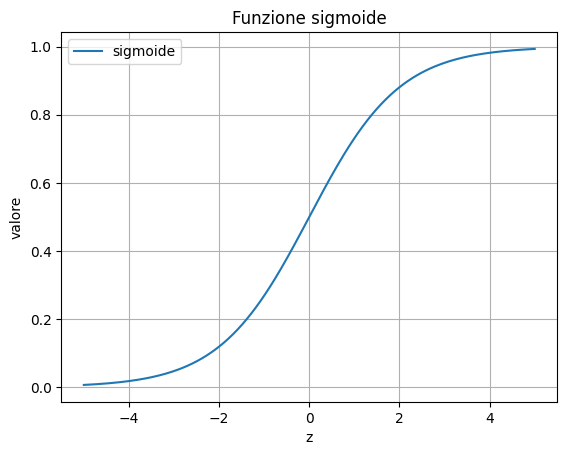{height=72%}

## Funzioni principali

| Funzione | Effetto |
|---|---|
| `plt.plot(x, y)` | linea |
| `plt.scatter(x, y)` | punti |
| `plt.hist(v, bins=30)` | istogramma |
| `plt.title`, `plt.xlabel`, `plt.ylabel` | testi |
| `plt.legend()`, `plt.grid(True)` | legenda, griglia |
| `plt.xlim`, `plt.ylim` | intervallo degli assi |

Stile: `color`, `linewidth`, `linestyle="--"`, `marker="o"`

## Due classi di punti

```python
rng = np.random.default_rng(3)
classe_a = rng.normal(loc=[2, 2], scale=0.6, size=(30, 2))
classe_b = rng.normal(loc=[4, 4], scale=0.6, size=(30, 2))
plt.scatter(classe_a[:, 0], classe_a[:, 1], label="classe A")
plt.scatter(classe_b[:, 0], classe_b[:, 1], marker="s", label="classe B")
```

Simboli diversi, non solo colori: leggibili in bianco e nero

## La retta del neurone

$w_1 x_1 + w_2 x_2 + b = 0 \quad\Rightarrow\quad x_2 = -\dfrac{w_1 x_1 + b}{w_2}$

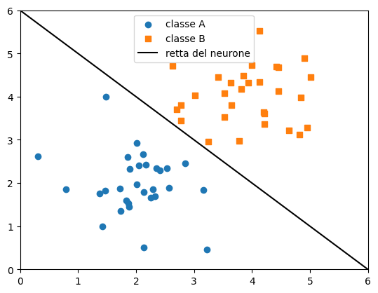{height=60%}

## Istogramma nel notebook

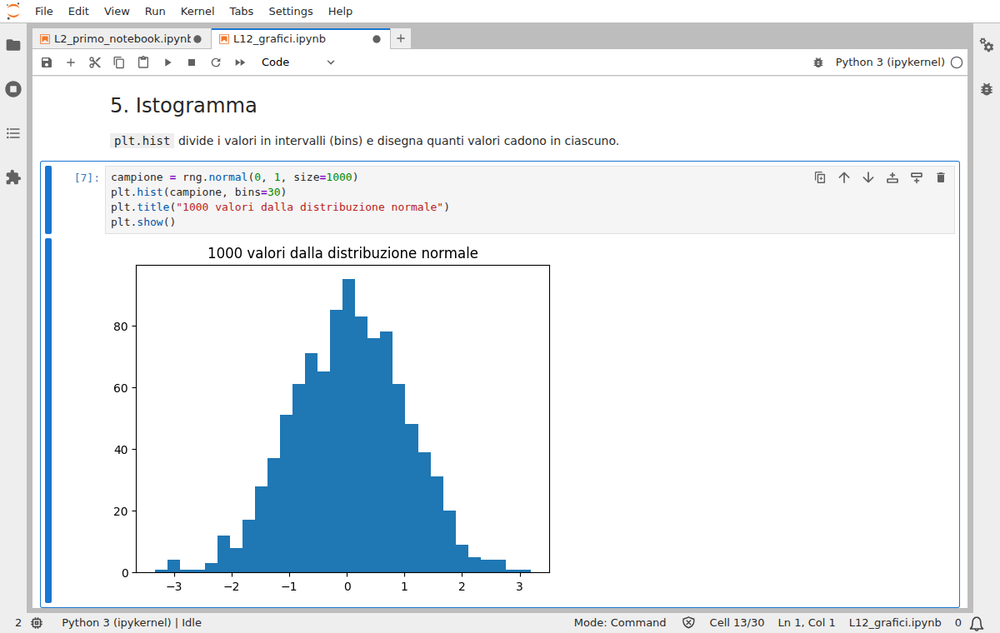{width=77%}

## Più grafici e salvataggio

```python
fig, assi = plt.subplots(1, 2, figsize=(9, 3))
assi[0].plot(x, np.maximum(x, 0))
assi[0].set_title("ReLU")
assi[1].plot(x, np.tanh(x))
assi[1].set_title("tanh")
fig.tight_layout()
fig.savefig("attivazioni.png")
```

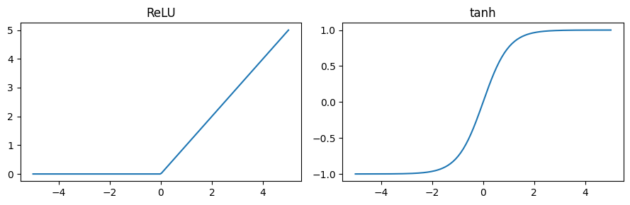{width=70%}

## Regione di decisione

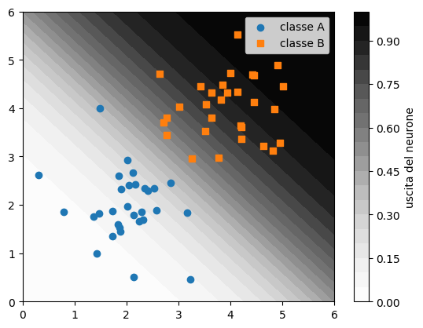{height=64%}

`np.meshgrid` + `plt.contourf`: uscita della sigmoide su tutto il piano

## Laboratorio L12

`L12_grafici.ipynb`: il controllo verifica i dati, il grafico si controlla guardandolo

1. (base) sigmoide e derivata
2. (base) istogramma delle somme di due dadi
3. (standard) punti di AND e retta del neurone
4. (standard) frazione di punti classificati correttamente
5. (approfondimento) regione di decisione

Verifica del modulo 3: `verifica_modulo3.ipynb`
