# Lezione L13 - Il neurone artificiale e la separazione lineare

## Obiettivi della lezione

- descrivere il neurone artificiale e i limiti dell'analogia con il neurone biologico
- interpretare geometricamente un neurone a due ingressi: una retta che divide il piano
- trovare a mano pesi e bias per funzioni logiche e piccoli insiemi di dati
- spiegare perché un singolo neurone non può calcolare XOR
- collocare il perceptron nella storia dell'intelligenza artificiale

## Dal neurone biologico al neurone artificiale

Un neurone biologico riceve segnali elettrici da altri neuroni attraverso i dendriti; le connessioni (sinapsi) possono rafforzare o indebolire i segnali; se la stimolazione complessiva supera una certa soglia, il neurone emette a sua volta un impulso lungo l'assone.

Il neurone artificiale riprende solo lo schema di calcolo:

| Neurone biologico | Neurone artificiale |
|---|---|
| segnali in ingresso dai dendriti | ingressi $x_1, \dots, x_n$ |
| forza delle sinapsi | pesi $w_1, \dots, w_n$ |
| stimolazione complessiva | somma pesata $z = w \cdot x + b$ |
| soglia di attivazione | bias $b$ e funzione di attivazione |
| impulso sull'assone | uscita $y = f(z)$ |

L'analogia ha limiti importanti: un neurone biologico è una cellula con un comportamento chimico ed elettrico molto più complesso, i segnali sono impulsi nel tempo e non numeri, e l'apprendimento nel cervello non avviene con gli algoritmi usati per le reti artificiali. Le reti neurali artificiali sono modelli matematici ispirati al cervello, non sue simulazioni.

Tappe storiche:

- 1943: Warren McCulloch e Walter Pitts propongono il primo modello matematico di neurone, con ingressi e uscita binari e una soglia
- 1958: Frank Rosenblatt presenta il perceptron, un neurone che impara i propri pesi dagli esempi (lezione L14)
- 1969: Marvin Minsky e Seymour Papert, nel libro *Perceptrons*, mostrano i limiti di un singolo strato di neuroni, tra cui l'impossibilità di calcolare XOR; l'interesse per le reti neurali diminuisce per molti anni
- 1986: David Rumelhart, Geoffrey Hinton e Ronald Williams diffondono l'algoritmo di retropropagazione per addestrare reti a più strati (lezione L16), che supera quei limiti

Riferimenti:

- Percettrone, Enciclopedia della Scienza e della Tecnica, Treccani: https://www.treccani.it/enciclopedia/percettrone_(Enciclopedia-della-Scienza-e-della-Tecnica)/
- Perceptron, Wikipedia (in inglese): https://en.wikipedia.org/wiki/Perceptron

## Il neurone in forma vettoriale

Con la notazione del modulo 3, il neurone a gradino calcola:

$$z = w \cdot x + b \qquad y = \begin{cases} 1 & \text{se } z \geq 0 \\ 0 & \text{altrimenti} \end{cases}$$

Con i quattro punti della tabella di verità in una matrice `P` (una riga per punto), le quattro uscite si calcolano in un'unica espressione:

```python
P = np.array([[0, 0], [0, 1], [1, 0], [1, 1]])

def neurone(X, w, b):
    return np.where(X @ w + b >= 0, 1, 0)

neurone(P, np.array([1, 1]), -1.5)     # [0 0 0 1]: AND
neurone(P, np.array([1, 1]), -0.5)     # [0 1 1 1]: OR
```

## Interpretazione geometrica

Con due ingressi, ogni esempio è un punto del piano $(x_1, x_2)$. L'insieme dei punti in cui $z = 0$,

$$w_1 x_1 + w_2 x_2 + b = 0$$

è una retta. Da una parte della retta $z > 0$ e il neurone restituisce 1, dall'altra $z < 0$ e restituisce 0. Le due regioni si chiamano semipiani.

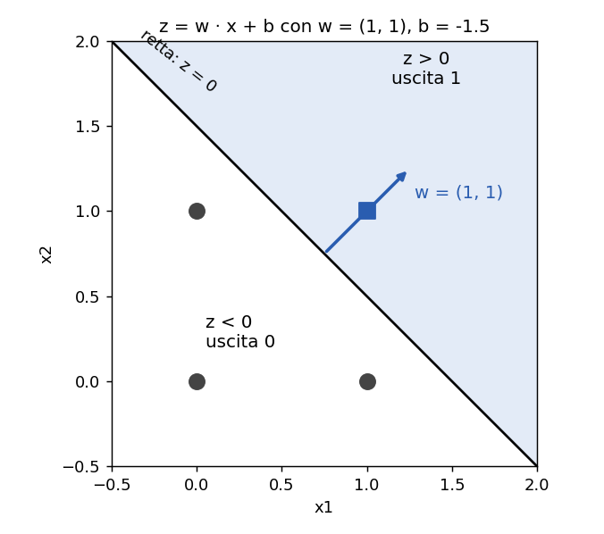{width=55%}

Proprietà:

- il vettore dei pesi $w$ è perpendicolare alla retta e punta verso il semipiano in cui $z > 0$ (dall'interpretazione del prodotto scalare, lezione L11)
- il bias sposta la retta parallelamente a se stessa: con $b = 0$ la retta passa per l'origine
- moltiplicando pesi e bias per lo stesso numero positivo la retta non cambia; moltiplicandoli per un numero negativo la retta resta la stessa ma i due semipiani si scambiano

Con tre ingressi il confine è un piano nello spazio; con più ingressi è un iperpiano. Il principio non cambia: un singolo neurone divide lo spazio degli ingressi in due parti con un confine piatto. Per questo si dice che un neurone è un classificatore lineare.

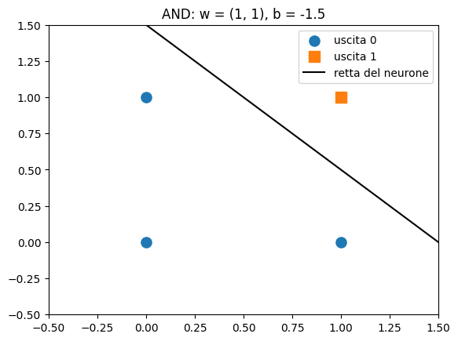{width=45%} 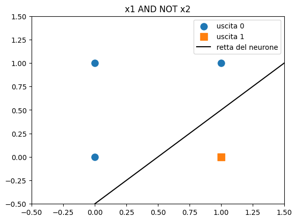{width=45%}

Trovare pesi e bias per una funzione logica equivale a trovare una retta che lasci i punti con uscita 1 da una parte e quelli con uscita 0 dall'altra.

## Separabilità lineare e XOR

Un insieme di punti divisi in due classi è linearmente separabile se esiste una retta (un iperpiano, in più dimensioni) che lascia tutti i punti di una classe da una parte e tutti quelli dell'altra classe dall'altra parte.

XOR (o esclusivo) vale 1 quando esattamente uno degli ingressi vale 1:

| $x_1$ | $x_2$ | XOR |
|---|---|---|
| 0 | 0 | 0 |
| 0 | 1 | 1 |
| 1 | 0 | 1 |
| 1 | 1 | 0 |

I punti con uscita 1 sono sulla diagonale secondaria, quelli con uscita 0 sulla diagonale principale. Qualsiasi retta che lascia (0, 1) e (1, 0) dalla stessa parte lascia da quella parte anche almeno uno degli altri due punti.

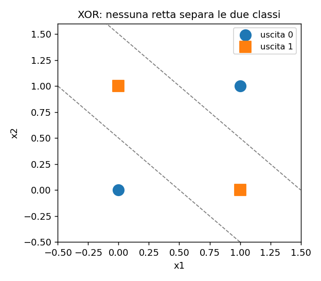{width=45%}

Lo si può verificare anche in modo sperimentale: il notebook prova più di 15 000 combinazioni di pesi e bias e nessuna calcola XOR. Delle 16 funzioni logiche di due ingressi, 14 sono linearmente separabili; le due che non lo sono sono XOR e la sua negazione.

Una dimostrazione algebrica, per chi vuole approfondire: se esistessero $w_1$, $w_2$, $b$ adatti, dovrebbe valere

- $b < 0$ (punto (0, 0), uscita 0)
- $w_2 + b \geq 0$ e $w_1 + b \geq 0$ (punti (0, 1) e (1, 0), uscita 1)
- $w_1 + w_2 + b < 0$ (punto (1, 1), uscita 0)

Sommando le due disuguaglianze centrali: $w_1 + w_2 + 2b \geq 0$, cioè $w_1 + w_2 + b \geq -b > 0$, in contraddizione con l'ultima.

La soluzione, già vista nella lezione L8, è usare più neuroni organizzati in strati: XOR(x1, x2) = AND(OR(x1, x2), NAND(x1, x2)). Ogni neurone dello strato nascosto traccia una retta; il neurone di uscita combina le due regioni.

## Laboratorio L13

Durata indicativa: 25 minuti. Notebook: `L13_separazione_lineare.ipynb`.

Il notebook contiene la funzione `disegna(X, y, w, b, titolo)`, che mostra i punti (cerchi per uscita 0, quadrati per uscita 1) e la retta del neurone.

1. (base) pesi e bias per NAND, con il grafico
2. (base) pesi e bias per "x1 AND NOT x2"
3. (standard) effetto della moltiplicazione di pesi e bias per 10 e per -1
4. (standard) separare con un neurone un piccolo insieme di dati reali a due dimensioni (altezza e massa)
5. (approfondimento) ricerca sistematica delle funzioni logiche linearmente separabili

# Lezione L14 - Il perceptron che impara

## Obiettivi della lezione

- descrivere l'apprendimento come modifica automatica dei parametri a partire da esempi
- applicare la regola di apprendimento del perceptron
- implementare l'addestramento con NumPy e osservarne l'andamento con grafici
- interpretare il ruolo del tasso di apprendimento e delle epoche
- riconoscere i limiti del perceptron

## Apprendimento dagli esempi

Nelle lezioni precedenti pesi e bias sono stati scelti a mano. Nell'apprendimento automatico (machine learning) i parametri vengono trovati da un algoritmo a partire da esempi di cui si conosce la risposta corretta.

- Esempio (campione)
  una coppia (ingresso $x$, etichetta $y$): per AND, $x = (1, 0)$ con $y = 0$.
- Insieme di addestramento
  l'elenco degli esempi usati per trovare i parametri.
- Apprendimento supervisionato
  apprendimento da esempi etichettati: per ogni ingresso è nota la risposta corretta.
- Addestramento
  il procedimento che modifica i parametri fino a ottenere risposte corrette sugli esempi.

## La regola del perceptron

Il perceptron di Rosenblatt esamina gli esempi uno alla volta. Per ogni esempio $(x, y)$:

1. calcola la previsione $\hat{y}$ (1 se $w \cdot x + b \geq 0$, altrimenti 0)
2. calcola l'errore $e = y - \hat{y}$, che può valere solo 0, 1 o -1
3. aggiorna pesi e bias:

$$w \leftarrow w + \eta \, e \, x \qquad b \leftarrow b + \eta \, e$$

$\eta$ (lettera greca eta) è il tasso di apprendimento (learning rate), un numero positivo piccolo, per esempio 0.1.

Significato dei tre casi:

- $e = 0$: previsione corretta, nessuna modifica
- $e = 1$: il neurone ha risposto 0 ma doveva rispondere 1, cioè $z$ era troppo piccolo. I pesi degli ingressi attivi aumentano e il bias aumenta: la prossima volta $z$ sarà più grande per quell'esempio
- $e = -1$: il neurone ha risposto 1 ma doveva rispondere 0; pesi e bias diminuiscono

Geometricamente, ogni correzione sposta e ruota la retta verso l'esempio classificato male.

Un passaggio completo su tutti gli esempi si chiama epoca. L'addestramento ripete più epoche, fino a quando in un'epoca non si commettono errori oppure si raggiunge un numero massimo di epoche.

Diagramma: algoritmo di addestramento del perceptron

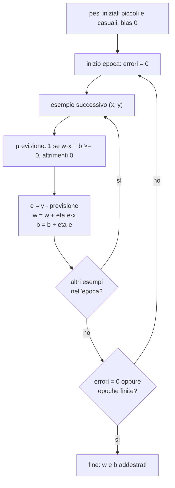

## Implementazione

```python
def addestra(X, y, eta=0.1, epoche=20, seme=0):
    rng = np.random.default_rng(seme)
    w = rng.normal(0, 0.1, size=X.shape[1])    # pesi iniziali piccoli e casuali
    b = 0.0
    errori_per_epoca = []
    for epoca in range(epoche):
        errori = 0
        for x_i, y_i in zip(X, y):
            y_prev = 1 if x_i @ w + b >= 0 else 0
            e = y_i - y_prev
            w = w + eta * e * x_i
            b = b + eta * e
            if e != 0:
                errori += 1
        errori_per_epoca.append(errori)
    return w, b, errori_per_epoca
```

- `X.shape[1]`: numero di colonne di `X`, cioè di ingressi; serve per creare un peso per ingresso
- `zip(X, y)`: a ogni ripetizione una riga di `X` (un esempio) e la sua etichetta
- `errori += 1`: forma abbreviata di `errori = errori + 1`

Su AND il perceptron parte da pesi casuali, commette alcuni errori nelle prime epoche e dopo poche epoche classifica correttamente tutti gli esempi:

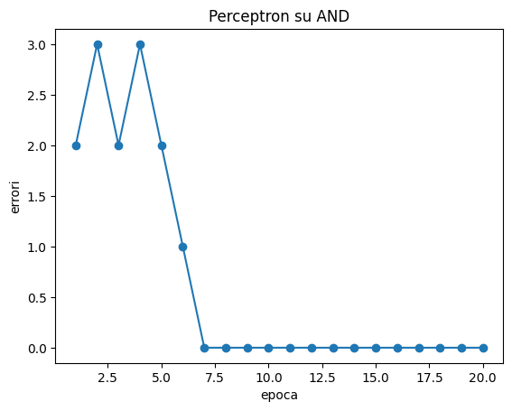{width=50%}

## Un problema con più dati

Con due nuvole di 40 punti ciascuna, generate con la distribuzione normale attorno a due centri diversi, il perceptron cerca una retta che le separi. Il grafico mostra la retta dopo 3, 10 e 20 epoche: parte da una posizione casuale e si sposta fino a separare le due classi.

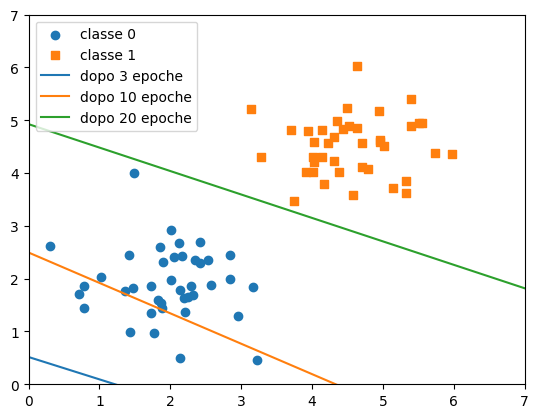{width=55%}

Per valutare il risultato si usa l'accuratezza: la frazione di esempi classificati correttamente.

```python
def accuratezza(X, y, w, b):
    return (neurone(X, w, b) == y).mean()
```

## Tasso di apprendimento ed epoche

Il tasso di apprendimento $\eta$ stabilisce l'ampiezza di ogni correzione. Nel perceptron con pesi iniziali nulli il suo valore non cambia le rette ottenute, perché moltiplicare pesi e bias per lo stesso numero positivo non sposta la retta (lezione L13). Con pesi iniziali casuali, invece, conta il rapporto tra le correzioni e i pesi iniziali: con $\eta$ molto piccolo i pesi iniziali pesano di più e servono più epoche.

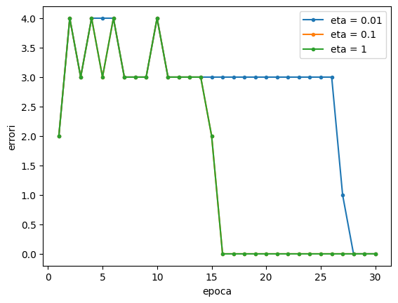{width=55%}

Nei metodi basati sulla discesa del gradiente (L15 e L16) il tasso di apprendimento ha un ruolo molto più importante.

- Iperparametro
  valore scelto da chi addestra il modello, non appreso dall'algoritmo: tasso di apprendimento, numero di epoche, seme casuale. I parametri, invece (pesi e bias), sono appresi.

## Convergenza e limiti

Teorema di convergenza del perceptron: se gli esempi sono linearmente separabili, l'algoritmo trova una retta che li separa in un numero finito di correzioni.

Limiti:

- se gli esempi non sono linearmente separabili (XOR, nuvole di punti che si sovrappongono), l'algoritmo non si ferma mai: il numero di errori oscilla senza arrivare a zero
- quando si ferma, la retta trovata separa gli esempi ma non è necessariamente la migliore: può passare molto vicino ad alcuni punti
- l'uscita è solo 0 o 1: non indica quanto il neurone è "sicuro" della risposta

Questi limiti si superano sostituendo il gradino con una funzione graduale e usando la discesa del gradiente (L15), e combinando più neuroni in strati (L16).

## Laboratorio L14

Durata indicativa: 30 minuti. Notebook: `L14_perceptron.ipynb`.

1. (base) addestrare il perceptron su OR
2. (base) epoca in cui gli errori arrivano a zero sul problema con due nuvole di punti
3. (standard) funzione `accuratezza`
4. (standard) effetto del tasso di apprendimento sulle curve degli errori
5. (approfondimento) classe `Perceptron` con i metodi `fit` e `predict`, la stessa interfaccia delle classi di scikit-learn

# Lezione L15 - Errore e discesa del gradiente

## Obiettivi della lezione

- misurare la qualità di un modello con una funzione di perdita (MSE)
- stimare la pendenza di una funzione con il rapporto incrementale e collegarla alla derivata
- applicare la discesa del gradiente a una funzione di una variabile
- spiegare l'effetto del tasso di apprendimento: convergenza lenta, rapida, oscillazione, divergenza
- addestrare con la discesa del gradiente un modello con due parametri

## Un problema di previsione

Ore di studio e punteggio ottenuto in una prova, per 30 studenti (dati sintetici): i punti mostrano una tendenza crescente. Si cerca la retta

$$\hat{y} = w x + b$$

che meglio descrive la relazione. Il simbolo $\hat{y}$ (y cappello) indica il valore previsto, per distinguerlo dal valore vero $y$.

Trovare una retta che approssima dei dati si chiama regressione lineare. Il modello ha la stessa forma di un neurone con un ingresso e nessuna funzione di attivazione.

## La funzione di perdita

Per confrontare rette diverse serve un numero che misuri quanto le previsioni sono lontane dai valori veri. La funzione di perdita (loss) più comune per la regressione è l'errore quadratico medio (MSE, Mean Squared Error):

$$L = \frac{1}{n} \sum_{i=1}^{n} (\hat{y}_i - y_i)^2$$

- ogni differenza viene elevata al quadrato: così gli errori positivi e negativi non si compensano, e gli errori grandi pesano più di quelli piccoli
- si calcola la media su tutti gli esempi

```python
def mse(y, y_prev):
    return ((y_prev - y) ** 2).mean()
```

La perdita dipende dai parametri $w$ e $b$: addestrare il modello significa trovare i valori di $w$ e $b$ che rendono la perdita minima.

## La pendenza e la derivata

Per capire in quale direzione modificare un parametro serve sapere come varia la perdita quando il parametro varia di poco. Si considera per semplicità una funzione di una sola variabile, $f(w) = (w - 3)^2 + 1$, il cui minimo è in $w = 3$.

La pendenza della curva in un punto $w$ si stima con il rapporto incrementale:

$$\text{pendenza} \approx \frac{f(w + h) - f(w - h)}{2h}$$

con $h$ piccolo (per esempio 0.001). È la pendenza della retta che passa per due punti molto vicini della curva.

```python
h = 0.001
(f(2 + h) - f(2 - h)) / (2 * h)     # circa -2
```

| $w$ | pendenza | significato |
|---|---|---|
| 0 | -6 | curva in forte discesa |
| 2 | -2 | curva in discesa, meno ripida |
| 3 | 0 | minimo: curva piatta |
| 5 | 4 | curva in salita |

Il valore a cui tende il rapporto incrementale quando $h$ tende a zero si chiama derivata di $f$ in $w$ e si indica con $f'(w)$. Per $f(w) = (w - 3)^2 + 1$ vale $f'(w) = 2(w - 3)$. Nel corso la derivata si usa come "pendenza nel punto": chi non l'ha ancora studiata in matematica può calcolarla sempre con il rapporto incrementale.

Osservazione chiave: a sinistra del minimo la pendenza è negativa, a destra positiva. Per avvicinarsi al minimo bisogna spostarsi nella direzione opposta al segno della pendenza.

## La discesa del gradiente

La discesa del gradiente (gradient descent) ripete lo stesso passo:

$$w \leftarrow w - \eta \, f'(w)$$

- se la pendenza è negativa, $w$ aumenta; se è positiva, $w$ diminuisce: in entrambi i casi ci si sposta verso il minimo
- vicino al minimo la pendenza è piccola e i passi diventano piccoli
- $\eta$ è il tasso di apprendimento

```python
w = -1.0
eta = 0.1
for passo in range(25):
    w = w - eta * 2 * (w - 3)
# w vale circa 2.985
```

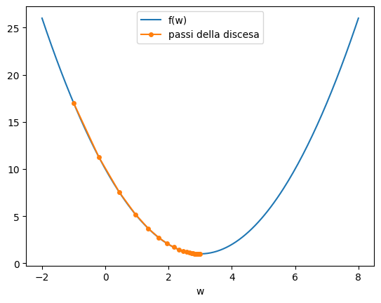{width=55%}

Diagramma: il ciclo della discesa del gradiente

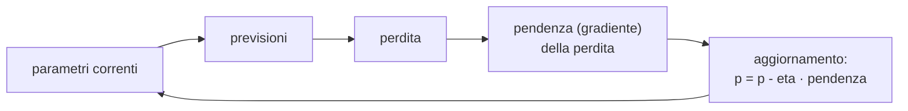

Analogia: una persona nella nebbia su un pendio, che vuole raggiungere il fondo della valle, può solo sentire con i piedi la pendenza del terreno nel punto in cui si trova e fare un passo in discesa. Ripetendo, arriva al fondo, anche senza vedere la valle.

## Il tasso di apprendimento

Partendo da $w = 8$ per 20 passi:

| $\eta$ | comportamento |
|---|---|
| 0.05 | convergenza lenta: dopo 20 passi $w$ è ancora lontano da 3 |
| 0.5 | convergenza in un passo (per questa particolare funzione) |
| 0.95 | oscillazione attorno al minimo con ampiezza che diminuisce lentamente |
| 1.05 | divergenza: le oscillazioni crescono e $w$ si allontana sempre di più |

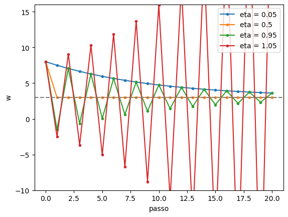{width=60%}

Un tasso troppo piccolo rende l'addestramento lento; uno troppo grande lo rende instabile. La scelta del tasso di apprendimento è uno dei problemi pratici principali nell'addestramento delle reti neurali.

## Più parametri: il gradiente

Con due parametri la perdita è una superficie sopra il piano $(w, b)$ e la pendenza dipende dalla direzione. Si calcolano due derivate, una per parametro, considerando fisso l'altro (derivate parziali, indicate con $\partial$):

$$\frac{\partial L}{\partial w} = \frac{2}{n} \sum_{i=1}^{n} (\hat{y}_i - y_i)\, x_i \qquad \frac{\partial L}{\partial b} = \frac{2}{n} \sum_{i=1}^{n} (\hat{y}_i - y_i)$$

Il vettore delle derivate parziali si chiama gradiente e indica la direzione in cui la perdita cresce più rapidamente. La discesa del gradiente aggiorna tutti i parametri insieme, nella direzione opposta:

$$w \leftarrow w - \eta \frac{\partial L}{\partial w} \qquad b \leftarrow b - \eta \frac{\partial L}{\partial b}$$

Le formule si ottengono con le regole di derivazione; si possono anche verificare numericamente con il rapporto incrementale, variando un parametro alla volta (esercizio di approfondimento del laboratorio).

```python
w, b = 0.0, 0.0
eta = 0.01
for passo in range(2000):
    y_prev = w * ore + b
    errore = y_prev - punteggio
    grad_w = 2 * (errore * ore).mean()
    grad_b = 2 * errore.mean()
    w = w - eta * grad_w
    b = b - eta * grad_b
```

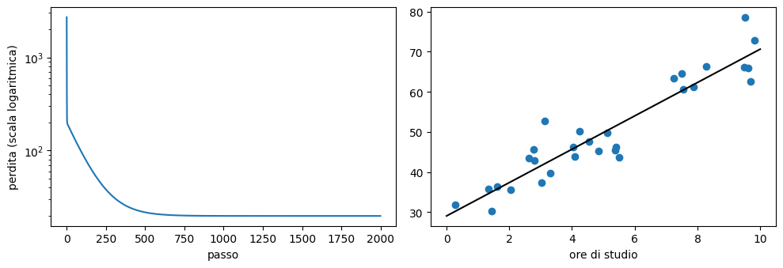{width=90%}

La curva della perdita scende rapidamente nei primi passi e poi si stabilizza: è il grafico che si osserva durante l'addestramento di qualsiasi rete neurale. La scala logaritmica sull'asse verticale (ogni tacca vale 10 volte la precedente) rende visibile la diminuzione anche quando i valori passano da migliaia a decine.

## Dalla retta alla rete neurale

Una rete neurale ha migliaia o miliardi di parametri invece di due, ma l'addestramento segue lo stesso schema:

1. calcolare le previsioni con i parametri correnti
2. calcolare la perdita
3. calcolare il gradiente della perdita rispetto a tutti i parametri
4. aggiornare tutti i parametri nella direzione opposta al gradiente
5. ripetere

Il passo 3 è quello difficile quando i parametri sono organizzati in più strati: lo risolve l'algoritmo di retropropagazione (lezione L16).

Il gradino del perceptron non si presta alla discesa del gradiente: la sua pendenza è zero ovunque (tranne in 0, dove non è definita), quindi non indica in quale direzione spostare i pesi. Per questo le reti addestrate con la discesa del gradiente usano attivazioni graduali come sigmoide, tangente iperbolica e ReLU (lezione L6).

## Laboratorio L15

Durata indicativa: 30 minuti. Notebook: `L15_discesa_gradiente.ipynb`.

1. (base) perdita MSE della retta trovata e della retta con parametri nulli
2. (base) funzione `pendenza(g, x)` con il rapporto incrementale
3. (standard) funzione `discesa(g, w0, eta, passi)` per una funzione di una variabile
4. (standard) quattro tassi di apprendimento: convergenza lenta, rapida, oscillazione, divergenza
5. (standard) regressione lineare tra gradi Celsius e Fahrenheit: il modello deve "scoprire" i coefficienti 1.8 e 32
6. (approfondimento) verifica numerica delle formule del gradiente
