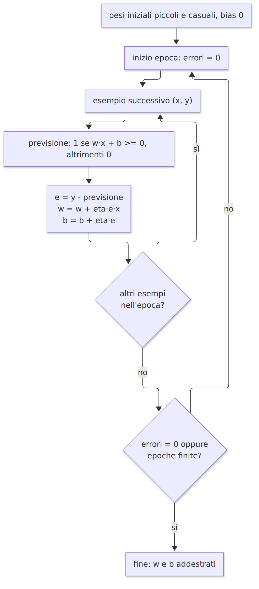
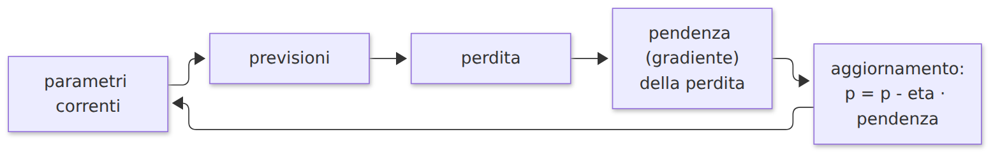

# L13 - Il neurone artificiale e la separazione lineare

## Neurone biologico e neurone artificiale

| Biologico | Artificiale |
|---|---|
| segnali dai dendriti | ingressi $x_1, \dots, x_n$ |
| forza delle sinapsi | pesi $w_1, \dots, w_n$ |
| stimolazione complessiva | $z = w \cdot x + b$ |
| soglia | bias e funzione di attivazione |
| impulso sull'assone | uscita $y = f(z)$ |

Modello matematico ispirato al cervello, non una sua simulazione

## Tappe storiche

- **1943** McCulloch e Pitts: primo modello matematico di neurone
- **1958** Rosenblatt: il perceptron impara i propri pesi
- **1969** Minsky e Papert, *Perceptrons*: limiti di un singolo strato (XOR)
- **1986** Rumelhart, Hinton, Williams: retropropagazione per reti a più strati

Treccani, Percettrone: https://www.treccani.it/enciclopedia/percettrone_(Enciclopedia-della-Scienza-e-della-Tecnica)/

## Il neurone in forma vettoriale

```python
P = np.array([[0, 0], [0, 1], [1, 0], [1, 1]])

def neurone(X, w, b):
    return np.where(X @ w + b >= 0, 1, 0)

neurone(P, np.array([1, 1]), -1.5)     # [0 0 0 1]: AND
neurone(P, np.array([1, 1]), -0.5)     # [0 1 1 1]: OR
```

## Interpretazione geometrica

{height=58%}

$w_1 x_1 + w_2 x_2 + b = 0$: una retta; $w$ perpendicolare, verso $z > 0$

## Proprietà della retta

- il bias sposta la retta parallelamente a se stessa
- pesi e bias $\times$ numero positivo: stessa retta
- pesi e bias $\times$ numero negativo: stessa retta, semipiani scambiati
- 3 ingressi: un piano; $n$ ingressi: un iperpiano

Un neurone è un **classificatore lineare**

## Trovare pesi e bias = trovare una retta

{width=45%} {width=45%}

## XOR non è linearmente separabile

{height=53%}

- ricerca su più di 15 000 combinazioni: nessuna calcola XOR
- 14 delle 16 funzioni logiche a due ingressi sono separabili

## Dimostrazione algebrica

- (0, 0) uscita 0: $b < 0$
- (0, 1), (1, 0) uscita 1: $w_2 + b \geq 0$, $w_1 + b \geq 0$
- (1, 1) uscita 0: $w_1 + w_2 + b < 0$

Sommando le due centrali: $w_1 + w_2 + b \geq -b > 0$. Contraddizione.

Soluzione: più strati, XOR = AND(OR, NAND) (lezione L8)

## Laboratorio L13

`L13_separazione_lineare.ipynb`, funzione `disegna(X, y, w, b, titolo)`

1. (base) NAND
2. (base) x1 AND NOT x2
3. (standard) pesi e bias $\times 10$ e $\times (-1)$
4. (standard) separare altezza e massa di animali
5. (approfondimento) le funzioni logiche separabili

# L14 - Il perceptron che impara

## Apprendimento dagli esempi

- **esempio**: coppia (ingresso $x$, etichetta $y$)
- **insieme di addestramento**: gli esempi usati per trovare i parametri
- **apprendimento supervisionato**: la risposta corretta è nota
- **addestramento**: modifica dei parametri fino a risposte corrette

## La regola del perceptron

Per ogni esempio: previsione $\hat{y}$, errore $e = y - \hat{y}$ (0, 1, -1)

$$w \leftarrow w + \eta \, e \, x \qquad b \leftarrow b + \eta \, e$$

- $e = 0$: nessuna modifica
- $e = 1$: $z$ troppo piccolo, pesi e bias aumentano
- $e = -1$: $z$ troppo grande, pesi e bias diminuiscono

**Epoca**: un passaggio su tutti gli esempi

## L'algoritmo

{height=75%}

## Implementazione

```python
def addestra(X, y, eta=0.1, epoche=20, seme=0):
    rng = np.random.default_rng(seme)
    w = rng.normal(0, 0.1, size=X.shape[1])
    b = 0.0
    errori_per_epoca = []
    for epoca in range(epoche):
        errori = 0
        for x_i, y_i in zip(X, y):
            y_prev = 1 if x_i @ w + b >= 0 else 0
            e = y_i - y_prev
            w = w + eta * e * x_i
            b = b + eta * e
            if e != 0:
                errori += 1
        errori_per_epoca.append(errori)
    return w, b, errori_per_epoca
```

## Errori per epoca su AND

{height=64%}

## La retta durante l'addestramento

{height=64%}

Accuratezza: `(neurone(X, w, b) == y).mean()`

## Tasso di apprendimento

{height=53%}

Nel perceptron $\eta$ conta poco (la retta non cambia se pesi e bias sono scalati). Conterà molto nella discesa del gradiente.

**Iperparametri**: $\eta$, epoche, seme. **Parametri**: pesi e bias.

## Convergenza e limiti

- **teorema**: se gli esempi sono linearmente separabili, il perceptron converge
- non separabili (XOR, classi sovrapposte): non si ferma mai
- la retta trovata separa, ma non è necessariamente la migliore
- uscita 0 o 1: nessuna misura di "sicurezza"

Soluzioni: attivazioni graduali e discesa del gradiente (L15), più strati (L16)

## Laboratorio L14

`L14_perceptron.ipynb`

1. (base) perceptron su OR
2. (base) epoca con zero errori
3. (standard) funzione `accuratezza`
4. (standard) confronto dei tassi di apprendimento
5. (approfondimento) classe `Perceptron` con `fit` e `predict`

# L15 - Errore e discesa del gradiente

## Un problema di previsione

Ore di studio e punteggio: si cerca la retta $\hat{y} = w x + b$

- regressione lineare
- stesso schema di un neurone con un ingresso, senza attivazione

Funzione di perdita, errore quadratico medio:

$$L = \frac{1}{n} \sum_{i=1}^{n} (\hat{y}_i - y_i)^2$$

```python
def mse(y, y_prev):
    return ((y_prev - y) ** 2).mean()
```

## Pendenza e derivata

$f(w) = (w - 3)^2 + 1$, minimo in $w = 3$

$$\text{pendenza} \approx \frac{f(w + h) - f(w - h)}{2h}$$

| $w$ | 0 | 2 | 3 | 5 |
|---|---|---|---|---|
| pendenza | -6 | -2 | 0 | 4 |

Derivata $f'(w)$: limite del rapporto incrementale. Qui $f'(w) = 2(w - 3)$.

Per scendere: direzione opposta al segno della pendenza

## La discesa del gradiente

$$w \leftarrow w - \eta \, f'(w)$$

{height=56%}

## Il ciclo

{width=95%}

Analogia: scendere a valle nella nebbia sentendo solo la pendenza sotto i piedi

## Il tasso di apprendimento

{height=50%}

0.05 lenta, 0.5 rapida, 0.95 oscillazione, 1.05 divergenza

## Più parametri: il gradiente

$$\frac{\partial L}{\partial w} = \frac{2}{n} \sum (\hat{y}_i - y_i)\, x_i \qquad \frac{\partial L}{\partial b} = \frac{2}{n} \sum (\hat{y}_i - y_i)$$

```python
for passo in range(2000):
    errore = (w * ore + b) - punteggio
    grad_w = 2 * (errore * ore).mean()
    grad_b = 2 * errore.mean()
    w = w - eta * grad_w
    b = b - eta * grad_b
```

## Perdita e retta ottenuta

{width=95%}

## Dalla retta alla rete neurale

1. previsioni con i parametri correnti
2. perdita
3. gradiente rispetto a tutti i parametri
4. aggiornamento in direzione opposta
5. ripetere

Il gradino ha pendenza zero: servono sigmoide, tanh, ReLU

Passo 3 con più strati: retropropagazione (L16)

## Laboratorio L15

`L15_discesa_gradiente.ipynb`

1. (base) perdita MSE
2. (base) `pendenza(g, x)`
3. (standard) `discesa(g, w0, eta, passi)`
4. (standard) quattro tassi di apprendimento
5. (standard) Celsius e Fahrenheit: scoprire 1.8 e 32
6. (approfondimento) verifica numerica del gradiente
