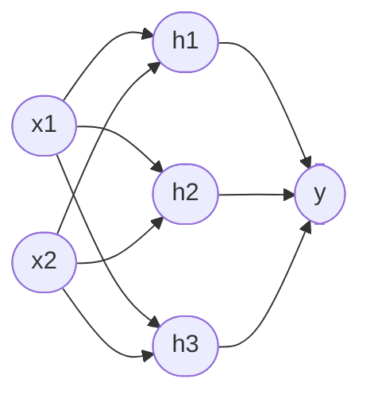
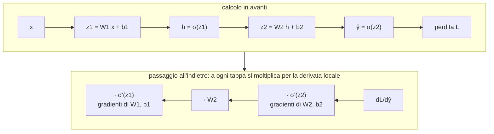
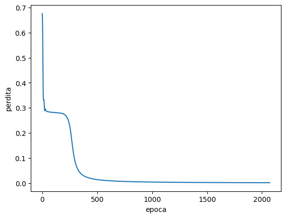
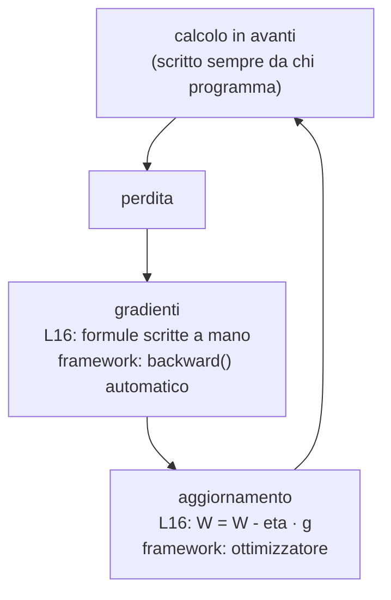

# Lezione L16 - Reti a più strati e retropropagazione

## Obiettivi della lezione

- descrivere la struttura di una rete con uno strato nascosto e calcolarne l'uscita (calcolo in avanti)
- spiegare perché la funzione di attivazione non lineare è indispensabile
- descrivere il principio della retropropagazione come applicazione della regola della catena
- addestrare con NumPy una rete che risolve XOR e un problema non lineare
- interpretare l'effetto di numero di neuroni nascosti, tasso di apprendimento e inizializzazione

## Struttura di una rete a più strati

Una rete a più strati (multilayer perceptron, MLP) è formata da:

- Strato di ingresso
  i valori in ingresso; non contiene neuroni né parametri.
- Strati nascosti
  strati di neuroni intermedi, le cui uscite non sono visibili dall'esterno; ogni neurone riceve tutte le uscite dello strato precedente (strati completamente connessi).
- Strato di uscita
  i neuroni che producono il risultato; per una classificazione in due classi basta un neurone con attivazione sigmoide, la cui uscita si interpreta come probabilità della classe 1.

Diagramma: rete con 2 ingressi, 3 neuroni nascosti, 1 uscita



Ogni freccia ha un peso; ogni neurone nascosto e il neurone di uscita hanno un bias. Nella rete del diagramma i parametri sono $2 \times 3 + 3 = 9$ nello strato nascosto e $3 + 1 = 4$ nello strato di uscita: 13 in tutto. Le reti usate nelle applicazioni reali ne hanno da migliaia a centinaia di miliardi.

Il termine deep learning (apprendimento profondo) indica l'uso di reti con molti strati nascosti.

## Il calcolo in avanti

Con la notazione della lezione L11, lo strato nascosto ha pesi $W_1$ (una riga per neurone nascosto) e bias $b_1$; lo strato di uscita ha pesi $W_2$ e bias $b_2$:

$$h = \sigma(W_1 x + b_1) \qquad \hat{y} = \sigma(W_2 h + b_2)$$

Con tutti gli esempi in una matrice $X$ (una riga per esempio):

```python
def avanti(X, W1, b1, W2, b2):
    H = sigmoide(X @ W1.T + b1)          # forma (esempi, neuroni nascosti)
    Y_prev = sigmoide(H @ W2.T + b2)     # forma (esempi, 1)
    return H, Y_prev
```

Il calcolo procede strato per strato, dall'ingresso all'uscita: per questo si chiama calcolo in avanti (forward pass). La rete XOR della lezione L8, con i neuroni OR e NAND nello strato nascosto e AND in uscita, è un caso particolare con pesi scelti a mano; sostituendo il gradino con la sigmoide e moltiplicando pesi e bias per 10 si ottengono uscite molto vicine a 0 e 1.

## Perché serve la non linearità

Se i neuroni non avessero funzione di attivazione, la rete a due strati calcolerebbe

$$W_2 (W_1 x + b_1) + b_2 = (W_2 W_1)\, x + (W_2 b_1 + b_2)$$

cioè una funzione della stessa forma di un singolo strato, con matrice $W_2 W_1$ e bias $W_2 b_1 + b_2$. Qualsiasi numero di strati lineari equivale a un solo strato lineare, e quindi a un confine di separazione piatto. La funzione di attivazione non lineare (sigmoide, tangente iperbolica, ReLU) è ciò che permette alla rete di rappresentare confini curvi.

Un risultato teorico (teorema di approssimazione universale) afferma che una rete con un solo strato nascosto non lineare e un numero sufficiente di neuroni può approssimare con precisione arbitraria qualsiasi funzione continua su un insieme limitato. Il teorema garantisce che una rete adatta esiste, non che l'addestramento la trovi né quanti neuroni servano.

## La retropropagazione

Per addestrare la rete con la discesa del gradiente (lezione L15) serve la derivata della perdita rispetto a ogni peso e bias. Nello strato di uscita il calcolo è simile a quello della regressione; per i pesi dello strato nascosto il problema è che il loro effetto sulla perdita passa attraverso lo strato di uscita.

La retropropagazione dell'errore (backpropagation) calcola tutte le derivate in un solo passaggio all'indietro, dall'uscita verso l'ingresso, usando la regola della catena: se una grandezza dipende da un'altra attraverso passaggi intermedi, la derivata complessiva è il prodotto delle derivate dei singoli passaggi.

Esempio della regola della catena con una catena di tre funzioni: se $z$ dipende da $w$, $a$ dipende da $z$ e la perdita $L$ dipende da $a$, allora

$$\frac{dL}{dw} = \frac{dL}{da} \cdot \frac{da}{dz} \cdot \frac{dz}{dw}$$

Analogia: se aumentando di 1 un peso la somma pesata aumenta di 3, e aumentando di 1 la somma pesata la perdita aumenta di 0.5, allora aumentando di 1 il peso la perdita aumenta di circa $3 \times 0.5 = 1.5$.

Diagramma: il grafo di calcolo e i due passaggi



Il passaggio all'indietro percorre le stesse tappe del calcolo in avanti in ordine inverso, partendo dalla derivata della perdita rispetto all'uscita. La derivata della sigmoide è $\sigma'(z) = \sigma(z)(1 - \sigma(z))$ (lezione L6).

Nel codice, con la perdita MSE:

```python
# calcolo in avanti
H, Y_prev = avanti(X, W1, b1, W2, b2)
# errore all'uscita per la derivata della sigmoide
d2 = 2 * (Y_prev - Y) / len(X) * Y_prev * (1 - Y_prev)
# gradienti dello strato di uscita
g_W2 = d2.T @ H
g_b2 = d2.sum(axis=0)
# errore riportato allo strato nascosto attraverso W2, per la derivata della sigmoide
d1 = (d2 @ W2) * H * (1 - H)
# gradienti dello strato nascosto
g_W1 = d1.T @ X
g_b1 = d1.sum(axis=0)
# aggiornamento: discesa del gradiente
W2 = W2 - eta * g_W2;  b2 = b2 - eta * g_b2
W1 = W1 - eta * g_W1;  b1 = b1 - eta * g_b1
```

`d2` è l'"errore" di ciascun neurone di uscita per ciascun esempio; `d1` è l'errore attribuito a ciascun neurone nascosto, ottenuto distribuendo all'indietro l'errore di uscita secondo i pesi `W2`. Il gradiente di una matrice di pesi è il prodotto tra l'errore dello strato e i valori che entrano nello strato.

Non è necessario ricordare queste formule: le librerie di deep learning le calcolano automaticamente (lezione L17). È importante comprendere il principio: l'errore si calcola all'uscita e si propaga all'indietro strato per strato, e ogni peso viene corretto in proporzione al suo contributo all'errore.

Le formule si possono verificare con il rapporto incrementale, come nella lezione L15: è l'esercizio di approfondimento del laboratorio.

## Risultati

Addestrata su XOR con 4 neuroni nascosti, la rete impara a calcolare XOR: la perdita scende rapidamente dopo una fase iniziale quasi piatta.

{width=50%}

Su un problema più difficile, due classi di punti a forma di mezzaluna intrecciate (le "due lune"), la rete con 8 neuroni nascosti costruisce un confine curvo che separa le due classi; con 2 neuroni nascosti il confine è quasi rettilineo e l'accuratezza è inferiore.

{width=48%} {width=48%}

## Iperparametri e difficoltà dell'addestramento

- Numero di neuroni nascosti
  più neuroni permettono confini più complessi; troppi possono portare a imparare anche il rumore dei dati (sovradattamento, lezione L17).
- Tasso di apprendimento
  come in L15: troppo piccolo rende l'addestramento lento, troppo grande lo rende instabile. Il valore adatto dipende dal problema.
- Epoche
  numero di passaggi sui dati.
- Inizializzazione
  i pesi iniziali sono casuali. Con semi diversi l'addestramento può arrivare a soluzioni diverse; talvolta si ferma in un minimo locale, una configurazione in cui la perdita non diminuisce più ma non è la migliore possibile. Con XOR e 2 soli neuroni nascosti succede con alcuni semi.

{width=55%}

## TensorFlow Playground

TensorFlow Playground è un simulatore di reti neurali che funziona nel browser: permette di scegliere un insieme di dati a due dimensioni, il numero di strati e di neuroni, la funzione di attivazione e il tasso di apprendimento, e di osservare durante l'addestramento come cambiano i pesi (spessore delle connessioni), l'uscita di ogni neurone e la regione di decisione.

- Indirizzo: https://playground.tensorflow.org/

Attività suggerita: scegliere l'insieme di dati a spirale, partire da nessuno strato nascosto (un solo neurone: il confine è una retta), poi aggiungere strati e neuroni e osservare come cambia la forma del confine. È l'esperimento del laboratorio, in forma visuale.

## Laboratorio L16

Durata indicativa: 30 minuti. Notebook: `L16_rete_multistrato.ipynb`.

Il notebook contiene la funzione `addestra_rete`, circa 25 righe commentate che implementano calcolo in avanti, retropropagazione e aggiornamento. Negli esercizi la funzione si usa e si modifica nei parametri, non si riscrive.

1. (base) la rete XOR con pesi scelti a mano e attivazione sigmoide
2. (base) XOR con 2 neuroni nascosti e cinque semi diversi: minimi locali
3. (standard) due lune con 1, 2, 4 e 8 neuroni nascosti e forma del confine
4. (standard) effetto del tasso di apprendimento sulla curva della perdita
5. (approfondimento) verifica numerica di un gradiente calcolato con la retropropagazione

Attività finale: confronto con TensorFlow Playground sugli stessi problemi.

# Lezione L17 - Dal codice scritto a mano ai framework

## Obiettivi della lezione

- descrivere che cosa automatizza un framework di deep learning
- conoscere i principali framework e i motivi per cui non si installano su PC di fascia bassa
- addestrare e valutare una rete con `MLPClassifier` di scikit-learn
- distinguere dati di addestramento e dati di verifica, e riconoscere il sovradattamento
- riconoscere nel codice di Keras e PyTorch gli elementi della rete scritta a mano

## Che cosa fa un framework

Un framework di deep learning fornisce, già pronti e ottimizzati:

- Tensori
  array multidimensionali come quelli di NumPy, che possono essere elaborati anche dalle GPU (schede grafiche), molto più veloci per i calcoli delle reti neurali.
- Differenziazione automatica
  il calcolo automatico dei gradienti con la retropropagazione: si scrive solo il calcolo in avanti, il framework ricava il passaggio all'indietro.
- Strati predefiniti
  strati completamente connessi, convoluzionali (per le immagini), ricorrenti e di attenzione (per le sequenze e il testo), funzioni di attivazione.
- Ottimizzatori
  varianti della discesa del gradiente, come Adam, che adattano il tasso di apprendimento durante l'addestramento.
- Strumenti
  caricamento dei dati, salvataggio dei modelli, monitoraggio dell'addestramento.

Principali framework:

| Framework | Origine | Caratteristiche |
|---|---|---|
| PyTorch | Meta, oggi Linux Foundation | ciclo di addestramento scritto esplicitamente; molto usato nella ricerca |
| TensorFlow con Keras | Google | Keras offre un'interfaccia semplice (`fit`, `predict`) |
| scikit-learn | comunità open source | machine learning classico; contiene una semplice rete (`MLPClassifier`), senza GPU |

PyTorch e TensorFlow occupano diversi GB e sono pensati per computer con molta memoria e, idealmente, una GPU: per questo nel corso si usano solo su Google Colab. scikit-learn è leggero ed è incluso in WinPython e in JupyterLite.

## scikit-learn: MLPClassifier

```python
from sklearn.neural_network import MLPClassifier

modello = MLPClassifier(hidden_layer_sizes=(8,), activation="logistic", solver="sgd",
                        learning_rate_init=1.0, max_iter=5000, tol=1e-6,
                        n_iter_no_change=50, random_state=0)
modello.fit(X, y)            # addestramento
modello.predict(X_nuovi)     # classi previste
modello.score(X, y)          # accuratezza
```

| Parametro | Significato | Nella lezione L16 |
|---|---|---|
| `hidden_layer_sizes=(8,)` | un solo strato nascosto con 8 neuroni; `(8, 4)` indica due strati | `nascosti=8` |
| `activation="logistic"` | sigmoide; altre: `"relu"`, `"tanh"` | `sigmoide` |
| `solver="sgd"` | discesa del gradiente; altri: `"adam"`, `"lbfgs"` | ciclo di aggiornamento |
| `learning_rate_init` | tasso di apprendimento | `eta` |
| `max_iter` | numero massimo di epoche | `epoche` |
| `random_state` | seme dei pesi iniziali | `seme` |

Dopo l'addestramento i pesi sono negli attributi `coefs_` e `intercepts_`, la perdita per epoca in `loss_curve_`. Con gli stessi pesi, la rete scritta in NumPy e `MLPClassifier` producono le stesse uscite: l'esercizio 4 del laboratorio lo verifica.

La struttura "costruttore con iperparametri, poi `fit` e `predict`" è comune a tutti i modelli di scikit-learn ed è la stessa della classe `Perceptron` scritta nella lezione L14.

{width=50%}

## Dati di addestramento e di verifica

L'accuratezza calcolata sugli stessi esempi usati per l'addestramento è ottimistica: il modello può averli "memorizzati". Per stimare come si comporterà con dati nuovi, si divide l'insieme dei dati in due parti:

- dati di addestramento (training set): usati da `fit`
- dati di verifica (test set): tenuti da parte e usati solo per valutare

```python
from sklearn.model_selection import train_test_split

X_add, X_ver, y_add, y_ver = train_test_split(X, y, test_size=0.3, random_state=0)
modello.fit(X_add, y_add)
modello.score(X_ver, y_ver)
```

Sovradattamento (overfitting): il modello si adatta così bene ai dati di addestramento da imparare anche il loro rumore, e peggiora sui dati nuovi. Si riconosce da un'accuratezza molto alta sui dati di addestramento e sensibilmente più bassa su quelli di verifica. È più probabile con modelli molto grandi e pochi dati.

Questi temi (suddivisione dei dati, metriche, sovradattamento) sono sviluppati nel corso B.6.

## Un problema reale: cifre scritte a mano

scikit-learn contiene 1797 immagini di cifre scritte a mano, di 8 x 8 pixel in scala di grigi, con l'etichetta della cifra.

{width=80%}

Ogni immagine si trasforma in un vettore di 64 numeri (uno per pixel): la rete ha 64 ingressi e 10 neuroni di uscita, uno per cifra; la risposta è la cifra il cui neurone ha l'uscita più alta. Con uno strato nascosto di 32 neuroni l'accuratezza sui dati di verifica supera il 95%.

```python
from sklearn.datasets import load_digits

cifre = load_digits()
X_c = cifre.data / 16                  # pixel da 0-16 a 0-1
Xa, Xv, ya, yv = train_test_split(X_c, cifre.target, test_size=0.3, random_state=0)
rete = MLPClassifier(hidden_layer_sizes=(32,), max_iter=500, random_state=0)
rete.fit(Xa, ya)
rete.score(Xv, yv)
```

Gli errori sono spesso comprensibili: cifre scritte in modo ambiguo, anche per una persona.

{width=75%}

## Keras e PyTorch

Il notebook `L17_keras_pytorch_colab.ipynb`, da eseguire su Google Colab, costruisce la stessa rete della lezione L16 (due lune, 8 neuroni nascosti sigmoide, uscita sigmoide, perdita MSE, discesa del gradiente) nei due framework.

Keras:

```python
modello = keras.Sequential([
    keras.Input(shape=(2,)),
    keras.layers.Dense(8, activation="sigmoid"),
    keras.layers.Dense(1, activation="sigmoid"),
])
modello.compile(optimizer=keras.optimizers.SGD(learning_rate=2.0),
                loss="mean_squared_error", metrics=["accuracy"])
modello.fit(X, y, epochs=2000, batch_size=len(X), verbose=0)
```

PyTorch:

```python
modello = nn.Sequential(nn.Linear(2, 8), nn.Sigmoid(), nn.Linear(8, 1), nn.Sigmoid())
funzione_perdita = nn.MSELoss()
ottimizzatore = torch.optim.SGD(modello.parameters(), lr=2.0)
for epoca in range(2000):
    y_prev = modello(Xt)                     # calcolo in avanti
    perdita = funzione_perdita(y_prev, yt)
    ottimizzatore.zero_grad()
    perdita.backward()                       # retropropagazione automatica
    ottimizzatore.step()                     # aggiornamento dei parametri
```

Corrispondenze:

| Rete scritta a mano (L16) | Keras | PyTorch |
|---|---|---|
| `W1`, `b1` | `Dense(8, ...)` | `nn.Linear(2, 8)` |
| `sigmoide` | `activation="sigmoid"` | `nn.Sigmoid()` |
| `avanti(X, ...)` | `modello.predict(X)` | `modello(X)` |
| perdita MSE | `loss="mean_squared_error"` | `nn.MSELoss()` |
| calcolo di `d2`, `d1` e dei gradienti | automatico in `fit` | `perdita.backward()` |
| `W = W - eta * g_W` | `SGD(learning_rate=...)` | `ottimizzatore.step()` |
| ciclo sulle epoche | `fit(..., epochs=...)` | ciclo `for` esplicito |

Diagramma: dal codice scritto a mano ai framework



Il ciclo di addestramento è sempre lo stesso; cambia la quantità di lavoro svolta dal framework. Le reti usate nelle applicazioni (riconoscimento di immagini, traduzione, modelli linguistici) seguono lo stesso schema, con molti più strati, tipi di strato più specializzati e quantità enormi di dati.

## Laboratorio L17

Durata indicativa: 25 minuti.

Notebook `L17_scikit_learn.ipynb` (JupyterLite o WinPython):

1. (base) XOR con `MLPClassifier`
2. (base) numero di neuroni nascosti e accuratezza sui dati di verifica
3. (standard) cifre classificate male
4. (standard) calcolare le uscite di `MLPClassifier` con NumPy a partire da `coefs_` e `intercepts_`
5. (approfondimento) sovradattamento con una rete molto grande su pochi dati rumorosi

Notebook `L17_keras_pytorch_colab.ipynb` (Google Colab, dimostrazione guidata dove la connessione lo consente): eseguire le due versioni e provare le modifiche suggerite in fondo al notebook.

La verifica del modulo 4 (notebook `verifica_modulo4.ipynb`, distribuito dal docente) si svolge individualmente, in un momento stabilito dal docente.
