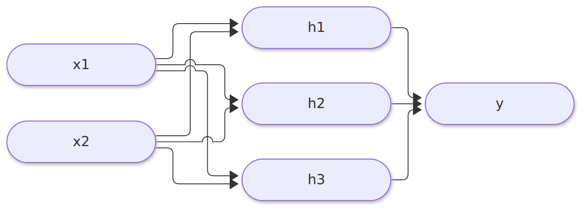
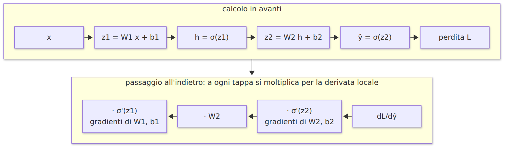
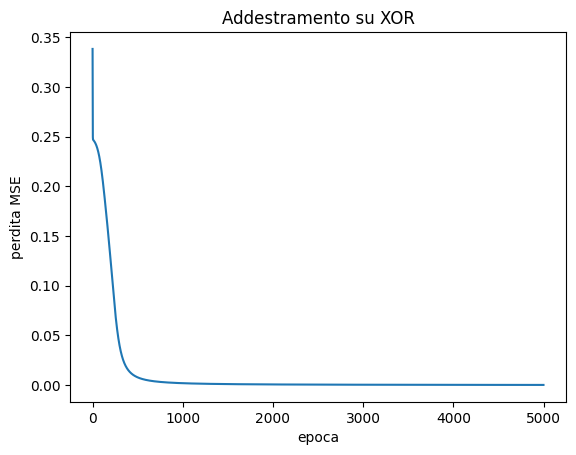
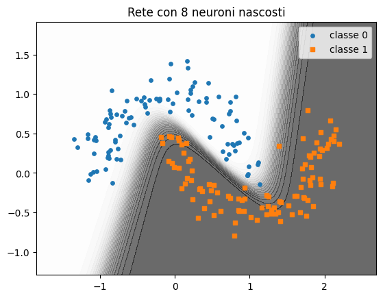
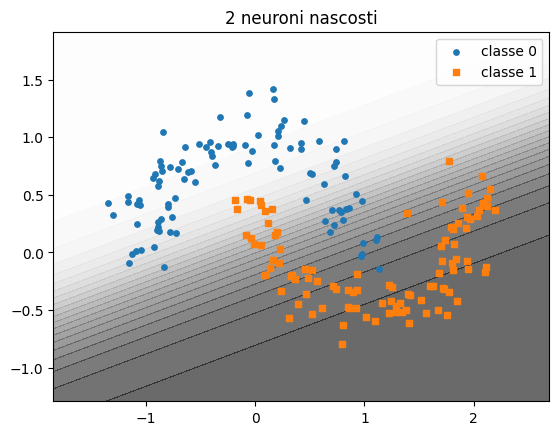
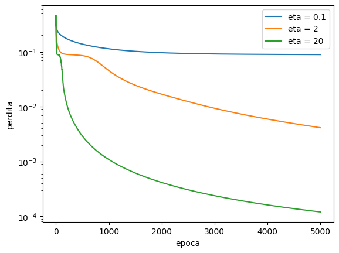
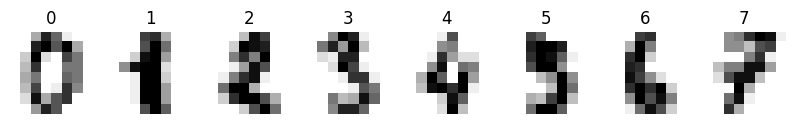
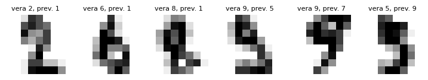
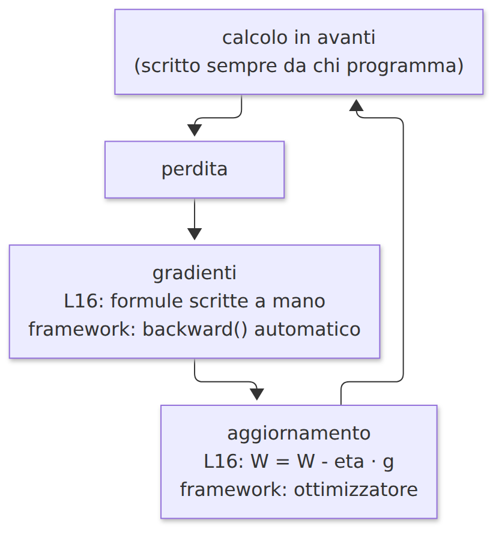

# L16 - Reti a più strati e retropropagazione

## Struttura di una rete a più strati

- **ingresso**: i valori, nessun parametro
- **strati nascosti**: neuroni intermedi, completamente connessi
- **uscita**: per due classi, un neurone sigmoide (probabilità della classe 1)

{height=42%}

13 parametri; le reti reali: da migliaia a centinaia di miliardi. **Deep learning**: molti strati.

## Il calcolo in avanti

$$h = \sigma(W_1 x + b_1) \qquad \hat{y} = \sigma(W_2 h + b_2)$$

```python
def avanti(X, W1, b1, W2, b2):
    H = sigmoide(X @ W1.T + b1)          # (esempi, neuroni nascosti)
    Y_prev = sigmoide(H @ W2.T + b2)     # (esempi, 1)
    return H, Y_prev
```

La rete XOR di L8 con sigmoide e pesi $\times 10$: uscite quasi 0 e 1

## Perché serve la non linearità

$$W_2 (W_1 x + b_1) + b_2 = (W_2 W_1)\, x + (W_2 b_1 + b_2)$$

- strati lineari in sequenza = un solo strato lineare = confine piatto
- l'attivazione non lineare permette confini curvi
- **approssimazione universale**: uno strato nascosto con abbastanza neuroni approssima qualsiasi funzione continua; il teorema non dice come trovarla

## La regola della catena

$$\frac{dL}{dw} = \frac{dL}{da} \cdot \frac{da}{dz} \cdot \frac{dz}{dw}$$

Esempio: peso +1 $\Rightarrow$ somma pesata +3; somma pesata +1 $\Rightarrow$ perdita +0.5

Quindi: peso +1 $\Rightarrow$ perdita circa $3 \times 0.5 = 1.5$

## Retropropagazione

{width=95%}

$\sigma'(z) = \sigma(z)(1 - \sigma(z))$

## Retropropagazione in codice

```python
H, Y_prev = avanti(X, W1, b1, W2, b2)                 # avanti
d2 = 2 * (Y_prev - Y) / len(X) * Y_prev * (1 - Y_prev) # errore in uscita
g_W2 = d2.T @ H;  g_b2 = d2.sum(axis=0)                # gradienti uscita
d1 = (d2 @ W2) * H * (1 - H)                           # errore riportato indietro
g_W1 = d1.T @ X;  g_b1 = d1.sum(axis=0)                # gradienti nascosto
W2 = W2 - eta * g_W2;  b2 = b2 - eta * g_b2            # aggiornamento
W1 = W1 - eta * g_W1;  b1 = b1 - eta * g_b1
```

Il principio: errore calcolato in uscita, propagato indietro, ogni peso corretto in proporzione al suo contributo

## XOR imparato

{height=64%}

## Le due lune

{width=43%} {width=43%}

8 neuroni nascosti: confine curvo. 2 neuroni: confine quasi rettilineo.

## Iperparametri e difficoltà

- **neuroni nascosti**: confini più complessi; troppi: sovradattamento
- **tasso di apprendimento**: lento o instabile
- **epoche**
- **inizializzazione casuale**: soluzioni diverse; talvolta un **minimo locale** (XOR con 2 neuroni, alcuni semi)

{height=36%}

## TensorFlow Playground

Simulatore nel browser: dati, strati, neuroni, attivazione, tasso di apprendimento

https://playground.tensorflow.org/

Attività: dati a spirale; da zero strati nascosti (una retta) ad aggiungere strati e neuroni

## Laboratorio L16

`L16_rete_multistrato.ipynb`: `addestra_rete` si usa e si modifica, non si riscrive

1. (base) XOR con pesi scelti a mano
2. (base) XOR con 2 neuroni e 5 semi: minimi locali
3. (standard) due lune con 1, 2, 4, 8 neuroni
4. (standard) tasso di apprendimento e perdita
5. (approfondimento) verifica numerica di un gradiente

# L17 - Dal codice scritto a mano ai framework

## Che cosa fa un framework

- **tensori**: array anche su GPU
- **differenziazione automatica**: il passaggio all'indietro è automatico
- **strati predefiniti**: densi, convoluzionali, ricorrenti, di attenzione
- **ottimizzatori**: SGD, Adam, ...

| Framework | Caratteristiche |
|---|---|
| PyTorch | ciclo esplicito; ricerca |
| TensorFlow con Keras | `fit`, `predict` |
| scikit-learn | ML classico, `MLPClassifier`, leggero |

PyTorch e TensorFlow: diversi GB, solo su Colab nel corso

## scikit-learn: MLPClassifier

```python
from sklearn.neural_network import MLPClassifier
modello = MLPClassifier(hidden_layer_sizes=(8,), activation="logistic", solver="sgd",
                        learning_rate_init=1.0, max_iter=5000, random_state=0)
modello.fit(X, y)
modello.predict(X_nuovi)
modello.score(X, y)
```

| Parametro | L16 |
|---|---|
| `hidden_layer_sizes=(8,)` | `nascosti=8` |
| `activation="logistic"` | `sigmoide` |
| `learning_rate_init` | `eta` |
| `max_iter` | `epoche` |
| `coefs_`, `intercepts_` | `W1`, `W2`, `b1`, `b2` |

## Addestramento e verifica

```python
from sklearn.model_selection import train_test_split
X_add, X_ver, y_add, y_ver = train_test_split(X, y, test_size=0.3, random_state=0)
modello.fit(X_add, y_add)
modello.score(X_ver, y_ver)
```

- l'accuratezza sui dati di addestramento è ottimistica
- **sovradattamento**: alta su addestramento, più bassa su verifica
- approfondito nel corso B.6

## Cifre scritte a mano

{width=81%}

- 1797 immagini 8 x 8: 64 ingressi, 10 uscite
- 32 neuroni nascosti: oltre il 95% sui dati di verifica

{width=68%}

## Keras

```python
modello = keras.Sequential([
    keras.Input(shape=(2,)),
    keras.layers.Dense(8, activation="sigmoid"),
    keras.layers.Dense(1, activation="sigmoid"),
])
modello.compile(optimizer=keras.optimizers.SGD(learning_rate=2.0),
                loss="mean_squared_error", metrics=["accuracy"])
modello.fit(X, y, epochs=2000, batch_size=len(X), verbose=0)
```

## PyTorch

```python
modello = nn.Sequential(nn.Linear(2, 8), nn.Sigmoid(), nn.Linear(8, 1), nn.Sigmoid())
funzione_perdita = nn.MSELoss()
ottimizzatore = torch.optim.SGD(modello.parameters(), lr=2.0)
for epoca in range(2000):
    y_prev = modello(Xt)
    perdita = funzione_perdita(y_prev, yt)
    ottimizzatore.zero_grad()
    perdita.backward()          # retropropagazione automatica
    ottimizzatore.step()
```

## Corrispondenze

| L16 (NumPy) | Keras | PyTorch |
|---|---|---|
| `W1`, `b1` | `Dense(8, ...)` | `nn.Linear(2, 8)` |
| `sigmoide` | `activation="sigmoid"` | `nn.Sigmoid()` |
| `avanti(X, ...)` | `predict(X)` | `modello(X)` |
| MSE | `"mean_squared_error"` | `nn.MSELoss()` |
| `d2`, `d1`, gradienti | automatico | `backward()` |
| `W = W - eta * g` | `SGD(...)` | `step()` |

## Lo stesso ciclo

{height=64%}

## Laboratorio L17

`L17_scikit_learn.ipynb` (JupyterLite, WinPython)

1. (base) XOR con `MLPClassifier`
2. (base) neuroni nascosti e accuratezza di verifica
3. (standard) cifre classificate male
4. (standard) uscite di `MLPClassifier` ricalcolate con NumPy
5. (approfondimento) sovradattamento

`L17_keras_pytorch_colab.ipynb` (Colab): dimostrazione guidata

Verifica del modulo 4: `verifica_modulo4.ipynb`
