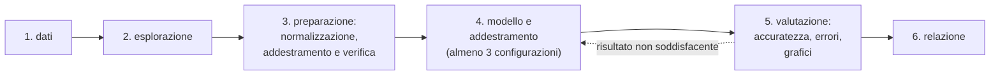
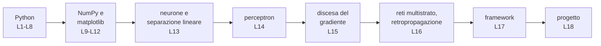

# Lezione L18 - Mini progetto finale

## Obiettivi della lezione

- applicare in modo autonomo il procedimento completo: dati, preparazione, modello, addestramento, valutazione
- confrontare configurazioni diverse di una rete neurale e motivare una scelta
- interpretare curva della perdita, accuratezza ed errori del modello
- comunicare in forma scritta il lavoro svolto e i risultati

## Organizzazione

- lavoro a gruppi di 2 o 3 studenti
- durata: 35 minuti
- notebook: `L18_progetto.ipynb`, in JupyterLite o WinPython
- consegna: il notebook completo, dopo `Kernel`, `Restart Kernel and Run All Cells...`, scaricato con `File`, `Download`

## Le due tracce

Ogni gruppo sceglie una traccia.

**Traccia A - Punti nel piano.** Due classi di punti disposti su due spirali intrecciate: nessuna retta le separa, e anche una rete piccola fatica. Si può usare la rete scritta in NumPy della lezione L16 (funzione `addestra_rete`) oppure `MLPClassifier`. Il risultato si visualizza con la regione di decisione.

{width=50%}

**Traccia B - Cifre scritte a mano.** Le 1797 immagini 8 x 8 di scikit-learn (lezione L17), da riconoscere con `MLPClassifier`. Il risultato si analizza osservando le immagini classificate male.

## Le fasi del progetto

Diagramma: procedimento del progetto

1. Dati: la cella del notebook carica i dati della traccia scelta in `X` e `y`.
2. Esplorazione: grafico dei punti (traccia A) o di alcune immagini con le etichette (traccia B); numero di esempi per classe.
3. Preparazione: normalizzazione (standardizzazione per la traccia A, divisione per 16 per la traccia B) e suddivisione in dati di addestramento (70%) e di verifica (30%).
4. Modello e addestramento: almeno tre configurazioni diverse, cambiando per esempio il numero di neuroni o di strati nascosti, la funzione di attivazione, il tasso di apprendimento, il numero di epoche. Per ciascuna si annota l'accuratezza sui dati di verifica.
5. Valutazione del modello scelto: accuratezza su addestramento e verifica, curva della perdita, regione di decisione (traccia A) o immagini classificate male (traccia B).
6. Relazione: la cella di testo finale del notebook, con la tabella delle configurazioni provate e le risposte alle domande guida.

Le celle di controllo verificano alcuni passaggi (esplorazione, preparazione, valutazione) e segnalano se l'accuratezza sui dati di verifica è sotto la soglia minima (0.85 per la traccia A, 0.9 per la traccia B).

## Esempi di risultati

{width=50%}

{width=75%}

## Domande guida per la relazione

- Quale configurazione è stata scelta e perché?
- Che cosa mostra la curva della perdita? L'addestramento è arrivato a una fase stabile?
- La differenza tra accuratezza di addestramento e di verifica è grande o piccola? Che cosa indica?
- Quali esempi il modello sbaglia? Perché potrebbe sbagliarli?
- Che cosa si potrebbe provare per migliorare il risultato?

## Criteri di valutazione

| Dimensione | Livello pieno | Livello parziale | Livello insufficiente |
|---|---|---|---|
| Correttezza del codice | il notebook si esegue dall'inizio alla fine senza errori; controlli superati | errori circoscritti, risolti solo in parte | il notebook non si esegue o mancano fasi |
| Comprensione del modello | il gruppo spiega il ruolo di strati, neuroni, attivazione, tasso di apprendimento, perdita | spiegazione corretta ma incompleta | spiegazione assente o errata |
| Analisi dei risultati | tre o più configurazioni confrontate; interpretazione della curva della perdita e della differenza addestramento-verifica; analisi degli errori | confronto presente ma poco commentato | un solo modello, nessuna analisi |
| Comunicazione | relazione chiara, tabella completa, codice leggibile con nomi significativi | relazione essenziale | relazione assente |

## Riepilogo del corso

Diagramma: il percorso del corso

Il neurone artificiale è stato scritto più volte, con strumenti sempre più potenti:

| Lezione | Forma del neurone |
|---|---|
| L4 | regola a soglia con `if` |
| L5 | somma pesata con liste e `for` |
| L6 | funzione con l'attivazione come parametro |
| L8 | classe `Neurone`; strato come lista di neuroni |
| L11 | strato come prodotto tra matrice e vettore: `W @ x + b` |
| L14 | perceptron che impara i propri pesi |
| L16 | rete a due strati addestrata con la retropropagazione |
| L17 | la stessa rete in scikit-learn, Keras, PyTorch |

## Per proseguire

- Kaggle Learn, Intro to Deep Learning: corso gratuito online con Keras (richiede un account Kaggle), https://www.kaggle.com/learn/intro-to-deep-learning
- Microsoft, AI for Beginners: curriculum open source (licenza MIT, in inglese), con lezioni su reti neurali, visione artificiale ed elaborazione del linguaggio, https://github.com/microsoft/AI-For-Beginners
- TensorFlow Playground, per sperimentare con le reti neurali nel browser: https://playground.tensorflow.org/
- corso B.6 del programma, "Data science e Machine Learning": raccolta e preparazione dei dati, algoritmi di classificazione, valutazione dei modelli
