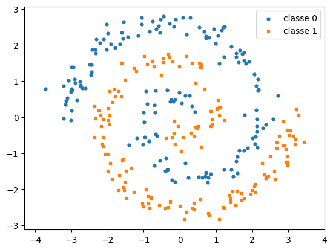
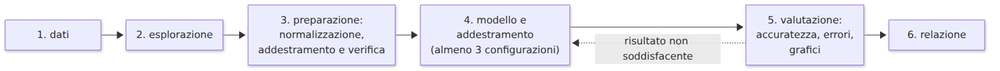
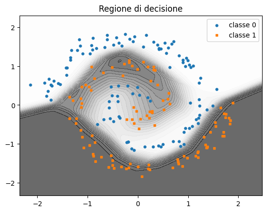
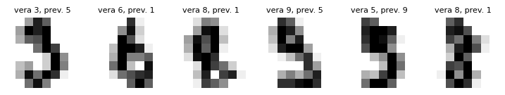
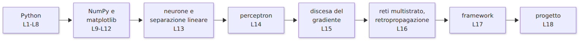

<!-- _class: titolo -->
<!-- _paginate: false -->

## Modulo 5 - Laboratorio finale

B.8 - Python per l'Intelligenza Artificiale

Lezione L18 - Mini progetto

---

## Organizzazione

- gruppi di 2 o 3 studenti, 35 minuti
- notebook `L18_progetto.ipynb` (JupyterLite o WinPython)
- consegna: `Restart Kernel and Run All Cells...`, poi `File`, `Download`

Obiettivo: il procedimento completo, dai dati alla relazione

---

## Due tracce

**A - Punti nel piano**: due spirali intrecciate; rete NumPy di L16 o `MLPClassifier`

**B - Cifre scritte a mano**: 1797 immagini 8 x 8; `MLPClassifier`

---

## Le fasi

1. dati
2. esplorazione
3. preparazione: normalizzazione, 70% addestramento e 30% verifica
4. almeno 3 configurazioni
5. valutazione: accuratezza, perdita, errori
6. relazione

---

## Esempi di risultati

 

---

## Domande guida per la relazione

- configurazione scelta e motivazione
- che cosa mostra la curva della perdita
- differenza tra accuratezza di addestramento e di verifica
- quali esempi il modello sbaglia e perché
- che cosa si potrebbe provare per migliorare

---

## Criteri di valutazione

| Dimensione | Livello pieno |
|---|---|
| correttezza del codice | notebook eseguibile dall'inizio alla fine, controlli superati |
| comprensione del modello | ruolo di strati, neuroni, attivazione, tasso di apprendimento, perdita |
| analisi dei risultati | almeno 3 configurazioni confrontate, perdita, addestramento e verifica, errori |
| comunicazione | relazione chiara, tabella completa, codice leggibile |

---

## Il percorso del corso

L4 soglia, L5 somma pesata, L6 funzione, L8 classe, L11 `W @ x + b`, L14 perceptron, L16 rete a due strati, L17 framework

---

## Per proseguire

- Kaggle Learn, Intro to Deep Learning: https://www.kaggle.com/learn/intro-to-deep-learning
- Microsoft, AI for Beginners (MIT): https://github.com/microsoft/AI-For-Beginners
- TensorFlow Playground: https://playground.tensorflow.org/
- corso B.6: dati, classificazione, valutazione dei modelli
