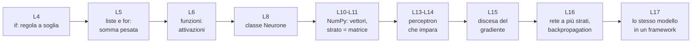
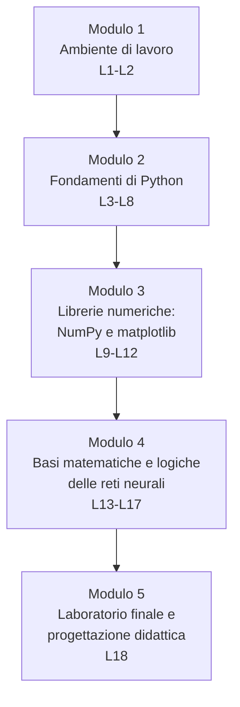
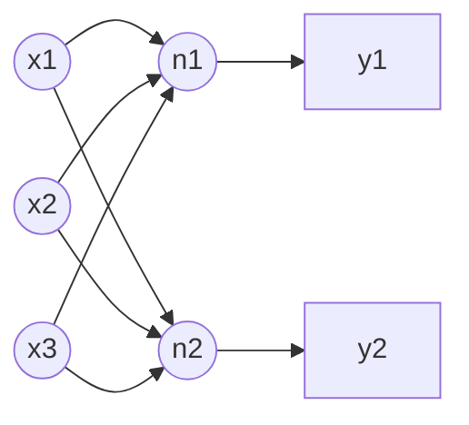
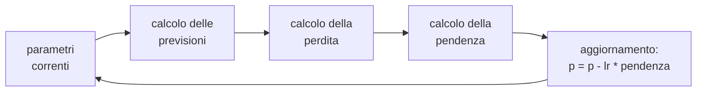

# B.8 - Python per l'Intelligenza Artificiale

## Scheda del corso

- Titolo: Linguaggio Python per il Machine Learning ed il Deep Learning: Python per l'Intelligenza Artificiale
- Tipo: corso tecnico di programmazione e di basi matematiche delle reti neurali
- Durata: 18 ore, articolate in 18 lezioni autonome di circa un'ora, raggruppabili in sessioni da 2, 3 o 4 ore
- Destinatari della traccia studenti: studenti di scuola secondaria di secondo grado, 16-18 anni
- Destinatari della traccia docenti: docenti che progettano e conducono il corso con la propria classe
- Prerequisiti di programmazione: nessuno
- Prerequisiti di matematica: equazioni di primo grado, piano cartesiano, retta, potenze; la funzione esponenziale è utile ma viene richiamata quando serve; derivate e matrici non sono richieste e vengono introdotte in forma operativa

## Obiettivi

Al termine del corso lo studente è in grado di:

- scrivere, eseguire e correggere programmi Python di piccole dimensioni in un editor/IDE e in un notebook Jupyter
- usare i costrutti fondamentali del linguaggio: tipi, variabili, condizioni, cicli, liste, dizionari, funzioni, classi, moduli
- usare NumPy per rappresentare vettori e matrici e per eseguire calcoli vettoriali
- usare matplotlib per rappresentare graficamente funzioni e dati
- descrivere e implementare un neurone artificiale: somma pesata, bias, funzione di attivazione
- spiegare e implementare l'apprendimento di un perceptron e la discesa del gradiente
- implementare in NumPy il calcolo in avanti (forward pass) di una piccola rete a più strati e descrivere il principio della retropropagazione (backpropagation)
- riconoscere nel codice di un framework di deep learning (Keras, PyTorch) gli stessi elementi implementati a mano

## Filo conduttore

Ogni costrutto Python viene introdotto nel punto in cui serve a costruire un pezzo del neurone artificiale. Il neurone compare già nelle prime lezioni come semplice regola a soglia e viene riscritto più volte con strumenti via via più potenti, fino alla rete a più strati.

Diagramma: evoluzione del neurone lungo il corso

## Ambiente di lavoro e vincoli tecnici

Tutti i laboratori sono eseguibili su PC di fascia bassa. Nessun laboratorio richiede privilegi di amministratore; per ogni attività sono previste almeno una modalità offline e, dove utile, una modalità online.

| Strumento | Tipo | Installazione | Uso nel corso |
|---|---|---|---|
| Thonny | IDE per principianti con Python incluso | installazione utente o versione portable (anche da chiavetta) | moduli 1 e 2: script, esecuzione passo passo, debugger |
| JupyterLite (Try Jupyter) | JupyterLab nel browser, Python eseguito localmente tramite WebAssembly | nessuna, solo browser | moduli 1-4: notebook con NumPy e matplotlib senza installare nulla |
| WinPython | distribuzione Python portable per Windows con JupyterLab, NumPy, matplotlib, scikit-learn | nessuna: si scompatta, anche su chiavetta | alternativa offline completa per i notebook |
| Google Colab | notebook Jupyter su server remoto | nessuna, richiede account Google e connessione | modulo 4: solo per l'esempio con framework di deep learning (L17) |
| TensorFlow Playground | simulatore visuale di reti neurali nel browser | nessuna | modulo 4: esplorazione visuale (L16-L17) |

Riferimenti:

- Thonny, Python IDE for beginners: https://thonny.org/
- Try Jupyter (JupyterLite): https://jupyter.org/try-jupyter/lab/
- Progetto JupyterLite: https://github.com/jupyterlite/jupyterlite
- Pacchetti disponibili in Pyodide (motore Python di JupyterLite): https://pyodide.org/en/stable/usage/packages-in-pyodide.html
- WinPython: https://winpython.github.io/
- Google Colab, notebook introduttivo: https://colab.research.google.com/notebooks/intro.ipynb
- TensorFlow Playground: https://playground.tensorflow.org/

Scelte relative alle librerie di deep learning: PyTorch e TensorFlow non vengono installati sui PC del laboratorio (dimensioni di diversi GB, requisiti hardware). Il loro uso è limitato a una dimostrazione in Colab; l'equivalente offline è `MLPClassifier` di scikit-learn, già presente in WinPython e in JupyterLite.

Tutti i notebook del corso sono forniti sia come link Colab sia come file `.ipynb` locali, apribili in JupyterLite o in WinPython.

## Struttura in moduli

Diagramma: moduli e dipendenze

| Modulo | Lezioni | Ore | Contenuto |
|---|---|---|---|
| 1. Ambiente di lavoro | L1-L2 | 2 | interpreti, editor, IDE, notebook |
| 2. Fondamenti di Python | L3-L8 | 6 | sintassi, strutture dati, funzioni, classi |
| 3. Librerie numeriche | L9-L12 | 4 | pacchetti, NumPy, algebra lineare operativa, matplotlib |
| 4. Basi delle reti neurali | L13-L17 | 5 | neurone, perceptron, gradiente, rete multistrato, framework |
| 5. Laboratorio finale | L18 | 1 | mini progetto, valutazione, progettazione didattica |

## Programma delle lezioni

Ogni lezione dura circa un'ora ed è composta da una parte di spiegazione con dimostrazione dal vivo e da una parte di laboratorio (indicata tra parentesi). Le indicazioni "Traccia docenti" identificano i contenuti di progettazione didattica collegati alla lezione, trattati nei file `_docente.md`.

### Modulo 1 - Ambiente di lavoro

#### L1 - Programmi, interpreti, editor e IDE

Contenuti:

- programma, linguaggio di programmazione, codice sorgente
- linguaggi compilati e interpretati; l'interprete Python
- Python: caratteristiche, versioni, diffusione nell'IA
- modalità interattiva (REPL, prompt `>>>`) e script (file `.py`)
- editor di testo e IDE: differenze, funzioni tipiche (evidenziazione della sintassi, completamento, esecuzione, debugger)
- panoramica: IDLE, Thonny, Visual Studio Code, PyCharm, Spyder, JupyterLab
- Thonny: finestre principali, shell, editor, esecuzione, pannello variabili

Laboratorio (25 min): avvio di Thonny portable; istruzioni nella shell; primo script con `print()`; lettura di un messaggio di errore.

#### L2 - Notebook Jupyter: JupyterLite, WinPython, Colab

Contenuti:

- notebook: celle di codice e celle di testo (Markdown), output, kernel e stato del kernel
- ordine di esecuzione delle celle e problemi tipici (variabili definite in celle non eseguite, riavvio del kernel)
- file `.ipynb`: salvataggio, download, apertura in ambienti diversi
- tre modi di eseguire un notebook: nel browser (JupyterLite), in locale da chiavetta (WinPython), su server remoto (Colab); vantaggi e limiti di ciascuno
- quando usare uno script e quando un notebook

Laboratorio (25 min): apertura dello stesso notebook in JupyterLite e in WinPython; celle di codice e Markdown; riavvio del kernel e osservazione degli effetti.

Traccia docenti: scelta dell'ambiente in base al laboratorio disponibile; piano B in caso di rete assente; distribuzione dei materiali.

### Modulo 2 - Fondamenti di Python

#### L3 - Valori, tipi, variabili, espressioni

Contenuti:

- tipi `int`, `float`, `str`, `bool`; funzione `type()`
- variabili e assegnazione; convenzioni sui nomi
- operatori aritmetici (`+ - * / // % **`), precedenza
- numeri in virgola mobile: approssimazione e arrotondamento (`0.1 + 0.2`), rilevanza per il calcolo numerico
- stringhe: concatenazione, f-string, `input()` e conversioni (`int()`, `float()`)
- modulo `math`: `math.sqrt`, `math.exp`

Laboratorio (25 min): calcolatrice di formule (area, media, conversioni); calcolo di `math.exp(x)` per diversi valori di `x`.

#### L4 - Decisioni e ripetizioni

Contenuti:

- operatori di confronto e operatori logici `and`, `or`, `not`
- `if`, `elif`, `else`; indentazione come elemento della sintassi
- ciclo `while`; condizione di uscita; cicli infiniti
- primo modello di neurone: regola a soglia "se la somma supera la soglia, l'uscita vale 1"

Laboratorio (25 min): regola a soglia con due ingressi; tabella di verità di AND e OR calcolata dal programma.

#### L5 - Liste e ciclo for

Contenuti:

- liste: creazione, indici, indici negativi, `len()`, slicing
- modifica di liste: `append`, assegnazione per indice
- ciclo `for` su una lista; `range()`; `enumerate()` e `zip()`
- schemi di calcolo con accumulatore: somma, media, massimo
- somma pesata di due liste (ingressi e pesi): prodotto scalare calcolato a mano

Laboratorio (30 min): statistiche su una lista di misure; somma pesata di ingressi e pesi; neurone a soglia con numero qualsiasi di ingressi.

#### L6 - Funzioni

Contenuti:

- definizione con `def`, parametri, valore di ritorno, `return`
- variabili locali e globali
- parametri con valore predefinito; docstring
- funzioni di attivazione: gradino, sigmoide, ReLU, tangente iperbolica
- funzioni come valori: passare una funzione di attivazione come parametro

Laboratorio (30 min): implementazione delle funzioni di attivazione; funzione `neurone(ingressi, pesi, bias, attivazione)`; tabella dei valori della sigmoide.

#### L7 - Dizionari, tuple, comprehension, moduli, errori

Contenuti:

- tuple e dizionari: creazione, accesso, iterazione
- list comprehension
- moduli: `import`, `from ... import`, alias (`import numpy as np` come anticipazione)
- scrittura di un proprio modulo `.py`
- errori di sintassi ed eccezioni; lettura del traceback; `try`/`except`
- debug in Thonny: esecuzione passo passo, ispezione delle variabili

Laboratorio (25 min): correzione guidata di programmi con errori; conteggio delle parole di un testo con un dizionario.

#### L8 - Classi e oggetti

Contenuti:

- oggetto, classe, istanza, attributo, metodo
- `class`, `__init__`, `self`
- metodi che modificano lo stato dell'oggetto
- motivazione: i framework di deep learning rappresentano modelli e strati come oggetti
- classe `Neurone` con attributi `pesi` e `bias` e metodo `calcola(ingressi)`

Laboratorio (25 min): classe `Neurone`; creazione di più neuroni con pesi diversi; neurone che realizza AND e neurone che realizza OR.

Traccia docenti: gestione dell'eterogeneità dei livelli in un corso di programmazione; esercizi a difficoltà graduata; lettura degli errori come attività didattica.

### Modulo 3 - Librerie numeriche

#### L9 - Pacchetti e array NumPy

Contenuti:

- libreria, pacchetto, repository PyPI, `pip` e installazione in modalità utente; ambienti virtuali (concetto)
- ecosistema Python per l'IA: NumPy, pandas, matplotlib, scikit-learn, PyTorch, TensorFlow/Keras; ruolo di ciascuno
- array NumPy: creazione (`np.array`, `np.zeros`, `np.ones`, `np.arange`, `np.linspace`), `dtype`, `shape`, `ndim`
- indicizzazione e slicing di array a una e due dimensioni

Laboratorio (25 min): creazione e ispezione di array; estrazione di righe, colonne, sotto-matrici.

Riferimento: NumPy, the absolute basics for beginners: https://numpy.org/doc/stable/user/absolute_beginners.html

#### L10 - Calcolo vettoriale con NumPy

Contenuti:

- operazioni elemento per elemento; funzioni universali (`np.exp`, `np.sqrt`, `np.maximum`)
- broadcasting: regole essenziali ed esempi
- aggregazioni: `sum`, `mean`, `max`, `argmax`, parametro `axis`
- numeri casuali: `np.random.default_rng`, distribuzione uniforme e normale, seme
- confronto di velocità tra ciclo su lista e operazione vettoriale (`%timeit` nei notebook)

Laboratorio (30 min): sigmoide e ReLU vettoriali; normalizzazione di un insieme di misure; confronto di tempi.

#### L11 - Vettori e matrici: algebra lineare operativa

Contenuti:

- vettore come elenco ordinato di numeri e come freccia nel piano
- prodotto scalare (`np.dot`, operatore `@`) e sua interpretazione come somma pesata
- matrice come tabella di numeri; forma (righe, colonne); trasposta
- prodotto matrice-vettore e matrice-matrice; compatibilità delle forme
- uno strato di neuroni come matrice dei pesi: `uscite = attivazione(W @ x + b)`

Diagramma di riferimento per la lezione: tre ingressi, due neuroni, matrice dei pesi 2x3

Laboratorio (30 min): riscrittura del neurone di L6 con `@`; strato di due neuroni con una sola riga di codice; esercizi sulle forme degli array.

#### L12 - Grafici con matplotlib

Contenuti:

- struttura di un grafico: figura, assi, titolo, etichette, legenda
- `plt.plot` per funzioni, `plt.scatter` per punti, `plt.hist` per distribuzioni
- grafici delle funzioni di attivazione
- insiemi di punti sintetici in due classi generati con NumPy e loro rappresentazione a colori
- retta di separazione disegnata sopra i punti

Laboratorio (30 min): grafico comparativo delle funzioni di attivazione; nuvole di punti in due classi con retta di separazione scelta a mano.

Riferimento: Matplotlib, Quick start guide: https://matplotlib.org/stable/users/explain/quick_start.html

Traccia docenti: notebook come strumento didattico (celle guidate, celle da completare, test con `assert`); versioni online e offline dello stesso materiale.

### Modulo 4 - Basi matematiche e logiche delle reti neurali

#### L13 - Il neurone artificiale e la separazione lineare

Contenuti:

- neurone biologico e neurone artificiale: analogia e limiti dell'analogia
- modello: ingressi, pesi, bias, somma pesata, attivazione
- interpretazione geometrica: il neurone a soglia divide il piano con una retta
- AND, OR, NOT con pesi scelti a mano
- il problema XOR: non esiste una retta che separi le due classi

Laboratorio (25 min): ricerca manuale dei pesi per AND e OR con verifica grafica; tentativo sistematico per XOR.

#### L14 - Il perceptron che impara

Contenuti:

- apprendimento come modifica automatica dei pesi a partire da esempi
- regola di apprendimento del perceptron: errore, aggiornamento dei pesi, tasso di apprendimento
- epoche; convergenza per problemi linearmente separabili
- implementazione in NumPy
- visualizzazione della retta di separazione durante l'addestramento

Laboratorio (30 min): perceptron addestrato su AND/OR e su punti sintetici; variazione del tasso di apprendimento e del numero di epoche.

#### L15 - Errore e discesa del gradiente

Contenuti:

- funzione di perdita: errore quadratico medio (MSE)
- pendenza di una curva come rapporto incrementale; stima numerica della pendenza con Python
- derivata come pendenza nel punto (introduzione operativa)
- discesa del gradiente in una variabile: passo, tasso di apprendimento, divergenza e convergenza
- estensione a due variabili (peso e bias) e curva della perdita durante l'addestramento

Diagramma di riferimento: ciclo della discesa del gradiente

Laboratorio (30 min): minimo di una parabola con discesa del gradiente; adattamento di una retta a punti rumorosi; effetto del tasso di apprendimento con grafici.

#### L16 - Reti a più strati e retropropagazione

Contenuti:

- rete a due strati: strato nascosto e strato di uscita; forward pass con due prodotti matriciali
- perché serve la non linearità: una rete di soli strati lineari equivale a un solo strato
- soluzione di XOR con uno strato nascosto
- retropropagazione: grafo di calcolo e regola della catena presentati in forma intuitiva; l'errore si propaga all'indietro strato per strato
- iperparametri: numero di neuroni nascosti, tasso di apprendimento, epoche
- esplorazione con TensorFlow Playground

Laboratorio (30 min): rete NumPy fornita (circa 40 righe commentate) per XOR e per un insieme di punti a spirale o a mezzaluna; modifica degli iperparametri e confronto dei risultati; confronto con TensorFlow Playground.

#### L17 - Dal codice scritto a mano ai framework

Contenuti:

- cosa automatizza un framework: tensori, calcolo automatico del gradiente, strati predefiniti, ottimizzatori
- panoramica di PyTorch e Keras; perché non si installano su PC di fascia bassa
- la stessa rete di L16 in scikit-learn (`MLPClassifier`, offline) e in Keras o PyTorch (Colab)
- corrispondenza riga per riga tra codice NumPy e codice del framework
- cenni su dati di addestramento e di verifica (approfonditi nel corso B.6)

Laboratorio (25 min): addestramento di `MLPClassifier` in JupyterLite o WinPython; esecuzione del notebook Keras/PyTorch in Colab (dimostrazione guidata dove la connessione lo consente).

Traccia docenti: gestione della matematica con studenti di terzo e quarto anno; uso di simulatori visuali prima del codice; rischi dell'approccio "scatola nera".

### Modulo 5 - Laboratorio finale

#### L18 - Mini progetto e progettazione didattica

Parte studenti (35 min): mini progetto a gruppi su un insieme di punti sintetici o sul dataset di cifre scritte a mano 8x8 incluso in scikit-learn: preparazione dei dati con NumPy, addestramento della rete NumPy o di `MLPClassifier`, grafico della perdita, breve relazione in una cella Markdown.

Parte docenti (25 min): rubrica di valutazione del mini progetto; adattamento del corso ad altri monte ore; collegamenti con i corsi B.6 e B.4.

## Materiali prodotti per ciascun argomento

Per ogni modulo vengono prodotti:

- `B8_Mn_<argomento>_lezione.md`: testo delle lezioni (formato A4)
- `B8_Mn_<argomento>_marp.md`: presentazione MARP
- `B8_Mn_<argomento>_prezpdoc.md`: presentazione Pandoc (compatibile, dove possibile, con reveal.js)
- `B8_Mn_<argomento>_docente.md`: traccia docenti del modulo
- notebook `.ipynb` locali e relativi link Colab; script `.py` per le lezioni svolte in Thonny

## Valutazione

- formativa, a ogni lezione: esercizi di laboratorio con verifiche automatiche (`assert`) nei notebook
- di modulo: breve esercizio di verifica al termine dei moduli 2, 3 e 4
- finale: mini progetto di L18, valutato con rubrica (correttezza del codice, comprensione del modello, analisi dei risultati, comunicazione)

## Rapporti con gli altri corsi del programma

- B.6 "Data science e Machine Learning": B.8 fornisce le basi di Python, NumPy e matplotlib e la comprensione interna del neurone; B.6 tratta raccolta e preparazione dei dataset, pandas, algoritmi di classificazione, suddivisione in dati di addestramento e di verifica, metriche di valutazione. B.8 non approfondisce questi temi.
- B.4 "Cybersicurezza e IA": nessuna sovrapposizione di contenuti; alcuni esercizi di programmazione del modulo 2 (per esempio controllo della robustezza di una password con stringhe, cicli e dizionari) possono essere usati come esercizi ponte.

## Risorse di riferimento

- Tutorial ufficiale di Python in italiano: https://docs.python.org/it/3/tutorial/
- Python ABC, Python Italia: https://pythonitalia.github.io/python-abc/
- NumPy, the absolute basics for beginners: https://numpy.org/doc/stable/user/absolute_beginners.html
- Matplotlib, Quick start guide: https://matplotlib.org/stable/users/explain/quick_start.html
- Microsoft, AI for Beginners (curriculum open source): https://github.com/microsoft/AI-For-Beginners
- Kaggle Learn, Intro to Deep Learning: https://www.kaggle.com/learn/intro-to-deep-learning
- TensorFlow Playground: https://playground.tensorflow.org/
